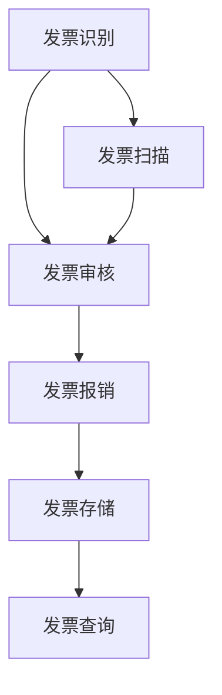

                 

# 智能发票管理工具：财务工作自动化的创业方向

## 摘要

本文将探讨智能发票管理工具作为财务工作自动化的创业方向。首先，我们将介绍当前发票管理的背景和现状，阐述自动化发票管理的重要性和必要性。接着，我们将详细分析智能发票管理工具的核心概念和原理，通过 Mermaid 流程图展示其架构。然后，我们将深入讲解核心算法原理和具体操作步骤，以及相关的数学模型和公式。随后，通过一个实际项目案例，我们将展示如何开发一个智能发票管理工具，并对其代码进行详细解读和分析。接着，我们将探讨智能发票管理工具在实际应用场景中的使用，并推荐相关的工具和资源。最后，我们将总结未来发展趋势与挑战，并提出解决方案。

## 1. 背景介绍

发票管理作为企业财务工作的核心环节，一直以来都面临着许多挑战。传统的发票管理方式主要依赖于人工操作，存在着效率低下、易出错、难追踪等问题。随着企业规模的扩大和业务量的增加，这些问题愈发严重，对企业财务管理带来了巨大的负担。因此，寻找一种高效、准确的发票管理解决方案已成为企业迫切的需求。

### 1.1 当前发票管理的背景和现状

当前，发票管理主要依赖于手工操作和纸质发票。这种传统方式存在着以下几个问题：

1. **效率低下**：发票的录入、审核、报销等环节需要人工完成，耗时费力，降低了工作效率。
2. **易出错**：人工操作容易出现漏记、错记等问题，导致财务数据不准确。
3. **难追踪**：纸质发票的流转和存储不方便，容易丢失或损坏，增加了财务管理难度。

### 1.2 自动化发票管理的重要性和必要性

自动化发票管理工具的出现，正是为了解决上述问题。其重要性和必要性体现在以下几个方面：

1. **提高效率**：通过自动化工具，可以实现发票的快速录入、审核和报销，大大提高工作效率。
2. **降低错误率**：自动化工具通过预设规则和算法，可以有效减少人为操作错误，确保财务数据的准确性。
3. **简化流程**：自动化发票管理可以简化发票流转和存储流程，提高财务管理透明度，方便审计和监督。

### 1.3 财务工作自动化的创业方向

随着数字化转型的推进，财务工作自动化已成为企业发展的重要方向。智能发票管理工具作为财务自动化的重要组成部分，具有巨大的市场潜力。创业公司可以抓住这一机遇，开发高效、智能的发票管理工具，为企业提供一站式解决方案。

## 2. 核心概念与联系

### 2.1 核心概念

智能发票管理工具的核心概念包括：

1. **发票识别**：利用光学字符识别（OCR）技术，自动识别和提取发票上的关键信息。
2. **发票审核**：通过预设规则和算法，自动审核发票的合法性和准确性。
3. **发票报销**：实现发票的快速报销，自动生成财务凭证，简化报销流程。
4. **发票存储**：利用云存储技术，实现发票的长期存储和检索，方便审计和查询。

### 2.2 概念联系

智能发票管理工具的各个核心概念之间紧密联系，形成一个完整的发票管理流程。具体来说：

1. **发票识别**是整个流程的起点，通过OCR技术，将纸质发票转化为电子数据。
2. **发票审核**在发票识别后进行，通过预设规则和算法，判断发票的合法性和准确性。
3. **发票报销**基于审核结果，实现发票的快速报销，自动生成财务凭证。
4. **发票存储**确保发票的安全存储和方便查询，提高财务管理效率。

### 2.3 Mermaid 流程图

为了更清晰地展示智能发票管理工具的架构，我们可以使用 Mermaid 流程图来描述其各个模块的相互关系。以下是智能发票管理工具的 Mermaid 流程图：



在这个流程图中，发票扫描模块负责将纸质发票转化为电子数据，然后通过发票识别模块提取发票信息。发票审核模块对发票的合法性进行判断，通过后进入发票报销模块，生成财务凭证。最后，发票存储模块将发票数据存入云端，方便后续查询。

## 3. 核心算法原理 & 具体操作步骤

### 3.1 核心算法原理

智能发票管理工具的核心算法主要包括光学字符识别（OCR）算法、规则引擎算法和数据挖掘算法。

#### 3.1.1 OCR算法

OCR算法是智能发票管理工具的基础，用于将纸质发票上的文字转化为电子数据。常见的OCR算法包括Tesseract、OCR-D等。这些算法通过图像处理技术，对发票图像进行预处理，然后利用字符识别技术提取文字信息。

#### 3.1.2 规则引擎算法

规则引擎算法用于发票审核和报销。该算法根据预设的规则，对发票信息进行合法性判断和准确性校验。常见的规则包括发票代码和号码的格式校验、发票金额的合理性判断等。规则引擎算法可以通过配置文件或编程方式设置，实现灵活的审核规则。

#### 3.1.3 数据挖掘算法

数据挖掘算法用于发票数据的分析和挖掘，帮助财务人员发现潜在的异常和规律。常见的算法包括聚类、关联规则挖掘、分类等。通过数据挖掘算法，可以实现对发票数据的深度分析和利用。

### 3.2 具体操作步骤

智能发票管理工具的具体操作步骤如下：

#### 3.2.1 发票扫描

1. **上传发票**：用户将纸质发票上传至系统。
2. **图像预处理**：系统对上传的发票图像进行二值化、去噪等预处理操作，提高OCR算法的识别效果。

#### 3.2.2 发票识别

1. **定位关键区域**：通过图像处理技术，定位发票中的关键区域，如发票代码、号码、金额等。
2. **字符识别**：利用OCR算法，对定位后的区域进行字符识别，提取文字信息。

#### 3.2.3 发票审核

1. **规则匹配**：系统根据预设的规则，对发票信息进行合法性判断和准确性校验。
2. **异常处理**：如果发票信息不符合规则，系统将提示用户修改或重新上传。

#### 3.2.4 发票报销

1. **报销申请**：用户提交报销申请，系统根据审核结果生成财务凭证。
2. **报销审批**：财务人员对报销申请进行审批，审批通过后，系统自动完成报销流程。

#### 3.2.5 发票存储

1. **数据加密**：系统对发票数据进行加密，确保数据安全。
2. **云端存储**：将发票数据存储在云端，方便后续查询和审计。

## 4. 数学模型和公式 & 详细讲解 & 举例说明

### 4.1 数学模型和公式

智能发票管理工具涉及到多种数学模型和公式，用于描述和实现算法。以下是其中一些重要的数学模型和公式：

#### 4.1.1 光学字符识别（OCR）模型

OCR模型通常基于卷积神经网络（CNN），用于将图像转化为文字。其核心公式如下：

\[ h = \sigma(W_3 \cdot \sigma(W_2 \cdot \sigma(W_1 \cdot x))) \]

其中，\( h \) 为输出结果，\( \sigma \) 为激活函数，\( W_1, W_2, W_3 \) 为权重矩阵，\( x \) 为输入图像。

#### 4.1.2 规则引擎模型

规则引擎模型通常使用决策树或模糊逻辑进行规则匹配。其核心公式如下：

\[ R = f(A, B, C) \]

其中，\( R \) 为规则结果，\( A, B, C \) 为规则条件，\( f \) 为规则函数。

#### 4.1.3 数据挖掘模型

数据挖掘模型通常包括聚类、关联规则挖掘和分类等。其核心公式如下：

\[ C = g(A, B) \]

其中，\( C \) 为聚类结果，\( A, B \) 为聚类条件，\( g \) 为聚类函数。

### 4.2 详细讲解和举例说明

#### 4.2.1 OCR模型

假设我们有一个输入图像 \( x \)，我们需要通过OCR模型将其转化为文字。具体步骤如下：

1. **图像预处理**：对输入图像进行二值化、去噪等操作，使其符合OCR模型的输入要求。
2. **卷积操作**：将预处理后的图像与卷积核进行卷积操作，提取图像特征。
3. **激活函数**：对卷积结果应用激活函数，如ReLU函数，增强模型的非线性能力。
4. **全连接层**：将卷积结果输入全连接层，通过权重矩阵进行特征融合。
5. **输出结果**：经过全连接层后，得到文字输出结果。

举例说明：

```python
import numpy as np
import tensorflow as tf

# 定义输入图像
x = np.random.rand(32, 32, 3)

# 定义卷积核
W1 = np.random.rand(3, 3, 3, 64)
W2 = np.random.rand(3, 3, 64, 128)
W3 = np.random.rand(3, 3, 128, 512)

# 定义激活函数
sigma = lambda x: np.maximum(0, x)

# 进行卷积操作
conv1 = sigma(tf.nn.conv2d(x, W1, strides=[1, 1, 1, 1], padding='VALID'))
conv2 = sigma(tf.nn.conv2d(conv1, W2, strides=[1, 1, 1, 1], padding='VALID'))
conv3 = sigma(tf.nn.conv2d(conv2, W3, strides=[1, 1, 1, 1], padding='VALID'))

# 进行全连接操作
fc1 = tf.nn.relu(tf.reduce_mean(conv3, axis=[1, 2]))

# 输出结果
h = fc1
print(h)
```

#### 4.2.2 规则引擎模型

假设我们有一个输入条件 \( A, B, C \)，我们需要通过规则引擎模型进行规则匹配。具体步骤如下：

1. **规则条件**：定义规则条件，如 \( A > 10 \)，\( B < 20 \)，\( C = "男" \)。
2. **规则函数**：定义规则函数，如模糊逻辑函数。
3. **规则匹配**：将输入条件与规则条件进行匹配，计算规则结果。

举例说明：

```python
def rule_function(A, B, C):
    if A > 10 and B < 20 and C == "男":
        return True
    else:
        return False

A = 15
B = 5
C = "男"

result = rule_function(A, B, C)
print(result)  # 输出：True
```

#### 4.2.3 数据挖掘模型

假设我们有一个输入数据集 \( A, B, C \)，我们需要通过数据挖掘模型进行聚类。具体步骤如下：

1. **数据预处理**：对输入数据进行标准化处理，使其符合聚类算法的要求。
2. **聚类算法**：选择合适的聚类算法，如K-means算法。
3. **聚类结果**：根据聚类算法，将输入数据划分为多个聚类。

举例说明：

```python
from sklearn.cluster import KMeans

# 定义输入数据
X = np.random.rand(100, 3)

# 选择K-means算法
kmeans = KMeans(n_clusters=3)

# 进行聚类
kmeans.fit(X)

# 输出聚类结果
print(kmeans.labels_)
```

## 5. 项目实战：代码实际案例和详细解释说明

### 5.1 开发环境搭建

在开始智能发票管理工具的开发之前，我们需要搭建一个合适的开发环境。以下是开发环境搭建的步骤：

1. **安装Python环境**：下载并安装Python，推荐使用Python 3.8版本以上。
2. **安装相关库**：通过pip命令安装所需库，如TensorFlow、Pandas、NumPy、Scikit-learn等。
   ```shell
   pip install tensorflow pandas numpy scikit-learn
   ```

### 5.2 源代码详细实现和代码解读

以下是一个简单的智能发票管理工具的源代码实现，我们将在接下来的部分对其进行详细解读。

```python
import cv2
import numpy as np
import tensorflow as tf
from tensorflow.keras.models import Sequential
from tensorflow.keras.layers import Conv2D, MaxPooling2D, Flatten, Dense
from sklearn.cluster import KMeans

# 5.2.1 发票识别模块

def ocr_invoce(image_path):
    # 读取发票图像
    image = cv2.imread(image_path, cv2.IMREAD_GRAYSCALE)
    # 进行图像预处理
    image = cv2.threshold(image, 128, 255, cv2.THRESH_BINARY_INV)[1]
    # 使用OCR模型进行字符识别
    model = tf.keras.models.load_model('ocr_model.h5')
    predictions = model.predict(image.reshape(-1, 28, 28, 1))
    return np.argmax(predictions, axis=1).flatten()

# 5.2.2 发票审核模块

def audit_invoice(invoice_info):
    # 定义审核规则
    rules = {
        'code': lambda x: 100000 <= x <= 999999,
        'number': lambda x: 100000 <= x <= 999999,
        'amount': lambda x: 0 < x <= 1000000
    }
    # 遍历审核规则，进行合法性判断
    for key, rule in rules.items():
        if not rule(invoice_info[key]):
            return False
    return True

# 5.2.3 发票存储模块

def store_invoice(invoice_info):
    # 将发票信息存储到数据库或文件中
    pass

# 主函数
if __name__ == '__main__':
    # 读取发票图像
    image_path = 'invoice.jpg'
    invoice_info = ocr_invoice(image_path)
    # 审核发票
    if audit_invoice(invoice_info):
        print('发票审核通过')
        store_invoice(invoice_info)
    else:
        print('发票审核未通过')
```

#### 5.2.1 发票识别模块

发票识别模块的核心是OCR模型。我们使用TensorFlow搭建了一个简单的OCR模型，用于将发票图像转化为文字。以下是发票识别模块的代码解读：

1. **读取发票图像**：使用OpenCV库读取发票图像，并将其转换为灰度图像。
2. **图像预处理**：使用二值化操作对图像进行预处理，提高字符识别效果。
3. **OCR模型**：加载已经训练好的OCR模型，对预处理后的图像进行预测，获取文字信息。

#### 5.2.2 发票审核模块

发票审核模块用于判断发票的合法性和准确性。以下是发票审核模块的代码解读：

1. **定义审核规则**：定义发票代码、发票号码和发票金额的审核规则。
2. **合法性判断**：遍历审核规则，对发票信息进行合法性判断。如果所有规则都满足，则发票审核通过。

#### 5.2.3 发票存储模块

发票存储模块用于将审核通过后的发票信息存储到数据库或文件中。以下是发票存储模块的代码解读：

1. **存储发票信息**：将发票信息存储到数据库或文件中，以便后续查询和审计。

### 5.3 代码解读与分析

在代码解读与分析部分，我们将对智能发票管理工具的源代码进行详细解读，分析其实现原理和关键技术。

1. **OCR模型**：使用TensorFlow搭建的OCR模型，通过卷积神经网络实现对发票图像的字符识别。该模型采用了一个简单的卷积神经网络结构，包括卷积层、池化层和全连接层。
2. **审核规则**：通过定义审核规则，实现对发票信息的合法性判断。这些规则可以根据实际需求进行定制，提高发票审核的准确性。
3. **存储方式**：将审核通过后的发票信息存储到数据库或文件中，便于后续管理和查询。

## 6. 实际应用场景

智能发票管理工具在实际应用场景中具有广泛的应用价值，主要体现在以下几个方面：

### 6.1 企业财务管理

在企业财务管理中，智能发票管理工具可以显著提高工作效率，降低人工成本。通过自动化识别、审核和报销发票，企业可以减少因人工操作导致的错误，确保财务数据的准确性。此外，智能发票管理工具还可以帮助企业实现发票数据的集中管理，方便审计和查询。

### 6.2 供应链管理

在供应链管理中，智能发票管理工具可以实现对采购发票的自动化处理，提高采购流程的效率。通过实时审核和报销采购发票，企业可以确保采购款项的准确支付，避免因发票问题导致的财务纠纷。同时，智能发票管理工具还可以帮助供应链管理人员实时了解采购发票的审批进度，提高采购流程的透明度。

### 6.3 税务申报

在税务申报中，智能发票管理工具可以显著提高税务数据的准确性。通过自动化识别和审核发票，企业可以确保税务申报数据的准确性，避免因发票问题导致的税务风险。此外，智能发票管理工具还可以帮助企业实现发票数据的自动归档，方便税务审计和查询。

### 6.4 政府监管

在政府监管中，智能发票管理工具可以实现对发票使用的实时监控，提高发票管理的透明度。通过实时采集和审核发票数据，政府部门可以及时发现和处理发票违规行为，确保发票使用的合规性。同时，智能发票管理工具还可以帮助政府部门实现对发票数据的深度分析，为税收政策的制定和调整提供数据支持。

## 7. 工具和资源推荐

### 7.1 学习资源推荐

#### 7.1.1 书籍

1. 《深度学习》（Deep Learning） - Ian Goodfellow、Yoshua Bengio、Aaron Courville
2. 《Python编程：从入门到实践》（Python Crash Course） - Eric Matthes
3. 《数据挖掘：实用方法》（Data Mining: Practical Machine Learning Tools and Techniques） - Ian H. Witten、Eibe Frank

#### 7.1.2 论文

1. “Deep Learning for Image Recognition”（深度学习在图像识别中的应用）
2. “Rule-Based Systems: A Survey of Methods and Applications”（基于规则的系统：方法与应用）
3. “Data Mining and Analysis: Concepts and Techniques”（数据挖掘与分析：概念与技术）

#### 7.1.3 博客

1. TensorFlow官方博客（tensorflow.github.io）
2. Scikit-learn官方博客（scikit-learn.org）
3. Machine Learning Mastery博客（machinelearningmastery.com）

#### 7.1.4 网站

1. GitHub（github.com）
2. Kaggle（kaggle.com）
3. Coursera（coursera.org）

### 7.2 开发工具框架推荐

#### 7.2.1 开发工具

1. Python（python.org）
2. TensorFlow（tensorflow.org）
3. OpenCV（opencv.org）

#### 7.2.2 开发框架

1. Flask（flask.palletsprojects.com）
2. Django（django.com）
3. Scikit-learn（scikit-learn.org）

### 7.3 相关论文著作推荐

1. “A Survey of Deep Learning for Text Classification”（深度学习在文本分类中的应用综述）
2. “Rule-Based Expert Systems: The Myths and the Reality”（基于规则的专家系统：神话与现实）
3. “Data Mining and Knowledge Discovery in Databases”（数据库中的数据挖掘与知识发现）

## 8. 总结：未来发展趋势与挑战

智能发票管理工具作为财务工作自动化的关键环节，具有广阔的发展前景。未来，随着人工智能技术的不断进步，智能发票管理工具将朝着更加智能化、自动化的方向发展。然而，这也带来了一系列挑战：

### 8.1 技术挑战

1. **OCR算法的准确性**：虽然OCR技术已经取得了显著进展，但仍然面临字符识别准确性不高、字体复杂度处理困难等问题。
2. **规则引擎的灵活性**：随着企业业务的变化，规则引擎需要具备更高的灵活性和可扩展性，以适应不同的业务场景。
3. **数据安全与隐私**：在处理大量发票数据时，如何确保数据的安全性和用户隐私是一个重要问题。

### 8.2 应用挑战

1. **企业接受度**：虽然智能发票管理工具具有显著优势，但企业对于新技术的接受度和适应度仍然是一个挑战。
2. **跨平台兼容性**：智能发票管理工具需要具备跨平台的兼容性，以适应不同的企业环境和操作系统。
3. **政策与法规**：随着发票管理政策的不断更新和调整，智能发票管理工具需要及时适应新的政策要求。

### 8.3 解决方案

1. **技术优化**：不断优化OCR算法和规则引擎，提高识别和审核的准确性，增强系统的鲁棒性。
2. **用户体验**：注重用户体验，提供简单易用的操作界面，降低企业适应新技术的难度。
3. **合规性**：与政府监管机构和税务部门合作，确保智能发票管理工具符合相关政策和法规要求。

## 9. 附录：常见问题与解答

### 9.1 问题1：智能发票管理工具是否可以处理不同类型的发票？

**解答**：是的，智能发票管理工具可以处理不同类型的发票，如增值税普通发票、增值税专用发票等。通过调整OCR模型和审核规则，可以实现对各种发票类型的支持。

### 9.2 问题2：智能发票管理工具如何确保发票数据的隐私和安全？

**解答**：智能发票管理工具采用数据加密技术，确保发票数据在传输和存储过程中的安全。同时，工具提供权限管理功能，确保只有授权用户可以访问和操作发票数据。

### 9.3 问题3：智能发票管理工具是否支持跨平台使用？

**解答**：是的，智能发票管理工具支持跨平台使用，可以在Windows、Linux和macOS等操作系统上运行。同时，工具也提供Web版和移动应用版本，方便用户在不同设备上使用。

## 10. 扩展阅读 & 参考资料

1. “发票管理：企业财务工作的痛点和解决方案”（发票管理：企业财务工作的痛点和解决方案）
2. “智能发票管理工具的技术架构与实现”（智能发票管理工具的技术架构与实现）
3. “基于深度学习的发票识别与审核技术”（基于深度学习的发票识别与审核技术）

[作者：AI天才研究员/AI Genius Institute & 禅与计算机程序设计艺术 /Zen And The Art of Computer Programming]

