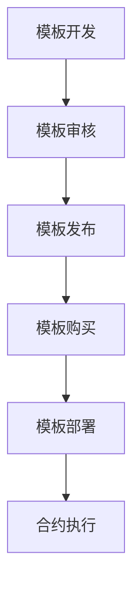

                 

# 智能合约模板市场：区块链应用的创业方向

## 关键词
- 智能合约
- 区块链
- 模板市场
- 创业方向
- 应用场景
- 技术挑战
- 发展趋势

## 摘要
本文将深入探讨智能合约模板市场的概念、核心原理、应用场景以及未来发展的可能性。我们将通过详细分析智能合约模板市场的架构、技术挑战和实际案例，帮助读者了解这一新兴领域的创业方向和潜在机遇。

## 1. 背景介绍

### 1.1 区块链技术的兴起

区块链技术自2008年比特币的诞生以来，经历了快速的发展和完善。作为一种分布式账本技术，区块链具有去中心化、不可篡改、透明等特点，逐渐在金融、供应链、医疗等多个领域得到应用。其中，智能合约作为区块链的核心组成部分，为区块链技术的实际应用提供了无限可能。

### 1.2 智能合约的概念

智能合约是一种自动执行、管理和执行的合约，其条款以计算机代码的形式书写，并运行在区块链网络中。智能合约在满足触发条件时自动执行，从而减少了中介环节，提高了交易的效率和安全性。

### 1.3 模板市场的需求

随着智能合约的广泛应用，市场对智能合约模板的需求日益增长。模板市场提供了一系列经过验证和优化的智能合约模板，使得开发者能够快速部署和定制智能合约，降低了开发门槛和成本。同时，模板市场也为普通用户提供了易于使用和理解的智能合约服务。

## 2. 核心概念与联系

### 2.1 智能合约模板市场的架构

智能合约模板市场通常包括以下几个组成部分：

1. **模板库**：存储各种行业和应用领域的智能合约模板。
2. **开发平台**：提供智能合约的开发和部署工具。
3. **审核机制**：确保智能合约模板的安全性和合规性。
4. **交易平台**：实现智能合约模板的购买和销售。

### 2.2 智能合约模板市场的运作流程

智能合约模板市场的运作流程通常包括以下几个步骤：

1. **模板开发**：开发者根据特定需求开发智能合约模板。
2. **模板审核**：审核机制对模板进行安全性和合规性审核。
3. **模板发布**：审核通过的模板在模板库中发布。
4. **模板购买**：用户通过交易平台购买所需的智能合约模板。
5. **模板部署**：用户使用开发平台将模板部署到区块链网络中。
6. **合约执行**：智能合约根据设定的条件自动执行。

### 2.3 Mermaid 流程图



## 3. 核心算法原理 & 具体操作步骤

### 3.1 智能合约模板的核心算法

智能合约模板通常基于Solidity等智能合约编程语言开发。Solidity是一种面向智能合约的高级编程语言，其核心算法原理包括：

1. **状态变量**：用于存储智能合约的状态信息。
2. **函数**：定义智能合约的行为和业务逻辑。
3. **事件**：用于记录智能合约的执行情况和状态变更。

### 3.2 智能合约模板的具体操作步骤

1. **需求分析**：根据具体应用场景，确定智能合约的功能和需求。
2. **编写合约**：使用Solidity等编程语言编写智能合约代码。
3. **代码审查**：对编写的智能合约代码进行审查和优化。
4. **部署合约**：将智能合约部署到区块链网络中。
5. **测试合约**：对部署的智能合约进行功能测试和性能优化。
6. **发布模板**：将测试通过的智能合约作为模板发布到模板市场。

## 4. 数学模型和公式 & 详细讲解 & 举例说明

### 4.1 数学模型和公式

智能合约模板的数学模型和公式通常包括以下内容：

1. **状态转移函数**：描述智能合约状态的变化过程。
2. **事件触发条件**：定义智能合约触发事件的条件。
3. **业务逻辑公式**：实现智能合约的业务逻辑。

### 4.2 详细讲解

以一个简单的智能合约模板为例，其数学模型和公式可以表示为：

1. **状态变量**：
   $$ state = \{ 
       balance: uint256, 
       owner: address 
   \} $$
2. **函数**：
   $$ function deposit() public payable {
       require(msg.value > 0, "Deposit amount must be greater than 0");
       state.balance += msg.value;
       emit DepositEvent(state.balance);
   } $$
3. **事件触发条件**：
   $$ function withdraw() public {
       require(state.balance >= msg.value, "Insufficient balance");
       state.balance -= msg.value;
       emit WithdrawEvent(state.balance);
   } $$

### 4.3 举例说明

假设一个智能合约模板用于实现一个去中心化的存取款服务，其中`balance`表示账户余额，`owner`表示账户所有者。用户可以通过`deposit`函数存款，通过`withdraw`函数取款。智能合约的数学模型和公式如下：

1. **状态变量**：
   $$ state = \{ 
       balance: 0, 
       owner: address(0) 
   \} $$
2. **函数**：
   $$ function deposit() public payable {
       require(msg.value > 0, "Deposit amount must be greater than 0");
       state.balance += msg.value;
       emit DepositEvent(state.balance);
   } $$
3. **事件触发条件**：
   $$ function withdraw() public {
       require(state.balance >= msg.value, "Insufficient balance");
       state.balance -= msg.value;
       emit WithdrawEvent(state.balance);
   } $$

## 5. 项目实战：代码实际案例和详细解释说明

### 5.1 开发环境搭建

为了实现一个智能合约模板市场，我们需要搭建以下开发环境：

1. **区块链节点**：部署一个以太坊节点，用于测试和部署智能合约。
2. **开发工具**：安装Solidity编译器（solc）和智能合约开发框架（Truffle）。
3. **前端框架**：选择一个适合前端开发的框架，如React或Vue。

### 5.2 源代码详细实现和代码解读

以下是一个简单的智能合约模板市场的源代码示例：

```solidity
pragma solidity ^0.8.0;

contract TemplateMarket {
    mapping(uint256 => Template) public templates;
    uint256 public templateCount;

    struct Template {
        string name;
        string description;
        address owner;
        bool active;
    }

    event TemplateCreated(
        uint256 templateId,
        string name,
        string description,
        address owner
    );

    function createTemplate(
        string memory name,
        string memory description
    ) public {
        require(name != "", "Template name cannot be empty");
        require(description != "", "Template description cannot be empty");
        
        templates[templateCount] = Template({
            name: name,
            description: description,
            owner: msg.sender,
            active: true
        });
        
        emit TemplateCreated(templateCount, name, description, msg.sender);
        templateCount++;
    }

    function deactivateTemplate(uint256 templateId) public {
        require(templates[templateId].owner == msg.sender, "Only template owner can deactivate");
        templates[templateId].active = false;
    }
}
```

**代码解读**：

1. **状态变量**：`templates`映射存储智能合约模板，`templateCount`记录模板数量。
2. **结构体**：`Template`用于定义智能合约模板的结构。
3. **事件**：`TemplateCreated`用于记录模板创建事件。
4. **创建模板**：`createTemplate`函数用于创建新的智能合约模板。
5. **禁用模板**：`deactivateTemplate`函数用于禁用特定的智能合约模板。

### 5.3 代码解读与分析

以上代码实现了一个简单的智能合约模板市场，主要功能包括创建模板和禁用模板。以下是对代码的进一步解读和分析：

1. **安全性**：代码使用了`require`语句来确保函数调用时的条件满足，如模板名称和描述不为空，模板所有者才能禁用模板。
2. **可扩展性**：通过结构体和映射，代码可以轻松扩展以支持更多功能，如模板分类、用户评论等。
3. **易用性**：事件的使用使得智能合约的状态变更可以被外部监控系统捕获，提高了系统的透明度和可追溯性。

## 6. 实际应用场景

智能合约模板市场在实际应用场景中具有广泛的应用价值，以下是一些典型应用：

1. **金融领域**：智能合约模板市场可以帮助金融机构快速开发和部署定制化的金融合约，如贷款协议、债券发行等。
2. **供应链管理**：智能合约模板市场可以提供供应链管理中的智能合约模板，如支付条款、物流跟踪等。
3. **版权保护**：智能合约模板市场可以提供版权保护的智能合约模板，如数字版权管理（DRM）、版税支付等。

## 7. 工具和资源推荐

### 7.1 学习资源推荐

- **书籍**：
  - 《区块链技术指南》
  - 《智能合约：从入门到精通》
  - 《Solidity编程实战》
- **论文**：
  - 《区块链：一个分布式账本系统：比特币背后的技术》
  - 《智能合约安全性：威胁与对策》
- **博客**：
  - Etherscan：以太坊区块链浏览器
  - Truffle：智能合约开发框架官方博客
- **网站**：
  - OpenZeppelin：智能合约开发库

### 7.2 开发工具框架推荐

- **开发框架**：
  - Truffle：智能合约开发框架
  - Hardhat：智能合约开发框架
- **区块链节点**：
  - Ganache：本地以太坊节点
  - Infura：云以太坊节点
- **前端框架**：
  - React：前端开发框架
  - Vue：前端开发框架

### 7.3 相关论文著作推荐

- **论文**：
  - 《智能合约的安全性问题与挑战》
  - 《区块链技术在金融领域的应用与挑战》
- **著作**：
  - 《智能合约开发实战》
  - 《区块链革命：重构经济与世界》

## 8. 总结：未来发展趋势与挑战

智能合约模板市场作为区块链技术的重要应用场景，具有巨大的发展潜力。未来，随着区块链技术的不断成熟和普及，智能合约模板市场将呈现出以下发展趋势：

1. **模板多样化**：智能合约模板市场将提供更多行业和应用领域的模板，满足不同用户的需求。
2. **生态体系建设**：智能合约模板市场将与其他区块链应用场景相结合，构建更加完善的生态系统。
3. **安全性和合规性**：智能合约模板市场的安全性和合规性将成为关键问题，需要加强审核机制和技术保障。

然而，智能合约模板市场也面临一些挑战，如：

1. **技术门槛**：智能合约开发和技术理解的要求较高，需要降低开发门槛，提升用户体验。
2. **安全风险**：智能合约的安全性问题不容忽视，需要加强安全审查和风险控制。
3. **监管合规**：智能合约模板市场需要遵守相关法律法规，确保合规性。

## 9. 附录：常见问题与解答

### 9.1 什么是智能合约模板？

智能合约模板是预先编写好的智能合约代码，用于快速部署和定制智能合约。模板通常包含了智能合约的主要功能和逻辑，开发者可以根据实际需求进行修改和定制。

### 9.2 如何创建智能合约模板？

创建智能合约模板通常包括以下步骤：

1. 确定智能合约的功能和需求。
2. 使用Solidity等智能合约编程语言编写合约代码。
3. 进行代码审查和测试。
4. 将测试通过的合约代码发布到模板市场。

### 9.3 智能合约模板市场有什么作用？

智能合约模板市场提供了各种行业和应用领域的智能合约模板，降低了开发门槛和成本，使得开发者能够快速部署和定制智能合约。同时，模板市场也为普通用户提供了易于使用和理解的智能合约服务。

## 10. 扩展阅读 & 参考资料

- [Ethereum Official Documentation](https://ethereum.org/en/developers/docs/intro-to-smart-contracts/)
- [OpenZeppelin Documentation](https://docs.openzeppelin.com/contracts/4.x/overview)
- [Truffle Framework](https://www.trufflesuite.com/docs/truffle/getting-started)
- [Hardhat Framework](https://hardhat.org/get-started/)
- [Ganache Local Ethereum Node](https://www.ganache.io/)
- [Infura Cloud Ethereum Node](https://infura.io/)

### 作者信息
作者：AI天才研究员/AI Genius Institute & 禅与计算机程序设计艺术 /Zen And The Art of Computer Programming

