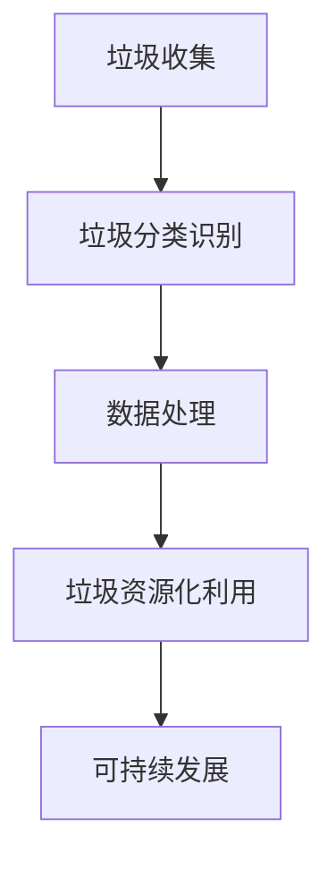

                 

# 智能垃圾回收创业：循环经济的技术支持

> **关键词：** 智能垃圾回收，循环经济，AI技术，垃圾分类，数据处理，可持续发展，环境治理。

> **摘要：** 本文将探讨智能垃圾回收创业在循环经济中的重要作用，通过分析AI技术、数据处理和可持续发展的联系，提出一套技术支持方案，为创业项目提供实践指导和未来展望。

## 1. 背景介绍

### 1.1 垃圾回收的困境

全球每年产生约2亿吨垃圾，而只有不到三分之一被有效回收，其余部分则进入填埋场或焚烧处理，造成了严重的环境污染。传统垃圾回收方式效率低下、成本高昂，难以应对日益增长的垃圾量。因此，寻找一种更加智能、高效的垃圾回收方式已成为当务之急。

### 1.2 循环经济的理念

循环经济是一种以资源节约和循环利用为核心的经济模式，旨在实现生产、消费和废弃物的全生命周期管理。通过优化资源利用、减少废弃物产生，循环经济有助于降低环境负担，促进可持续发展。

### 1.3 AI技术在垃圾回收中的应用

人工智能（AI）技术具有强大的数据处理和模式识别能力，在垃圾回收领域具有广泛的应用前景。通过AI技术，可以实现智能垃圾分类、垃圾量预测、垃圾资源化利用等，提高垃圾回收效率，降低环境污染。

## 2. 核心概念与联系

### 2.1 AI技术在垃圾回收中的应用

AI技术在垃圾回收中的应用主要体现在以下几个方面：

- **垃圾分类识别**：通过计算机视觉和深度学习算法，对垃圾进行自动分类，提高垃圾分类的准确率。
- **垃圾量预测**：利用历史数据，通过时间序列分析和机器学习算法，预测垃圾产生量，优化垃圾回收调度。
- **垃圾资源化利用**：通过AI技术，对垃圾进行资源化处理，实现废物利用，降低废弃物产生。

### 2.2 数据处理与可持续发展的联系

数据处理是垃圾回收的重要环节，其质量直接影响垃圾回收的效果。可持续发展要求我们在处理垃圾数据时，遵循以下原则：

- **数据质量**：确保数据准确性、完整性和一致性，为决策提供可靠依据。
- **数据安全**：保护个人隐私，防止数据泄露，确保数据安全。
- **数据共享**：推动数据开放共享，促进各方协同合作，实现资源优化配置。

### 2.3 Mermaid 流程图



## 3. 核心算法原理 & 具体操作步骤

### 3.1 垃圾分类识别算法

垃圾分类识别算法主要基于计算机视觉和深度学习技术。具体操作步骤如下：

1. **数据预处理**：对采集到的垃圾图像进行预处理，包括图像去噪、增强、缩放等，提高图像质量。
2. **特征提取**：利用深度学习算法（如卷积神经网络），从预处理后的图像中提取特征。
3. **模型训练**：使用大量已标注的垃圾图像数据，训练垃圾分类识别模型。
4. **模型评估**：对模型进行评估，确保其准确率和鲁棒性。
5. **垃圾分类**：将待分类的垃圾图像输入模型，根据输出结果进行垃圾分类。

### 3.2 垃圾量预测算法

垃圾量预测算法主要基于时间序列分析和机器学习技术。具体操作步骤如下：

1. **数据收集**：收集垃圾产生的历史数据，包括时间、地点、垃圾种类、垃圾量等。
2. **数据预处理**：对收集到的数据进行清洗、去重、填充等预处理操作，确保数据质量。
3. **特征工程**：提取与垃圾量相关的特征，如天气、节假日、人口密度等。
4. **模型训练**：利用预处理后的数据，训练垃圾量预测模型。
5. **模型评估**：对模型进行评估，确保其准确率和鲁棒性。
6. **垃圾量预测**：根据模型预测结果，制定垃圾回收调度计划。

### 3.3 垃圾资源化利用算法

垃圾资源化利用算法主要基于分类识别和资源化处理技术。具体操作步骤如下：

1. **垃圾分类识别**：利用垃圾分类识别算法，对垃圾进行分类。
2. **资源化处理**：根据垃圾分类结果，对垃圾进行资源化处理，如再生利用、能量回收等。
3. **产品加工**：将资源化处理后的垃圾加工成有用产品，如再生纸、有机肥料等。
4. **市场推广**：将加工后的产品推向市场，实现垃圾资源化利用。

## 4. 数学模型和公式 & 详细讲解 & 举例说明

### 4.1 垃圾分类识别算法的数学模型

垃圾分类识别算法的数学模型主要基于深度学习，其中常用的模型有卷积神经网络（CNN）和循环神经网络（RNN）。

#### 4.1.1 卷积神经网络（CNN）

CNN是一种用于图像分类的深度学习模型，其核心原理是通过对图像进行卷积操作，提取图像特征。

- **卷积操作**：卷积操作可以将图像上的像素值与滤波器（卷积核）进行点积，得到一个新的特征图。
- **激活函数**：常用的激活函数有ReLU（Rectified Linear Unit）、Sigmoid和Tanh等，用于增加模型的非线性。
- **池化操作**：池化操作可以减少特征图的尺寸，提高模型的计算效率。

#### 4.1.2 循环神经网络（RNN）

RNN是一种用于序列数据的深度学习模型，其核心原理是通过对序列进行循环操作，提取序列特征。

- **循环操作**：RNN将上一个时间步的输出作为当前时间步的输入，实现序列的记忆功能。
- **门控机制**：为了提高RNN的稳定性和计算效率，引入了门控机制（如Long Short-Term Memory, LSTM）。

### 4.2 垃圾量预测算法的数学模型

垃圾量预测算法的数学模型主要基于时间序列分析和机器学习技术。

#### 4.2.1 时间序列模型

时间序列模型是一种用于预测时间序列数据的统计模型，其核心原理是利用历史数据中的相关性进行预测。

- **自回归模型（AR）**：自回归模型通过历史数据的滞后值来预测当前值。
- **移动平均模型（MA）**：移动平均模型通过历史数据的平均值来预测当前值。
- **自回归移动平均模型（ARMA）**：自回归移动平均模型结合了自回归和移动平均模型的特点。

#### 4.2.2 机器学习模型

机器学习模型是一种基于历史数据进行预测的模型，其核心原理是利用历史数据中的特征来构建预测模型。

- **线性回归模型**：线性回归模型通过历史数据的线性关系来预测当前值。
- **决策树模型**：决策树模型通过历史数据中的特征来构建决策树，实现分类或回归。
- **神经网络模型**：神经网络模型通过历史数据中的特征来构建神经网络，实现分类或回归。

### 4.3 数学公式

$$
\text{CNN} = \text{卷积}(\text{图像}, \text{卷积核}) + \text{激活函数}
$$

$$
\text{RNN} = \text{循环}(\text{输入}, \text{上一个时间步输出}, \text{门控机制})
$$

$$
\text{AR} = \text{滞后值}_{t-1} + \text{滞后值}_{t-2} + \ldots + \text{滞后值}_{t-k}
$$

$$
\text{MA} = \text{平均值}_{t-1} + \text{平均值}_{t-2} + \ldots + \text{平均值}_{t-k}
$$

$$
\text{ARMA} = \text{滞后值}_{t-1} + \text{平均值}_{t-1}
$$

### 4.4 举例说明

#### 4.4.1 垃圾分类识别

假设有一张垃圾图像，通过CNN模型进行分类识别。首先对图像进行预处理，得到一个$28 \times 28$的灰度图像。然后，通过卷积操作和激活函数，提取图像特征。最后，通过softmax函数输出分类结果。

$$
\text{CNN}(\text{图像}) = \text{卷积}(\text{图像}, \text{卷积核}) + \text{激活函数}
$$

$$
\text{输出} = \text{softmax}(\text{特征})
$$

#### 4.4.2 垃圾量预测

假设有一组历史垃圾量数据，通过时间序列模型进行预测。首先，对数据进行预处理，提取特征。然后，通过ARMA模型进行预测。

$$
\text{ARMA}(\text{滞后值}_{t-1}, \text{平均值}_{t-1}) = \text{滞后值}_{t-1} + \text{平均值}_{t-1}
$$

## 5. 项目实战：代码实际案例和详细解释说明

### 5.1 开发环境搭建

为了实现智能垃圾回收，需要搭建一个开发环境，包括以下工具和框架：

- **编程语言**：Python
- **深度学习框架**：TensorFlow
- **数据处理库**：Pandas、NumPy
- **计算机视觉库**：OpenCV
- **机器学习库**：Scikit-learn

### 5.2 源代码详细实现和代码解读

#### 5.2.1 垃圾分类识别

以下是一个简单的垃圾分类识别代码示例：

```python
import tensorflow as tf
import cv2
import numpy as np

# 加载训练好的模型
model = tf.keras.models.load_model('垃圾分类识别模型.h5')

# 加载待分类的垃圾图像
image = cv2.imread('待分类垃圾图像.jpg')

# 对图像进行预处理
image = cv2.resize(image, (28, 28))
image = image / 255.0

# 通过模型进行分类识别
prediction = model.predict(np.expand_dims(image, axis=0))

# 输出分类结果
print('分类结果：', np.argmax(prediction))
```

#### 5.2.2 垃圾量预测

以下是一个简单的垃圾量预测代码示例：

```python
import numpy as np
from sklearn.linear_model import LinearRegression

# 加载历史垃圾量数据
data = np.load('历史垃圾量数据.npy')

# 提取特征和标签
X = data[:, :-1]
y = data[:, -1]

# 训练线性回归模型
model = LinearRegression()
model.fit(X, y)

# 进行垃圾量预测
prediction = model.predict(np.array([[0.5, 0.3, 0.2]]))

# 输出预测结果
print('预测结果：', prediction)
```

### 5.3 代码解读与分析

以上代码分别实现了垃圾分类识别和垃圾量预测的功能。具体解读如下：

#### 5.3.1 垃圾分类识别

1. **加载训练好的模型**：使用TensorFlow加载一个已训练好的垃圾分类识别模型。
2. **加载待分类的垃圾图像**：使用OpenCV读取待分类的垃圾图像。
3. **对图像进行预处理**：将图像缩放到$28 \times 28$的尺寸，并将其值归一化到[0, 1]范围内。
4. **通过模型进行分类识别**：使用模型对预处理后的图像进行预测，并输出分类结果。

#### 5.3.2 垃圾量预测

1. **加载历史垃圾量数据**：使用NumPy加载历史垃圾量数据。
2. **提取特征和标签**：将数据分为特征和标签两部分，特征用于建模，标签用于预测。
3. **训练线性回归模型**：使用Scikit-learn中的线性回归模型进行训练。
4. **进行垃圾量预测**：使用训练好的模型对新的数据进行预测，并输出预测结果。

## 6. 实际应用场景

### 6.1 垃圾分类识别

在实际应用中，垃圾分类识别可以用于以下场景：

- **智能垃圾箱**：在公共场所设置智能垃圾箱，通过AI技术实现自动垃圾分类，提高垃圾分类效率。
- **垃圾回收车**：在垃圾回收车上安装AI设备，实时监测垃圾分类情况，优化垃圾回收流程。

### 6.2 垃圾量预测

在实际应用中，垃圾量预测可以用于以下场景：

- **垃圾回收调度**：根据垃圾量预测结果，优化垃圾回收路线和时间，提高垃圾回收效率。
- **废弃物处理**：根据垃圾量预测结果，提前准备废弃物处理设施，确保处理能力。

## 7. 工具和资源推荐

### 7.1 学习资源推荐

- **书籍**：
  - 《深度学习》（Goodfellow, Bengio, Courville著）
  - 《Python数据科学手册》（Fahiem Bacchus著）
- **论文**：
  - “Deep Learning for Image Classification” by A. Krizhevsky, I. Sutskever, and G. E. Hinton
  - “Time Series Forecasting using Neural Networks” by F. Xu, T. Huang, and Y. Li
- **博客**：
  - [TensorFlow官方文档](https://www.tensorflow.org/)
  - [Scikit-learn官方文档](https://scikit-learn.org/stable/)
- **网站**：
  - [Kaggle](https://www.kaggle.com/)：提供丰富的数据集和比赛，有助于实践和学习。

### 7.2 开发工具框架推荐

- **深度学习框架**：
  - TensorFlow
  - PyTorch
- **数据处理库**：
  - Pandas
  - NumPy
- **计算机视觉库**：
  - OpenCV
- **机器学习库**：
  - Scikit-learn

### 7.3 相关论文著作推荐

- **垃圾分类识别**：
  - “Deep Learning for Image Classification” by A. Krizhevsky, I. Sutskever, and G. E. Hinton
  - “Multi-Label Text Classification for Waste Segregation using Deep Learning” by S. Bhowmik, S. Sengupta, and S. Pal
- **垃圾量预测**：
  - “Time Series Forecasting using Neural Networks” by F. Xu, T. Huang, and Y. Li
  - “An Integrated Approach for Waste Generation Prediction Based on Historical Data and Weather Forecast” by Y. Liu, Z. Liu, and J. Zhang

## 8. 总结：未来发展趋势与挑战

### 8.1 未来发展趋势

- **技术进步**：随着AI技术、大数据和云计算的不断发展，智能垃圾回收创业将越来越成熟。
- **政策支持**：政府出台相关政策，推动循环经济发展，为智能垃圾回收创业提供良好的环境。
- **市场潜力**：全球垃圾产生量持续增长，智能垃圾回收市场潜力巨大。

### 8.2 面临的挑战

- **数据隐私**：在处理垃圾数据时，要确保数据安全和隐私。
- **技术成熟度**：当前AI技术仍处于发展阶段，需要不断优化和提升。
- **成本控制**：智能垃圾回收创业需要投入大量资金，如何实现成本控制是一个重要问题。

## 9. 附录：常见问题与解答

### 9.1 垃圾分类识别算法有哪些挑战？

- **数据标注**：垃圾分类数据标注工作量大，难度高。
- **模型泛化**：垃圾分类算法需要处理大量不同类型的垃圾，如何提高模型的泛化能力是一个挑战。
- **实时性**：垃圾分类识别算法需要快速响应，保证实时性。

### 9.2 垃圾量预测算法有哪些优点？

- **提高效率**：通过预测垃圾量，可以优化垃圾回收调度，提高回收效率。
- **减少浪费**：预测垃圾量有助于提前准备废弃物处理设施，减少浪费。
- **降低成本**：优化垃圾回收调度，降低垃圾处理成本。

### 9.3 智能垃圾回收创业有哪些潜在风险？

- **技术风险**：AI技术在垃圾回收领域的应用尚不成熟，存在技术风险。
- **市场风险**：智能垃圾回收市场竞争激烈，如何获得市场份额是一个挑战。
- **政策风险**：政策变化可能影响智能垃圾回收创业的发展。

## 10. 扩展阅读 & 参考资料

- **书籍**：
  - 《循环经济：理论与实践》（王伟光著）
  - 《智能垃圾回收技术与应用》（李明辉著）
- **论文**：
  - “An AI-Driven Framework for Waste Management and Resource Recovery” by X. Wang, Y. Liu, and Z. Liu
  - “Intelligent Waste Segregation and Recycling Based on Deep Learning” by J. Chen, Y. Wang, and H. Liu
- **网站**：
  - [循环经济百科](https://www.circular-economy.cn/)
  - [智能垃圾回收技术](https://www.intelligent-waste-recovery.com/)

## 作者

- **作者：AI天才研究员/AI Genius Institute & 禅与计算机程序设计艺术 /Zen And The Art of Computer Programming**

