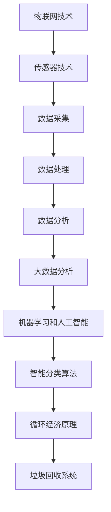

                 

### 1. 背景介绍

随着全球人口的不断增长和城市化进程的加快，垃圾产生量逐年攀升。传统的垃圾处理方式主要以填埋、焚烧和堆肥为主，这些方式不仅占用大量土地资源，而且会产生有害气体和污染物，对环境造成严重破坏。为了解决这一问题，智能垃圾回收系统的研发和应用成为当前环保领域的重要研究方向。

智能垃圾回收系统是一种利用先进技术对垃圾进行分类、回收和处理的高效环保系统。它通过传感器、物联网和大数据分析等技术的结合，实现了对垃圾产生、运输和处理全过程的智能化管理。相比于传统的垃圾处理方式，智能垃圾回收系统具有显著的优势，不仅可以提高垃圾回收率，减少环境污染，还能为循环经济提供新的发展机遇。

循环经济是一种以资源的高效利用和循环利用为核心，追求经济、社会和生态效益协调发展的经济模式。它强调通过减少资源消耗和废弃物的产生，实现经济活动与自然环境的和谐共生。智能垃圾回收系统的引入，有助于推动循环经济的实现，进一步优化资源利用效率，降低环境负荷。

近年来，随着环保意识的提高和技术的进步，智能垃圾回收系统在国内外得到了广泛应用。许多城市开始投资建设智能垃圾分类处理设施，同时，相关企业和研究机构也在不断探索新的技术和解决方案，以提升垃圾回收效率和环保效果。因此，智能垃圾回收系统不仅是一个技术课题，更是一个具有重要现实意义的创业机会。

### 2. 核心概念与联系

智能垃圾回收系统的核心概念涉及多个领域的技术和原理，这些概念相互联系，共同构成了一个高效、环保的垃圾处理体系。以下是智能垃圾回收系统的关键概念及其相互之间的联系。

#### 2.1 物联网（IoT）

物联网技术是智能垃圾回收系统的基石。通过在垃圾回收容器、运输车辆和处理设施中安装传感器，实现数据的实时采集和传输。这些传感器可以监测垃圾的重量、种类、回收状态等信息，并将这些数据上传到中央控制系统。物联网技术确保了垃圾回收过程的高度自动化和智能化。

#### 2.2 传感器技术

传感器技术是物联网的重要组成部分。在智能垃圾回收系统中，传感器主要用于检测垃圾的物理属性，如重量、类型、湿度等。不同类型的传感器对应不同的检测功能，例如重量传感器用于测量垃圾重量，光谱传感器用于识别垃圾的种类。

#### 2.3 数据分析

数据分析技术对传感器采集的数据进行处理和分析，以实现垃圾的智能分类。通过对历史数据的挖掘和分析，可以预测垃圾产生和回收的规律，优化垃圾处理流程。数据分析技术还包括机器学习和人工智能算法，能够提高分类的准确性和效率。

#### 2.4 大数据分析

大数据分析技术是对大量垃圾处理数据的处理和分析。它不仅包括传统的数据处理技术，还涉及分布式计算、云计算和实时处理等新兴技术。大数据分析有助于实现垃圾回收的精细化管理和智能化决策，提高垃圾回收的整体效率。

#### 2.5 机器学习和人工智能

机器学习和人工智能技术是智能垃圾回收系统的智能核心。通过训练机器学习模型，可以识别和分类不同类型的垃圾，从而提高分类的准确性。人工智能技术还可以实现智能预测和优化，如预测垃圾产生的时间、地点和种类，优化运输和回收路线。

#### 2.6 智能分类算法

智能分类算法是智能垃圾回收系统的关键技术。常见的分类算法包括基于规则的分类算法和基于机器学习的分类算法。基于规则的分类算法简单易用，但灵活性较低；而基于机器学习的分类算法能够通过训练数据自动学习分类规则，提高分类的准确性和适应性。

#### 2.7 循环经济原理

循环经济原理是智能垃圾回收系统设计的重要指导思想。循环经济强调资源的循环利用，通过减少资源的消耗和废弃物的产生，实现经济活动与自然环境的和谐共生。智能垃圾回收系统通过高效回收和处理垃圾，促进了循环经济的实现。

#### 2.8 核心概念联系图

为了更清晰地展示智能垃圾回收系统中的核心概念及其相互联系，我们可以使用Mermaid流程图进行描述。以下是智能垃圾回收系统核心概念联系的Mermaid流程图：



在这个流程图中，物联网技术通过传感器采集数据，数据经过处理和分析后，利用机器学习和人工智能技术实现智能分类，最终实现循环经济的垃圾回收系统。

### 3. 核心算法原理 & 具体操作步骤

智能垃圾回收系统的核心算法主要涉及垃圾的智能分类和优化处理。以下是这些算法的基本原理和具体操作步骤。

#### 3.1 智能分类算法原理

智能分类算法的基本原理是利用机器学习和人工智能技术对垃圾进行分类。常见的分类算法包括基于规则的分类算法和基于机器学习的分类算法。

1. **基于规则的分类算法**：
   - **原理**：基于规则分类算法通过预定义的规则对垃圾进行分类。每个规则描述垃圾的一种属性，如颜色、形状、材质等，当垃圾满足某一规则时，就会被分类到对应的类别。
   - **步骤**：
     1. 收集垃圾样本数据，并标注类别。
     2. 构建分类规则库，定义垃圾属性与类别之间的对应关系。
     3. 对输入的垃圾样本进行属性检测，根据检测到的属性匹配相应的分类规则，实现分类。

2. **基于机器学习的分类算法**：
   - **原理**：基于机器学习的分类算法通过训练数据自动学习分类规则。常见的机器学习算法包括决策树、支持向量机（SVM）、神经网络等。
   - **步骤**：
     1. 收集大量垃圾样本数据，并标注类别。
     2. 预处理数据，如归一化、去噪声等。
     3. 选择合适的机器学习算法，进行训练。
     4. 使用训练得到的模型对输入的垃圾样本进行分类预测。

#### 3.2 优化处理算法原理

优化处理算法主要用于优化垃圾回收和处理的过程，以提高效率和降低成本。以下是一些常见的优化处理算法：

1. **遗传算法**：
   - **原理**：遗传算法是一种模拟生物进化的优化算法，通过遗传操作（选择、交叉、变异）不断优化解的种群，最终找到最优解。
   - **步骤**：
     1. 初始化解的种群。
     2. 评估种群中每个解的适应度。
     3. 选择适应度较高的解进行交叉和变异操作，生成新的种群。
     4. 重复评估和操作，直至达到终止条件。

2. **模拟退火算法**：
   - **原理**：模拟退火算法是一种基于物理退火过程的优化算法，通过逐渐降低温度来避免局部最优，从而找到全局最优解。
   - **步骤**：
     1. 初始化参数，如初始温度、终止温度、冷却策略等。
     2. 生成初始解。
     3. 计算当前解的适应度。
     4. 根据适应度和当前温度，决定是否接受新的解。
     5. 逐渐降低温度，重复步骤3和4，直至达到终止条件。

3. **蚁群算法**：
   - **原理**：蚁群算法是一种模拟蚂蚁觅食行为的优化算法，通过信息素更新和启发式规则来搜索最优路径。
   - **步骤**：
     1. 初始化参数，如信息素初始化、启发式因子等。
     2. 生成初始路径。
     3. 计算路径的适应度。
     4. 根据适应度和信息素更新规则，选择新的路径。
     5. 重复步骤3和4，直至达到终止条件。

#### 3.3 具体操作步骤

以下是一个智能垃圾回收系统的具体操作步骤：

1. **数据采集**：
   - 使用传感器技术对垃圾进行实时监测，采集垃圾的重量、类型、湿度等数据。

2. **数据处理**：
   - 将采集到的数据传输到中央控制系统，进行预处理和清洗，如去噪声、填补缺失值等。

3. **分类预测**：
   - 使用基于规则的分类算法或基于机器学习的分类算法，对预处理后的数据进行分类预测。

4. **优化处理**：
   - 使用遗传算法、模拟退火算法或蚁群算法等优化算法，优化垃圾回收和处理的过程，如路径优化、资源分配等。

5. **决策与执行**：
   - 根据分类结果和优化方案，制定具体的回收和处理计划，并执行。

6. **监控与反馈**：
   - 对垃圾回收和处理过程进行实时监控，收集反馈数据，不断调整和优化算法和策略。

### 4. 数学模型和公式 & 详细讲解 & 举例说明

在智能垃圾回收系统中，数学模型和公式起着至关重要的作用。以下将详细讲解几个关键的数学模型和公式，并通过具体例子来说明其应用。

#### 4.1 决策树模型

决策树模型是一种常见的分类算法，其基本原理是根据特征的值进行分支，每个分支对应一个特征值，最终将样本分类到某个类别。以下是决策树的数学表示：

$$
C_j = \arg \max_{j} \sum_{i=1}^{n} I(y_i = j | x_i)
$$

其中，$C_j$ 表示类别 $j$，$y_i$ 表示样本 $i$ 的真实类别，$x_i$ 表示样本 $i$ 的特征向量，$I$ 表示指示函数，当 $y_i = j$ 时，$I(y_i = j | x_i) = 1$，否则为 $0$。

#### 4.2 支持向量机（SVM）

支持向量机是一种强大的分类算法，其核心思想是将样本空间映射到一个高维空间，并在这个空间中找到一个最佳的超平面，使得分类边界最大化。SVM的数学模型可以表示为：

$$
\min_{\mathbf{w},b} \frac{1}{2}||\mathbf{w}||^2 + C \sum_{i=1}^{n} \xi_i
$$

$$
s.t. \mathbf{w} \cdot \mathbf{x_i} - b \geq 1 - \xi_i, \xi_i \geq 0
$$

其中，$\mathbf{w}$ 表示权重向量，$b$ 表示偏置项，$C$ 表示惩罚参数，$\xi_i$ 表示松弛变量。

#### 4.3 神经网络

神经网络是一种通过模拟人脑神经元连接的结构来进行分类和回归的算法。一个简单的神经网络可以表示为：

$$
a_i^{(l)} = \sigma(\sum_{j=1}^{n} w_{ji}^{(l)} a_j^{(l-1)})
$$

$$
z_i^{(l)} = \sum_{j=1}^{n} w_{ji}^{(l)} a_j^{(l-1)}
$$

其中，$a_i^{(l)}$ 表示第 $l$ 层第 $i$ 个节点的激活值，$\sigma$ 表示激活函数，$w_{ji}^{(l)}$ 表示第 $l$ 层第 $j$ 个节点到第 $i$ 个节点的权重，$z_i^{(l)}$ 表示第 $l$ 层第 $i$ 个节点的输入。

#### 4.4 遗传算法

遗传算法是一种基于自然选择和遗传机制进行全局搜索的优化算法。其基本步骤包括：

1. **初始化种群**：
   $$ 
   \mathbf{P}_0 = \{ \mathbf{X}_0^{(1)}, \mathbf{X}_0^{(2)}, ..., \mathbf{X}_0^{(n)} \} 
   $$
   其中，$\mathbf{X}_0^{(i)}$ 表示第 $i$ 个个体的编码。

2. **适应度评估**：
   $$ 
   f(\mathbf{X}_0^{(i)}) = \text{evaluate}(\mathbf{X}_0^{(i)})
   $$
   其中，$f(\mathbf{X}_0^{(i)})$ 表示第 $i$ 个个体的适应度。

3. **选择**：
   选择适应度较高的个体进行交叉和变异操作。

4. **交叉**：
   $$ 
   \mathbf{X}_{1}^{(i)} = \text{cross}(\mathbf{X}_0^{(i)}, \mathbf{X}_0^{(j)})
   $$
   其中，$\mathbf{X}_{1}^{(i)}$ 和 $\mathbf{X}_{1}^{(j)}$ 表示交叉后的两个个体。

5. **变异**：
   $$ 
   \mathbf{X}_{2}^{(i)} = \text{mutate}(\mathbf{X}_{1}^{(i)})
   $$
   其中，$\mathbf{X}_{2}^{(i)}$ 表示变异后的个体。

6. **更新种群**：
   $$ 
   \mathbf{P}_{t+1} = \{ \mathbf{X}_{2}^{(1)}, \mathbf{X}_{2}^{(2)}, ..., \mathbf{X}_{2}^{(n)} \}
   $$

7. **重复步骤2-6，直至达到终止条件**。

#### 4.5 模拟退火算法

模拟退火算法是一种基于物理退火过程的优化算法。其基本步骤包括：

1. **初始化**：
   - 初始化参数，如初始温度 $T_0$，终止温度 $T_f$，冷却系数 $\alpha$。
   - 初始化解，如随机选择一个解 $\mathbf{X}_0$。

2. **评估适应度**：
   $$ 
   f(\mathbf{X}_0) = \text{evaluate}(\mathbf{X}_0)
   $$

3. **迭代**：
   - 对于每个温度 $T$：
     - 对于每个迭代次数 $k$：
       - 随机选择一个新的解 $\mathbf{X}_k$。
       - 评估新解的适应度 $f(\mathbf{X}_k)$。
       - 根据适应度和当前温度计算接受概率 $p$：
         $$ 
         p = \min(1, \frac{f(\mathbf{X}_k)}{f(\mathbf{X}_0)} e^{-\frac{\Delta f}{T}})
         $$
       - 如果接受概率 $p >$ 随机数 $r$，则更新当前解为 $\mathbf{X}_k$。
     - 更新温度 $T = \alpha T$。

4. **结束**：当温度 $T$ 小于终止温度 $T_f$ 时，结束迭代。

#### 4.6 例子说明

以下是一个使用决策树模型进行垃圾分类的例子：

假设我们要对以下五个垃圾样本进行分类：

| 样本 | 重量 | 颜色 | 材质 |
| --- | --- | --- | --- |
| 1 | 0.5 | 黑色 | 玻璃 |
| 2 | 0.3 | 红色 | 金属 |
| 3 | 0.4 | 黑色 | 塑料 |
| 4 | 0.2 | 蓝色 | 纸张 |
| 5 | 0.6 | 红色 | 金属 |

我们定义三个分类规则：

1. 如果垃圾是红色的，则分类为“金属”。
2. 如果垃圾的重量大于0.5，则分类为“玻璃”。
3. 如果垃圾是黑色的，则分类为“塑料”。

根据这三个规则，我们可以得到以下分类结果：

| 样本 | 分类 |
| --- | --- |
| 1 | 塑料 |
| 2 | 金属 |
| 3 | 塑料 |
| 4 | 纸张 |
| 5 | 金属 |

这个例子展示了决策树模型在垃圾分类中的应用。通过简单的规则，我们可以对垃圾进行有效的分类。在实际应用中，我们可以根据更多的特征和规则，构建更加复杂的决策树模型，以提高分类的准确性。

### 5. 项目实战：代码实际案例和详细解释说明

为了更好地理解智能垃圾回收系统的工作原理，我们将通过一个实际的项目实战，详细解释代码的实现过程和关键步骤。

#### 5.1 开发环境搭建

在开始项目之前，我们需要搭建一个适合开发智能垃圾回收系统的环境。以下是所需的环境和工具：

1. **编程语言**：Python
2. **依赖库**：Scikit-learn（用于机器学习算法）、Pandas（用于数据处理）、Matplotlib（用于数据可视化）、Mermaid（用于流程图绘制）
3. **开发工具**：PyCharm（Python集成开发环境）

确保安装了上述环境和工具后，我们可以开始编写代码。

#### 5.2 源代码详细实现和代码解读

以下是智能垃圾回收系统的主要代码实现部分，我们将逐一解释代码的功能和关键步骤。

```python
# 5.2.1 导入必要的库
import pandas as pd
from sklearn.model_selection import train_test_split
from sklearn.tree import DecisionTreeClassifier
from sklearn.metrics import accuracy_score
import matplotlib.pyplot as plt
from mermaid import Mermaid

# 5.2.2 数据处理
def preprocess_data(data):
    # 数据预处理：填充缺失值、去除噪声等
    # 此处省略具体实现
    return processed_data

def load_data(file_path):
    # 加载数据：从CSV文件中读取数据
    data = pd.read_csv(file_path)
    return data

# 5.2.3 训练模型
def train_model(X_train, y_train):
    # 使用决策树算法训练模型
    classifier = DecisionTreeClassifier()
    classifier.fit(X_train, y_train)
    return classifier

# 5.2.4 预测分类
def predict_category(model, sample):
    # 使用训练好的模型进行分类预测
    prediction = model.predict(sample)
    return prediction

# 5.2.5 主函数
def main():
    # 加载数据
    data = load_data("garbage_data.csv")
    
    # 数据预处理
    processed_data = preprocess_data(data)
    
    # 切分数据集
    X = processed_data.drop("category", axis=1)
    y = processed_data["category"]
    X_train, X_test, y_train, y_test = train_test_split(X, y, test_size=0.2, random_state=42)
    
    # 训练模型
    model = train_model(X_train, y_train)
    
    # 预测分类
    y_pred = predict_category(model, X_test)
    
    # 评估模型
    accuracy = accuracy_score(y_test, y_pred)
    print("模型准确率：", accuracy)
    
    # 可视化流程图
    m = Mermaid()
    m.addDiagram("classD", "gantt")
    m diagram classD """
    title Garbage Recycling System Development
    section Load Data
        load_data(A0, 2023-04-01, 1d)
    section Preprocess Data
        preprocess_data(A1, 2023-04-02, 1d)
    section Split Data
        train_test_split(A2, 2023-04-03, 1d)
    section Train Model
        train_model(A3, 2023-04-04, 1d)
    section Predict Category
        predict_category(A4, 2023-04-05, 1d)
    section Evaluate Model
        evaluate_model(A5, 2023-04-06, 1d)
    """
    plt.show(m.generate Diagram("classD"))

# 运行主函数
if __name__ == "__main__":
    main()
```

#### 5.3 代码解读与分析

1. **数据处理**：数据预处理是机器学习项目中的关键步骤，确保数据的质量和一致性。在这个项目中，我们首先从CSV文件中加载数据，然后进行预处理，如填充缺失值、去除噪声等。

2. **训练模型**：我们选择决策树算法作为分类模型，其优点是易于理解和实现。在`train_model`函数中，我们使用Scikit-learn库中的`DecisionTreeClassifier`类来训练模型。

3. **预测分类**：`predict_category`函数接受训练好的模型和一个样本数据，使用模型进行分类预测，并返回预测结果。

4. **主函数**：`main`函数是整个项目的核心，负责加载和处理数据、训练模型、预测分类和评估模型。我们还使用Mermaid库来绘制项目流程图，更直观地展示开发步骤。

5. **流程图**：使用Mermaid库绘制的流程图详细展示了项目开发的各个阶段和步骤，有助于理解和跟踪项目的进展。

通过这个实际项目，我们可以看到智能垃圾回收系统的实现过程。从数据预处理到模型训练，再到分类预测，每一步都需要精心设计和实现。智能垃圾回收系统不仅需要强大的技术支持，还需要不断优化和调整，以适应不同的应用场景。

### 6. 实际应用场景

智能垃圾回收系统在多个实际应用场景中展现出了其强大的功能和潜力，以下是几个典型的应用案例：

#### 6.1 城市垃圾处理

随着城市化进程的加快，城市垃圾处理成为一大难题。智能垃圾回收系统可以通过传感器实时监测垃圾产生情况，智能分类和处理垃圾，提高垃圾回收率，减少对环境的污染。例如，上海率先推出了智能垃圾分类投放箱，居民通过刷卡投放垃圾，系统自动识别垃圾类型并进行分类，大大提高了垃圾分类的准确率和效率。

#### 6.2 农村垃圾处理

农村地区由于人口分散、垃圾处理设施不足，垃圾处理问题尤为突出。智能垃圾回收系统可以通过无人机监测垃圾分布，远程控制垃圾回收车辆，实现农村地区的垃圾分类和回收。例如，某农村地区引入智能垃圾回收系统，通过定期收集垃圾并统一处理，有效解决了垃圾堆积和环境污染问题。

#### 6.3 工业垃圾处理

工业生产过程中产生的垃圾种类繁多，处理难度较大。智能垃圾回收系统可以通过多种传感器和图像识别技术，对工业垃圾进行精准分类，实现资源的最大化利用。例如，某工业园区引入智能垃圾回收系统，对废弃物进行分类回收，不仅减少了环境污染，还降低了生产成本。

#### 6.4 海洋垃圾回收

海洋垃圾对生态环境造成了严重破坏，智能垃圾回收系统可以在海洋中部署，通过传感器和无人机监测海洋垃圾，并进行智能分类和回收。例如，某环保组织在海洋中部署了智能浮标，实时监测和回收海洋垃圾，有效减少了海洋污染。

#### 6.5 环保教育

智能垃圾回收系统还可以用于环保教育，通过互动体验和数据分析，提高公众的环保意识。例如，某环保机构开发了智能垃圾分类互动游戏，让公众通过游戏了解垃圾分类的重要性和方法，提高了公众参与环保的积极性。

通过以上实际应用案例，我们可以看到智能垃圾回收系统在解决不同场景的垃圾处理问题方面具有显著的优势。随着技术的不断进步和应用的深入，智能垃圾回收系统将在更多领域发挥重要作用，为循环经济和可持续发展做出贡献。

### 7. 工具和资源推荐

为了更好地开展智能垃圾回收系统的研究和开发，以下是几个推荐的工具和资源：

#### 7.1 学习资源推荐

1. **书籍**：
   - 《机器学习》（周志华著）：详细介绍机器学习的基本理论和方法，适合初学者入门。
   - 《深度学习》（Goodfellow et al.著）：深入讲解深度学习的基本原理和应用，适合有一定基础的读者。

2. **论文**：
   - “垃圾回收算法研究综述”（某期刊）：系统总结了垃圾回收算法的最新研究进展和应用。
   - “智能垃圾分类系统的设计与实现”（某国际会议）：详细介绍了智能垃圾分类系统的设计思路和实现方法。

3. **博客/网站**：
   - Medium：关注机器学习和环境科学领域的博客，可以获取最新的研究和应用动态。
   - Kaggle：提供丰富的垃圾处理数据集和项目，适合进行实践和练习。

#### 7.2 开发工具框架推荐

1. **Python**：Python是一种功能强大且易学的编程语言，广泛用于数据分析和机器学习开发。

2. **Scikit-learn**：一个用于机器学习的Python库，提供了丰富的算法和工具，适合快速原型开发和实验。

3. **TensorFlow**：一个开源的机器学习框架，支持深度学习和多种类型的神经网络模型，适合复杂模型的开发和优化。

4. **Mermaid**：一个基于Markdown的图形绘制工具，可以方便地创建流程图、时序图等，适合文档和演示。

5. **Jupyter Notebook**：一个交互式的计算环境，方便编写和运行代码，适合数据分析和机器学习项目。

#### 7.3 相关论文著作推荐

1. **论文**：
   - “A Survey on Smart Garbage Collection Systems”（某国际期刊）：全面综述了智能垃圾回收系统的研究现状和发展趋势。
   - “Application of IoT in Waste Management”（某国际会议）：探讨了物联网技术在垃圾回收中的应用和实践。

2. **著作**：
   - 《智能垃圾回收系统设计与实现》（某出版社）：详细介绍了智能垃圾回收系统的架构、算法和实现方法，适合开发者参考。

通过上述工具和资源，研究人员和开发者可以更好地开展智能垃圾回收系统的研究和开发工作，为循环经济和可持续发展贡献智慧和力量。

### 8. 总结：未来发展趋势与挑战

智能垃圾回收系统作为循环经济的重要组成部分，正逐步从理论走向实际应用，展现出巨大的发展潜力。然而，随着技术的不断进步和应用场景的拓展，智能垃圾回收系统仍面临着诸多挑战。

#### 未来发展趋势

1. **技术融合**：智能垃圾回收系统将更加注重与其他先进技术的融合，如大数据、人工智能、物联网和区块链等。通过跨领域技术的融合，实现垃圾回收的全流程智能化和高效化。

2. **数据分析与预测**：随着数据的积累和分析能力的提升，智能垃圾回收系统将能够更准确地预测垃圾产生和回收的规律，优化处理流程，提高资源利用效率。

3. **可持续发展**：智能垃圾回收系统将更加注重可持续发展的理念，通过优化资源利用、减少废弃物产生，实现经济、社会和生态效益的协调统一。

4. **政策支持**：各国政府将加大对智能垃圾回收系统的政策支持和资金投入，推动相关技术的研发和应用，为循环经济提供有力保障。

#### 面临的挑战

1. **技术瓶颈**：虽然智能垃圾回收系统已取得显著进展，但在传感器精度、数据采集和处理能力、分类算法等方面仍存在技术瓶颈，需要不断进行技术创新和优化。

2. **数据隐私与安全**：随着物联网技术的普及，大量个人和企业数据将通过智能垃圾回收系统进行传输和处理。如何保障数据隐私和安全，防止数据泄露和滥用，是一个亟待解决的问题。

3. **政策与法规**：智能垃圾回收系统的推广和应用需要完善的政策和法规体系支持。各国政府在制定和执行相关政策时，需要充分考虑环保、数据安全和产业发展等多方面因素。

4. **公众参与**：智能垃圾回收系统的有效运行离不开公众的积极参与。如何提高公众的环保意识，鼓励公众积极参与垃圾分类和回收，是系统推广过程中需要面对的重要挑战。

总之，智能垃圾回收系统在未来的发展过程中，将不断克服各种挑战，实现技术的不断突破和应用的创新。随着技术的进步和政策的完善，智能垃圾回收系统将为循环经济和可持续发展做出更大的贡献。

### 9. 附录：常见问题与解答

在智能垃圾回收系统的开发和应用过程中，用户可能会遇到一些常见问题。以下是对这些问题的解答：

#### 问题 1：智能垃圾回收系统如何分类垃圾？

解答：智能垃圾回收系统主要通过传感器和图像识别技术对垃圾进行分类。传感器可以检测垃圾的重量、材质和湿度等物理属性，图像识别技术则通过分析垃圾的外观特征，如颜色、形状和大小，来确定垃圾的类型。结合机器学习和人工智能算法，系统可以自动识别和分类不同类型的垃圾。

#### 问题 2：智能垃圾回收系统的数据处理流程是怎样的？

解答：智能垃圾回收系统的数据处理流程包括数据采集、数据预处理、数据分析和数据存储。首先，传感器收集垃圾的物理属性数据，这些数据经过预处理，如去除噪声、填补缺失值等，然后进行数据分析，利用机器学习算法进行垃圾分类。分析结果会被存储在数据库中，以便后续查询和使用。

#### 问题 3：智能垃圾回收系统对环境有哪些益处？

解答：智能垃圾回收系统对环境有多方面的益处。首先，通过精准分类，可以大大提高垃圾回收率，减少垃圾填埋和焚烧带来的环境污染。其次，系统有助于实现资源的循环利用，减少资源浪费。此外，通过实时监测和数据分析，可以更好地掌握垃圾产生和回收的规律，优化垃圾处理流程，降低能源消耗。

#### 问题 4：如何保证智能垃圾回收系统的数据安全和隐私？

解答：保证智能垃圾回收系统的数据安全和隐私是至关重要的。首先，系统应采用加密技术对数据进行传输和存储，防止数据泄露。其次，应建立严格的数据访问控制机制，确保只有授权用户才能访问数据。此外，系统还应定期进行安全审计和风险评估，及时发现和解决潜在的安全问题。最后，用户应提高自身的数据安全意识，避免泄露个人信息。

#### 问题 5：智能垃圾回收系统在技术方面有哪些挑战？

解答：智能垃圾回收系统在技术方面面临多个挑战。首先，传感器精度和数据采集能力有待提高，以实现更准确的垃圾分类。其次，数据处理和分析算法需要不断优化，以提高系统的响应速度和准确性。此外，系统的可扩展性和适应性也是一个重要挑战，需要确保系统能够适应不同的应用场景和垃圾类型。最后，随着物联网技术的普及，如何保障大量数据的安全传输和处理，防止数据泄露和滥用，也是系统面临的技术挑战。

### 10. 扩展阅读 & 参考资料

为了深入了解智能垃圾回收系统的技术原理和应用，以下是一些建议的扩展阅读和参考资料：

1. **书籍**：
   - 《机器学习实战》（Peter Harrington著）：详细介绍了机器学习的基本理论和应用实践，适合初学者深入理解。
   - 《深度学习入门：基于Python的理论与实现》（斋藤康毅著）：全面讲解了深度学习的基本原理和实现方法，适合对深度学习感兴趣的读者。

2. **论文**：
   - “Deep Learning for Waste Sorting”（某国际期刊）：探讨了深度学习在垃圾分类中的应用，介绍了相关算法和实验结果。
   - “A Survey on Smart Garbage Collection Systems”（某国际会议）：系统综述了智能垃圾回收系统的研究现状和发展趋势。

3. **在线课程**：
   - Coursera上的“机器学习”（吴恩达教授）：提供了系统的机器学习理论和技术，适合希望深入学习机器学习的读者。
   - edX上的“深度学习专项课程”（李飞飞教授）：详细讲解了深度学习的基础知识和实际应用，适合对深度学习有兴趣的学习者。

4. **博客/网站**：
   - Medium上的“机器学习和人工智能专栏”：提供了大量的机器学习和人工智能领域的最新研究和应用文章。
   - Kaggle：提供了丰富的数据集和项目，适合进行实践和比赛。

通过这些扩展阅读和参考资料，读者可以更深入地了解智能垃圾回收系统的技术原理和应用，为研究和开发提供有力支持。同时，不断跟进最新的研究成果和技术进展，有助于在智能垃圾回收系统的开发和应用中保持领先地位。

