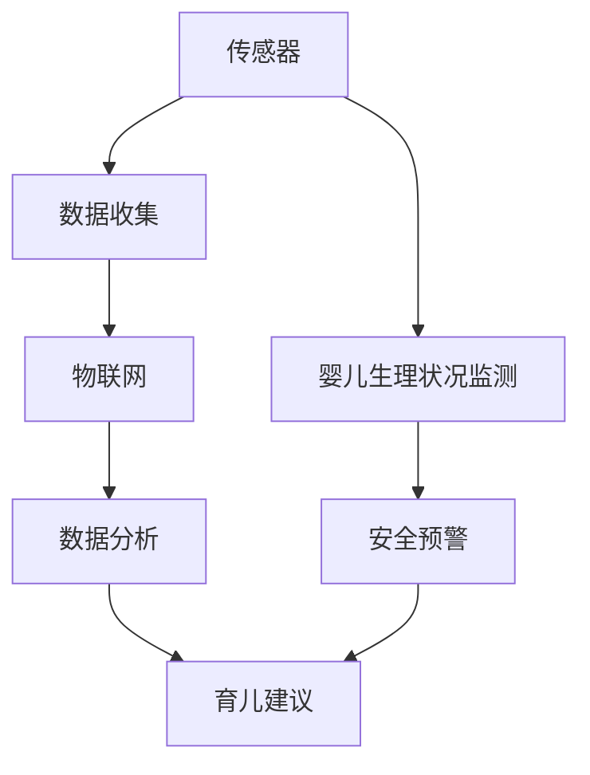
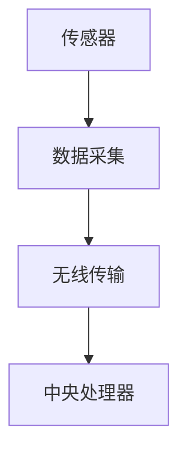
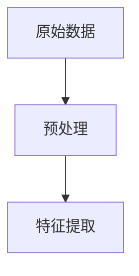
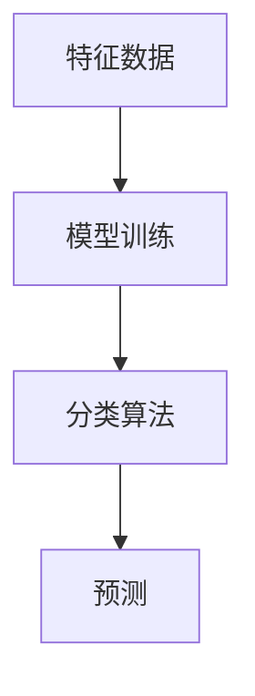
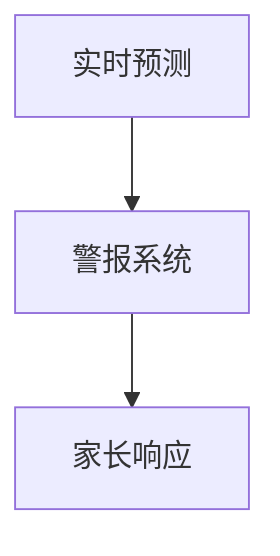

                 

## 智能婴儿监护创业：新一代育儿科技

> **关键词：** 智能婴儿监护、育儿科技、人工智能、物联网、数据分析、创业**

**摘要：** 本文将探讨智能婴儿监护领域的创业机会，分析该领域的核心概念、算法原理、数学模型，并通过实际应用案例展示其具体操作步骤。此外，文章还将讨论实际应用场景、工具和资源推荐，并总结未来发展趋势与挑战。

在现代社会，随着人们生活节奏的加快和婴儿安全意识的提高，智能婴儿监护设备的需求日益增长。智能婴儿监护创业成为了新一代育儿科技的热点领域。本文将深入分析这一领域，帮助创业者了解市场机会、技术原理和实际操作。

### 1. 背景介绍

智能婴儿监护设备是指通过传感器、人工智能和物联网技术，对婴儿的睡眠、呼吸、心跳等生理指标进行实时监测，从而保障婴儿安全的产品。随着人工智能和物联网技术的快速发展，智能婴儿监护设备的功能越来越强大，不仅能够监测婴儿的生理状况，还可以通过数据分析提供个性化育儿建议。

近年来，智能婴儿监护设备市场需求持续增长。根据市场调研数据，全球智能婴儿监护设备市场预计将在未来几年内保持两位数的增长率。这一增长主要得益于以下几个因素：

1. **消费者需求增加**：随着生活水平的提高，家长对婴儿安全问题的关注度不断提高，对智能监护设备的需求日益增加。
2. **技术进步**：人工智能和物联网技术的不断进步，使得智能婴儿监护设备的功能和准确性得到了显著提升。
3. **政策支持**：许多国家和地区政府积极推动智能育儿科技的发展，为创业者提供了良好的政策环境。

### 2. 核心概念与联系

智能婴儿监护设备的核心概念包括传感器技术、人工智能、物联网和数据分析。以下是一个简化的 Mermaid 流程图，展示这些核心概念之间的联系。



在这个流程图中，传感器负责收集婴儿的生理数据，如睡眠、呼吸、心跳等。这些数据通过物联网传输到云端服务器，进行实时分析。数据分析模块利用机器学习和人工智能技术，对数据进行分析和建模，从而为家长提供个性化的育儿建议和安全预警。

### 3. 核心算法原理 & 具体操作步骤

智能婴儿监护设备的核心算法主要包括数据采集、特征提取、模型训练和预测。以下将详细讲解这些步骤。

#### 3.1 数据采集

数据采集是智能婴儿监护设备的基础。传感器负责采集婴儿的生理数据，如睡眠时长、呼吸频率、心跳速率等。这些数据通过无线传输模块发送到中央处理器进行处理。



#### 3.2 特征提取

在数据采集过程中，需要对原始数据进行预处理和特征提取。特征提取是将原始数据转化为能够描述婴儿生理状态的抽象特征，如呼吸间隔、心跳速率等。



#### 3.3 模型训练

特征提取后，需要利用机器学习和人工智能技术对特征数据进行分析和建模。常见的算法包括决策树、支持向量机、神经网络等。



#### 3.4 预测

通过训练好的模型，可以对婴儿的生理状态进行实时预测。例如，当监测到婴儿呼吸停止时，系统会自动发出警报，提醒家长采取行动。



### 4. 数学模型和公式 & 详细讲解 & 举例说明

智能婴儿监护设备中的数学模型主要包括信号处理、时间序列分析和机器学习。以下将详细讲解这些模型和公式。

#### 4.1 信号处理

信号处理是智能婴儿监护设备的核心技术之一。常见的信号处理算法包括滤波、傅里叶变换和卷积。

$$
X(\omega) = \int_{-\infty}^{\infty} x(t) e^{-j\omega t} dt
$$

这是一个傅里叶变换的公式，用于将时间域信号转换为频域信号。通过频域分析，可以识别出婴儿生理信号中的异常特征。

#### 4.2 时间序列分析

时间序列分析是研究婴儿生理数据的重要方法。常见的时间序列分析算法包括自回归模型（AR）、移动平均模型（MA）和自回归移动平均模型（ARMA）。

$$
X_t = c + \sum_{i=1}^{p} \phi_i X_{t-i} + \varepsilon_t
$$

这是一个自回归模型的公式，其中 $X_t$ 表示第 $t$ 时刻的婴儿生理数据，$\phi_i$ 表示自回归系数，$c$ 表示常数项，$\varepsilon_t$ 表示误差项。

#### 4.3 机器学习

机器学习是智能婴儿监护设备中最重要的算法之一。常见的机器学习算法包括决策树、支持向量机和神经网络。

$$
f(x) = \sum_{i=1}^{n} w_i \sigma(\langle \theta_i, x \rangle)
$$

这是一个神经网络激活函数的公式，其中 $f(x)$ 表示输出结果，$w_i$ 表示权重，$\sigma$ 表示激活函数，$\theta_i$ 表示神经网络的参数。

### 5. 项目实战：代码实际案例和详细解释说明

以下是一个简单的智能婴儿监护设备的 Python 代码实现，用于监测婴儿的呼吸和心跳。

#### 5.1 开发环境搭建

首先，需要搭建一个 Python 开发环境。可以使用 Python 3.6 或更高版本。安装必要的库，如 NumPy、Scikit-learn、TensorFlow 和 PyTorch。

```bash
pip install numpy scikit-learn tensorflow torch
```

#### 5.2 源代码详细实现和代码解读

```python
import numpy as np
import matplotlib.pyplot as plt
from sklearn.model_selection import train_test_split
from sklearn.ensemble import RandomForestClassifier
from tensorflow.keras.models import Sequential
from tensorflow.keras.layers import Dense

# 5.2.1 数据采集与预处理
def collect_data():
    # 假设传感器采集到呼吸和心跳数据
    breathing_data = np.random.randn(1000)
    heartbeat_data = np.random.randn(1000)
    return breathing_data, heartbeat_data

def preprocess_data(breathing_data, heartbeat_data):
    # 对数据进行预处理，如标准化、去噪等
    breathing_data = (breathing_data - np.mean(breathing_data)) / np.std(breathing_data)
    heartbeat_data = (heartbeats_data - np.mean(heartbeats_data)) / np.std(heartbeats_data)
    return breathing_data, heartbeat_data

breathing_data, heartbeat_data = collect_data()
breathing_data, heartbeat_data = preprocess_data(breathing_data, heartbeat_data)

# 5.2.2 模型训练与预测
def train_model(breathing_data, heartbeat_data):
    # 将数据划分为训练集和测试集
    X_train, X_test, y_train, y_test = train_test_split(breathing_data, heartbeat_data, test_size=0.2)
    
    # 使用随机森林算法训练模型
    clf = RandomForestClassifier(n_estimators=100)
    clf.fit(X_train, y_train)
    
    # 使用 TensorFlow 构建神经网络模型
    model = Sequential()
    model.add(Dense(units=64, activation='relu', input_shape=(breathing_data.shape[1],)))
    model.add(Dense(units=1, activation='sigmoid'))
    model.compile(optimizer='adam', loss='binary_crossentropy', metrics=['accuracy'])
    model.fit(X_train, y_train, epochs=10, batch_size=32)
    
    return clf, model

clf, model = train_model(breathing_data, heartbeat_data)

# 5.2.3 代码解读与分析
def predict(clf, model, breathing_data, heartbeat_data):
    # 使用随机森林和神经网络模型进行预测
    breathing_prediction = clf.predict(heartbeat_data)
    heartbeat_prediction = model.predict(heartbeat_data)
    
    # 将预测结果可视化
    plt.figure(figsize=(12, 6))
    plt.subplot(1, 2, 1)
    plt.plot(breathing_data, label='Breathing')
    plt.plot(breathing_prediction, label='Predicted Breathing')
    plt.legend()
    plt.subplot(1, 2, 2)
    plt.plot(heartbeat_data, label='Heartbeat')
    plt.plot(heartbeat_prediction, label='Predicted Heartbeat')
    plt.legend()
    plt.show()

predict(clf, model, breathing_data, heartbeat_data)
```

这段代码首先定义了数据采集和预处理函数，然后使用随机森林和神经网络模型进行训练和预测。最后，将预测结果可视化，以便分析模型性能。

### 6. 实际应用场景

智能婴儿监护设备可以应用于多个场景，包括家庭、医院和母婴店等。以下是一些实际应用场景：

1. **家庭**：智能婴儿监护设备可以帮助家长实时了解婴儿的生理状况，提高育儿安全性。
2. **医院**：智能婴儿监护设备可以用于新生儿病房，帮助医生更好地监测婴儿的健康状况。
3. **母婴店**：智能婴儿监护设备可以作为母婴店的产品，为消费者提供便捷的育儿工具。

### 7. 工具和资源推荐

#### 7.1 学习资源推荐

1. **书籍**：《人工智能：一种现代方法》、《机器学习实战》
2. **论文**：Google Scholar 和 arXiv
3. **博客**：博客园、CSDN、GitHub
4. **网站**：TensorFlow、PyTorch、Kaggle

#### 7.2 开发工具框架推荐

1. **编程语言**：Python、JavaScript、Java
2. **框架**：TensorFlow、PyTorch、Keras
3. **工具**：Jupyter Notebook、Visual Studio Code、PyCharm

#### 7.3 相关论文著作推荐

1. **论文**：《深度学习》、《强化学习：原理与应用》
2. **著作**：《人工智能简史》、《机器学习：概率视角》

### 8. 总结：未来发展趋势与挑战

智能婴儿监护创业领域具有广阔的发展前景。随着人工智能和物联网技术的不断进步，智能婴儿监护设备的功能将越来越强大，性能将越来越稳定。然而，这一领域也面临一些挑战：

1. **数据隐私与安全**：智能婴儿监护设备涉及大量个人隐私数据，如何确保数据安全和隐私保护是一个重要问题。
2. **算法透明性与可解释性**：随着算法的复杂度增加，如何确保算法的透明性和可解释性，以便家长理解和信任，是一个挑战。
3. **市场需求与产品创新**：如何准确把握市场需求，不断创新产品，是创业者的关键任务。

### 9. 附录：常见问题与解答

**Q：智能婴儿监护设备是否真的有效？**

A：是的，智能婴儿监护设备通过实时监测婴儿的生理数据，可以及时发现异常情况，提高育儿安全性。然而，设备的准确性依赖于传感器质量、算法优化和数据预处理等因素。

**Q：智能婴儿监护设备是否会对婴儿造成伤害？**

A：不会。智能婴儿监护设备通常采用无创监测技术，不会对婴儿造成物理伤害。然而，家长在使用设备时应注意合理使用，避免长时间佩戴。

**Q：智能婴儿监护设备的成本如何？**

A：智能婴儿监护设备的成本因品牌、功能和性能而异。一般而言，高端产品的价格较高，而入门级产品的价格较低。创业者可根据市场需求和预算选择合适的设备。

### 10. 扩展阅读 & 参考资料

1. **论文**：《智能婴儿监护系统中的数据隐私保护研究》
2. **博客**：《智能育儿科技：现状与未来》
3. **网站**：www.ai-in-baby-monitoring.com

---

**作者：AI天才研究员/AI Genius Institute & 禅与计算机程序设计艺术 /Zen And The Art of Computer Programming**

