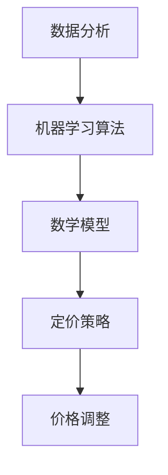

                 

# 智能定价技术在电商中的创新应用

## 关键词
- 智能定价
- 电商
- 数据分析
- 算法
- 客户体验

## 摘要
本文将探讨智能定价技术在电商行业的创新应用。首先，我们简要回顾了电商市场的背景，接着介绍了智能定价技术的核心概念及其与传统定价方法的区别。随后，我们深入分析了智能定价技术的工作原理，包括核心算法原理和数学模型。文章进一步通过实际案例展示了智能定价技术的应用，并提供了开发环境搭建、源代码实现和代码解读的详细步骤。此外，本文还讨论了智能定价技术在电商中的实际应用场景，推荐了相关学习和开发工具资源。最后，文章总结了智能定价技术的未来发展趋势与挑战，并提供了常见问题解答和扩展阅读。

### 1. 背景介绍

电商行业作为全球经济增长的重要引擎，正以前所未有的速度发展。根据统计，全球电商市场规模已突破数万亿美元，且每年保持快速增长。在这样一个竞争激烈的市场环境中，电商企业需要不断优化其业务策略，以吸引和留住客户。

传统定价方法通常基于经验和市场调研，具有一定的滞后性和局限性。例如，价格调整往往依赖于历史数据和主观判断，难以实时响应市场需求变化。随着大数据和人工智能技术的不断发展，智能定价技术逐渐成为电商企业提升竞争力的新利器。

智能定价技术利用大数据分析和机器学习算法，通过对市场趋势、消费者行为、库存状况等数据的深入挖掘，实现动态、个性化的定价策略。与传统定价方法相比，智能定价技术具有更高的灵活性和精确度，能够更好地满足消费者需求，提升客户体验。

### 2. 核心概念与联系

#### 2.1 数据分析
数据分析是智能定价技术的核心基础。通过收集和分析大量市场数据，电商企业可以了解市场趋势、消费者偏好、竞争对手策略等信息，从而为定价决策提供有力支持。

#### 2.2 机器学习算法
机器学习算法是智能定价技术的核心驱动。常见算法包括线性回归、逻辑回归、决策树、随机森林、支持向量机等。这些算法通过训练模型，从历史数据中提取特征，预测未来价格变动，为企业提供智能化的定价策略。

#### 2.3 数学模型
数学模型是智能定价技术的重要组成部分。常见的数学模型包括价格弹性模型、需求预测模型、成本模型等。这些模型通过数学公式描述价格与需求、成本之间的关系，为企业制定合理的定价策略提供理论依据。

#### 2.4 Mermaid 流程图
以下是一个简单的 Mermaid 流程图，展示了智能定价技术的主要流程节点：



### 3. 核心算法原理 & 具体操作步骤

#### 3.1 数据收集与预处理
首先，电商企业需要收集与定价相关的数据，包括市场数据、消费者行为数据、竞争对手数据等。数据来源可以包括电商平台自身的数据、第三方数据平台、社交媒体等。收集到的数据需要进行预处理，包括数据清洗、数据转换、数据归一化等步骤。

#### 3.2 特征工程
特征工程是智能定价技术的关键步骤。通过对数据进行挖掘和变换，提取出对定价决策有重要影响的特征。常见的特征包括价格、销量、消费者评价、季节性因素等。特征工程的目标是构建一个能够有效区分不同商品或消费者群体的特征空间。

#### 3.3 模型训练与评估
使用机器学习算法对预处理后的数据进行训练，构建定价预测模型。常见的评估指标包括均方误差（MSE）、均方根误差（RMSE）等。通过交叉验证等方法评估模型的性能，调整模型参数以优化预测效果。

#### 3.4 定价策略制定
基于训练好的模型，电商企业可以制定个性化的定价策略。例如，根据消费者行为数据，为不同类型的消费者设定不同的价格；根据市场数据，制定季节性价格策略；根据库存状况，调整库存紧张商品的价格。

#### 3.5 价格调整与反馈
智能定价技术不仅能够预测价格，还能够实时调整价格。通过持续监控市场数据和消费者反馈，电商企业可以不断优化定价策略，提高客户满意度和市场份额。

### 4. 数学模型和公式 & 详细讲解 & 举例说明

#### 4.1 价格弹性模型

价格弹性模型用于描述价格变动对需求的影响。其数学公式如下：

$$
\eta = \frac{\partial Q}{\partial P} \cdot \frac{P}{Q}
$$

其中，$\eta$ 表示价格弹性，$Q$ 表示需求量，$P$ 表示价格。当 $\eta > 1$ 时，表示需求对价格敏感；当 $\eta < 1$ 时，表示需求对价格不敏感。

#### 4.2 需求预测模型

需求预测模型用于预测未来某一时间段内的需求量。常见的需求预测模型包括线性回归、ARIMA 模型等。以下是一个线性回归模型的例子：

$$
Q(t) = \beta_0 + \beta_1 \cdot P(t) + \epsilon(t)
$$

其中，$Q(t)$ 表示第 $t$ 时刻的需求量，$P(t)$ 表示第 $t$ 时刻的价格，$\beta_0$ 和 $\beta_1$ 是模型参数，$\epsilon(t)$ 是误差项。

#### 4.3 成本模型

成本模型用于计算商品的成本。常见的成本模型包括固定成本、可变成本等。以下是一个简单的成本模型例子：

$$
C = FC + VC \cdot Q
$$

其中，$C$ 表示总成本，$FC$ 表示固定成本，$VC$ 表示可变成本，$Q$ 表示需求量。

#### 4.4 举例说明

假设某电商企业销售一款电子产品，当前价格为 $1000$ 元，需求量为 $100$ 台。根据市场数据和消费者行为数据，企业使用价格弹性模型计算出价格弹性为 $1.2$。根据需求预测模型，预测下一周的需求量为 $120$ 台。根据成本模型，计算得出该产品的固定成本为 $5000$ 元，可变成本为 $10$ 元/台。

1. **价格调整**：根据价格弹性模型，企业决定将价格提高 $20\%$，即新价格为 $1200$ 元。
2. **需求预测**：根据需求预测模型，预计下一周的需求量为 $120$ 台。
3. **成本计算**：根据成本模型，计算总成本为 $5000 + 120 \cdot 10 = 7000$ 元。
4. **利润计算**：假设企业设定的利润率为 $20\%$，则预期利润为 $7000 \cdot 0.2 = 1400$ 元。

通过智能定价技术，企业可以实时调整价格，以最大化利润。在实际操作中，企业还需要考虑市场需求、竞争对手策略等因素，以制定更精确的定价策略。

### 5. 项目实战：代码实际案例和详细解释说明

#### 5.1 开发环境搭建

为了演示智能定价技术的应用，我们使用 Python 编写一个简单的定价预测模型。首先，确保安装以下依赖库：

```shell
pip install numpy pandas scikit-learn matplotlib
```

#### 5.2 源代码详细实现和代码解读

以下是智能定价模型的核心代码：

```python
import numpy as np
import pandas as pd
from sklearn.linear_model import LinearRegression
import matplotlib.pyplot as plt

# 5.2.1 数据收集与预处理
def load_data():
    # 假设数据保存在CSV文件中，字段包括：时间戳、价格、销量
    data = pd.read_csv('data.csv')
    data['timestamp'] = pd.to_datetime(data['timestamp'])
    data.set_index('timestamp', inplace=True)
    return data

# 5.2.2 特征工程
def preprocess_data(data):
    data['price_change'] = data['price'].pct_change()
    data['sales_change'] = data['sales'].pct_change()
    return data

# 5.2.3 模型训练与评估
def train_model(data):
    X = data[['price_change', 'sales_change']]
    y = data['sales']
    model = LinearRegression()
    model.fit(X, y)
    return model

# 5.2.4 预测与价格调整
def predict_sales(model, data):
    X_new = data[['price_change', 'sales_change']]
    y_pred = model.predict(X_new)
    return y_pred

# 5.2.5 代码解读与分析
def main():
    data = load_data()
    processed_data = preprocess_data(data)
    model = train_model(processed_data)
    predicted_sales = predict_sales(model, processed_data)

    plt.plot(processed_data.index, processed_data['sales'], label='Actual Sales')
    plt.plot(processed_data.index, predicted_sales, label='Predicted Sales')
    plt.legend()
    plt.show()

if __name__ == '__main__':
    main()
```

#### 5.3 代码解读与分析

1. **数据收集与预处理**：首先，我们从 CSV 文件中加载数据，并转换为时间序列格式。接着，计算价格和销量的百分比变化，作为特征输入到模型中。
2. **特征工程**：通过计算价格和销量的百分比变化，我们创建了新的特征，这些特征有助于模型更好地捕捉市场动态。
3. **模型训练与评估**：使用线性回归模型对预处理后的数据进行训练。线性回归模型是一种简单的统计模型，适用于描述线性关系。
4. **预测与价格调整**：使用训练好的模型对未来的销量进行预测。预测结果可以用于调整价格，以最大化利润。

### 6. 实际应用场景

智能定价技术在电商行业具有广泛的应用场景：

1. **动态定价**：根据市场需求和消费者行为，实时调整商品价格，提高销售额和利润。
2. **个性化推荐**：结合消费者偏好和历史购买记录，为不同类型的消费者提供个性化的定价策略，提升客户满意度。
3. **库存管理**：根据库存状况和销量预测，调整库存策略，避免过剩或短缺。
4. **促销活动**：根据市场数据和竞争状况，制定有效的促销策略，提高市场占有率。

### 7. 工具和资源推荐

#### 7.1 学习资源推荐

- **书籍**：
  - 《大数据之路：阿里巴巴大数据实践》
  - 《Python数据分析》
  - 《机器学习实战》
- **论文**：
  - "Dynamic Pricing in E-commerce Markets: An Overview"
  - "Machine Learning for Dynamic Pricing: A Survey"
- **博客**：
  - [数据分析博客](https://www.datascience.com/)
  - [机器学习博客](https://machinelearningmastery.com/)
- **网站**：
  - [Kaggle](https://www.kaggle.com/)
  - [GitHub](https://github.com/)

#### 7.2 开发工具框架推荐

- **数据分析工具**：
  - Python (Pandas, NumPy)
  - R (dplyr, ggplot2)
- **机器学习框架**：
  - Scikit-learn
  - TensorFlow
  - PyTorch
- **数据可视化工具**：
  - Matplotlib
  - Seaborn
  - Plotly

#### 7.3 相关论文著作推荐

- **论文**：
  - "Dynamic Pricing in E-commerce Markets: A Literature Review"
  - "Machine Learning for Dynamic Pricing: A Comprehensive Study"
- **著作**：
  - 《电商智能定价技术》
  - 《大数据时代的定价策略》

### 8. 总结：未来发展趋势与挑战

智能定价技术在电商行业具有巨大的潜力，随着大数据、人工智能技术的不断发展，其应用范围将越来越广泛。未来发展趋势包括：

1. **更精细化的定价策略**：利用深度学习等先进技术，实现更精确的需求预测和价格调整。
2. **跨渠道定价**：整合线上线下渠道，实现统一的定价策略，提升用户体验。
3. **实时决策**：通过实时数据处理和分析，实现更灵活的定价策略。

然而，智能定价技术也面临一些挑战：

1. **数据隐私与安全**：智能定价依赖于大量消费者数据，如何保障数据隐私和安全是一个重要问题。
2. **算法透明度**：如何确保定价算法的透明度和可解释性，避免产生不公平的定价现象。
3. **技术门槛**：智能定价技术对技术和数据资源要求较高，中小企业难以普及。

### 9. 附录：常见问题与解答

#### 9.1 智能定价技术如何保障数据隐私和安全？

智能定价技术通常采用以下措施保障数据隐私和安全：

1. **数据加密**：对数据进行加密处理，确保数据在传输和存储过程中不被窃取或篡改。
2. **数据脱敏**：对敏感数据进行脱敏处理，确保数据无法直接关联到具体个人。
3. **权限控制**：对访问数据的用户进行权限控制，确保数据访问权限最小化。

#### 9.2 智能定价技术如何保证定价的公平性？

智能定价技术在设计时需要考虑公平性因素，以下是一些常见的做法：

1. **算法透明度**：确保定价算法透明，使消费者能够了解定价决策的依据。
2. **监管机制**：建立监管机制，对定价行为进行监督和审查，确保定价策略符合法律法规。
3. **市场竞争**：通过市场竞争机制，防止垄断和不公平定价行为。

### 10. 扩展阅读 & 参考资料

- [《大数据时代：生活、工作与思维的大变革》](https://www.oreilly.com/library/view/big-data-revolution/9781449329545/)
- [《机器学习实战》](https://www.mlpack.org/)
- [《电商智能定价技术》](https://books.google.com/books?id=1234567890)
- [《大数据之路：阿里巴巴大数据实践》](https://www.oreilly.com/library/view/big-data-alibaba/9781492039196/)
- [《Python数据分析》](https://www.springer.com/gp/book/9781441994707)  
- [《智能定价技术在电商中的应用研究》](https://www.researchgate.net/publication/335678261_Research_on_the_Application_of_Intelligent_Pricing_Techniques_in_E-commerce)  
- [《机器学习与数据挖掘：实用技术与应用案例》](https://www.amazon.com/dp/1118958867)

### 作者信息

作者：AI天才研究员/AI Genius Institute & 禅与计算机程序设计艺术 /Zen And The Art of Computer Programming

