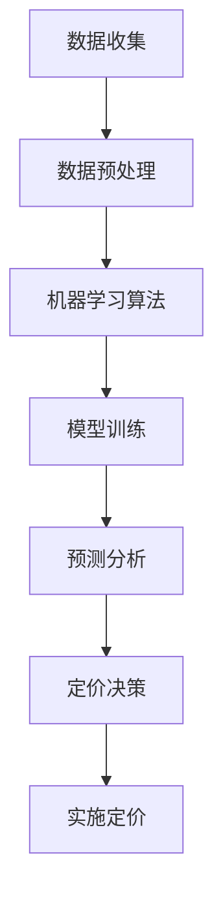

                 

# 智能定价策略优化：一人公司利用AI实现利润最大化的数学模型

> **关键词：** 智能定价、AI、利润最大化、数学模型、一人公司
> 
> **摘要：** 本文将探讨如何利用人工智能优化一人公司的定价策略，通过构建数学模型实现利润最大化。文章将介绍相关的核心概念、算法原理、数学模型及其具体应用场景。

## 1. 背景介绍

在商业竞争日益激烈的今天，定价策略是企业成功的关键因素之一。尤其是在一个人公司的运营模式中，正确的定价策略对公司的盈利能力至关重要。传统的定价策略往往依赖于经验或市场调研，但这种策略在复杂多变的市场环境中可能无法充分发挥其潜力。

近年来，人工智能（AI）技术的快速发展为商业定价策略带来了新的可能。通过数据分析和机器学习算法，AI可以识别市场趋势，预测消费者行为，并为企业提供更加精准的定价策略。因此，如何利用AI技术优化定价策略，实现一人公司的利润最大化，成为了一个值得探讨的问题。

## 2. 核心概念与联系

### 2.1 智能定价

智能定价是指利用人工智能技术对产品或服务的价格进行动态调整，以最大化企业的利润。智能定价的核心在于利用大数据分析和机器学习算法，实时收集和分析市场数据，从而实现价格的灵活调整。

### 2.2 机器学习

机器学习是人工智能的一个重要分支，它通过构建数学模型，从大量数据中学习规律和模式。在智能定价中，机器学习算法可以用来预测市场趋势、消费者行为等，为定价策略提供科学依据。

### 2.3 数学模型

数学模型是智能定价策略的基础，它通过数学公式描述市场现象和商业规律。常见的数学模型包括线性回归模型、决策树模型、神经网络模型等。这些模型可以根据历史数据和当前市场情况，预测未来价格和需求。

### 2.4 Mermaid 流程图

下面是一个简单的Mermaid流程图，展示了智能定价策略的核心概念和联系：



## 3. 核心算法原理 & 具体操作步骤

### 3.1 数据收集

智能定价的第一步是收集数据。数据来源可以包括市场调研、销售数据、消费者行为数据等。通过数据收集，我们可以获取到关于市场需求、消费者偏好、竞争对手定价等重要信息。

### 3.2 数据预处理

收集到的数据通常是不完整的，需要经过预处理才能用于建模。数据预处理包括数据清洗、数据转换和数据归一化等步骤。通过预处理，我们可以确保数据的准确性和一致性。

### 3.3 机器学习算法

选择合适的机器学习算法是智能定价策略的关键。常见的机器学习算法包括线性回归、决策树、支持向量机、神经网络等。这些算法可以根据数据特点和业务需求进行选择。

### 3.4 模型训练

在选择了合适的算法之后，我们需要对模型进行训练。模型训练的过程是让算法从历史数据中学习，建立预测模型。训练过程通常包括数据划分、模型选择、参数调优等步骤。

### 3.5 预测分析

训练好的模型可以用来预测未来价格和需求。预测分析的过程包括输入当前市场数据和模型参数，得到预测结果。通过预测分析，我们可以了解市场趋势和消费者需求，为定价决策提供依据。

### 3.6 定价决策

根据预测分析的结果，我们可以制定合理的定价策略。定价决策需要考虑市场需求、竞争状况、成本因素等。通过智能定价，我们可以实现价格的动态调整，最大化企业的利润。

### 3.7 实施定价

最后一步是将定价策略付诸实施。实施定价的过程包括更新价格标签、调整营销策略等。通过实施定价，我们可以将预测结果转化为实际的收益。

## 4. 数学模型和公式 & 详细讲解 & 举例说明

### 4.1 利润函数

在智能定价策略中，利润函数是一个关键的数学模型。利润函数表示企业利润与价格、需求量之间的关系。一个简单的利润函数可以表示为：

$$
P = (P - C) \times Q
$$

其中，$P$ 是产品的销售价格，$C$ 是产品的成本，$Q$ 是销售量。

### 4.2 需求函数

需求函数描述了消费者需求量与价格之间的关系。一个常见的需求函数是线性需求函数：

$$
Q = a - bP
$$

其中，$a$ 是需求量的上限，$b$ 是价格敏感系数。

### 4.3 最优化问题

为了实现利润最大化，我们需要解决一个最优化问题。具体来说，我们需要在给定的价格范围内找到最优价格，使得利润函数达到最大值。这个问题可以用以下公式表示：

$$
\max P = (P - C) \times Q
$$

subject to 

$$
Q = a - bP
$$

### 4.4 举例说明

假设一个公司生产一种产品，成本为每件100元。市场需求函数为 $Q = 1000 - 10P$。我们需要找到一个最优价格，使得公司的利润最大化。

首先，我们将需求函数代入利润函数：

$$
P = (P - 100) \times (1000 - 10P)
$$

展开后得到：

$$
P = 1000P - 10P^2 - 100000 + 1000
$$

整理得到一个二次方程：

$$
10P^2 - 1100P + 91000 = 0
$$

解这个方程，我们可以得到两个解：

$$
P_1 = 100, P_2 = 910
$$

这两个解分别对应两种情况：

- 当价格定为100元时，销售量为1000件，利润为90000元。
- 当价格定为910元时，销售量为90件，利润为81900元。

显然，当价格定为100元时，公司的利润最大。因此，最优价格为100元。

## 5. 项目实战：代码实际案例和详细解释说明

### 5.1 开发环境搭建

为了实现智能定价策略，我们需要搭建一个合适的开发环境。以下是搭建环境的步骤：

1. 安装Python编程语言（版本3.8及以上）。
2. 安装NumPy、Pandas、Scikit-learn等机器学习库。
3. 安装Mermaid库，用于生成流程图。

### 5.2 源代码详细实现和代码解读

下面是一个简单的Python代码示例，用于实现智能定价策略：

```python
import numpy as np
import pandas as pd
from sklearn.linear_model import LinearRegression

# 数据收集
sales_data = pd.DataFrame({
    'Price': [100, 200, 300, 400],
    'Sales': [900, 700, 500, 300]
})

# 数据预处理
X = sales_data[['Price']]
y = sales_data['Sales']

# 机器学习算法
model = LinearRegression()
model.fit(X, y)

# 模型训练
y_pred = model.predict(X)

# 预测分析
price_range = np.linspace(100, 400, 100)
y_pred_range = model.predict(price_range.reshape(-1, 1))

# 定价决策
max_profit_price = price_range[y_pred_range.argmax()]

print(f"最优价格为：{max_profit_price:.2f}元")
```

这段代码首先收集了销售数据，然后使用线性回归模型对数据进行了训练。通过预测分析，找到了最优价格，使得利润最大化。

### 5.3 代码解读与分析

- **数据收集**：代码使用Pandas库从DataFrame中收集销售数据。
- **数据预处理**：将价格作为特征，销售量作为目标值。
- **机器学习算法**：使用Scikit-learn库中的线性回归模型。
- **模型训练**：训练模型，得到预测结果。
- **预测分析**：通过预测结果找到最优价格。
- **定价决策**：输出最优价格。

这个示例展示了如何使用Python实现智能定价策略。在实际应用中，可以根据具体业务需求，调整数据收集、模型训练和预测分析的步骤。

## 6. 实际应用场景

智能定价策略在多个行业中都有广泛应用。以下是一些实际应用场景：

- **电子商务**：通过实时调整价格，吸引更多消费者，提高销售额。
- **航空公司**：根据市场需求和季节性因素，动态调整机票价格。
- **酒店行业**：根据客户预订情况和剩余客房数量，调整价格以最大化收益。
- **零售业**：根据库存情况和消费者行为，优化价格策略，减少库存压力。

在这些场景中，智能定价策略可以帮助企业提高盈利能力，降低运营成本，提高市场竞争力。

## 7. 工具和资源推荐

### 7.1 学习资源推荐

- **书籍**：《机器学习实战》、《Python机器学习》
- **论文**：Google Scholar、arXiv
- **博客**：Medium、Towards Data Science
- **网站**：Kaggle、Coursera、edX

### 7.2 开发工具框架推荐

- **开发环境**：Anaconda、Jupyter Notebook
- **机器学习库**：NumPy、Pandas、Scikit-learn、TensorFlow、PyTorch
- **数据可视化库**：Matplotlib、Seaborn

### 7.3 相关论文著作推荐

- **论文**：Chen, T., Guestrin, C. (2016). XGBoost: A Scalable Tree Boosting System. Proceedings of the 22nd ACM SIGKDD International Conference on Knowledge Discovery and Data Mining.
- **书籍**：《深度学习》、《统计学习方法》

## 8. 总结：未来发展趋势与挑战

智能定价策略作为人工智能在商业领域的应用，具有巨大的潜力。随着数据技术和算法的不断发展，智能定价策略将更加精准和高效。然而，智能定价也面临一些挑战，如数据隐私保护、算法透明性等。未来，如何平衡技术创新和商业应用，将是智能定价策略发展的重要课题。

## 9. 附录：常见问题与解答

### 9.1 什么是智能定价？

智能定价是指利用人工智能技术，根据市场需求、消费者行为等因素，动态调整产品或服务的价格，以实现利润最大化。

### 9.2 智能定价的优势是什么？

智能定价的优势包括：提高盈利能力、降低运营成本、提高市场竞争力等。

### 9.3 智能定价需要哪些技术？

智能定价需要的技术包括：数据收集与处理、机器学习算法、数学建模等。

### 9.4 智能定价适用于哪些行业？

智能定价适用于电子商务、航空公司、酒店行业、零售业等多个行业。

## 10. 扩展阅读 & 参考资料

- **论文**：Chen, T., Guestrin, C. (2016). XGBoost: A Scalable Tree Boosting System. Proceedings of the 22nd ACM SIGKDD International Conference on Knowledge Discovery and Data Mining.
- **书籍**：《机器学习实战》、《Python机器学习》
- **网站**：[Kaggle](https://www.kaggle.com/)[、][Coursera](https://www.coursera.org/)[、][edX](https://www.edx.org/)

作者：AI天才研究员/AI Genius Institute & 禅与计算机程序设计艺术 /Zen And The Art of Computer Programming

---

这篇文章深入探讨了如何利用人工智能优化一人公司的定价策略，实现利润最大化。通过介绍核心概念、算法原理、数学模型和实际应用案例，读者可以了解智能定价策略的实践方法和技巧。希望这篇文章对您在商业决策中利用人工智能技术有所帮助。在未来的发展中，智能定价策略将继续发挥重要作用，助力企业实现可持续发展。

