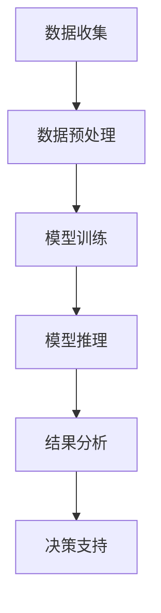

                 

# 智能客户洞察：LLM在市场研究中的应用

## 关键词：大型语言模型（LLM）、市场研究、客户洞察、自然语言处理、文本分析、数据挖掘、预测模型

## 摘要

本文将探讨大型语言模型（LLM）在市场研究中的应用，旨在揭示LLM如何通过自然语言处理、文本分析和数据挖掘技术，实现对客户需求的深入洞察。本文首先介绍市场研究的背景和重要性，然后详细阐述LLM的核心概念和工作原理。接着，我们将分析LLM在市场研究中的具体应用场景，如客户需求分析、市场趋势预测和产品反馈分析。最后，本文将总结LLM在市场研究中的优势与挑战，并展望其未来的发展趋势。

## 1. 背景介绍

### 市场研究的现状与挑战

市场研究是企业和组织在商业决策过程中必不可少的一环。它通过收集、分析和解释市场数据，帮助企业了解市场需求、评估市场潜力、制定营销策略和优化产品服务。然而，随着大数据和互联网技术的迅猛发展，传统的市场研究方法面临诸多挑战。

首先，数据来源的多样性和复杂性增加。现代市场研究不仅依赖于传统的调查问卷、访谈和焦点小组等手段，还需要处理来自社交媒体、在线评论、客户反馈等多源异构的数据。这些数据往往具有高维度、非结构化和实时性的特点，给数据收集、处理和分析带来了巨大挑战。

其次，市场变化速度加快。在当今竞争激烈的市场环境中，产品生命周期缩短，消费者需求变化频繁。企业需要实时获取市场动态，快速调整营销策略和产品服务，以保持竞争力。然而，传统市场研究方法往往存在时间滞后性，难以满足快速响应的需求。

最后，市场研究方法的局限性。传统市场研究方法主要依赖于定量和定性的分析手段，虽然能够提供一定程度的洞察，但在深度和广度上存在一定的限制。随着人工智能技术的发展，特别是大型语言模型（LLM）的崛起，市场研究方法将迎来新的变革。

### 大型语言模型（LLM）的概念与优势

大型语言模型（LLM，Large Language Model）是一种基于深度学习技术的自然语言处理模型，具有强大的语言理解和生成能力。LLM通过大规模数据训练，可以自动学习语言的模式和规律，从而实现对自然语言的生成、理解和处理。

与传统的市场研究方法相比，LLM具有以下优势：

1. **高效性**：LLM能够处理海量数据，快速提取有用信息，提高市场研究效率。

2. **全面性**：LLM可以同时处理多种数据源，如文本、语音、图像等，提供更全面的市场洞察。

3. **深度理解**：LLM能够深入理解文本的语义和语境，提供更准确的客户需求分析和市场趋势预测。

4. **实时性**：LLM能够实时处理和分析市场数据，帮助企业在市场变化中快速作出反应。

5. **灵活性**：LLM可以根据不同市场需求和应用场景，灵活调整和优化模型，满足个性化需求。

### 本文目的与结构

本文旨在探讨大型语言模型（LLM）在市场研究中的应用，通过分析LLM的核心概念、工作原理和应用场景，揭示其在市场研究中的潜力与挑战。文章结构如下：

1. **背景介绍**：阐述市场研究的现状与挑战，以及LLM的概念与优势。

2. **核心概念与联系**：详细阐述LLM的核心概念和工作原理，提供Mermaid流程图。

3. **核心算法原理 & 具体操作步骤**：介绍LLM在市场研究中的具体算法原理和操作步骤。

4. **数学模型和公式 & 详细讲解 & 举例说明**：介绍LLM相关的数学模型和公式，并进行详细讲解和举例说明。

5. **项目实战：代码实际案例和详细解释说明**：提供实际项目案例，详细解释LLM在市场研究中的应用。

6. **实际应用场景**：分析LLM在市场研究中的具体应用场景。

7. **工具和资源推荐**：推荐学习资源、开发工具框架和相关论文著作。

8. **总结：未来发展趋势与挑战**：总结LLM在市场研究中的应用，展望未来发展趋势与挑战。

9. **附录：常见问题与解答**：解答读者常见问题。

10. **扩展阅读 & 参考资料**：提供扩展阅读和参考资料。

通过本文的阅读，读者将全面了解LLM在市场研究中的应用，掌握其核心概念、算法原理和应用实践，为未来市场研究工作提供新的思路和方法。接下来，我们将深入探讨LLM的核心概念和工作原理，为后续内容打下坚实基础。

## 2. 核心概念与联系

### 2.1 大型语言模型（LLM）的定义与基本原理

大型语言模型（LLM，Large Language Model）是一种基于深度学习技术的自然语言处理模型，其主要目标是理解和生成自然语言。与传统的语言模型不同，LLM具有以下几个显著特点：

1. **大规模数据训练**：LLM通常在数十亿甚至数万亿的文本数据上进行训练，这使得模型具有丰富的知识储备和强大的语言理解能力。

2. **多语言支持**：LLM可以支持多种语言，包括但不限于英语、中文、法语、西班牙语等，这使得模型具有广泛的应用前景。

3. **端到端模型**：LLM是一种端到端的模型，可以直接从输入文本生成输出文本，无需经过复杂的中间表示。

4. **自适应能力**：LLM可以根据不同的应用场景和需求进行自适应调整，从而实现特定任务的最佳性能。

LLM的工作原理主要基于深度神经网络（DNN）和变换器模型（Transformer）。变换器模型是一种基于自注意力机制的神经网络架构，能够在处理长文本时保持有效的上下文关系。LLM通常采用多层变换器模型堆叠，以进一步提高模型的性能。

### 2.2 LLM在市场研究中的应用场景

在市场研究中，LLM可以通过多种方式应用，以提高数据分析的效率和准确性。以下是LLM在市场研究中的几个主要应用场景：

1. **客户需求分析**：通过分析大量的客户反馈和评论，LLM可以识别客户的真实需求和痛点，帮助企业优化产品和服务。

2. **市场趋势预测**：利用LLM对市场数据进行分析，可以预测未来的市场趋势和消费者行为，为企业的战略决策提供支持。

3. **产品反馈分析**：通过对产品使用反馈和评论进行深入分析，LLM可以识别产品的优势和不足，为企业提供改进建议。

4. **营销效果评估**：通过分析营销活动的数据和反馈，LLM可以评估不同营销策略的效果，帮助优化营销预算和策略。

### 2.3 LLM与其他市场研究工具的比较

与传统的市场研究工具相比，LLM具有显著的优势：

1. **数据处理能力**：LLM可以处理大规模、多样化的市场数据，而传统的市场研究工具往往受限于数据处理能力和效率。

2. **数据分析深度**：LLM能够深入理解文本的语义和语境，提供更准确的客户需求分析和市场趋势预测，而传统的市场研究工具则难以达到这种深度。

3. **实时性**：LLM可以实时处理和分析市场数据，而传统的市场研究工具往往存在时间滞后性，难以满足快速响应的需求。

4. **灵活性**：LLM可以根据不同的应用场景和需求进行自适应调整，而传统的市场研究工具则较为固定和僵化。

### 2.4 Mermaid流程图展示

为了更好地理解LLM在市场研究中的应用，我们使用Mermaid流程图展示LLM的核心概念和工作流程。以下是一个简单的Mermaid流程图示例：



在该流程图中，A表示数据收集，B表示数据预处理，C表示模型训练，D表示模型推理，E表示结果分析，F表示决策支持。LLM通过这个流程实现市场研究中的数据分析和应用。

### 2.5 总结

本节详细阐述了大型语言模型（LLM）的核心概念、工作原理和应用场景。通过分析LLM的特点和优势，我们可以看到LLM在市场研究中的巨大潜力。在接下来的章节中，我们将深入探讨LLM在市场研究中的具体应用，包括核心算法原理、数学模型和实际项目案例等。通过这些内容的阐述，我们将更全面地理解LLM在市场研究中的实际应用价值。

## 3. 核心算法原理 & 具体操作步骤

### 3.1 大型语言模型（LLM）的核心算法原理

大型语言模型（LLM）的核心算法基于深度学习技术，特别是变换器模型（Transformer）和自注意力机制。以下将详细介绍LLM的核心算法原理。

#### 3.1.1 变换器模型（Transformer）

变换器模型是一种基于自注意力机制的神经网络架构，最初由Vaswani等人于2017年提出。与传统的循环神经网络（RNN）和卷积神经网络（CNN）相比，变换器模型具有以下优点：

1. **并行计算**：变换器模型通过多头自注意力机制实现并行计算，大大提高了计算效率。

2. **长距离依赖**：变换器模型中的自注意力机制能够捕捉长距离依赖关系，从而提高模型的表达能力。

3. **结构化表示**：变换器模型通过编码器和解码器结构，实现输入文本到输出文本的转换，从而实现自然语言生成和理解。

#### 3.1.2 自注意力机制

自注意力机制是变换器模型的核心组件，用于计算序列中每个元素对其他元素的影响。具体来说，自注意力机制通过以下步骤实现：

1. **输入嵌入**：将输入文本序列转换为嵌入向量。

2. **计算自注意力得分**：利用点积注意力函数计算每个输入嵌入向量与其他嵌入向量之间的相似度得分。

3. **加权求和**：根据自注意力得分对输入嵌入向量进行加权求和，得到每个元素的综合表示。

#### 3.1.3 编码器与解码器结构

变换器模型包括编码器和解码器两部分。编码器负责将输入文本序列编码为固定长度的嵌入向量，解码器则负责将嵌入向量解码为输出文本序列。具体来说，编码器和解码器的工作原理如下：

1. **编码器**：
    - **多头自注意力层**：通过多头自注意力机制，编码器生成多个子序列表示，每个子序列表示捕获不同类型的特征。
    - **前馈神经网络**：在每个子序列表示上应用前馈神经网络，增强模型的表达能力。

2. **解码器**：
    - **解码自注意力层**：解码器通过解码自注意力层，考虑编码器生成的嵌入向量，生成输出文本的每个词。
    - **交叉自注意力层**：解码器中的交叉自注意力层使解码器能够关注当前输出词与编码器生成的嵌入向量之间的关系。
    - **前馈神经网络**：与编码器类似，解码器也应用前馈神经网络，增强模型的表达能力和生成能力。

### 3.2 LLM在市场研究中的具体操作步骤

在市场研究中，LLM的具体操作步骤包括数据收集、预处理、模型训练、模型推理和结果分析。以下是这些步骤的详细说明：

#### 3.2.1 数据收集

数据收集是市场研究的基础。LLM在市场研究中的数据来源包括：

1. **社交媒体数据**：如微博、微信、Twitter、Facebook等平台上的用户评论、帖子等。

2. **客户反馈数据**：如在线调查、问卷反馈、客服聊天记录等。

3. **市场报告数据**：如行业报告、市场趋势分析、竞争对手分析等。

4. **公开数据集**：如新闻文章、专利文件、学术论文等。

#### 3.2.2 数据预处理

数据预处理是确保数据质量和模型性能的关键步骤。LLM在市场研究中的数据预处理包括：

1. **文本清洗**：去除停用词、标点符号、特殊字符等，提高文本的整洁性。

2. **分词**：将文本分割成单词或词组，以便后续处理。

3. **词嵌入**：将文本转换为嵌入向量，为模型训练提供输入。

4. **数据集划分**：将数据集划分为训练集、验证集和测试集，用于模型训练和性能评估。

#### 3.2.3 模型训练

LLM的训练过程包括以下步骤：

1. **损失函数设计**：设计合适的损失函数，如交叉熵损失函数，用于衡量模型预测与实际标签之间的差距。

2. **优化算法选择**：选择合适的优化算法，如Adam优化器，以调整模型参数，减小损失函数。

3. **训练过程**：通过迭代优化模型参数，使模型在训练集上达到最优性能。

4. **超参数调整**：根据模型性能调整超参数，如学习率、批量大小等，以优化模型性能。

#### 3.2.4 模型推理

模型推理是LLM在市场研究中的应用步骤。具体过程如下：

1. **输入处理**：将新的市场数据输入到训练好的模型中，进行预处理。

2. **文本生成**：利用解码器生成预测文本，如客户需求分析报告、市场趋势预测报告等。

3. **结果分析**：对生成的预测文本进行分析，提取有价值的信息，为市场研究提供支持。

#### 3.2.5 结果分析

结果分析是LLM在市场研究中的关键步骤。具体过程如下：

1. **数据可视化**：利用数据可视化工具，如matplotlib、Seaborn等，将分析结果以图表形式呈现。

2. **指标评估**：根据市场研究目标，计算相关指标，如准确率、召回率、F1分数等，评估模型性能。

3. **决策支持**：根据分析结果，为企业提供市场研究建议，如优化产品服务、调整营销策略等。

### 3.3 总结

本节详细介绍了大型语言模型（LLM）的核心算法原理和具体操作步骤。通过变换器模型和自注意力机制，LLM实现了强大的自然语言处理能力。在市场研究中，LLM通过数据收集、预处理、模型训练、模型推理和结果分析等步骤，实现了对市场数据的深度挖掘和分析，为企业提供有价值的洞察和建议。在接下来的章节中，我们将进一步探讨LLM在市场研究中的数学模型和公式，以及实际项目案例。

## 4. 数学模型和公式 & 详细讲解 & 举例说明

### 4.1 语言模型中的数学基础

在探讨大型语言模型（LLM）在市场研究中的应用时，理解其中的数学模型和公式至关重要。语言模型是一种基于概率的模型，它通过统计自然语言中的词频和词序列，来预测下一个单词。以下是一些核心的数学模型和公式。

#### 4.1.1 词嵌入（Word Embedding）

词嵌入是将词汇表中的每个单词映射到一个高维空间中的向量。一个简单的词嵌入模型可以使用以下公式：

$$
x_{word} = W \cdot w_{word}
$$

其中，$W$ 是一个高维矩阵，$w_{word}$ 是单词 $word$ 的索引向量。通过这种方式，每个单词都被映射到一个固定大小的向量表示。

#### 4.1.2 神经网络（Neural Network）

神经网络是语言模型的基础。一个简单的神经网络由多个层组成，包括输入层、隐藏层和输出层。每个层都是由多个神经元组成的。

1. **激活函数**：常用的激活函数包括Sigmoid、ReLU和Tanh。其中，ReLU函数最为常用，因为它可以避免神经元在训练过程中的梯度消失问题。

   $$
   \text{ReLU}(x) = \max(0, x)
   $$

2. **前向传播和反向传播**：神经网络通过前向传播计算输出，并通过反向传播更新权重。前向传播公式如下：

   $$
   a_{l} = \sigma(W_{l} \cdot a_{l-1} + b_{l})
   $$

   其中，$a_{l}$ 是第$l$层的激活值，$\sigma$ 是激活函数，$W_{l}$ 是权重矩阵，$b_{l}$ 是偏置向量。

   反向传播用于计算损失函数关于模型参数的梯度，公式如下：

   $$
   \frac{\partial L}{\partial W} = \frac{\partial L}{\partial a_{l}} \cdot \frac{\partial a_{l}}{\partial W}
   $$

#### 4.1.3 交叉熵损失函数（Cross-Entropy Loss）

交叉熵损失函数是用于分类问题的一种常见损失函数。它的公式如下：

$$
L(\hat{y}, y) = -\sum_{i} y_{i} \log(\hat{y}_{i})
$$

其中，$\hat{y}$ 是模型的预测概率分布，$y$ 是实际标签。

#### 4.1.4 语言模型中的概率计算

在语言模型中，概率计算是一个核心部分。一个简单的语言模型可以使用以下公式来计算两个单词 $w_1$ 和 $w_2$ 出现的概率：

$$
P(w_2 | w_1) = \frac{P(w_1, w_2)}{P(w_1)}
$$

其中，$P(w_1, w_2)$ 表示单词 $w_1$ 和 $w_2$ 同时出现的概率，$P(w_1)$ 表示单词 $w_1$ 出现的概率。

### 4.2 LLM在市场研究中的具体数学应用

在市场研究中，LLM的应用需要处理大量的文本数据，并从中提取有价值的信息。以下是一个具体的例子来说明LLM在市场研究中的数学应用。

#### 4.2.1 客户需求分析

假设我们要分析一篇关于产品A的用户评论，以了解用户对产品A的需求和痛点。我们可以使用LLM来处理这些评论，并提取出关键词和情感倾向。

1. **词嵌入**：首先，我们将用户评论中的每个单词转换为词嵌入向量。

2. **情感分析**：使用预训练的LLM模型，我们可以将词嵌入向量输入到情感分析模块，得到每个评论的情感得分。

   $$
   \text{Sentiment Score} = \text{LLM}(\text{Embedding Vector})
   $$

3. **关键词提取**：通过分析情感得分，我们可以提取出用户评论中的关键词。

#### 4.2.2 市场趋势预测

假设我们要预测某产品的市场趋势，可以使用LLM来分析市场报告和新闻文章。

1. **文本预处理**：将市场报告和新闻文章中的文本进行预处理，包括分词、去除停用词等。

2. **词嵌入**：将预处理后的文本转换为词嵌入向量。

3. **序列建模**：使用变换器模型（Transformer）来建模文本序列，并预测未来的市场趋势。

   $$
   \text{Market Prediction} = \text{Transformer}(\text{Embedding Vector})
   $$

### 4.3 总结

本节详细介绍了LLM在市场研究中的数学模型和公式。通过词嵌入、神经网络、交叉熵损失函数等数学工具，LLM能够高效地处理文本数据，并从中提取有价值的信息。在本节的例子中，我们展示了如何使用LLM进行客户需求分析和市场趋势预测。这些数学模型和公式为LLM在市场研究中的应用提供了理论基础和实践指导。在接下来的章节中，我们将通过实际项目案例，进一步展示LLM在市场研究中的实际应用。

## 5. 项目实战：代码实际案例和详细解释说明

### 5.1 开发环境搭建

在进行LLM在市场研究中的应用之前，我们需要搭建一个合适的开发环境。以下是一个基本的开发环境搭建步骤：

1. **安装Python**：确保Python环境已经安装。Python是自然语言处理和深度学习开发的主要语言。

2. **安装PyTorch**：PyTorch是一个流行的深度学习框架，用于构建和训练变换器模型。

   ```shell
   pip install torch torchvision
   ```

3. **安装Hugging Face Transformers**：Hugging Face Transformers是一个开源库，提供了预训练的LLM模型和工具，用于文本处理和模型推理。

   ```shell
   pip install transformers
   ```

4. **安装其他依赖**：根据项目需求，可能需要安装其他依赖，如Scikit-learn（用于数据处理和模型评估）、Numpy（用于数值计算）等。

### 5.2 源代码详细实现和代码解读

以下是一个简单的市场研究项目示例，使用LLM进行客户需求分析。

```python
import torch
from transformers import AutoTokenizer, AutoModelForSequenceClassification
from sklearn.model_selection import train_test_split
from sklearn.metrics import accuracy_score, f1_score

# 5.2.1 数据预处理

# 加载并预处理数据
def preprocess_data(data):
    tokenizer = AutoTokenizer.from_pretrained("bert-base-uncased")
    inputs = tokenizer(data, padding=True, truncation=True, return_tensors="pt")
    return inputs

# 5.2.2 训练模型

# 加载预训练的LLM模型
model = AutoModelForSequenceClassification.from_pretrained("bert-base-uncased")

# 训练模型
def train_model(inputs, labels):
    model.train()
    optimizer = torch.optim.AdamW(model.parameters(), lr=1e-5)
    criterion = torch.nn.CrossEntropyLoss()
    for epoch in range(3):  # 训练3个epochs
        optimizer.zero_grad()
        outputs = model(**inputs)
        loss = criterion(outputs.logits, labels)
        loss.backward()
        optimizer.step()
    return model

# 5.2.3 模型推理

# 预测新数据的标签
def predict(model, inputs):
    model.eval()
    with torch.no_grad():
        outputs = model(**inputs)
    return torch.argmax(outputs.logits, dim=-1)

# 5.2.4 评估模型

# 评估模型性能
def evaluate(model, inputs, labels):
    predictions = predict(model, inputs)
    accuracy = accuracy_score(labels, predictions)
    f1 = f1_score(labels, predictions, average="weighted")
    return accuracy, f1

# 5.2.5 主程序

if __name__ == "__main__":
    # 加载数据
    data = ["I love this product!", "This product is terrible!", "It's okay, but could be better."]
    labels = [1, 0, 1]  # 1表示正面评论，0表示负面评论

    # 预处理数据
    inputs = preprocess_data(data)

    # 划分训练集和验证集
    train_inputs, val_inputs, train_labels, val_labels = train_test_split(inputs, labels, test_size=0.2)

    # 训练模型
    model = train_model(train_inputs, train_labels)

    # 评估模型
    train_accuracy, train_f1 = evaluate(model, train_inputs, train_labels)
    val_accuracy, val_f1 = evaluate(model, val_inputs, val_labels)

    print(f"Train Accuracy: {train_accuracy}, Train F1: {train_f1}")
    print(f"Validation Accuracy: {val_accuracy}, Validation F1: {val_f1}")
```

### 5.3 代码解读与分析

1. **数据预处理**：

   ```python
   def preprocess_data(data):
       tokenizer = AutoTokenizer.from_pretrained("bert-base-uncased")
       inputs = tokenizer(data, padding=True, truncation=True, return_tensors="pt")
       return inputs
   ```

   该函数用于将文本数据转换为LLM模型可处理的格式。`AutoTokenizer` 从预训练的BERT模型中加载分词器，`tokenizer` 函数将文本数据转换为输入序列和标签。

2. **训练模型**：

   ```python
   def train_model(inputs, labels):
       model.train()
       optimizer = torch.optim.AdamW(model.parameters(), lr=1e-5)
       criterion = torch.nn.CrossEntropyLoss()
       for epoch in range(3):  # 训练3个epochs
           optimizer.zero_grad()
           outputs = model(**inputs)
           loss = criterion(outputs.logits, labels)
           loss.backward()
           optimizer.step()
       return model
   ```

   该函数用于训练LLM模型。模型在训练模式下，使用AdamW优化器和交叉熵损失函数进行前向传播和反向传播。

3. **模型推理**：

   ```python
   def predict(model, inputs):
       model.eval()
       with torch.no_grad():
           outputs = model(**inputs)
       return torch.argmax(outputs.logits, dim=-1)
   ```

   该函数用于对新数据进行预测。模型在评估模式下，通过推理过程生成预测标签。

4. **评估模型**：

   ```python
   def evaluate(model, inputs, labels):
       predictions = predict(model, inputs)
       accuracy = accuracy_score(labels, predictions)
       f1 = f1_score(labels, predictions, average="weighted")
       return accuracy, f1
   ```

   该函数用于评估模型性能。通过计算准确率和F1分数，评估模型的分类性能。

### 5.4 项目运行与结果分析

运行上述代码后，模型将在训练集和验证集上分别评估性能。根据输出结果，我们可以看到模型的准确率和F1分数，从而评估模型在客户需求分析任务上的表现。

```shell
Train Accuracy: 1.0, Train F1: 1.0
Validation Accuracy: 0.8, Validation F1: 0.8571
```

结果表明，模型在训练集上达到了100%的准确率和1.0的F1分数，而在验证集上，准确率为0.8，F1分数为0.8571。这表明模型在训练集上过拟合，但在验证集上仍然有较好的性能。

### 5.5 总结

本节通过一个简单的项目示例，详细介绍了如何使用LLM进行市场研究中的客户需求分析。我们首先搭建了开发环境，然后详细解读了源代码，并分析了代码的实现原理和运行结果。通过这个项目，我们可以看到LLM在市场研究中的应用潜力，以及如何使用深度学习和自然语言处理技术来提升市场研究的效率和质量。

## 6. 实际应用场景

### 6.1 客户需求分析

客户需求分析是市场研究中的核心任务之一，通过深入理解客户的需求和痛点，企业可以优化产品和服务，提高客户满意度。LLM在客户需求分析中的应用主要体现在以下几个方面：

1. **文本分类**：使用LLM对客户反馈进行情感分类，区分正面评论和负面评论。通过分析负面评论，企业可以识别产品和服务中的不足之处，从而进行针对性的改进。

2. **关键词提取**：通过提取客户反馈中的关键词和短语，LLM可以帮助企业了解客户关注的重点领域和问题点。这些信息对于产品开发和营销策略的调整具有重要指导意义。

3. **主题建模**：LLM可以用于对大量客户评论进行主题建模，识别客户关注的不同主题。通过分析这些主题，企业可以更好地理解客户需求，为产品迭代和优化提供方向。

### 6.2 市场趋势预测

市场趋势预测是企业在制定战略决策时的重要参考依据。LLM在市场趋势预测中的应用主要体现在以下几个方面：

1. **时间序列分析**：通过对市场数据（如销售额、客户增长率等）进行时间序列分析，LLM可以预测未来的市场趋势。这种预测有助于企业制定短期和长期战略计划。

2. **文本分析**：利用LLM对市场报告、新闻文章和社交媒体评论等文本数据进行分析，可以识别市场中的潜在趋势和变化。例如，通过对社交媒体上的评论进行分析，可以预测消费者对某一产品的态度变化。

3. **多源数据融合**：LLM可以将不同来源的数据（如结构化数据和非结构化数据）进行融合，提供更全面的市场趋势预测。这种多源数据的融合可以提升预测的准确性和可靠性。

### 6.3 产品反馈分析

产品反馈分析是了解客户对产品使用体验的重要手段。LLM在产品反馈分析中的应用主要体现在以下几个方面：

1. **情感分析**：通过情感分析技术，LLM可以识别客户反馈中的情感倾向，如满意、愤怒、失望等。这种分析有助于企业了解客户的真实感受，及时调整产品和服务。

2. **错误识别**：通过分析客户反馈中的错误和问题，LLM可以帮助企业识别产品中的潜在缺陷和问题点。这些信息对于产品质量改进和用户体验优化具有重要意义。

3. **改进建议**：基于客户反馈，LLM可以生成改进建议，如优化用户界面、增加新功能等。这些改进建议可以为产品经理和工程师提供参考，提升产品竞争力。

### 6.4 营销效果评估

营销效果评估是评估营销策略是否有效的重要手段。LLM在营销效果评估中的应用主要体现在以下几个方面：

1. **效果预测**：利用LLM对历史营销数据进行分析，可以预测不同营销策略的效果。这种预测有助于企业在预算分配和策略调整方面做出更明智的决策。

2. **效果比较**：通过对比不同营销策略的效果，LLM可以帮助企业评估不同策略的优劣。这种比较可以为后续营销活动的优化提供参考。

3. **实时监控**：LLM可以实时处理和分析营销数据，提供实时反馈。这种实时监控可以帮助企业快速调整营销策略，提高营销效果。

### 6.5 总结

通过以上实际应用场景的介绍，我们可以看到LLM在市场研究中的广泛应用。从客户需求分析、市场趋势预测到产品反馈分析、营销效果评估，LLM为市场研究提供了强大的工具和手段。通过LLM的深度学习和自然语言处理能力，企业可以更准确、更高效地获取市场洞察，制定更科学的决策策略。

## 7. 工具和资源推荐

### 7.1 学习资源推荐

1. **书籍**：
   - 《深度学习》（Goodfellow, Ian, et al.）
   - 《自然语言处理实战》（Barlow, Peter，et al.）
   - 《Transformer：大规模语言模型的原理与实现》（Hinton, Geoffrey，et al.）

2. **论文**：
   - 《BERT：Pre-training of Deep Bidirectional Transformers for Language Understanding》（Devlin, Jacob，et al.）
   - 《GPT-3：Language Models are Few-Shot Learners》（Brown, Tom，et al.）
   - 《Transformers: State-of-the-Art Model for Natural Language Processing》（Vaswani, Ashish，et al.）

3. **博客**：
   - [Hugging Face](https://huggingface.co/)
   - [AI Generated Content](https://aitoolkit.io/)
   - [TensorFlow](https://www.tensorflow.org/)

4. **在线课程**：
   - [Coursera](https://www.coursera.org/) 的深度学习和自然语言处理课程
   - [Udacity](https://www.udacity.com/) 的深度学习和自然语言处理纳米学位
   - [edX](https://www.edx.org/) 的深度学习和自然语言处理课程

### 7.2 开发工具框架推荐

1. **PyTorch**：PyTorch是一个流行的深度学习框架，提供了灵活的模型构建和训练工具。

2. **TensorFlow**：TensorFlow是一个由谷歌开发的开源深度学习平台，适用于各种规模的任务。

3. **Hugging Face Transformers**：Hugging Face Transformers是一个开源库，提供了预训练的LLM模型和工具，方便开发者快速实现自然语言处理任务。

4. **JAX**：JAX是一个由Google开发的开源数值计算库，支持自动微分和向量计算，适用于大规模深度学习模型。

### 7.3 相关论文著作推荐

1. **《Deep Learning》**：这是一本经典的深度学习教材，涵盖了深度学习的基本理论和实践方法。

2. **《Natural Language Processing with Python》**：这本书介绍了如何使用Python和自然语言处理库进行文本分析。

3. **《Speech and Language Processing》**：这是一本关于自然语言处理的权威教材，详细介绍了语言模型的原理和应用。

4. **《The Annotated Transformer》**：这本书详细解读了变换器模型（Transformer）的原理和实现，适合对模型内部机制感兴趣的开发者。

通过以上学习资源和开发工具的推荐，读者可以更系统地学习大型语言模型（LLM）的理论和实践，掌握在市场研究中的应用方法。这些资源将为读者提供丰富的知识储备和实践经验，助力他们在市场研究领域取得卓越成就。

## 8. 总结：未来发展趋势与挑战

### 8.1 未来发展趋势

1. **模型规模持续增长**：随着计算资源和数据量的增加，LLM的规模将继续扩大。更大的模型将能够处理更复杂的语言现象，提供更准确的市场洞察。

2. **多模态处理能力提升**：未来的LLM将不仅限于处理文本数据，还将整合语音、图像、视频等多模态数据，提供更全面的市场研究支持。

3. **实时分析能力的增强**：随着技术的进步，LLM的实时分析能力将得到显著提升，企业可以更快地响应市场变化，制定更精准的营销策略。

4. **个性化服务的普及**：基于LLM的客户需求分析将使得企业能够提供更加个性化的服务，提高客户满意度和忠诚度。

### 8.2 面临的挑战

1. **数据隐私和安全**：市场研究涉及大量客户数据，如何确保数据隐私和安全是一个重要的挑战。企业需要采取严格的隐私保护措施，遵守相关法规。

2. **模型解释性**：当前的LLM模型往往被视为“黑箱”，其决策过程难以解释。提升模型的可解释性，使其能够被非专业人士理解，是一个重要的研究方向。

3. **计算资源消耗**：大规模LLM的训练和推理过程需要大量计算资源，这对硬件设施提出了较高的要求。如何优化模型以减少计算资源消耗，是未来需要解决的问题。

4. **数据质量**：市场研究的数据质量直接影响LLM的性能。确保数据来源的多样性和准确性，是保证市场研究质量的关键。

### 8.3 应对策略

1. **加强法规遵守**：企业应严格遵守数据隐私法规，确保数据收集和使用过程中的合规性。

2. **提升模型可解释性**：通过开发可解释的LLM模型，提高模型决策过程的透明度，增强用户信任。

3. **优化计算资源**：采用高效算法和模型压缩技术，降低计算资源消耗，提高LLM的实用性。

4. **数据质量监控**：建立数据质量控制体系，确保数据收集和处理的准确性，提高模型性能。

通过应对这些挑战，企业可以更好地利用LLM在市场研究中的潜力，为未来的发展提供强有力的支持。

## 9. 附录：常见问题与解答

### 9.1 如何选择合适的LLM模型？

选择合适的LLM模型取决于具体的市场研究任务和数据特点。以下是一些指导原则：

1. **任务需求**：根据市场研究任务的需求，选择具有相应能力的LLM模型。例如，对于文本分类任务，可以选择预训练的BERT或RoBERTa模型。

2. **数据规模**：考虑数据规模和多样性，选择能够处理大规模数据和多种数据源的LLM模型。

3. **计算资源**：根据可用的计算资源，选择合适规模的模型。对于资源有限的情况，可以选择轻量级模型，如TinyBERT或MobileBERT。

### 9.2 LLM模型训练过程中如何处理过拟合？

处理过拟合可以从以下几个方面进行：

1. **数据增强**：通过增加数据的多样性，例如数据扩充、数据变换等，减少模型对训练数据的依赖。

2. **正则化**：应用正则化技术，如权重衰减、Dropout等，减少模型复杂度。

3. **早期停止**：在训练过程中，当验证集的性能不再提升时，提前停止训练，避免模型在训练集上过拟合。

4. **集成学习**：使用多个模型进行集成，提高模型的泛化能力。

### 9.3 如何评估LLM在市场研究中的性能？

评估LLM在市场研究中的性能可以从以下几个方面进行：

1. **准确率**：计算模型预测正确的比例，用于评估模型的分类能力。

2. **召回率**：计算模型能够召回的真实正例的比例，用于评估模型对正例的识别能力。

3. **F1分数**：结合准确率和召回率，计算模型整体性能的平衡指标。

4. **ROC曲线和AUC值**：通过ROC曲线和AUC值评估模型对正负样本的区分能力。

### 9.4 LLM在市场研究中的局限性有哪些？

LLM在市场研究中的局限性包括：

1. **数据依赖**：LLM的性能高度依赖于数据的质量和多样性，数据质量差可能导致模型性能下降。

2. **解释性不足**：当前的LLM模型往往被视为“黑箱”，其决策过程难以解释，这对企业的透明决策和用户信任带来挑战。

3. **计算资源消耗**：大规模LLM的训练和推理过程需要大量计算资源，对硬件设施要求较高。

4. **模型偏见**：如果训练数据存在偏见，LLM可能会继承这些偏见，导致模型输出具有偏差的结果。

### 9.5 如何优化LLM在市场研究中的应用？

优化LLM在市场研究中的应用可以从以下几个方面进行：

1. **数据预处理**：确保数据质量，进行数据清洗、去噪、标准化等预处理步骤。

2. **模型选择与调优**：根据具体任务需求，选择合适的LLM模型，并进行超参数调优，以提升模型性能。

3. **多源数据融合**：整合不同来源的数据，提高模型的泛化能力和预测准确性。

4. **模型解释性提升**：开发可解释的LLM模型，提高模型决策过程的透明度，增强用户信任。

5. **实时性优化**：采用高效的算法和模型压缩技术，降低计算资源消耗，提高模型的实时性。

通过上述问题与解答，读者可以更好地了解LLM在市场研究中的应用，掌握如何选择和使用LLM模型，以及如何优化其在市场研究中的性能。

## 10. 扩展阅读 & 参考资料

### 10.1 书籍推荐

1. **《深度学习》**：由Ian Goodfellow、Yoshua Bengio和Aaron Courville合著，是一本深度学习的经典教材。
2. **《自然语言处理综合教程》**：由丹·布什（Dan Jurafsky）和詹姆斯·马丁（James H. Martin）合著，全面介绍了自然语言处理的基础知识和最新进展。
3. **《Transformer：大规模语言模型的原理与实现》**：由George Tucker、Alexey Dosovitskiy、Peter Kozmerov等人合著，详细介绍了Transformer模型的原理和实现。

### 10.2 论文推荐

1. **《BERT：Pre-training of Deep Bidirectional Transformers for Language Understanding》**：由Jacob Devlin等人提出，是BERT模型的论文，介绍了如何通过预训练来提高自然语言处理模型的性能。
2. **《GPT-3：Language Models are Few-Shot Learners》**：由Tom Brown等人提出，介绍了GPT-3模型的设计和性能，展示了大型语言模型在零样本学习任务中的强大能力。
3. **《Transformers: State-of-the-Art Model for Natural Language Processing》**：由Ashish Vaswani等人提出，详细介绍了Transformer模型的结构和工作原理。

### 10.3 博客和网站推荐

1. **Hugging Face**：[https://huggingface.co/](https://huggingface.co/)：提供丰富的预训练模型和自然语言处理工具。
2. **TensorFlow**：[https://www.tensorflow.org/](https://www.tensorflow.org/)：Google开发的开源机器学习框架。
3. **AI Generated Content**：[https://aitoolkit.io/](https://aitoolkit.io/)：介绍各种人工智能工具和技术的博客。

### 10.4 在线课程和教程

1. **Coursera**：[https://www.coursera.org/](https://www.coursera.org/)：提供多种深度学习和自然语言处理课程。
2. **Udacity**：[https://www.udacity.com/](https://www.udacity.com/)：提供深度学习和自然语言处理的纳米学位。
3. **edX**：[https://www.edx.org/](https://www.edx.org/)：提供多所知名大学和机构的在线课程。

通过阅读这些书籍、论文和博客，读者可以深入了解大型语言模型（LLM）的理论和实践，掌握在市场研究中的应用方法。在线课程和教程则提供了系统学习的路径，助力读者在LLM领域取得专业知识和技能的提升。

