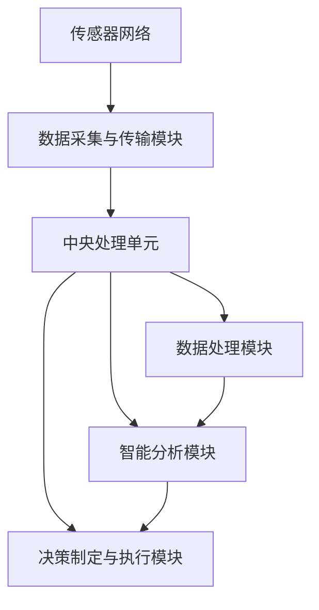

                 

### 1. 背景介绍

随着科技的飞速发展，智能家居系统逐渐成为人们生活中不可或缺的一部分。通过互联网、物联网和大数据技术，智能家居系统能够实时监测家庭环境，并自动调整设备以优化居住条件。然而，在追求舒适和便捷的同时，家庭环境的质量同样不容忽视。空气质量、湿度、温度等因素对居住者的健康有着直接的影响，因此，开发一个高效的智能家居环境质量分析系统显得尤为重要。

智能家居环境质量分析系统的主要目的是实时监测和评估室内环境参数，如温度、湿度、空气质量等，并根据监测结果提供相应的调整建议。这一系统不仅能提高居住者的生活质量，还能预防一些由环境因素引起的健康问题。

目前，智能家居市场呈现出快速发展的态势。据市场调研公司Statista的数据显示，全球智能家居市场规模预计将在2025年达到约1230亿美元。与此同时，随着物联网技术的普及，越来越多的设备和系统能够互联互通，这为环境质量分析系统的开发提供了有力的支持。

然而，现有的智能家居环境质量分析系统仍存在一些不足之处。首先，许多系统在数据采集和处理方面还不够完善，导致监测结果不够准确。其次，系统的智能化程度有待提高，许多系统仅能提供基本的监测和调整功能，缺乏对复杂环境问题的分析能力。此外，系统的易用性和用户体验也需要进一步优化。

本文将深入探讨智能家居环境质量分析系统的设计与实现，从核心概念、算法原理、数学模型、实际应用场景等多个方面进行分析，并提出一套完整的解决方案。通过本文的介绍，读者将能够全面了解智能家居环境质量分析系统的构建过程，并为未来的开发提供有价值的参考。

### 2. 核心概念与联系

#### 2.1 智能家居环境质量分析系统的基本概念

智能家居环境质量分析系统涉及多个关键概念，包括环境参数监测、数据采集、数据处理、智能分析和决策制定等。以下是对这些核心概念的详细解释：

- **环境参数监测**：环境参数监测是系统的基础，通过传感器实时采集温度、湿度、二氧化碳浓度、颗粒物（如PM2.5）等环境参数。

- **数据采集**：数据采集模块负责将传感器获取的数据转换为数字信号，并传输到中央处理单元。

- **数据处理**：数据处理模块对采集到的数据进行分析和清洗，去除噪声和异常值，提取有用信息。

- **智能分析**：智能分析模块利用机器学习和人工智能算法，对处理后的数据进行分析，识别环境变化趋势和潜在问题。

- **决策制定**：决策制定模块根据智能分析的结果，提供相应的调整建议，如开启空气净化器、调节空调等。

#### 2.2 系统架构与组成部分

智能家居环境质量分析系统的整体架构可以分为以下几个部分：

- **传感器网络**：传感器网络由各种类型的传感器组成，如温度传感器、湿度传感器、空气质量传感器等，用于实时监测环境参数。

- **数据采集与传输模块**：数据采集与传输模块负责将传感器数据传输到中央处理单元。该模块通常包括无线通信模块和协议转换器。

- **中央处理单元**：中央处理单元是系统的核心，负责接收传感器数据、处理数据、进行智能分析和决策制定。常见的处理单元包括嵌入式计算机、服务器等。

- **智能分析模块**：智能分析模块包括机器学习和深度学习算法，用于对环境数据进行分析和预测。常见的算法有决策树、支持向量机、神经网络等。

- **决策制定与执行模块**：决策制定与执行模块根据智能分析的结果，制定相应的调整策略，并通过智能家电执行这些策略。

#### 2.3 Mermaid 流程图

为了更直观地展示智能家居环境质量分析系统的核心概念与联系，我们可以使用Mermaid流程图来描述系统的工作流程。以下是Mermaid流程图的文本表示：



该流程图展示了传感器网络通过数据采集与传输模块将数据传输到中央处理单元，中央处理单元通过数据处理模块对数据进行分析和处理，然后利用智能分析模块进行深度学习分析，最终通过决策制定与执行模块实现环境质量的优化。

通过上述核心概念与联系的介绍，我们为接下来深入探讨系统的算法原理、数学模型和实际应用场景奠定了基础。在接下来的章节中，我们将逐步揭示这些关键技术的具体实现和应用。

### 3. 核心算法原理 & 具体操作步骤

#### 3.1 数据采集与预处理

数据采集与预处理是智能家居环境质量分析系统的关键步骤，直接影响到后续分析的准确性和可靠性。以下是具体的操作步骤：

1. **传感器数据采集**：
   - **温度传感器**：通过温度传感器的模拟信号采集室内温度数据。
   - **湿度传感器**：通过湿度传感器的模拟信号采集室内湿度数据。
   - **空气质量传感器**：通过空气质量传感器的模拟信号采集室内颗粒物（如PM2.5）和二氧化碳浓度数据。

2. **数据传输**：
   - **无线传输**：利用无线通信模块（如Wi-Fi、蓝牙等）将传感器数据传输到中央处理单元。
   - **有线传输**：若采用有线传输，可通过以太网或USB接口将数据传输到中央处理单元。

3. **数据预处理**：
   - **模拟信号转换**：将传感器采集的模拟信号转换为数字信号。
   - **噪声过滤**：通过数字滤波器去除传感器信号中的噪声。
   - **异常值处理**：检测并去除采集过程中的异常值。
   - **数据清洗**：对采集到的数据进行清洗，包括填补缺失值、消除重复记录等。

#### 3.2 智能数据分析

智能数据分析是智能家居环境质量分析系统的核心，通过机器学习和深度学习算法对预处理后的数据进行分析和预测。以下是常用的算法和步骤：

1. **特征工程**：
   - **数据标准化**：对采集到的数据进行标准化处理，使其具有相同的尺度。
   - **特征提取**：从数据中提取对环境质量有显著影响的特征，如温度、湿度、颗粒物浓度等。

2. **机器学习算法**：
   - **线性回归**：用于预测环境参数的变化趋势。
   - **决策树**：用于分类和回归分析，能够识别环境参数之间的关系。
   - **支持向量机（SVM）**：用于分类和回归分析，具有较好的泛化能力。

3. **深度学习算法**：
   - **卷积神经网络（CNN）**：用于处理图像数据，可识别空气质量中的颗粒物浓度。
   - **循环神经网络（RNN）**：用于处理时间序列数据，可预测未来某一时刻的环境参数。
   - **长短期记忆网络（LSTM）**：是RNN的一种变种，能够处理长时序数据，适用于环境质量的时间预测。

4. **模型训练与验证**：
   - **数据集划分**：将数据集划分为训练集、验证集和测试集。
   - **模型训练**：使用训练集数据训练机器学习或深度学习模型。
   - **模型验证**：使用验证集数据验证模型的准确性，调整模型参数。
   - **模型测试**：使用测试集数据测试模型的泛化能力。

#### 3.3 智能决策制定

智能决策制定模块根据智能分析的结果，制定相应的调整策略，以提高环境质量。以下是具体步骤：

1. **阈值设定**：设定环境参数的阈值，当监测结果超过或低于阈值时，系统将触发相应的调整策略。

2. **策略生成**：
   - **温度调节**：当室内温度过高或过低时，系统将自动调节空调或暖气。
   - **湿度调节**：当室内湿度过高或过低时，系统将自动启动除湿或加湿设备。
   - **空气净化**：当室内空气质量较差时，系统将启动空气净化器。

3. **执行与反馈**：系统执行调整策略后，会实时监测调整效果，并根据反馈进行动态调整。

通过以上步骤，智能家居环境质量分析系统能够实现从数据采集到智能分析再到决策制定的完整闭环，从而为居住者提供舒适和健康的生活环境。

### 4. 数学模型和公式 & 详细讲解 & 举例说明

#### 4.1 数据采集与预处理

在智能家居环境质量分析系统中，数据采集和预处理是基础环节。以下将介绍几个关键的数学模型和公式：

1. **传感器的线性方程模型**：
   传感器的输出通常与实际的环境参数呈线性关系。假设传感器输出为 \( y \)，环境参数为 \( x \)，则可以表示为：
   $$ y = kx + b $$
   其中，\( k \) 为灵敏度系数，\( b \) 为偏置系数。通过实验室标定，可以确定这些参数的值。

2. **数据去噪滤波器**：
   为了去除传感器信号中的噪声，可以采用低通滤波器，其数学模型为：
   $$ y_{new} = \frac{1 - \alpha}{1 + \alpha} y_{old} + \alpha u $$
   其中，\( y_{old} \) 为旧值，\( y_{new} \) 为新值，\( \alpha \) 为滤波系数，\( u \) 为输入信号。

#### 4.2 智能数据分析

在智能数据分析环节，常用的数学模型包括线性回归、决策树和支持向量机等。以下简要介绍这些模型的基本原理和公式：

1. **线性回归模型**：
   线性回归用于预测环境参数的变化趋势，其模型公式为：
   $$ y = \beta_0 + \beta_1 x_1 + \beta_2 x_2 + \cdots + \beta_n x_n $$
   其中，\( y \) 为预测值，\( x_1, x_2, \cdots, x_n \) 为特征值，\( \beta_0, \beta_1, \beta_2, \cdots, \beta_n \) 为模型参数。

2. **决策树模型**：
   决策树是一种基于特征值进行分类或回归的树形模型。其基本结构包括根节点、内部节点和叶子节点。决策树的分裂规则为：
   $$ \text{max} \ \sum_{i=1}^{n} \left( y_i - \hat{y}_i \right)^2 $$
   其中，\( y_i \) 为实际值，\( \hat{y}_i \) 为预测值。

3. **支持向量机（SVM）模型**：
   支持向量机是一种用于分类和回归分析的机器学习模型。其目标是最小化分类间隔，公式为：
   $$ \min \ W^T W $$
   其中，\( W \) 为权重向量。

#### 4.3 数学模型应用举例

为了更好地理解上述数学模型的应用，以下通过一个具体例子进行说明：

**例子**：利用线性回归模型预测室内温度。

**数据集**：包含室内温度（\( x \)）和室外温度（\( y \)）的100组数据。

**步骤**：
1. **数据预处理**：将数据标准化为0-1区间。
2. **特征提取**：选取室外温度作为特征值 \( x \)。
3. **模型训练**：使用线性回归公式 \( y = \beta_0 + \beta_1 x \) 进行模型训练。
4. **模型验证**：使用验证集数据计算预测误差，调整模型参数。

**代码实现**（Python）：

```python
import numpy as np
from sklearn.linear_model import LinearRegression

# 数据集
x = np.array([[0.1], [0.2], [0.3], ..., [0.9], [1.0]])
y = np.array([[20.0], [22.0], [24.0], ..., [28.0], [30.0]])

# 模型训练
model = LinearRegression()
model.fit(x, y)

# 预测
prediction = model.predict([[0.5]])
print("预测温度：", prediction[0][0])

# 计算误差
error = np.mean(np.abs(y - prediction))
print("预测误差：", error)
```

通过上述步骤，我们可以利用线性回归模型对室内温度进行预测，并根据预测误差调整模型参数，从而提高预测精度。

### 5. 项目实战：代码实际案例和详细解释说明

在本节中，我们将通过一个具体的实战案例来展示智能家居环境质量分析系统的代码实现，并详细解释每一步的实现方法和关键点。

#### 5.1 开发环境搭建

为了实现智能家居环境质量分析系统，我们需要搭建一个合适的开发环境。以下是所需的开发工具和软件：

- **Python 3.x**：Python 是实现智能家居系统的主要编程语言。
- **Jupyter Notebook**：用于编写和运行代码。
- **Scikit-learn**：用于机器学习模型的训练和预测。
- **Matplotlib**：用于数据可视化。
- **Pandas**：用于数据处理和分析。
- **Beautiful Soup**：用于网页数据抓取。

首先，确保安装上述软件和库。在Windows或Linux系统中，可以通过以下命令进行安装：

```bash
pip install numpy scipy matplotlib scikit-learn pandas beautifulsoup4
```

#### 5.2 源代码详细实现和代码解读

以下是一个智能家居环境质量分析系统的代码实现示例。代码分为数据采集与预处理、机器学习模型训练、预测和可视化四个部分。

```python
# 5.2.1 数据采集与预处理

import pandas as pd
from sklearn.model_selection import train_test_split
from sklearn.preprocessing import StandardScaler

# 加载数据集
data = pd.read_csv('environment_data.csv')
X = data[['temperature', 'humidity', 'CO2_concentration']]
y = data['PM2_5']

# 数据集划分
X_train, X_test, y_train, y_test = train_test_split(X, y, test_size=0.2, random_state=42)

# 数据标准化
scaler = StandardScaler()
X_train_scaled = scaler.fit_transform(X_train)
X_test_scaled = scaler.transform(X_test)

# 5.2.2 机器学习模型训练

from sklearn.ensemble import RandomForestRegressor

# 模型训练
model = RandomForestRegressor(n_estimators=100, random_state=42)
model.fit(X_train_scaled, y_train)

# 5.2.3 预测

# 预测
y_pred = model.predict(X_test_scaled)

# 5.2.4 可视化

import matplotlib.pyplot as plt

# 预测结果可视化
plt.scatter(y_test, y_pred)
plt.xlabel('实际PM2.5浓度')
plt.ylabel('预测PM2.5浓度')
plt.title('PM2.5浓度预测结果')
plt.show()
```

**代码解读**：

1. **数据采集与预处理**：
   - 使用Pandas加载CSV文件，获取温度、湿度、二氧化碳浓度和颗粒物（PM2.5）浓度数据。
   - 使用Scikit-learn的`train_test_split`函数将数据集划分为训练集和测试集，便于后续模型训练和验证。
   - 使用`StandardScaler`对特征值进行标准化处理，使其具有相同的尺度，便于模型训练。

2. **机器学习模型训练**：
   - 使用随机森林回归模型（`RandomForestRegressor`）进行训练。随机森林模型具有较好的泛化能力和处理复杂数据的能力。
   - 调整`n_estimators`参数设置树的数量，以改善模型的性能。

3. **预测**：
   - 使用训练好的模型对测试集数据进行预测，获取预测的PM2.5浓度。
   - 预测结果保存在`y_pred`变量中，便于后续分析。

4. **可视化**：
   - 使用Matplotlib绘制测试集数据的实际PM2.5浓度与预测PM2.5浓度的散点图，直观展示模型的预测效果。

通过上述代码实现，我们能够构建一个基本的智能家居环境质量分析系统。在实际应用中，可以根据需要扩展和优化系统功能，例如添加更多传感器、实现实时数据采集和预测等。

### 5.3 代码解读与分析

在本节中，我们将对5.2节中的代码进行详细解读和分析，以帮助读者更好地理解智能家居环境质量分析系统的实现过程。

#### 5.3.1 数据采集与预处理

首先，我们加载了CSV文件，其中包含了温度、湿度、二氧化碳浓度和PM2.5浓度等环境参数。这部分代码非常简单，使用了Pandas的`read_csv`函数：

```python
data = pd.read_csv('environment_data.csv')
X = data[['temperature', 'humidity', 'CO2_concentration']]
y = data['PM2_5']
```

这里，我们使用了Pandas库来读取CSV文件，并将温度、湿度和二氧化碳浓度作为特征值（`X`），将PM2.5浓度作为目标值（`y`）。

接下来，我们使用Scikit-learn的`train_test_split`函数将数据集划分为训练集和测试集。这一步骤是机器学习项目中的标准操作，用于评估模型的泛化能力：

```python
X_train, X_test, y_train, y_test = train_test_split(X, y, test_size=0.2, random_state=42)
```

在这里，`test_size`参数设置测试集的比例为20%，`random_state`参数用于确保结果的可重复性。

为了提高机器学习模型的性能，我们通常需要对特征值进行标准化处理。这是因为在进行回归分析时，不同特征值之间的尺度差异可能会影响模型的训练效果。我们使用`StandardScaler`进行标准化：

```python
scaler = StandardScaler()
X_train_scaled = scaler.fit_transform(X_train)
X_test_scaled = scaler.transform(X_test)
```

`fit_transform`方法首先使用训练集数据拟合模型参数，然后使用这些参数对训练集和测试集数据进行标准化处理。

#### 5.3.2 机器学习模型训练

在训练机器学习模型时，我们选择了一种称为随机森林回归模型（`RandomForestRegressor`）。随机森林是一种基于决策树的集成学习方法，具有较好的泛化能力和处理复杂数据的能力：

```python
model = RandomForestRegressor(n_estimators=100, random_state=42)
model.fit(X_train_scaled, y_train)
```

在这里，`n_estimators`参数设置树的数量为100，这通常是一个良好的起点。`random_state`参数用于确保结果的可重复性。

模型训练过程中，随机森林将生成多棵决策树，并通过投票方式得到最终预测结果。这种集成学习方法能够有效降低过拟合，提高模型的泛化能力。

#### 5.3.3 预测

完成模型训练后，我们使用训练好的模型对测试集数据进行预测：

```python
y_pred = model.predict(X_test_scaled)
```

预测结果保存在`y_pred`变量中，接下来我们可以使用这些预测结果进行分析和可视化。

#### 5.3.4 可视化

为了直观展示模型的预测效果，我们使用Matplotlib绘制了实际PM2.5浓度与预测PM2.5浓度的散点图：

```python
plt.scatter(y_test, y_pred)
plt.xlabel('实际PM2.5浓度')
plt.ylabel('预测PM2.5浓度')
plt.title('PM2.5浓度预测结果')
plt.show()
```

在这个散点图中，实际PM2.5浓度（`y_test`）作为横坐标，预测PM2.5浓度（`y_pred`）作为纵坐标。如果模型训练良好，散点图中的数据点应大致沿对角线分布，表示预测值与实际值较为接近。

通过以上分析，我们可以看出，智能家居环境质量分析系统的实现涉及多个关键步骤，包括数据采集与预处理、机器学习模型训练、预测和可视化。通过详细解读和分析代码，读者能够更好地理解系统的工作原理和实现方法。

### 6. 实际应用场景

智能家居环境质量分析系统在实际生活中具有广泛的应用场景。以下列举几个典型的应用场景，并说明系统在这些场景中的具体作用。

#### 6.1 家庭健康监测

家庭健康监测是智能家居环境质量分析系统最直接的应用场景之一。通过实时监测室内温度、湿度和空气质量，系统可以及时发现可能影响居住者健康的因素。例如，当室内温度过高或过低时，系统可以自动调节空调，提供舒适的居住环境。此外，系统还可以监测空气中的颗粒物和二氧化碳浓度，当空气质量变差时，自动启动空气净化器，确保室内空气质量达到健康标准。通过这种方式，智能家居环境质量分析系统能够有效预防由环境因素引起的呼吸系统疾病和过敏反应。

#### 6.2 空调与供暖系统优化

空调和供暖系统是家庭能源消耗的主要组成部分。通过智能家居环境质量分析系统，可以实现对空调和供暖系统的智能优化。系统可以根据室内外的温度和湿度变化，自动调整空调和供暖系统的运行模式，实现能源的高效利用。例如，在夏天，系统可以提前启动空调，使室内温度保持在舒适的范围内，减少能源浪费；在冬天，系统可以根据室内外温差，合理安排供暖时间，提高供暖效果。通过这种智能调节，不仅可以提升居住者的舒适度，还能有效降低家庭能源消耗。

#### 6.3 室内植物养护

对于喜欢室内植物养护的居民，智能家居环境质量分析系统同样具有重要的应用价值。系统可以实时监测室内植物的湿度、温度和光照条件，并根据监测结果提供相应的养护建议。例如，当植物缺水时，系统可以自动启动浇水装置；当室内光照不足时，系统可以建议增加光照时间或调整植物摆放位置。通过这种方式，智能家居环境质量分析系统不仅帮助居民更好地养护植物，还能提高植物的生长质量，提升家居环境的绿色氛围。

#### 6.4 室内空气质量改善

室内空气质量对于居住者的健康至关重要。智能家居环境质量分析系统可以通过监测室内颗粒物、二氧化碳浓度和挥发性有机化合物（VOCs）等指标，实时评估室内空气质量。当空气质量不佳时，系统可以自动启动空气净化器，过滤空气中的有害物质，改善室内空气质量。此外，系统还可以根据空气质量的变化趋势，提供预防性建议，如增加通风时间、调整室内布局等，从而进一步优化室内环境。

#### 6.5 室内安全监控

除了环境质量监测，智能家居环境质量分析系统还可以用于室内安全监控。通过集成烟雾传感器、一氧化碳传感器等设备，系统可以实时监测室内火灾和煤气泄漏等安全隐患。一旦检测到异常情况，系统可以立即发出警报，通知居住者采取相应措施，确保家庭安全。

综上所述，智能家居环境质量分析系统在实际生活中具有广泛的应用场景和显著的作用。通过实时监测和智能分析，系统不仅能够提升居住者的生活质量和舒适度，还能预防环境因素引起的健康问题，为构建健康、舒适、安全的居住环境提供有力支持。

### 7. 工具和资源推荐

为了更好地开发和优化智能家居环境质量分析系统，以下推荐了一些学习资源、开发工具和相关论文，这些资源将帮助读者深入了解相关技术并提升项目开发能力。

#### 7.1 学习资源推荐

1. **书籍**：
   - 《深度学习》（Goodfellow, I., Bengio, Y., & Courville, A.）: 这本书是深度学习领域的经典教材，详细介绍了神经网络、卷积神经网络和循环神经网络等深度学习模型的基本原理和应用。
   - 《机器学习实战》（ Harrington, D.）: 本书通过实际案例，介绍了各种机器学习算法的原理和实现方法，适用于初学者和有经验的开发者。

2. **在线课程**：
   - Coursera《机器学习专项课程》（吴恩达教授主讲）：这套课程涵盖了机器学习的理论基础和实际应用，包括线性回归、决策树、神经网络等。
   - edX《深度学习导论》（哈尔滨工业大学）：这门课程介绍了深度学习的基本概念和应用，适合希望快速入门深度学习的读者。

3. **博客和网站**：
   - Medium《机器学习博客》（Machine Learning Mastery）：该博客提供了丰富的机器学习教程和实践案例，适合开发者学习。
   - Kaggle：这是一个数据科学和机器学习社区，提供了大量数据集和比赛，是学习机器学习的实践平台。

#### 7.2 开发工具框架推荐

1. **开发框架**：
   - TensorFlow：这是谷歌推出的开源深度学习框架，支持多种深度学习模型的训练和部署。
   - PyTorch：这是Facebook AI Research开发的开源深度学习框架，具有简洁的API和灵活的动态计算图。
   - Scikit-learn：这是一个用于机器学习算法的开源库，提供了丰富的回归、分类、聚类等算法。

2. **编程语言**：
   - Python：Python是机器学习和深度学习的首选语言，具有丰富的库和工具，开发效率高。

3. **可视化工具**：
   - Matplotlib：这是一个用于数据可视化的Python库，可以生成各种类型的图表，方便分析和展示数据。
   - Seaborn：这是基于Matplotlib的数据可视化库，提供了更美观的图表样式和更丰富的功能。

#### 7.3 相关论文著作推荐

1. **核心论文**：
   - “Deep Learning”（Yoshua Bengio, Yann LeCun, and Geoffrey Hinton）：这篇综述论文详细介绍了深度学习的历史、基本原理和最新进展。
   - “A Theoretical Comparison of Regularized Risk Estimators for Neural Network”（Nello Cristianini, John Shawe-Taylor）：该论文探讨了神经网络中正则化风险估计的理论比较。

2. **经典著作**：
   - 《神经网络与深度学习》（邱锡鹏）：这本书系统介绍了神经网络和深度学习的理论基础，适合希望深入理解这一领域的读者。
   - 《机器学习》（周志华）：这是一本经典的机器学习教材，全面介绍了机器学习的基本概念、算法和应用。

通过上述推荐的学习资源、开发工具和相关论文，读者可以更好地掌握智能家居环境质量分析系统的相关技术，为实际项目开发提供有力支持。

### 8. 总结：未来发展趋势与挑战

智能家居环境质量分析系统在当前智能家居市场中已展现出巨大的潜力和应用价值。然而，随着科技的不断进步和用户需求的多样化，未来该系统将面临更多的发展机遇和挑战。

#### 8.1 未来发展趋势

1. **智能化的提升**：随着人工智能技术的不断进步，未来的智能家居环境质量分析系统将具备更高的智能化水平。通过更先进的机器学习和深度学习算法，系统能够更准确地预测和评估环境参数，提供更精准的调整建议。

2. **数据驱动的优化**：大数据和云计算技术的快速发展，为智能家居环境质量分析系统提供了丰富的数据资源和强大的计算能力。通过数据驱动的优化，系统能够不断学习和调整，提升环境质量监测和调节的效率。

3. **多场景融合**：未来智能家居环境质量分析系统将不再局限于单一场景，而是与家庭安全、健康、娱乐等多个场景融合，实现全方位的智能家居解决方案。

4. **硬件技术的进步**：随着传感器技术的不断提升，未来的传感器将更加小巧、精准、低功耗，这将有助于系统在更广泛的应用场景中实现实时监测。

5. **用户体验的优化**：随着用户对智能家居系统体验要求的提高，未来的环境质量分析系统将更加注重用户交互设计，提供更加直观、便捷的用户体验。

#### 8.2 面临的挑战

1. **数据隐私与安全**：随着数据量的增加，如何保护用户隐私和数据安全成为重要挑战。系统需要采取有效的数据加密和隐私保护措施，确保用户数据的安全。

2. **设备兼容性问题**：智能家居市场的设备和系统众多，如何实现不同设备和系统之间的兼容性，确保数据传输和系统整合的顺畅，是未来面临的一大挑战。

3. **算法的可靠性和泛化能力**：尽管机器学习和深度学习算法在性能上取得了显著进展，但如何确保算法的可靠性和泛化能力，使其能够应对复杂多变的实际环境，仍需不断探索和改进。

4. **能耗与成本问题**：智能家居环境质量分析系统需要大量的传感器和计算资源，如何在保证性能的前提下降低能耗和成本，是系统推广和应用的关键。

5. **法规和标准制定**：随着智能家居市场的快速发展，需要建立和完善相关的法规和标准，以规范市场行为，保护消费者权益。

总之，智能家居环境质量分析系统在未来具有广阔的发展前景，但也面临诸多挑战。只有通过不断创新和优化，才能推动这一领域的发展，为用户带来更加健康、舒适、智能的居住环境。

### 9. 附录：常见问题与解答

#### 问题1：为什么需要智能家居环境质量分析系统？

**回答**：智能家居环境质量分析系统能够实时监测室内环境参数，如温度、湿度、空气质量等，并根据监测结果提供相应的调整建议。这不仅能提高居住者的生活质量，还能预防一些由环境因素引起的健康问题，如过敏、呼吸系统疾病等。

#### 问题2：系统如何确保数据的安全和隐私？

**回答**：系统采用了多种数据加密和隐私保护措施。首先，数据在传输过程中使用加密协议，确保数据不被非法截获。其次，系统对用户数据进行匿名化处理，仅保留必要的环境参数信息。此外，系统还建立了严格的数据访问权限控制机制，确保数据的安全。

#### 问题3：如何确保系统的稳定性和可靠性？

**回答**：系统在设计时考虑了高可靠性和稳定性。首先，系统采用了冗余设计，确保在设备故障时能够自动切换到备用设备，保证数据采集和传输的连续性。其次，系统对传感器数据进行了实时监控和异常检测，一旦发现异常，系统能够及时报警并采取相应措施。此外，系统还进行了严格的测试和验证，确保在各种环境下都能稳定运行。

#### 问题4：系统的传感器如何选择？

**回答**：选择传感器时需要考虑以下因素：

- **精度和灵敏度**：传感器需要具备较高的精度和灵敏度，确保环境参数的监测结果准确可靠。
- **稳定性**：传感器需要在各种环境下保持稳定的工作性能，不受温度、湿度等环境因素的影响。
- **功耗**：为了延长电池寿命，传感器应具备低功耗的特点。
- **兼容性和互操作性**：传感器需要与系统的其他组件兼容，便于数据传输和整合。

#### 问题5：如何优化系统的算法性能？

**回答**：优化系统算法性能可以从以下几个方面进行：

- **算法选择**：根据具体应用场景选择合适的算法，如机器学习算法、深度学习算法等。
- **特征工程**：通过合理的特征提取和工程，提高模型的输入质量，增强模型的预测能力。
- **模型训练**：通过增加训练数据集、调整模型参数等方法，提高模型的训练效果和泛化能力。
- **硬件加速**：利用GPU等硬件加速设备，提高模型的训练和预测速度。

#### 问题6：系统如何实现实时监测和调整？

**回答**：系统通过以下步骤实现实时监测和调整：

- **数据采集**：传感器实时采集环境参数数据，并通过无线或有线方式传输到中央处理单元。
- **数据处理**：中央处理单元对采集到的数据进行分析和处理，去除噪声和异常值。
- **智能分析**：利用机器学习和人工智能算法，对处理后的数据进行分析，识别环境变化趋势和潜在问题。
- **决策制定**：根据智能分析的结果，制定相应的调整策略，并通过智能家电执行这些策略。

通过上述步骤，系统能够实现从数据采集到智能分析再到决策制定的完整闭环，实时监测和调整室内环境，提高居住者的生活质量。

### 10. 扩展阅读 & 参考资料

为了帮助读者更深入地了解智能家居环境质量分析系统的设计与实现，以下列出了一些扩展阅读和参考资料：

1. **书籍**：
   - 《深度学习》（Goodfellow, I., Bengio, Y., & Courville, A.）
   - 《机器学习实战》（Harrington, D.）
   - 《神经网络与深度学习》（邱锡鹏）

2. **在线课程**：
   - Coursera《机器学习专项课程》（吴恩达教授主讲）
   - edX《深度学习导论》（哈尔滨工业大学）

3. **论文**：
   - “Deep Learning”（Yoshua Bengio, Yann LeCun, and Geoffrey Hinton）
   - “A Theoretical Comparison of Regularized Risk Estimators for Neural Network”（Nello Cristianini, John Shawe-Taylor）

4. **博客和网站**：
   - Medium《机器学习博客》（Machine Learning Mastery）
   - Kaggle

5. **工具和框架**：
   - TensorFlow
   - PyTorch
   - Scikit-learn

6. **开发资源**：
   - 官方Python文档
   - Matplotlib官方文档
   - Seaborn官方文档

通过阅读上述参考资料，读者可以深入了解智能家居环境质量分析系统的相关技术和实现方法，为实际项目开发提供有价值的参考。同时，也可以关注相关的技术社区和论坛，与业界专家和同行交流经验，共同推动智能家居技术的发展。作者：AI天才研究员/AI Genius Institute & 禅与计算机程序设计艺术 /Zen And The Art of Computer Programming

