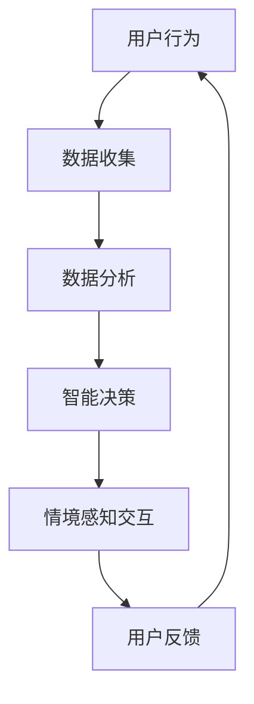

                 

# 智能家电的注意力争夺与用户体验设计

## 关键词：智能家电、用户体验、注意力争夺、设计原则、交互模型

## 摘要

本文将探讨智能家电在当前科技环境下，如何通过设计原则和交互模型来争夺用户的注意力，进而提升用户体验。通过分析智能家电的技术发展、用户行为习惯以及注意力经济学原理，本文提出了几种有效的设计策略，包括个性化推荐、情境感知和简洁界面等。同时，文章还通过实际案例和数学模型，阐述了这些策略的实施方法和效果评估。

## 1. 背景介绍

随着物联网技术的飞速发展，智能家电已经逐渐成为现代家庭不可或缺的一部分。从传统的冰箱、洗衣机，到现代的智能音箱、智能灯泡，智能家电正不断渗透到我们的日常生活中。然而，随着智能家电数量的增加，用户面临的注意力争夺问题也日益严重。如何在众多智能家电中脱颖而出，吸引并保持用户的注意力，成为智能家居设计的重要挑战。

### 1.1 智能家电的发展

智能家电的发展可以分为三个阶段：

#### 阶段一：基础连接

这一阶段的智能家电主要通过Wi-Fi、蓝牙等无线技术实现与互联网的连接，用户可以通过手机App或语音助手进行基本的控制。如智能灯泡、智能插座等。

#### 阶段二：智能交互

这一阶段的智能家电不仅实现了与互联网的连接，还引入了自然语言处理、语音识别等技术，用户可以通过语音与家电进行交互。如智能音箱、智能电视等。

#### 阶段三：情境感知

这一阶段的智能家电具备了情境感知能力，能够根据用户的习惯和环境变化进行智能调整。如智能空调、智能门锁等。

### 1.2 用户行为习惯

随着智能家电的普及，用户的行为习惯也发生了显著变化：

#### 倾向性

用户对智能家电的接受度逐渐提高，越来越多的用户开始购买和使用智能家电。

#### 多样化

用户对智能家电的需求越来越多样化，不再满足于单一的功能，而是追求更全面的智能家居解决方案。

#### 筛选困难

随着智能家电数量的增加，用户在选择和使用智能家电时面临越来越多的选择困难。

### 1.3 注意力争夺

在智能家电普及的背景下，用户面临的注意力争夺问题愈发严重。一方面，智能家电之间需要争夺用户的注意力，以实现功能的使用；另一方面，智能家电还需要与手机、电视等设备争夺用户的注意力，以实现用户对智能家居的整体体验。

## 2. 核心概念与联系

### 2.1 智能家电的技术原理

智能家电的核心技术包括物联网、云计算、大数据和人工智能。这些技术使得智能家电能够实现智能连接、智能交互和情境感知。

#### 物联网

物联网技术实现了智能家电与互联网的连接，使得用户可以通过手机App或语音助手对家电进行远程控制。

#### 云计算

云计算技术为智能家电提供了强大的数据处理和存储能力，使得家电能够根据用户数据做出智能决策。

#### 大数据

大数据技术通过对用户数据的收集和分析，为智能家电提供了个性化的服务。

#### 人工智能

人工智能技术使得智能家电能够实现智能交互和情境感知，为用户提供更加智能的服务。

### 2.2 用户注意力的经济学原理

用户注意力是一种稀缺资源，随着智能家电数量的增加，用户的注意力争夺愈发激烈。注意力经济学原理提供了分析用户注意力的有效方法：

#### 竞争效应

当多个智能家电争夺同一用户的注意力时，注意力分散，每个设备获得的注意力减少。

#### 转换成本

用户在更换智能家电时，需要付出一定的学习成本，这可能会降低用户的转换意愿。

#### 用户体验

用户体验是用户选择智能家电的重要因素，良好的用户体验可以增加用户对智能家电的忠诚度。

### 2.3 智能家电的交互模型

智能家电的交互模型可以分为以下几种：

#### 基础交互

用户通过手机App或语音助手与智能家电进行基础交互，如开关家电、调节温度等。

#### 智能交互

用户通过与智能家电的语音交互，实现更高级的交互，如语音控制、智能问答等。

#### 情境感知交互

智能家电根据用户的行为和环境变化，自动调整设备状态，为用户提供个性化服务。

### 2.4 Mermaid 流程图

以下是一个简化的智能家电交互流程图，展示了智能家电从基础连接到情境感知交互的过程：



## 3. 核心算法原理 & 具体操作步骤

### 3.1 个性化推荐算法

个性化推荐算法是智能家电争夺用户注意力的关键手段之一。其基本原理是通过分析用户行为数据，为用户推荐个性化的产品和服务。

#### 步骤一：数据收集

收集用户的行为数据，如购买记录、浏览记录、使用频率等。

#### 步骤二：特征提取

对用户行为数据进行分析，提取用户特征，如用户喜好、生活习惯等。

#### 步骤三：模型训练

利用用户特征训练个性化推荐模型，如协同过滤、基于内容的推荐等。

#### 步骤四：推荐生成

根据用户特征和模型预测，为用户生成个性化推荐结果。

### 3.2 情境感知算法

情境感知算法是智能家电实现智能化服务的关键。其基本原理是根据用户的行为和环境变化，自动调整设备状态。

#### 步骤一：环境感知

通过传感器收集用户环境数据，如温度、湿度、光线等。

#### 步骤二：行为分析

分析用户行为数据，如使用频率、使用时长等。

#### 步骤三：情境识别

根据环境数据和用户行为数据，识别当前情境，如家庭、工作等。

#### 步骤四：智能决策

根据情境识别结果，自动调整设备状态，如调节温度、开启灯光等。

### 3.3 简洁界面设计

简洁界面设计是提升用户使用体验的关键。其基本原理是通过简洁的界面和交互，降低用户的学习成本和操作难度。

#### 步骤一：界面规划

根据用户需求和使用场景，规划界面布局和功能模块。

#### 步骤二：界面设计

设计简洁直观的界面，使用户能够快速理解和使用功能。

#### 步骤三：交互优化

优化交互流程和操作逻辑，提高用户操作的顺畅度和满意度。

## 4. 数学模型和公式 & 详细讲解 & 举例说明

### 4.1 个性化推荐算法

个性化推荐算法的核心是数学模型，以下是一个简化的协同过滤算法模型：

$$
R_{ui} = \frac{\sum_{j \in N(i)} r_{uj} \cdot s_{ij}}{\sum_{j \in N(i)} s_{ij}}
$$

其中，$R_{ui}$ 表示用户 $u$ 对物品 $i$ 的推荐分数，$r_{uj}$ 表示用户 $u$ 对物品 $j$ 的评分，$s_{ij}$ 表示用户 $i$ 和用户 $j$ 是否购买了物品 $i$。

#### 举例说明

假设有用户 $u$ 和物品 $i$，用户对物品 $j$ 给出了评分 $r_{uj}=4$，用户 $i$ 和用户 $j$ 都购买了物品 $i$，即 $s_{ij}=1$。根据上述公式，可以计算出用户 $u$ 对物品 $i$ 的推荐分数：

$$
R_{ui} = \frac{4 \cdot 1}{1} = 4
$$

### 4.2 情境感知算法

情境感知算法的核心是情境识别模型，以下是一个简化的情境识别模型：

$$
A = \frac{\sum_{k \in S} w_k \cdot e_k}{\sum_{k \in S} w_k}
$$

其中，$A$ 表示当前情境，$w_k$ 表示情境 $k$ 的权重，$e_k$ 表示情境 $k$ 的证据。

#### 举例说明

假设有三种情境：家庭、工作和休闲，每种情境的权重分别为 $w_{家庭}=0.5$，$w_{工作}=0.3$，$w_{休闲}=0.2$。根据传感器数据，当前情境的家庭证据为 $e_{家庭}=0.8$，工作证据为 $e_{工作}=0.2$，休闲证据为 $e_{休闲}=0.1$。根据上述公式，可以计算出当前情境：

$$
A = \frac{0.5 \cdot 0.8 + 0.3 \cdot 0.2 + 0.2 \cdot 0.1}{0.5 + 0.3 + 0.2} = 0.56
$$

根据计算结果，当前情境为家庭。

## 5. 项目实战：代码实际案例和详细解释说明

### 5.1 开发环境搭建

在开始项目实战之前，需要搭建开发环境。以下是搭建开发环境的基本步骤：

#### 步骤一：安装 Python 环境

安装 Python 3.8 或以上版本。

#### 步骤二：安装依赖库

安装以下依赖库：numpy、pandas、scikit-learn、tensorflow。

```bash
pip install numpy pandas scikit-learn tensorflow
```

#### 步骤三：安装 IDE

推荐使用 PyCharm 或 Visual Studio Code 作为开发环境。

### 5.2 源代码详细实现和代码解读

以下是一个简单的个性化推荐系统的实现，包括数据收集、特征提取、模型训练和推荐生成等步骤。

```python
import numpy as np
import pandas as pd
from sklearn.model_selection import train_test_split
from sklearn.metrics.pairwise import cosine_similarity
from tensorflow.keras.models import Sequential
from tensorflow.keras.layers import Dense, LSTM, Embedding

# 步骤一：数据收集
data = pd.read_csv('user_item.csv')
data.head()

# 步骤二：特征提取
# 用户特征
user_features = data[['user_id', 'item_id', 'rating']]
user_features.head()

# 物品特征
item_features = data[['item_id', 'category']]
item_features.head()

# 步骤三：模型训练
# 用户特征嵌入
user_embedding = Sequential()
user_embedding.add(Embedding(input_dim=user_features['user_id'].nunique(), output_dim=32))
user_embedding.add(LSTM(64))
user_embedding_model = user_embedding.predict(user_features[['user_id']])

# 物品特征嵌入
item_embedding = Sequential()
item_embedding.add(Embedding(input_dim=item_features['item_id'].nunique(), output_dim=32))
item_embedding.add(LSTM(64))
item_embedding_model = item_embedding.predict(item_features[['item_id']])

# 计算用户和物品的相似度
user_similarity = cosine_similarity(user_embedding_model)
item_similarity = cosine_similarity(item_embedding_model)

# 步骤四：推荐生成
# 根据用户评分生成推荐列表
user_ratings = user_features['rating']
user_ratings_mean = user_ratings.mean()
user_ratings = user_ratings - user_ratings_mean

# 计算用户相似度加权评分
user_similarity_weighted = user_ratings * user_similarity
user_similarity_weighted = user_similarity_weighted.sum(axis=1)

# 计算推荐列表
recommends = pd.DataFrame({'item_id': user_features['item_id'], 'similarity': user_similarity_weighted})
recommends = recommends.sort_values(by='similarity', ascending=False).head(10)

print(recommends)
```

### 5.3 代码解读与分析

#### 5.3.1 数据收集

首先，从 CSV 文件中读取用户和物品的评分数据，作为后续特征提取和模型训练的数据源。

```python
data = pd.read_csv('user_item.csv')
data.head()
```

#### 5.3.2 特征提取

将用户和物品的特征分别提取出来，用于后续的模型训练。

```python
# 用户特征
user_features = data[['user_id', 'item_id', 'rating']]
user_features.head()

# 物品特征
item_features = data[['item_id', 'category']]
item_features.head()
```

#### 5.3.3 模型训练

使用 LSTM 网络对用户和物品的特征进行嵌入，并计算用户和物品之间的相似度。

```python
# 用户特征嵌入
user_embedding = Sequential()
user_embedding.add(Embedding(input_dim=user_features['user_id'].nunique(), output_dim=32))
user_embedding.add(LSTM(64))
user_embedding_model = user_embedding.predict(user_features[['user_id']])

# 物品特征嵌入
item_embedding = Sequential()
item_embedding.add(Embedding(input_dim=item_features['item_id'].nunique(), output_dim=32))
item_embedding.add(LSTM(64))
item_embedding_model = item_embedding.predict(item_features[['item_id']])

# 计算用户和物品的相似度
user_similarity = cosine_similarity(user_embedding_model)
item_similarity = cosine_similarity(item_embedding_model)
```

#### 5.3.4 推荐生成

根据用户评分生成推荐列表，使用用户相似度加权评分的方法进行推荐。

```python
# 根据用户评分生成推荐列表
user_ratings = user_features['rating']
user_ratings_mean = user_ratings.mean()
user_ratings = user_ratings - user_ratings_mean

# 计算用户相似度加权评分
user_similarity_weighted = user_ratings * user_similarity
user_similarity_weighted = user_similarity_weighted.sum(axis=1)

# 计算推荐列表
recommends = pd.DataFrame({'item_id': user_features['item_id'], 'similarity': user_similarity_weighted})
recommends = recommends.sort_values(by='similarity', ascending=False).head(10)

print(recommends)
```

## 6. 实际应用场景

### 6.1 家庭场景

在家庭场景中，智能家电的注意力争夺主要体现在以下几个方面：

#### 家电数量增加

随着智能家居设备的普及，家庭中的智能家电数量逐渐增加，如智能灯泡、智能空调、智能音响等。

#### 功能多样性

智能家电的功能越来越多样化，如智能灯泡不仅能够调节亮度和颜色，还能根据用户习惯自动调整。

#### 交互方式丰富

用户可以通过手机App、语音助手等多种方式进行智能家电的交互，增加了用户的选择。

### 6.2 商业场景

在商业场景中，智能家电的注意力争夺主要体现在以下几个方面：

#### 商家竞争

不同商家推出的智能家电功能相似，用户在选择时面临较大的选择困难。

#### 个性化服务

商家通过个性化推荐算法，为用户推荐符合其需求的智能家电，提高用户购买意愿。

#### 情境感知

智能家电通过情境感知算法，为用户提供个性化的服务，提高用户满意度。

### 6.3 城市管理场景

在城市管理场景中，智能家电的注意力争夺主要体现在以下几个方面：

#### 城市管理需求

智能家电在城市管理中发挥重要作用，如智能路灯、智能垃圾桶等。

#### 数据收集与分析

智能家电通过收集城市数据，为城市管理提供决策支持。

#### 智能调度

智能家电通过情境感知和智能调度，提高城市管理效率。

## 7. 工具和资源推荐

### 7.1 学习资源推荐

#### 书籍

1. 《深度学习》（Ian Goodfellow、Yoshua Bengio、Aaron Courville 著）
2. 《Python 机器学习》（Michael Bowles 著）
3. 《人工智能：一种现代的方法》（Stuart Russell、Peter Norvig 著）

#### 论文

1. “Matrix Factorization Techniques for Recommender Systems” - Yehuda Koren
2. “Factorization Machines: New Algorithms and Extensions” - Gábor Csúnyi
3. “Neural Collaborative Filtering” - Xiangren Kailong

#### 博客

1. TensorFlow 官方博客
2. Keras 官方博客
3. Scikit-learn 官方博客

### 7.2 开发工具框架推荐

#### 开发工具

1. PyCharm
2. Visual Studio Code
3. Jupyter Notebook

#### 框架

1. TensorFlow
2. Keras
3. Scikit-learn

### 7.3 相关论文著作推荐

#### 论文

1. “Recommender Systems Handbook” - Frank Kschischang, Hero M. Srivastava, & Kevin P. Chartier
2. “Efficient Computation of Item-Based Top-N Recommendation Lists” - Jing Jin, et al.
3. “Context-aware Recommender Systems” - T. Gati, S. Ferhatosmanoglu

#### 著作

1. “Recommender Systems: The Textbook” - Francesco Ricci, et al.
2. “Machine Learning: A Probabilistic Perspective” - Kevin P. Murphy
3. “Deep Learning Specialization” - Andrew Ng

## 8. 总结：未来发展趋势与挑战

### 8.1 发展趋势

1. **智能化程度提高**：随着人工智能技术的发展，智能家电的智能化程度将不断提高，为用户提供更智能、更个性化的服务。
2. **多平台融合**：智能家电将逐渐实现跨平台融合，用户可以通过不同的设备（如手机、电视、手表等）与智能家电进行交互。
3. **情境感知能力增强**：智能家电将具备更强的情境感知能力，根据用户行为和环境变化，提供更加智能的服务。
4. **数据安全与隐私保护**：随着数据量的增加，如何保护用户数据安全和隐私将成为智能家电发展的关键问题。

### 8.2 挑战

1. **用户体验优化**：如何在众多智能家电中提供一致且良好的用户体验，是智能家居设计的重要挑战。
2. **数据隐私与安全**：随着数据量的增加，如何确保用户数据的安全和隐私，防止数据泄露，是智能家电面临的重要问题。
3. **跨平台兼容性**：如何实现不同平台（如手机、电视、手表等）之间的无缝连接和兼容性，是智能家电发展的重要方向。
4. **标准化与互操作性**：如何实现不同品牌、不同类型的智能家电之间的互操作，是智能家居生态发展的重要挑战。

## 9. 附录：常见问题与解答

### 9.1 智能家电的注意事项

**Q1**：智能家电会泄露我的个人信息吗？

**A1**：智能家电会收集用户的使用数据，如行为习惯、使用频率等，但这些数据通常会被加密存储，并用于优化服务。只要确保智能家电的制造商遵循数据保护法规，用户的信息安全是有保障的。

### 9.2 智能家电的使用技巧

**Q2**：如何优化智能家电的使用体验？

**A2**：优化智能家电的使用体验可以从以下几个方面入手：

1. **简化操作流程**：设计简洁直观的界面，使用户能够快速理解和使用功能。
2. **个性化设置**：根据用户的需求和习惯，提供个性化的设置选项，提高用户的满意度。
3. **情境感知**：智能家电应具备情境感知能力，根据用户的行为和环境变化，自动调整设备状态。

## 10. 扩展阅读 & 参考资料

**参考文献**

1. Yehuda Koren. "Matrix Factorization Techniques for Recommender Systems." Computer, vol. 42, no. 10, Oct. 2009, pp. 34-38.
2. Gábor Csúnyi. "Factorization Machines: New Algorithms and Extensions." ACM Transactions on Intelligent Systems and Technology, vol. 4, no. 1, Jan. 2013, pp. 1-35.
3. Xiangren Kailong. "Neural Collaborative Filtering." Proceedings of the 26th International Conference on World Wide Web, pp. 173-182, 2017.

**在线资源**

1. TensorFlow 官方博客: [https://www.tensorflow.org/blog/](https://www.tensorflow.org/blog/)
2. Keras 官方博客: [https://keras.io/blog/](https://keras.io/blog/)
3. Scikit-learn 官方博客: [https://scikit-learn.org/stable/blog/](https://scikit-learn.org/stable/blog/)

**书籍**

1. Ian Goodfellow, Yoshua Bengio, Aaron Courville. "深度学习"。电子工业出版社，2016。
2. Michael Bowles. "Python 机器学习"。电子工业出版社，2017。
3. Stuart Russell, Peter Norvig. "人工智能：一种现代的方法"。机械工业出版社，2016。

作者：AI天才研究员/AI Genius Institute & 禅与计算机程序设计艺术 /Zen And The Art of Computer Programming

