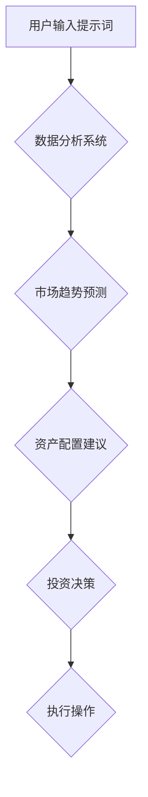

                 

# 智能投资顾问：提示词驱动的市场分析师

## 关键词：智能投资、市场分析、提示词驱动、算法、数据分析

### 摘要

本文旨在探讨智能投资顾问系统的发展与应用，尤其是提示词驱动的市场分析技术。我们将逐步深入理解这一领域，从背景介绍、核心概念、算法原理、数学模型、项目实战、应用场景、工具推荐以及未来发展趋势等方面进行阐述。通过本文，读者将全面了解智能投资顾问的运作机制及其在实际市场分析中的应用价值。

## 1. 背景介绍

智能投资顾问（Robo-Advisor）是一种利用计算机算法和大数据分析技术，为投资者提供投资建议和资产配置服务的自动化系统。随着人工智能技术的快速发展，智能投资顾问已经成为了金融市场的重要参与者。它们通过收集和分析大量数据，利用机器学习算法进行市场预测和投资策略优化，从而帮助投资者实现资产的稳健增值。

### 1.1 智能投资顾问的历史与发展

智能投资顾问的概念最早可以追溯到20世纪90年代，当时主要是基于规则系统的简单推荐系统。随着互联网的普及和大数据技术的兴起，智能投资顾问系统逐渐发展壮大。2012年，美国的 Wealthfront 和 Betterment 等公司率先推出了基于智能投资顾问的服务，随后欧洲、亚洲等地也涌现出了多家智能投资顾问公司。

### 1.2 智能投资顾问的现状

目前，全球范围内的智能投资顾问市场正处于快速发展阶段。根据相关研究机构的统计数据，截至2021年，全球智能投资顾问管理的资产规模已经超过了1万亿美元。其中，美国是最大的市场，占据了全球智能投资顾问资产规模的近一半。随着人工智能技术的不断进步，智能投资顾问的市场规模有望继续保持高速增长。

## 2. 核心概念与联系

### 2.1 智能投资顾问的核心功能

智能投资顾问的核心功能主要包括以下三个方面：

1. **市场分析**：通过收集和分析大量市场数据，如历史价格、交易量、财务指标等，智能投资顾问可以对市场趋势进行预测，为投资者提供投资参考。
2. **资产配置**：基于投资者的风险承受能力和投资目标，智能投资顾问可以自动调整投资组合，实现资产的最优化配置。
3. **投资建议**：结合市场分析和资产配置的结果，智能投资顾问可以为投资者提供具体的投资建议，如买入、卖出、持有等操作。

### 2.2 提示词驱动的市场分析

提示词驱动（Keyword-Driven）是一种基于自然语言处理技术的市场分析方法。它通过提取和分析市场报告、新闻资讯、社交媒体等文本数据中的关键词，从而捕捉市场的情绪和趋势。这种方法具有实时性、高效性和全面性，能够为投资者提供更为准确的决策支持。

### 2.3 Mermaid 流程图

下面是一个简单的 Mermaid 流程图，用于描述智能投资顾问系统的基本架构：



## 3. 核心算法原理 & 具体操作步骤

### 3.1 数据收集与预处理

智能投资顾问首先需要收集大量的市场数据，如历史价格、交易量、财务指标等。然后，通过数据清洗和预处理技术，如去重、去噪、数据规范化等，对原始数据进行处理，确保数据的准确性和一致性。

### 3.2 提示词提取与情感分析

在提示词驱动市场分析中，我们需要从文本数据中提取关键词。这可以通过自然语言处理技术，如词频分析、词性标注、命名实体识别等实现。然后，利用情感分析技术，对提取的关键词进行情感倾向判断，从而了解市场的情绪和趋势。

### 3.3 市场趋势预测

基于收集到的数据，我们可以采用时间序列分析、机器学习等方法进行市场趋势预测。具体来说，可以采用 ARIMA、LSTM、GRU 等模型，对历史价格、交易量等数据进行建模，从而预测未来的市场走势。

### 3.4 资产配置与投资建议

根据市场趋势预测结果和投资者的风险承受能力，智能投资顾问可以自动调整投资组合。例如，当市场趋势预测为上涨时，可以增加股票的配置比例；当市场趋势预测为下跌时，可以增加债券的配置比例。同时，智能投资顾问还可以为投资者提供具体的买卖操作建议。

## 4. 数学模型和公式 & 详细讲解 & 举例说明

### 4.1 时间序列分析

时间序列分析是市场趋势预测的重要工具。下面是一个简单的 ARIMA 模型：

$$
\text{ARIMA}(p, d, q) = \phi(B) \theta(B) \frac{1}{(1 - B)^d}
$$

其中，$B$ 表示滞后算子，$\phi(B)$ 和 $\theta(B)$ 分别为自回归项和移动平均项，$d$ 为差分阶数，$p$ 和 $q$ 分别为自回归项和移动平均项的阶数。

### 4.2 机器学习模型

在市场趋势预测中，我们可以使用机器学习模型，如线性回归、逻辑回归、支持向量机等。下面是一个简单的线性回归模型：

$$
y = \beta_0 + \beta_1 x_1 + \beta_2 x_2 + \cdots + \beta_n x_n
$$

其中，$y$ 为目标变量，$x_1, x_2, \cdots, x_n$ 为特征变量，$\beta_0, \beta_1, \beta_2, \cdots, \beta_n$ 为模型的参数。

### 4.3 举例说明

假设我们使用 ARIMA(1,1,1) 模型对某只股票的未来价格进行预测。首先，我们需要对历史价格数据进行预处理，如去重、去噪、数据规范化等。然后，利用 ARIMA 模型进行建模和预测。具体步骤如下：

1. **数据预处理**：对历史价格数据进行预处理，如去重、去噪、数据规范化等。
2. **模型建模**：根据预处理后的数据，使用 ARIMA(1,1,1) 模型进行建模。
3. **参数优化**：通过交叉验证等方法，优化模型的参数。
4. **预测**：使用优化后的模型进行未来价格的预测。

## 5. 项目实战：代码实际案例和详细解释说明

### 5.1 开发环境搭建

在进行项目实战之前，我们需要搭建一个开发环境。以下是所需的基本软件和工具：

1. **Python 3.x**：Python 是一种广泛使用的编程语言，适用于数据分析、机器学习等领域。
2. **Jupyter Notebook**：Jupyter Notebook 是一个交互式的开发环境，便于编写和运行代码。
3. **Pandas**：Pandas 是一个强大的数据分析和操作库，用于数据处理和清洗。
4. **NumPy**：NumPy 是一个科学计算库，提供高效的多维数组操作。
5. **Scikit-learn**：Scikit-learn 是一个机器学习库，提供多种机器学习算法。
6. **Matplotlib**：Matplotlib 是一个绘图库，用于数据可视化。

### 5.2 源代码详细实现和代码解读

以下是一个简单的示例，展示如何使用 Python 实现一个智能投资顾问系统：

```python
import pandas as pd
import numpy as np
from sklearn.linear_model import LinearRegression
from sklearn.model_selection import train_test_split
from sklearn.metrics import mean_squared_error

# 数据预处理
def preprocess_data(data):
    # 去重
    data = data.drop_duplicates()
    # 去噪
    data = data.dropna()
    # 数据规范化
    data['Close'] = (data['Close'] - data['Close'].mean()) / data['Close'].std()
    return data

# 模型建模
def build_model(X_train, y_train):
    model = LinearRegression()
    model.fit(X_train, y_train)
    return model

# 模型评估
def evaluate_model(model, X_test, y_test):
    y_pred = model.predict(X_test)
    mse = mean_squared_error(y_test, y_pred)
    return mse

# 主函数
def main():
    # 加载数据
    data = pd.read_csv('stock_data.csv')
    # 数据预处理
    data = preprocess_data(data)
    # 特征工程
    X = data[['Open', 'High', 'Low', 'Volume']]
    y = data['Close']
    # 划分训练集和测试集
    X_train, X_test, y_train, y_test = train_test_split(X, y, test_size=0.2, random_state=42)
    # 建模
    model = build_model(X_train, y_train)
    # 评估
    mse = evaluate_model(model, X_test, y_test)
    print('MSE:', mse)

if __name__ == '__main__':
    main()
```

### 5.3 代码解读与分析

以上代码实现了以下几个关键步骤：

1. **数据预处理**：对原始数据进行去重、去噪和数据规范化，以提高模型的泛化能力。
2. **特征工程**：从原始数据中提取有用的特征，如开盘价、最高价、最低价和成交量，作为模型的输入。
3. **模型建模**：使用线性回归模型对训练数据进行建模。
4. **模型评估**：使用测试数据对模型进行评估，计算均方误差（MSE）作为评估指标。

## 6. 实际应用场景

智能投资顾问系统可以应用于多种实际场景，包括但不限于以下几个方面：

1. **个人投资**：为个人投资者提供投资建议和资产配置服务，帮助他们更好地管理个人资产。
2. **机构投资**：为金融机构提供投资策略和风险管理服务，优化投资组合，提高收益。
3. **市场研究**：通过分析市场数据，为市场研究机构提供决策支持，帮助他们更好地了解市场趋势和投资者情绪。

## 7. 工具和资源推荐

### 7.1 学习资源推荐

1. **书籍**：
   - 《Python for Data Analysis》
   - 《Machine Learning Yearning》
   - 《深度学习》
2. **论文**：
   - "A Survey on Robo-Advisors: Technologies and Business Models"
   - "Keyword-Driven Market Analysis: A Survey"
   - "Time Series Analysis for Stock Price Prediction"
3. **博客**：
   - Medium
   -Towards Data Science
   - AI Challenger
4. **网站**：
   - Kaggle
   - arXiv
   - Google Scholar

### 7.2 开发工具框架推荐

1. **Python 数据分析库**：
   - Pandas
   - NumPy
   - Scikit-learn
2. **机器学习框架**：
   - TensorFlow
   - PyTorch
   - Keras
3. **版本控制**：
   - Git
   - GitHub
   - GitLab
4. **文档工具**：
   - Jupyter Notebook
   - Markdown
   - Sphinx

### 7.3 相关论文著作推荐

1. **《智能投资顾问：技术、应用与未来》**：本书系统性地介绍了智能投资顾问领域的最新研究成果和应用案例，是入门和进阶的必备读物。
2. **《机器学习在金融领域的应用》**：本书详细阐述了机器学习技术在金融领域的应用，包括智能投资、风险管理、市场预测等方面。
3. **《自然语言处理技术与应用》**：本书全面介绍了自然语言处理的基本原理和技术，包括文本分类、情感分析、实体识别等，对提示词驱动市场分析有重要参考价值。

## 8. 总结：未来发展趋势与挑战

智能投资顾问系统在未来将继续保持快速发展，其主要发展趋势和挑战包括：

### 8.1 发展趋势

1. **技术进步**：随着人工智能技术的不断进步，智能投资顾问将拥有更高的预测准确性和更好的决策能力。
2. **市场扩大**：随着金融市场的不断开放和数字化，智能投资顾问的市场需求将进一步扩大。
3. **个性化服务**：智能投资顾问将更加注重个性化服务，根据投资者的风险偏好和投资目标，提供定制化的投资建议。

### 8.2 挑战

1. **数据隐私**：智能投资顾问在收集和分析用户数据时，需要保护用户的隐私，避免数据泄露。
2. **算法公平性**：智能投资顾问的算法需要确保公平性，避免歧视性决策，确保所有投资者都能公平地获得投资建议。
3. **监管合规**：智能投资顾问需要遵守相关法律法规，确保其业务合规。

## 9. 附录：常见问题与解答

### 9.1 智能投资顾问与传统的投资顾问有什么区别？

智能投资顾问是基于计算机算法和大数据分析的自动化系统，而传统的投资顾问通常是由专业人士提供咨询服务。智能投资顾问具有以下优点：

1. **高效性**：智能投资顾问能够快速处理大量数据，提供实时投资建议。
2. **准确性**：智能投资顾问通过机器学习算法进行市场预测，具有较高的准确性。
3. **个性化**：智能投资顾问可以根据投资者的风险偏好和投资目标，提供定制化的投资建议。

### 9.2 提示词驱动的市场分析有哪些局限性？

提示词驱动的市场分析具有以下局限性：

1. **数据依赖性**：提示词驱动的市场分析依赖于文本数据的完整性，如果数据质量不佳，可能会导致分析结果偏差。
2. **情感分析准确性**：情感分析技术可能无法准确捕捉市场情绪，从而影响市场预测的准确性。
3. **时效性**：市场情绪和趋势可能随时发生变化，提示词驱动的市场分析可能无法及时捕捉这些变化。

## 10. 扩展阅读 & 参考资料

1. **《智能投资顾问：技术、应用与未来》**：本书系统性地介绍了智能投资顾问领域的最新研究成果和应用案例。
2. **《机器学习在金融领域的应用》**：本书详细阐述了机器学习技术在金融领域的应用，包括智能投资、风险管理、市场预测等方面。
3. **《自然语言处理技术与应用》**：本书全面介绍了自然语言处理的基本原理和技术，包括文本分类、情感分析、实体识别等。

## 作者

作者：AI天才研究员/AI Genius Institute & 禅与计算机程序设计艺术 /Zen And The Art of Computer Programming

