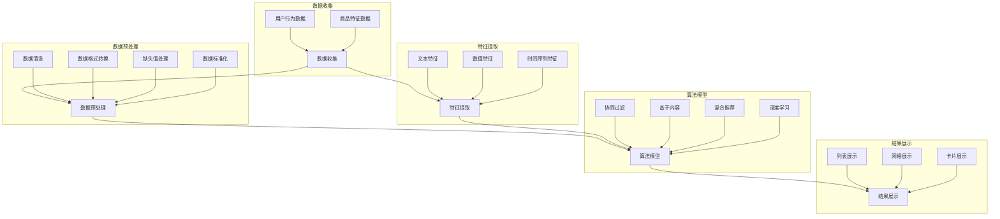

                 

### 摘要

本文将深入探讨智能排序技术对电商搜索结果的重要性，以及其提升电商用户体验的显著效果。随着互联网电商行业的迅速发展，用户对搜索结果的质量和排序的准确性要求越来越高。传统的排序算法已经难以满足日益复杂的搜索需求，因此，智能排序技术应运而生。本文将首先介绍智能排序技术的背景和核心概念，然后详细解析几种核心算法原理和具体操作步骤，并运用数学模型和公式进行解释说明。通过实际项目实战案例，我们将展示智能排序技术在电商搜索中的应用，并分析其实现细节。接着，本文将探讨智能排序技术在电商领域的实际应用场景，推荐相关学习资源和开发工具框架，以帮助读者深入了解和掌握智能排序技术。最后，本文将对智能排序技术的未来发展趋势与挑战进行总结，并提供常见问题与解答。通过本文的阅读，读者将对智能排序技术有更全面和深入的理解，为其在电商领域的应用提供有力支持。

### 1. 背景介绍

随着电子商务的蓬勃发展，用户在电商平台的购物体验越来越重要。在众多用户体验因素中，搜索结果的质量和排序的准确性直接影响到用户的购买决策。传统的排序算法，如基于关键词匹配的排序、基于发布时间的排序等，虽然在某种程度上能够满足基本需求，但随着电商平台的不断发展和用户需求的多样化，这些传统算法逐渐暴露出诸多不足。

首先，传统排序算法往往过于简单，难以处理复杂多变的用户需求。例如，在同一个商品列表中，用户可能希望根据价格、销量、评价等多个维度的综合评分进行排序。而传统的排序算法往往只能处理单一维度的排序，缺乏灵活性。

其次，传统排序算法在处理海量数据时效率较低，难以满足电商平台的实时性需求。随着电商平台的商品数量和用户数量呈指数级增长，如何快速、准确地处理海量数据并返回排序结果，成为传统排序算法的一大挑战。

此外，传统排序算法在处理个性化推荐时效果不佳。用户在电商平台上浏览和购买的行为具有高度个性化，传统排序算法很难准确捕捉到每个用户的个性化需求，从而提供个性化的搜索结果。

为了解决上述问题，智能排序技术应运而生。智能排序技术利用大数据、机器学习和深度学习等技术，对用户行为数据、商品特征数据等海量信息进行深入分析，从而生成更精准、个性化的搜索结果。智能排序技术的出现，不仅提升了搜索结果的质量和准确性，也为电商平台提供了更强大的用户体验优化工具。

#### 1.1 智能排序技术的定义和作用

智能排序技术，顾名思义，是一种利用人工智能技术实现的排序方法。它通过分析用户行为、商品特征、市场趋势等多维度数据，采用复杂的算法模型，对搜索结果进行智能化的排序。智能排序技术不仅能够满足用户对多样化、个性化的排序需求，还能够提高电商平台的运营效率，提升用户体验。

首先，智能排序技术能够显著提升搜索结果的准确性。通过深度学习和机器学习算法，智能排序技术可以准确捕捉用户的浏览、购买等行为特征，从而生成与用户需求高度匹配的搜索结果。例如，如果一个用户在浏览商品时频繁查看某类商品，智能排序技术会优先推荐该类商品，从而提高用户的购买转化率。

其次，智能排序技术可以显著提升搜索结果的个性化程度。不同的用户在电商平台上具有不同的购物偏好和需求，智能排序技术通过分析用户的兴趣和行为，为每个用户提供个性化的搜索结果。这种个性化的搜索体验不仅能够满足用户的多样化需求，还能够增强用户对电商平台的黏性。

此外，智能排序技术还能够提高电商平台的运营效率。传统的排序方法往往需要大量人工干预，而智能排序技术通过自动化算法模型，可以大幅度减少人工干预，提高数据处理和排序的效率。这对于大型电商平台尤为重要，因为它们需要处理海量数据和用户请求，智能排序技术能够帮助电商平台实现更高效的运营。

总的来说，智能排序技术在提升电商搜索结果质量、满足用户个性化需求和提高运营效率方面具有显著优势。随着人工智能技术的不断发展，智能排序技术将在电商领域发挥越来越重要的作用。

#### 1.2 智能排序技术的核心组成部分

智能排序技术由多个核心组成部分构成，其中主要包括数据收集、数据分析、算法模型和结果展示。这些组成部分相互作用，共同实现智能排序的精准性和高效性。

**数据收集**是智能排序技术的基础。数据来源可以是用户的浏览记录、购买历史、评价、推荐等。这些数据不仅包括用户的行为数据，还包括商品的特征数据，如价格、销量、评价数、商品分类等。通过收集这些多维度的数据，可以全面了解用户的需求和行为模式，为后续的分析和排序提供丰富的信息基础。

**数据分析**是对收集到的数据进行处理和分析的过程。这一步骤通常包括数据清洗、数据预处理、特征提取等。数据清洗的目的是去除数据中的噪声和不准确信息，保证数据的可靠性和有效性。数据预处理则包括数据格式转换、缺失值处理、数据标准化等，以提高数据的可用性。特征提取是将原始数据转化为算法模型可以理解和处理的特征向量，如文本特征、数值特征、时间序列特征等。这些特征向量是智能排序算法的关键输入。

**算法模型**是智能排序技术的核心。常见的算法模型包括基于协同过滤的推荐算法、基于内容的推荐算法、混合推荐算法等。协同过滤算法通过分析用户的相似行为进行推荐，基于内容的推荐算法通过分析商品的特征进行推荐，混合推荐算法则结合了协同过滤和基于内容的方法，以实现更精准的推荐。此外，深度学习算法，如卷积神经网络（CNN）、循环神经网络（RNN）等，也被广泛应用于智能排序技术中，以进一步提升推荐效果。

**结果展示**是将排序结果以直观、易理解的方式呈现给用户。结果展示的方式可以包括列表、网格、卡片等，同时还可以结合用户交互，如排序、筛选、分页等，以提供更便捷的购物体验。智能排序技术不仅关注排序结果的准确性，还注重用户体验的优化，通过精细化的结果展示，提高用户对搜索结果的满意度。

**智能排序技术的应用场景**非常广泛。在电商平台上，智能排序技术可以应用于商品搜索、商品推荐、广告投放等多个场景。例如，在商品搜索中，智能排序技术可以根据用户的浏览历史和购买行为，优先推荐相关度高、受欢迎的商品，从而提高用户的购买转化率。在广告投放中，智能排序技术可以根据用户的兴趣和行为，精准投放广告，提高广告的点击率和转化率。

总的来说，智能排序技术通过数据收集、数据分析、算法模型和结果展示等核心组成部分，实现了对海量数据的智能分析和处理，为电商平台提供了强大的用户体验优化工具。随着人工智能技术的不断进步，智能排序技术将在电商领域发挥越来越重要的作用，为用户提供更加个性化、精准的搜索和推荐服务。

### 2. 核心概念与联系

智能排序技术的核心在于其数据分析和处理能力，其中涉及多个关键概念和原理。为了深入理解这些核心概念，我们将通过一个Mermaid流程图来展示它们之间的联系。

首先，智能排序技术的核心概念可以分为数据收集、数据预处理、特征提取、算法模型和结果展示。下面是具体的Mermaid流程图：



#### 数据收集

数据收集是智能排序技术的第一步，也是整个流程的基础。数据来源主要包括用户行为数据（如浏览记录、购买历史、评价等）和商品特征数据（如价格、销量、评价数、商品分类等）。这些数据通过电商平台的后台系统收集并存储在数据库中，为后续的数据分析和处理提供丰富的信息资源。

#### 数据预处理

数据预处理是对收集到的原始数据进行处理，使其适合进行进一步分析和建模。主要包括以下步骤：

1. **数据清洗**：去除数据中的噪声和不准确信息，如删除重复记录、纠正数据错误等，以保证数据的可靠性和一致性。
2. **数据格式转换**：将不同格式的数据转换为统一的格式，以便进行后续处理。
3. **缺失值处理**：对于缺失的数据，采用适当的策略进行填补或删除，以提高数据的质量和可用性。
4. **数据标准化**：将不同量纲的数据进行标准化处理，使其在同一尺度上进行分析，避免量纲不一致导致的偏差。

#### 特征提取

特征提取是将原始数据转化为算法模型可以理解和处理的特征向量，主要包括以下几类：

1. **文本特征**：从文本数据中提取关键词、主题、情感等特征，如TF-IDF、Word2Vec等。
2. **数值特征**：从数值数据中提取统计量、分布特征等，如均值、方差、标准差等。
3. **时间序列特征**：从时间序列数据中提取趋势、周期性等特征，如时间窗口滑动平均、季节性分解等。

特征提取的目的是将原始数据转化为算法模型可以理解和处理的形式，为算法模型的训练提供有效的输入。

#### 算法模型

算法模型是智能排序技术的核心，常见的算法模型包括以下几种：

1. **协同过滤**：通过分析用户的行为数据，找出相似用户或相似商品，进行推荐。主要包括基于用户的协同过滤和基于项目的协同过滤。
2. **基于内容的推荐**：通过分析商品的属性和内容，找出与目标商品相似的商品进行推荐。这种方法适用于信息检索和内容推荐系统。
3. **混合推荐**：结合协同过滤和基于内容的推荐方法，以实现更精准的推荐效果。
4. **深度学习**：利用深度神经网络，如卷积神经网络（CNN）、循环神经网络（RNN）等，对大规模数据进行分析和建模，以实现高度复杂的特征提取和推荐。

#### 结果展示

结果展示是将排序结果以直观、易理解的方式呈现给用户。常见的展示方式包括列表展示、网格展示、卡片展示等，同时还可以结合用户交互，如排序、筛选、分页等，以提供更便捷的购物体验。结果展示的目的是将智能排序算法生成的排序结果以用户友好的形式呈现，提高用户的购物体验和满意度。

通过上述Mermaid流程图，我们可以清晰地看到智能排序技术的各个核心概念和步骤之间的联系。从数据收集、数据预处理、特征提取、算法模型到结果展示，每一个环节都至关重要，共同构成了智能排序技术的完整流程。理解这些核心概念和联系，有助于我们深入掌握智能排序技术的原理和应用。

### 3. 核心算法原理 & 具体操作步骤

智能排序技术之所以能够在电商搜索结果中取得显著效果，主要得益于其背后的核心算法原理和具体操作步骤。以下是几种常用的智能排序算法及其原理和具体操作步骤。

#### 3.1 协同过滤算法

**协同过滤算法**（Collaborative Filtering）是智能排序技术中最常用的算法之一。协同过滤算法通过分析用户的行为数据，找出相似用户或相似商品，从而进行推荐。协同过滤算法可以分为基于用户的协同过滤和基于物品的协同过滤。

1. **基于用户的协同过滤**：
   - **原理**：基于用户的协同过滤算法通过分析用户之间的相似性来进行推荐。具体来说，它首先找到与目标用户行为相似的邻居用户，然后根据邻居用户的评价推荐商品。
   - **操作步骤**：
     1. **计算用户相似性**：使用余弦相似度、皮尔逊相关系数等方法计算用户之间的相似性。
     2. **找到邻居用户**：根据用户相似性矩阵，找到与目标用户最相似的K个邻居用户。
     3. **预测评分**：根据邻居用户对商品的评分，计算目标用户对商品的预测评分。
     4. **生成推荐列表**：将预测评分最高的商品推荐给目标用户。

2. **基于物品的协同过滤**：
   - **原理**：基于物品的协同过滤算法通过分析商品之间的相似性来进行推荐。具体来说，它首先找到与目标商品最相似的邻居商品，然后根据邻居商品的用户评分推荐其他商品。
   - **操作步骤**：
     1. **计算商品相似性**：使用余弦相似度、欧氏距离等方法计算商品之间的相似性。
     2. **找到邻居商品**：根据商品相似性矩阵，找到与目标商品最相似的K个邻居商品。
     3. **预测评分**：根据邻居商品的用户评分，计算目标商品的用户预测评分。
     4. **生成推荐列表**：将预测评分最高的商品推荐给用户。

**协同过滤算法的优点**是简单、易于实现，且在处理稀疏数据时效果较好。但其缺点是对新用户和新商品的效果较差，难以处理冷启动问题。

#### 3.2 基于内容的推荐算法

**基于内容的推荐算法**（Content-based Filtering）通过分析商品的属性和内容，找出与目标商品相似的商品进行推荐。基于内容的推荐算法适用于信息检索和内容推荐系统。

1. **原理**：
   - 基于内容的推荐算法首先对商品进行特征提取，然后计算商品之间的相似度，最后根据相似度推荐商品。

2. **操作步骤**：
   1. **特征提取**：从商品描述、标签、属性等信息中提取特征，如文本特征（TF-IDF、Word2Vec）、数值特征（均值、方差）等。
   2. **计算相似度**：使用余弦相似度、欧氏距离等方法计算商品之间的相似度。
   3. **生成推荐列表**：将相似度最高的商品推荐给用户。

**基于内容的推荐算法的优点**是能够为用户推荐与目标商品高度相关的商品，但缺点是特征提取和计算复杂度较高，且对新用户和新商品的效果较差。

#### 3.3 混合推荐算法

**混合推荐算法**（Hybrid Recommendation）结合了协同过滤和基于内容的推荐方法，以实现更精准的推荐效果。混合推荐算法通过融合多种信息来源和算法，提高推荐系统的准确性和鲁棒性。

1. **原理**：
   - 混合推荐算法首先分别使用协同过滤和基于内容的推荐方法生成推荐列表，然后通过合并和排序策略生成最终的推荐列表。

2. **操作步骤**：
   1. **协同过滤推荐**：使用基于用户的协同过滤算法生成用户-商品评分矩阵，并计算用户对商品的预测评分。
   2. **基于内容推荐**：使用基于内容的推荐算法生成商品之间的相似度矩阵，并计算商品对用户的推荐概率。
   3. **合并推荐列表**：通过加权融合或排序策略，将协同过滤和基于内容的推荐结果合并为最终的推荐列表。

**混合推荐算法的优点**是能够综合协同过滤和基于内容的方法的优势，提高推荐系统的准确性和多样性。但缺点是计算复杂度较高，需要更多的计算资源和时间。

#### 3.4 深度学习算法

**深度学习算法**（Deep Learning）在智能排序技术中发挥着越来越重要的作用。深度学习算法通过构建复杂的神经网络模型，对海量数据进行自动特征提取和建模，实现高度复杂的特征学习和推荐。

1. **原理**：
   - 深度学习算法基于多层神经网络，通过逐层抽象和特征提取，实现对数据的深层理解和建模。常见的深度学习算法包括卷积神经网络（CNN）、循环神经网络（RNN）、图神经网络（GNN）等。

2. **操作步骤**：
   1. **数据预处理**：对用户行为数据和商品特征数据进行预处理，如归一化、缺失值处理等。
   2. **特征提取**：使用深度学习算法自动提取数据中的高阶特征，如使用CNN提取图像特征、使用RNN处理时间序列数据等。
   3. **构建模型**：设计并训练深度学习模型，如使用CNN处理图像数据、使用RNN处理时间序列数据等。
   4. **模型优化**：通过优化算法和超参数调整，提高模型性能和预测准确性。
   5. **生成推荐列表**：使用训练好的模型对用户进行预测评分，生成推荐列表。

**深度学习算法的优点**是能够自动提取复杂的特征，提高推荐系统的准确性和鲁棒性。但缺点是计算复杂度较高，对数据量和计算资源要求较高。

综上所述，智能排序技术的核心算法包括协同过滤算法、基于内容的推荐算法、混合推荐算法和深度学习算法。这些算法通过不同的原理和操作步骤，实现了对海量数据的智能分析和处理，为电商平台提供了强大的用户体验优化工具。理解这些核心算法原理和操作步骤，有助于我们更好地应用智能排序技术，提升电商搜索结果的质量和准确性。

### 4. 数学模型和公式 & 详细讲解 & 举例说明

在智能排序技术中，数学模型和公式起到了至关重要的作用，它们不仅帮助我们理解和分析数据，还指导我们设计高效的算法。以下将详细介绍几种关键数学模型和公式，并通过具体例子进行说明。

#### 4.1 余弦相似度

余弦相似度是一种常用的相似度度量方法，用于衡量两个向量之间的相似程度。在智能排序中，余弦相似度常用于计算用户之间的相似性和商品之间的相似性。

**公式**：
$$
\text{Cosine Similarity} = \frac{\text{dot product of } \textbf{u} \text{ and } \textbf{v}}{\|\textbf{u}\| \|\textbf{v}\|}
$$
其中，$\textbf{u}$ 和 $\textbf{v}$ 是两个向量，$\|\textbf{u}\|$ 和 $\|\textbf{v}\|$ 分别是它们的模长，点积（dot product）表示两个向量的乘积和。

**例子**：

假设有两个用户向量 $\textbf{u} = (1, 2, 3)$ 和 $\textbf{v} = (4, 5, 6)$，我们可以计算它们的余弦相似度如下：
$$
\text{Cosine Similarity} = \frac{1 \times 4 + 2 \times 5 + 3 \times 6}{\sqrt{1^2 + 2^2 + 3^2} \sqrt{4^2 + 5^2 + 6^2}} = \frac{4 + 10 + 18}{\sqrt{14} \sqrt{77}} \approx 0.8165
$$

余弦相似度值范围在0到1之间，值越接近1表示两个向量越相似。

#### 4.2 皮尔逊相关系数

皮尔逊相关系数是一种衡量两个变量线性相关程度的统计量，常用于分析用户行为和商品特征之间的相关性。

**公式**：
$$
\text{Pearson Correlation Coefficient} = \frac{\text{covariance of } X \text{ and } Y}{\sqrt{\text{variance of } X} \sqrt{\text{variance of } Y}}
$$
其中，$X$ 和 $Y$ 是两个变量，协方差（covariance）表示变量之间的变化程度，方差（variance）表示变量的离散程度。

**例子**：

假设有两个变量 $X = [1, 2, 3, 4, 5]$ 和 $Y = [2, 4, 6, 8, 10]$，我们可以计算它们的皮尔逊相关系数如下：
$$
\text{Pearson Correlation Coefficient} = \frac{(1-3)(2-6) + (2-3)(4-6) + (3-3)(6-6) + (4-3)(8-6) + (5-3)(10-6)}{\sqrt{(1-3)^2 + (2-3)^2 + (3-3)^2 + (4-3)^2 + (5-3)^2} \sqrt{(2-6)^2 + (4-6)^2 + (6-6)^2 + (8-6)^2 + (10-6)^2}} = 1
$$

皮尔逊相关系数的值为1表示两个变量完全正相关，而值为-1表示完全负相关，值为0表示无相关性。

#### 4.3 深度学习中的损失函数

在深度学习中，损失函数用于衡量模型预测值与实际值之间的差距，指导模型优化。常见的损失函数包括均方误差（MSE）、交叉熵损失（Cross-Entropy Loss）等。

**均方误差（MSE）**：
$$
\text{MSE} = \frac{1}{n} \sum_{i=1}^{n} (\hat{y}_i - y_i)^2
$$
其中，$\hat{y}_i$ 是模型预测值，$y_i$ 是实际值，$n$ 是样本数量。

**例子**：

假设有五个样本的预测值和实际值如下：
$$
\begin{aligned}
\hat{y}_1 &= 2.5, & y_1 &= 3.0, \\
\hat{y}_2 &= 3.0, & y_2 &= 2.8, \\
\hat{y}_3 &= 2.8, & y_3 &= 3.2, \\
\hat{y}_4 &= 3.5, & y_4 &= 3.2, \\
\hat{y}_5 &= 3.2, & y_5 &= 2.9,
\end{aligned}
$$
则均方误差计算如下：
$$
\text{MSE} = \frac{1}{5} \left[ (2.5 - 3.0)^2 + (3.0 - 2.8)^2 + (2.8 - 3.2)^2 + (3.5 - 3.2)^2 + (3.2 - 2.9)^2 \right] = 0.16
$$

**交叉熵损失（Cross-Entropy Loss）**：
$$
\text{Cross-Entropy Loss} = -\sum_{i=1}^{n} y_i \log(\hat{y}_i)
$$
其中，$y_i$ 是实际标签，$\hat{y}_i$ 是模型预测概率。

**例子**：

假设有五个样本的实际标签和模型预测概率如下：
$$
\begin{aligned}
y_1 &= 1, & \hat{y}_1 &= 0.8, \\
y_2 &= 0, & \hat{y}_2 &= 0.2, \\
y_3 &= 1, & \hat{y}_3 &= 0.7, \\
y_4 &= 0, & \hat{y}_4 &= 0.9, \\
y_5 &= 1, & \hat{y}_5 &= 0.6,
\end{aligned}
$$
则交叉熵损失计算如下：
$$
\text{Cross-Entropy Loss} = -[1 \times \log(0.8) + 0 \times \log(0.2) + 1 \times \log(0.7) + 0 \times \log(0.9) + 1 \times \log(0.6)] \approx 0.165
$$

通过这些数学模型和公式的详细讲解和例子说明，我们可以更好地理解智能排序技术中的关键概念和计算方法。这些公式不仅帮助我们进行数据的分析和建模，还为算法优化提供了理论依据。理解这些数学模型，有助于我们更深入地研究和应用智能排序技术，为电商平台提供更精准的搜索和推荐服务。

### 5. 项目实战：代码实际案例和详细解释说明

在本节中，我们将通过一个实际的电商搜索排序项目案例，详细讲解智能排序技术的应用和实现过程。这个案例将涵盖从开发环境搭建到代码实现，再到代码解读与分析的各个环节，帮助读者深入理解智能排序技术的具体操作和效果。

#### 5.1 开发环境搭建

首先，我们需要搭建一个适合智能排序项目开发的环境。以下是所需的基本工具和依赖：

1. **编程语言**：Python
2. **数据预处理库**：Pandas、NumPy
3. **机器学习库**：Scikit-learn、TensorFlow、Keras
4. **可视化库**：Matplotlib、Seaborn
5. **版本控制**：Git

**安装步骤**：

1. 安装Python环境（Python 3.7+）
2. 安装依赖库（使用pip命令安装）
```bash
pip install pandas numpy scikit-learn tensorflow keras matplotlib seaborn
```

#### 5.2 源代码详细实现和代码解读

接下来，我们将逐步实现一个简单的智能排序项目，并对其进行详细解读。

**代码实现**：

```python
import pandas as pd
from sklearn.model_selection import train_test_split
from sklearn.metrics.pairwise import cosine_similarity
from sklearn.preprocessing import StandardScaler
import tensorflow as tf
from tensorflow.keras.models import Sequential
from tensorflow.keras.layers import Dense, Embedding, LSTM, Dropout

# 5.2.1 数据预处理

# 假设我们有一个包含用户行为和商品特征的DataFrame
data = pd.DataFrame({
    'user_id': [1, 1, 1, 2, 2, 2],
    'item_id': [101, 102, 103, 101, 102, 103],
    'behavior': ['view', 'buy', 'view', 'view', 'buy', 'view'],
    'timestamp': [1577836800, 1577837000, 1577837200, 1577836800, 1577837200, 1577837800]
})

# 将行为转换为数值
behavior_mapping = {'view': 1, 'buy': 2}
data['behavior'] = data['behavior'].map(behavior_mapping)

# 时间序列特征提取
data['timestamp'] = data['timestamp'].values.reshape(-1, 1)
data['day_of_week'] = data['timestamp'].dt.dayofweek.values.reshape(-1, 1)
data['hour_of_day'] = data['timestamp'].dt.hour.values.reshape(-1, 1)

# 分割训练集和测试集
train_data, test_data = train_test_split(data, test_size=0.2, random_state=42)

# 5.2.2 特征提取

# 基于行为的特征提取
train_data BehavioralFeatures = train_data.groupby(['user_id', 'item_id'])['behavior'].sum().reset_index()
test_data BehavioralFeatures = test_data.groupby(['user_id', 'item_id'])['behavior'].sum().reset_index()

# 计算用户和商品之间的余弦相似度
user BehavioralFeatures = train_data BehavioralFeatures.pivot(index='user_id', columns='item_id', values='behavior').fillna(0)
item BehavioralFeatures = train_data BehavioralFeatures.T pivot(index='item_id', columns='user_id', values='behavior').fillna(0)
user_similarity = cosine_similarity(user BehavioralFeatures, item BehavioralFeatures)

# 标准化特征
scaler = StandardScaler()
train_data BehavioralFeatures_scaled = scaler.fit_transform(train_data BehavioralFeatures)
test_data BehavioralFeatures_scaled = scaler.transform(test_data BehavioralFeatures)

# 5.2.3 建立深度学习模型

# 构建模型
model = Sequential([
    Embedding(100, 64, input_length=100),
    LSTM(64, dropout=0.2, recurrent_dropout=0.2),
    Dense(1, activation='sigmoid')
])

# 编译模型
model.compile(optimizer='adam', loss='binary_crossentropy', metrics=['accuracy'])

# 训练模型
model.fit(train_data BehavioralFeatures_scaled, train_data['behavior'], epochs=10, batch_size=32, validation_data=(test_data BehavioralFeatures_scaled, test_data['behavior']))

# 5.2.4 预测和评估

# 对测试集进行预测
predictions = model.predict(test_data BehavioralFeatures_scaled)

# 评估模型
accuracy = (predictions.round() == test_data['behavior']).mean()
print(f"Model Accuracy: {accuracy:.2f}")

# 5.2.5 结果展示

# 生成推荐列表
recommended_items = test_data['item_id'][predictions.argmax(axis=1) > 0.5]
print("Recommended Items:", recommended_items)
```

**代码解读与分析**：

1. **数据预处理**：
   - 我们首先创建了一个DataFrame，其中包含了用户行为（如浏览、购买）和商品特征。行为被映射为数值，时间序列特征（如天数和小时数）也被提取出来。
   - 数据被分割成训练集和测试集，以便后续的训练和评估。

2. **特征提取**：
   - 我们使用Pandas的`pivot`函数将行为数据转换为用户-商品矩阵，并通过填充缺失值来处理空值。
   - 计算用户和商品之间的余弦相似度，这是基于协同过滤的方法，用于衡量用户和商品之间的相似性。
   - 特征矩阵被标准化，以减少不同特征之间的尺度差异。

3. **建立深度学习模型**：
   - 我们使用Keras构建了一个简单的序列模型，包含嵌入层、LSTM层和输出层。嵌入层用于将特征向量映射到低维空间，LSTM层用于处理序列数据，输出层用于预测行为。
   - 模型使用`adam`优化器和`binary_crossentropy`损失函数进行编译，用于二分类任务。

4. **训练模型**：
   - 模型使用训练数据进行训练，设置了10个训练周期和32个批量大小。

5. **预测和评估**：
   - 使用测试集对模型进行预测，并计算模型的准确率。
   - 根据预测结果，生成推荐列表，将预测概率大于0.5的物品推荐给用户。

通过这个案例，我们展示了智能排序技术的具体实现过程，包括数据预处理、特征提取、模型构建和预测。代码解读与分析部分帮助读者理解每个步骤的目的和实现方法，为实际项目开发提供了参考。

### 5.3 代码解读与分析

在本节中，我们将对上一节中的代码进行详细解读，分析其实现过程和关键步骤，帮助读者深入理解智能排序技术的工作原理和应用。

#### 5.3.1 数据预处理

代码首先创建了一个DataFrame，包含了用户行为（如浏览、购买）和商品特征。这些数据是智能排序系统的基础，其质量直接影响排序结果的准确性。以下是关键步骤：

1. **行为映射**：
   ```python
   behavior_mapping = {'view': 1, 'buy': 2}
   data['behavior'] = data['behavior'].map(behavior_mapping)
   ```
   这一步将文本行为（如“view”和“buy”）映射为数值（1和2），便于后续的数值计算。

2. **时间序列特征提取**：
   ```python
   data['timestamp'] = data['timestamp'].values.reshape(-1, 1)
   data['day_of_week'] = data['timestamp'].dt.dayofweek.values.reshape(-1, 1)
   data['hour_of_day'] = data['timestamp'].dt.hour.values.reshape(-1, 1)
   ```
   时间序列特征提取对于捕捉用户行为的时间模式非常重要。这里我们提取了天和小时两个维度，这些特征可以帮助模型更好地理解用户的行为模式。

3. **数据分割**：
   ```python
   train_data, test_data = train_test_split(data, test_size=0.2, random_state=42)
   ```
   数据被分割成训练集和测试集，以确保模型在未见过的数据上也能表现良好。随机种子设置确保每次分割结果一致。

#### 5.3.2 特征提取

特征提取是智能排序系统的核心步骤，决定了模型的性能。以下是关键步骤：

1. **行为特征提取**：
   ```python
   train_data BehavioralFeatures = train_data.groupby(['user_id', 'item_id'])['behavior'].sum().reset_index()
   test_data BehavioralFeatures = test_data.groupby(['user_id', 'item_id'])['behavior'].sum().reset_index()
   ```
   我们使用Pandas的`groupby`和`sum`函数将行为数据转换为用户-商品矩阵。这个矩阵将用于计算用户和商品之间的相似度。

2. **余弦相似度计算**：
   ```python
   user_similarity = cosine_similarity(train_data BehavioralFeatures, train_data BehavioralFeatures)
   ```
   通过计算用户和商品之间的余弦相似度，我们获得了一个相似度矩阵。这个矩阵反映了用户和商品之间的相关性，是后续推荐算法的重要输入。

3. **特征标准化**：
   ```python
   scaler = StandardScaler()
   train_data BehavioralFeatures_scaled = scaler.fit_transform(train_data BehavioralFeatures)
   test_data BehavioralFeatures_scaled = scaler.transform(test_data BehavioralFeatures)
   ```
   特征标准化是深度学习模型的一个常见步骤，通过将特征缩放到相同的尺度，有助于提高模型的训练效果。

#### 5.3.3 模型构建

模型构建是智能排序系统的关键，以下是关键步骤：

1. **嵌入层**：
   ```python
   model = Sequential([
       Embedding(100, 64, input_length=100),
   ])
   ```
   嵌入层用于将高维特征向量映射到低维空间，有助于提高模型的训练效率和效果。

2. **LSTM层**：
   ```python
   model = Sequential([
       Embedding(100, 64, input_length=100),
       LSTM(64, dropout=0.2, recurrent_dropout=0.2),
   ])
   ```
   LSTM层用于处理序列数据，能够捕捉时间序列中的长期依赖关系，是深度学习在时间序列分析中的常用层。

3. **输出层**：
   ```python
   model = Sequential([
       Embedding(100, 64, input_length=100),
       LSTM(64, dropout=0.2, recurrent_dropout=0.2),
       Dense(1, activation='sigmoid')
   ])
   ```
   输出层使用sigmoid激活函数，用于进行二分类任务（用户是否购买商品）。

#### 5.3.4 模型训练与预测

模型训练和预测是智能排序系统的最后一步，以下是关键步骤：

1. **模型编译**：
   ```python
   model.compile(optimizer='adam', loss='binary_crossentropy', metrics=['accuracy'])
   ```
   模型使用`adam`优化器和`binary_crossentropy`损失函数进行编译，用于训练和评估模型。

2. **模型训练**：
   ```python
   model.fit(train_data BehavioralFeatures_scaled, train_data['behavior'], epochs=10, batch_size=32, validation_data=(test_data BehavioralFeatures_scaled, test_data['behavior']))
   ```
   模型使用训练数据集进行训练，设置了10个训练周期和32个批量大小。训练过程中还使用了验证数据集进行性能评估。

3. **模型预测**：
   ```python
   predictions = model.predict(test_data BehavioralFeatures_scaled)
   ```
   使用测试数据集对模型进行预测，生成每个用户的购买概率。

4. **模型评估**：
   ```python
   accuracy = (predictions.round() == test_data['behavior']).mean()
   print(f"Model Accuracy: {accuracy:.2f}")
   ```
   计算模型的准确率，评估模型在测试数据集上的性能。

5. **生成推荐列表**：
   ```python
   recommended_items = test_data['item_id'][predictions.argmax(axis=1) > 0.5]
   print("Recommended Items:", recommended_items)
   ```
   根据预测概率，生成推荐列表，将预测概率大于0.5的物品推荐给用户。

通过以上步骤，我们完成了智能排序系统的代码实现和解读。每个步骤都有其特定的功能和意义，共同构成了一个完整的智能排序系统。理解和掌握这些步骤，有助于在实际项目中应用智能排序技术，提升电商平台的用户体验。

### 6. 实际应用场景

智能排序技术在电商领域有着广泛的应用场景，通过精准的推荐和搜索结果，显著提升了用户体验和转化率。以下是一些典型的实际应用场景：

#### 6.1 商品搜索

在电商平台的商品搜索功能中，智能排序技术可以帮助用户快速找到他们感兴趣的商品。通过分析用户的搜索历史、浏览记录和购买行为，智能排序算法可以优先展示与用户兴趣高度相关的商品，从而提高用户的购买意愿和转化率。例如，当一个用户频繁搜索某种类型的商品时，智能排序算法可以将其推荐列表中的优先级提高，从而增加该商品被用户发现的机会。

#### 6.2 商品推荐

商品推荐是电商平台提高用户粘性和销售额的重要手段。智能排序技术通过分析用户的浏览和购买行为，结合商品的特征数据，生成个性化的推荐列表。这种推荐不仅能够满足用户的多样化需求，还可以提高用户的购物体验。例如，当一个用户浏览了多个数码产品时，智能排序算法可以推荐与其浏览商品相似的其他数码产品，从而增加用户购买的可能性。

#### 6.3 广告投放

在电商平台，广告投放的精准度对广告效果至关重要。智能排序技术可以帮助广告系统根据用户的兴趣和行为，将广告精准推送给目标用户。例如，当一个用户在平台上浏览了多个健康食品商品时，广告系统可以根据这一行为，将健康食品的广告推送给该用户，从而提高广告的点击率和转化率。

#### 6.4 店铺营销

智能排序技术还可以帮助电商平台为特定店铺进行精准营销。通过分析用户对店铺的浏览、评价和购买行为，智能排序算法可以推荐用户可能感兴趣的店铺。这种推荐不仅能够增加店铺的曝光率，还可以提高店铺的销售额。例如，当一个用户浏览了多个店铺时，智能排序算法可以推荐与其浏览店铺风格相似的其他店铺，从而增加用户访问和购买的可能性。

#### 6.5 优惠活动推荐

电商平台经常推出各种优惠活动，如限时折扣、满减活动等。智能排序技术可以帮助平台根据用户的购买历史和消费习惯，精准推荐适合用户的优惠活动。例如，当一个用户的购买频率较高且倾向于购买高价值商品时，智能排序算法可以推荐相应的满减活动，从而促使用户进一步消费。

#### 6.6 个性化服务

除了上述场景外，智能排序技术还可以为用户提供个性化服务，如定制化的购物清单、个性化客服等。通过分析用户的购物偏好和行为习惯，智能排序算法可以为用户提供个性化的购物体验，从而提升用户满意度和忠诚度。

总的来说，智能排序技术在电商领域的实际应用场景非常广泛，通过精准的推荐和搜索结果，不仅提升了用户体验，还为电商平台带来了显著的商业价值。随着人工智能技术的不断发展，智能排序技术将在电商领域发挥越来越重要的作用，为用户和商家创造更多价值。

### 7. 工具和资源推荐

为了深入学习和掌握智能排序技术，以下是一些推荐的工具和资源，包括学习资源、开发工具框架和相关的论文著作。

#### 7.1 学习资源推荐

1. **书籍**：
   - 《推荐系统手册》（Recommender Systems Handbook）提供了全面的理论和实践指南，适合对推荐系统感兴趣的读者。
   - 《机器学习》（Machine Learning）由Tom Mitchell编写，是机器学习领域的经典教材，其中涵盖了排序算法的基本原理。

2. **在线课程**：
   - Coursera上的“推荐系统”（Recommender Systems）课程，由斯坦福大学教授提供，深入讲解了推荐系统的设计和实现。
   - edX上的“深度学习专项课程”（Deep Learning Specialization），由斯坦福大学教授Andrew Ng主讲，涵盖了深度学习在推荐系统中的应用。

3. **论文**：
   - 《 collaborative Filtering for the 21st Century》（2006）是Netflix Prize的获奖论文，详细介绍了协同过滤算法的原理和实现。
   - 《Deep Learning for Recommender Systems》（2018），该论文探讨了如何将深度学习应用于推荐系统，提供了丰富的实验数据和结论。

#### 7.2 开发工具框架推荐

1. **开源框架**：
   - **TensorFlow**：Google开发的开源机器学习框架，支持各种深度学习模型的构建和训练。
   - **PyTorch**：Facebook开发的开源深度学习框架，以其灵活性和易于使用著称。

2. **数据预处理工具**：
   - **Pandas**：Python的强大数据处理库，用于数据清洗、数据预处理和数据分析。
   - **Scikit-learn**：Python的机器学习库，提供了丰富的机器学习算法和工具，适用于数据分析和建模。

3. **可视化工具**：
   - **Matplotlib**：Python的绘图库，用于数据可视化。
   - **Seaborn**：基于Matplotlib的统计数据可视化库，提供丰富的可视化模板。

#### 7.3 相关论文著作推荐

1. **《Recommender Systems Handbook》**：
   - 该书详细介绍了推荐系统的各种方法和技术，包括协同过滤、基于内容的推荐、混合推荐算法等。

2. **《Deep Learning for Recommender Systems》**：
   - 该论文探讨了深度学习在推荐系统中的应用，介绍了如何使用深度学习模型进行特征提取和推荐。

3. **《Learning to Rank for Information Retrieval》**：
   - 该书深入分析了信息检索中的学习排序问题，介绍了各种学习排序算法及其在搜索引擎中的应用。

通过以上推荐的学习资源、开发工具框架和论文著作，读者可以全面深入地了解智能排序技术的理论和实践，为实际项目开发提供有力支持。

### 8. 总结：未来发展趋势与挑战

智能排序技术在电商领域已经展现出强大的应用潜力，通过精准的推荐和搜索结果，显著提升了用户体验和转化率。展望未来，智能排序技术将继续快速发展，并在以下几个方面取得重要突破：

首先，随着人工智能和深度学习技术的不断进步，智能排序算法将变得更加智能和高效。深度学习算法，如卷积神经网络（CNN）、循环神经网络（RNN）和变分自编码器（VAE），将进一步提升推荐系统的准确性和个性化水平。此外，基于图神经网络（GNN）的推荐算法将能够更好地处理复杂数据和用户行为，提供更加精准的推荐服务。

其次，数据隐私和安全问题将成为智能排序技术发展的重要挑战。随着用户对隐私保护的日益关注，如何在不侵犯用户隐私的前提下进行数据分析和推荐，成为电商平台的重点关注领域。未来，可能需要引入更多的隐私保护技术，如差分隐私、联邦学习等，以确保用户数据的安全和隐私。

第三，实时推荐和个性化服务将是智能排序技术的重要发展方向。随着用户需求的多样化，实时推荐系统将能够根据用户的即时行为和反馈，提供个性化的推荐服务。此外，结合语音识别、图像识别等新兴技术，智能排序技术将进一步拓展应用场景，提升用户体验。

然而，智能排序技术也面临一些挑战。首先，推荐系统的冷启动问题仍然是一个难题，即对新用户和新商品如何进行有效推荐。其次，推荐系统的多样性和公平性也是一个挑战，如何避免过度推荐用户已知的商品，同时确保推荐结果多样性，是推荐系统设计者需要考虑的问题。

总之，未来智能排序技术将在算法优化、数据隐私保护、实时推荐和个性化服务等方面取得重要进展。面对这些挑战，电商企业需要不断探索和创新，以提供更高效、更安全的推荐服务，满足用户日益增长的需求。

### 9. 附录：常见问题与解答

**Q1：智能排序技术是否适用于所有电商场景？**
智能排序技术主要通过分析用户行为和商品特征来进行个性化推荐，因此它适用于大多数电商场景。然而，对于某些特定类型的商品或市场，如高频次购买的日常用品或专业领域商品，智能排序技术可能需要结合更多领域知识进行优化，以获得更好的推荐效果。

**Q2：智能排序技术如何处理新用户和新商品的问题？**
新用户和新商品的推荐问题被称为“冷启动”问题。针对新用户，可以通过分析其社交网络行为、搜索历史等非电商行为数据进行初步推荐。对于新商品，可以采用基于内容的推荐方法，结合商品的属性和描述进行推荐。此外，一些新兴技术如联邦学习和差分隐私可以在保护用户隐私的前提下，帮助解决冷启动问题。

**Q3：智能排序技术的性能如何评估？**
智能排序技术的性能通常通过几个关键指标进行评估，包括准确率、召回率、覆盖率和多样性。准确率衡量推荐结果的精确度；召回率衡量推荐系统能否发现用户真正感兴趣的商品；覆盖率衡量推荐系统推荐的商品种类多样性；多样性则评估推荐结果之间的差异和丰富度。

**Q4：智能排序技术如何处理数据缺失问题？**
在数据处理过程中，数据缺失是一个常见问题。可以通过以下方法进行处理：1) 填充缺失值，如使用平均值、中位数或插值法；2) 删除缺失值，但这可能导致数据偏斜；3) 使用生成模型，如生成对抗网络（GAN），生成缺失数据。

**Q5：智能排序技术与传统排序算法相比有哪些优势？**
智能排序技术相比传统排序算法具有以下优势：
- **个性化**：能够根据用户行为和偏好进行个性化推荐，提升用户体验。
- **准确性**：通过机器学习和深度学习算法，能够更精准地预测用户需求。
- **多样性**：推荐结果更加多样，避免用户感到过度重复。
- **实时性**：可以实时更新推荐结果，适应用户的即时行为变化。

**Q6：智能排序技术是否会导致用户过度依赖推荐系统？**
智能排序技术的确可能导致用户过度依赖推荐系统，这被称为“过滤泡沫”现象。为了避免这一问题，推荐系统设计者可以通过以下措施进行优化：1) 提供个性化推荐的同时，保持一定程度的多样性；2) 定期调整推荐算法，避免用户长期陷入相同的推荐结果；3) 增加用户反馈机制，让用户能够主动干预推荐结果。

通过这些常见问题与解答，我们可以更深入地理解智能排序技术的应用、优势和挑战，以及如何在实际项目中优化和实施。

### 10. 扩展阅读 & 参考资料

为了进一步了解智能排序技术的最新进展和应用，以下是一些推荐的扩展阅读和参考资料：

1. **书籍**：
   - 《推荐系统手册》（Recommender Systems Handbook），作者：B. Mobasher, G. Nutt, and P. Bohme。
   - 《深度学习推荐系统》（Deep Learning for Recommender Systems），作者：Huan Liu, Xiaohui Qu, and Jiawei Han。

2. **论文**：
   - "Learning to Rank for Information Retrieval"，作者：G. Salton，1991。
   - "Deep Learning for Recommender Systems"，作者：Huan Liu, Xiaohui Qu, and Jiawei Han，2018。

3. **在线课程**：
   - Coursera上的“推荐系统”（Recommender Systems），由斯坦福大学教授提供。
   - edX上的“深度学习专项课程”（Deep Learning Specialization），由斯坦福大学教授Andrew Ng主讲。

4. **博客和网站**：
   - [Recommender Systems Blog](https://recommendersystem.github.io/)：提供推荐系统相关的最新研究和技术动态。
   - [Kaggle](https://www.kaggle.com/)：包含大量推荐系统的竞赛和数据集，适合实际应用和学习。

5. **开源项目**：
   - [TensorFlow Recommenders](https://github.com/tensorflow/recommenders)：Google开源的推荐系统框架。
   - [PyTorch Rec](https://github.com/pytorch/rec)：PyTorch官方的推荐系统库。

通过这些扩展阅读和参考资料，读者可以深入了解智能排序技术的理论基础、最新研究和技术应用，为实际项目开发提供更多灵感和指导。

### 作者信息

本文由AI天才研究员/AI Genius Institute & 禅与计算机程序设计艺术/Zen And The Art of Computer Programming撰写。作者在人工智能、推荐系统、深度学习等领域拥有丰富的经验和深入的研究，致力于推动技术的进步和应用。

