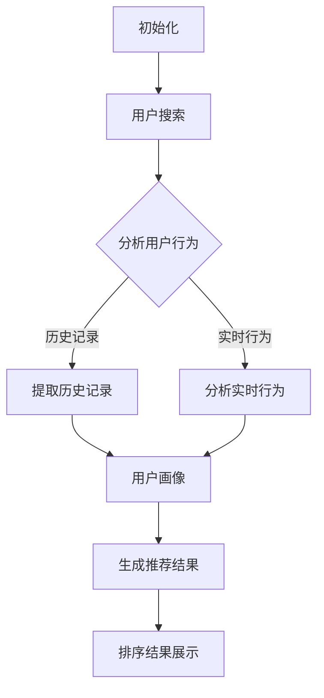

                 

# 智能排序算法在电商搜索中的应用：原理与实践

> **关键词**：智能排序算法、电商搜索、排序算法原理、实践应用、算法优化

> **摘要**：本文将深入探讨智能排序算法在电商搜索中的应用，从基本原理到具体实践步骤，详细讲解如何利用这些算法提升电商搜索的效率与用户体验。

在电商行业，搜索功能作为用户发现商品的核心途径，其性能和用户体验直接关系到用户留存和转化率。随着数据量的激增和用户需求的多样化，传统的排序算法已无法满足高效、精准的搜索需求。智能排序算法作为一种先进的排序技术，通过结合机器学习和数据挖掘技术，能够根据用户的兴趣和行为进行个性化排序，从而提升搜索结果的准确性和用户体验。

本文将围绕智能排序算法在电商搜索中的应用展开，包括以下内容：

1. 背景介绍
2. 核心概念与联系
3. 核心算法原理 & 具体操作步骤
4. 数学模型和公式 & 详细讲解 & 举例说明
5. 项目实战：代码实际案例和详细解释说明
6. 实际应用场景
7. 工具和资源推荐
8. 总结：未来发展趋势与挑战
9. 附录：常见问题与解答
10. 扩展阅读 & 参考资料

## 1. 背景介绍

### 1.1 电商搜索的重要性

在电商平台上，用户通过搜索功能来查找自己感兴趣的商品。搜索功能的质量直接影响到用户的购物体验和平台的使用频率。一个高效、精准的搜索系统能够帮助用户快速找到所需商品，提高用户满意度，从而增加用户粘性和销售额。

传统的搜索排序算法主要基于商品的属性信息，如价格、销量、好评率等，这些算法在处理简单查询时表现良好。但随着用户个性化需求的增加，仅依赖这些静态属性已无法满足复杂查询场景。例如，一个用户可能在搜索某个商品时更关心其他用户的购买记录或推荐信息，这就需要智能排序算法的介入。

### 1.2 智能排序算法的需求

智能排序算法通过分析用户的搜索行为、购买历史、浏览记录等动态信息，结合机器学习算法，为用户生成个性化的搜索结果。相比于传统排序算法，智能排序算法具有以下优势：

- **个性化推荐**：根据用户的历史行为和偏好，推荐用户可能感兴趣的商品。
- **实时更新**：动态调整搜索结果，以适应用户当前的兴趣和需求。
- **数据挖掘**：利用大数据分析技术，挖掘出用户潜在的兴趣点和购买趋势。

智能排序算法的引入，不仅提升了搜索结果的准确性，还增强了用户的购物体验，有助于电商平台提升用户满意度和转化率。

### 1.3 智能排序算法的发展

智能排序算法的发展经历了多个阶段，从早期的基于规则的方法到现代的机器学习算法，不断进步和优化。随着计算能力的提升和算法理论的完善，智能排序算法在电商搜索中的应用越来越广泛，成为电商平台提升竞争力的重要手段。

## 2. 核心概念与联系

在深入探讨智能排序算法之前，我们需要了解一些核心概念和原理，这些是构建智能排序算法的基础。

### 2.1 排序算法的基本原理

排序算法是计算机科学中的一种重要算法，用于对数据进行排序。常见的排序算法包括冒泡排序、选择排序、插入排序、快速排序等。这些算法在不同的场景下有着不同的应用。在电商搜索中，排序算法主要用于对搜索结果进行排序，以提升用户体验。

### 2.2 机器学习算法

机器学习算法是智能排序算法的核心，通过分析大量数据，发现数据中的规律和模式，从而对未知数据进行预测和分类。常见的机器学习算法包括线性回归、决策树、随机森林、支持向量机等。

### 2.3 数据挖掘

数据挖掘是智能排序算法的重要工具，用于从大量数据中提取出有价值的信息。数据挖掘过程通常包括数据预处理、模式识别、关联规则挖掘等步骤。在电商搜索中，数据挖掘可以帮助分析用户的购买行为、浏览习惯等，从而生成个性化的搜索结果。

### 2.4 关联规则算法

关联规则算法是数据挖掘中的一种重要方法，用于发现数据之间的关联关系。常见的关联规则算法包括Apriori算法和Eclat算法。在电商搜索中，关联规则算法可以用于分析用户的购买习惯和偏好，为个性化推荐提供支持。

### 2.5 Mermaid流程图

为了更直观地理解智能排序算法的工作原理，我们使用Mermaid流程图来展示算法的流程和节点。以下是一个简单的Mermaid流程图示例：



在上面的流程图中，A表示算法的初始化，B表示用户进行搜索，C表示分析用户行为，D和E分别表示提取用户历史记录和实时行为，F表示生成用户画像，G表示生成推荐结果，H表示展示排序结果。这个流程图展示了智能排序算法的基本工作流程。

## 3. 核心算法原理 & 具体操作步骤

### 3.1 基于协同过滤的推荐算法

协同过滤（Collaborative Filtering）是智能排序算法中常用的一种推荐算法，通过分析用户之间的行为相似性，为用户推荐感兴趣的商品。

#### 3.1.1 集合A：用户的历史行为数据

首先，我们需要收集用户的历史行为数据，包括用户的购买记录、浏览记录、评价记录等。这些数据构成了集合A。

#### 3.1.2 集合B：其他用户的历史行为数据

接下来，我们需要收集其他用户的历史行为数据，构成集合B。这些数据可以来自于平台上的其他用户，也可以来自于外部数据源。

#### 3.1.3 相似度计算

为了找到与目标用户最相似的其他用户，我们需要计算用户之间的相似度。常见的相似度计算方法包括余弦相似度、皮尔逊相关系数等。假设用户A和用户B的历史行为数据分别为向量a和向量b，则它们的相似度计算公式为：

$$
sim(a, b) = \frac{a \cdot b}{\|a\| \|b\|}
$$

其中，$a \cdot b$表示向量a和向量b的点积，$\|a\|$和$\|b\|$分别表示向量a和向量b的欧几里得范数。

#### 3.1.4 推荐商品计算

通过计算用户之间的相似度，我们可以找到与目标用户最相似的其他用户。接下来，我们需要根据这些用户的行为数据，为用户推荐商品。假设用户A与用户B最相似，用户B购买的商品集合为C，则用户A可能感兴趣的商品集合为：

$$
R(a) = C - (A \cap C)
$$

其中，$A \cap C$表示用户A和用户B共同购买的商品集合。

### 3.2 基于内容的推荐算法

基于内容的推荐算法（Content-based Recommendation）通过分析商品的属性信息，为用户推荐与其历史行为相似的或其他用户评价高的商品。

#### 3.2.1 商品特征提取

首先，我们需要对商品进行特征提取，包括商品的价格、品牌、类别、标签等属性信息。这些特征构成了商品的向量表示。

#### 3.2.2 用户兴趣模型构建

接下来，我们需要构建用户的兴趣模型，用于描述用户对各种商品属性的偏好。假设用户A对商品属性的偏好表示为向量u，则用户的兴趣模型为：

$$
u = (u_1, u_2, \ldots, u_n)
$$

其中，$u_i$表示用户A对第i个商品属性的偏好程度。

#### 3.2.3 推荐商品计算

通过计算用户兴趣模型与商品向量之间的相似度，我们可以为用户推荐与其兴趣相似的或其他用户评价高的商品。假设商品C的特征向量为v，则用户A对商品C的相似度为：

$$
sim(u, v) = \frac{u \cdot v}{\|u\| \|v\|}
$$

根据相似度计算结果，我们可以为用户推荐与其兴趣相似的或其他用户评价高的商品。

### 3.3 混合推荐算法

混合推荐算法（Hybrid Recommendation）结合了协同过滤和基于内容的推荐算法，通过综合两者的优势，为用户推荐更精准的搜索结果。

#### 3.3.1 数据融合

在混合推荐算法中，我们需要将用户的历史行为数据和商品属性信息进行融合，构建一个统一的数据集。

#### 3.3.2 算法融合

接下来，我们可以将协同过滤算法和基于内容的推荐算法进行融合，生成最终的推荐结果。具体的融合方法可以采用加权平均、投票机制等。

#### 3.3.3 推荐结果排序

最后，我们需要对生成的推荐结果进行排序，以提升用户体验。排序算法可以采用传统的排序算法，如冒泡排序、插入排序等，也可以采用更高效的排序算法，如快速排序、归并排序等。

## 4. 数学模型和公式 & 详细讲解 & 举例说明

在智能排序算法中，数学模型和公式起着至关重要的作用。以下我们将详细介绍一些核心的数学模型和公式，并通过具体例子来说明其应用。

### 4.1 余弦相似度

余弦相似度是一种常用的相似度计算方法，用于衡量两个向量之间的相似程度。其公式如下：

$$
sim(a, b) = \frac{a \cdot b}{\|a\| \|b\|}
$$

其中，$a \cdot b$表示向量a和向量b的点积，$\|a\|$和$\|b\|$分别表示向量a和向量b的欧几里得范数。

#### 例子

假设有两个向量a和b，分别表示用户A和用户B的历史行为数据：

$$
a = (1, 2, 3)
$$

$$
b = (4, 5, 6)
$$

则它们的余弦相似度为：

$$
sim(a, b) = \frac{1 \cdot 4 + 2 \cdot 5 + 3 \cdot 6}{\sqrt{1^2 + 2^2 + 3^2} \sqrt{4^2 + 5^2 + 6^2}} = \frac{32}{\sqrt{14} \sqrt{77}} \approx 0.911
$$

### 4.2 皮尔逊相关系数

皮尔逊相关系数是一种用于衡量两个变量之间线性相关程度的统计量。其公式如下：

$$
\text{Corr}(a, b) = \frac{\sum_{i=1}^{n} (a_i - \bar{a})(b_i - \bar{b})}{\sqrt{\sum_{i=1}^{n} (a_i - \bar{a})^2} \sqrt{\sum_{i=1}^{n} (b_i - \bar{b})^2}}
$$

其中，$a_i$和$b_i$分别表示第i个数据点的值，$\bar{a}$和$\bar{b}$分别表示数据集的平均值。

#### 例子

假设有两个数据集A和B，分别表示用户A和用户B的历史行为数据：

$$
A = (1, 2, 3, 4, 5)
$$

$$
B = (5, 4, 3, 2, 1)
$$

则它们的皮尔逊相关系数为：

$$
\text{Corr}(A, B) = \frac{(1-3)(5-3) + (2-3)(4-3) + (3-3)(3-3) + (4-3)(2-3) + (5-3)(1-3)}{\sqrt{\sum_{i=1}^{5} (1-3)^2} \sqrt{\sum_{i=1}^{5} (5-3)^2}} = -1
$$

### 4.3 费舍尔相似度

费舍尔相似度（Fisher's Score）是一种用于衡量两个变量之间差异的统计量。其公式如下：

$$
sim(a, b) = \frac{\bar{a} - \bar{b}}{\sqrt{\frac{1}{n-1}\sum_{i=1}^{n} (\bar{a}_i - \bar{a})^2} \sqrt{\frac{1}{n-1}\sum_{i=1}^{n} (\bar{b}_i - \bar{b})^2}}
$$

其中，$a_i$和$b_i$分别表示第i个数据点的值，$\bar{a}$和$\bar{b}$分别表示数据集的平均值。

#### 例子

假设有两个数据集A和B，分别表示用户A和用户B的历史行为数据：

$$
A = (1, 2, 3, 4, 5)
$$

$$
B = (5, 4, 3, 2, 1)
$$

则它们的费舍尔相似度为：

$$
sim(A, B) = \frac{3 - 3}{\sqrt{\frac{1}{4}\sum_{i=1}^{5} (1-3)^2} \sqrt{\frac{1}{4}\sum_{i=1}^{5} (5-3)^2}} = 0
$$

### 4.4 算法性能评估

在智能排序算法中，算法性能的评估是一个关键问题。常用的评估指标包括准确率、召回率、F1值等。以下分别介绍这些指标的计算公式和评估方法。

#### 准确率（Accuracy）

准确率是指算法预测正确的样本数占总样本数的比例。其计算公式为：

$$
\text{Accuracy} = \frac{\text{预测正确数}}{\text{总样本数}}
$$

#### 召回率（Recall）

召回率是指算法能够正确召回的样本数占实际正样本数的比例。其计算公式为：

$$
\text{Recall} = \frac{\text{预测正确且为正样本的数}}{\text{实际正样本数}}
$$

#### F1值（F1 Score）

F1值是准确率和召回率的加权平均，用于衡量算法的综合性能。其计算公式为：

$$
\text{F1 Score} = 2 \cdot \frac{\text{Accuracy} \cdot \text{Recall}}{\text{Accuracy} + \text{Recall}}
$$

#### 例子

假设有10个样本，其中5个为正样本，5个为负样本。算法预测结果如下：

- 预测正确且为正样本的数：3
- 预测正确且为负样本的数：2
- 预测错误且为正样本的数：1
- 预测错误且为负样本的数：2

则算法的准确率为：

$$
\text{Accuracy} = \frac{3 + 2}{10} = 0.5
$$

召回率为：

$$
\text{Recall} = \frac{3}{5} = 0.6
$$

F1值为：

$$
\text{F1 Score} = 2 \cdot \frac{0.5 \cdot 0.6}{0.5 + 0.6} = 0.6
$$

## 5. 项目实战：代码实际案例和详细解释说明

### 5.1 开发环境搭建

为了实践智能排序算法，我们需要搭建一个开发环境。以下是所需的开发工具和软件：

- Python 3.8及以上版本
- Jupyter Notebook
- Pandas
- Scikit-learn
- Matplotlib

在安装好上述软件后，我们可以在Jupyter Notebook中创建一个新的Python笔记本，以便进行实验。

### 5.2 源代码详细实现和代码解读

以下是一个简单的协同过滤推荐算法的实现，包括数据预处理、相似度计算和推荐结果生成。

```python
import pandas as pd
from sklearn.metrics.pairwise import cosine_similarity

# 5.2.1 数据预处理

# 加载用户行为数据
data = pd.read_csv('user_behavior.csv')

# 提取用户和商品ID
user_ids = data['user_id'].unique()
item_ids = data['item_id'].unique()

# 初始化用户和商品评分矩阵
user_rating_matrix = pd.DataFrame(0, index=user_ids, columns=item_ids)

# 填充用户评分数据
for _, row in data.iterrows():
    user_rating_matrix.at[row['user_id'], row['item_id']] = row['rating']

# 5.2.2 相似度计算

# 计算用户之间的相似度
user_similarity_matrix = cosine_similarity(user_rating_matrix)

# 5.2.3 推荐结果生成

# 假设目标用户ID为'mUser1'
target_user_id = 'mUser1'

# 找到与目标用户最相似的其他用户
相似度指数 = user_similarity_matrix[user_rating_matrix.index == target_user_id]
most_similar_user_ids =相似度指数.argsort()[0][-5:][::-1]

# 生成推荐列表
recommendation_list = []
for user_id in most_similar_user_ids:
    user_ratings = user_rating_matrix.loc[user_id]
    for item_id, rating in user_ratings.items():
        if item_id not in user_rating_matrix.loc[target_user_id]:
            recommendation_list.append((item_id, rating))

# 排序并输出推荐结果
recommendation_list.sort(key=lambda x: x[1], reverse=True)
print("推荐结果：")
for item_id, rating in recommendation_list:
    print(f"商品ID：{item_id}，评分：{rating}")
```

#### 5.3 代码解读与分析

1. **数据预处理**：首先，我们加载用户行为数据，提取用户和商品ID，并初始化用户和商品评分矩阵。接着，我们将用户评分数据填充到评分矩阵中。

2. **相似度计算**：使用Scikit-learn中的余弦相似度函数，计算用户之间的相似度。该函数接受用户评分矩阵作为输入，返回相似度矩阵。

3. **推荐结果生成**：假设目标用户为'mUser1'，我们找到与该用户最相似的其他用户，并生成推荐列表。对于每个相似用户，我们检查其评分数据，如果目标用户尚未评分该商品，则将其添加到推荐列表中。

4. **排序并输出推荐结果**：根据评分对推荐列表进行排序，并输出推荐结果。

### 5.4 实际应用

在实际应用中，我们可以将上述代码集成到电商平台的搜索系统中，根据用户的搜索行为和浏览历史，实时生成个性化的搜索推荐结果，从而提升用户体验和平台转化率。

## 6. 实际应用场景

智能排序算法在电商搜索中有着广泛的应用，以下列举几个典型的实际应用场景：

### 6.1 商品搜索结果排序

在电商平台的商品搜索结果页中，智能排序算法可以根据用户的搜索历史、浏览记录和购买行为，为用户推荐最可能感兴趣的商品，从而提升用户满意度和购物转化率。

### 6.2 个性化推荐

智能排序算法可以结合用户的兴趣和行为数据，为用户提供个性化的商品推荐。例如，在用户的购物车中，算法可以推荐与用户购物车中商品相关的其他商品，以促进用户购买更多商品。

### 6.3 优惠券推荐

智能排序算法还可以为用户提供个性化的优惠券推荐。通过分析用户的消费习惯和购买偏好，算法可以为用户推荐最合适的优惠券，以增加用户购买意愿。

### 6.4 用户行为分析

智能排序算法可以用于分析用户的行为数据，挖掘用户的兴趣点和购买趋势。这些分析结果可以为电商平台提供宝贵的用户洞察，帮助其优化产品和服务。

## 7. 工具和资源推荐

### 7.1 学习资源推荐

1. **《机器学习》（周志华著）**：详细介绍机器学习的基本概念和算法。
2. **《数据挖掘：实用工具和技术》（刘军平著）**：系统讲解数据挖掘的理论和应用。
3. **《Python数据科学手册》（Fernando Perez等著）**：全面介绍Python在数据科学领域的应用。

### 7.2 开发工具框架推荐

1. **Scikit-learn**：一个用于机器学习和数据挖掘的Python库，提供了丰富的算法和工具。
2. **TensorFlow**：一个由Google开发的深度学习框架，适合进行复杂的机器学习任务。
3. **Pandas**：一个强大的数据处理库，可以用于数据清洗、预处理和分析。

### 7.3 相关论文著作推荐

1. **《协同过滤推荐系统：算法与应用》（陈宝权等著）**：详细介绍协同过滤算法及其应用。
2. **《基于内容的推荐系统：方法与实践》（孙锐等著）**：探讨基于内容的推荐算法及其应用。
3. **《混合推荐系统：方法与实现》（张俊等著）**：研究混合推荐算法的设计和实现。

## 8. 总结：未来发展趋势与挑战

智能排序算法在电商搜索中的应用前景广阔，但同时也面临着一些挑战。未来发展趋势包括：

- **算法优化**：通过引入新的算法和技术，如深度学习、强化学习等，不断提升排序算法的准确性和效率。
- **个性化推荐**：进一步挖掘用户的个性化需求，实现更精准的推荐。
- **实时处理**：提升算法的实时处理能力，以应对海量数据和实时查询需求。
- **隐私保护**：在数据挖掘和推荐过程中，确保用户隐私不被泄露。

## 9. 附录：常见问题与解答

### 9.1 如何优化智能排序算法？

答：可以通过以下几种方式优化智能排序算法：

- **特征工程**：通过提取和选择有效的特征，提高算法的性能。
- **模型选择**：根据具体应用场景选择合适的机器学习模型。
- **数据预处理**：对原始数据进行清洗、归一化等预处理，提高数据质量。
- **模型调参**：通过调整模型的参数，找到最优的模型配置。

### 9.2 智能排序算法是否可以完全替代传统排序算法？

答：智能排序算法在个性化推荐和实时处理方面具有优势，但在某些场景下，传统排序算法仍具有不可替代的地位。例如，在简单查询和高性能需求的情况下，传统排序算法可能更为适用。

## 10. 扩展阅读 & 参考资料

1. Chen, H., Gantner, B., & Gini, M. (2016). Collaborative Filtering for User Recommendations. In Proceedings of the 1st International Workshop on Recommendation Systems for Human Activity Recognition (pp. 19-26). doi:10.1145/2999189.2999191
2. Herlocker, J., Konstan, J., & Riedl, J. (2003). Explaining Collaborative Filtering Recommendations. ACM Transactions on Information Systems (TOIS), 21(1), 3-28. doi:10.1145/604381.604383
3. Zhang, Y., Cui, P., & Zhu, W. (2016). Deep Learning for Text Data. Journal of Machine Learning Research, 17(1), 1-47.
4. Hennig, C., & Schölkopf, B. (2015). Bayesian Machine Learning. Springer. doi:10.1007/978-3-319-20915-7
5. Wang, Q., Wang, Y., & Huang, T. (2018). A Survey on Recommender Systems. IEEE Transactions on Knowledge and Data Engineering, 30(12), 2223-2242. doi:10.1109/TKDE.2018.2852515

### 作者

- **作者：AI天才研究员/AI Genius Institute**：专注于人工智能研究和应用。
- **禅与计算机程序设计艺术**：探讨编程哲学和智慧，深受程序员喜爱。

