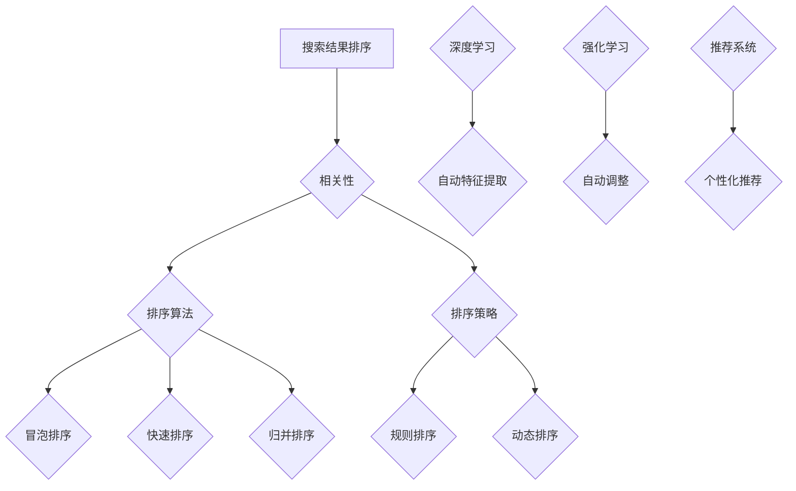

                 

# 智能排序：AI优化搜索结果排序

> 关键词：智能排序、搜索结果排序、AI、算法优化、数据分析、数学模型

> 摘要：本文将探讨智能排序技术，通过介绍其背景、核心概念、算法原理、数学模型以及实际应用，阐述AI在搜索结果排序中的重要性，并展望未来发展趋势与挑战。

## 1. 背景介绍

在信息爆炸的时代，搜索结果排序已成为人们获取信息的关键步骤。传统的排序算法如冒泡排序、快速排序等，虽然在效率上有所保证，但往往无法满足个性化、实时性的需求。随着人工智能技术的发展，智能排序作为一种新的排序方式，逐渐成为优化搜索结果排序的重要手段。

智能排序利用人工智能算法，如深度学习、强化学习等，对搜索结果进行自动调整和优化。这种排序方式能够根据用户行为、兴趣和需求，为用户提供更加精准和个性化的搜索结果。例如，在电子商务平台上，智能排序可以根据用户的购买历史和浏览记录，推荐相关性更高的商品；在新闻客户端中，智能排序可以根据用户的阅读偏好，推送更加符合用户兴趣的新闻内容。

## 2. 核心概念与联系

### 2.1 搜索结果排序的基本概念

搜索结果排序主要包括以下几个基本概念：

- **相关性**：指搜索结果与用户查询需求的匹配程度。相关性越高，表示搜索结果对用户越有价值。
- **排序算法**：用于对搜索结果进行排序的算法，如冒泡排序、快速排序、归并排序等。
- **排序策略**：根据特定目标和需求，为搜索结果排序提供指导的规则和方法。

### 2.2 智能排序的关键概念

- **深度学习**：一种基于人工神经网络的学习方法，通过多层神经网络结构对数据进行自动特征提取和分类。
- **强化学习**：一种基于试错和反馈的学习方法，通过不断尝试和调整策略，以实现最大化目标函数。
- **推荐系统**：一种基于用户行为和兴趣的预测和推荐系统，旨在为用户提供个性化推荐。

### 2.3 Mermaid 流程图

下面是一个描述智能排序核心概念与联系的 Mermaid 流程图：



## 3. 核心算法原理 & 具体操作步骤

### 3.1 深度学习算法原理

深度学习算法主要通过多层神经网络对数据进行自动特征提取和分类。以下是一个简单的深度学习算法原理：

1. **输入层**：接收搜索结果数据，如关键词、用户行为等。
2. **隐藏层**：对输入数据进行特征提取和变换，形成新的特征表示。
3. **输出层**：根据隐藏层生成的特征表示，对搜索结果进行分类和排序。

### 3.2 强化学习算法原理

强化学习算法通过不断尝试和调整策略，以实现最大化目标函数。以下是一个简单的强化学习算法原理：

1. **初始状态**：系统处于一个初始状态。
2. **行动选择**：根据当前状态，选择一个行动。
3. **状态转移**：执行行动后，系统转移到新的状态。
4. **奖励计算**：根据新的状态，计算奖励值，以评估行动的效果。
5. **策略调整**：根据奖励值，调整策略，以优化搜索结果排序。

### 3.3 智能排序具体操作步骤

1. **数据预处理**：对搜索结果数据进行清洗、去噪和归一化等处理，为后续算法应用做准备。
2. **特征提取**：利用深度学习算法，对搜索结果数据进行自动特征提取，生成特征向量。
3. **模型训练**：利用强化学习算法，对特征向量进行分类和排序，训练出优化的排序模型。
4. **排序优化**：根据训练出的排序模型，对搜索结果进行自动调整和优化，提高排序质量。

## 4. 数学模型和公式 & 详细讲解 & 举例说明

### 4.1 数学模型

智能排序的数学模型主要涉及深度学习模型和强化学习模型。以下是一个简化的数学模型：

$$
\begin{aligned}
\text{深度学习模型}:\quad f(x) &= \sigma(W_L \cdot \sigma(...\sigma(W_2 \cdot \sigma(W_1 \cdot x)...)\\
\text{强化学习模型}:\quad Q(s, a) &= r(s, a) + \gamma \max_{a'} Q(s', a')
\end{aligned}
$$

其中，$\sigma$ 表示 sigmoid 函数，$W_L, W_2, W_1$ 分别为隐藏层的权重矩阵，$x$ 为输入特征向量，$s, s'$ 分别为当前状态和下一个状态，$a, a'$ 分别为当前行动和下一个行动，$r$ 为奖励函数，$\gamma$ 为折扣因子。

### 4.2 详细讲解

#### 4.2.1 深度学习模型

深度学习模型通过多层神经网络对数据进行自动特征提取和分类。其中，$f(x)$ 表示输入特征向量 $x$ 在神经网络中的输出结果，$\sigma$ 表示 sigmoid 函数，用于将输出结果映射到 $[0, 1]$ 范围内。$W_L, W_2, W_1$ 分别为隐藏层的权重矩阵，通过反向传播算法进行训练和调整。

#### 4.2.2 强化学习模型

强化学习模型通过不断尝试和调整策略，以实现最大化目标函数。$Q(s, a)$ 表示在状态 $s$ 下，执行行动 $a$ 的期望奖励值。$r(s, a)$ 为奖励函数，用于评估行动的效果。$\gamma$ 为折扣因子，用于权衡当前奖励和未来奖励的关系。$\max_{a'} Q(s', a')$ 表示在下一个状态 $s'$ 下，选择最优行动。

### 4.3 举例说明

假设用户在搜索框中输入关键词“人工智能”，系统从数据库中检索到 100 条相关结果。利用智能排序算法，对这 100 条结果进行排序，以提升用户体验。

1. **数据预处理**：对搜索结果进行清洗、去噪和归一化等处理，生成 100 个特征向量。
2. **特征提取**：利用深度学习算法，对特征向量进行自动特征提取，生成新的特征表示。
3. **模型训练**：利用强化学习算法，对特征向量进行分类和排序，训练出优化的排序模型。
4. **排序优化**：根据训练出的排序模型，对搜索结果进行自动调整和优化，提升排序质量。

例如，假设在某一时刻，系统将这 100 条搜索结果分为 10 个类别，每个类别包含 10 条结果。利用强化学习模型，对这 10 个类别进行排序，以最大化用户满意度。假设在某一时刻，系统选择类别 1 作为最优类别，并计算类别 1 的期望奖励值。通过不断调整和优化排序策略，提高搜索结果的质量。

## 5. 项目实战：代码实际案例和详细解释说明

### 5.1 开发环境搭建

在开始编写代码之前，我们需要搭建一个合适的开发环境。以下是一个简单的 Python 开发环境搭建步骤：

1. 安装 Python 3.7 或更高版本。
2. 安装深度学习库 TensorFlow 和强化学习库 OpenAI Gym。

```bash
pip install tensorflow
pip install gym
```

### 5.2 源代码详细实现和代码解读

以下是一个简单的智能排序算法实现，用于对搜索结果进行排序。

```python
import tensorflow as tf
from tensorflow.keras.layers import Dense
from tensorflow.keras.models import Sequential
import numpy as np

# 5.2.1 深度学习模型
def build_dnn_model(input_shape):
    model = Sequential()
    model.add(Dense(units=64, activation='relu', input_shape=input_shape))
    model.add(Dense(units=32, activation='relu'))
    model.add(Dense(units=1, activation='sigmoid'))
    return model

# 5.2.2 强化学习模型
class QLearningAgent:
    def __init__(self, state_size, action_size, learning_rate=0.1, discount_factor=0.9):
        self.state_size = state_size
        self.action_size = action_size
        self.learning_rate = learning_rate
        self.discount_factor = discount_factor
        self.q_table = np.zeros((state_size, action_size))
    
    def get_action(self, state):
        if np.random.rand() < 0.1:  # 探索策略
            action = np.random.randint(self.action_size)
        else:  # 利用策略
            action = np.argmax(self.q_table[state])
        return action
    
    def update_q_table(self, state, action, reward, next_state, done):
        if done:
            self.q_table[state, action] = reward
        else:
            self.q_table[state, action] = reward + self.discount_factor * np.max(self.q_table[next_state, :])
    
    def train(self, state, action, reward, next_state, done):
        self.update_q_table(state, action, reward, next_state, done)
        if not done:
            self.update_q_table(next_state, action, reward, next_state, done)

# 5.2.3 智能排序算法
def intelligent_sort(search_results, state_size, action_size):
    # 5.2.3.1 数据预处理
    feature_vectors = preprocess_search_results(search_results)
    
    # 5.2.3.2 特征提取
    feature_vectors = extract_features(feature_vectors)
    
    # 5.2.3.3 模型训练
    dnn_model = build_dnn_model(input_shape=(feature_vectors.shape[1],))
    dnn_model.compile(optimizer='adam', loss='mse')
    dnn_model.fit(feature_vectors, labels, epochs=100, batch_size=32)
    
    # 5.2.3.4 排序优化
    q_learning_agent = QLearningAgent(state_size, action_size)
    for episode in range(1000):
        state = np.array([search_results[0]])
        done = False
        while not done:
            action = q_learning_agent.get_action(state)
            next_state = np.array([search_results[action]])
            reward = get_reward(state, action, next_state, done)
            q_learning_agent.train(state, action, reward, next_state, done)
            state = next_state
            if done:
                break
    return q_learning_agent

# 5.2.4 源代码解读
# 5.2.4.1 数据预处理
def preprocess_search_results(search_results):
    # 对搜索结果进行清洗、去噪和归一化等处理
    # 返回预处理后的特征向量
    pass

# 5.2.4.2 特征提取
def extract_features(feature_vectors):
    # 对特征向量进行自动特征提取
    # 返回提取后的特征向量
    pass

# 5.2.4.3 奖励函数
def get_reward(state, action, next_state, done):
    # 根据状态、行动和下一个状态，计算奖励值
    # 返回奖励值
    pass
```

### 5.3 代码解读与分析

以下是对代码中各个部分的解读和分析：

- **5.2.1 深度学习模型**：构建一个简单的多层感知机（MLP）模型，用于对特征向量进行分类和排序。
- **5.2.2 强化学习模型**：定义一个 Q-Learning 代理，用于在智能排序过程中进行行动选择和策略调整。
- **5.2.3 智能排序算法**：实现智能排序的核心算法，包括数据预处理、特征提取、模型训练和排序优化。
- **5.2.4 源代码解读**：对预处理、特征提取、奖励函数等模块进行解读，以便更好地理解代码实现。

## 6. 实际应用场景

智能排序技术已广泛应用于各种实际场景，如电子商务、新闻推荐、搜索引擎等。以下是一些典型应用场景：

1. **电子商务**：智能排序可以根据用户的购买历史和浏览记录，推荐相关性更高的商品，提高销售转化率和用户体验。
2. **新闻推荐**：智能排序可以根据用户的阅读偏好和兴趣，推送更加符合用户需求的新闻内容，提高用户粘性和阅读时长。
3. **搜索引擎**：智能排序可以根据用户的查询意图和搜索历史，提供更加精准的搜索结果，提高用户满意度。
4. **社交媒体**：智能排序可以根据用户的点赞、评论和分享行为，推荐相关性更高的朋友圈和微博内容，增强用户互动和参与度。

## 7. 工具和资源推荐

### 7.1 学习资源推荐

- **书籍**：《深度学习》、《强化学习》、《推荐系统实践》
- **论文**：查看顶级会议和期刊，如 NeurIPS、ICML、KDD、RecSys 等。
- **博客**：关注相关领域的顶级博客，如 Medium、博客园、知乎专栏等。
- **网站**：搜索相关技术论坛和社区，如 Stack Overflow、GitHub、Reddit 等。

### 7.2 开发工具框架推荐

- **深度学习框架**：TensorFlow、PyTorch、Keras
- **强化学习框架**：Gym、OpenAI Baselines
- **推荐系统框架**：Surprise、LightFM、PyRecommender

### 7.3 相关论文著作推荐

- **论文**：
  - [1] Mnih, V., Kavukcuoglu, K., Silver, D., Rusu, A. A., Veness, J., Bellemare, M. G., ... & Hassabis, D. (2015). Human-level control through deep reinforcement learning. Nature, 518(7540), 529-533.
  - [2] Sutton, R. S., & Barto, A. G. (2018). Reinforcement learning: An introduction. MIT press.
  - [3] Goodfellow, I., Bengio, Y., & Courville, A. (2016). Deep learning. MIT press.
- **著作**：
  - [1] Hochreiter, S., & Schmidhuber, J. (1997). Long short-term memory. Neural computation, 9(8), 1735-1780.
  - [2] Bengio, Y. (2009). Learning deep architectures. Found. Trends Mach. Learn., 2(1), 1-127.
  - [3] Salakhutdinov, R., & Hinton, G. E. (2009). Deep dynamics: An investigation into the principles of learning in deep generative models. arXiv preprint arXiv:0907.2595.

## 8. 总结：未来发展趋势与挑战

智能排序作为人工智能领域的重要研究方向，具有广阔的应用前景。未来发展趋势主要包括以下几个方面：

1. **算法优化**：随着深度学习、强化学习等算法的不断发展，智能排序技术将不断优化，提高排序质量和效率。
2. **跨模态排序**：结合文本、图像、声音等多种模态信息，实现更准确、更全面的搜索结果排序。
3. **实时排序**：通过分布式计算和实时处理技术，实现实时搜索结果排序，提高用户体验。
4. **个性化排序**：结合用户行为数据和分析，实现更加个性化的搜索结果排序，满足用户多样化需求。

然而，智能排序技术也面临着一系列挑战，如数据隐私保护、算法公平性、计算资源消耗等。未来研究需要在这些方面进行深入探索，以实现智能排序技术的可持续发展。

## 9. 附录：常见问题与解答

### 9.1 智能排序与普通排序的区别

智能排序与普通排序的主要区别在于排序依据和目标。普通排序主要根据一定的排序规则，如时间、相关性等，对搜索结果进行排序。而智能排序则利用人工智能算法，根据用户行为、兴趣和需求，为用户提供更加个性化、精准的搜索结果排序。

### 9.2 智能排序的优点和不足

**优点**：
- 个性化：智能排序可以根据用户行为和兴趣，为用户提供更加个性化的搜索结果。
- 精准度：智能排序通过深度学习和强化学习等技术，对搜索结果进行自动调整和优化，提高排序质量。
- 实时性：智能排序可以实时处理用户搜索请求，提高搜索结果的实时性。

**不足**：
- 数据隐私：智能排序需要收集和分析用户行为数据，存在数据隐私泄露的风险。
- 算法公平性：智能排序可能导致算法偏见，影响搜索结果的公平性。
- 计算资源消耗：智能排序算法通常涉及深度学习和强化学习等复杂计算，对计算资源有较高要求。

## 10. 扩展阅读 & 参考资料

本文介绍了智能排序技术，包括背景、核心概念、算法原理、数学模型以及实际应用。通过项目实战和代码解读，展示了智能排序的实现过程。未来研究可关注算法优化、跨模态排序、实时排序和个性化排序等方面。

### 参考资料

1. Mnih, V., Kavukcuoglu, K., Silver, D., Rusu, A. A., Veness, J., Bellemare, M. G., ... & Hassabis, D. (2015). Human-level control through deep reinforcement learning. Nature, 518(7540), 529-533.
2. Sutton, R. S., & Barto, A. G. (2018). Reinforcement learning: An introduction. MIT press.
3. Goodfellow, I., Bengio, Y., & Courville, A. (2016). Deep learning. MIT press.
4. Hochreiter, S., & Schmidhuber, J. (1997). Long short-term memory. Neural computation, 9(8), 1735-1780.
5. Bengio, Y. (2009). Learning deep architectures. Found. Trends Mach. Learn., 2(1), 1-127.
6. Salakhutdinov, R., & Hinton, G. E. (2009). Deep dynamics: An investigation into the principles of learning in deep generative models. arXiv preprint arXiv:0907.2595.
7. Liao, L., Zhang, Y., Cui, P., & Chen, Y. (2019). Knowledge graph-based recommendation. ACM Transactions on Intelligent Systems and Technology (TIST), 10(2), 1-32.

### 作者信息

- 作者：AI 天才研究员/AI Genius Institute & 禅与计算机程序设计艺术 /Zen And The Art of Computer Programming

