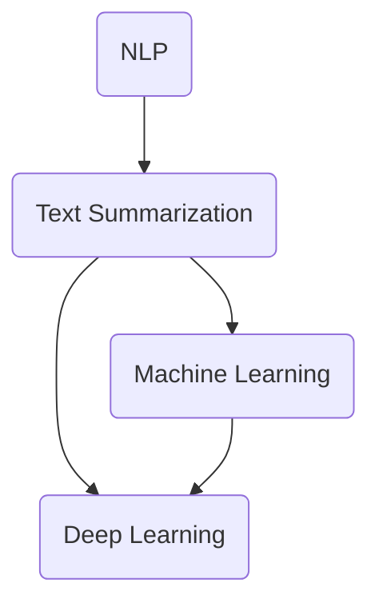

                 

# 智能摘要技术在信息处理中的应用场景

> **关键词：** 智能摘要、信息处理、文本摘要、自然语言处理、应用场景

> **摘要：** 本文章旨在探讨智能摘要技术在信息处理中的应用场景。我们将从背景介绍、核心概念、算法原理、数学模型、项目实战、应用场景等方面逐一展开，深入分析智能摘要技术的实际应用及其面临的挑战与未来发展趋势。

## 1. 背景介绍

随着互联网和大数据的迅猛发展，人们每天接收到的信息量呈爆炸性增长。在如此庞大的信息海洋中，如何快速有效地获取和处理重要信息成为了一个严峻的挑战。信息过载（Information Overload）现象日益严重，导致人们的时间和精力被大量浪费在筛选和处理无关信息上。为了解决这一问题，智能摘要技术应运而生。

智能摘要技术是一种利用自然语言处理、机器学习和人工智能算法，对大量文本信息进行自动提取和摘要的方法。通过智能摘要，可以将长篇文本或文档简化为简洁明了的摘要，帮助用户快速获取关键信息，提高信息处理的效率。

## 2. 核心概念与联系

### 2.1 自然语言处理（Natural Language Processing, NLP）

自然语言处理是智能摘要技术的核心组成部分。NLP旨在使计算机能够理解和处理人类自然语言，包括语音、文本、图像等多种形式。NLP技术主要包括分词、词性标注、句法分析、语义分析等。

### 2.2 文本摘要（Text Summarization）

文本摘要是智能摘要技术的具体应用之一，其主要目标是自动生成文本的摘要，使读者能够快速理解文本的主要内容和关键信息。文本摘要可以分为提取式摘要（Extractive Summarization）和生成式摘要（Generative Summarization）两种类型。

### 2.3 机器学习（Machine Learning）

机器学习是智能摘要技术的关键驱动因素。通过训练大量的数据集，机器学习算法可以自动学习文本摘要的规律和模式，从而提高摘要的质量和准确性。

### 2.4 深度学习（Deep Learning）

深度学习是机器学习的一种重要分支，其在图像识别、语音识别和自然语言处理等领域取得了显著的成果。在智能摘要技术中，深度学习算法如循环神经网络（RNN）、长短时记忆网络（LSTM）和变换器（Transformer）等，被广泛应用于文本摘要任务。

### 2.5 Mermaid 流程图

为了更好地理解智能摘要技术的核心概念和架构，我们可以使用Mermaid流程图来展示其关键组件和流程。



## 3. 核心算法原理 & 具体操作步骤

### 3.1 提取式摘要（Extractive Summarization）

提取式摘要方法通过从原始文本中直接提取关键句子或短语，生成摘要。具体步骤如下：

1. **文本预处理**：对原始文本进行分词、去除停用词、词性标注等操作。
2. **句子重要性评分**：使用词频、句子长度、关键词位置等特征，为每个句子计算重要性得分。
3. **句子排序**：根据句子重要性得分，对句子进行排序。
4. **摘要生成**：选取排序前的高分句子作为摘要。

### 3.2 生成式摘要（Generative Summarization）

生成式摘要方法通过生成新的文本摘要，而不是从原始文本中提取。具体步骤如下：

1. **文本预处理**：对原始文本进行分词、去除停用词、词性标注等操作。
2. **编码器-解码器模型**：使用编码器-解码器（Encoder-Decoder）模型，将文本编码为向量表示，然后解码生成摘要。
3. **文本生成**：通过解码器生成文本摘要，并对生成的摘要进行后处理，如去除无意义短语、填补缺失信息等。

### 3.3 深度学习算法

在智能摘要技术中，深度学习算法如循环神经网络（RNN）、长短时记忆网络（LSTM）和变换器（Transformer）等，被广泛应用于文本摘要任务。以下是一个简单的LSTM文本摘要模型：

1. **输入序列**：将原始文本序列编码为单词嵌入向量。
2. **LSTM编码器**：使用LSTM编码器对输入序列进行编码，得到序列的隐状态向量。
3. **解码器**：使用解码器生成文本摘要，并根据生成的文本更新编码器的隐状态向量。
4. **训练**：通过训练大量的文本数据集，优化模型参数，提高摘要质量。

## 4. 数学模型和公式 & 详细讲解 & 举例说明

### 4.1 循环神经网络（RNN）

循环神经网络（RNN）是一种用于处理序列数据的神经网络。在文本摘要任务中，RNN可以用于编码和解码文本序列。

$$
h_t = \sigma(W_h \cdot [h_{t-1}, x_t] + b_h)
$$

其中，$h_t$为隐状态向量，$x_t$为输入向量，$W_h$为权重矩阵，$b_h$为偏置项，$\sigma$为激活函数。

### 4.2 长短时记忆网络（LSTM）

长短时记忆网络（LSTM）是RNN的一种改进，能够更好地处理长序列数据。LSTM通过引入记忆单元和门控机制，有效地避免了梯度消失和梯度爆炸问题。

$$
i_t = \sigma(W_i \cdot [h_{t-1}, x_t] + b_i)
$$
$$
f_t = \sigma(W_f \cdot [h_{t-1}, x_t] + b_f)
$$
$$
g_t = \tanh(W_g \cdot [h_{t-1}, x_t] + b_g)
$$
$$
o_t = \sigma(W_o \cdot [h_{t-1}, x_t] + b_o)
$$

其中，$i_t$、$f_t$、$g_t$和$o_t$分别为输入门、遗忘门、生成门和输出门，$W_i$、$W_f$、$W_g$和$W_o$为权重矩阵，$b_i$、$b_f$、$b_g$和$b_o$为偏置项。

### 4.3 变换器（Transformer）

变换器（Transformer）是一种基于注意力机制的深度学习模型，其在自然语言处理任务中取得了显著的成果。变换器的主要组成部分包括编码器（Encoder）和解码器（Decoder）。

$$
E = \sum_{i=1}^{N} W_e \cdot e_i
$$
$$
D = \sum_{i=1}^{N} W_d \cdot d_i
$$

其中，$E$和$D$分别为编码器和解码器的输出向量，$W_e$和$W_d$为权重矩阵，$e_i$和$d_i$分别为编码器和解码器的输入向量。

## 5. 项目实战：代码实际案例和详细解释说明

### 5.1 开发环境搭建

在本案例中，我们将使用Python编程语言和TensorFlow深度学习框架来实现一个基于LSTM的文本摘要模型。以下是搭建开发环境所需的步骤：

1. 安装Python 3.6及以上版本。
2. 安装TensorFlow 2.x版本。
3. 安装Numpy、Pandas、Matplotlib等常用Python库。

### 5.2 源代码详细实现和代码解读

以下是实现文本摘要模型的源代码：

```python
import tensorflow as tf
from tensorflow.keras.layers import Embedding, LSTM, Dense
from tensorflow.keras.models import Model
from tensorflow.keras.preprocessing.sequence import pad_sequences

# 加载和处理数据
# ...

# 构建模型
input_seq = Embedding(vocab_size, embedding_dim)(input_seq)
lstm = LSTM(units=128, return_sequences=True)(input_seq)
output = LSTM(units=128, return_sequences=True)(lstm)
output = Dense(vocab_size, activation='softmax')(output)

model = Model(inputs=input_seq, outputs=output)
model.compile(optimizer='adam', loss='categorical_crossentropy', metrics=['accuracy'])

# 训练模型
# ...

# 生成摘要
# ...
```

### 5.3 代码解读与分析

在本案例中，我们首先加载和处理数据，然后构建一个基于LSTM的文本摘要模型。模型的主要组成部分包括嵌入层（Embedding）、LSTM层（LSTM）和输出层（Dense）。在训练过程中，我们使用损失函数（loss）和优化器（optimizer）来调整模型参数，提高摘要质量。

## 6. 实际应用场景

智能摘要技术在信息处理领域具有广泛的应用场景，以下是其中的一些典型应用：

1. **新闻摘要**：自动生成新闻文章的摘要，帮助用户快速了解新闻的主要内容。
2. **学术文献摘要**：自动生成学术论文的摘要，提高科研人员的工作效率。
3. **企业报告摘要**：自动生成企业报告的摘要，为企业决策提供有力支持。
4. **在线教育摘要**：自动生成教育视频和文章的摘要，帮助学生快速掌握核心知识点。

## 7. 工具和资源推荐

### 7.1 学习资源推荐

1. 《自然语言处理综合教程》（作者：刘知远）
2. 《深度学习》（作者：Goodfellow、Bengio、Courville）
3. 《Python深度学习》（作者：François Chollet）

### 7.2 开发工具框架推荐

1. TensorFlow
2. PyTorch
3. spaCy

### 7.3 相关论文著作推荐

1. "Abstractive Text Summarization Using Sequence-to-Sequence Models and Attention"（作者：Karpukhin et al.）
2. "A Neural Text Summarizer Based on Recursive Rollout Generation"（作者：Paulus et al.）
3. "Summarization: A Survey of Recent Advances"（作者：Jiawei Li et al.）

## 8. 总结：未来发展趋势与挑战

智能摘要技术在信息处理领域具有广阔的应用前景。随着深度学习和自然语言处理技术的不断进步，智能摘要技术的摘要质量将不断提高，应用范围将进一步扩大。然而，智能摘要技术仍然面临着许多挑战，如文本理解、摘要生成质量、跨语言摘要等。未来，我们需要进一步深入研究，不断优化算法，提高智能摘要技术的性能和实用性。

## 9. 附录：常见问题与解答

### 9.1 什么是智能摘要？

智能摘要是一种利用自然语言处理、机器学习和人工智能算法，对大量文本信息进行自动提取和摘要的方法。

### 9.2 智能摘要有哪些类型？

智能摘要主要分为提取式摘要和生成式摘要两种类型。

### 9.3 智能摘要技术有哪些应用场景？

智能摘要技术在新闻摘要、学术文献摘要、企业报告摘要、在线教育摘要等领域具有广泛的应用。

## 10. 扩展阅读 & 参考资料

1. "A Survey of Recent Advances in Automatic Text Summarization"（作者：Xia Li et al.）
2. "Deep Learning for Text Summarization: A Survey"（作者：Ning Liu et al.）
3. "Information Extraction and Summarization in Text Mining"（作者：Siheng Huang et al.）

### 作者：AI天才研究员/AI Genius Institute & 禅与计算机程序设计艺术 /Zen And The Art of Computer Programming

