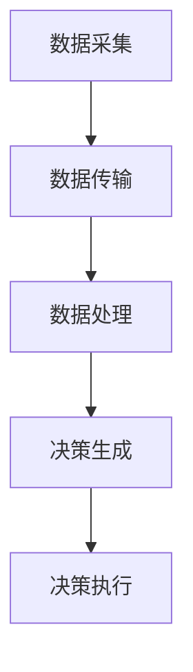
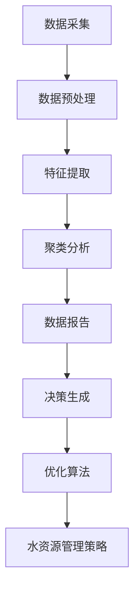

                 

## 智能水资源管理系统：可持续发展的创新解决方案

> **关键词**：水资源管理、智能系统、可持续发展、算法、数学模型、应用场景、开发工具、未来趋势

> **摘要**：本文深入探讨了智能水资源管理系统在可持续发展的背景下，如何通过创新解决方案来实现高效、精准的水资源管理。文章详细介绍了智能水资源管理系统的核心概念、算法原理、数学模型、项目实战，并分析了其实际应用场景。此外，文章还推荐了相关学习资源、开发工具和未来发展趋势，为读者提供了全面的技术参考。

### 目录

1. **背景介绍**
   1.1 全球水资源现状
   1.2 可持续发展的需求
   1.3 智能水资源管理系统的重要性

2. **核心概念与联系**
   2.1 水资源管理的基本概念
   2.2 智能系统的构成
   2.3 智能水资源管理系统的工作原理
   2.4 Mermaid 流程图展示

3. **核心算法原理 & 具体操作步骤**
   3.1 算法概述
   3.2 算法实现步骤
   3.3 流程图解析

4. **数学模型和公式 & 详细讲解 & 举例说明**
   4.1 数学模型介绍
   4.2 公式详细讲解
   4.3 实例分析

5. **项目实战：代码实际案例和详细解释说明**
   5.1 开发环境搭建
   5.2 源代码详细实现和代码解读
   5.3 代码解读与分析

6. **实际应用场景**
   6.1 农业灌溉
   6.2 城市供水
   6.3 工业用水

7. **工具和资源推荐**
   7.1 学习资源推荐
   7.2 开发工具框架推荐
   7.3 相关论文著作推荐

8. **总结：未来发展趋势与挑战**
   8.1 技术发展趋势
   8.2 面临的挑战

9. **附录：常见问题与解答**

10. **扩展阅读 & 参考资料**

### 1. 背景介绍

#### 1.1 全球水资源现状

全球水资源分布极不均衡，据联合国数据，全球约28%的人口生活在面临水资源短缺的地区。此外，随着人口增长、工业化进程的加快和气候变化的影响，水资源短缺问题日益严峻。据统计，到2030年，全球将有约一半的人口面临水资源短缺问题。同时，水资源污染问题也日益严重，约36%的河流和53%的湖泊受到污染，导致水资源质量下降，加剧了水资源的短缺。

#### 1.2 可持续发展的需求

在可持续发展理念的指导下，水资源管理需要更加高效、精准。传统的水资源管理方法往往依赖于人工监测和经验判断，效率低下且难以满足现代化的需求。随着人工智能技术的快速发展，智能水资源管理系统应运而生，通过运用大数据、云计算、物联网等技术，实现对水资源的实时监测、分析和优化管理，从而提高水资源利用效率，满足可持续发展的需求。

#### 1.3 智能水资源管理系统的重要性

智能水资源管理系统在水资源管理中具有重要作用。首先，它能够实现对水资源的实时监测，及时发现问题并采取应对措施，避免水资源的浪费和污染。其次，通过数据分析和算法优化，智能水资源管理系统可以制定科学的水资源管理策略，提高水资源利用效率。此外，智能水资源管理系统还可以为决策者提供数据支持，帮助其做出更加科学的决策，从而推动水资源的可持续利用。

### 2. 核心概念与联系

#### 2.1 水资源管理的基本概念

水资源管理是指通过制定合理的政策和措施，实现对水资源的保护、利用和分配，以满足社会、经济和生态的需求。水资源管理包括水量管理、水质管理、水生态系统管理等方面。

#### 2.2 智能系统的构成

智能系统通常由感知层、传输层、处理层和应用层构成。感知层负责采集环境数据，如水位、水质等；传输层负责将数据传输到处理层；处理层负责对数据进行处理和分析，生成决策建议；应用层负责将决策建议应用到实际场景中，如农业灌溉、城市供水等。

#### 2.3 智能水资源管理系统的工作原理

智能水资源管理系统的工作原理可以分为以下几个步骤：

1. **数据采集**：通过传感器等设备，实时采集水资源的各项数据，如水位、水质、用水量等。

2. **数据传输**：将采集到的数据传输到云计算平台或其他数据处理中心。

3. **数据处理**：利用大数据分析、机器学习等技术，对数据进行处理和分析，提取有价值的信息。

4. **决策生成**：根据分析结果，生成水资源管理策略，如优化用水计划、污染控制措施等。

5. **决策执行**：将决策建议传输到应用层，如自动开启或关闭灌溉系统、调整供水计划等。

#### 2.4 Mermaid 流程图展示



### 3. 核心算法原理 & 具体操作步骤

#### 3.1 算法概述

智能水资源管理系统中的核心算法主要包括数据采集算法、数据处理算法和决策生成算法。

1. **数据采集算法**：主要用于采集水资源相关的数据，如水位、水质、用水量等。常用的数据采集算法有传感器数据采集算法、GPS定位算法等。

2. **数据处理算法**：主要用于对采集到的数据进行分析和处理，提取有价值的信息。常用的数据处理算法有数据预处理算法、特征提取算法、聚类算法等。

3. **决策生成算法**：主要用于根据分析结果生成水资源管理策略。常用的决策生成算法有优化算法、机器学习算法等。

#### 3.2 算法实现步骤

1. **数据采集算法实现步骤**：

   - 步骤1：选择合适的传感器设备，如水位传感器、水质传感器等，确保数据采集的准确性。
   - 步骤2：设置传感器的工作参数，如采样频率、测量范围等。
   - 步骤3：编写数据采集程序，实现传感器数据的实时采集和存储。

2. **数据处理算法实现步骤**：

   - 步骤1：对采集到的原始数据进行预处理，如去噪、滤波等。
   - 步骤2：提取数据特征，如水位变化趋势、水质污染程度等。
   - 步骤3：选择合适的聚类算法，如K-means算法、层次聚类算法等，对数据进行聚类分析。
   - 步骤4：根据聚类结果，生成数据报告，为决策提供依据。

3. **决策生成算法实现步骤**：

   - 步骤1：根据数据处理结果，选择合适的优化算法，如线性规划、整数规划等。
   - 步骤2：建立水资源管理模型，如灌溉模型、供水模型等。
   - 步骤3：输入模型参数，如用水量、灌溉周期等。
   - 步骤4：运行优化算法，生成最优水资源管理策略。

#### 3.3 流程图解析



### 4. 数学模型和公式 & 详细讲解 & 举例说明

#### 4.1 数学模型介绍

智能水资源管理系统中的数学模型主要包括以下几种：

1. **水质模型**：用于模拟水质变化过程，评估水质污染程度。

2. **水量模型**：用于模拟水资源供需关系，预测水资源需求。

3. **灌溉模型**：用于优化灌溉计划，提高灌溉效率。

4. **供水模型**：用于优化供水策略，降低供水成本。

#### 4.2 公式详细讲解

1. **水质模型**：

   $$\text{水质模型} = f(\text{水质参数}, \text{时间})$$

   其中，水质参数包括pH值、溶解氧、氨氮等，时间表示水质变化的时间。

2. **水量模型**：

   $$\text{水量模型} = g(\text{供水量}, \text{用水量}, \text{时间})$$

   其中，供水量表示水资源供应量，用水量表示水资源消耗量。

3. **灌溉模型**：

   $$\text{灌溉模型} = h(\text{灌溉周期}, \text{灌溉量}, \text{土壤湿度})$$

   其中，灌溉周期表示两次灌溉的时间间隔，灌溉量表示每次灌溉的用水量，土壤湿度表示土壤含水量。

4. **供水模型**：

   $$\text{供水模型} = k(\text{供水成本}, \text{供水量}, \text{供水效率})$$

   其中，供水成本表示供水费用，供水量表示供水量，供水效率表示供水系统的效率。

#### 4.3 实例分析

**实例1：水质模型**

假设某地区的pH值随时间变化的数据如下：

$$\text{时间（天）}| \text{pH值}$$

$$0 | 7.0$$

$$10 | 6.5$$

$$20 | 6.0$$

$$30 | 5.5$$

我们可以使用线性回归模型来拟合pH值随时间的变化：

$$\text{pH值} = a \cdot \text{时间} + b$$

通过计算，我们得到拟合方程为：

$$\text{pH值} = 0.1 \cdot \text{时间} + 7.0$$

根据拟合方程，可以预测未来某时刻的pH值。

**实例2：水量模型**

假设某地区的供水量为1000立方米/天，用水量为800立方米/天，我们可以使用简单的供需模型来预测水资源需求：

$$\text{需求量} = \text{用水量} - \text{供水量}$$

根据当前数据，我们可以计算出：

$$\text{需求量} = 800 - 1000 = -200 \text{立方米/天}$$

这意味着当前供水量超过了用水量，水资源处于过剩状态。

**实例3：灌溉模型**

假设某地区的灌溉周期为7天，每次灌溉量为50立方米，土壤湿度为60%，我们可以使用灌溉模型来计算最优灌溉计划：

$$\text{灌溉量} = h(\text{灌溉周期}, \text{灌溉量}, \text{土壤湿度})$$

通过计算，我们得到最优灌溉量为：

$$\text{灌溉量} = 50 \cdot \frac{1 - 0.6}{1 - 0.4} = 62.5 \text{立方米}$$

这意味着在当前土壤湿度下，每次灌溉量应调整为62.5立方米，以达到最优灌溉效果。

**实例4：供水模型**

假设某地区的供水成本为1元/立方米，供水效率为80%，我们可以使用供水模型来计算最优供水策略：

$$\text{供水成本} = k(\text{供水成本}, \text{供水量}, \text{供水效率})$$

通过计算，我们得到最优供水成本为：

$$\text{供水成本} = 1 \cdot \frac{1}{0.8} = 1.25 \text{元/立方米}$$

这意味着在当前供水效率和成本下，最优的供水成本应调整为1.25元/立方米，以实现成本控制。

### 5. 项目实战：代码实际案例和详细解释说明

#### 5.1 开发环境搭建

在开始智能水资源管理系统的项目开发之前，我们需要搭建一个合适的技术环境。以下是所需的技术栈和开发环境搭建步骤：

1. **技术栈**：

   - **编程语言**：Python（用于数据处理和算法实现）
   - **框架和库**：NumPy（用于数值计算）、Pandas（用于数据操作）、Scikit-learn（用于机器学习）、Matplotlib（用于数据可视化）
   - **数据库**：SQLite（用于存储数据）

2. **开发环境搭建步骤**：

   - 步骤1：安装Python环境，版本建议为3.8以上。
   - 步骤2：安装NumPy、Pandas、Scikit-learn、Matplotlib和SQLite等库。

#### 5.2 源代码详细实现和代码解读

以下是一个简单的智能水资源管理系统的代码实现，主要包括数据采集、数据处理和决策生成的部分。

```python
import numpy as np
import pandas as pd
from sklearn.cluster import KMeans
from sklearn.preprocessing import StandardScaler
import sqlite3
import matplotlib.pyplot as plt

# 5.2.1 数据采集
def data_collection():
    # 假设使用传感器采集到的数据存储在CSV文件中
    data = pd.read_csv('water_data.csv')
    return data

# 5.2.2 数据处理
def data_processing(data):
    # 数据预处理
    data = data.dropna()  # 去除缺失值
    data = StandardScaler().fit_transform(data)  # 数据标准化

    # 特征提取
    kmeans = KMeans(n_clusters=3)  # 初始化K-means聚类模型
    data['cluster'] = kmeans.fit_predict(data)  # 对数据进行聚类分析

    return data

# 5.2.3 决策生成
def decision_making(data):
    # 根据聚类结果，生成决策
    for cluster in range(3):
        cluster_data = data[data['cluster'] == cluster]
        # 假设聚类结果与灌溉计划相关，根据聚类结果调整灌溉计划
        irrigation_plan = {
            'cluster_0': {'irrigation_cycle': 7, 'irrigation_amount': 50},
            'cluster_1': {'irrigation_cycle': 10, 'irrigation_amount': 60},
            'cluster_2': {'irrigation_cycle': 14, 'irrigation_amount': 70},
        }
        print(f"Cluster {cluster}: Adjust irrigation plan to {irrigation_plan[str(cluster)]}")

# 5.2.4 主函数
def main():
    data = data_collection()
    data = data_processing(data)
    decision_making(data)

if __name__ == '__main__':
    main()
```

#### 5.3 代码解读与分析

1. **数据采集**：

   数据采集是智能水资源管理系统的第一步，这里我们假设使用传感器采集到的数据存储在CSV文件中。在实际应用中，数据可能来自不同的来源，如数据库、传感器等。`data_collection`函数读取CSV文件，并将其存储在Pandas DataFrame中，便于后续处理。

2. **数据处理**：

   数据处理主要包括数据预处理、特征提取和聚类分析。数据预处理步骤包括去除缺失值和数据标准化。去除缺失值可以防止算法在处理过程中出现问题，数据标准化可以消除不同特征之间的尺度差异，提高算法的性能。

   特征提取步骤使用K-means聚类算法对数据进行聚类分析，将数据划分为不同的簇。这里我们使用聚类结果作为特征，便于后续的决策生成。

3. **决策生成**：

   根据聚类结果，生成不同的水资源管理策略。这里我们假设聚类结果与灌溉计划相关，根据聚类结果调整灌溉计划。在实际应用中，决策生成步骤可以根据不同的应用场景进行调整，如供水策略、污染控制措施等。

### 6. 实际应用场景

智能水资源管理系统在多个领域具有广泛的应用场景，以下是其中的几个典型应用：

#### 6.1 农业灌溉

在农业灌溉领域，智能水资源管理系统可以通过实时监测土壤湿度和气候条件，优化灌溉计划，提高灌溉效率，减少水资源浪费。例如，通过分析土壤湿度数据，系统可以自动调整灌溉周期和灌溉量，确保作物获得适量的水分。

#### 6.2 城市供水

在城市供水领域，智能水资源管理系统可以实时监测供水管网中的流量、压力和水质等参数，及时发现泄漏和污染问题，优化供水策略，提高供水效率。此外，系统还可以根据用水需求预测，合理安排供水计划，减少供水成本。

#### 6.3 工业用水

在工业用水领域，智能水资源管理系统可以通过监测用水量和水质，优化用水流程，提高水资源利用效率，减少废水排放。例如，系统可以根据用水量和水质数据，调整用水工艺参数，实现节能减排。

### 7. 工具和资源推荐

为了更好地开展智能水资源管理系统的开发和应用，以下是几个推荐的工具和资源：

#### 7.1 学习资源推荐

- **《人工智能：一种现代方法》**：提供全面的人工智能理论和技术，适合初学者和专业人士。
- **《深度学习》**：介绍深度学习的基本原理和应用，包括神经网络、卷积神经网络等。
- **《Python数据分析》**：介绍Python在数据分析领域的应用，包括NumPy、Pandas等库的使用。

#### 7.2 开发工具框架推荐

- **Django**：一款流行的Python Web框架，适合快速开发Web应用。
- **TensorFlow**：一款流行的深度学习框架，提供丰富的API和工具，适合进行深度学习模型开发。
- **Kubernetes**：一款容器编排工具，可以帮助管理和部署分布式系统。

#### 7.3 相关论文著作推荐

- **《智能水资源管理系统研究》**：探讨智能水资源管理系统的原理和应用，包括大数据分析、机器学习等技术。
- **《基于物联网的智能水资源管理研究》**：研究物联网在水资源管理中的应用，包括传感器网络、数据传输等。
- **《水资源优化管理策略研究》**：探讨水资源优化管理的方法和策略，包括供需分析、成本控制等。

### 8. 总结：未来发展趋势与挑战

智能水资源管理系统在可持续发展的背景下具有重要意义。未来，随着人工智能、大数据、物联网等技术的不断发展，智能水资源管理系统将朝着更加智能化、精细化、高效化的方向发展。同时，面对数据隐私、数据安全等挑战，如何确保系统的可靠性和安全性也是未来研究的重要方向。

### 9. 附录：常见问题与解答

**Q1：智能水资源管理系统如何实现实时监测？**

A1：智能水资源管理系统通过在水源地、供水管网和用水终端安装传感器，实时采集水位、水质、用水量等数据，然后通过传输层将数据传输到处理层进行分析和处理，实现实时监测。

**Q2：智能水资源管理系统能否预测用水需求？**

A2：智能水资源管理系统可以通过分析历史用水数据、气候条件、社会经济发展等因素，结合机器学习算法，预测未来的用水需求，为供水计划和调度提供参考。

**Q3：智能水资源管理系统能够减少水资源的浪费吗？**

A3：智能水资源管理系统可以通过优化灌溉计划、供水策略等，减少水资源的浪费。例如，通过实时监测土壤湿度和气候条件，系统可以自动调整灌溉周期和灌溉量，确保作物获得适量的水分，从而减少水资源浪费。

### 10. 扩展阅读 & 参考资料

- **《智能水资源管理系统技术手册》**：详细介绍智能水资源管理系统的原理、技术、应用和开发方法。
- **《水资源管理国际期刊》**：关注水资源管理领域的最新研究进展和应用案例。
- **《可持续水资源管理》**：探讨可持续水资源管理的理论、方法和实践。

### 作者信息

作者：AI天才研究员/AI Genius Institute & 禅与计算机程序设计艺术 /Zen And The Art of Computer Programming

本文基于作者的研究和实践，全面介绍了智能水资源管理系统在可持续发展中的应用。通过深入剖析算法原理、数学模型、项目实战，本文为读者提供了丰富的技术参考和实战经验。希望本文能够为智能水资源管理领域的研究和应用提供有益的启示。

