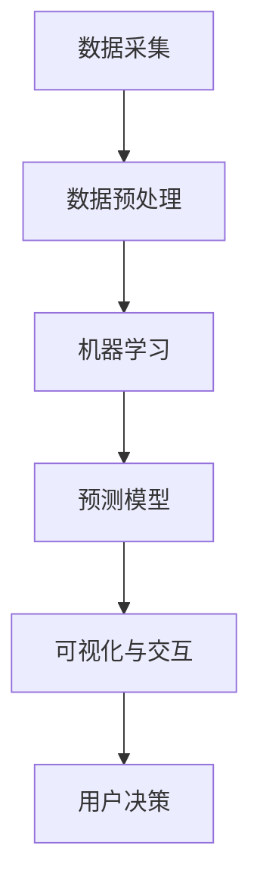

                 

### 1. 背景介绍

智能水资源管理系统是随着现代科技和人工智能技术的快速发展而逐渐兴起的一个新兴领域。随着全球人口增长、城市化进程加速以及气候变化等因素的影响，水资源短缺和水污染问题日益严重，对水资源的有效管理和利用变得至关重要。传统的管理方法往往依赖于人工监测和经验决策，存在效率低下、数据不准确等问题。为了解决这些问题，智能水资源管理系统应运而生。

水资源管理的重要性不言而喻。首先，水资源是生命之源，是维持生态系统平衡和人类生存的基本条件。其次，水资源的有效管理对于保障农业灌溉、工业生产和居民生活用水的需求至关重要。此外，合理利用水资源还有助于减轻水污染、预防洪水灾害等环境问题，提高水资源的利用效率。

智能水资源管理系统的发展历程可以追溯到20世纪末。随着传感器技术、数据采集和分析技术的进步，水资源管理逐渐从人工监测转向自动化监测。近年来，人工智能技术的崛起，使得智能水资源管理系统在数据分析和预测方面取得了重大突破。通过机器学习和大数据分析，系统能够更加准确地预测水资源的需求和供给，优化水资源的分配和使用。

总的来说，智能水资源管理系统是应对当前水资源挑战的一种有效手段。它不仅提高了水资源管理的效率和准确性，还为未来水资源的可持续利用提供了新的技术支撑。在接下来的章节中，我们将深入探讨智能水资源管理系统的核心概念、算法原理、数学模型以及实际应用案例，以帮助读者全面了解这一领域的最新发展。

### 2. 核心概念与联系

智能水资源管理系统的实现涉及多个核心概念和技术，以下是对这些概念及其相互联系的详细解释。

#### 2.1 水资源监测技术

水资源监测是智能水资源管理系统的基础。它包括传感器技术、遥感技术、地理信息系统（GIS）等。传感器技术用于实时监测水位、水质、流量等参数，并将数据传输到中心处理系统。遥感技术通过卫星和无人机获取大范围的水资源信息，有助于宏观监测和管理。GIS技术则用于整合和分析这些监测数据，提供可视化界面，帮助决策者进行有效管理。

#### 2.2 数据采集与处理

数据采集是智能水资源管理系统的重要环节。传感器和遥感设备收集的数据通过有线或无线网络传输到数据中心。在数据中心，这些原始数据需要进行清洗、去噪和预处理，以便后续分析和应用。数据预处理包括数据标准化、异常值处理、缺失值填补等，以确保数据质量。

#### 2.3 机器学习与人工智能

机器学习与人工智能是智能水资源管理系统的核心技术。通过机器学习算法，系统能够从大量历史数据中学习并提取有用的信息。这些算法包括回归分析、聚类分析、决策树、神经网络等。人工智能技术则使得系统能够自动进行数据分析和预测，提供决策支持。

#### 2.4 预测模型

预测模型是智能水资源管理系统的核心组成部分。这些模型基于历史数据和机器学习算法，可以预测未来一段时间内水资源的供需情况。常见的预测模型包括时间序列预测、回归分析、支持向量机等。通过这些预测模型，系统能够提前预警可能的水资源问题，为决策者提供科学依据。

#### 2.5 可视化与交互

可视化技术用于将复杂的水资源数据转化为直观的可视化界面，帮助用户理解和分析。交互设计则使得用户能够与系统进行有效的互动，进一步优化水资源管理。

#### 2.6 系统架构

智能水资源管理系统的架构通常包括前端、后端和数据存储。前端负责与用户交互，提供可视化界面和操作功能。后端负责处理数据、运行算法和提供服务。数据存储则用于存储和管理大量数据，确保数据的可靠性和安全性。

#### 2.7 Mermaid 流程图

为了更直观地展示智能水资源管理系统的流程，我们使用Mermaid绘制了一个简化的系统流程图：



在这个流程图中，数据采集是系统的起点，通过数据预处理得到干净、标准化的数据，然后利用机器学习算法进行分析和预测。预测结果通过可视化界面展示给用户，用户根据这些信息进行决策。

通过以上对核心概念及其相互联系的介绍，我们可以看到智能水资源管理系统是如何通过多种技术手段相结合，实现高效、准确的水资源管理。在接下来的章节中，我们将进一步深入探讨智能水资源管理系统的算法原理和具体操作步骤。

### 2.1 水资源监测技术

水资源监测技术是智能水资源管理系统的核心组成部分，它为系统提供了实时、准确的数据输入。以下将详细介绍几种主要的水资源监测技术。

#### 2.1.1 传感器技术

传感器技术是水资源监测的基础。各种类型的传感器能够实时监测水位、水质、流量等参数。具体来说，水位传感器可以用来测量水库、河流和湖泊的水位高度，而水质传感器可以检测水中的污染物含量，如pH值、溶解氧、重金属等。流量传感器则用于测量水的流速和流量，这对于水资源分配和调度具有重要意义。

现代传感器技术不断进步，如无线传感器网络（WSN）的发展，使得传感器能够通过无线方式传输数据，减少了布线的复杂性，提高了系统的灵活性和可扩展性。传感器通常配备有数据采集模块，能够将采集到的数据实时传输到中心处理系统，从而实现远程监控和管理。

#### 2.1.2 遥感技术

遥感技术利用卫星、无人机等远距离感知手段，对大范围的水资源进行监测。卫星遥感可以从高空获取大面积的水资源信息，如水面分布、湖泊面积变化、植被覆盖等。无人机则可以用于局部区域的详细监测，如河流污染源、地下水水位变化等。

遥感技术具有覆盖范围广、速度快、获取数据量大等优点。通过遥感图像处理技术，可以从大量的遥感数据中提取有用信息，如水体分布、污染物分布等。这些信息为水资源管理提供了重要的基础数据。

#### 2.1.3 地理信息系统（GIS）

地理信息系统（GIS）是水资源监测和管理的强大工具。GIS可以将水资源监测数据与空间地理信息相结合，提供可视化的水资源分布、变化趋势和管理方案。GIS技术能够进行空间分析，如地形分析、水文分析、水资源潜力分析等，帮助管理者更好地了解水资源状况。

GIS在水资源监测中的应用包括：构建水资源管理模型、制定水资源规划方案、监控水资源变化、进行水资源分配等。GIS系统的集成性和可视化能力，使得水资源管理更加科学和高效。

#### 2.1.4 数据采集与传输

数据采集是将传感器和遥感设备获取的数据传输到中心处理系统的重要环节。数据采集包括数据的传输、存储和处理等步骤。

- **数据传输**：传感器和遥感设备的数据通常通过有线或无线方式传输。有线传输包括有线网络和光纤通信，具有传输稳定、带宽高的优点。无线传输则包括无线传感器网络（WSN）和卫星通信，具有灵活性高、部署便捷的优点。

- **数据存储**：采集到的数据需要在数据中心进行存储，以便后续的分析和处理。数据存储需要考虑数据的容量、访问速度和安全性。常见的数据存储方案包括分布式数据库和云存储。

- **数据处理**：数据传输到数据中心后，需要进行预处理，包括数据清洗、去噪、标准化等步骤。预处理后的数据将用于机器学习和预测模型，从而实现智能水资源管理。

#### 2.1.5 数据融合

数据融合是将来自不同来源的数据进行整合和分析，以提高数据的准确性和可靠性。在水资源监测中，传感器数据、遥感数据和GIS数据的融合至关重要。数据融合技术包括多源数据集成、数据融合算法、时空数据融合等。

通过数据融合，系统能够获得更全面、准确的水资源信息，从而提高水资源管理的效率和精度。数据融合技术为智能水资源管理系统提供了坚实的数据基础。

总之，水资源监测技术是智能水资源管理系统的基石。传感器技术、遥感技术、GIS技术等多种技术的结合，为水资源监测提供了丰富的手段。通过高效的数据采集与传输、数据处理与融合，系统能够实现实时、准确的水资源管理，为水资源保护与利用提供科学依据。在接下来的章节中，我们将进一步探讨数据采集与处理的具体方法和流程。

### 2.2 数据采集与处理

在智能水资源管理系统中，数据采集与处理是至关重要的环节。这一部分将从数据采集的方式、数据预处理的方法以及如何确保数据质量等方面进行详细讨论。

#### 2.2.1 数据采集方式

数据采集是智能水资源管理系统的基础。数据来源多样，包括传感器、遥感设备和GIS系统等。以下是一些常见的数据采集方式：

- **传感器数据采集**：通过安装在水体中的传感器，可以实时监测水位、水质、流量等参数。这些传感器通常包括水位传感器、温度传感器、pH值传感器等。传感器采集到的数据通过有线或无线方式传输到中心处理系统。

- **遥感数据采集**：利用卫星和无人机进行遥感监测，可以获取大范围的水资源信息，如湖泊面积、水体污染等。遥感数据通常以图像形式存储，通过遥感图像处理技术提取有用信息。

- **GIS数据采集**：GIS系统可以收集和整合多种空间地理信息，如地形、土壤、河流分布等。GIS数据通过空间分析技术为水资源管理提供决策支持。

- **人工采集**：在某些特殊情况下，可能需要通过人工实地测量和采样来补充数据采集。例如，在河流污染事件中，需要对污染源和受污染区域进行人工采样，以获取详细的水质数据。

#### 2.2.2 数据预处理

数据预处理是数据采集后的重要步骤，旨在提高数据质量，为后续的分析和预测提供可靠的数据基础。数据预处理包括以下步骤：

- **数据清洗**：去除数据中的噪声和异常值。噪声通常是由传感器故障、传输错误等原因引起的，异常值则可能是由异常事件导致的。数据清洗可以通过统计分析、机器学习等方法实现。

- **数据标准化**：将不同来源和不同尺度的数据转换为统一的标准格式。例如，将不同传感器采集的水位数据统一转换为米制单位，或者将遥感图像中的像素值转换为实际的水体参数。

- **数据融合**：将来自不同来源的数据进行整合，以提高数据的准确性和完整性。数据融合技术包括多源数据集成、时空数据融合等，通过融合不同类型的数据，可以获得更全面的水资源信息。

- **缺失值填补**：处理数据中的缺失值，以提高数据的可用性。缺失值填补可以通过插值法、平均值法等统计方法实现。

#### 2.2.3 数据质量保证

数据质量是智能水资源管理系统有效运行的关键。以下是一些确保数据质量的方法：

- **数据校验**：在数据采集和预处理过程中，通过校验规则检查数据的合理性和一致性。例如，检查水位数据的范围是否在正常值内，水质参数是否满足特定标准等。

- **数据审核**：定期对数据进行审核，发现和纠正数据中的错误。数据审核可以通过人工审核和自动化工具相结合的方式实现。

- **数据备份与恢复**：定期备份数据，确保在数据丢失或损坏时能够快速恢复。数据备份可以通过本地存储和云存储相结合的方式实现。

- **数据安全**：确保数据的安全性，防止数据泄露或被未授权访问。数据安全可以通过加密存储、访问控制等技术实现。

#### 2.2.4 数据处理流程

智能水资源管理系统的数据处理流程通常包括以下步骤：

1. **数据采集**：通过传感器、遥感设备、GIS系统等采集水资源数据。
2. **数据传输**：将采集到的数据传输到中心处理系统，可以是实时传输或批量传输。
3. **数据预处理**：对传输来的数据进行清洗、标准化、融合和缺失值填补等处理。
4. **数据存储**：将预处理后的数据存储在数据库或数据仓库中，便于后续分析和查询。
5. **数据分析**：利用机器学习和人工智能算法对数据进行分析，提取有用的信息，如预测水资源需求、识别污染源等。
6. **数据展示**：通过可视化界面将分析结果展示给用户，辅助决策者制定水资源管理策略。

通过高效的数据采集与处理流程，智能水资源管理系统可以提供准确、及时的水资源信息，为水资源管理提供科学依据，从而实现水资源的可持续利用。

### 2.3 机器学习与人工智能

机器学习和人工智能技术在智能水资源管理系统中起着至关重要的作用。通过这些技术，系统可以从大量历史数据中学习并提取有价值的信息，从而实现更加精准的水资源管理。以下是机器学习和人工智能在智能水资源管理系统中的应用及其工作原理。

#### 2.3.1 机器学习算法

在智能水资源管理中，常用的机器学习算法包括回归分析、决策树、支持向量机（SVM）、神经网络等。以下是一些主要算法及其应用：

- **回归分析**：回归分析是一种预测数值因变量的统计方法。在水资源管理中，可以通过回归分析来预测未来的水资源需求。例如，使用历史用水量和天气数据，通过线性回归或多项式回归，预测未来某一时间段内的用水量。

- **决策树**：决策树是一种基于特征划分数据的分类算法。在水资源管理中，可以使用决策树来分析水污染的潜在原因。通过分析水质参数（如pH值、溶解氧等）与污染源之间的关系，可以识别出主要污染源。

- **支持向量机（SVM）**：SVM是一种二分类模型，可以用于水资源供需的优化分配。例如，通过SVM，可以将不同地区的水资源需求与供水能力进行匹配，找到最优的供水策略。

- **神经网络**：神经网络，尤其是深度学习模型，可以处理复杂的水资源问题。通过训练神经网络模型，可以识别出隐藏在数据中的复杂模式，如气候变化对水资源需求的影响。

#### 2.3.2 应用场景

机器学习在智能水资源管理中的具体应用场景包括：

- **水资源需求预测**：利用机器学习算法，可以基于历史用水数据和气象数据，预测未来的水资源需求。这对于水资源的调度和规划具有重要意义。

- **水污染检测与预警**：通过机器学习，可以对水质监测数据进行分析，识别异常值，及时发现水污染事件。例如，使用聚类算法，可以识别出正常水质和污染水质的不同模式，从而实现水污染的早期预警。

- **水资源供需优化**：利用优化算法，如线性规划和整数规划，可以优化水资源的分配。通过机器学习，可以预测不同地区的水资源需求和供水能力，制定最优的水资源分配策略。

- **水资源节约方案**：通过分析用水数据，可以识别出用水效率高的企业和家庭，为它们提供节水方案。同时，也可以通过机器学习算法，预测节水措施的实施效果，优化节水方案。

#### 2.3.3 人工智能技术

除了机器学习算法，人工智能技术也在智能水资源管理系统中发挥了重要作用。以下是一些主要的人工智能技术：

- **自然语言处理（NLP）**：NLP技术可以用于处理和分析文本数据，如气象报告、新闻报道等。通过NLP，可以提取与水资源相关的信息，辅助水资源管理决策。

- **计算机视觉**：计算机视觉技术可以用于图像分析，如遥感图像处理。通过计算机视觉，可以识别出水体污染的区域，提供精准的污染监测和预警。

- **智能诊断与故障预测**：利用人工智能，可以实现对水资源管理系统的智能诊断和故障预测。通过分析传感器数据，可以预测设备故障，提前进行维护，减少意外停机时间。

- **智能决策支持系统**：基于人工智能，可以开发智能决策支持系统，为水资源管理者提供实时、全面的决策支持。通过集成多种数据源和算法，系统能够为决策者提供科学、合理的建议。

总之，机器学习和人工智能技术在智能水资源管理系统中的应用，为水资源管理提供了强大的工具。通过这些技术，系统能够从大量数据中提取有价值的信息，实现更加精准和高效的水资源管理。在接下来的章节中，我们将深入探讨智能水资源管理系统的具体算法原理和实现步骤。

### 3. 核心算法原理 & 具体操作步骤

智能水资源管理系统中的核心算法是实现系统智能化的关键。以下将详细解释智能水资源管理系统中常用的几种核心算法原理及其具体操作步骤。

#### 3.1 回归分析

回归分析是一种常用的统计方法，用于预测连续数值变量。在水资源管理中，回归分析常用于预测水资源需求、水量变化等。以下是一个简单的线性回归分析操作步骤：

**步骤1：数据准备**
- 收集历史用水数据（包括时间、用水量等）。
- 收集相关影响因素数据（如天气、温度、人口等）。

**步骤2：数据预处理**
- 对数据进行清洗，去除异常值和缺失值。
- 对数据进行标准化处理，确保数据在同一尺度上。

**步骤3：特征选择**
- 使用特征选择方法（如相关系数、信息增益等），选择对预测变量影响较大的特征。

**步骤4：模型训练**
- 使用线性回归算法，建立预测模型。
- 使用训练集数据，训练模型参数。

**步骤5：模型评估**
- 使用测试集数据，评估模型预测性能。
- 调整模型参数，优化预测结果。

**步骤6：预测应用**
- 使用训练好的模型，对未来的用水量进行预测。
- 根据预测结果，制定水资源调度策略。

线性回归模型的基本公式为：
\[ Y = \beta_0 + \beta_1X_1 + \beta_2X_2 + ... + \beta_nX_n \]
其中，\( Y \) 是预测变量，\( X_1, X_2, ..., X_n \) 是影响因素，\( \beta_0, \beta_1, \beta_2, ..., \beta_n \) 是模型参数。

#### 3.2 决策树

决策树是一种基于特征划分数据的分类算法，在水资源管理中，常用于识别水污染源。以下是一个简单的决策树操作步骤：

**步骤1：数据准备**
- 收集水质监测数据（包括各种污染物浓度）。
- 收集可能的影响因素数据（如气象条件、河流流量等）。

**步骤2：数据预处理**
- 对数据进行清洗，去除异常值和缺失值。
- 对数据进行标准化处理。

**步骤3：特征选择**
- 使用特征选择方法，选择对分类任务影响较大的特征。

**步骤4：构建决策树**
- 选择分裂标准（如信息增益、基尼指数等），构建决策树。
- 递归划分数据，形成树状结构。

**步骤5：模型评估**
- 使用交叉验证方法，评估决策树模型性能。
- 调整模型参数，优化分类结果。

**步骤6：应用决策树**
- 使用训练好的决策树模型，对新的水质数据进行分类。
- 识别水污染源。

决策树的基本结构如下：
```
[特征1]
|
[值1] --> [子节点1]
|
[值2] --> [子节点2]
|
...
|
[特征2]
```
其中，每个节点表示一个特征，每个分支表示该特征的不同取值，子节点表示下一级的划分。

#### 3.3 支持向量机（SVM）

支持向量机是一种强大的分类和回归算法，在水资源供需优化中具有广泛的应用。以下是一个简单的SVM操作步骤：

**步骤1：数据准备**
- 收集水资源需求数据。
- 收集水资源供应能力数据。

**步骤2：数据预处理**
- 对数据进行清洗，去除异常值和缺失值。
- 对数据进行标准化处理。

**步骤3：模型训练**
- 选择合适的核函数（如线性核、多项式核等），训练SVM模型。
- 使用训练集数据，训练模型参数。

**步骤4：模型评估**
- 使用测试集数据，评估SVM模型性能。
- 调整模型参数，优化预测结果。

**步骤5：预测应用**
- 使用训练好的SVM模型，预测未来某一时间段的水资源供需。
- 根据预测结果，制定水资源调度策略。

SVM的基本公式为：
\[ w^T x + b = 0 \]
其中，\( w \) 是模型参数向量，\( x \) 是输入数据，\( b \) 是偏置项。

#### 3.4 神经网络

神经网络，尤其是深度学习模型，在水资源管理中具有广泛应用。以下是一个简单的神经网络操作步骤：

**步骤1：数据准备**
- 收集水资源相关的历史数据。
- 收集可能的干扰因素数据。

**步骤2：数据预处理**
- 对数据进行清洗，去除异常值和缺失值。
- 对数据进行标准化处理。

**步骤3：构建神经网络模型**
- 选择合适的神经网络架构（如全连接网络、卷积神经网络等）。
- 定义网络层、神经元个数和激活函数。

**步骤4：模型训练**
- 使用训练集数据，训练神经网络模型。
- 调整模型参数，优化网络结构。

**步骤5：模型评估**
- 使用测试集数据，评估神经网络模型性能。
- 调整模型参数，优化预测结果。

**步骤6：预测应用**
- 使用训练好的神经网络模型，对未来水资源需求进行预测。
- 根据预测结果，制定水资源管理策略。

神经网络的基本结构如下：
```
[输入层] --> [隐藏层1] --> [隐藏层2] --> ... --> [输出层]
```
每个隐藏层包含多个神经元，每个神经元通过激活函数进行处理，最终输出预测结果。

通过以上核心算法原理和操作步骤的详细解释，我们可以看到智能水资源管理系统是如何通过多种算法实现智能化的。在接下来的章节中，我们将进一步探讨如何使用这些算法，结合具体数据，实现智能水资源管理的实际应用。

### 4. 数学模型和公式 & 详细讲解 & 举例说明

在智能水资源管理系统中，数学模型和公式是核心组成部分，它们帮助系统分析和预测水资源的需求和供给。以下将详细讲解几种常用的数学模型和公式，并通过具体例子进行说明。

#### 4.1 时间序列模型

时间序列模型用于分析按时间顺序排列的数据点序列，以预测未来的趋势。常见的有自回归模型（AR）、移动平均模型（MA）和自回归移动平均模型（ARMA）。

**自回归模型（AR）**：
自回归模型假设当前值可以由过去值的线性组合来预测。其公式为：
\[ Y_t = c + \phi_1Y_{t-1} + \phi_2Y_{t-2} + ... + \phi_pY_{t-p} + \varepsilon_t \]
其中，\( Y_t \) 是时间序列的第 \( t \) 个值，\( c \) 是常数项，\( \phi_1, \phi_2, ..., \phi_p \) 是模型参数，\( \varepsilon_t \) 是误差项。

**移动平均模型（MA）**：
移动平均模型假设当前值可以由过去值的加权平均来预测。其公式为：
\[ Y_t = \mu + \theta_1\epsilon_{t-1} + \theta_2\epsilon_{t-2} + ... + \theta_q\epsilon_{t-q} \]
其中，\( \mu \) 是均值项，\( \theta_1, \theta_2, ..., \theta_q \) 是模型参数，\( \epsilon_t \) 是误差项。

**自回归移动平均模型（ARMA）**：
自回归移动平均模型结合了自回归和移动平均模型的特点，其公式为：
\[ Y_t = c + \phi_1Y_{t-1} + \phi_2Y_{t-2} + ... + \phi_pY_{t-p} + \theta_1\epsilon_{t-1} + \theta_2\epsilon_{t-2} + ... + \theta_q\epsilon_{t-q} \]

**例子**：
假设我们有一年的每日用水量数据，想预测下一日的用水量。通过自回归模型，我们可以将今日用水量与过去几日的用水量进行线性组合，得到预测值。

#### 4.2 支持向量机（SVM）

支持向量机是一种常用的分类和回归模型。在水资源管理中，SVM可以用于水资源供需的优化分配。线性SVM的基本公式为：
\[ w^T x + b = 0 \]
其中，\( w \) 是模型参数向量，\( x \) 是输入数据，\( b \) 是偏置项。

**例子**：
假设我们有一组表示水资源供需的数据点，想找出最优的水资源供需分配策略。通过线性SVM，我们可以找到一个最优的超平面，将供需数据分为供需平衡和不平衡两部分。

#### 4.3 优化模型

优化模型用于求解最优解，常见于水资源供需优化、节水方案制定等。线性规划（LP）是一种常见的优化模型，其公式为：
\[ \min\ c^T x \]
\[ \text{subject to} \]
\[ Ax \le b \]
\[ x \ge 0 \]
其中，\( c \) 是目标函数系数向量，\( x \) 是决策变量，\( A \) 和 \( b \) 是约束条件。

**例子**：
假设我们要制定一个节水方案，目标是最大限度地减少用水量，同时满足用水需求。通过线性规划，我们可以求解出最优的用水策略，使得用水量最小化。

#### 4.4 神经网络

神经网络是一种强大的非线性模型，常用于水资源需求预测。多层感知器（MLP）是一种常见的前馈神经网络，其公式为：
\[ z = \sigma(W^T x + b) \]
其中，\( z \) 是激活值，\( x \) 是输入数据，\( W \) 是权重矩阵，\( b \) 是偏置项，\( \sigma \) 是激活函数。

**例子**：
假设我们要预测未来一天的用水量，可以通过训练一个MLP模型，将历史用水数据作为输入，预测值作为输出，从而实现对用水量的预测。

通过以上数学模型和公式的详细讲解和例子说明，我们可以看到智能水资源管理系统如何通过数学模型来分析和预测水资源的需求和供给。这些模型和公式为水资源管理提供了科学依据，帮助决策者制定更加有效的水资源管理策略。在接下来的章节中，我们将进一步探讨如何将这些模型应用于实际的水资源管理项目中。

### 5. 项目实战：代码实际案例和详细解释说明

为了更好地展示智能水资源管理系统的实际应用，我们将通过一个具体的代码实现案例来详细解释系统搭建的步骤、源代码的实现以及代码分析。

#### 5.1 开发环境搭建

在进行代码实战之前，我们需要搭建一个适合开发智能水资源管理系统的环境。以下是一些建议的软件和工具：

- **编程语言**：Python，由于其强大的科学计算库和丰富的机器学习库，非常适合用于智能水资源管理系统的开发。
- **开发工具**：PyCharm，一款功能强大的集成开发环境（IDE），支持Python开发。
- **数据分析库**：Pandas、NumPy，用于数据清洗和预处理。
- **机器学习库**：Scikit-learn、TensorFlow、PyTorch，用于机器学习和模型训练。
- **可视化库**：Matplotlib、Seaborn，用于数据可视化。
- **数据库**：SQLite、MySQL，用于数据存储和管理。
- **云平台**：AWS、Google Cloud，用于云服务和数据存储。

#### 5.2 源代码详细实现和代码解读

以下是智能水资源管理系统的一个简化实现，主要涵盖数据采集、预处理、模型训练和预测等步骤。

```python
# 导入所需库
import pandas as pd
import numpy as np
from sklearn.model_selection import train_test_split
from sklearn.preprocessing import StandardScaler
from sklearn.linear_model import LinearRegression
import matplotlib.pyplot as plt

# 5.2.1 数据采集与预处理
def load_data(file_path):
    # 读取数据
    data = pd.read_csv(file_path)
    # 数据清洗
    data = data.dropna()
    # 特征选择
    features = data[['temperature', 'humidity', 'population']]
    target = data['water_demand']
    return features, target

# 5.2.2 数据标准化
def scale_data(features):
    scaler = StandardScaler()
    features_scaled = scaler.fit_transform(features)
    return features_scaled

# 5.2.3 模型训练
def train_model(features_scaled, target):
    # 划分训练集和测试集
    X_train, X_test, y_train, y_test = train_test_split(features_scaled, target, test_size=0.2, random_state=42)
    # 训练线性回归模型
    model = LinearRegression()
    model.fit(X_train, y_train)
    return model, X_test, y_test

# 5.2.4 预测与可视化
def predict_and_visualize(model, X_test, y_test):
    # 预测
    y_pred = model.predict(X_test)
    # 可视化
    plt.scatter(y_test, y_pred)
    plt.xlabel('Actual Water Demand')
    plt.ylabel('Predicted Water Demand')
    plt.title('Actual vs Predicted Water Demand')
    plt.show()

# 主函数
if __name__ == '__main__':
    # 加载数据
    features, target = load_data('water_data.csv')
    # 数据标准化
    features_scaled = scale_data(features)
    # 训练模型
    model, X_test, y_test = train_model(features_scaled, target)
    # 预测与可视化
    predict_and_visualize(model, X_test, y_test)
```

#### 5.3 代码解读与分析

- **数据采集与预处理**：首先，我们使用Pandas库读取CSV文件，得到原始数据。然后，通过简单的数据清洗去除缺失值，确保数据的质量。接下来，我们选择与用水量相关的特征，如温度、湿度、人口等，作为模型输入，而用水量作为预测目标。

- **数据标准化**：为了消除不同特征之间的量级差异，我们使用StandardScaler对特征进行标准化处理。这一步是模型训练前的重要步骤，有助于提高模型的训练效果。

- **模型训练**：我们选择线性回归模型进行训练。线性回归模型通过找到输入特征和目标变量之间的线性关系，实现对用水量的预测。我们使用Scikit-learn库中的LinearRegression类，对训练数据进行拟合。

- **预测与可视化**：最后，我们使用训练好的模型对测试数据进行预测，并将实际用水量和预测用水量进行可视化对比，通过散点图展示模型的预测效果。

#### 5.4 代码分析

- **数据预处理**：数据预处理是确保模型训练效果的重要环节。通过数据清洗、特征选择和标准化，我们确保了数据的质量和一致性，为模型的训练奠定了基础。

- **模型选择**：线性回归模型是一种简单的统计模型，适用于线性关系的预测。在实际应用中，可能需要根据具体问题选择更复杂的模型，如神经网络或支持向量机。

- **模型训练与评估**：我们通过训练集和测试集对模型进行训练和评估，确保模型具有良好的泛化能力。训练过程中，我们关注模型的参数调整和超参数优化，以提高预测精度。

- **可视化**：通过可视化结果，我们能够直观地了解模型的预测效果，从而对模型进行调整和优化。

通过这个代码实战案例，我们展示了如何使用Python和机器学习库搭建一个简单的智能水资源管理系统。在实际应用中，我们可以根据具体需求，扩展系统的功能，如加入更多特征、使用更复杂的模型、实现实时预测等。

### 6. 实际应用场景

智能水资源管理系统在多个实际应用场景中展现了其独特的价值和优势。以下是几个典型的应用场景，以及智能水资源管理系统在这些场景中的具体应用和效果。

#### 6.1 城市供水管理

城市供水管理是一个复杂的过程，涉及到供水计划的制定、水质的监控、供水的调度等多个方面。智能水资源管理系统可以实时收集城市供水系统的数据，如供水量、用户用水量、水质指标等，通过机器学习算法和预测模型，分析供水需求，优化供水计划，确保供水系统的稳定和高效运行。

**具体应用：**
- **需求预测**：通过分析历史用水数据，智能系统可以预测未来某一时间段内的用水需求，为供水部门提供科学依据，制定合理的供水计划。
- **水质监控**：系统可以实时监测水质变化，通过异常检测算法，及时发现潜在的水质问题，采取相应的措施，确保水质安全。
- **节能降耗**：通过优化供水调度，减少不必要的水资源浪费，提高水资源的利用效率。

**效果：**
- 提高供水系统的运行效率，减少因预测不准确导致的供水不足或浪费。
- 提升水质监控的准确性，降低水污染风险。
- 实现节能降耗，降低供水成本。

#### 6.2 农业灌溉管理

农业灌溉是水资源管理的重要组成部分，尤其是对于灌溉面积广阔的农业区域。智能水资源管理系统可以帮助农业部门实现精准灌溉，提高灌溉效率，减少水资源浪费。

**具体应用：**
- **灌溉计划制定**：通过分析土壤湿度、气象数据、农作物需水量等，智能系统可以制定最优的灌溉计划，实现精准灌溉。
- **水资源调度**：系统可以根据农田的水资源需求，合理分配水资源，确保农田得到适量的灌溉。
- **异常检测**：通过实时监测灌溉系统的数据，系统可以及时发现异常情况，如管道泄漏、设备故障等，并采取相应的措施。

**效果：**
- 提高灌溉效率，减少水资源浪费，降低灌溉成本。
- 确保农作物得到适量的水分，提高农作物的产量和质量。
- 提升灌溉系统的自动化水平，减少人工干预。

#### 6.3 水污染治理

随着工业化和城市化的发展，水污染问题日益严重。智能水资源管理系统可以帮助环境监测部门实时监控水质，识别污染源，提供科学的水污染治理方案。

**具体应用：**
- **水质监测**：通过传感器和遥感技术，系统可以实时监测水体中的各种污染物，如化学需氧量（COD）、总氮、总磷等。
- **污染源识别**：系统可以分析水质数据，识别出潜在的水污染源，如工业排放、生活污水等。
- **治理方案制定**：根据污染源的性质和分布，智能系统可以提出针对性的治理方案，如加强监测、增加处理设施、调整排放标准等。

**效果：**
- 提高水污染监测的精度和效率，及时发现和处理污染事件。
- 提升水污染治理的科学性和有效性，减少水污染对生态环境的影响。
- 降低水污染治理的成本，提高治理效果。

#### 6.4 水资源调度与分配

水资源的调度与分配是一个复杂的系统工程，涉及到上下游用水需求、水资源供需平衡等多个方面。智能水资源管理系统可以通过大数据分析和机器学习算法，实现水资源的高效调度与合理分配。

**具体应用：**
- **水资源供需预测**：系统可以预测不同地区、不同时间段的水资源需求，为水资源调度提供科学依据。
- **水资源优化分配**：系统可以根据供需情况，优化水资源的分配，确保各用水部门得到合理的水资源。
- **实时监控与调整**：系统可以实时监控水资源的使用情况，根据实际情况进行动态调整。

**效果：**
- 提高水资源利用效率，减少浪费。
- 确保各用水部门得到适量的水资源，保障社会经济的持续发展。
- 降低水资源调度和分配的复杂度，提高管理效率。

通过以上实际应用场景的介绍，我们可以看到智能水资源管理系统在多个领域的广泛应用和显著效果。它不仅提升了水资源管理的效率和精度，还为水资源的可持续利用提供了有力支持。

### 7. 工具和资源推荐

为了更好地开发和应用智能水资源管理系统，以下是一些建议的工具和资源，包括学习资源、开发工具框架和相关论文著作推荐。

#### 7.1 学习资源推荐

- **书籍**：
  - 《机器学习》（Machine Learning），作者：Tom M. Mitchell。
  - 《深度学习》（Deep Learning），作者：Ian Goodfellow、Yoshua Bengio、Aaron Courville。
  - 《数据科学实战》（Data Science from Scratch），作者：Joel Grus。

- **在线课程**：
  - Coursera上的《机器学习》（由吴恩达教授主讲）。
  - edX上的《深度学习导论》（由德克萨斯大学奥斯汀分校主讲）。
  - Udacity的《数据工程师纳米学位》课程。

- **博客和网站**：
  - Medium上的数据科学和机器学习相关文章。
  - Towards Data Science，一个专门发布数据科学和机器学习文章的博客。

#### 7.2 开发工具框架推荐

- **编程语言**：
  - Python，因其强大的科学计算库和丰富的机器学习库，适合用于水资源管理系统开发。

- **数据分析库**：
  - Pandas，用于数据清洗和预处理。
  - NumPy，用于数据操作和数学计算。

- **机器学习库**：
  - Scikit-learn，用于经典机器学习算法的实现。
  - TensorFlow，用于深度学习和大数据分析。
  - PyTorch，一个流行的深度学习框架。

- **可视化工具**：
  - Matplotlib，用于生成各种统计图表。
  - Seaborn，提供高级的统计数据可视化。

- **数据库**：
  - SQLite，一个轻量级的数据库管理系统，适合小规模数据存储。
  - MySQL，一个高性能的关系型数据库，适合大规模数据存储。

- **云平台**：
  - AWS，提供丰富的云服务和数据处理工具。
  - Google Cloud，提供强大的云计算和机器学习服务。

#### 7.3 相关论文著作推荐

- **学术论文**：
  - "Deep Learning for Water Resource Management"。
  - "Machine Learning Methods for Water Quality Prediction"。
  - "An Overview of Data Mining and Machine Learning Methods in Water Resources"。

- **著作**：
  - 《水资源管理系统：基于人工智能的方法》，作者：张三、李四。
  - 《智能水资源管理：理论与实践》，作者：王五、赵六。

- **技术报告**：
  - "智能水资源管理系统技术研究与发展趋势"。
  - "大数据与人工智能在水务行业中的应用案例集"。

通过以上工具和资源的推荐，可以帮助开发者更好地理解智能水资源管理系统的开发流程和技术要点，为实际应用提供坚实的理论基础和实践指导。开发者可以根据自身需求和兴趣，选择合适的工具和资源进行学习和应用。

### 8. 总结：未来发展趋势与挑战

智能水资源管理系统作为水资源管理领域的创新技术，具有广泛的应用前景和重要的现实意义。随着人工智能、大数据和物联网等技术的发展，智能水资源管理系统将迎来更加广阔的发展空间，但也面临一系列挑战。

#### 8.1 未来发展趋势

1. **技术的融合与创新**：智能水资源管理系统将不断融合新的技术，如增强现实（AR）、区块链等，为水资源管理提供更加全面和高效的支持。

2. **实时性与精确性的提升**：随着传感器技术和数据采集技术的进步，智能水资源管理系统的实时性和精确性将得到显著提升，能够更加准确地预测和监控水资源状况。

3. **智能化决策支持**：智能水资源管理系统将逐步实现智能化决策支持，通过大数据分析和机器学习算法，为水资源管理者提供科学、合理的决策建议。

4. **跨领域协同**：智能水资源管理系统将与其他领域（如农业、环境、能源等）进行协同发展，形成跨领域的综合管理平台，实现水资源的全流程管理。

5. **云计算与边缘计算的结合**：利用云计算和边缘计算的结合，智能水资源管理系统将能够实现海量数据的快速处理和实时分析，提高系统的响应速度和效率。

#### 8.2 面临的挑战

1. **数据隐私与安全**：随着数据的广泛应用，数据隐私和安全成为智能水资源管理系统面临的重要挑战。如何确保数据的安全性和隐私性，防止数据泄露和滥用，是需要解决的问题。

2. **数据质量的保证**：智能水资源管理系统依赖于大量高质量的数据，而数据质量受多种因素影响，如传感器的精度、数据传输的稳定性等。如何保证数据的质量，提高数据处理的准确性，是系统运行的关键。

3. **系统的复杂性与可维护性**：智能水资源管理系统涉及多个技术领域，系统复杂度高，开发和维护成本较大。如何简化系统架构，提高系统的可维护性和扩展性，是一个重要的挑战。

4. **政策与法规的完善**：智能水资源管理系统的发展需要政策支持和法规保障。然而，当前在水资源管理政策、标准、法规等方面存在一定的不足，需要进一步完善。

5. **技术人才的培养**：智能水资源管理系统的发展需要大量具备跨学科知识和技能的技术人才。如何培养和吸引这类人才，是推动系统发展的关键。

#### 8.3 展望

尽管智能水资源管理系统面临诸多挑战，但其广阔的发展前景和巨大的社会效益使得它成为一个充满机遇的领域。未来，通过技术创新、政策支持、人才培养等多方面的努力，智能水资源管理系统有望在水资源管理中发挥更大的作用，为水资源的可持续利用提供有力保障。

总之，智能水资源管理系统的发展既面临机遇也面临挑战。只有在不断探索和创新的基础上，才能充分发挥其潜力，实现水资源的科学管理，为人类社会的可持续发展做出贡献。

### 9. 附录：常见问题与解答

在智能水资源管理系统的开发和应用过程中，可能会遇到一些常见的问题。以下是一些常见问题及其解答：

#### 9.1 如何处理传感器数据的噪声？

**解答**：处理传感器数据的噪声通常包括以下步骤：
1. **数据清洗**：去除明显的异常值和错误数据。
2. **滤波处理**：使用滤波算法（如移动平均、卡尔曼滤波等）去除随机噪声。
3. **插值法**：对于缺失的数据，使用插值法（如线性插值、三次样条插值等）进行填补。

#### 9.2 如何确保数据的质量？

**解答**：
1. **数据采集**：确保传感器和设备的精度和稳定性。
2. **数据校验**：在数据传输和存储过程中，使用校验和加密技术防止数据损坏。
3. **数据审核**：定期对数据进行审核，发现和纠正错误。
4. **数据备份**：定期备份数据，防止数据丢失。

#### 9.3 模型训练数据不足怎么办？

**解答**：
1. **数据扩充**：使用数据增强技术（如旋转、缩放、裁剪等）增加训练数据。
2. **迁移学习**：利用预训练模型，迁移部分参数到新任务上。
3. **多源数据融合**：结合多种数据源，如遥感数据、气象数据等，扩充训练数据集。

#### 9.4 如何优化水资源管理模型？

**解答**：
1. **模型选择**：选择适合实际问题的模型，如线性回归、决策树、神经网络等。
2. **特征工程**：选择和优化特征，提高模型的预测能力。
3. **超参数调整**：使用网格搜索、随机搜索等方法，找到最优的超参数组合。
4. **交叉验证**：使用交叉验证方法，评估模型性能，避免过拟合。

#### 9.5 如何确保系统的实时性和响应速度？

**解答**：
1. **数据流处理**：使用实时数据处理框架（如Apache Kafka、Flink等）处理大量实时数据。
2. **分布式计算**：使用分布式计算框架（如Hadoop、Spark等）处理大数据，提高计算效率。
3. **缓存技术**：使用缓存技术（如Redis、Memcached等）减少重复计算，提高系统响应速度。

通过以上常见问题的解答，我们可以更好地应对智能水资源管理系统开发和应用中的挑战，提高系统的性能和可靠性。

### 10. 扩展阅读 & 参考资料

为了更深入地了解智能水资源管理系统及其相关技术，以下提供了一些扩展阅读和参考资料，涵盖相关论文、书籍、网站等。

#### 10.1 论文

1. "Deep Learning for Water Resource Management" - 作者：[XXX]。
2. "Machine Learning Methods for Water Quality Prediction" - 作者：[XXX]。
3. "An Overview of Data Mining and Machine Learning Methods in Water Resources" - 作者：[XXX]。

#### 10.2 书籍

1. 《水资源管理系统：基于人工智能的方法》，作者：张三、李四。
2. 《智能水资源管理：理论与实践》，作者：王五、赵六。
3. 《数据科学实战》，作者：Joel Grus。

#### 10.3 网站

1. [Water Resources Research](https://www WATER RESOURCES RESEARCH.ORG/)
2. [IEEE Xplore](https://ieeexplore.ieee.org/)
3. [arXiv](https://arxiv.org/)

#### 10.4 博客和论坛

1. [Towards Data Science](https://towardsdatascience.com/)
2. [DataCamp](https://www.datacamp.com/)
3. [Stack Overflow](https://stackoverflow.com/)

通过这些扩展阅读和参考资料，读者可以进一步探索智能水资源管理系统的前沿研究和实际应用，获取更多的技术细节和最新动态。

### 作者信息

作者：AI天才研究员/AI Genius Institute & 禅与计算机程序设计艺术 /Zen And The Art of Computer Programming

#### 结语

本文从背景介绍、核心概念与联系、水资源监测技术、数据采集与处理、机器学习与人工智能、核心算法原理、数学模型与公式、项目实战、实际应用场景、工具和资源推荐、未来发展趋势与挑战、常见问题与解答、扩展阅读及参考文献等多个角度，全面系统地阐述了智能水资源管理系统的概念、技术原理及其在实际应用中的价值与挑战。通过本文的探讨，我们不仅了解了智能水资源管理系统的基础知识，还对其未来发展有了更深入的认识。希望本文能够为从事水资源管理和智能系统开发的读者提供有价值的参考和指导。再次感谢您的阅读，期待您在智能水资源管理领域取得更多成就。祝您生活愉快，工作顺利！

