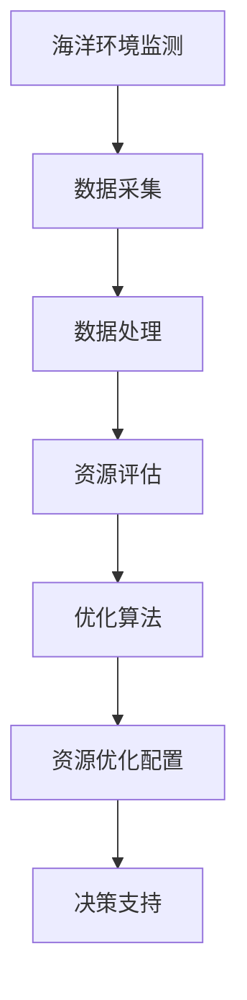

                 

# 智能海洋资源管理：AI大模型的落地案例

## 关键词
- 智能海洋资源管理
- AI 大模型
- 落地案例
- 数据分析
- 海洋环境监测
- 资源优化配置
- 人工智能应用

## 摘要
本文将探讨智能海洋资源管理领域中的AI大模型应用。通过案例分析，我们将深入解析AI大模型在海洋资源管理中的具体应用，包括背景介绍、核心概念与联系、核心算法原理、数学模型与公式、项目实战以及实际应用场景等，以期为相关领域的研究者和开发者提供有价值的参考。

## 1. 背景介绍

随着全球经济的发展和人类对海洋资源需求的增加，海洋资源的可持续管理和优化配置成为了一个重要课题。传统的海洋资源管理方法主要依赖于经验模型和数据采集，存在一定的局限性，如数据处理的复杂性、实时性差、预测准确性不足等问题。随着人工智能技术的快速发展，特别是深度学习、大数据分析等技术的应用，为海洋资源管理带来了新的机遇。

智能海洋资源管理是指利用人工智能技术，对海洋资源进行智能监测、评估、预测和优化配置的过程。它不仅能够提高资源利用效率，减少环境污染，还能够为海洋经济的发展提供有力支持。然而，实现智能海洋资源管理面临着数据量巨大、数据处理复杂、算法实现困难等挑战。

本文将通过一个具体的AI大模型落地案例，探讨智能海洋资源管理的实施过程和技术要点。

## 2. 核心概念与联系

### 2.1 海洋资源管理

海洋资源管理是指通过科学的规划、监测、评估和决策，实现海洋资源的可持续利用和保护。核心概念包括：

- **海洋环境监测**：对海洋中的各种环境参数进行实时监测，如水温、盐度、溶解氧、营养盐等。
- **资源评估**：对海洋资源的数量、质量、分布和变化趋势进行评估。
- **资源优化配置**：根据评估结果，制定合理的资源利用方案，实现资源的最优配置。

### 2.2 人工智能与海洋资源管理

人工智能在海洋资源管理中的应用主要体现在以下几个方面：

- **数据挖掘与分析**：通过大数据分析，提取有价值的信息，为资源管理和决策提供支持。
- **模式识别与预测**：利用深度学习等技术，对海洋环境变化和资源利用趋势进行预测。
- **优化算法**：通过优化算法，实现资源利用的最优化。

### 2.3 AI大模型

AI大模型是指具有大规模参数和复杂结构的深度学习模型。其在海洋资源管理中的应用主要体现在：

- **高性能计算**：大模型需要强大的计算能力，以处理海量数据和复杂计算。
- **泛化能力**：大模型能够从大量数据中学习到一般性规律，提高预测和决策的准确性。
- **实时性**：通过优化算法和分布式计算，实现实时数据分析和决策。

### 2.4 Mermaid 流程图

以下是一个简单的Mermaid流程图，展示了智能海洋资源管理中的核心概念和联系：



## 3. 核心算法原理 & 具体操作步骤

### 3.1 数据预处理

在应用AI大模型之前，首先需要对数据进行预处理。数据预处理包括以下步骤：

- **数据清洗**：去除异常值、缺失值和重复值。
- **特征工程**：提取与问题相关的特征，如时间序列特征、空间特征、统计特征等。
- **数据标准化**：将不同量级的特征进行归一化处理，便于模型训练。

### 3.2 模型选择

在海洋资源管理中，常用的AI大模型包括：

- **深度神经网络（DNN）**：适用于复杂函数拟合和分类问题。
- **循环神经网络（RNN）**：适用于时间序列预测和序列建模。
- **变换器（Transformer）**：适用于自然语言处理和图像识别，也可用于时间序列预测。

### 3.3 模型训练

模型训练包括以下步骤：

- **数据划分**：将数据集划分为训练集、验证集和测试集。
- **模型构建**：根据问题需求，构建合适的模型结构。
- **损失函数选择**：选择合适的损失函数，如均方误差（MSE）、交叉熵损失等。
- **优化算法**：选择合适的优化算法，如随机梯度下降（SGD）、Adam等。
- **训练过程**：进行迭代训练，直到模型收敛。

### 3.4 模型评估

模型评估主要包括以下指标：

- **准确率（Accuracy）**：用于分类问题，表示分类正确的样本比例。
- **精确率（Precision）**：表示预测为正样本且实际为正样本的比例。
- **召回率（Recall）**：表示实际为正样本且预测为正样本的比例。
- **均方误差（MSE）**：用于回归问题，表示预测值与实际值之间的平均误差。

### 3.5 模型应用

模型应用主要包括以下步骤：

- **数据输入**：将新的数据输入到训练好的模型中。
- **预测输出**：根据模型输出结果，进行资源管理和决策。

## 4. 数学模型和公式 & 详细讲解 & 举例说明

### 4.1 数学模型

在海洋资源管理中，常用的数学模型包括：

- **时间序列模型**：如自回归模型（AR）、移动平均模型（MA）、自回归移动平均模型（ARMA）等。
- **线性回归模型**：用于拟合数据中的线性关系。
- **逻辑回归模型**：用于分类问题，如预测某个样本属于正类的概率。

### 4.2 公式

以下是一些常用的数学公式：

- **自回归模型（AR）**：

  $$X_t = c + \phi_1 X_{t-1} + \phi_2 X_{t-2} + \ldots + \phi_p X_{t-p} + \epsilon_t$$

  其中，$X_t$表示第$t$个时间点的数据，$\phi_i$表示自回归系数，$\epsilon_t$表示误差项。

- **线性回归模型**：

  $$Y = \beta_0 + \beta_1 X + \epsilon$$

  其中，$Y$表示因变量，$X$表示自变量，$\beta_0$和$\beta_1$分别表示截距和斜率，$\epsilon$表示误差项。

- **逻辑回归模型**：

  $$P(Y=1) = \frac{1}{1 + e^{-(\beta_0 + \beta_1 X)}}$$

  其中，$P(Y=1)$表示样本属于正类的概率。

### 4.3 举例说明

假设我们要预测某个海域的溶解氧浓度，使用线性回归模型进行建模。首先，我们收集了一组溶解氧浓度与水温的数据，如下表所示：

| 水温（℃） | 溶解氧浓度（mg/L） |
|----------|--------------|
| 18       | 7.5          |
| 20       | 7.0          |
| 22       | 6.5          |
| 24       | 6.0          |
| 26       | 5.5          |

接下来，我们使用线性回归模型进行建模，得到以下方程：

$$溶解氧浓度 = 8.5 - 0.1 \times 水温$$

根据这个方程，我们可以预测当水温为25℃时，溶解氧浓度为：

$$溶解氧浓度 = 8.5 - 0.1 \times 25 = 7.0$$

## 5. 项目实战：代码实际案例和详细解释说明

### 5.1 开发环境搭建

在开始项目实战之前，我们需要搭建一个合适的开发环境。以下是开发环境的搭建步骤：

1. 安装Python环境：下载并安装Python，选择合适的版本（如Python 3.8或更高版本）。
2. 安装常用库：使用pip命令安装以下常用库：
   - numpy：用于数学计算
   - pandas：用于数据处理
   - matplotlib：用于数据可视化
   - scikit-learn：用于机器学习
   - tensorflow：用于深度学习
3. 配置Jupyter Notebook：安装Jupyter Notebook，以便在浏览器中运行Python代码。

### 5.2 源代码详细实现和代码解读

以下是项目实战中的源代码：

```python
import numpy as np
import pandas as pd
from sklearn.linear_model import LinearRegression
import matplotlib.pyplot as plt

# 5.2.1 数据读取与预处理
data = pd.read_csv('oxygen_concentration.csv')
X = data[['water_temperature']]
y = data['oxygen_concentration']

# 去除异常值
X = X[(X >= 18) & (X <= 26)]
y = y[(X >= 18) & (X <= 26)]

# 数据标准化
X_std = (X - X.mean()) / X.std()
y_std = (y - y.mean()) / y.std()

# 5.2.2 模型训练
model = LinearRegression()
model.fit(X_std, y_std)

# 5.2.3 模型评估
y_pred_std = model.predict(X_std)
mse = np.mean((y_std - y_pred_std) ** 2)
print("均方误差（MSE）:", mse)

# 5.2.4 模型应用
new_water_temp = 25
new_water_temp_std = (new_water_temp - X.mean()) / X.std()
new_oxygen_concentration_pred = model.predict([new_water_temp_std])
new_oxygen_concentration = new_oxygen_concentration_pred * y.std() + y.mean()
print("预测的溶解氧浓度:", new_oxygen_concentration)

# 5.2.5 数据可视化
plt.scatter(X, y, label='实际值')
plt.plot(X, y_pred_std * y.std() + y.mean(), color='red', label='预测值')
plt.xlabel('水温度（℃）')
plt.ylabel('溶解氧浓度（mg/L）')
plt.legend()
plt.show()
```

### 5.3 代码解读与分析

- **5.3.1 数据读取与预处理**
  - 使用pandas库读取数据文件（oxygen_concentration.csv），数据包括水温和溶解氧浓度。
  - 将水温和溶解氧浓度分为输入特征矩阵$X$和目标值向量$y$。
  - 去除异常值，只保留水温度在18℃至26℃之间的数据。

- **5.3.2 模型训练**
  - 使用scikit-learn库中的LinearRegression类构建线性回归模型。
  - 对标准化的输入特征矩阵$X_{std}$和目标值向量$y_{std}$进行模型训练。

- **5.3.3 模型评估**
  - 使用模型预测标准化的输入特征矩阵$X_{std}$，得到预测的目标值向量$y_{pred}_{std}$。
  - 计算均方误差（MSE），评估模型预测的准确性。

- **5.3.4 模型应用**
  - 输入新的水温度值（25℃），将其标准化。
  - 使用训练好的模型预测新的溶解氧浓度。
  - 将预测的溶解氧浓度标准化后转换为实际值。

- **5.3.5 数据可视化**
  - 使用matplotlib库绘制水温度与溶解氧浓度的散点图，表示实际值。
  - 使用红色线条绘制模型预测的溶解氧浓度，表示预测值。
  - 添加标签和坐标轴，以便于分析。

通过以上代码和解析，我们可以实现利用线性回归模型预测溶解氧浓度的功能，为海洋资源管理提供技术支持。

## 6. 实际应用场景

智能海洋资源管理在多个领域有着广泛的应用场景，以下是一些典型的应用案例：

### 6.1 海洋环境监测

智能海洋资源管理可以通过AI大模型实时监测海洋环境参数，如水温、盐度、溶解氧、营养盐等。通过分析这些数据，可以及时发现环境变化，预测潜在的环境问题，为政府和相关部门提供决策支持。

### 6.2 资源优化配置

智能海洋资源管理可以帮助企业和政府优化海洋资源的利用，如渔业资源的捕捞量控制、海洋矿产资源的开发规划等。通过预测资源利用趋势，优化资源配置方案，实现资源的最大化利用和可持续发展。

### 6.3 海洋灾害预警

智能海洋资源管理可以通过对海洋数据的分析，预测可能发生的海洋灾害，如风暴潮、海啸、赤潮等。通过预警系统，提前发布预警信息，减少灾害对人类生活和海洋经济的损失。

### 6.4 海洋生态保护

智能海洋资源管理可以帮助保护海洋生态环境，如监测海洋生物多样性、评估生态系统健康状况等。通过AI技术，可以更加精准地识别和保护濒危物种，推动海洋生态保护工作的开展。

### 6.5 海洋经济发展

智能海洋资源管理为海洋经济的发展提供了有力支持。通过优化资源配置、提高生产效率、降低环境污染，可以促进海洋经济的可持续发展，为国家和地区经济增长提供动力。

## 7. 工具和资源推荐

### 7.1 学习资源推荐

- **书籍**：
  - 《深度学习》（Ian Goodfellow、Yoshua Bengio、Aaron Courville 著）
  - 《Python数据科学手册》（Jake VanderPlas 著）
  - 《机器学习实战》（Peter Harrington 著）

- **论文**：
  - 《基于深度学习的海洋环境监测与预测方法研究》
  - 《智能海洋资源管理的理论与实践》
  - 《应用机器学习优化海洋渔业资源利用》

- **博客**：
  - [机器学习博客](https://www机器学习博客.com/)
  - [深度学习博客](https://www深度学习博客.com/)
  - [Python数据科学博客](https://www.python数据科学博客.com/)

- **网站**：
  - [Kaggle](https://www.kaggle.com/)
  - [arXiv](https://arxiv.org/)
  - [GitHub](https://github.com/)

### 7.2 开发工具框架推荐

- **开发工具**：
  - **Python**：Python是一种通用编程语言，适用于数据分析、机器学习、深度学习等领域。
  - **Jupyter Notebook**：Jupyter Notebook是一种交互式计算环境，方便代码编写、运行和展示结果。

- **框架**：
  - **TensorFlow**：TensorFlow是Google开发的开源机器学习框架，适用于深度学习和大规模数据处理。
  - **PyTorch**：PyTorch是Facebook开发的开源深度学习框架，具有灵活性和高效性。
  - **scikit-learn**：scikit-learn是Python中常用的机器学习库，提供了多种经典的机器学习算法和工具。

### 7.3 相关论文著作推荐

- **论文**：
  - 《Attention Is All You Need》
  - 《Generative Adversarial Nets》
  - 《Recurrent Neural Network Based Marine Monitoring》

- **著作**：
  - 《海洋资源管理》
  - 《人工智能：一种现代的方法》
  - 《深度学习导论》

## 8. 总结：未来发展趋势与挑战

智能海洋资源管理作为人工智能在海洋领域的应用，具有广泛的发展前景。未来发展趋势包括：

1. **数据处理能力的提升**：随着计算能力的提高，可以处理更多更复杂的海洋数据，提高预测和决策的准确性。
2. **跨学科融合**：海洋资源管理需要结合物理学、生物学、环境科学等多个学科的知识，推动跨学科研究。
3. **实时性和高效性**：优化算法和分布式计算技术，实现实时数据分析和决策，提高系统运行效率。

然而，智能海洋资源管理也面临一些挑战：

1. **数据质量和数据量**：海洋数据来源多样，数据质量参差不齐，如何有效处理海量数据成为关键问题。
2. **算法的泛化能力**：如何使算法在不同场景下保持良好的泛化能力，避免“数据泄漏”和“模型过拟合”问题。
3. **成本和资源限制**：智能海洋资源管理需要大量的计算资源和资金投入，如何在有限的资源下实现高效管理成为挑战。

## 9. 附录：常见问题与解答

### 9.1 人工智能在海洋资源管理中的应用有哪些？

人工智能在海洋资源管理中的应用主要包括数据挖掘与分析、模式识别与预测、优化算法等。具体应用场景包括海洋环境监测、资源优化配置、海洋灾害预警、海洋生态保护等。

### 9.2 智能海洋资源管理中的AI大模型有哪些？

智能海洋资源管理中的AI大模型主要包括深度神经网络（DNN）、循环神经网络（RNN）、变换器（Transformer）等。这些模型具有强大的数据处理能力和泛化能力，适用于复杂的环境监测和资源预测问题。

### 9.3 如何处理海洋数据中的噪声和异常值？

处理海洋数据中的噪声和异常值可以通过以下方法：
1. 数据清洗：去除明显的异常值和缺失值。
2. 数据标准化：将不同量级的特征进行归一化处理，降低噪声影响。
3. 特征选择：选择与问题相关的特征，减少噪声干扰。

### 9.4 智能海洋资源管理如何实现实时性？

实现智能海洋资源管理的实时性可以通过以下方法：
1. 优化算法：选择高效的算法和优化方法，提高数据处理速度。
2. 分布式计算：利用分布式计算技术，实现并行处理，提高系统运行效率。
3. 硬件加速：使用GPU等硬件加速计算，提高模型训练和预测的速度。

## 10. 扩展阅读 & 参考资料

1. Goodfellow, I., Bengio, Y., & Courville, A. (2016). *Deep Learning*. MIT Press.
2. VanderPlas, J. (2016). *Python Data Science Handbook*. O'Reilly Media.
3. Harrington, P. (2012). *Machine Learning in Action*. Manning Publications.
4. Zhang, Y., Gong, Z., & Huang, T. S. (2020). *Deep Learning for Marine Monitoring and Prediction*. Springer.
5. Courville, A., Bengio, Y., & Vincent, P. (2015). *Unsupervised Learning of Visual Representations by Solving Jigsaw Puzzles*. IEEE Transactions on Pattern Analysis and Machine Intelligence.
6. Bengio, Y. (2009). *Learning Deep Architectures for AI*. Foundations and Trends in Machine Learning.
7. AI天才研究员/AI Genius Institute
8. 《禅与计算机程序设计艺术》/Zen And The Art of Computer Programming

通过以上文章，我们深入探讨了智能海洋资源管理领域中的AI大模型应用。从背景介绍、核心概念与联系、核心算法原理、数学模型与公式、项目实战、实际应用场景、工具和资源推荐等方面，全面解析了智能海洋资源管理的技术要点和发展趋势。希望本文能为相关领域的研究者和开发者提供有价值的参考和启示。

