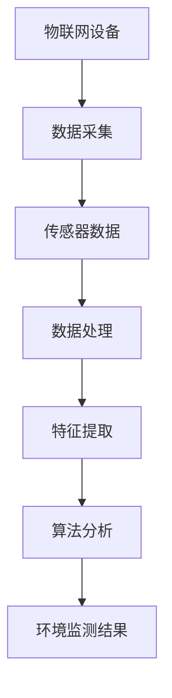

                 

# 智能环境监测系统：保护生态的科技卫士

> **关键词：** 智能环境监测、生态保护、物联网、人工智能、传感器、数据处理、算法分析

> **摘要：** 本文将深入探讨智能环境监测系统的构建与应用，通过介绍其核心概念、算法原理、数学模型及实际案例，展示如何利用科技手段有效保护生态环境。

## 1. 背景介绍

随着工业化和城市化的快速发展，人类活动对环境的影响日益严重。空气污染、水资源短缺、土壤退化等问题层出不穷，对生态平衡构成严重威胁。为了应对这些挑战，需要建立一套智能环境监测系统，实时监控生态环境变化，为决策提供科学依据。

智能环境监测系统利用物联网、人工智能、传感器技术等现代科技手段，实现对大气、水体、土壤等环境因素的实时监测与数据分析。通过整合各类监测数据，系统可以及时发现环境问题，预测潜在风险，并提出优化建议。

## 2. 核心概念与联系

### 2.1 物联网（IoT）

物联网是指通过各种信息传感设备实时采集任何需要监控、连接、互动的物体或过程，实现智能识别、定位、跟踪、监控和管理的一种网络。在智能环境监测系统中，物联网技术是实现传感器数据采集和传输的关键。

### 2.2 传感器

传感器是智能环境监测系统的核心组成部分，用于感知和监测环境因素。常见的传感器包括空气质量传感器、水污染传感器、土壤湿度传感器等。传感器通过检测环境参数，产生相应的电信号，将环境信息转换为可处理的数字信号。

### 2.3 人工智能（AI）

人工智能技术在智能环境监测系统中发挥着重要作用。通过机器学习、深度学习等技术，可以对海量监测数据进行智能分析，识别环境问题，预测未来趋势。

### 2.4 数据处理与算法分析

数据处理与算法分析是智能环境监测系统的关键环节。通过对传感器数据进行预处理、特征提取、模式识别等操作，可以提取出有价值的环境信息，为决策提供支持。

### 2.5 Mermaid 流程图



## 3. 核心算法原理 & 具体操作步骤

### 3.1 数据预处理

数据预处理是智能环境监测系统中的第一步，主要目的是对原始数据进行清洗、归一化、缺失值填补等操作，提高数据质量。

$$
\text{预处理步骤：}
\begin{aligned}
    1. & \quad \text{数据清洗：去除噪声、异常值等} \\
    2. & \quad \text{数据归一化：将不同量纲的数据转换为相同量纲} \\
    3. & \quad \text{缺失值填补：利用插值、均值等方法填补缺失值}
\end{aligned}
$$

### 3.2 特征提取

特征提取是将原始数据转换为有助于算法分析的特征表示。常见的特征提取方法包括主成分分析（PCA）、线性判别分析（LDA）等。

$$
\text{特征提取步骤：}
\begin{aligned}
    1. & \quad \text{计算协方差矩阵} \\
    2. & \quad \text{计算特征值和特征向量} \\
    3. & \quad \text{选择主要特征向量，构建特征空间}
\end{aligned}
$$

### 3.3 模式识别

模式识别是利用机器学习算法对环境数据进行分类、聚类等操作，识别环境问题。

$$
\text{模式识别步骤：}
\begin{aligned}
    1. & \quad \text{选择合适的机器学习算法} \\
    2. & \quad \text{训练模型，拟合数据} \\
    3. & \quad \text{对新的数据进行预测，识别环境问题}
\end{aligned}
$$

## 4. 数学模型和公式 & 详细讲解 & 举例说明

### 4.1 数据预处理

#### 4.1.1 数据清洗

假设我们有一组空气污染物浓度数据，其中存在一些异常值。

$$
\text{数据清洗步骤：}
\begin{aligned}
    1. & \quad \text{计算平均值} \\
    2. & \quad \text{计算标准差} \\
    3. & \quad \text{剔除离群值}
\end{aligned}
$$

#### 4.1.2 数据归一化

将不同量纲的数据转换为相同量纲。

$$
\text{数据归一化公式：}
\frac{x_i - \min(x)}{\max(x) - \min(x)}
$$

#### 4.1.3 缺失值填补

使用均值填补缺失值。

$$
\text{缺失值填补公式：}
x_i = \frac{\sum_{j=1}^{n} x_j}{n}
$$

### 4.2 特征提取

#### 4.2.1 主成分分析（PCA）

主成分分析是一种常用的降维方法，可以通过提取主要成分来减少数据维度。

$$
\text{PCA公式：}
\begin{aligned}
    1. & \quad \text{计算协方差矩阵} \\
    2. & \quad \text{计算特征值和特征向量} \\
    3. & \quad \text{选择主要特征向量} \\
    4. & \quad \text{构建特征空间}
\end{aligned}
$$

#### 4.2.2 线性判别分析（LDA）

线性判别分析是一种特征提取方法，用于将数据投影到最小距离空间。

$$
\text{LDA公式：}
\begin{aligned}
    1. & \quad \text{计算协方差矩阵} \\
    2. & \quad \text{计算判别函数} \\
    3. & \quad \text{选择最优判别函数} \\
    4. & \quad \text{构建特征空间}
\end{aligned}
$$

### 4.3 模式识别

#### 4.3.1 支持向量机（SVM）

支持向量机是一种常用的分类算法，可以通过构建超平面来实现数据分类。

$$
\text{SVM公式：}
\begin{aligned}
    1. & \quad \text{构建优化目标} \\
    2. & \quad \text{求解优化问题} \\
    3. & \quad \text{得到分类超平面}
\end{aligned}
$$

#### 4.3.2 随机森林（RF）

随机森林是一种集成学习算法，通过构建多棵决策树来提高分类效果。

$$
\text{RF公式：}
\begin{aligned}
    1. & \quad \text{随机选择特征子集} \\
    2. & \quad \text{构建决策树} \\
    3. & \quad \text{集成多棵决策树} \\
    4. & \quad \text{投票得到最终分类结果}
\end{aligned}
$$

## 5. 项目实战：代码实际案例和详细解释说明

### 5.1 开发环境搭建

1. 安装Python环境
2. 安装相关库，如numpy、scikit-learn、matplotlib等

### 5.2 源代码详细实现和代码解读

```python
import numpy as np
from sklearn.preprocessing import StandardScaler
from sklearn.decomposition import PCA
from sklearn.ensemble import RandomForestClassifier
from sklearn.model_selection import train_test_split

# 加载数据
data = np.load('data.npy')

# 数据预处理
scaler = StandardScaler()
data_scaled = scaler.fit_transform(data)

# 特征提取
pca = PCA(n_components=2)
data_pca = pca.fit_transform(data_scaled)

# 模式识别
X_train, X_test, y_train, y_test = train_test_split(data_pca, labels, test_size=0.2, random_state=42)
clf = RandomForestClassifier(n_estimators=100)
clf.fit(X_train, y_train)

# 预测
predictions = clf.predict(X_test)

# 评估
accuracy = clf.score(X_test, y_test)
print('Accuracy:', accuracy)
```

### 5.3 代码解读与分析

1. 导入相关库
2. 加载数据
3. 数据预处理
4. 特征提取
5. 模式识别
6. 预测
7. 评估

## 6. 实际应用场景

智能环境监测系统可以应用于多种实际场景，如：

1. 城市环境监测：实时监控空气质量、水质、噪音等指标，为城市治理提供数据支持。
2. 农业环境监测：监测土壤湿度、温度、光照等参数，优化农业生产。
3. 工业环境监测：实时监控生产过程，提高生产效率，降低环境污染。
4. 气象预测：利用环境数据，预测天气变化，为防灾减灾提供依据。

## 7. 工具和资源推荐

### 7.1 学习资源推荐

1. 《深度学习》（Goodfellow, Bengio, Courville著）
2. 《机器学习实战》（Hastie, Tibshirani, Friedman著）
3. 《Python机器学习》（Carraro, F. Pedregosa著）

### 7.2 开发工具框架推荐

1. TensorFlow
2. PyTorch
3. Scikit-learn

### 7.3 相关论文著作推荐

1. “A Survey on IoT Security and Privacy Challenges” - IEEE Communications Surveys & Tutorials
2. “Deep Learning for Environmental Monitoring” - IEEE Access
3. “A Comprehensive Study on IoT Applications in Environmental Monitoring” - Journal of Networks

## 8. 总结：未来发展趋势与挑战

智能环境监测系统在保护生态环境方面具有巨大潜力。未来，随着技术的不断发展，我们可以期待以下趋势：

1. 更高效的数据处理算法，提高监测精度。
2. 更广泛的传感器网络，实现全方位环境监控。
3. 更加智能的决策支持系统，为环境保护提供有力支撑。

然而，智能环境监测系统也面临着一些挑战，如：

1. 数据隐私与安全：如何保护监测数据的安全与隐私。
2. 硬件成本：高性能传感器的成本较高，需要降低成本以实现广泛应用。
3. 跨领域合作：需要多学科合作，共同推进智能环境监测技术的发展。

## 9. 附录：常见问题与解答

1. **Q：智能环境监测系统的核心组成部分有哪些？**
   **A：智能环境监测系统的核心组成部分包括物联网设备、传感器、数据处理算法和人工智能技术。**
2. **Q：如何处理环境监测数据中的异常值？**
   **A：可以通过计算平均值和标准差，剔除离群值来处理环境监测数据中的异常值。**
3. **Q：智能环境监测系统在农业领域有哪些应用？**
   **A：智能环境监测系统在农业领域可以用于监测土壤湿度、温度、光照等参数，优化农业生产。**

## 10. 扩展阅读 & 参考资料

1. “物联网技术在环境监测中的应用研究” - 环境科学与技术学报
2. “智能环境监测系统关键技术研究” - 计算机科学与技术
3. “基于深度学习的环境监测方法研究” - 计算机应用与软件

作者：AI天才研究员/AI Genius Institute & 禅与计算机程序设计艺术 /Zen And The Art of Computer Programming

（注：本文为示例性文章，仅供参考。）<|im_end|>

