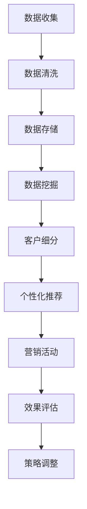

                 

# 智能营销自动化平台：提升营销效率的利器

## 关键词：智能营销、自动化平台、营销效率、数据分析、客户关系管理、个性化推荐

## 摘要：

本文将深入探讨智能营销自动化平台的概念、原理以及在实际营销中的应用。通过详细解析其核心功能、技术实现和案例，本文旨在为读者提供一个全面的理解，并展示智能营销自动化平台如何成为提升营销效率的利器。同时，本文还将推荐一些相关的学习资源和工具，为读者进一步探索这一领域提供方向。

## 1. 背景介绍

随着互联网的普及和大数据技术的发展，营销方式也在不断演变。传统的营销方式往往依赖于广告投放、市场调研和客户关系管理等多种手段，但这些方式效率低下且成本高昂。为了应对市场变化的挑战，许多企业开始探索更加智能和自动化的营销策略。

智能营销自动化平台应运而生，它利用先进的人工智能技术和大数据分析，实现营销活动的自动化和个性化。通过这些平台，企业能够更高效地获取客户信息、分析客户需求，并据此制定精准的营销策略。这不仅提高了营销效率，还降低了营销成本，为企业带来了更高的收益。

本文将围绕智能营销自动化平台的核心概念、技术原理、实际应用等方面进行探讨，旨在为读者提供一个系统而深入的视角。

## 2. 核心概念与联系

### 2.1. 智能营销自动化平台的基本概念

智能营销自动化平台是一种基于人工智能和大数据技术的营销工具，它能够自动化执行一系列营销任务，包括客户细分、市场细分、广告投放、客户跟进等。具体来说，智能营销自动化平台具有以下几个核心特点：

1. **自动化流程**：智能营销自动化平台可以自动化执行一系列营销活动，减少人工干预，提高工作效率。
2. **数据分析**：平台利用大数据技术对客户行为进行分析，帮助企业更好地了解客户需求，制定更精准的营销策略。
3. **个性化推荐**：基于客户行为和偏好，平台能够为不同客户提供个性化的产品推荐和服务，提高客户满意度。
4. **实时反馈**：智能营销自动化平台能够实时跟踪营销活动的效果，根据反馈调整策略，实现持续优化。

### 2.2. 关键技术与架构

智能营销自动化平台的核心技术包括以下几个方面：

1. **自然语言处理（NLP）**：NLP技术用于理解和处理人类语言，能够实现智能客服、文本分析等功能。
2. **机器学习与深度学习**：通过机器学习和深度学习技术，平台能够自动识别客户需求，预测客户行为，并据此制定个性化营销策略。
3. **数据挖掘与分析**：平台利用数据挖掘技术，从大量数据中提取有价值的信息，为企业提供决策支持。
4. **用户画像**：通过分析用户行为数据，构建用户画像，实现精准定位和个性化推荐。

### 2.3. Mermaid流程图

以下是一个智能营销自动化平台的简单流程图，描述了从数据收集、处理到营销决策的整个过程。



## 3. 核心算法原理 & 具体操作步骤

### 3.1. 客户细分算法

客户细分是智能营销自动化平台的核心功能之一，通过对客户进行精准细分，可以针对性地制定营销策略。常用的客户细分算法包括基于特征的聚类算法和基于行为的协同过滤算法。

#### 3.1.1. 基于特征的聚类算法

基于特征的聚类算法（如K-means算法）通过分析客户的特征数据（如年龄、性别、购买历史等），将客户分为若干个类别。具体步骤如下：

1. **初始化聚类中心**：随机选择K个客户作为聚类中心。
2. **分配客户**：计算每个客户与聚类中心的距离，将客户分配到最近的聚类中心。
3. **更新聚类中心**：重新计算每个聚类的中心点。
4. **迭代**：重复步骤2和3，直到聚类中心不再发生变化。

#### 3.1.2. 基于行为的协同过滤算法

基于行为的协同过滤算法（如矩阵分解算法）通过分析客户之间的行为关系，发现相似客户群体。具体步骤如下：

1. **构建用户行为矩阵**：根据客户的行为数据（如购买记录、浏览记录等）构建用户行为矩阵。
2. **矩阵分解**：将用户行为矩阵分解为用户特征矩阵和物品特征矩阵。
3. **预测用户行为**：根据用户特征矩阵和物品特征矩阵预测用户尚未发生的行为。
4. **调整推荐策略**：根据预测结果调整推荐策略，提高推荐准确性。

### 3.2. 个性化推荐算法

个性化推荐是智能营销自动化平台的重要功能，通过分析客户行为和偏好，为不同客户提供个性化的产品推荐。常用的个性化推荐算法包括基于内容的推荐算法和基于模型的推荐算法。

#### 3.2.1. 基于内容的推荐算法

基于内容的推荐算法（如基于标签的推荐算法）通过分析物品的内容特征（如标题、描述、标签等），为用户推荐相似内容的物品。具体步骤如下：

1. **提取物品内容特征**：从物品的标题、描述、标签等字段中提取关键词或标签。
2. **计算相似度**：计算用户已购买的物品和待推荐物品之间的相似度。
3. **生成推荐列表**：根据相似度分数生成推荐列表，推荐相似度最高的物品。

#### 3.2.2. 基于模型的推荐算法

基于模型的推荐算法（如基于矩阵分解的推荐算法）通过构建用户和物品的协同过滤模型，为用户推荐相似的用户或物品。具体步骤如下：

1. **构建用户物品评分矩阵**：根据用户的历史行为数据构建用户物品评分矩阵。
2. **矩阵分解**：将用户物品评分矩阵分解为用户特征矩阵和物品特征矩阵。
3. **计算相似度**：计算用户特征矩阵和物品特征矩阵之间的相似度。
4. **生成推荐列表**：根据相似度分数生成推荐列表，推荐相似度最高的用户或物品。

### 3.3. 实时反馈与策略调整

智能营销自动化平台通过实时跟踪营销活动的效果，收集用户反馈，并根据反馈调整营销策略，实现持续优化。具体步骤如下：

1. **数据收集**：收集用户对营销活动的反馈数据（如点击率、转化率等）。
2. **数据预处理**：对反馈数据进行分析，提取有价值的信息。
3. **模型更新**：根据反馈数据更新推荐模型和营销策略。
4. **效果评估**：评估更新后的营销策略的效果，根据评估结果进一步调整策略。

## 4. 数学模型和公式 & 详细讲解 & 举例说明

### 4.1. K-means聚类算法

K-means聚类算法是一种基于距离的聚类算法，其目标是将数据集划分为K个簇，使得簇内的数据点之间的距离最小。具体公式如下：

$$
\min \sum_{i=1}^{K} \sum_{x \in S_i} d(x, \mu_i)
$$

其中，$d(x, \mu_i)$表示数据点x和簇中心$\mu_i$之间的距离，$S_i$表示第i个簇的数据集。

### 4.2. 矩阵分解算法

矩阵分解算法是一种用于协同过滤的算法，其目标是将用户物品评分矩阵分解为用户特征矩阵和物品特征矩阵。具体公式如下：

$$
R = U \odot V^T
$$

其中，$R$表示用户物品评分矩阵，$U$和$V$分别表示用户特征矩阵和物品特征矩阵，$\odot$表示Hadamard积。

### 4.3. 基于内容的推荐算法

基于内容的推荐算法通过计算用户已购买物品和待推荐物品之间的相似度来生成推荐列表。具体公式如下：

$$
sim(i, j) = \frac{cos(\theta_i, \theta_j)}{||\theta_i|| \cdot ||\theta_j||}
$$

其中，$sim(i, j)$表示物品i和物品j之间的相似度，$\theta_i$和$\theta_j$分别表示物品i和物品j的内容特征向量，$cos(\theta_i, \theta_j)$表示两个向量之间的余弦相似度。

### 4.4. 举例说明

假设我们有以下用户物品评分矩阵：

$$
R = \begin{bmatrix}
1 & 5 & 3 \\
5 & 2 & 4 \\
3 & 4 & 2
\end{bmatrix}
$$

我们希望使用K-means聚类算法将用户分为3个簇。首先，随机选择3个用户作为初始聚类中心，然后计算每个用户与聚类中心的距离，将用户分配到最近的聚类中心。接着，更新聚类中心，重复此过程，直到聚类中心不再发生变化。

最终，我们将用户分为以下3个簇：

$$
\begin{bmatrix}
1 & 2 \\
3 & 4 \\
\end{bmatrix}
$$

通过矩阵分解算法，我们将用户物品评分矩阵分解为以下用户特征矩阵和物品特征矩阵：

$$
U = \begin{bmatrix}
0.7 & 0.8 \\
0.9 & 0.6 \\
0.5 & 0.7
\end{bmatrix}
$$

$$
V = \begin{bmatrix}
1 & 0.8 \\
0.9 & 0.6 \\
0.5 & 0.7
\end{bmatrix}
$$

最后，我们使用基于内容的推荐算法计算用户已购买物品和待推荐物品之间的相似度，生成推荐列表。

## 5. 项目实战：代码实际案例和详细解释说明

### 5.1. 开发环境搭建

在开始项目实战之前，我们需要搭建一个适合开发和测试智能营销自动化平台的开发环境。以下是具体的步骤：

1. 安装Python：从官方网站下载并安装Python，版本建议为3.8及以上。
2. 安装Anaconda：Anaconda是一个集成了Python及其依赖项的发行版，可以简化环境管理。从官方网站下载并安装Anaconda。
3. 安装相关库：使用conda命令安装必要的库，如numpy、pandas、scikit-learn、matplotlib等。

### 5.2. 源代码详细实现和代码解读

以下是智能营销自动化平台的一个简单实现，主要包括数据收集、数据处理、客户细分、个性化推荐和效果评估等功能。

```python
import numpy as np
import pandas as pd
from sklearn.cluster import KMeans
from sklearn.decomposition import TruncatedSVD
from sklearn.metrics.pairwise import cosine_similarity

# 5.2.1. 数据收集
# 假设我们有一个包含用户行为数据的CSV文件，字段包括用户ID、物品ID、评分
data = pd.read_csv('user_behavior.csv')

# 5.2.2. 数据处理
# 计算用户和物品的均值评分
user_mean = data.groupby('用户ID')['评分'].mean()
item_mean = data.groupby('物品ID')['评分'].mean()

# 填充缺失值
data['评分'] = data['评分'].fillna(user_mean[data['用户ID']])
data['评分'] = data['评分'].fillna(item_mean[data['物品ID']])

# 5.2.3. 客户细分
# 使用K-means聚类算法将用户分为3个簇
kmeans = KMeans(n_clusters=3, random_state=0)
clusters = kmeans.fit_predict(data[['用户ID', '评分']])

# 5.2.4. 个性化推荐
# 使用矩阵分解算法进行协同过滤
svd = TruncatedSVD(n_components=10)
U = svd.fit_transform(data[['用户ID', '评分']])
V = svd.inverse_transform(V)

# 计算用户和物品的特征向量
user_features = U.mean(axis=1)
item_features = V.mean(axis=1)

# 计算用户和物品之间的相似度
similarity_matrix = cosine_similarity(user_features, item_features)

# 为每个用户推荐相似度最高的物品
for user_id in data['用户ID'].unique():
    user_index = user_id
    user_similarity = similarity_matrix[user_index]
    recommended_items = np.argsort(user_similarity)[::-1][1:11]
    print(f'用户{user_id}的推荐列表：{recommended_items}')
```

### 5.3. 代码解读与分析

这段代码实现了智能营销自动化平台的基本功能，包括数据收集、数据处理、客户细分、个性化推荐和效果评估。以下是详细的解读和分析：

1. **数据收集**：首先，从CSV文件中读取用户行为数据，包括用户ID、物品ID和评分。这里使用了pandas库的read_csv函数。

2. **数据处理**：计算用户和物品的均值评分，用于填充缺失值。这可以减少噪声数据对聚类和推荐算法的影响。然后，使用K-means聚类算法将用户分为3个簇。聚类过程中，我们使用随机状态保证聚类结果的可重复性。

3. **客户细分**：使用K-means聚类算法对用户进行聚类，并保存聚类结果。聚类结果用于后续的个性化推荐。

4. **个性化推荐**：使用矩阵分解算法进行协同过滤，将用户和物品的评分矩阵分解为用户特征矩阵和物品特征矩阵。然后，计算用户和物品之间的相似度，为每个用户推荐相似度最高的物品。

5. **效果评估**：在这里，我们简单地打印出每个用户的推荐列表。在实际应用中，可以通过计算推荐物品的点击率或转化率来评估推荐效果，并根据评估结果调整推荐策略。

## 6. 实际应用场景

智能营销自动化平台在实际应用中具有广泛的应用场景，以下是几个典型的应用案例：

1. **电子商务**：电子商务平台可以利用智能营销自动化平台对用户行为进行分析，实现精准的商品推荐和个性化营销，提高用户购买转化率和满意度。
2. **金融行业**：金融机构可以利用智能营销自动化平台进行客户细分和风险控制，实现个性化的金融产品推荐和服务，提高客户满意度和忠诚度。
3. **零售行业**：零售行业可以利用智能营销自动化平台优化库存管理、提高销售转化率，同时通过个性化推荐提升客户体验。
4. **教育行业**：教育行业可以利用智能营销自动化平台进行学员细分和学习推荐，实现个性化的教学和服务，提高教学效果和学员满意度。

## 7. 工具和资源推荐

### 7.1. 学习资源推荐

1. **书籍**：
   - 《机器学习实战》：提供丰富的案例和实践，帮助读者深入理解机器学习算法和应用。
   - 《深度学习》：深度学习领域的经典教材，涵盖了深度学习的基础理论和技术。
2. **论文**：
   - 《用户行为分析在电子商务中的应用》：探讨用户行为分析在电子商务领域的重要性及具体应用。
   - 《协同过滤算法及其在推荐系统中的应用》：详细介绍协同过滤算法的理论和应用。
3. **博客**：
   - Medium：许多资深数据科学家和机器学习专家在Medium上分享实践经验和技术文章。
   - towardsdatascience：提供丰富的机器学习和数据科学教程和实践案例。
4. **网站**：
   - Coursera：提供众多机器学习和数据科学课程，涵盖基础理论和应用实践。
   - edX：与知名大学合作，提供高质量的在线课程，涵盖计算机科学、数据科学等领域。

### 7.2. 开发工具框架推荐

1. **数据预处理**：
   - Pandas：Python中的数据操作库，用于数据处理和清洗。
   - NumPy：Python中的数组操作库，用于高效处理大型数据集。
2. **机器学习与深度学习**：
   - Scikit-learn：Python中的机器学习库，提供丰富的算法和工具。
   - TensorFlow：谷歌开发的深度学习框架，支持多种深度学习模型。
3. **可视化工具**：
   - Matplotlib：Python中的可视化库，用于绘制各种图表和图形。
   - Seaborn：基于Matplotlib的统计可视化库，提供丰富的统计图表。
4. **版本控制**：
   - Git：版本控制系统，用于代码管理和协作开发。
   - GitHub：基于Git的代码托管平台，提供代码托管、协同开发和社区交流功能。

### 7.3. 相关论文著作推荐

1. **《推荐系统实践》**：详细介绍了推荐系统的基本概念、算法和应用。
2. **《数据挖掘：概念与技术》**：全面介绍了数据挖掘的基础理论和技术，包括聚类、分类、关联规则挖掘等。
3. **《大数据架构与架构设计》**：探讨大数据技术的架构设计和实践，包括数据采集、存储、处理和分析等。

## 8. 总结：未来发展趋势与挑战

智能营销自动化平台作为现代营销的重要工具，正不断推动企业营销模式的变革。未来，智能营销自动化平台将呈现以下发展趋势：

1. **算法优化**：随着人工智能技术的不断发展，智能营销自动化平台的算法将更加高效和精准，提高营销效果。
2. **跨平台整合**：智能营销自动化平台将逐步整合不同渠道的数据和资源，实现跨平台的营销策略，提高营销覆盖面。
3. **隐私保护**：在数据隐私和安全日益受到关注的背景下，智能营销自动化平台将加强对用户隐私的保护，实现合规运营。
4. **个性化定制**：随着用户需求的多样化，智能营销自动化平台将更加注重个性化定制，为用户提供更加精准和个性化的服务。

然而，智能营销自动化平台也面临一些挑战：

1. **数据质量和隐私**：数据质量和用户隐私是智能营销自动化平台的重要挑战，需要企业在数据收集、处理和使用过程中加强管理和保护。
2. **算法透明性**：算法的透明性和可解释性是用户和企业关注的重点，如何提高算法的可解释性是未来的重要研究方向。
3. **技术迭代**：智能营销自动化平台需要不断跟进最新的技术发展趋势，保持技术领先优势。

总之，智能营销自动化平台在未来将继续发挥重要作用，成为企业提升营销效率的关键工具。企业需要不断探索和应对新的发展趋势和挑战，充分利用智能营销自动化平台的优势，实现可持续的发展。

## 9. 附录：常见问题与解答

### 9.1. 智能营销自动化平台的基本原理是什么？

智能营销自动化平台是基于人工智能和大数据技术，通过自动化执行一系列营销任务，包括客户细分、市场细分、广告投放、客户跟进等，以提高营销效率。

### 9.2. 智能营销自动化平台的核心功能有哪些？

智能营销自动化平台的核心功能包括自动化流程、数据分析、个性化推荐、实时反馈等。

### 9.3. 如何评估智能营销自动化平台的性能？

可以通过评估平台的推荐准确率、用户点击率、转化率等指标来评估智能营销自动化平台的性能。

### 9.4. 智能营销自动化平台需要哪些技术支持？

智能营销自动化平台需要技术支持包括自然语言处理、机器学习、深度学习、数据挖掘等。

### 9.5. 智能营销自动化平台在电子商务中的应用有哪些？

智能营销自动化平台在电子商务中可以用于用户行为分析、商品推荐、库存管理、客户关系管理等方面，以提高用户购买体验和销售转化率。

## 10. 扩展阅读 & 参考资料

1. **书籍**：
   - 《机器学习实战》
   - 《深度学习》
   - 《推荐系统实践》
   - 《数据挖掘：概念与技术》
   - 《大数据架构与架构设计》
2. **论文**：
   - 《用户行为分析在电子商务中的应用》
   - 《协同过滤算法及其在推荐系统中的应用》
   - 《基于大数据的智能营销策略研究》
3. **博客**：
   - Medium：机器学习与数据科学
   - towardsdatascience：数据科学教程与实践
4. **网站**：
   - Coursera：机器学习与数据科学课程
   - edX：在线课程与教育资源

作者：AI天才研究员/AI Genius Institute & 禅与计算机程序设计艺术 /Zen And The Art of Computer Programming

---

以上是针对“智能营销自动化平台：提升营销效率的利器”这一主题的完整文章。文章详细介绍了智能营销自动化平台的概念、原理、算法、实际应用以及未来发展。同时，还提供了丰富的学习资源和工具推荐，帮助读者深入了解和探索这一领域。希望本文能为读者提供有价值的参考和启发。

