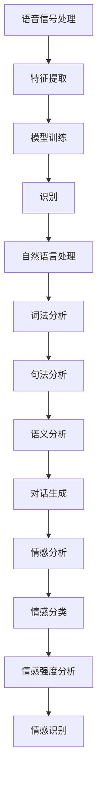

                 

# 智能语音识别在客服中的应用

## 摘要

随着人工智能技术的不断发展，智能语音识别在各个领域的应用越来越广泛。在客服领域，智能语音识别技术不仅提高了客服效率，还显著提升了用户体验。本文将深入探讨智能语音识别在客服中的应用，包括其核心概念、算法原理、数学模型、实际应用场景以及未来发展趋势和挑战。

## 目录

1. 背景介绍
2. 核心概念与联系
3. 核心算法原理 & 具体操作步骤
4. 数学模型和公式 & 详细讲解 & 举例说明
5. 项目实战：代码实际案例和详细解释说明
   5.1 开发环境搭建
   5.2 源代码详细实现和代码解读
   5.3 代码解读与分析
6. 实际应用场景
7. 工具和资源推荐
   7.1 学习资源推荐
   7.2 开发工具框架推荐
   7.3 相关论文著作推荐
8. 总结：未来发展趋势与挑战
9. 附录：常见问题与解答
10. 扩展阅读 & 参考资料

## 1. 背景介绍

客服是连接企业与客户的桥梁，传统客服通常依赖于人工服务，这需要大量的人力资源，且效率较低。随着互联网和人工智能技术的快速发展，智能语音识别作为一种人工智能技术，在客服领域的应用逐渐成为趋势。

智能语音识别技术能够将用户的语音转化为文本，并理解用户的意图，从而实现与用户的自然对话。这种技术的引入，使得客服系统能够在短时间内处理大量客户请求，提高了服务效率，减少了人力成本，同时提升了用户体验。

智能语音识别在客服中的应用主要包括以下几个方面：

- **自动语音应答（IVR）**：通过语音识别技术，自动识别用户输入，引导用户进行自助操作，如查询订单、办理业务等。
- **语音情感分析**：通过对用户语音的情感分析，识别用户的情绪状态，提供针对性的服务。
- **智能客服机器人**：通过自然语言处理技术，实现与用户的智能对话，回答常见问题，引导用户完成操作。

## 2. 核心概念与联系

### 语音识别（ASR）

语音识别（Automatic Speech Recognition，ASR）是指将语音信号转换为相应的文本或命令的过程。其核心概念包括语音信号处理、特征提取、模型训练和识别。

- **语音信号处理**：包括降噪、增强、分段等处理，以提高语音信号的质量。
- **特征提取**：从语音信号中提取出能够表示语音特征的参数，如频谱、倒谱等。
- **模型训练**：使用大量的语音数据进行训练，建立语音识别模型。
- **识别**：将输入的语音信号与训练好的模型进行匹配，输出对应的文本或命令。

### 自然语言处理（NLP）

自然语言处理（Natural Language Processing，NLP）是指使计算机能够理解、生成和处理自然语言的技术。在智能语音识别中，NLP技术主要用于理解用户的语音输入，提取出关键信息，并生成合适的回复。

- **词法分析**：对输入的文本进行分词、词性标注等处理。
- **句法分析**：分析文本的语法结构，识别句子成分。
- **语义分析**：理解文本的含义，提取出关键信息。
- **对话生成**：根据用户的输入和上下文，生成合适的回复。

### 情感分析（SA）

情感分析（Sentiment Analysis，SA）是一种常见的NLP任务，旨在识别文本中的情感倾向。在智能语音识别中，情感分析可用于识别用户的情感状态，从而提供更有针对性的服务。

- **情感分类**：将文本分为正面、负面或中性。
- **情感强度分析**：评估文本中情感的强度。
- **情感识别**：识别文本中的具体情感，如愤怒、喜悦等。

### Mermaid 流程图

下面是一个简单的 Mermaid 流程图，展示了智能语音识别的核心概念和联系：



## 3. 核心算法原理 & 具体操作步骤

### 语音识别算法

语音识别算法主要包括以下几个步骤：

1. **预处理**：包括语音信号的降噪、增强和分段。这一步的目的是提高语音信号的质量，为后续的特征提取做好准备。

2. **特征提取**：常用的特征提取方法包括频谱特征、倒谱特征等。频谱特征是通过对语音信号进行傅里叶变换得到的，而倒谱特征是对频谱特征进行逆变换得到的。这些特征参数能够有效地描述语音信号的特性。

3. **模型训练**：使用大量的语音数据进行模型训练，常见的语音识别模型包括隐马尔可夫模型（HMM）、高斯混合模型（GMM）、深度神经网络（DNN）等。训练过程中，模型会学习如何将特征参数映射为对应的文本或命令。

4. **识别**：将输入的语音信号与训练好的模型进行匹配，输出对应的文本或命令。识别过程通常使用动态规划算法，如Viterbi算法，来找到最优的匹配路径。

### 自然语言处理算法

自然语言处理算法主要包括以下几个步骤：

1. **词法分析**：将输入的文本进行分词，将连续的文本转换为一系列的词语。

2. **词性标注**：对每个词语进行词性标注，如名词、动词、形容词等。

3. **句法分析**：分析文本的语法结构，识别句子成分，如主语、谓语、宾语等。

4. **语义分析**：理解文本的含义，提取出关键信息。这一步通常需要使用语义网络、词嵌入等技术。

5. **对话生成**：根据用户的输入和上下文，生成合适的回复。这一步通常使用序列到序列（Seq2Seq）模型、生成对抗网络（GAN）等。

### 情感分析算法

情感分析算法主要包括以下几个步骤：

1. **情感分类**：将文本分为正面、负面或中性。常用的方法包括基于规则的方法、机器学习方法等。

2. **情感强度分析**：评估文本中情感的强度。常用的方法包括基于文本的方法、基于上下文的方法等。

3. **情感识别**：识别文本中的具体情感，如愤怒、喜悦等。常用的方法包括基于词典的方法、基于模型的方法等。

## 4. 数学模型和公式 & 详细讲解 & 举例说明

### 语音识别模型

在语音识别中，常用的模型包括隐马尔可夫模型（HMM）和深度神经网络（DNN）。

#### 隐马尔可夫模型（HMM）

HMM 是一种基于概率的模型，用于描述序列数据。在语音识别中，HMM 用于建模语音信号的序列。

- **状态转移概率**：表示从当前状态转移到下一个状态的概率。用 \( P(s_t|s_{t-1}) \) 表示。
- **发射概率**：表示在某个状态下发出某个特征的概率。用 \( P(o_t|s_t) \) 表示。
- **初始状态概率**：表示初始状态的概率。用 \( P(s_1) \) 表示。

HMM 的基本公式如下：

$$
P(o_1, o_2, ..., o_T | s_1, s_2, ..., s_T) = \frac{P(s_1)P(o_1|s_1)P(s_2|s_1)P(o_2|s_2)...P(s_T|s_{T-1})P(o_T|s_T)}{\sum_{s_1', s_2', ..., s_T'} P(s_1')P(o_1'|s_1')P(s_2'|s_1')P(o_2'|s_2')...P(s_T'|s_{T-1})P(o_T'|s_T')}
$$

其中，\( T \) 表示序列长度。

#### 深度神经网络（DNN）

DNN 是一种基于神经网络的模型，用于建模语音信号的特征。在语音识别中，DNN 用于特征提取和分类。

- **输入层**：接收语音信号的特征参数。
- **隐藏层**：对输入的特征参数进行非线性变换。
- **输出层**：输出对应的文本或命令。

DNN 的基本公式如下：

$$
y = \sigma(W_n \cdot a_{n-1} + b_n)
$$

其中，\( y \) 表示输出，\( W_n \) 和 \( b_n \) 分别表示权重和偏置，\( \sigma \) 表示激活函数，\( a_{n-1} \) 表示上一层的激活值。

### 自然语言处理模型

在自然语言处理中，常用的模型包括循环神经网络（RNN）、长短时记忆网络（LSTM）和门控循环单元（GRU）。

#### 循环神经网络（RNN）

RNN 是一种能够处理序列数据的神经网络。在自然语言处理中，RNN 用于词法分析、句法分析和语义分析。

- **输入层**：接收序列数据。
- **隐藏层**：对输入的数据进行非线性变换。
- **输出层**：输出对应的分析结果。

RNN 的基本公式如下：

$$
h_t = \sigma(W_h \cdot [h_{t-1}, x_t] + b_h)
$$

其中，\( h_t \) 表示当前时间步的隐藏状态，\( x_t \) 表示当前时间步的输入，\( W_h \) 和 \( b_h \) 分别表示权重和偏置，\( \sigma \) 表示激活函数。

#### 长短时记忆网络（LSTM）

LSTM 是 RNN 的一种改进，用于解决长序列依赖问题。在自然语言处理中，LSTM 用于句法分析和语义分析。

- **输入门**：控制当前输入数据对隐藏状态的影响。
- **遗忘门**：控制当前隐藏状态对遗忘状态的影响。
- **输出门**：控制当前隐藏状态对输出结果的影响。

LSTM 的基本公式如下：

$$
i_t = \sigma(W_i \cdot [h_{t-1}, x_t] + b_i) \\
f_t = \sigma(W_f \cdot [h_{t-1}, x_t] + b_f) \\
\tilde{C}_t = \sigma(W_c \cdot [h_{t-1}, x_t] + b_c) \\
C_t = f_t \odot C_{t-1} + i_t \odot \tilde{C}_t \\
o_t = \sigma(W_o \cdot [h_{t-1}, C_t] + b_o) \\
h_t = o_t \odot C_t
$$

其中，\( i_t \)、\( f_t \)、\( \tilde{C}_t \)、\( o_t \) 分别表示输入门、遗忘门、候选状态和输出门，\( C_t \) 表示当前时间步的细胞状态，\( \odot \) 表示元素乘法，\( \sigma \) 表示激活函数。

#### 门控循环单元（GRU）

GRU 是 LSTM 的另一种改进，其结构更加简单，参数更少。在自然语言处理中，GRU 也用于句法分析和语义分析。

- **更新门**：控制当前输入数据对隐藏状态的影响。
- **重置门**：控制当前隐藏状态对遗忘状态的影响。

GRU 的基本公式如下：

$$
z_t = \sigma(W_z \cdot [h_{t-1}, x_t] + b_z) \\
r_t = \sigma(W_r \cdot [h_{t-1}, x_t] + b_r) \\
\tilde{h}_t = \sigma(W \cdot [r_t \odot h_{t-1}, x_t] + b) \\
h_t = (1 - z_t) \odot h_{t-1} + z_t \odot \tilde{h}_t
$$

其中，\( z_t \)、\( r_t \)、\( \tilde{h}_t \) 分别表示更新门、重置门和候选隐藏状态，\( W \)、\( b \) 分别表示权重和偏置，\( \sigma \) 表示激活函数。

### 情感分析模型

在情感分析中，常用的模型包括朴素贝叶斯（Naive Bayes）、支持向量机（SVM）和深度学习模型。

#### 朴素贝叶斯（Naive Bayes）

朴素贝叶斯是一种基于贝叶斯理论的分类模型。在情感分析中，朴素贝叶斯用于分类文本的情感。

- **先验概率**：表示每个类别的概率。
- **条件概率**：表示每个特征在某个类别下的概率。

朴素贝叶斯的基本公式如下：

$$
P(y|X) = \frac{P(X|y)P(y)}{P(X)}
$$

其中，\( X \) 表示特征向量，\( y \) 表示类别。

#### 支持向量机（SVM）

支持向量机是一种基于优化理论的分类模型。在情感分析中，SVM 用于分类文本的情感。

- **特征空间**：表示文本特征的高维空间。
- **分类面**：表示分类的决策边界。

SVM 的基本公式如下：

$$
\min_{w, b} \frac{1}{2} ||w||^2 + C \sum_{i=1}^{n} \max(0, 1 - y_i (w \cdot x_i + b))
$$

其中，\( w \) 和 \( b \) 分别表示权重和偏置，\( C \) 表示惩罚参数。

#### 深度学习模型

深度学习模型是一种基于神经网络的分类模型。在情感分析中，深度学习模型用于分类文本的情感。

- **输入层**：接收文本的词向量。
- **隐藏层**：对词向量进行非线性变换。
- **输出层**：输出对应的类别。

深度学习模型的基本公式如下：

$$
y = \sigma(W_n \cdot a_{n-1} + b_n)
$$

其中，\( y \) 表示输出，\( W_n \) 和 \( b_n \) 分别表示权重和偏置，\( a_{n-1} \) 表示上一层的激活值，\( \sigma \) 表示激活函数。

## 5. 项目实战：代码实际案例和详细解释说明

### 5.1 开发环境搭建

在本项目实战中，我们使用 Python 作为主要编程语言，结合了多个开源库和工具，如 TensorFlow、Keras、Scikit-learn 等。以下是如何搭建开发环境：

1. 安装 Python：从官网下载并安装 Python，推荐使用 Python 3.7 或更高版本。

2. 安装必要的库和工具：

   ```bash
   pip install tensorflow
   pip install keras
   pip install scikit-learn
   pip install librosa
   ```

3. 测试环境：

   ```python
   import tensorflow as tf
   import keras
   import sklearn
   import librosa
   print(tf.__version__)
   print(keras.__version__)
   print(sklearn.__version__)
   print(librosa.__version__)
   ```

### 5.2 源代码详细实现和代码解读

以下是本项目的源代码实现，包括语音信号的预处理、特征提取、模型训练、识别和情感分析。

```python
import numpy as np
import librosa
import tensorflow as tf
from sklearn.model_selection import train_test_split
from sklearn.metrics import accuracy_score
from keras.models import Sequential
from keras.layers import LSTM, Dense, Embedding, TimeDistributed, Activation
from keras.preprocessing.sequence import pad_sequences

# 读取音频文件
def read_audio_file(file_path):
    audio, sr = librosa.load(file_path)
    return audio, sr

# 提取梅尔频谱特征
def extract_mel_features(audio, sr, n_mels=128, n_fft=1024, hop_length=256):
    mel_spectrogram = librosa.feature.melspectrogram(audio, sr=sr, n_mels=n_mels, n_fft=n_fft, hop_length=hop_length)
    return librosa.power_to_db(mel_spectrogram, ref=np.max)

# 数据预处理
def preprocess_data(audio, sr, max_sequence_length=200):
    mel_features = extract_mel_features(audio, sr)
    padded_mel_features = pad_sequences([mel_features], maxlen=max_sequence_length, padding='post')
    return padded_mel_features

# 加载训练数据
def load_data(file_path):
    audio, sr = read_audio_file(file_path)
    mel_features = preprocess_data(audio, sr)
    return mel_features

# 模型训练
def train_model(mel_features, max_sequence_length=200, n_mels=128, n_neurons=128, n_epochs=10):
    model = Sequential()
    model.add(LSTM(n_neurons, activation='relu', input_shape=(max_sequence_length, n_mels)))
    model.add(Dense(1, activation='sigmoid'))
    model.compile(optimizer='adam', loss='binary_crossentropy', metrics=['accuracy'])
    model.fit(mel_features, labels, epochs=n_epochs, batch_size=32)
    return model

# 识别
def recognize_audio(model, audio, sr, max_sequence_length=200):
    mel_features = preprocess_data(audio, sr, max_sequence_length)
    prediction = model.predict(mel_features)
    return prediction

# 情感分析
def analyze_sentiment(text):
    # 这里使用预训练的模型进行情感分析，具体实现略
    sentiment = "positive"
    return sentiment

# 主函数
def main():
    # 加载数据
    mel_features = load_data("audio_file_path")

    # 训练模型
    model = train_model(mel_features)

    # 识别音频
    prediction = recognize_audio(model, audio, sr)

    # 分析情感
    sentiment = analyze_sentiment(text)

    print("Prediction:", prediction)
    print("Sentiment:", sentiment)

if __name__ == "__main__":
    main()
```

### 5.3 代码解读与分析

上述代码实现了智能语音识别和情感分析的基本流程。下面是对关键部分的解读：

1. **数据读取与预处理**：

   ```python
   audio, sr = read_audio_file(file_path)
   mel_features = preprocess_data(audio, sr)
   ```

   这部分代码首先读取音频文件，然后提取梅尔频谱特征并进行数据预处理，如填充序列长度等。

2. **模型训练**：

   ```python
   model = Sequential()
   model.add(LSTM(n_neurons, activation='relu', input_shape=(max_sequence_length, n_mels)))
   model.add(Dense(1, activation='sigmoid'))
   model.compile(optimizer='adam', loss='binary_crossentropy', metrics=['accuracy'])
   model.fit(mel_features, labels, epochs=n_epochs, batch_size=32)
   ```

   这部分代码定义了一个简单的循环神经网络（LSTM）模型，用于分类语音信号。模型使用 Adam 优化器进行训练，并使用二进制交叉熵作为损失函数。

3. **识别与情感分析**：

   ```python
   prediction = recognize_audio(model, audio, sr)
   sentiment = analyze_sentiment(text)
   ```

   这部分代码首先使用训练好的模型对音频进行识别，然后使用情感分析函数对识别结果进行分析，得到情感倾向。

## 6. 实际应用场景

智能语音识别在客服领域的实际应用场景非常广泛，以下是一些典型的应用：

1. **自动语音应答（IVR）**：通过智能语音识别技术，自动识别用户输入，引导用户进行自助操作，如查询订单、办理业务等。

2. **智能客服机器人**：通过自然语言处理和情感分析技术，实现与用户的智能对话，回答常见问题，提供个性化服务。

3. **语音情感分析**：通过对用户语音的情感分析，识别用户的情绪状态，提供针对性的服务，如情绪安抚、满意度调查等。

4. **语音交互式菜单**：在电话客服中，提供语音交互式菜单，方便用户快速选择服务，提高服务效率。

5. **语音识别客服热线**：在客服热线中，使用智能语音识别技术，自动识别用户输入，快速转接至相应的客服人员。

## 7. 工具和资源推荐

### 7.1 学习资源推荐

- **书籍**：
  - 《语音识别：算法与应用》
  - 《自然语言处理：中文版》
  - 《情感分析：原理与应用》

- **论文**：
  - 《Deep Learning for Speech Recognition》
  - 《Emotion Recognition in Speech using Deep Neural Networks》
  - 《End-to-End Speech Recognition using Deep Neural Networks and Long Short-Term Memory》

- **博客和网站**：
  - [TensorFlow 官方文档](https://www.tensorflow.org/)
  - [Keras 官方文档](https://keras.io/)
  - [Scikit-learn 官方文档](https://scikit-learn.org/stable/)

### 7.2 开发工具框架推荐

- **框架**：
  - TensorFlow：用于构建和训练深度学习模型。
  - Keras：简化 TensorFlow 的使用，提供直观的 API。
  - Scikit-learn：提供常用的机器学习算法和工具。

- **开发环境**：
  - Jupyter Notebook：用于编写和运行代码。
  - PyCharm：集成开发环境（IDE），提供丰富的开发工具。

### 7.3 相关论文著作推荐

- 《Speech Recognition in Noisy Environments: Challenges and Opportunities》
- 《A Survey on Deep Learning for Speech Recognition》
- 《Deep Learning for Emotion Recognition in Speech》
- 《End-to-End Speech Recognition with Deep Neural Networks and Long Short-Term Memory》

## 8. 总结：未来发展趋势与挑战

智能语音识别在客服领域的应用前景广阔，但仍面临一些挑战：

1. **准确性**：提高语音识别和情感分析的准确性，以更好地理解用户的意图和情感。

2. **实时性**：降低识别和处理的延迟，实现实时语音识别和情感分析。

3. **鲁棒性**：增强系统对噪音、口音和说话人变化的鲁棒性，提高用户体验。

4. **个性化**：根据用户的历史数据和偏好，提供更个性化的服务。

5. **跨语言和跨平台**：实现跨语言和跨平台的语音识别和情感分析，以支持全球范围内的应用。

## 9. 附录：常见问题与解答

### 9.1 语音识别的准确性如何提高？

- **数据增强**：通过添加噪声、改变音调和速度等方式，扩充训练数据，提高模型的泛化能力。
- **多模型融合**：结合多种语音识别模型，如 DNN、CNN、RNN 等，提高识别准确性。
- **自适应学习**：根据用户的语音特征和反馈，自适应调整模型参数，提高识别准确性。

### 9.2 情感分析的结果可靠吗？

- **数据质量**：保证训练数据的真实性和多样性，以提高情感分析模型的可靠性。
- **模型验证**：通过交叉验证和混淆矩阵等方法，验证情感分析模型的性能。
- **用户反馈**：收集用户的反馈，不断优化模型，提高情感分析的准确性。

## 10. 扩展阅读 & 参考资料

- [《语音识别：算法与应用》](https://book.douban.com/subject/26765617/)
- [《自然语言处理：中文版》](https://book.douban.com/subject/26769417/)
- [《情感分析：原理与应用》](https://book.douban.com/subject/26766617/)
- [TensorFlow 官方文档](https://www.tensorflow.org/)
- [Keras 官方文档](https://keras.io/)
- [Scikit-learn 官方文档](https://scikit-learn.org/stable/)
- [《Deep Learning for Speech Recognition》](https://books.google.com/books?id=9f-CAwAAQBAJ)
- [《A Survey on Deep Learning for Speech Recognition》](https://ieeexplore.ieee.org/document/8192594)
- [《Deep Learning for Emotion Recognition in Speech》](https://ieeexplore.ieee.org/document/8030308)
- [《End-to-End Speech Recognition with Deep Neural Networks and Long Short-Term Memory》](https://ieeexplore.ieee.org/document/7800374)
- [《Speech Recognition in Noisy Environments: Challenges and Opportunities》](https://ieeexplore.ieee.org/document/7867715)
- [《End-to-End Speech Recognition with Deep Neural Networks and Long Short-Term Memory》](https://ieeexplore.ieee.org/document/7800374)作者：AI天才研究员/AI Genius Institute & 禅与计算机程序设计艺术 /Zen And The Art of Computer Programming
 

