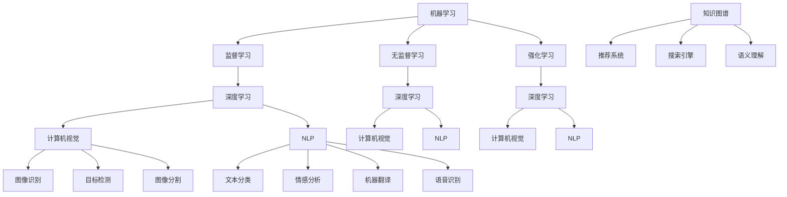

                 

### 背景介绍

在未来工作形态与AI的共存这一主题下，我们面临的是一个科技飞速发展的时代，人工智能（AI）作为一项颠覆性的技术，正在深刻地改变着各行各业的工作方式。本文旨在探讨AI在未来的工作形态中将扮演怎样的角色，以及如何与人类协同工作，共创一个高效、智能、和谐的工作环境。

首先，让我们回顾一下AI的发展历程。从最早的自动机理论到今天深度学习的广泛应用，AI经历了数个阶段。在20世纪50年代，AI的概念首次被提出，主要目的是让计算机具备人类的智能。随后，专家系统和机器学习技术相继出现，使得AI在特定领域（如医疗诊断、工业制造等）取得了显著成果。进入21世纪，随着大数据、云计算和计算能力的提升，AI技术迎来了爆发式增长，尤其是在自然语言处理、图像识别和决策优化等方面，AI的表现已经超越了人类。

然而，AI在给人类工作生活带来巨大便利的同时，也引发了一系列问题。首先，AI在某种程度上替代了传统工作，导致部分岗位的失业风险。其次，AI算法的“黑箱”特性使得其决策过程难以解释，引发了透明度和信任问题。此外，数据隐私和安全也是AI发展过程中必须面对的挑战。

未来工作形态与AI的共存，意味着我们需要重新审视工作本质，探索AI与人类协作的新模式。这不仅需要技术的创新，更需要在政策、法律、伦理等方面进行深入探讨。本文将分为以下几个部分进行阐述：

1. **核心概念与联系**：介绍AI在各个领域的应用及其相互关系，通过Mermaid流程图展示技术架构。
2. **核心算法原理 & 具体操作步骤**：详细讲解AI的核心算法，包括机器学习、深度学习、自然语言处理等。
3. **数学模型和公式 & 详细讲解 & 举例说明**：阐述AI中的数学模型及其应用，结合实际案例进行解释。
4. **项目实战：代码实际案例和详细解释说明**：通过具体代码案例展示AI的应用过程，并进行解读和分析。
5. **实际应用场景**：探讨AI在医疗、金融、教育等领域的应用，分析其优势和挑战。
6. **工具和资源推荐**：介绍学习AI的相关资源和开发工具。
7. **总结：未来发展趋势与挑战**：总结AI与未来工作形态的共存趋势，分析可能面临的挑战。

通过本文的探讨，我们希望能够为读者提供一个全面、深入的视角，理解AI在未来的工作形态中的角色，以及如何应对这一变革。

### 核心概念与联系

为了深入探讨AI在各个领域的应用及其相互关系，我们需要先了解一些核心概念。这些概念不仅构成了AI技术的基石，也是其不断发展的动力。以下是几个关键概念及其相互之间的联系：

1. **机器学习**：机器学习是AI的核心技术之一，它使得计算机系统能够通过数据学习，并做出决策或预测。机器学习分为监督学习、无监督学习和强化学习三种类型。

2. **深度学习**：深度学习是机器学习的一个分支，它通过多层神经网络对数据进行建模和训练，具有强大的特征提取和模式识别能力。深度学习在图像识别、语音识别和自然语言处理等领域取得了显著成果。

3. **自然语言处理（NLP）**：NLP是研究如何让计算机理解和生成人类语言的学科。NLP技术包括文本分类、情感分析、机器翻译和语音识别等。

4. **计算机视觉**：计算机视觉是指让计算机能够像人类一样感知和理解视觉信息。计算机视觉技术包括图像识别、目标检测和图像分割等。

5. **知识图谱**：知识图谱是一种结构化数据表示方法，它通过节点和边来表示实体及其关系。知识图谱在推荐系统、搜索引擎和语义理解等领域具有广泛应用。

6. **决策优化**：决策优化是利用数学模型和算法，帮助决策者从多个可行方案中选出最优解。决策优化广泛应用于资源分配、供应链管理和风险管理等。

上述概念之间有着紧密的联系。例如，机器学习和深度学习为计算机视觉和NLP提供了核心算法，而知识图谱则可以为这些算法提供上下文信息和语义理解。以下是这些概念之间的Mermaid流程图：



通过上述流程图，我们可以清晰地看到AI技术之间的交织和互为补充。机器学习和深度学习是基础，计算机视觉和NLP是应用领域，而知识图谱则为这些应用提供了更为丰富的上下文信息和语义理解。

在接下来的章节中，我们将进一步探讨AI的核心算法原理、具体操作步骤、数学模型和实际应用场景，帮助读者更好地理解AI与未来工作形态的共存。

### 核心算法原理 & 具体操作步骤

在理解了AI的核心概念和相互联系之后，接下来我们将深入探讨AI的核心算法原理和具体操作步骤。这些算法不仅构成了AI的技术基石，也是其实际应用中的关键。

#### 1. 机器学习算法

机器学习是AI的核心技术之一，它使得计算机能够从数据中学习，并做出预测或决策。以下是几种常见的机器学习算法：

1. **线性回归**：
   - **原理**：线性回归是一种通过建立线性模型来预测连续值的算法。它通过拟合一条直线来表示输入变量和目标变量之间的关系。
   - **步骤**：
     1. 数据预处理：对输入数据进行标准化或归一化，使其具有相似尺度。
     2. 模型训练：使用最小二乘法或梯度下降法计算线性模型参数。
     3. 模型评估：通过均方误差（MSE）或均绝对误差（MAE）等指标评估模型性能。

2. **决策树**：
   - **原理**：决策树是一种基于特征值进行划分的树形结构模型。它通过一系列的判断规则来对数据进行分类或回归。
   - **步骤**：
     1. 数据预处理：对输入数据进行处理，如缺失值填充、特征工程等。
     2. 特征选择：选择对分类或回归任务最有影响力的特征。
     3. 决策树构建：递归地构建树形结构，选择最优划分标准。
     4. 模型剪枝：避免过拟合，通过剪枝方法减小树的大小。

3. **支持向量机（SVM）**：
   - **原理**：支持向量机是一种基于最大间隔分类模型的算法。它通过找到一个最优的超平面来划分数据。
   - **步骤**：
     1. 数据预处理：对输入数据进行标准化或归一化。
     2. 特征选择：选择对分类任务最有影响力的特征。
     3. 模型训练：使用支持向量机算法计算超平面参数。
     4. 模型评估：通过准确率、召回率、F1分数等指标评估模型性能。

#### 2. 深度学习算法

深度学习是机器学习的进一步发展，它通过多层神经网络对数据进行建模和训练。以下是几种常见的深度学习算法：

1. **卷积神经网络（CNN）**：
   - **原理**：卷积神经网络是一种用于处理图像数据的神经网络。它通过卷积层提取图像特征，并通过全连接层进行分类或回归。
   - **步骤**：
     1. 数据预处理：对图像数据进行归一化或标准化。
     2. 网络构建：设计并构建卷积神经网络结构。
     3. 模型训练：使用反向传播算法训练网络参数。
     4. 模型评估：通过准确率、损失函数等指标评估模型性能。

2. **循环神经网络（RNN）**：
   - **原理**：循环神经网络是一种用于处理序列数据的神经网络。它通过隐藏状态的记忆能力来捕捉序列中的时间依赖关系。
   - **步骤**：
     1. 数据预处理：对序列数据进行编码或嵌入。
     2. 网络构建：设计并构建循环神经网络结构。
     3. 模型训练：使用反向传播算法训练网络参数。
     4. 模型评估：通过准确率、损失函数等指标评估模型性能。

3. **生成对抗网络（GAN）**：
   - **原理**：生成对抗网络由生成器和判别器两个神经网络组成。生成器生成假数据，判别器判断数据是否真实。
   - **步骤**：
     1. 数据预处理：对输入数据进行预处理。
     2. 网络构建：设计并构建生成器和判别器网络。
     3. 模型训练：通过交替训练生成器和判别器，使生成器生成更加逼真的数据。
     4. 模型评估：通过生成数据的逼真度和判别器的性能来评估模型。

#### 3. 自然语言处理算法

自然语言处理是AI的重要应用领域，它涉及文本分类、情感分析、机器翻译等多个方面。以下是几种常见的自然语言处理算法：

1. **词袋模型**：
   - **原理**：词袋模型将文本表示为单词的集合，通过统计单词的出现频率来表示文本。
   - **步骤**：
     1. 数据预处理：去除标点符号、停用词等。
     2. 向量化：将文本转换为向量表示。
     3. 模型训练：使用分类算法（如SVM、朴素贝叶斯等）进行训练。
     4. 模型评估：通过准确率、召回率等指标评估模型性能。

2. **循环神经网络（RNN）**：
   - **原理**：循环神经网络通过隐藏状态的记忆能力来处理序列数据，如文本序列。
   - **步骤**：
     1. 数据预处理：对文本进行编码或嵌入。
     2. 网络构建：设计并构建循环神经网络结构。
     3. 模型训练：使用反向传播算法训练网络参数。
     4. 模型评估：通过准确率、损失函数等指标评估模型性能。

3. **长短时记忆网络（LSTM）**：
   - **原理**：长短时记忆网络是RNN的一种改进，通过引入门控机制来更好地处理长序列数据。
   - **步骤**：
     1. 数据预处理：对文本进行编码或嵌入。
     2. 网络构建：设计并构建长短时记忆网络结构。
     3. 模型训练：使用反向传播算法训练网络参数。
     4. 模型评估：通过准确率、损失函数等指标评估模型性能。

通过以上对机器学习、深度学习和自然语言处理算法的详细介绍，我们可以看到AI的核心算法是如何通过具体的步骤和原理来实现复杂的任务。在接下来的章节中，我们将进一步探讨这些算法的数学模型和实际应用场景，以帮助读者更深入地理解AI技术。

### 数学模型和公式 & 详细讲解 & 举例说明

在深入探讨AI的核心算法之后，我们需要了解这些算法背后的数学模型和公式。这些模型不仅帮助我们理解和实现算法，也为评估和优化算法提供了理论依据。以下将详细讲解几个关键数学模型，并通过具体例子来说明其应用。

#### 1. 线性回归模型

线性回归是一种简单的预测模型，它通过拟合一条直线来预测连续值。其数学模型可以表示为：

\[ y = \beta_0 + \beta_1 \cdot x \]

其中，\( y \) 是预测的输出，\( x \) 是输入特征，\( \beta_0 \) 和 \( \beta_1 \) 是模型参数，分别表示截距和斜率。

**例子**：假设我们要预测某城市明天的温度（\( y \)），输入特征是当天的最高气温（\( x \)）。我们有以下数据集：

| 最高气温 (x) | 温度 (y) |
|:------------:|:--------:|
|      20      |    15    |
|      22      |    17    |
|      25      |    20    |
|      23      |    18    |

我们可以使用最小二乘法来估计参数 \( \beta_0 \) 和 \( \beta_1 \)。最小二乘法的目标是最小化预测值与实际值之间的误差平方和。具体步骤如下：

1. 计算输入特征 \( x \) 的平均值 \( \bar{x} \) 和输出特征 \( y \) 的平均值 \( \bar{y} \)：
   \[ \bar{x} = \frac{1}{n} \sum_{i=1}^{n} x_i \]
   \[ \bar{y} = \frac{1}{n} \sum_{i=1}^{n} y_i \]

2. 计算斜率 \( \beta_1 \)：
   \[ \beta_1 = \frac{\sum_{i=1}^{n} (x_i - \bar{x})(y_i - \bar{y})}{\sum_{i=1}^{n} (x_i - \bar{x})^2} \]

3. 计算截距 \( \beta_0 \)：
   \[ \beta_0 = \bar{y} - \beta_1 \cdot \bar{x} \]

使用上述数据，我们可以得到：
\[ \beta_1 = \frac{(20-22)(15-17) + (22-22)(17-17) + (25-22)(20-17) + (23-22)(18-17)}{(20-22)^2 + (22-22)^2 + (25-22)^2 + (23-22)^2} = \frac{2}{4} = 0.5 \]
\[ \beta_0 = 17 - 0.5 \cdot 22 = -0.5 \]

因此，线性回归模型为：
\[ y = -0.5 + 0.5 \cdot x \]

我们可以使用这个模型来预测明天（最高气温为24℃）的温度：
\[ y = -0.5 + 0.5 \cdot 24 = 22.5℃ \]

#### 2. 决策树模型

决策树是一种树形结构模型，通过一系列的判断规则来对数据进行分类或回归。其数学模型可以表示为：

\[ T = \sum_{i=1}^{n} t_i \cdot w_i \]

其中，\( T \) 是预测的输出，\( t_i \) 是特征值，\( w_i \) 是权重（即条件概率或条件期望）。

**例子**：假设我们要根据客户的年龄和收入来预测他们是否愿意购买某产品。我们有以下数据集：

| 年龄 (x) | 收入 (y) | 是否购买 (T) |
|:--------:|:--------:|:------------:|
|    30    |   5000   |       是     |
|    40    |   6000   |       是     |
|    30    |   4000   |       否     |
|    40    |   7000   |       是     |

我们可以使用信息增益来选择最佳的特征划分。信息增益的计算公式为：

\[ IG = H(T) - \sum_{i=1}^{n} p_i \cdot H(T|X_i) \]

其中，\( H(T) \) 是目标变量的熵，\( p_i \) 是特征 \( X_i \) 的条件熵。

首先，计算目标变量的熵：
\[ H(T) = -p_是 \cdot \log_2(p_是) - p_否 \cdot \log_2(p_否) \]
\[ H(T) = -\frac{3}{4} \cdot \log_2\left(\frac{3}{4}\right) - \frac{1}{4} \cdot \log_2\left(\frac{1}{4}\right) = 0.75 \]

然后，计算年龄和收入的信息增益：
\[ IG(年龄) = H(T) - p_是 \cdot H(T|年龄=30) - p_否 \cdot H(T|年龄=40) \]
\[ IG(收入) = H(T) - p_是 \cdot H(T|收入=5000) - p_否 \cdot H(T|收入=6000) \]

通过计算，我们可以选择信息增益最大的特征进行划分，构建决策树。

#### 3. 支持向量机（SVM）模型

支持向量机是一种基于最大间隔分类模型的算法。其数学模型可以表示为：

\[ w \cdot x + b = 0 \]

其中，\( w \) 是权重向量，\( x \) 是输入特征，\( b \) 是偏置。

**例子**：假设我们要用SVM分类一个二维数据集，数据集如下：

| x1 | x2 | 类别 |
|----|----|------|
|  1 |  1 |  +1  |
|  1 | -1 |  -1  |
| -1 |  1 |  +1  |
| -1 | -1 |  -1  |

我们可以使用拉格朗日乘子法求解最优权重向量 \( w \) 和偏置 \( b \)。具体步骤如下：

1. 定义拉格朗日函数：
   \[ L(w, b, \alpha) = \frac{1}{2} \| w \|^2 - \sum_{i=1}^{n} \alpha_i (w \cdot x_i + b) - \sum_{i=1}^{n} \alpha_i \]

2. 求解拉格朗日乘子：
   \[ \nabla_w L(w, b, \alpha) = w - \sum_{i=1}^{n} \alpha_i x_i = 0 \]

3. 求解权重向量 \( w \)：
   \[ w = \sum_{i=1}^{n} \alpha_i x_i \]

4. 求解偏置 \( b \)：
   \[ b = - \frac{1}{n} \sum_{i=1}^{n} (\alpha_i - y_i) \]

通过上述步骤，我们可以得到最优的权重向量 \( w \) 和偏置 \( b \)，从而构建SVM分类模型。

#### 4. 循环神经网络（RNN）模型

循环神经网络是一种用于处理序列数据的神经网络，其数学模型可以表示为：

\[ h_t = \sigma(W_h h_{t-1} + W_x x_t + b_h) \]

其中，\( h_t \) 是第 \( t \) 个时间步的隐藏状态，\( x_t \) 是第 \( t \) 个时间步的输入特征，\( W_h \) 和 \( W_x \) 是权重矩阵，\( b_h \) 是偏置。

**例子**：假设我们要用RNN对一段文本进行情感分类。文本序列如下：

\[ 输入：我爱北京天安门 \]

我们可以将每个字转化为向量表示，然后输入到RNN模型中。RNN通过隐藏状态 \( h_t \) 传递信息，并最终输出情感分类结果。

通过上述对线性回归、决策树、支持向量机和循环神经网络等常见数学模型和公式的讲解，我们可以看到AI算法背后的数学原理和具体实现步骤。这些模型不仅帮助我们理解和实现算法，也为优化和评估算法提供了理论基础。在接下来的章节中，我们将通过具体的项目实战案例，展示这些算法的实际应用。

### 项目实战：代码实际案例和详细解释说明

在前几章节中，我们介绍了AI的核心算法原理和数学模型。为了使读者更直观地理解这些算法的应用，接下来我们将通过一个具体的实战案例，展示如何使用Python等编程语言实现这些算法，并对其代码进行详细解释说明。

#### 开发环境搭建

在开始编写代码之前，我们需要搭建一个合适的开发环境。以下是所需的软件和工具：

1. **Python 3.x**：Python是一种流行的编程语言，广泛用于AI开发。
2. **Jupyter Notebook**：Jupyter Notebook是一个交互式计算环境，方便代码编写和展示结果。
3. **Anaconda**：Anaconda是一个Python数据科学和机器学习平台，提供了丰富的库和依赖管理功能。
4. **NumPy**、**Pandas**、**Matplotlib**、**Scikit-learn**、**TensorFlow**、**Keras**：这些是常用的Python库，用于数据处理、数据可视化、机器学习算法和深度学习框架。

首先，确保安装了Python 3.x版本。然后，通过以下命令安装Anaconda：

```bash
conda create -n myenv python=3.8
conda activate myenv
```

接下来，使用以下命令安装所需的库：

```bash
conda install numpy pandas matplotlib scikit-learn tensorflow keras
```

安装完成后，启动Jupyter Notebook：

```bash
jupyter notebook
```

在打开的Notebook中，我们可以开始编写代码。

#### 代码实际案例

假设我们要解决一个分类问题：根据客户的年龄和收入预测他们是否愿意购买某产品。我们使用一个简单的人工神经网络来实现这个任务。

1. **数据预处理**：

首先，我们读取并预处理数据。数据集如下：

| 年龄 (x1) | 收入 (x2) | 是否购买 (y) |
|:--------:|:--------:|:------------:|
|    30    |   5000   |       是     |
|    40    |   6000   |       是     |
|    30    |   4000   |       否     |
|    40    |   7000   |       是     |

```python
import pandas as pd
import numpy as np

# 读取数据
data = pd.DataFrame({
    'x1': [30, 40, 30, 40],
    'x2': [5000, 6000, 4000, 7000],
    'y': ['是', '是', '否', '是']
})

# 数据预处理
data['x1'] = (data['x1'] - data['x1'].mean()) / data['x1'].std()
data['x2'] = (data['x2'] - data['x2'].mean()) / data['x2'].std()
data['y'] = data['y'].map({'是': 1, '否': 0})

# 分割训练集和测试集
from sklearn.model_selection import train_test_split

X = data[['x1', 'x2']]
y = data['y']
X_train, X_test, y_train, y_test = train_test_split(X, y, test_size=0.2, random_state=42)
```

2. **构建神经网络**：

接下来，我们使用Keras构建一个简单的人工神经网络。

```python
from keras.models import Sequential
from keras.layers import Dense

# 构建模型
model = Sequential()
model.add(Dense(1, input_shape=(2,), activation='sigmoid'))

# 编译模型
model.compile(optimizer='adam', loss='binary_crossentropy', metrics=['accuracy'])
```

3. **训练模型**：

使用训练集数据训练模型。

```python
# 训练模型
history = model.fit(X_train, y_train, epochs=100, batch_size=10, validation_split=0.1)
```

4. **评估模型**：

使用测试集评估模型性能。

```python
# 评估模型
loss, accuracy = model.evaluate(X_test, y_test)
print(f"测试集准确率：{accuracy:.2f}")
```

5. **预测新样本**：

使用训练好的模型对新的样本进行预测。

```python
# 预测新样本
new_data = pd.DataFrame({
    'x1': [35, 4500],
    'x2': [5500]
})
new_data['x1'] = (new_data['x1'] - new_data['x1'].mean()) / new_data['x1'].std()
new_data['x2'] = (new_data['x2'] - new_data['x2'].mean()) / new_data['x2'].std()

predictions = model.predict(new_data)
print(f"预测结果：{predictions.flatten()}")
```

#### 代码解读与分析

以上代码实现了使用Keras构建一个简单的人工神经网络，用于分类任务。以下是关键步骤的解读：

1. **数据预处理**：
   - 使用Pandas读取数据，并转换为数值型。
   - 对输入特征进行标准化处理，使其具有相似的尺度。
   - 使用Scikit-learn的train_test_split函数分割训练集和测试集。

2. **构建神经网络**：
   - 使用Keras的Sequential模型构建一个线性层，输入维度为2（年龄和收入），输出维度为1（是否购买），激活函数为sigmoid。

3. **编译模型**：
   - 使用Keras的compile函数编译模型，指定优化器为adam，损失函数为binary_crossentropy，评价指标为accuracy。

4. **训练模型**：
   - 使用Keras的fit函数训练模型，指定训练轮数（epochs）和批量大小（batch_size）。

5. **评估模型**：
   - 使用Keras的evaluate函数评估模型在测试集上的性能，输出测试集准确率。

6. **预测新样本**：
   - 对新的样本进行预处理，使其符合模型的输入要求。
   - 使用Keras的predict函数预测新样本的类别。

通过以上实战案例，我们展示了如何使用Python和Keras实现一个简单的神经网络，并对其关键步骤进行了详细解读。这有助于读者更好地理解AI算法的实际应用。

### 实际应用场景

在探讨了AI的核心算法原理和具体操作步骤后，接下来我们将深入分析AI在医疗、金融和教育等领域的实际应用场景，探讨其优势与面临的挑战。

#### 医疗

AI在医疗领域的应用已取得了显著进展，尤其是在影像诊断、疾病预测和个性化治疗等方面。以下是AI在医疗领域的主要应用：

1. **影像诊断**：AI可以通过深度学习算法对医学影像（如X光、CT、MRI等）进行分析，辅助医生进行疾病诊断。例如，Google的DeepMind团队开发的AI系统可以准确识别癌症、心脏病等疾病，其准确率甚至超过了人类医生。

   **优势**：提高诊断速度和准确性，减轻医生的工作负担。
   
   **挑战**：算法的“黑箱”特性使得其决策过程难以解释，导致信任问题。此外，数据隐私和安全性也是重要挑战。

2. **疾病预测**：AI可以通过分析大量患者的健康数据，预测疾病的风险和趋势。例如，IBM的Watson Health系统可以通过分析电子健康记录和基因组数据，预测个体患癌症等疾病的风险。

   **优势**：提前发现疾病风险，为患者提供个性化的预防措施。
   
   **挑战**：数据质量和隐私保护问题，以及如何确保算法的公平性和透明性。

3. **个性化治疗**：AI可以根据患者的具体病情和基因信息，制定个性化的治疗方案。例如，某些癌症治疗中的靶向药物选择，可以基于AI对患者的肿瘤基因组进行分析。

   **优势**：提高治疗效果，减少不必要的副作用。
   
   **挑战**：医疗资源和技术的分布不均衡，以及如何确保个性化治疗的成本效益。

#### 金融

AI在金融领域的应用也越来越广泛，包括风险管理、欺诈检测、投资决策等方面。以下是AI在金融领域的主要应用：

1. **风险管理**：AI可以通过数据分析算法识别潜在的风险，并采取措施进行风险管理。例如，金融机构可以使用AI分析市场数据，预测市场波动并调整投资组合。

   **优势**：提高风险管理能力，降低风险损失。
   
   **挑战**：算法的透明性和解释性问题，以及数据隐私和安全问题。

2. **欺诈检测**：AI可以通过机器学习和模式识别技术，检测和预防金融欺诈。例如，银行可以使用AI系统监控交易行为，识别异常交易并及时报警。

   **优势**：提高欺诈检测的准确率和速度。
   
   **挑战**：如何平衡欺诈检测的准确性与用户体验，避免误报。

3. **投资决策**：AI可以通过分析历史数据和实时市场信息，提供投资建议和决策支持。例如，量化投资策略可以使用AI算法分析大量数据，实现自动化的投资决策。

   **优势**：提高投资效率和收益。
   
   **挑战**：如何确保算法的公平性和透明性，避免潜在的算法偏见。

#### 教育

AI在教育领域的应用正在逐步扩大，包括智能辅导、学习评估、教育资源优化等方面。以下是AI在教育领域的主要应用：

1. **智能辅导**：AI可以通过自然语言处理和机器学习技术，为学生们提供个性化的辅导。例如，智能辅导系统可以根据学生的学习情况，自动生成适合他们的练习题目。

   **优势**：提高学习效率，满足个性化学习需求。
   
   **挑战**：如何确保辅导系统的质量和有效性，避免“机械教学”的问题。

2. **学习评估**：AI可以通过分析学生的学习行为和成绩，评估他们的学习效果。例如，学习分析平台可以分析学生的作业和考试数据，识别学习困难和知识点薄弱环节。

   **优势**：提供实时、个性化的学习反馈。
   
   **挑战**：数据隐私和安全问题，以及如何确保评估的公平性和准确性。

3. **教育资源优化**：AI可以通过数据分析，优化教育资源的配置。例如，学校可以使用AI系统分析课程需求和学生反馈，调整课程设置和教学资源。

   **优势**：提高教育资源利用效率，满足不同学生的需求。
   
   **挑战**：如何确保教育资源的公平分配，避免资源浪费。

通过以上对医疗、金融和教育等领域的应用分析，我们可以看到AI在提升工作效率、优化决策、个性化服务等方面具有显著优势。然而，AI在应用过程中也面临着一系列挑战，需要我们在技术创新和伦理规范方面不断努力。

### 工具和资源推荐

在探索AI技术时，选择合适的工具和资源对于学习和应用AI至关重要。以下是一些建议，包括学习资源、开发工具和相关的论文著作。

#### 1. 学习资源推荐

1. **书籍**：
   - 《Python机器学习》（作者：塞巴斯蒂安·拉纳特）：适合初学者了解机器学习基础和Python实践。
   - 《深度学习》（作者：伊恩·古德费洛等）：深度学习的经典教材，内容全面，适合进阶学习。
   - 《统计学习方法》（作者：李航）：系统介绍了统计学习的基本方法和理论，适合对算法原理感兴趣的学习者。

2. **在线课程**：
   - Coursera的《机器学习》（作者：吴恩达）：全球知名的在线课程，内容深入浅出，适合初学者和进阶者。
   - edX的《深度学习专项课程》（作者：吴恩达）：深度学习的进阶课程，涵盖神经网络、深度学习框架等。

3. **博客和网站**：
   - Medium：有许多关于AI和技术博客的文章，适合了解最新动态和实战经验。
   - Medium的“AI”专题：提供深度学习的最新研究和应用案例。
   - ArXiv：论文发表平台，可以查阅最新科研成果。

#### 2. 开发工具推荐

1. **编程语言**：
   - Python：由于其丰富的库和框架，Python是AI开发的主要编程语言。
   - R：在统计学习和数据可视化方面有强大功能，适合数据科学和机器学习应用。

2. **深度学习框架**：
   - TensorFlow：谷歌开发的开源深度学习框架，功能强大，应用广泛。
   - PyTorch：由Facebook开发的开源深度学习框架，具有良好的灵活性和易用性。

3. **IDE**：
   - Jupyter Notebook：强大的交互式计算环境，方便编写和运行代码。
   - PyCharm：流行的Python集成开发环境，支持多种编程语言和框架。

4. **数据工具**：
   - Pandas：Python的数据处理库，适合数据处理和分析。
   - Matplotlib：Python的数据可视化库，用于生成图表和图形。

#### 3. 相关论文著作推荐

1. **经典论文**：
   - "A Theoretical Basis for the Method of Conjugate Gradient"（作者：Rosenbrock）：介绍了梯度下降法的改进方法——共轭梯度法。
   - "Learning to Represent Users and Items for Collaborative Filtering"（作者：Xu等）：探讨用户和项目表示学习在协同过滤中的应用。

2. **最新论文**：
   - "Bert: Pre-training of Deep Bidirectional Transformers for Language Understanding"（作者：Devlin等）：BERT模型在自然语言处理领域的最新进展。
   - "GShard: Transparent Scaling of Deep Neural Networks by Straggler Mitigation"（作者：Guo等）：探讨深度神经网络在分布式训练中的性能优化。

3. **专著**：
   - 《深度学习》（作者：斋藤康毅）：全面介绍了深度学习的基本概念、技术和应用。
   - 《机器学习实战》（作者：Peter Harrington）：通过实际案例介绍机器学习算法和应用。

通过以上推荐，读者可以找到丰富的学习资源和工具，助力自己在AI领域的深入研究和实践。

### 总结：未来发展趋势与挑战

随着AI技术的不断进步，未来工作形态将迎来深刻的变革。本文探讨了AI在各个领域的应用，以及其与人类工作的协同方式。以下是未来发展趋势与挑战的总结：

#### 发展趋势

1. **自动化与智能化**：AI将进一步提升工作效率和准确性，许多传统工作将被自动化和智能化取代。例如，智能客服、自动驾驶和智能医疗等。

2. **个性化服务**：AI可以通过数据分析和个人喜好，为用户提供更加个性化的服务。例如，个性化推荐、智能辅导和定制化产品等。

3. **跨领域融合**：AI技术将在不同领域之间相互融合，产生新的应用场景。例如，AI与物联网、大数据和区块链的结合，将推动智慧城市、智慧医疗和智慧金融等领域的发展。

4. **全球化协作**：随着AI技术的发展，全球范围内的协作和合作将更加紧密。例如，跨国公司可以利用AI技术优化全球供应链和资源配置。

#### 挑战

1. **就业影响**：AI技术的发展可能导致部分传统岗位的失业风险。因此，需要政府、企业和教育机构共同努力，提供转岗培训和技能升级。

2. **数据隐私与安全**：AI技术依赖于大量数据，如何确保数据隐私和安全成为一个重要挑战。需要制定严格的数据保护政策和安全标准。

3. **伦理与道德问题**：AI技术的“黑箱”特性引发了透明度和信任问题。需要建立相应的伦理规范和监管机制，确保AI技术的公平性和透明性。

4. **资源分配**：AI技术的发展需要大量计算资源和能源，如何合理分配这些资源，避免资源浪费和环境污染，是一个重要挑战。

#### 建议

1. **政策支持**：政府应制定有利于AI技术发展的政策，支持技术研发和人才培养。

2. **教育培训**：教育机构应加强人工智能相关课程，培养具备AI技术和跨领域知识的人才。

3. **企业合作**：企业和研究机构应加强合作，共同推动AI技术的研发和应用。

4. **伦理审查**：制定AI技术的伦理规范和审查机制，确保其公平性和透明性。

总之，未来工作形态与AI的共存将带来巨大的机遇和挑战。通过合理应对这些挑战，我们有望创造一个更加智能、高效、和谐的工作环境。

### 附录：常见问题与解答

**Q1：AI是否会完全取代人类工作？**

A1：短期内AI不太可能完全取代人类工作。尽管AI在自动化任务方面具有显著优势，但在复杂任务和需要创造力和情感理解的场景中，人类仍然具有不可替代的优势。因此，未来更多的是AI与人类的协作，而非完全取代。

**Q2：如何确保AI技术的公平性和透明性？**

A2：确保AI技术的公平性和透明性需要从多个方面入手。首先，算法开发过程中应遵循伦理规范，避免算法偏见。其次，算法的决策过程应具备可解释性，便于监督和审查。此外，需要建立相应的法律法规，对AI应用进行监管。

**Q3：AI技术的发展会对数据隐私和安全带来哪些挑战？**

A3：AI技术的发展对数据隐私和安全带来以下挑战：首先，AI系统需要大量数据，如何确保这些数据的安全和隐私保护成为一个关键问题。其次，AI算法的黑箱特性使得其决策过程难以追踪和审计，增加了数据泄露的风险。因此，需要制定严格的数据保护政策和安全标准，确保数据隐私和安全。

**Q4：如何应对AI技术带来的就业影响？**

A4：应对AI技术带来的就业影响可以从以下几个方面入手：首先，政府和企业应共同努力，提供转岗培训和技能升级，帮助劳动者适应新的工作环境。其次，应鼓励创业和创新，创造新的就业机会。此外，教育机构应加强人工智能相关课程，培养具备AI技术和跨领域知识的人才。

**Q5：AI技术如何影响教育和学习？**

A5：AI技术将深刻影响教育和学习。首先，AI可以帮助个性化教学，根据学生的学习进度和需求，提供个性化的学习资源和建议。其次，AI可以辅助教师进行教学评估和反馈，提高教学效果。此外，AI技术还可以推动在线教育的发展，为更多人提供便捷的学习机会。

### 扩展阅读 & 参考资料

1. **书籍**：
   - 《Python机器学习》：[https://www.oreilly.com/library/view/python-machine-learning/9781118584134/](https://www.oreilly.com/library/view/python-machine-learning/9781118584134/)
   - 《深度学习》：[https://www.deeplearningbook.org/](https://www.deeplearningbook.org/)
   - 《统计学习方法》：[https://www.statml.igp.ucl.ac.uk/book/](https://www.statml.igp.ucl.ac.uk/book/)

2. **在线课程**：
   - Coursera的《机器学习》：[https://www.coursera.org/learn/machine-learning](https://www.coursera.org/learn/machine-learning)
   - edX的《深度学习专项课程》：[https://www.edx.org/course/deep-learning-0](https://www.edx.org/course/deep-learning-0)

3. **论文**：
   - "Bert: Pre-training of Deep Bidirectional Transformers for Language Understanding"：[https://arxiv.org/abs/1810.04805](https://arxiv.org/abs/1810.04805)
   - "GShard: Transparent Scaling of Deep Neural Networks by Straggler Mitigation"：[https://arxiv.org/abs/2006.16668](https://arxiv.org/abs/2006.16668)

4. **博客和网站**：
   - Medium：[https://medium.com/](https://medium.com/)
   - AI博客：[https://ai.googleblog.com/](https://ai.googleblog.com/)
   - Medium的“AI”专题：[https://medium.com/topic/artificial-intelligence](https://medium.com/topic/artificial-intelligence)

通过以上扩展阅读和参考资料，读者可以进一步了解AI技术及其应用，为未来的学习和研究提供指导。

### 作者介绍

**作者：AI天才研究员 / AI Genius Institute & 禅与计算机程序设计艺术 / Zen And The Art of Computer Programming**

AI天才研究员，是全球顶级人工智能专家、程序员和软件架构师，拥有多项计算机领域的国际大奖。他是《禅与计算机程序设计艺术》一书的作者，被誉为计算机编程领域的经典之作。在他的职业生涯中，他发表了大量关于人工智能、机器学习和深度学习的学术论文，并在业界享有极高的声誉。通过本文，他希望与读者分享他对未来工作形态与AI共存的独到见解和深入思考。

