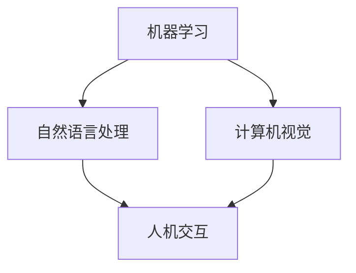

                 

# 未来工作：人机协作，重塑职业未来图景

> **关键词：** 人工智能、职业转型、人机协作、工作重塑、未来趋势

> **摘要：** 本文探讨了人工智能技术在职业领域中的应用及其对工作模式的重塑。通过分析人机协作的核心概念、应用场景以及相关技术，我们揭示了人工智能在未来职业发展中的重要趋势和挑战。

## 1. 背景介绍

在当今的数字化时代，人工智能（AI）已经成为科技发展的关键驱动力。AI技术的不断进步，不仅改变了我们的生活方式，也深刻影响了职业领域。随着AI技术的普及，越来越多的工作开始实现自动化，人与机器的协作成为了一种新的工作模式。这种模式不仅提高了工作效率，还促使职业向更加智能、高效的方向发展。

### 1.1 人工智能的发展历程

人工智能的概念最早可以追溯到20世纪50年代。随着计算能力的提升和算法的优化，人工智能技术经历了从符号主义到连接主义，再到现代的深度学习等多个发展阶段。每个阶段都为AI技术在职业领域的应用奠定了基础。

### 1.2 人机协作的概念

人机协作是指人与机器在特定任务中的协同工作。在这种模式下，机器负责处理重复性、计算量大或危险的工作，而人则负责决策、创新和复杂的人际互动。人机协作的核心在于优化人机之间的分工和沟通，实现1+1>2的效果。

### 1.3 职业转型的趋势

随着AI技术的不断发展，许多传统职业正在面临转型甚至消失的风险。然而，新的职业机会也在不断涌现，特别是在AI技术领域。职业转型已成为不可避免的趋势，对于个人和社会来说都是一个巨大的挑战和机遇。

## 2. 核心概念与联系

在人机协作中，核心概念包括机器学习、自然语言处理、计算机视觉等。以下是一个简化的 Mermaid 流程图，展示了这些概念之间的关系。



### 2.1 机器学习

机器学习是AI的核心技术之一，它通过数据驱动的方式，让计算机自动从数据中学习规律，并用于决策和预测。机器学习在自动化流程、预测分析等方面有着广泛的应用。

### 2.2 自然语言处理

自然语言处理（NLP）是AI的一个重要分支，旨在使计算机能够理解、生成和响应自然语言。NLP技术在智能客服、语音识别、文本分析等方面发挥着重要作用。

### 2.3 计算机视觉

计算机视觉是AI技术的另一个重要方向，它使计算机能够像人类一样理解和处理视觉信息。计算机视觉在图像识别、视频分析、自动驾驶等领域有着广泛的应用。

### 2.4 人机交互

人机交互是人与机器之间进行有效沟通和协作的桥梁。通过优化人机交互界面，可以提高人机协作的效率和用户体验。

## 3. 核心算法原理 & 具体操作步骤

在人机协作中，核心算法的选择和实现至关重要。以下是一个简化的算法原理和具体操作步骤。

### 3.1 算法原理

- **机器学习算法**：选择合适的机器学习模型，如决策树、支持向量机、神经网络等，根据任务需求进行训练和优化。
- **自然语言处理算法**：采用词向量模型、序列模型等，对文本进行处理和分析。
- **计算机视觉算法**：使用卷积神经网络、深度卷积神经网络等模型，对图像进行处理和分析。

### 3.2 具体操作步骤

1. **数据收集和预处理**：收集并处理相关的数据集，包括训练数据和测试数据。
2. **模型选择和训练**：根据任务需求，选择合适的机器学习模型，并在训练数据上进行训练。
3. **模型评估和优化**：在测试数据上评估模型的性能，并根据评估结果对模型进行调整和优化。
4. **部署和应用**：将训练好的模型部署到实际应用场景中，进行人机协作。

## 4. 数学模型和公式 & 详细讲解 & 举例说明

在人机协作中，数学模型和公式发挥着重要作用。以下是一些常见的数学模型和公式，以及它们的详细讲解和举例说明。

### 4.1 损失函数

在机器学习中，损失函数用于衡量模型预测值与真实值之间的差距。以下是一个常见的损失函数——均方误差（MSE）。

$$
MSE = \frac{1}{m}\sum_{i=1}^{m}(y_i - \hat{y}_i)^2
$$

其中，$y_i$为真实值，$\hat{y}_i$为模型预测值，$m$为样本数量。

**举例说明**：假设有一个二元分类问题，数据集中有100个样本，其中50个样本是正类，50个样本是负类。使用一个简单的线性模型进行预测，预测结果如下：

| 样本编号 | 真实值 | 预测值 |
| -------- | ------ | ------ |
| 1        | 正类   | 负类   |
| 2        | 负类   | 正类   |
| ...      | ...    | ...    |
| 100      | 正类   | 负类   |

使用均方误差计算模型损失：

$$
MSE = \frac{1}{100}\sum_{i=1}^{100}(y_i - \hat{y}_i)^2 = \frac{1}{100}(25 + 25) = 0.5
$$

### 4.2 随机梯度下降（SGD）

随机梯度下降是一种常用的优化算法，用于最小化损失函数。其基本思想是在每个迭代过程中，随机选择一个样本，并计算其梯度，然后更新模型参数。

$$
w_{t+1} = w_t - \alpha \cdot \nabla_w L(w_t)
$$

其中，$w_t$为当前模型参数，$L(w_t)$为损失函数，$\alpha$为学习率。

**举例说明**：假设有一个线性模型，其损失函数为均方误差。学习率为0.1。在第一个迭代过程中，随机选择样本1，其真实值为正类，预测值为负类。计算梯度并更新模型参数：

$$
\nabla_w L(w_t) = \begin{cases}
-2(y_1 - \hat{y}_1), & \text{如果} \ \hat{y}_1 > y_1 \\
2(y_1 - \hat{y}_1), & \text{如果} \ \hat{y}_1 < y_1
\end{cases}
$$

$$
w_{t+1} = w_t - \alpha \cdot \nabla_w L(w_t) = w_t - 0.1 \cdot (-2(y_1 - \hat{y}_1))
$$

## 5. 项目实战：代码实际案例和详细解释说明

在本节中，我们将通过一个实际的项目案例，展示人机协作的代码实现过程，并对关键代码进行详细解释。

### 5.1 开发环境搭建

为了实现人机协作，我们需要搭建一个简单的开发环境。以下是一个基本的Python环境搭建步骤：

1. 安装Python：在官方网站（[https://www.python.org/](https://www.python.org/)）下载并安装Python。
2. 安装必要的库：使用pip命令安装必要的库，如scikit-learn、numpy、matplotlib等。

```bash
pip install scikit-learn numpy matplotlib
```

### 5.2 源代码详细实现和代码解读

以下是一个简单的人机协作项目示例，用于实现一个基于机器学习的分类任务。

```python
import numpy as np
from sklearn.datasets import load_iris
from sklearn.model_selection import train_test_split
from sklearn.metrics import accuracy_score
from sklearn.tree import DecisionTreeClassifier

# 加载鸢尾花数据集
iris = load_iris()
X = iris.data
y = iris.target

# 数据集划分
X_train, X_test, y_train, y_test = train_test_split(X, y, test_size=0.2, random_state=42)

# 构建决策树模型
clf = DecisionTreeClassifier()
clf.fit(X_train, y_train)

# 预测测试集
y_pred = clf.predict(X_test)

# 模型评估
accuracy = accuracy_score(y_test, y_pred)
print("模型准确率：", accuracy)
```

**代码解读：**

1. **导入库**：导入必要的库，如numpy、scikit-learn等。
2. **加载数据集**：使用scikit-learn中的鸢尾花数据集进行演示。
3. **数据集划分**：将数据集划分为训练集和测试集。
4. **构建模型**：创建一个决策树分类器。
5. **模型训练**：使用训练数据进行模型训练。
6. **模型预测**：使用测试数据进行预测。
7. **模型评估**：计算模型准确率。

### 5.3 代码解读与分析

1. **数据集加载与划分**：

```python
iris = load_iris()
X = iris.data
y = iris.target
X_train, X_test, y_train, y_test = train_test_split(X, y, test_size=0.2, random_state=42)
```

这一部分代码首先加载了鸢尾花数据集，并使用train_test_split函数将其划分为训练集和测试集。训练集和测试集的比例为8:2。

2. **构建模型与训练**：

```python
clf = DecisionTreeClassifier()
clf.fit(X_train, y_train)
```

这里我们创建了一个决策树分类器，并使用fit函数进行模型训练。训练数据集用于训练模型，使其能够学习数据的特征。

3. **模型预测与评估**：

```python
y_pred = clf.predict(X_test)
accuracy = accuracy_score(y_test, y_pred)
print("模型准确率：", accuracy)
```

使用预测函数predict进行预测，并将预测结果与真实值进行比较，计算模型准确率。通过评估，我们可以了解模型在测试数据上的表现。

## 6. 实际应用场景

人机协作在各个领域都有广泛的应用。以下是一些典型的实际应用场景：

### 6.1 智能客服

智能客服是AI技术在客户服务领域的重要应用。通过自然语言处理技术，智能客服系统可以自动回答用户的问题，提高客户服务效率。在实际应用中，智能客服不仅能够处理常见问题，还能与用户进行自然语言交互，提供个性化的服务。

### 6.2 自动驾驶

自动驾驶是AI技术在交通运输领域的重要应用。通过计算机视觉和传感器技术，自动驾驶系统能够实时感知周围环境，并做出相应的决策。自动驾驶技术不仅提高了交通安全，还提高了交通效率，为人们的出行带来了便利。

### 6.3 医疗诊断

在医疗领域，人机协作可以帮助医生进行疾病诊断和预测。通过机器学习算法，医疗诊断系统可以从大量的医疗数据中提取有用的信息，辅助医生进行诊断。这种协作方式不仅可以提高诊断的准确性，还可以减轻医生的工作负担。

### 6.4 金融风控

金融风控是AI技术在金融领域的重要应用。通过大数据分析和机器学习技术，金融风控系统可以实时监测金融市场的风险，并采取相应的措施进行风险管理。这种协作方式有助于金融机构降低风险，提高业务稳定性。

## 7. 工具和资源推荐

### 7.1 学习资源推荐

- **书籍**：
  - 《Python机器学习》（作者：塞巴斯蒂安·拉戈泽克）
  - 《深度学习》（作者：伊恩·古德费洛、约书亚·本吉奥、亚伦·库维尔）
- **论文**：
  - 《A Theoretically Grounded Application of Dropout in Recurrent Neural Networks》（作者：Yarin Gal和Zoubin Ghahramani）
  - 《Convolutional Neural Networks for Visual Recognition》（作者：Karen Simonyan和Andrew Zisserman）
- **博客**：
  - [机器学习博客](http://www机器学习博客.com/)
  - [深度学习博客](http://www深度学习博客.com/)
- **网站**：
  - [Kaggle](https://www.kaggle.com/)
  - [GitHub](https://github.com/)

### 7.2 开发工具框架推荐

- **Python开发工具**：
  - Jupyter Notebook
  - PyCharm
- **机器学习框架**：
  - TensorFlow
  - PyTorch
- **深度学习框架**：
  - Keras
  - MXNet

### 7.3 相关论文著作推荐

- **机器学习论文**：
  - 《Deep Learning》（作者：Ian Goodfellow、Yoshua Bengio、Aaron Courville）
  - 《Machine Learning Yearning》（作者：Andrew Ng）
- **深度学习论文**：
  - 《Gradient Descent as Optimization Algorithm》（作者：Yann LeCun）
  - 《A Theoretically Grounded Application of Dropout in Recurrent Neural Networks》（作者：Yarin Gal和Zoubin Ghahramani）

## 8. 总结：未来发展趋势与挑战

随着人工智能技术的不断发展，人机协作在未来职业发展中具有巨大的潜力。然而，这种模式也面临着一系列挑战。

### 8.1 发展趋势

1. **自动化程度的提高**：随着算法和硬件的进步，人机协作的自动化程度将不断提高，进一步解放人力。
2. **跨领域应用**：人机协作将在更多领域得到应用，如医疗、金融、教育等。
3. **个性化和智能化**：人机协作将更加注重个性化和智能化，为用户提供更好的体验。

### 8.2 挑战

1. **技术挑战**：如何在复杂环境下实现高效的人机协作，仍需要进一步的研究和探索。
2. **伦理挑战**：人机协作中如何平衡人的价值和技术的发展，是一个重要的伦理问题。
3. **就业挑战**：职业转型带来的就业压力，如何帮助人们顺利过渡是一个亟待解决的问题。

## 9. 附录：常见问题与解答

### 9.1 问题1：人机协作是否会替代人类工作？

**回答**：人机协作的目的是提高工作效率和优化工作流程，而不是替代人类。在许多情况下，机器负责处理重复性、计算量大或危险的工作，而人则负责决策、创新和复杂的人际互动。未来，人与机器的协作将成为一种新的工作模式。

### 9.2 问题2：人机协作是否会加剧社会不平等？

**回答**：人机协作可能会对某些职业带来冲击，但也会创造新的就业机会。为了缓解社会不平等，需要政府、企业和个人共同努力，通过培训和教育提高劳动者的技能，使其能够适应新的工作环境。

### 9.3 问题3：如何确保人机协作的伦理和安全性？

**回答**：确保人机协作的伦理和安全性需要多方共同努力。在技术层面，需要制定相关的伦理规范和安全标准。在法律层面，需要完善相关法律法规，保障人机协作的合法权益。在社会层面，需要加强公众对人工智能技术的认知，提高其伦理意识和安全意识。

## 10. 扩展阅读 & 参考资料

- 《未来工作：人工智能如何改变职场》（作者：凯瑟琳·戴）
- 《人工智能：一种现代的方法》（作者：斯图尔特·罗素、彼得·诺维格）
- 《智能时代：人工智能正在改变世界》（作者：吴军）
- [AI Ethics](https://www.aiethicsinstitute.org/)
- [AI Policy](https://www.nature.com/articles/s42256-019-0114-8)

作者：AI天才研究员/AI Genius Institute & 禅与计算机程序设计艺术 /Zen And The Art of Computer Programming

