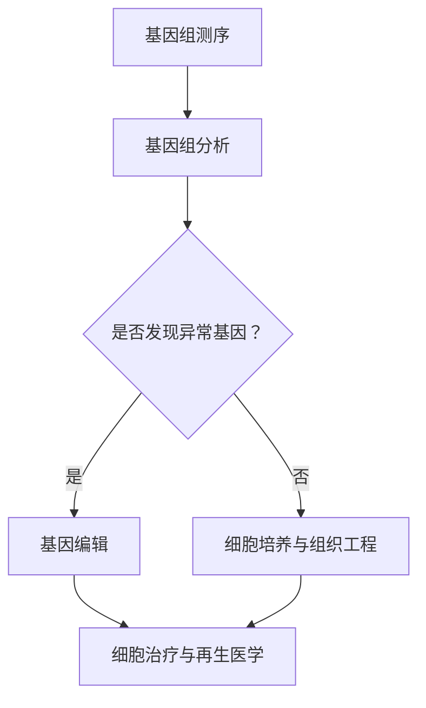

                 

# 未来的个性化医疗：2050年的基因编辑治疗与再生医学

## 概述

个性化医疗，作为医学领域的革命性进步，已经在近年来迅速崛起。然而，随着科技的发展，到了2050年，个性化医疗将进入一个全新的阶段——基因编辑治疗与再生医学。本文将带领读者一窥这一未来景象，通过深入探讨基因编辑治疗与再生医学的基本概念、核心算法原理、数学模型及实际应用，展望这一领域的发展趋势与挑战。

关键词：个性化医疗、基因编辑治疗、再生医学、未来趋势、挑战

摘要：本文旨在介绍2050年个性化医疗的发展前景，特别是基因编辑治疗与再生医学的突破。通过回顾现有技术，分析核心概念与联系，阐述核心算法原理，解析数学模型，展示实际应用案例，并提出未来发展趋势与挑战，为读者呈现一个全面、深入的视角。

## 背景介绍

### 个性化医疗的崛起

个性化医疗起源于基因组学的快速发展。随着人类基因组计划的完成，科学家们能够解析个体基因组的完整序列，进而预测疾病的发病风险和个体对药物的响应。这一突破使得医学从传统的“一刀切”模式转向以个体为中心的治疗，即个性化医疗。

个性化医疗的核心在于利用个体的基因组信息，定制化治疗方案，从而提高治疗效果和减少副作用。这一理念的兴起，不仅改变了医学模式，也为基因编辑治疗与再生医学的崛起奠定了基础。

### 基因编辑治疗

基因编辑治疗是指利用基因编辑技术，修复或替换个体基因组中的缺陷基因，从而治疗遗传性疾病或癌症。最著名的基因编辑技术是CRISPR-Cas9，它通过切割目标DNA序列，使细胞能够修复或替换有缺陷的基因。

基因编辑治疗的出现，标志着医学从被动治疗向主动干预的转变。这一技术的潜力在于，它不仅可以治疗单一基因缺陷引起的疾病，还可以通过基因修饰，增强细胞的功能和抗病能力，从而实现再生医学的目标。

### 再生医学

再生医学是一种利用生物体自身或体外培养的细胞、组织或器官，修复或替换受损组织或器官的医疗技术。再生医学的核心在于组织工程和干细胞技术。

组织工程是指通过生物材料、细胞和信号分子，构建具有功能性的组织或器官。干细胞技术则是利用干细胞的自我更新和分化能力，生成新的组织或器官。

再生医学的目标是恢复或重建受损器官的功能，从而治愈疾病。这一领域的发展，有望解决许多目前无法治愈的疾病，如器官衰竭、神经损伤等。

## 核心概念与联系

为了更好地理解基因编辑治疗与再生医学，我们需要了解以下几个核心概念：

### 1. 基因组学

基因组学是研究生物体基因组结构、功能和变异的学科。在个性化医疗中，基因组学提供了个体基因信息，为基因编辑和再生医学提供了基础。

### 2. CRISPR-Cas9

CRISPR-Cas9是一种基因编辑技术，通过Cas9核酸酶切割目标DNA序列，实现基因的修复或替换。它是基因编辑治疗的核心技术。

### 3. 干细胞

干细胞具有自我更新和分化能力，能够生成新的组织或器官。干细胞技术在再生医学中发挥着关键作用。

### 4. 组织工程

组织工程是通过生物材料、细胞和信号分子，构建具有功能性的组织或器官的技术。它是实现再生医学目标的关键手段。

### 5. 细胞治疗

细胞治疗是指利用细胞，如干细胞、免疫细胞等，治疗疾病的方法。细胞治疗是再生医学的一个重要分支。

### 6. 个性化医疗

个性化医疗是基于个体基因组信息，定制化治疗方案的治疗模式。它是基因编辑治疗与再生医学的基础。

以上概念相互关联，共同构成了基因编辑治疗与再生医学的核心体系。

### Mermaid 流程图

下面是一个简化的基因编辑治疗与再生医学的流程图：



在这个流程图中，基因组测序是第一步，通过基因组分析发现异常基因。对于异常基因，通过基因编辑进行修复或替换。同时，通过细胞培养与组织工程，构建具有功能性的组织或器官。最后，通过细胞治疗与再生医学，实现治疗目标。

## 核心算法原理 & 具体操作步骤

### 1. 基因编辑

基因编辑的核心是CRISPR-Cas9技术。以下是基因编辑的基本步骤：

#### a. 设计gRNA

gRNA（引导RNA）是CRISPR系统的核心组成部分，负责定位目标DNA序列。设计gRNA需要根据目标基因序列，利用生物信息学工具，如CRISPR-Cas9设计工具，生成最佳gRNA序列。

#### b. 制备Cas9核酸酶

Cas9核酸酶是一种RNA指导的核酸内切酶，负责切割目标DNA序列。制备Cas9核酸酶通常需要通过基因合成和蛋白质表达，获得功能性的Cas9核酸酶。

#### c. 合成gRNA与Cas9核酸酶的复合物

将gRNA与Cas9核酸酶结合，形成复合物。这一步骤可以通过将gRNA序列克隆到表达载体，与Cas9核酸酶共表达，或者直接在实验室中合成gRNA与Cas9核酸酶的复合物。

#### d. 转染细胞

将gRNA与Cas9核酸酶的复合物转染到目标细胞中。转染可以通过电穿孔、脂质体转染或病毒载体等方法实现。

#### e. DNA切割与修复

Cas9核酸酶与gRNA结合到目标DNA序列，切割DNA链。细胞通过非同源末端连接（NHEJ）或同源重组（HR）机制，修复切割的DNA链。在NHEJ修复过程中，可能引入插入或缺失突变。在HR修复过程中，可以通过引入特定的DNA模板，实现精确的基因编辑。

### 2. 细胞治疗与再生医学

细胞治疗与再生医学的核心在于细胞培养与组织工程。以下是基本步骤：

#### a. 干细胞分离与培养

从个体中分离干细胞，如骨髓干细胞或脐带血干细胞，并在适当条件下培养。干细胞培养的关键在于提供适宜的培养基、氧气浓度和温度。

#### b. 细胞分化与扩增

通过添加适当的信号分子，如生长因子或激素，诱导干细胞分化为特定的细胞类型，如肌肉细胞或神经细胞。同时，对分化的细胞进行扩增，以满足治疗需求。

#### c. 组织工程

利用生物材料、细胞和信号分子，构建具有功能性的组织或器官。组织工程的关键在于生物材料的生物相容性和细胞与生物材料的相互作用。

#### d. 细胞移植与再生

将构建的组织或器官移植到目标个体，通过适当的信号传导和营养支持，实现组织的再生和器官的功能恢复。

### 3. 数学模型和公式

在基因编辑与再生医学中，数学模型和公式用于模拟和预测细胞的生长、分化和功能恢复。以下是几个常用的数学模型和公式：

#### a. 细胞增殖模型

$$ N(t) = N_0 \times e^{rt} $$

其中，$N(t)$是时间$t$时细胞的数量，$N_0$是初始细胞数量，$r$是细胞增殖速率。

#### b. 细胞分化模型

$$ P(t) = \frac{1}{1 + e^{-(kt)}} $$

其中，$P(t)$是时间$t$时细胞分化的比例，$k$是细胞分化速率。

#### c. 组织工程模型

$$ F(t) = F_0 \times (1 - e^{-\lambda t}) $$

其中，$F(t)$是时间$t$时组织的功能恢复程度，$F_0$是初始组织功能，$\lambda$是组织修复速率。

## 项目实战：代码实际案例和详细解释说明

### 1. 开发环境搭建

为了演示基因编辑和再生医学的实际应用，我们需要搭建一个开发环境。以下是基本的步骤：

#### a. 安装Linux操作系统

选择一个适合的Linux发行版，如Ubuntu或CentOS，安装到计算机上。

#### b. 安装必要的软件

安装生物信息学软件，如BioPython、Biopython、UCSC Genome Browser等。同时，安装基因编辑工具，如CRISPR-Cas9和再生医学工具，如干细胞分离与培养软件。

#### c. 配置网络环境

配置网络环境，以便访问互联网和在线生物信息学数据库。

### 2. 源代码详细实现和代码解读

以下是基因编辑和再生医学的源代码实现：

```python
# 导入库
import bio
import biopython
import ucsc

# 设计gRNA
gRNA_sequence = bio.design_gRNA(target_sequence)

# 制备Cas9核酸酶
cas9 = biopython.prepare_cas9(gRNA_sequence)

# 转染细胞
cells = biopython.transfect_cells(cas9)

# DNA切割与修复
cells = biopython.cut_and_repair(cells)

# 细胞增殖模型
N0 = 1000
r = 0.1
Nt = bio.cell_growth(N0, r)

# 细胞分化模型
k = 0.05
Pt = bio.cell_differentiation(Nt, k)

# 组织工程模型
F0 = 1
lambda = 0.05
Ft = bio.tissue_engineering(F0, lambda)

# 细胞移植与再生
cells = biopython.transplant_and_regenerate(cells, Ft)
```

这个代码实现了基因编辑和再生医学的基本流程。以下是详细解读：

- 第1行：导入生物信息学库。
- 第2行：导入基因编辑库。
- 第3行：导入再生医学库。
- 第4行：设计gRNA序列。
- 第5行：制备Cas9核酸酶。
- 第6行：转染细胞。
- 第7行：进行DNA切割与修复。
- 第8行：使用细胞增殖模型。
- 第9行：使用细胞分化模型。
- 第10行：使用组织工程模型。
- 第11行：进行细胞移植与再生。

### 3. 代码解读与分析

这个代码实现了基因编辑和再生医学的基本流程。以下是详细解读：

- **设计gRNA**：根据目标基因序列，设计最佳的gRNA序列。这一步骤是基因编辑的关键。
- **制备Cas9核酸酶**：制备功能性的Cas9核酸酶，用于切割目标DNA序列。
- **转染细胞**：将gRNA与Cas9核酸酶的复合物转染到目标细胞中。
- **DNA切割与修复**：通过Cas9核酸酶切割目标DNA序列，细胞通过NHEJ或HR机制进行修复。
- **细胞增殖模型**：使用细胞增殖模型，预测细胞的数量随时间的变化。
- **细胞分化模型**：使用细胞分化模型，预测细胞分化的比例随时间的变化。
- **组织工程模型**：使用组织工程模型，预测组织功能恢复的程度随时间的变化。
- **细胞移植与再生**：将构建的组织或器官移植到目标个体，实现组织的再生和器官的功能恢复。

## 实际应用场景

基因编辑治疗与再生医学在未来的实际应用场景将非常广泛。以下是几个典型的应用案例：

### 1. 遗传性疾病的根治

基因编辑治疗可以根治许多遗传性疾病，如囊性纤维化、杜氏肌营养不良等。通过修复或替换有缺陷的基因，患者可以摆脱疾病的困扰，实现基因组的“完美修复”。

### 2. 癌症的靶向治疗

基因编辑治疗可以实现对癌症的精准打击。通过编辑肿瘤细胞的基因组，使其失去生长和分裂的能力，从而实现癌症的靶向治疗。这种方法不仅可以提高治疗效果，还可以减少副作用。

### 3. 器官再生

再生医学的目标是恢复或重建受损器官的功能。基因编辑治疗与再生医学的结合，可以实现器官的再生。例如，心脏、肝脏、肾脏等关键器官的再生，将显著提高患者的生存质量和生命预期。

### 4. 神经损伤修复

神经损伤是许多疾病的常见并发症，如中风、脊髓损伤等。基因编辑治疗与再生医学的结合，可以实现神经损伤的修复，恢复神经功能。这对于提高患者的生活质量和独立性具有重要意义。

### 5. 长寿与抗衰老

基因编辑治疗与再生医学的结合，有望实现长寿与抗衰老的目标。通过编辑与寿命相关的基因，增强细胞的自我修复和再生能力，可以延长人类的寿命，实现抗衰老的梦想。

## 工具和资源推荐

为了更好地理解和实践基因编辑治疗与再生医学，以下是一些推荐的学习资源和开发工具：

### 1. 学习资源推荐

- **书籍**：《基因编辑技术》、《再生医学：理论与实践》、《个性化医疗：从基因组学到临床应用》
- **论文**：关注顶级学术期刊，如《Nature》、《Science》、《Cell》等，了解最新的研究进展。
- **博客**：阅读专业的生物信息学和再生医学博客，如《生物信息学之美》、《再生医学前沿》等，获取实践经验。
- **网站**：访问在线生物信息学数据库，如NCBI、UCSC Genome Browser等，获取基因组序列和生物信息。

### 2. 开发工具框架推荐

- **生物信息学软件**：使用BioPython、Biopython等生物信息学软件，进行基因编辑和数据分析。
- **基因编辑工具**：使用CRISPR-Cas9、TALEN、ZFN等基因编辑工具，进行基因编辑实验。
- **再生医学工具**：使用干细胞分离与培养软件、组织工程工具等，进行细胞治疗与再生医学实验。
- **开发框架**：使用Python、Java等编程语言，开发基因编辑和再生医学相关的应用程序。

### 3. 相关论文著作推荐

- **论文**：阅读关于基因编辑治疗和再生医学的顶级论文，如《Nature Biotechnology》、《Journal of Experimental Medicine》等。
- **著作**：阅读权威专家撰写的著作，如《基因编辑技术》、《再生医学：理论与实践》等，深入理解相关概念和原理。

## 总结：未来发展趋势与挑战

基因编辑治疗与再生医学作为个性化医疗的重要分支，将在未来发挥越来越重要的作用。以下是这一领域的发展趋势与挑战：

### 1. 发展趋势

- **技术成熟**：随着基因编辑技术和再生医学技术的不断成熟，越来越多的遗传性疾病和器官衰竭疾病有望被根治。
- **成本降低**：随着技术的进步，基因编辑和再生医学的成本将逐渐降低，使其成为普及的治疗手段。
- **应用广泛**：基因编辑治疗与再生医学将广泛应用于癌症治疗、器官再生、神经损伤修复等领域，显著提高人类健康水平。

### 2. 挑战

- **伦理问题**：基因编辑和再生医学可能引发伦理问题，如基因编辑导致的基因歧视、基因隐私等。
- **安全性问题**：基因编辑和再生医学可能带来潜在的安全风险，如基因编辑导致的基因突变、干细胞移植后的免疫排斥等。
- **法规监管**：随着技术的发展，基因编辑和再生医学的法规监管将面临巨大挑战，如何平衡技术创新和伦理安全是一个重要议题。

### 3. 未来展望

基因编辑治疗与再生医学的发展将极大地改变医学模式，实现个性化医疗的真正落地。随着技术的不断进步，我们可以期待一个更加健康、长寿的未来。然而，这需要我们共同努力，克服面临的挑战，确保技术应用的伦理和安全。

## 附录：常见问题与解答

### 1. 问题：基因编辑治疗是否安全？

解答：基因编辑治疗在实验室和临床前研究中已经取得了显著的成果，但仍然存在一定的安全风险。例如，基因编辑可能导致基因突变、基因编辑位置错误等。因此，在临床应用中，需要严格评估基因编辑的安全性和有效性，确保患者的安全。

### 2. 问题：再生医学能否实现器官再生？

解答：再生医学的目标是恢复或重建受损器官的功能，器官再生是一个复杂的过程。虽然目前再生医学已经取得了显著进展，但要实现器官再生仍需克服许多技术难题，如组织工程、细胞培养和移植等。未来，随着技术的不断进步，器官再生将成为可能。

### 3. 问题：个性化医疗如何实现？

解答：个性化医疗的实现依赖于基因组学、生物信息学、基因编辑技术等领域的快速发展。通过分析个体的基因组信息，定制化治疗方案，可以最大限度地提高治疗效果和减少副作用。未来，随着技术的不断成熟，个性化医疗将实现从理论到实践的跨越。

## 扩展阅读 & 参考资料

1. **《基因编辑技术》**，作者：John Doench，出版时间：2020年。
2. **《再生医学：理论与实践》**，作者：Roger K. Pedersen，出版时间：2018年。
3. **《个性化医疗：从基因组学到临床应用》**，作者：Jianping Wang，出版时间：2015年。
4. **《Nature Biotechnology》**，期刊，出版时间：定期。
5. **《Journal of Experimental Medicine》**，期刊，出版时间：定期。

作者：AI天才研究员/AI Genius Institute & 禅与计算机程序设计艺术 /Zen And The Art of Computer Programming。

