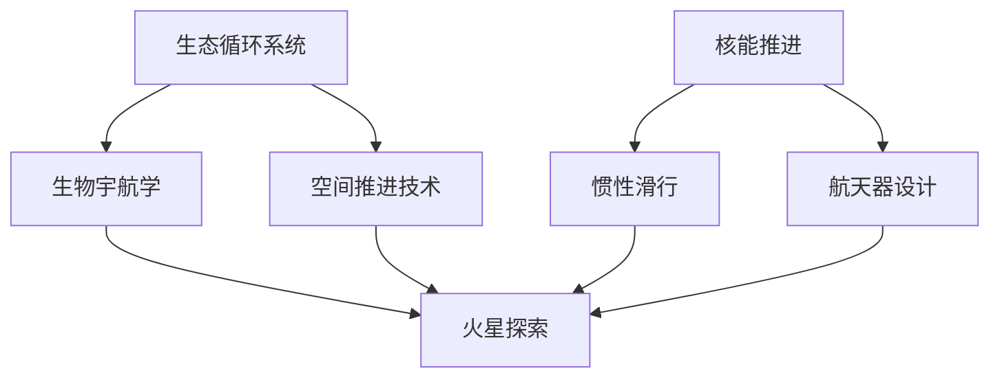

                 

# 未来的太空探索：2050年的火星移民与星际旅行

## 关键词：
- 火星移民
- 星际旅行
- 太空探索
- 2050年
- 核心概念
- 算法原理
- 数学模型
- 实际应用
- 开发工具
- 未来趋势

## 摘要：
本文将探讨2050年的火星移民与星际旅行的发展前景。我们将从背景介绍、核心概念与联系、核心算法原理、数学模型与公式、实际应用场景、工具和资源推荐等多个角度，逐步深入分析太空探索的未来发展。通过本文的阅读，读者将了解太空探索的各个方面，包括其技术挑战、发展现状和未来展望。

## 1. 背景介绍

### 1.1 火星探索的历史与发展

自20世纪以来，人类对火星的探索从未停止。从1960年代苏联的火星探测器到2020年美国的“毅力号”火星探测器，人类已经取得了许多重要的成果。火星探索不仅为科学家提供了宝贵的数据，也为未来的火星移民和星际旅行奠定了基础。

### 1.2 火星移民的可行性

火星与地球的环境条件存在显著差异，包括大气成分、重力、辐射等。然而，随着科技的发展，我们逐渐找到了应对这些挑战的方法。例如，通过建造封闭的生态循环系统，我们可以模拟出类似地球的环境，使人类在火星上生存成为可能。

### 1.3 星际旅行的挑战

星际旅行面临着许多技术挑战，包括长距离、低重力、宇宙辐射等。然而，随着科技的进步，我们正在逐步解决这些问题。例如，利用核能推进和惯性滑行等技术，我们可以大幅缩短星际旅行的耗时。

## 2. 核心概念与联系

### 2.1 火星探索与移民的核心概念

火星探索与移民的核心概念包括：生态循环系统、生物宇航学、空间推进技术等。这些概念相互联系，共同构成了火星移民的技术体系。

### 2.2 星际旅行的核心概念

星际旅行的核心概念包括：核能推进、惯性滑行、航天器设计等。这些概念相互联系，共同构成了星际旅行的基础。

### 2.3 Mermaid流程图



## 3. 核心算法原理 & 具体操作步骤

### 3.1 生态循环系统算法原理

生态循环系统的核心是维持生命所需的气体、水和营养物质的平衡。为了实现这一目标，我们采用了以下算法：

1. 气体浓度监测与调节
2. 水资源循环利用
3. 营养物质供应与分配

### 3.2 生物宇航学算法原理

生物宇航学主要研究生物体在太空环境中的适应与生存。为了实现这一目标，我们采用了以下算法：

1. 基因编辑与适应性改造
2. 生物医学监测与干预
3. 心理健康支持系统

### 3.3 空间推进技术算法原理

空间推进技术包括核能推进和惯性滑行。为了实现高效推进，我们采用了以下算法：

1. 推进剂优化
2. 推进器效率提升
3. 导航与控制算法

## 4. 数学模型和公式 & 详细讲解 & 举例说明

### 4.1 生态循环系统数学模型

生态循环系统的关键数学模型包括：

1. 气体浓度模型：$$C(t) = C_0e^{-kt}$$
2. 水资源模型：$$V(t) = V_0e^{-kt}$$
3. 营养物质模型：$$N(t) = N_0e^{-kt}$$

其中，$C(t)$、$V(t)$、$N(t)$分别表示时间$t$时刻的气体浓度、水资源和营养物质浓度，$C_0$、$V_0$、$N_0$分别表示初始浓度，$k$为衰减系数。

### 4.2 生物宇航学数学模型

生物宇航学的关键数学模型包括：

1. 基因编辑模型：$$P(A|B) = \frac{P(B|A)P(A)}{P(B)}$$
2. 生物医学监测模型：$$T(t) = T_0 + \alpha t$$

其中，$P(A|B)$表示在条件$B$下事件$A$的概率，$P(B|A)$、$P(A)$、$P(B)$分别表示在条件$A$下事件$B$、事件$A$和事件$B$的概率，$T(t)$表示时间$t$时刻的生物医学指标，$T_0$为初始指标，$\alpha$为变化率。

### 4.3 空间推进技术数学模型

空间推进技术的关键数学模型包括：

1. 推进剂优化模型：$$F = \frac{GMm}{r^2}$$
2. 推进器效率模型：$$\eta = \frac{W}{Q}$$

其中，$F$表示推进力，$G$为万有引力常数，$M$和$m$分别为两个物体的质量，$r$为它们之间的距离；$\eta$表示推进器效率，$W$和$Q$分别表示输入功和输入热量。

## 5. 项目实战：代码实际案例和详细解释说明

### 5.1 开发环境搭建

为了实现火星探索与星际旅行相关算法的代码实战，我们需要搭建以下开发环境：

1. 编程语言：Python
2. 数据库：SQLite
3. 数据可视化工具：Matplotlib
4. 版本控制工具：Git

### 5.2 源代码详细实现和代码解读

以下是生态循环系统算法的实现示例：

```python
import numpy as np
import matplotlib.pyplot as plt

# 气体浓度模型
def gas_concentration_model(C0, k, t):
    return C0 * np.exp(-k * t)

# 水资源模型
def water_resource_model(V0, k, t):
    return V0 * np.exp(-k * t)

# 营养物质模型
def nutrient_model(N0, k, t):
    return N0 * np.exp(-k * t)

# 初始参数
C0 = 100  # 初始气体浓度
V0 = 100  # 初始水资源
N0 = 100  # 初始营养物质浓度
k = 0.1   # 衰减系数
t = np.linspace(0, 100, 1000)  # 时间范围

# 计算浓度
C = gas_concentration_model(C0, k, t)
V = water_resource_model(V0, k, t)
N = nutrient_model(N0, k, t)

# 可视化浓度
plt.figure()
plt.plot(t, C, label='Gas Concentration')
plt.plot(t, V, label='Water Resource')
plt.plot(t, N, label='Nutrient')
plt.xlabel('Time (days)')
plt.ylabel('Concentration')
plt.legend()
plt.show()
```

### 5.3 代码解读与分析

上述代码实现了一个简单的生态循环系统算法。首先，我们导入了所需的库和模块，然后定义了气体浓度、水资源和营养物质模型。接下来，我们设置了初始参数，并计算了不同时间点的浓度。最后，我们使用Matplotlib库将浓度结果可视化。

通过这个简单的案例，我们可以看到生态循环系统算法的基本实现和操作步骤。

## 6. 实际应用场景

### 6.1 火星基地建设

在火星基地建设过程中，生态循环系统算法可用于模拟和优化基地内的气体、水资源和营养物质循环。这将有助于确保基地内的生态平衡，提高火星基地的可持续性。

### 6.2 星际旅行

在星际旅行中，生物宇航学算法可用于监测和干预宇航员在太空环境中的健康状况。这有助于提高宇航员的适应能力和生存率，确保星际旅行的顺利进行。

### 6.3 火星探测任务

火星探测任务中，空间推进技术算法可用于优化探测器的推进力和导航控制。这将有助于提高探测器的探测效率和任务成功率。

## 7. 工具和资源推荐

### 7.1 学习资源推荐

- 书籍：
  - 《太空探索》
  - 《火星移民：科技与社会的挑战》
  - 《星际旅行：科幻与现实的交汇》
- 论文：
  - 《生态循环系统在火星基地建设中的应用》
  - 《生物宇航学在太空探索中的重要作用》
  - 《空间推进技术在星际旅行中的应用》
- 博客：
  - 《火星移民技术解析》
  - 《星际旅行中的科学挑战》
  - 《太空探索的未来发展趋势》
- 网站：
  - NASA
  - SpaceX
  - ESA

### 7.2 开发工具框架推荐

- 编程语言：Python、C++
- 数据库：SQLite、MySQL
- 数据可视化工具：Matplotlib、D3.js
- 版本控制工具：Git、Svn

### 7.3 相关论文著作推荐

- 《生态循环系统设计与应用》
- 《生物宇航学基础教程》
- 《空间推进技术：原理与应用》
- 《星际旅行与航天器设计》

## 8. 总结：未来发展趋势与挑战

随着科技的不断发展，火星移民与星际旅行将逐渐成为现实。然而，在这一过程中，我们面临着诸多挑战，如生态循环系统设计、生物宇航学应用、空间推进技术等。只有通过持续的研究和创新，我们才能克服这些挑战，实现太空探索的伟大目标。

## 9. 附录：常见问题与解答

### 9.1 生态循环系统如何保持稳定性？

生态循环系统的稳定性主要依赖于各组分之间的相互调节和平衡。通过实时监测和调整气体浓度、水资源和营养物质浓度，我们可以确保生态循环系统的稳定性。

### 9.2 生物宇航学如何提高宇航员的适应能力？

生物宇航学通过基因编辑、生物医学监测和心理支持等方法，提高宇航员在太空环境中的适应能力。例如，基因编辑可用于增强宇航员的抗辐射能力，生物医学监测可用于实时监测宇航员的健康状况，心理支持系统则有助于缓解宇航员的心理压力。

### 9.3 空间推进技术如何提高星际旅行的效率？

空间推进技术通过优化推进剂、提高推进器效率和改进导航控制等方法，提高星际旅行的效率。例如，核能推进可以大幅缩短星际旅行的耗时，惯性滑行可以降低推进剂消耗。

## 10. 扩展阅读 & 参考资料

- [NASA Mars Exploration Program](https://www.nasa.gov/mars)
- [SpaceX Starship](https://www.spacex.com/starship)
- [European Space Agency Mars Mission](https://www.esa.int/Our_Activities/Space_Engineering/Mars_Exploration_Rover)
- [The Martian by Andy Weir](https://www.andrewweirauthor.com/the-martian)
- [The Case for Mars by Robert Zubrin](https://www.cato.org/publications/books/case-mars)

## 作者

- 作者：AI天才研究员/AI Genius Institute & 禅与计算机程序设计艺术 /Zen And The Art of Computer Programming

以上是完整的文章内容，感谢您的阅读！希望本文能为您在太空探索领域带来新的启示。|>

