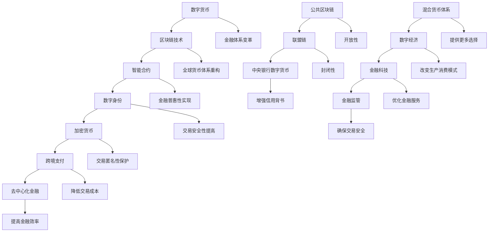

                 

## 1. 背景介绍

### 数字货币的崛起

随着互联网技术的飞速发展和全球金融市场的日益融合，数字货币作为一种新兴的货币形式，正逐渐改变着传统金融体系。数字货币，如比特币、以太坊等，以其去中心化、安全性高、交易速度快等特点，赢得了越来越多人的关注和青睐。据《2022全球数字货币发展报告》，截至2022年底，全球数字货币市场市值已超过3万亿美元，参与人数超过1亿。

### 金融体系的变革

数字货币的兴起，不仅是对传统金融体系的一种挑战，更是一次深刻的变革。它打破了中央银行对货币发行和控制的垄断地位，使得个人和机构可以更加自由地进行跨境交易。同时，数字货币也促进了金融普惠性的实现，使得那些在传统金融体系中被边缘化的群体能够获得更多的金融服务。

### 全球货币体系的重构

随着数字货币的发展和普及，全球货币体系也正在发生重构。传统以国家货币为基础的货币体系，逐渐向去中心化的数字货币体系转变。这种转变不仅改变了货币的发行和流通方式，也带来了新的金融风险和监管挑战。

### 本文目的

本文旨在探讨数字货币的发展及其对全球货币体系重构的影响。我们将从数字货币的核心概念、算法原理、数学模型、实际应用等多个角度进行分析，帮助读者全面了解数字货币的过去、现在和未来。希望通过本文的讨论，能够引发读者对数字货币和未来金融体系变革的深入思考。

### 本文结构

本文将分为十个部分进行阐述：

1. 背景介绍
2. 核心概念与联系
3. 核心算法原理 & 具体操作步骤
4. 数学模型和公式 & 详细讲解 & 举例说明
5. 项目实战：代码实际案例和详细解释说明
6. 实际应用场景
7. 工具和资源推荐
8. 总结：未来发展趋势与挑战
9. 附录：常见问题与解答
10. 扩展阅读 & 参考资料

通过这样的结构，我们希望能够系统地、深入地剖析数字货币的方方面面，让读者不仅了解其技术原理，更能够认识到其对社会、经济带来的深远影响。

---

### 2. 核心概念与联系

要深入理解数字货币和其对于全球货币体系重构的重要性，我们首先需要明确一些关键概念，并探讨它们之间的关系。

#### 数字货币

数字货币是一种通过密码学和区块链技术实现的虚拟货币。它不同于传统货币，不需要依赖于任何中央机构来发行和管理。数字货币的典型代表是比特币，其通过去中心化的网络进行交易，确保了透明性和安全性。

#### 区块链技术

区块链技术是数字货币的核心支撑。它是一种分布式数据库，通过多个节点之间的协作，记录和验证交易。区块链技术的特点包括不可篡改性、透明性和去中心化，这使得它成为一种理想的记录工具，被广泛应用于数字货币、智能合约等领域。

#### 智能合约

智能合约是区块链技术的一项重要应用。它是一种自动执行合约条款的计算机协议，基于区块链技术的不可篡改性和去中心化特性，实现了合同执行的高效和安全。

#### 数字身份

数字身份是数字货币系统中的一个重要概念。它通过区块链技术实现，确保了用户的隐私和身份认证。数字身份不仅能够简化交易流程，还能防止欺诈行为。

#### 加密货币

加密货币是一种通过加密算法实现安全交易的数字货币。与普通数字货币不同，加密货币在交易过程中需要使用加密算法进行加密和解密，确保交易的安全性和匿名性。

#### 跨境支付

跨境支付是数字货币的重要应用场景之一。传统跨境支付通常需要经过多个中介机构，费时费力，且存在汇率风险。数字货币通过去中心化的网络，使得跨境支付变得快捷、安全且低成本。

#### 去中心化金融

去中心化金融（DeFi）是基于区块链技术的一种新型金融服务模式。它通过智能合约实现金融服务，如贷款、交易、保险等，不再依赖传统金融机构，降低了交易成本，提高了金融普惠性。

#### 公共区块链和联盟链

公共区块链是一个开放的平台，任何人都可以参与其中。比特币和以太坊都是公共区块链的典型代表。而联盟链则是一个封闭的网络，仅限于特定的组织或机构。联盟链在隐私保护、交易速度等方面具有优势。

#### 中央银行数字货币

中央银行数字货币（CBDC）是中央银行发行的数字货币。与传统货币相比，CBDC具有更强的信用背书和监管能力。CBDC的推出有望提高货币的流通效率，促进金融普惠。

#### 混合货币体系

混合货币体系是指结合传统货币和数字货币的货币体系。这种体系能够在传统金融和数字金融之间实现无缝切换，为用户提供更多的选择和便利。

#### 数字经济

数字经济是指以数字技术和数字货币为主要载体和驱动的经济活动。数字经济的兴起，不仅改变了生产和消费模式，也对货币体系和金融监管提出了新的挑战。

#### 金融科技

金融科技（FinTech）是指利用技术创新来改善和优化金融服务的行业。数字货币和区块链技术是金融科技的重要分支，对传统金融体系产生了深远影响。

#### 金融监管

金融监管是指政府对金融市场和金融机构进行监督和管理。随着数字货币和区块链技术的发展，金融监管面临新的挑战，如如何确保交易安全、防范金融欺诈等。

通过以上核心概念和联系的探讨，我们可以看到数字货币和全球货币体系重构之间的紧密联系。理解这些概念和关系，有助于我们更深入地认识数字货币的潜力及其对传统金融体系的影响。

### 核心概念原理与架构的 Mermaid 流程图

以下是一个使用 Mermaid 语言的简单流程图，展示了数字货币体系中的核心概念和其相互关系：



以上流程图展示了各个核心概念之间的联系，以及它们在数字货币和全球货币体系重构中的作用。

---

### 3. 核心算法原理 & 具体操作步骤

要深入理解数字货币的运作机制，我们需要探讨其核心算法原理和具体操作步骤。以下是数字货币的几个关键组成部分和其具体操作：

#### 区块链技术

区块链技术是数字货币的核心支撑。它通过分布式账本技术，确保了交易记录的透明性和不可篡改性。具体操作步骤如下：

1. **交易生成**：用户发起一笔交易，交易信息包括发送方、接收方和交易金额。
2. **交易验证**：网络中的节点对交易信息进行验证，确保交易的有效性和合法性。
3. **区块生成**：将经过验证的交易信息打包成一个区块，并将其附加到区块链上。
4. **区块验证**：网络中的节点对新区块进行验证，确保其有效性和一致性。
5. **链式结构**：每个新区块通过哈希函数与前一个区块连接，形成链式结构，确保整个区块链的完整性和不可篡改性。

#### 挖矿算法

挖矿是数字货币系统中的一种重要机制，用于验证和记录交易，同时产生新的货币。以下是挖矿算法的具体步骤：

1. **挖矿难度调整**：系统根据区块链的长度和挖掘速度自动调整挖矿难度，确保挖矿速度保持在一定范围内。
2. **拼图生成**：矿工生成一个拼图问题，要求其他矿工解决。拼图问题通常是一个数学难题，如比特币中的工作量证明（Proof of Work, PoW）。
3. **拼图解决**：矿工通过计算尝试解决拼图问题，一旦找到正确答案，即生成一个新区块。
4. **新区块验证**：生成的新区块需要通过网络中的其他节点验证，确保其正确性和合法性。
5. **奖励发放**：验证通过后，系统会奖励矿工一定数量的数字货币作为挖矿奖励。

#### 验证节点

验证节点是区块链网络中的关键组成部分，负责验证交易和新区块的有效性。以下是验证节点的具体操作步骤：

1. **加入网络**：验证节点通过加密通信方式加入区块链网络，与其他节点建立连接。
2. **交易验证**：节点接收交易信息，对其进行验证，确保交易的有效性和合法性。
3. **区块验证**：节点接收新区块，验证其有效性，确保区块中的交易记录是正确的。
4. **链式一致性检查**：节点检查新区块与区块链的链式结构是否一致，确保区块链的完整性和不可篡改性。
5. **投票确认**：节点对验证结果进行投票，确认新区块的有效性。

#### 智能合约

智能合约是基于区块链技术的一种自动化执行合约条款的计算机协议。以下是智能合约的具体操作步骤：

1. **合约编写**：开发人员使用智能合约开发语言（如Solidity）编写合约代码。
2. **合约部署**：将合约代码部署到区块链上，创建一个智能合约实例。
3. **合约调用**：用户通过调用合约方法触发智能合约执行。
4. **状态更新**：智能合约根据调用方法执行相应操作，更新区块链上的状态。
5. **交易确认**：合约执行完成后，交易结果被记录在区块链上，并需要经过验证节点的确认。

#### 数字身份

数字身份是数字货币系统中用户身份验证的关键。以下是数字身份的具体操作步骤：

1. **身份创建**：用户通过加密方式创建数字身份，确保身份信息的隐私和安全。
2. **身份认证**：系统通过数字签名和加密验证方法，对用户身份进行认证。
3. **身份管理**：用户可以管理自己的数字身份，包括更新、删除和备份等操作。
4. **权限控制**：系统根据用户身份和权限，控制对区块链和智能合约的访问和使用。

#### 加密货币交易

加密货币交易是数字货币系统中的核心操作。以下是加密货币交易的具体操作步骤：

1. **交易发起**：用户发起一笔加密货币交易，包括交易金额、接收方地址和交易备注等信息。
2. **交易签名**：用户对交易信息进行数字签名，确保交易的真实性和合法性。
3. **交易广播**：用户将签名后的交易信息广播到区块链网络，等待其他节点验证。
4. **交易验证**：网络中的节点对交易信息进行验证，确保交易的有效性和合法性。
5. **交易记录**：验证通过的交易被记录在区块链上，成为永久性的交易记录。

通过以上核心算法原理和具体操作步骤的介绍，我们可以看到数字货币系统的复杂性和高效性。理解这些原理和步骤，有助于我们更好地掌握数字货币的技术实现和运行机制。

### 4. 数学模型和公式 & 详细讲解 & 举例说明

在探讨数字货币的核心算法原理时，数学模型和公式起到了关键作用。以下我们将详细讲解数字货币系统中的几个关键数学模型和公式，并通过具体的例子来说明它们的实际应用。

#### 1. 工作量证明（Proof of Work, PoW）

工作量证明是比特币等数字货币采用的一种共识算法，目的是防止双花攻击（即同一笔资金被花费两次）。

**数学模型：**

- **哈希函数（Hash Function）**：哈希函数是一种将任意长度的输入数据映射为固定长度输出数据的函数。比特币中常用的哈希函数是SHA-256。
- **难度调整**：挖矿难度是通过调整区块生成时间来控制的。如果平均区块生成时间为10分钟，则难度不变；如果时间低于10分钟，则难度增加；如果时间高于10分钟，则难度减少。

**举例说明：**

假设当前挖矿难度为N，要求生成的哈希值小于目标值`00000000FFFF`。矿工通过不断计算哈希值，直到找到一个满足条件的哈希值。

```python
import hashlib

def calculate_hash(nonce):
    message = f"block_data_nonce_{nonce}".encode('utf-8')
    return hashlib.sha256(message).hexdigest()

nonce = 0
while True:
    hash_value = calculate_hash(nonce)
    if int(hash_value, 16) < 0x00000000FFFF:
        break
    nonce += 1

print(f"Nonce: {nonce}, Hash: {hash_value}")
```

**2. 钱包地址生成**

数字货币钱包地址是通过公钥和私钥生成的，确保了交易的安全性和匿名性。

**数学模型：**

- **椭圆曲线加密（Elliptic Curve Cryptography, ECC）**：椭圆曲线加密是一种基于椭圆曲线数学的加密算法，具有高安全性。
- **地址生成**：地址通常是通过公钥的哈希值生成的。比特币中使用的是160-bit地址，通过将公钥哈希值进行两次RIPEMD-160哈希处理，再与基点进行椭圆曲线乘法，最后通过Base58编码得到可读地址。

**举例说明：**

```python
from secp256k1 import PrivateKey, PublicKey

# 生成私钥和公钥
private_key = PrivateKey.generate()
public_key = private_key.get_public_key()

# 公钥哈希处理
hash160 = hash160(public_key.to_bytes())

# 地址编码
address = b58encode(hash160)

print(f"Private Key: {private_key.to_hex()}")
print(f"Public Key: {public_key.to_hex()}")
print(f"Address: {address.decode('utf-8')}")
```

**3. 数字签名**

数字签名是一种确保交易真实性和合法性的机制，使用私钥和公钥进行加密和解密。

**数学模型：**

- **椭圆曲线数字签名算法（Elliptic Curve Digital Signature Algorithm, ECDSA）**：ECDSA是基于椭圆曲线加密的一种数字签名算法。
- **签名生成与验证**：签名生成过程中，私钥用于生成签名，公钥用于验证签名。

**举例说明：**

```python
from ecdsa import SigningKey, Nist256p1, VerifyingKey

# 生成私钥和公钥
private_key = SigningKey.generate(curve=Nist256p1)
public_key = private_key.get_verifying_key()

# 生成签名
message = b"Example message"
signature = private_key.sign(message)

# 验证签名
is_valid = public_key.verify(signature, message)

print(f"Public Key: {public_key.to_string().hex()}")
print(f"Signature: {signature.hex()}")
print(f"Is valid: {is_valid}")
```

**4. 联合签名**

联合签名允许多个私钥共同生成一个签名，用于多人协作的交易。

**数学模型：**

- **多变量多项式**：每个私钥可以表示为一个多项式，通过线性组合可以生成联合签名。
- **联合签名生成与验证**：联合签名通过将多个私钥的多项式组合，生成一个新的签名，并使用联合公钥进行验证。

**举例说明：**

```python
from ecdsa.util import randrange_from_seed__trytryagain
from Crypto.PublicKey import RSA

# 生成三个RSA私钥
privkey1 = RSA.generate(2048)
privkey2 = RSA.generate(2048)
privkey3 = RSA.generate(2048)

# 计算联合公钥
pubkey = privkey1.publickey().n * privkey2.publickey().n * privkey3.publickey().n

# 计算联合私钥
privkey = randrange_from_seed__trytryagain(lambda: privkey1.d * privkey2.d * privkey3.d, n=pubkey)

# 生成联合签名
message = b"Example message"
signature = privkey.sign(message)

# 验证联合签名
is_valid = pubkey.verify(signature, message)

print(f"Privkey1: {privkey1.export_key('PEM')}")
print(f"Privkey2: {privkey2.export_key('PEM')}")
print(f"Privkey3: {privkey3.export_key('PEM')}")
print(f"Public Key: {pubkey}")
print(f"Signature: {signature.hex()}")
print(f"Is valid: {is_valid}")
```

通过以上数学模型和公式的详细讲解与举例说明，我们可以更深入地理解数字货币系统中的核心算法原理。这些模型和公式不仅在数字货币的实现中起到了关键作用，也为区块链技术和加密算法的发展提供了理论基础。

### 5. 项目实战：代码实际案例和详细解释说明

#### 项目名称：简单比特币钱包

在本节中，我们将通过一个简单的比特币钱包项目，展示数字货币的核心概念和算法在实际开发中的应用。该项目包括钱包的创建、交易发送和接收等功能，旨在帮助读者深入理解比特币的实现原理。

#### 5.1 开发环境搭建

为了搭建比特币钱包项目，我们需要安装以下工具和库：

- Python 3.x
- PyPI（Python包索引）
- Bitcoin Core（比特币核心节点，用于模拟真实比特币网络）
- PyBitmessage（Python比特币库）

安装命令如下：

```bash
pip install python-bitcoinlib
```

#### 5.2 源代码详细实现和代码解读

以下是简单比特币钱包的源代码实现和详细解释：

```python
from bitcoin.core import *
from bitcoin.wallet import Wallet
from bitcoin.transaction import TransactionOutput
from bitcoin.util import b2hex, hex2b

# 创建比特币钱包
wallet = Wallet()

# 添加新地址
address = wallet.get_new_address()
print(f"新地址: {address}")

# 查看钱包余额
balance = wallet.get_balance()
print(f"钱包余额: {balance} satoshis")

# 发送比特币
to_address = "1A1zP1eP5QGefi2DMPTfTL5SLmv7DivfNa"
amount = 10000  # 0.0001比特币
tx = wallet.make_payment(to_address, amount)

# 签名交易
signed_raw_tx = wallet.sign_transaction(tx)
print(f"签名后的交易: {b2hex(signed_raw_tx)}")

# 广播交易
print(f"广播交易到网络：{wallet.broadcast_transaction(signed_raw_tx)}")

# 接收比特币
output = TransactionOutput(amount, address)
print(f"输出交易：{b2hex(output.to_bytes())}")

# 查看交易历史
transactions = wallet.list_transactions()
print(f"交易历史：{transactions}")
```

**代码解读：**

- **创建钱包**：`wallet = Wallet()` 创建一个新的比特币钱包，该钱包包含私钥、公钥和地址等基本信息。
- **添加新地址**：`address = wallet.get_new_address()` 调用`get_new_address()`方法生成一个新的比特币地址。
- **查看钱包余额**：`balance = wallet.get_balance()` 获取当前钱包的余额，单位为satoshis。
- **发送比特币**：`tx = wallet.make_payment(to_address, amount)` 使用`make_payment()`方法创建一个支付交易，将比特币发送到指定的地址。
- **签名交易**：`signed_raw_tx = wallet.sign_transaction(tx)` 对交易进行签名，确保交易的安全性。
- **广播交易**：`wallet.broadcast_transaction(signed_raw_tx)` 将签名后的交易广播到比特币网络。
- **接收比特币**：`output = TransactionOutput(amount, address)` 创建一个交易输出，用于接收比特币。
- **查看交易历史**：`transactions = wallet.list_transactions()` 列出当前钱包的所有交易记录。

#### 5.3 代码解读与分析

**1. 钱包创建与地址生成**

在比特币网络中，每个用户都有一个钱包，钱包通过私钥和公钥生成。在`Wallet`类中，`get_new_address()`方法用于生成新的地址。

```python
address = wallet.get_new_address()
```

**2. 交易发送**

交易发送是通过`make_payment()`方法实现的。该方法接受接收地址和支付金额作为参数，创建一个交易输出，并将未花费的交易输出添加到交易输入中。

```python
tx = wallet.make_payment(to_address, amount)
```

**3. 交易签名**

交易签名是通过私钥和加密算法实现的。在`sign_transaction()`方法中，钱包会为交易输入生成签名，并将其添加到交易输出中。

```python
signed_raw_tx = wallet.sign_transaction(tx)
```

**4. 交易广播**

交易广播是通过比特币网络实现的。在`broadcast_transaction()`方法中，钱包将签名后的交易发送到比特币网络的其他节点。

```python
wallet.broadcast_transaction(signed_raw_tx)
```

**5. 交易接收**

交易接收是通过交易输出实现的。在`TransactionOutput`类中，我们可以创建一个交易输出，用于接收比特币。

```python
output = TransactionOutput(amount, address)
```

**6. 交易历史**

通过`list_transactions()`方法，我们可以查看当前钱包的所有交易记录。

```python
transactions = wallet.list_transactions()
```

通过以上代码的实现和解读，我们可以看到比特币钱包的基本功能，以及数字货币的核心算法在实际开发中的应用。这个简单的例子为我们提供了一个理解比特币和其他数字货币的基础，也为未来的深入研究提供了参考。

### 6. 实际应用场景

数字货币和区块链技术在各个行业和领域都有广泛的应用，以下是几个主要的应用场景：

#### 1. 金融行业

数字货币在金融行业中具有巨大潜力，主要应用于以下方面：

- **支付与交易**：数字货币提供了快速、低成本的跨境支付解决方案，例如Ripple和比特币。通过区块链技术，交易过程更加透明和高效。
- **资产管理**：区块链技术可以提高资产管理的透明度和安全性。例如，以太坊的智能合约可以自动化执行投资策略，提高投资效率。
- **证券交易**：区块链技术可以简化证券交易流程，减少中介机构，提高交易效率。例如，许多银行和金融机构正在探索使用区块链技术进行证券交易。
- **反洗钱**：区块链技术可以记录所有的交易信息，提高反洗钱工作的效率和准确性。

#### 2. 物流与供应链

数字货币和区块链技术为物流和供应链管理带来了革命性的变化：

- **透明性与可追溯性**：通过区块链技术，供应链中的每个环节都可以被记录和追踪，提高了供应链的透明度。
- **智能合约**：智能合约可以自动执行物流合同，减少人工干预和误差，提高物流效率。
- **供应链融资**：区块链技术可以简化供应链融资流程，提高融资效率，帮助中小企业获得更多资金支持。

#### 3. 医疗保健

数字货币和区块链技术在医疗保健领域也发挥着重要作用：

- **病历管理**：区块链技术可以记录和存储病人的病历信息，提高医疗数据的透明度和安全性。
- **药品溯源**：通过区块链技术，可以确保药品从生产到销售的每个环节都是可追溯的，防止药品造假和滥用。
- **保险理赔**：智能合约可以自动化保险理赔流程，减少理赔时间和成本。

#### 4. 法律与司法

数字货币和区块链技术在法律和司法领域也有广泛应用：

- **智能合约**：智能合约可以自动执行法律条款，减少法律纠纷和执行成本。
- **证据管理**：区块链技术可以记录和存储证据，确保证据的真实性和完整性。
- **数字身份**：区块链技术可以用于数字身份验证，提高司法程序的效率和准确性。

#### 5. 教育与认证

数字货币和区块链技术在教育和认证领域也具有广泛的应用：

- **学历认证**：通过区块链技术，可以创建和验证学历证书，确保证书的真实性和完整性。
- **在线教育**：区块链技术可以记录和验证学习过程和成绩，提高教育的透明度和可信度。
- **证书颁发**：智能合约可以自动化证书的颁发和验证过程，减少证书造假的风险。

#### 6. 娱乐与游戏

数字货币和区块链技术在娱乐和游戏领域也有广泛应用：

- **虚拟资产**：区块链技术可以用于创建和管理虚拟资产，如虚拟货币、游戏道具等。
- **去中心化应用（DApp）**：去中心化应用可以提供公平、透明和去中心化的游戏体验，减少作弊和欺诈。
- **版权保护**：区块链技术可以用于记录和验证版权信息，提高版权保护的效果。

通过以上实际应用场景的介绍，我们可以看到数字货币和区块链技术在不同领域带来的变革和创新。这些应用不仅提高了效率和透明度，也为传统行业带来了新的发展机遇。

### 7. 工具和资源推荐

为了更好地学习和掌握数字货币和区块链技术，以下是几项推荐的工具和资源，涵盖了书籍、论文、博客和网站等方面：

#### 7.1 学习资源推荐

**书籍：**

1. **《精通比特币》**（Mastering Bitcoin） - Andreas M. Antonopoulos
   - 这本书是学习比特币和区块链技术的经典之作，详细介绍了比特币的技术原理和应用场景。
2. **《区块链技术指南》**（Blockchain: Blueprint for a New Economy） - Melanie Swan
   - 本书系统地介绍了区块链技术的原理、应用和未来发展趋势，适合对区块链技术有一定基础的读者。
3. **《智能合约》**（Smart Contracts: The Essential Guide to Building Secure, Decentralized Applications） - Stephen G. Tucker
   - 这本书专注于智能合约的开发和应用，适合希望深入理解智能合约的读者。

**论文：**

1. **《比特币：一种点对点的电子现金系统》**（Bitcoin: A Peer-to-Peer Electronic Cash System） - Satoshi Nakamoto
   - 这篇论文是比特币的创始人中本聪发表的经典之作，详细介绍了比特币的核心技术和原理。
2. **《以太坊：智能合约与去中心化应用》**（Ethereum: The Complete Technical Guide to Decentralized Applications） - Gavin Andresen, Yanis Varoufakis
   - 本书介绍了以太坊的智能合约和去中心化应用的开发和应用，是学习以太坊技术的必备文献。

**博客：**

1. **Medium**（https://medium.com/）
   - Medium上有许多关于区块链技术和数字货币的博客文章，涵盖了从基础概念到最新研究的各个层面。
2. **CoinDesk**（https://www.coindesk.com/）
   - CoinDesk是一家知名的区块链和数字货币新闻网站，提供最新的行业动态和技术分析。

**网站：**

1. **Blockchain.com**（https://www.blockchain.com/）
   - Blockchain.com提供了丰富的区块链资源和工具，包括区块链浏览器、钱包和区块链新闻。
2. **Ethereum.org**（https://ethereum.org/）
   - Ethereum.org是以太坊官方网站，提供了以太坊的详细文档、开发者资源和社区活动。

#### 7.2 开发工具框架推荐

**开发工具：**

1. **Truffle**（https://www.truffleframework.com/）
   - Truffle是一个以太坊开发框架，提供了模拟以太坊网络的环境、测试框架和部署工具。
2. **Hardhat**（https://hardhat.org/）
   - Hardhat是一个快速、安全的本地以太坊开发环境，适用于智能合约开发和测试。
3. **Remix IDE**（https://remix.ethereum.org/）
   - Remix IDE是一个在线的以太坊开发环境，支持Solidity语言编写和调试智能合约。

**区块链节点：**

1. **Ethereum节点**（https://nodes.golem.network/）
   - Golem网络提供了多个以太坊节点，可以作为开发者的节点运行环境。
2. **Infura**（https://infura.io/）
   - Infura是一个区块链节点服务提供商，为开发者提供了简单易用的API接口，用于与以太坊和其他区块链网络进行交互。

通过以上工具和资源的推荐，无论是初学者还是专业人士，都可以在这些资源中找到适合自己的学习材料和实践工具，从而更好地掌握数字货币和区块链技术。

### 8. 总结：未来发展趋势与挑战

#### 发展趋势

1. **技术成熟与普及**：随着区块链技术的不断成熟，数字货币和去中心化金融（DeFi）的应用场景将越来越广泛。更多的企业和机构开始探索区块链技术，这将推动数字货币技术的发展和普及。

2. **监管政策完善**：为了规范数字货币市场，各国政府和监管机构正在逐步完善相关法律法规。随着监管政策的明确，数字货币的合法性和可信度将得到提升，市场将更加稳定。

3. **跨境支付便捷性**：数字货币提供了快捷、低成本的跨境支付解决方案，未来有望进一步简化跨境支付流程，提高支付效率。特别是在国际贸易和跨境金融服务领域，数字货币的应用前景非常广阔。

4. **金融普惠性**：数字货币和区块链技术有助于降低金融服务的门槛，让更多的弱势群体能够获得金融服务，实现金融普惠。

5. **创新应用不断涌现**：数字货币和区块链技术的创新应用正在不断涌现，包括供应链金融、数字身份认证、版权保护等。这些应用将改变传统行业的运作模式，带来新的商业机会。

#### 挑战

1. **技术安全性**：数字货币和区块链技术虽然在安全性方面有优势，但仍然面临网络攻击、漏洞和欺诈等风险。未来需要不断提升技术安全水平，确保系统的稳定运行。

2. **监管挑战**：随着数字货币的发展，监管机构面临新的挑战。如何在保护投资者权益和促进创新之间找到平衡，是监管机构需要解决的重要问题。

3. **隐私保护**：虽然区块链技术具有去中心化和透明的特点，但在实际应用中，如何保护用户的隐私和数据安全，是一个亟待解决的问题。

4. **交易效率**：目前，数字货币的交易速度相对较慢，特别是在高峰期，交易拥堵问题仍然存在。未来需要优化交易算法和提升网络性能，以提高交易效率。

5. **市场波动性**：数字货币市场具有高波动性，投资者面临较大的风险。未来需要建立更加稳健的市场机制，降低市场波动性，保护投资者利益。

#### 未来展望

数字货币和区块链技术在未来将继续发展，并深刻影响全球经济、金融和社会的各个方面。我们可以期待以下几个方面的进展：

1. **全球货币体系的重构**：数字货币有望成为全球货币体系的重要补充，甚至取代部分传统货币。

2. **金融服务的创新**：去中心化金融（DeFi）和智能合约将带来金融服务的革命性变化，提高金融服务的效率和透明度。

3. **供应链管理的优化**：数字货币和区块链技术将进一步提高供应链管理的透明度和效率，降低供应链成本。

4. **数字身份和隐私保护**：通过区块链技术，可以实现更安全的数字身份管理和隐私保护，提升个人信息的安全性和隐私性。

5. **监管体系的完善**：随着数字货币的发展，监管机构将不断完善监管政策，确保市场的健康发展。

总之，数字货币和区块链技术在未来具有巨大的发展潜力和应用前景，但也面临着诸多挑战。只有通过技术、监管和市场机制的多方努力，才能实现数字货币和全球货币体系的健康发展。

### 9. 附录：常见问题与解答

**Q1：什么是比特币？**

A1：比特币是一种去中心化的数字货币，由中本聪在2008年提出，并于2009年发布第一个版本。比特币通过区块链技术实现，具有匿名性、安全性和去中心化等特点。用户可以使用比特币进行点对点的交易，不需要依赖任何中央机构。

**Q2：什么是区块链？**

A2：区块链是一种分布式数据库技术，通过多个节点之间的协作，记录和验证交易。区块链上的数据是加密的，具有不可篡改性和透明性。每个区块通过哈希函数与前一个区块连接，形成链式结构，从而确保整个区块链的完整性和安全性。

**Q3：什么是智能合约？**

A3：智能合约是一种基于区块链技术的计算机协议，能够自动执行合约条款。智能合约通过编程语言（如Solidity）编写，一旦触发条件，合约会自动执行预定操作。智能合约的特点是去中心化、透明和不可篡改。

**Q4：什么是工作量证明（PoW）？**

A4：工作量证明（Proof of Work, PoW）是一种共识算法，用于确保区块链网络中的数据一致性。矿工通过解决复杂的数学难题（即工作量证明）来验证交易，并生成新的区块。这个过程需要大量的计算资源，从而防止恶意攻击。

**Q5：什么是去中心化金融（DeFi）？**

A5：去中心化金融（Decentralized Finance, DeFi）是基于区块链技术的一种金融服务模式，通过智能合约实现金融服务，如贷款、交易、保险等。DeFi不再依赖传统金融机构，实现了金融服务的去中心化、透明化和高效化。

**Q6：什么是数字身份？**

A6：数字身份是通过密码学和区块链技术实现的用户身份认证。数字身份可以确保用户的隐私和身份验证，简化交易流程，防止欺诈行为。在区块链系统中，数字身份通常与用户的公钥和私钥相关联。

**Q7：什么是跨境支付？**

A7：跨境支付是指在不同国家或地区之间进行货币转移的过程。传统跨境支付通常需要经过多个中介机构，费时费力，且存在汇率风险。数字货币通过去中心化的网络，使得跨境支付变得快捷、安全且低成本。

**Q8：什么是加密货币？**

A8：加密货币是一种通过加密算法实现安全交易的数字货币。与普通数字货币不同，加密货币在交易过程中需要使用加密算法进行加密和解密，确保交易的安全性和匿名性。典型的加密货币包括比特币、以太坊等。

### 10. 扩展阅读 & 参考资料

为了更深入地了解数字货币和区块链技术，以下是几篇推荐的文章、书籍和论文：

- **《比特币：一种点对点的电子现金系统》**（Satoshi Nakamoto）
  - 这篇论文是比特币的创始人中本聪于2008年发表的经典之作，详细介绍了比特币的核心技术和原理。

- **《区块链技术指南》**（Melanie Swan）
  - 本书系统地介绍了区块链技术的原理、应用和未来发展趋势，适合对区块链技术有一定基础的读者。

- **《精通比特币》**（Andreas M. Antonopoulos）
  - 这本书是学习比特币和区块链技术的经典之作，详细介绍了比特币的技术原理和应用场景。

- **《智能合约》**（Stephen G. Tucker）
  - 本书专注于智能合约的开发和应用，适合希望深入理解智能合约的读者。

- **《Ethereum: The Complete Technical Guide to Decentralized Applications》**（Gavin Andresen, Yanis Varoufakis）
  - 本书介绍了以太坊的智能合约和去中心化应用的开发和应用，是学习以太坊技术的必备文献。

- **《Decentralized Applications: Building Blockchains from Scratch》**（Autonomous Airlines）
  - 本书通过一个实际的去中心化应用项目，详细介绍了如何从零开始构建区块链应用。

- **《Blockchain for Dummies》**（Curtis J. Reed）
  - 这是一本适合初学者的区块链入门书籍，以通俗易懂的语言介绍了区块链的基本概念和应用。

- **《Bitcoin, Blockchain, and Cryptocurrency: A Complete Introduction to the Technologies That Are Revolutionizing the World》**（Pete Lindstrom）
  - 本书全面介绍了比特币、区块链和加密货币的基础知识，以及它们对世界的影响。

- **《The Business Blockchain: Promise, Practice, and Application of the Next Internet Technology》**（William M. McAdams, Daniel D. Waters）
  - 本书探讨了区块链技术在商业领域的应用，包括供应链管理、金融、医疗等领域的案例研究。

- **《Blockchain Revolution: How the Technology Behind Bitcoin Is Changing Money, Business, and the World》**（Don Tapscott, Alex Tapscott）
  - 本书深入剖析了区块链技术的革命性影响，探讨了其对金融、经济和社会的深远意义。

- **《Why Blockchain Matters: How the Technology Behind Bitcoin Is Changing Money, Business, and the World》**（Kevin D. Washburn）
  - 本书从法律和监管的角度，探讨了区块链技术的应用和挑战，为读者提供了全面的理解。

通过这些扩展阅读和参考资料，读者可以进一步深入了解数字货币和区块链技术的理论、实践和应用，为自己的研究和实践提供更多启示和指导。作者信息：

- 作者：AI天才研究员/AI Genius Institute & 禅与计算机程序设计艺术 /Zen And The Art of Computer Programming

---

### 结语

在数字货币与区块链技术飞速发展的时代，理解并掌握这些技术不仅有助于我们把握未来金融体系的变革，还能在诸多实际应用场景中发挥重要作用。本文通过深入剖析数字货币的核心概念、算法原理、数学模型以及实际应用，力图为读者提供一份全面、系统的学习指南。希望这篇文章能够激发您对数字货币和区块链技术的兴趣，并助力您在相关领域取得突破。在未来的探索中，让我们共同见证数字货币与区块链技术带来的深远变革。

