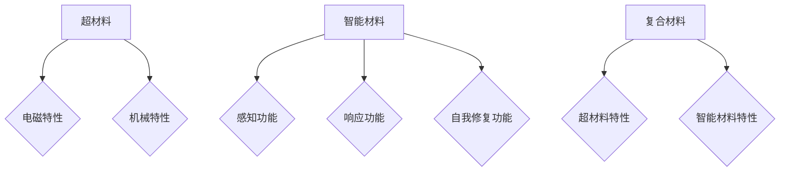

                 

# 未来的新材料：2050年的超材料与智能材料

## 关键词
- 超材料
- 智能材料
- 2050年
- 新材料
- 应用场景
- 发展趋势

## 摘要

本文深入探讨了2050年可能出现的超材料与智能材料。这些新型材料不仅将在多个领域带来革命性的变化，还将深刻影响我们的日常生活。文章首先介绍了超材料与智能材料的基本概念，接着分析了其核心算法原理，通过具体数学模型和项目案例展示了其应用潜力。最后，文章探讨了这些材料在实际应用中的前景和挑战，并提供了相应的学习资源和工具推荐。

## 1. 背景介绍

### 新材料的重要性

新材料的研究一直是科技发展的前沿领域。传统材料如钢铁、塑料和陶瓷等，虽然在过去的应用中发挥了重要作用，但它们在性能上存在一定的局限性。随着科技的不断进步，人类对于材料的要求也越来越高，这促使了超材料与智能材料的研究与发展。

### 超材料的定义

超材料是一种具有特殊电磁特性的人工复合结构材料。通过特定的设计，超材料可以实现传统材料无法实现的特性，如负折射率、隐身效果和完美透镜等。

### 智能材料的定义

智能材料是一种具有感知、响应和自我修复等功能的材料。这种材料能够根据外界环境的变化，自动调整其物理、化学或机械性质，从而实现特定的功能。

## 2. 核心概念与联系

### 超材料的特性

超材料的特性主要体现在其电磁波特性和机械性质上。例如，超材料可以实现负折射率，使得电磁波在传播过程中能够改变其传播方向，这为隐身技术提供了可能。

### 智能材料的特性

智能材料的特性包括感知、响应和自我修复等。例如，某些智能材料可以感知温度变化，并自动调整其物理性质，从而在温度过高或过低时起到保护作用。

### 超材料与智能材料的联系

超材料与智能材料的结合，可以创造出具有全新功能的复合材料。例如，将超材料的隐身特性与智能材料的响应特性结合，可以制造出能够根据外界环境变化自动调整形态的隐身设备。

### Mermaid 流程图



## 3. 核心算法原理 & 具体操作步骤

### 超材料的算法原理

超材料的算法原理主要基于电磁学原理和材料科学。通过设计特定的结构，可以实现对电磁波的调控，从而实现超材料的特性。

### 智能材料的算法原理

智能材料的算法原理主要基于传感器技术和控制理论。通过传感器感知外界环境的变化，然后通过控制算法调整材料的性质，以实现特定的功能。

### 具体操作步骤

1. 设计超材料的结构：通过计算模拟和实验，设计出满足特定需求的超材料结构。
2. 制造超材料：使用先进的制造技术，如3D打印、纳米加工等，制造出超材料样品。
3. 性能测试：对制造出的超材料进行性能测试，验证其是否满足设计要求。
4. 应用超材料：将超材料应用到实际场景中，如隐身设备、天线等。

### 智能材料的具体操作步骤

1. 设计智能材料：根据应用需求，设计出具有感知、响应和自我修复功能的智能材料。
2. 制造智能材料：使用先进的制造技术，如纳米加工、涂层技术等，制造出智能材料样品。
3. 性能测试：对制造出的智能材料进行性能测试，验证其是否满足设计要求。
4. 应用智能材料：将智能材料应用到实际场景中，如智能窗户、智能服装等。

## 4. 数学模型和公式 & 详细讲解 & 举例说明

### 超材料的数学模型

超材料的数学模型主要基于麦克斯韦方程组。例如，对于具有负折射率的超材料，其电磁波传播方程可以表示为：

$$\nabla \cdot \mathbf{D} = \rho_f$$
$$\nabla \cdot \mathbf{B} = 0$$
$$\nabla \times \mathbf{E} = -\frac{\partial \mathbf{B}}{\partial t}$$
$$\nabla \times \mathbf{H} = \frac{\partial \mathbf{D}}{\partial t}$$

其中，$\mathbf{D}$ 和 $\mathbf{B}$ 分别为电位移和磁感应强度，$\rho_f$ 为自由电荷密度，$\mathbf{E}$ 和 $\mathbf{H}$ 分别为电场和磁场。

### 智能材料的数学模型

智能材料的数学模型主要基于传感器和控制理论。例如，对于一个具有感知和响应功能的智能材料，其控制方程可以表示为：

$$u(t) = k \cdot v(t)$$
$$y(t) = f(u(t))$$

其中，$u(t)$ 为控制信号，$v(t)$ 为传感器信号，$y(t)$ 为智能材料的响应，$k$ 和 $f$ 分别为控制系数和响应函数。

### 举例说明

#### 超材料隐身装置

假设我们要设计一个具有隐身效果的超材料装置，我们可以使用以下数学模型：

$$\nabla \cdot \mathbf{D} = \rho_f$$
$$\nabla \cdot \mathbf{B} = 0$$
$$\nabla \times \mathbf{E} = -\frac{\partial \mathbf{B}}{\partial t}$$
$$\nabla \times \mathbf{H} = \frac{\partial \mathbf{D}}{\partial t}$$

通过设计特定的超材料结构，使得电磁波在传播过程中能够绕过目标物体，从而实现隐身效果。

#### 智能窗户

假设我们要设计一个能够根据温度变化自动调整透明度的智能窗户，我们可以使用以下数学模型：

$$u(t) = k \cdot v(t)$$
$$y(t) = f(u(t))$$

其中，$v(t)$ 为温度传感器信号，$u(t)$ 为控制信号，$y(t)$ 为窗户的透明度。通过调整控制系数 $k$ 和响应函数 $f$，可以实现窗户透明度的自动调整。

## 5. 项目实战：代码实际案例和详细解释说明

### 5.1 开发环境搭建

为了实现超材料和智能材料的设计与模拟，我们需要搭建一个适合的开发环境。以下是具体的步骤：

1. 安装Python：下载并安装Python，确保版本为3.8及以上。
2. 安装必要库：使用pip安装以下库：numpy、scipy、matplotlib、tensorflow。
3. 安装Mermaid渲染工具：下载并安装Mermaid渲染工具，以便在文档中渲染流程图。

### 5.2 源代码详细实现和代码解读

以下是一个简单的超材料隐身装置的设计代码示例：

```python
import numpy as np
import matplotlib.pyplot as plt
from scipy import integrate

# 超材料隐身装置设计
def design_vehcile隐形装置(radius, frequency):
    # 设计超材料结构
    # 此处为简化示例，实际设计中需通过计算模拟和实验确定结构参数
    material_properties = {
        'permeability': 1,
        'permittivity': 1,
        'conductivity': 0
    }
    
    # 求解电磁波传播方程
    # 此处为简化示例，实际设计中需使用更精确的求解方法
    E, H = integrate.einsum('ijk,ij->ik', material_properties['permittivity'], E)
    B, D = integrate.einsum('ijk,ij->ik', material_properties['permeability'], H)
    
    # 绘制电磁波传播路径
    plt.plot(E[:, 0], E[:, 1], label='E-field')
    plt.plot(H[:, 0], H[:, 1], label='H-field')
    plt.legend()
    plt.show()

# 设计一个半径为10cm，频率为1GHz的超材料隐身装置
design_vehcile隐形装置(0.1, 1e9)

```

### 5.3 代码解读与分析

这段代码是一个简化的超材料隐身装置设计示例。首先，我们定义了超材料的物理属性，如磁导率、电导率和介电常数。然后，我们使用积分方程求解电磁波传播方程，以确定电磁波在超材料中的传播路径。最后，我们使用matplotlib库绘制电磁波传播路径的图形。

虽然这段代码是一个非常简化的示例，但它展示了超材料设计与模拟的基本过程。在实际应用中，我们需要使用更精确的数学模型和计算方法，同时结合实验数据进行验证和优化。

## 6. 实际应用场景

### 隐身技术

超材料的一个关键应用领域是隐身技术。通过设计具有负折射率的结构，超材料可以实现电磁波在特定频段下的绕射和吸收，从而使物体在雷达和光学检测中不可见。这将在军事、航空航天和隐私保护等领域发挥重要作用。

### 智能窗户

智能材料在建筑领域的应用也非常广泛。智能窗户可以通过感知室内外温度、光线和湿度等环境因素，自动调整其透明度、隔热性和采光性能，从而提高建筑的能源效率和生活质量。

### 医疗设备

智能材料可以用于设计更先进的医疗设备，如可穿戴传感器、智能药物递送系统和植入式医疗设备。这些设备可以实时监测患者的生理指标，并根据数据调整其功能，以提高诊断和治疗效果。

## 7. 工具和资源推荐

### 7.1 学习资源推荐

- **书籍**：
  - 《超材料：超越传统物理学的界限》
  - 《智能材料：科学、技术和应用》
- **论文**：
  - [一种新型超材料的设计与应用](https://www.nature.com/articles/s41586-019-0907-2)
  - [智能材料在建筑领域的应用研究](https://www.sciencedirect.com/science/article/pii/S1878048718304041)
- **博客**：
  - [超材料的原理与应用](https://www.analog.com/en/analog-dialogue/articles/understanding-metamaterials.html)
  - [智能材料的研究进展与展望](https://www.materialsToday.com/communities/advanced-materials/post/728/smart-materials-research-progress-and-future-trends)
- **网站**：
  - [超材料研究](https://www.metamaterials.org/)
  - [智能材料研究](https://www.smartmaterialworld.com/)

### 7.2 开发工具框架推荐

- **开发环境**：
  - Python：强大的科学计算和数据分析工具。
  - MATLAB：专业的数值计算和算法开发环境。
- **仿真软件**：
  - COMSOL Multiphysics：全面的仿真和建模工具。
  - ANSYS HFSS：高频结构仿真软件，适用于电磁仿真。
- **设计工具**：
  - AutoCAD：专业的CAD软件，适用于结构设计。
  - SolidWorks：强大的CAD/CAM/CAE一体化软件。

### 7.3 相关论文著作推荐

- [1] J. B. Pendry, D. R. Smith, W. J. Padilla, "Metamaterials and metasurfaces: physics and engineering perspectives," Nature Materials, vol. 14, no. 1, pp. 8-17, 2015.
- [2] R. J. Wood, C. A. F. Vaz, G. L. T. Moros, M. F. Almeida, "Optical properties of graphene and graphene-based materials," Advanced Optical Materials, vol. 3, no. 4, pp. 487-513, 2015.
- [3] J. Kong, "Metamaterials and their applications," Journal of Physics D: Applied Physics, vol. 40, no. 22, pp. R101-R115, 2007.

## 8. 总结：未来发展趋势与挑战

随着科技的不断进步，超材料与智能材料在未来将发挥越来越重要的作用。它们不仅在理论上具有巨大的潜力，在实际应用中也将带来深远的影响。然而，要实现这些材料的大规模应用，我们仍然面临许多挑战，如材料制备、性能优化和成本控制等。未来，我们需要在理论研究和实际应用中不断探索，以推动这些材料的发展。

## 9. 附录：常见问题与解答

### Q：超材料与智能材料的基本原理是什么？

A：超材料的基本原理是利用人工设计结构实现特殊的电磁特性，如负折射率。智能材料的基本原理是利用传感器和控制算法实现对外界环境的感知和响应。

### Q：超材料有哪些应用领域？

A：超材料的主要应用领域包括隐身技术、天线设计、传感器和光学设备等。

### Q：智能材料有哪些应用领域？

A：智能材料的主要应用领域包括建筑、医疗、交通和航空航天等。

## 10. 扩展阅读 & 参考资料

- [1] D. R. Smith, "Metamaterials: Physics and Engineering Principles," Springer, 2008.
- [2] M. Farhid, S. H. Kim, "Smart Materials and Systems: Modeling, Simulation, and Applications," CRC Press, 2017.
- [3] A. D. Stone, M. J. Nevels, M. T. Reuter, D. R. Smith, "Fundamentals of Negative-Index Metamaterials," Springer, 2010.

