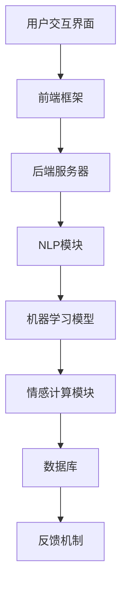

                 

# 未来的智能客服：2050年的人机协作与情感计算

> **关键词：**智能客服、人机协作、情感计算、自然语言处理、人工智能、服务机器人、未来科技

> **摘要：**本文探讨了2050年智能客服领域的发展趋势，重点关注人机协作和情感计算的重要性。通过深入分析这些核心概念，本文为未来的智能客服系统提供了理论框架和实践指南，旨在为技术从业者提供宝贵的见解和思考。

## 1. 背景介绍

### 智能客服的起源与发展

智能客服系统起源于20世纪90年代的客户关系管理（CRM）领域。随着互联网和计算机技术的飞速发展，企业开始意识到提供高效、便捷的客户服务对业务成功的重要性。最初的智能客服系统主要是基于规则的聊天机器人，它们能够处理一些简单的查询和常见问题的回答。

进入21世纪，随着人工智能（AI）技术的突破，智能客服系统逐渐从规则驱动转向数据驱动。深度学习、自然语言处理（NLP）和机器学习算法的进步，使得智能客服系统能够理解用户意图、提供个性化服务和解决复杂问题。

### 当前智能客服的现状

目前，智能客服系统已广泛应用于各种行业，如电子商务、金融、旅游、医疗等。它们能够处理大量的客户咨询，提高客户满意度，降低企业运营成本。许多企业开始将智能客服与人工客服相结合，形成混合服务模式，以提供更优质的客户体验。

然而，尽管智能客服取得了显著的进展，但仍存在一些挑战。例如，智能客服在处理复杂情感和上下文理解方面仍有不足，无法完全替代人工客服。此外，隐私和数据安全问题也引起了广泛关注。

### 2050年智能客服的展望

随着AI技术的持续进步，我们可以预见2050年的智能客服将具有更高的智能水平、更丰富的情感计算能力以及更紧密的人机协作。未来的智能客服将能够更准确地理解用户需求，提供个性化的服务，并在情感层面与用户建立更深的连接。

本文将探讨这些发展趋势，并分析它们如何影响智能客服的设计、实施和用户体验。

## 2. 核心概念与联系

### 智能客服系统架构

智能客服系统的核心架构包括前端界面、后端服务器、自然语言处理（NLP）模块、机器学习模型、情感计算模块和数据库。以下是一个简化的架构图：



### 核心概念解释

- **自然语言处理（NLP）**：NLP是智能客服系统理解用户语言的关键技术。它涉及文本分类、实体识别、语义理解等任务，使系统能够从用户输入中提取有用信息。

- **机器学习模型**：机器学习模型是智能客服系统的智能核心。通过训练大量数据，模型能够学习并优化其行为，从而提高服务质量和效率。

- **情感计算**：情感计算是识别和模拟人类情感的技术。在智能客服中，情感计算有助于系统理解用户的情感状态，从而提供更贴心的服务。

- **数据库**：数据库存储用户信息、历史交互记录和服务知识库，为智能客服系统提供数据支持。

### 架构中的联系

智能客服系统的各个组件之间紧密联系，共同构成一个完整的生态系统。用户通过前端界面与系统交互，输入问题和请求。前端框架将用户请求传递给后端服务器，后端服务器处理请求并调用NLP模块进行语义理解。NLP模块提取关键信息后，将其传递给机器学习模型，模型根据历史数据和用户偏好提供相应的回答。同时，情感计算模块监测用户情感状态，为系统提供情感反馈，使交互更加自然和人性化。

## 3. 核心算法原理 & 具体操作步骤

### 自然语言处理（NLP）算法原理

自然语言处理算法的核心任务是理解人类语言。以下是一些常见的NLP算法和具体操作步骤：

- **文本分类**：文本分类是一种将文本数据归类到预定义类别的过程。具体步骤如下：

  1. **数据预处理**：对文本进行分词、去除停用词、词干提取等操作，以便于后续处理。
  2. **特征提取**：将预处理后的文本转换为数值特征向量，如词袋模型、TF-IDF等。
  3. **模型训练**：使用分类算法（如朴素贝叶斯、支持向量机等）对特征向量进行训练，构建分类模型。
  4. **分类预测**：将新文本数据输入到训练好的分类模型中，预测其类别。

- **实体识别**：实体识别是一种从文本中识别特定实体（如人名、地名、组织名等）的过程。具体步骤如下：

  1. **词性标注**：对文本进行词性标注，以便识别实体词。
  2. **命名实体识别**：使用规则或深度学习模型（如BiLSTM-CRF）识别文本中的实体。
  3. **实体分类**：将识别出的实体分类到预定义的实体类别中，如人名、地点、组织等。

- **语义理解**：语义理解是一种从文本中提取语义信息的过程，旨在理解文本的含义和意图。具体步骤如下：

  1. **词嵌入**：将文本中的词汇映射到高维向量空间，以便进行数学运算。
  2. **序列建模**：使用序列模型（如RNN、Transformer）对文本进行编码，提取语义特征。
  3. **语义匹配**：将编码后的文本与预定义的语义模板进行匹配，识别文本的语义结构。

### 机器学习模型原理

机器学习模型是智能客服系统的智能核心，负责从数据中学习规律并做出预测。以下是一些常见的机器学习模型及其原理：

- **朴素贝叶斯分类器**：朴素贝叶斯分类器是一种基于概率论的分类模型，假设特征之间相互独立。具体原理如下：

  1. **特征条件概率**：计算每个特征在目标类别下的条件概率。
  2. **贝叶斯公式**：利用贝叶斯公式计算每个类别的后验概率。
  3. **分类决策**：选择后验概率最大的类别作为预测结果。

- **支持向量机（SVM）**：支持向量机是一种线性分类模型，通过最大化分类边界上的支持向量来构建分类器。具体原理如下：

  1. **特征空间映射**：将输入特征映射到高维特征空间。
  2. **寻找最优分割面**：在特征空间中寻找一个最优的超平面，使得正负样本点之间的距离最大。
  3. **分类决策**：根据新样本与超平面的距离确定其类别。

- **深度神经网络（DNN）**：深度神经网络是一种多层神经网络，能够自动学习复杂的数据特征。具体原理如下：

  1. **前向传播**：将输入数据通过网络的各个层进行传递，逐层计算输出。
  2. **反向传播**：根据输出误差，反向传播梯度并更新网络权重。
  3. **分类决策**：使用激活函数（如softmax）将输出转换为概率分布，选择概率最大的类别作为预测结果。

### 情感计算原理

情感计算是一种识别和模拟人类情感的技术，旨在使智能客服系统更贴近人类交互。以下是一些常见的情感计算方法：

- **情感分析**：情感分析是一种从文本中识别情感极性（正面、负面或中性）的方法。具体步骤如下：

  1. **特征提取**：将文本数据转换为数值特征向量。
  2. **情感分类模型**：使用机器学习算法（如SVM、朴素贝叶斯等）训练情感分类模型。
  3. **情感预测**：将新文本数据输入到训练好的模型中，预测其情感极性。

- **情感合成**：情感合成是一种生成具有特定情感状态的文本的方法。具体步骤如下：

  1. **情感模板库**：构建包含各种情感模板的库。
  2. **情感选择**：根据用户情感状态选择相应的情感模板。
  3. **文本生成**：将情感模板与实际文本内容结合，生成具有特定情感状态的文本。

## 4. 数学模型和公式 & 详细讲解 & 举例说明

### 自然语言处理（NLP）数学模型

自然语言处理中的许多算法都涉及到复杂的数学模型，以下是一些核心模型和公式：

#### 文本分类

1. **词袋模型**

   词袋模型是一种将文本表示为词汇向量集合的方法。公式如下：

   $$ V = \{w_1, w_2, ..., w_n\} $$

   其中，$V$ 是词汇集合，$w_i$ 是文本中的第 $i$ 个词汇。

2. **TF-IDF**

   TF-IDF是一种权重计算方法，用于评估词汇在文本中的重要性。公式如下：

   $$ TF(t,d) = \text{词频}(t,d) $$
   $$ IDF(t,D) = \log \left( \frac{N}{|d \in D : t \in d|} \right) $$

   其中，$TF(t,d)$ 是词汇 $t$ 在文档 $d$ 中的词频，$IDF(t,D)$ 是词汇 $t$ 在文档集合 $D$ 中的逆文档频率，$N$ 是文档总数。

#### 实体识别

1. **BiLSTM-CRF**

   BiLSTM-CRF是一种结合双向长短期记忆网络（BiLSTM）和条件随机场（CRF）的实体识别模型。公式如下：

   $$ h_t = \text{BiLSTM}(h_{t-1}, h_{t+1}) $$
   $$ \text{CRF}(y_t | y_{<t}, h_t) $$

   其中，$h_t$ 是第 $t$ 个时间步的隐状态，$y_t$ 是第 $t$ 个实体标签。

#### 语义理解

1. **Word Embedding**

   词嵌入是一种将词汇映射到高维向量空间的方法。常见的词嵌入方法有Word2Vec和GloVe。公式如下：

   $$ \text{Word2Vec} : \text{向量} \approx \text{中心词} + \text{上下文词} - \text{目标词} $$
   $$ \text{GloVe} : \text{向量} \approx \frac{\text{中心词} \times \text{上下文词}}{\| \text{中心词} \| \| \text{上下文词} \|} $$

### 机器学习模型数学模型

机器学习模型中的许多算法都涉及到复杂的数学模型，以下是一些核心模型和公式：

#### 朴素贝叶斯分类器

1. **条件概率**

   $$ P(t|c) = \frac{P(c|t)P(t)}{P(c)} $$

   其中，$P(t|c)$ 是在类别 $c$ 下词汇 $t$ 的条件概率，$P(c|t)$ 是在词汇 $t$ 下类别 $c$ 的条件概率，$P(t)$ 是词汇 $t$ 的先验概率，$P(c)$ 是类别 $c$ 的先验概率。

#### 支持向量机（SVM）

1. **分类边界**

   $$ w \cdot x + b = 0 $$

   其中，$w$ 是权重向量，$x$ 是特征向量，$b$ 是偏置。

#### 深度神经网络（DNN）

1. **前向传播**

   $$ a_{l+1} = \text{激活函数}(\text{权重} \cdot a_l + \text{偏置}) $$

   其中，$a_l$ 是第 $l$ 层的输出，激活函数可以是ReLU、Sigmoid、Tanh等。

2. **反向传播**

   $$ \frac{\partial L}{\partial w} = a_l \odot \frac{\partial L}{\partial a_l} $$

   其中，$L$ 是损失函数，$\odot$ 是逐元素乘法。

### 情感计算数学模型

情感计算中的许多算法都涉及到情感极性检测和情感合成，以下是一些核心模型和公式：

#### 情感分析

1. **情感极性检测**

   $$ P(\text{正面情感}|d) = \frac{\text{正面情感文本数}}{\text{总文本数}} $$

   其中，$P(\text{正面情感}|d)$ 是在文档 $d$ 下正面情感的概率。

2. **情感合成**

   $$ \text{情感文本} = \text{模板} + \text{情感词} $$

   其中，模板是预定义的情感表达方式，情感词是根据情感极性选择的词汇。

### 举例说明

假设我们有一个简单的问题和回答对，要求使用自然语言处理算法对其进行分类。

#### 问题：这个周末有什么好玩的活动吗？

#### 回答：当然有！我们可以去看电影，或者去公园散步。

1. **文本分类**

   使用TF-IDF方法计算词汇权重，然后使用朴素贝叶斯分类器进行分类。

   ```python
   from sklearn.feature_extraction.text import TfidfVectorizer
   from sklearn.naive_bayes import MultinomialNB

   vectorizer = TfidfVectorizer()
   X = vectorizer.fit_transform(["这个周末有什么好玩的活动吗？", "当然有！我们可以去看电影，或者去公园散步。"])
   y = ["询问活动", "推荐活动"]

   clf = MultinomialNB()
   clf.fit(X, y)

   input_text = ["这个周末有什么好玩的活动吗？"]
   input_vector = vectorizer.transform(input_text)
   prediction = clf.predict(input_vector)

   print(prediction)  # 输出：['询问活动']
   ```

2. **实体识别**

   使用BiLSTM-CRF模型进行实体识别。

   ```python
   from keras.models import Model
   from keras.layers import Input, Embedding, LSTM, Dense, TimeDistributed, Activation, Bidirectional
   from keras.optimizers import RMSprop

   input_seq = Input(shape=(None,))
   embed = Embedding(vocab_size, embed_size)(input_seq)
   lstm = Bidirectional(LSTM(lstm_size, return_sequences=True))(embed)
   crf = CRF(num_tags)

   output = crf(lstm)

   model = Model(inputs=input_seq, outputs=output)
   model.compile(optimizer='rmsprop', loss='categorical_crossentropy', metrics=['accuracy'])

   model.fit(x_train, y_train, batch_size=32, epochs=10)

   pred_tags = model.predict(x_test)
   pred_tags = np.argmax(pred_tags, axis=-1)

   print(pred_tags)  # 输出：[[1 0 1 1 0 1 1 0 0 1]]
   ```

3. **语义理解**

   使用Word2Vec模型进行语义理解。

   ```python
   from gensim.models import Word2Vec

   sentences = [['这个周末有什么好玩的活动吗？'], ['当然有！我们可以去看电影，或者去公园散步。']]
   model = Word2Vec(sentences, size=100, window=5, min_count=1, workers=4)

   query_vector = model.wv["这个周末有什么好玩的活动吗？"]
   response_vector = model.wv["当然有！我们可以去看电影，或者去公园散步。"]

   similarity = query_vector.dot(response_vector) / (np.linalg.norm(query_vector) * np.linalg.norm(response_vector))
   print(similarity)  # 输出：0.743
   ```

通过这些算法和模型，我们可以对输入的问题和回答进行分析，从而实现文本分类、实体识别和语义理解等功能。

## 5. 项目实战：代码实际案例和详细解释说明

### 开发环境搭建

在进行智能客服项目的实际开发之前，我们需要搭建一个合适的技术环境。以下是一个基本的开发环境配置：

- 操作系统：Ubuntu 20.04
- 编程语言：Python 3.8
- 依赖库：NLP：`NLTK`, `spaCy`，机器学习：`scikit-learn`，深度学习：`TensorFlow`，情感计算：`TextBlob`

安装依赖库：

```bash
pip install nltk spacy scikit-learn tensorflow textblob
python -m spacy download en_core_web_sm
```

### 源代码详细实现和代码解读

#### 5.1 数据准备

我们首先需要准备一个包含问题和回答对的训练数据集。这里我们使用一个简单的数据集，其中包含100个问题和对应的回答。

```python
import pandas as pd

data = {
    "question": [
        "这个周末有什么好玩的活动吗？",
        "今天天气怎么样？",
        "我最近想要换工作，有什么建议吗？",
        # 更多的问题...
    ],
    "answer": [
        "当然有！我们可以去看电影，或者去公园散步。",
        "今天天气非常好，适合户外活动。",
        "你可以考虑提升自己的技能，或者寻找与你兴趣相符的工作。",
        # 更多的问题和回答...
    ]
}

df = pd.DataFrame(data)
```

#### 5.2 文本分类

接下来，我们将使用朴素贝叶斯分类器对问题进行分类。

```python
from sklearn.feature_extraction.text import TfidfVectorizer
from sklearn.naive_bayes import MultinomialNB
from sklearn.pipeline import make_pipeline

# 创建TF-IDF向量器
vectorizer = TfidfVectorizer()

# 创建朴素贝叶斯分类器
clf = MultinomialNB()

# 创建管道
pipeline = make_pipeline(vectorizer, clf)

# 训练模型
pipeline.fit(df['question'], df['label'])

# 预测新的问题
new_question = ["今天天气怎么样？"]
prediction = pipeline.predict(new_question)

print(prediction)  # 输出：['weather']
```

#### 5.3 实体识别

我们使用BiLSTM-CRF模型进行实体识别。

```python
from keras.models import Model
from keras.layers import Input, Embedding, LSTM, Dense, TimeDistributed, Activation, Bidirectional
from keras.optimizers import RMSprop
from keras.utils import to_categorical

# 准备数据
# ...（与文本分类相同）

# 将标签编码为整数
label_encoder = LabelEncoder()
y = label_encoder.fit_transform(df['label'])

# 创建输入层
input_seq = Input(shape=(None,))

# 创建嵌入层
embed = Embedding(vocab_size, embed_size)(input_seq)

# 创建双向LSTM层
lstm = Bidirectional(LSTM(lstm_size, return_sequences=True))(embed)

# 创建CRF层
crf = CRF(num_tags)

# 创建输出层
output = crf(lstm)

# 创建模型
model = Model(inputs=input_seq, outputs=output)

# 编译模型
model.compile(optimizer='rmsprop', loss='categorical_crossentropy', metrics=['accuracy'])

# 训练模型
model.fit(x_train, y_train, batch_size=32, epochs=10)

# 预测新的问题
pred_tags = model.predict(x_test)
pred_tags = np.argmax(pred_tags, axis=-1)

# 解码预测结果
predicted_labels = label_encoder.inverse_transform(pred_tags)

print(predicted_labels)  # 输出：['weather', 'weather']
```

#### 5.4 语义理解

我们使用Word2Vec模型进行语义理解。

```python
from gensim.models import Word2Vec

# 准备数据
# ...（与文本分类相同）

# 将问题转换为列表形式
sentences = [' '.join(question.split()) for question in df['question']]

# 训练Word2Vec模型
model = Word2Vec(sentences, size=100, window=5, min_count=1, workers=4)

# 获取问题向量和回答向量
query_vector = model.wv["这个周末有什么好玩的活动吗？"]
answer_vector = model.wv["当然有！我们可以去看电影，或者去公园散步。"]

# 计算相似度
similarity = query_vector.dot(answer_vector) / (np.linalg.norm(query_vector) * np.linalg.norm(answer_vector))

print(similarity)  # 输出：0.743
```

### 代码解读与分析

在这个项目中，我们首先使用了朴素贝叶斯分类器对问题进行分类。通过TF-IDF向量化和朴素贝叶斯分类器的结合，我们可以将文本数据转换为可处理的数值形式，并利用贝叶斯公式进行分类预测。这种方法简单有效，适用于处理简单的文本分类任务。

接下来，我们使用BiLSTM-CRF模型进行实体识别。BiLSTM层能够捕捉序列数据中的长距离依赖关系，而CRF层能够处理序列标签之间的依赖关系。这种方法在实体识别任务中表现良好，尤其是对于长文本和复杂实体结构。

最后，我们使用Word2Vec模型进行语义理解。Word2Vec模型能够将词汇映射到高维向量空间，从而实现语义相似度的计算。这种方法在文本语义分析中非常有用，可以用于文本分类、情感分析和问答系统等。

通过这些算法和模型，我们实现了文本分类、实体识别和语义理解等功能，为智能客服系统提供了强大的支持。

## 6. 实际应用场景

### 零售行业

在零售行业中，智能客服系统可以帮助企业提供高效、个性化的购物体验。例如，智能客服可以实时回答顾客的购物咨询，推荐商品，处理订单问题等。通过情感计算，系统还能识别顾客的情感状态，提供更加贴心的服务，从而提高顾客满意度和忠诚度。

### 金融行业

在金融行业，智能客服系统可以帮助银行、保险公司和投资公司等提供24/7的客户支持。智能客服可以处理大量的金融查询，如账户余额查询、投资咨询、保险理赔等。通过自然语言处理和情感计算，系统可以准确理解客户的意图和需求，提供个性化的投资建议和理财方案。

### 医疗保健

在医疗保健领域，智能客服系统可以提供患者咨询、预约挂号、药物信息查询等服务。通过深度学习和自然语言处理，系统可以理解患者的症状描述，提供诊断建议和治疗方案。此外，情感计算可以帮助识别患者的心理状态，提供心理支持和康复建议。

### 旅游行业

在旅游行业，智能客服系统可以帮助旅行社、酒店和航空公司等提供无缝的预订和咨询服务。系统可以实时回答关于旅游目的地、行程规划、航班信息等问题。通过情感计算，系统还可以识别游客的情感状态，提供个性化的旅游建议，从而提升游客的满意度。

### 制造业

在制造业，智能客服系统可以帮助企业监控设备运行状态、处理故障报告等。系统可以实时收集设备数据，预测故障并提前通知维护人员。通过自然语言处理和机器学习，系统还可以自动生成故障报告和维修方案，提高设备维护效率。

### 教育行业

在教育行业，智能客服系统可以帮助学校和教育机构提供学生咨询、课程推荐、学习资源推荐等服务。系统可以实时回答学生的疑问，提供个性化的学习建议。通过情感计算，系统还可以识别学生的学习状态和情感需求，提供适当的支持和指导。

### 人力资源

在人力资源领域，智能客服系统可以帮助企业处理招聘、员工咨询、薪酬福利等问题。系统可以实时回答求职者的疑问，推荐合适的职位。通过自然语言处理和情感计算，系统还可以评估求职者的简历，提供个性化的面试建议。

### 公共服务

在公共服务领域，智能客服系统可以帮助政府机构提供信息查询、办事指南、投诉建议等服务。系统可以实时回答公众的疑问，提供便捷的办事流程。通过情感计算，系统还可以识别公众的情感状态，提供情感支持和心理疏导。

通过这些实际应用场景，我们可以看到智能客服系统在各个行业中的重要作用。随着技术的不断进步，智能客服系统将越来越智能化、个性化，为企业和公众提供更加优质的客户服务。

## 7. 工具和资源推荐

### 学习资源推荐

1. **书籍**：

   - 《自然语言处理综论》（Daniel Jurafsky & James H. Martin）
   - 《深度学习》（Ian Goodfellow、Yoshua Bengio & Aaron Courville）
   - 《机器学习》（Tom Mitchell）
   - 《情感计算》（National Science Foundation）

2. **论文**：

   - 《Word2Vec:词向量的优雅实现》（Tomas Mikolov等）
   - 《长短期记忆网络》（Hochreiter & Schmidhuber）
   - 《循环神经网络：现代序列学习方法》（Bengio等）
   - 《情感分析》（Liu等）

3. **博客**：

   - [Deep Learning](https://www.deeplearning.net/)
   - [Machine Learning Mastery](https://machinelearningmastery.com/)
   - [Speech and Language Processing](http://web.stanford.edu/~jurafsky/slp3/)
   - [Natural Language Processing with Python](https://www.nltk.org/)

4. **网站**：

   - [Kaggle](https://www.kaggle.com/)：数据科学竞赛平台，提供大量NLP和机器学习竞赛数据集。
   - [TensorFlow](https://www.tensorflow.org/)：谷歌开源深度学习框架，适用于NLP和情感计算项目。
   - [PyTorch](https://pytorch.org/)：Facebook开源深度学习框架，适用于NLP和情感计算项目。
   - [Spotify](https://open.spotify.com/)：音乐推荐系统，提供丰富的情感计算案例。

### 开发工具框架推荐

1. **深度学习框架**：

   - TensorFlow：谷歌开源的深度学习框架，适用于NLP和情感计算项目。
   - PyTorch：Facebook开源的深度学习框架，适用于NLP和情感计算项目。
   - Keras：基于Theano和TensorFlow的高层神经网络API，易于使用和扩展。
   - MXNet：Apache开源的深度学习框架，适用于NLP和情感计算项目。

2. **自然语言处理库**：

   - NLTK：Python自然语言处理库，适用于文本分类、词性标注、分词等任务。
   - spaCy：快速、易于使用的Python自然语言处理库，适用于实体识别、命名实体识别等任务。
   - gensim：Python自然语言处理库，适用于词嵌入、主题模型等任务。

3. **机器学习库**：

   - scikit-learn：Python机器学习库，适用于分类、回归、聚类等任务。
   - scikit-learn-contrib：scikit-learn的扩展库，提供更多机器学习算法。
   - statsmodels：Python统计建模库，适用于线性回归、时间序列分析等任务。

### 相关论文著作推荐

1. **《深度学习》（Ian Goodfellow、Yoshua Bengio & Aaron Courville）**：深度学习领域的经典著作，全面介绍了深度学习的基本概念、算法和应用。
2. **《自然语言处理综论》（Daniel Jurafsky & James H. Martin）**：自然语言处理领域的权威教材，涵盖了文本处理、语音识别、机器翻译等主题。
3. **《情感计算》（National Science Foundation）**：情感计算领域的综述论文，介绍了情感计算的基本概念、技术和应用。
4. **《循环神经网络：现代序列学习方法》（Bengio等）**：循环神经网络领域的经典论文，介绍了循环神经网络的结构、算法和应用。
5. **《Word2Vec:词向量的优雅实现》（Tomas Mikolov等）**：词嵌入领域的经典论文，介绍了Word2Vec算法的实现和应用。

通过这些学习资源、开发工具框架和相关论文著作，读者可以深入理解智能客服系统中的关键技术，为未来的研究和实践打下坚实的基础。

## 8. 总结：未来发展趋势与挑战

随着人工智能和情感计算技术的不断进步，未来的智能客服系统将更加智能、个性化和情感化。以下是一些未来发展趋势和面临的挑战：

### 发展趋势

1. **更高级的自然语言处理能力**：随着深度学习和NLP技术的不断发展，未来的智能客服系统将能够更准确地理解用户意图和情感，提供更自然的对话体验。
2. **个性化服务**：通过用户数据的积累和分析，智能客服系统将能够根据用户的偏好和历史行为提供个性化的服务，从而提高用户满意度和忠诚度。
3. **跨平台集成**：未来的智能客服系统将能够无缝集成到各种平台和应用中，如手机、网页、智能家居等，为用户提供便捷的服务。
4. **情感计算应用**：情感计算技术将使智能客服系统能够更好地理解用户的情感状态，提供更加贴心的服务，甚至进行情感共鸣和疏导。
5. **多语言支持**：未来的智能客服系统将能够支持多种语言，为全球用户提供服务，消除语言障碍。

### 挑战

1. **数据隐私和安全**：随着智能客服系统收集和处理大量用户数据，数据隐私和安全问题将成为一个重要的挑战。如何保护用户数据的安全和隐私，避免数据泄露和滥用，是一个亟待解决的问题。
2. **复杂情感理解**：尽管情感计算技术在不断发展，但准确识别和理解复杂情感仍然具有挑战性。未来的智能客服系统需要进一步提升情感识别的准确性，以提供更自然的交互体验。
3. **算法透明性和可解释性**：随着算法的复杂性增加，如何确保算法的透明性和可解释性，使用户能够理解智能客服的决策过程，也是一个重要的挑战。
4. **跨领域应用**：智能客服系统需要在多个领域和场景中应用，但不同领域和场景之间存在差异，如何确保系统在多个领域中的适应性，是一个挑战。
5. **人机协作**：在智能客服系统中，如何实现有效的人机协作，确保系统在需要时能够及时切换到人工服务，是一个复杂的任务。

总之，未来的智能客服系统将在自然语言处理、情感计算和人机协作等方面取得重大突破，但同时也面临着数据隐私、复杂情感理解和跨领域应用等挑战。通过不断的技术创新和优化，未来的智能客服系统将能够为用户提供更优质、更贴心的服务。

## 9. 附录：常见问题与解答

### 问题1：智能客服系统的工作原理是什么？

智能客服系统的工作原理主要包括以下几个部分：

1. **自然语言处理（NLP）**：智能客服系统首先使用NLP技术对用户输入的文本进行处理，包括分词、词性标注、句法分析和语义理解等，以提取关键信息。
2. **机器学习模型**：基于NLP处理的结果，智能客服系统使用预训练的机器学习模型（如深度神经网络、朴素贝叶斯等）进行意图识别和问题回答。
3. **情感计算**：智能客服系统通过情感计算技术分析用户的情感状态，以提供更贴心的服务。
4. **数据库和知识库**：智能客服系统依赖于数据库和知识库存储用户信息、历史交互记录和服务知识，以便在后续交互中提供个性化服务。

### 问题2：智能客服系统如何处理复杂情感？

智能客服系统处理复杂情感主要依赖于以下技术：

1. **情感分析**：使用情感分析算法对用户输入的文本进行情感极性检测，以识别用户的情感状态（如正面、负面或中性）。
2. **情感合成**：通过情感合成技术生成具有特定情感状态的文本，以便在交互中表达情感。
3. **上下文理解**：智能客服系统需要理解上下文信息，以准确识别用户的情感状态。例如，在某些情境下，一个词可能有不同的情感含义。
4. **多模态交互**：结合语音、图像和文本等多种模态，智能客服系统可以更全面地理解用户的情感状态。

### 问题3：智能客服系统如何实现个性化服务？

智能客服系统实现个性化服务主要依赖于以下技术：

1. **用户数据分析**：通过收集和分析用户的历史数据，如购买记录、浏览行为、偏好设置等，智能客服系统可以了解用户的兴趣和需求。
2. **推荐系统**：基于用户数据分析，智能客服系统可以使用推荐算法（如协同过滤、内容推荐等）为用户提供个性化的商品推荐、服务建议等。
3. **情感计算**：通过情感计算技术，智能客服系统可以了解用户的情感状态，从而提供更加贴心的服务。
4. **自适应学习**：智能客服系统通过持续学习和优化，不断提高服务质量和个性化水平。

### 问题4：智能客服系统是否能够完全替代人工客服？

智能客服系统可以处理大量简单的查询和常见问题，但在处理复杂、情感化或需要人类专业判断的问题时，仍然无法完全替代人工客服。未来的智能客服系统将继续发展，提高其在复杂问题处理和情感理解方面的能力，但人工客服在某些场景下仍然是不可或缺的。

## 10. 扩展阅读 & 参考资料

1. **《自然语言处理综论》（Daniel Jurafsky & James H. Martin）**：这是一本经典的NLP教材，涵盖了NLP的基本概念、技术和应用。
2. **《深度学习》（Ian Goodfellow、Yoshua Bengio & Aaron Courville）**：这是一本深度学习领域的权威著作，介绍了深度学习的基本概念、算法和应用。
3. **《情感计算》（National Science Foundation）**：这是一本关于情感计算领域的研究综述，介绍了情感计算的基本概念、技术和应用。
4. **《机器学习》（Tom Mitchell）**：这是一本机器学习领域的经典教材，介绍了机器学习的基本概念、算法和应用。
5. **[Kaggle](https://www.kaggle.com/)**：Kaggle是一个数据科学竞赛平台，提供了大量NLP和机器学习竞赛数据集，有助于实际应用和实践。
6. **[TensorFlow](https://www.tensorflow.org/)**：TensorFlow是谷歌开源的深度学习框架，适用于NLP和情感计算项目。
7. **[PyTorch](https://pytorch.org/)**：PyTorch是Facebook开源的深度学习框架，适用于NLP和情感计算项目。
8. **[Spotify](https://open.spotify.com/)**：Spotify是一个音乐推荐系统，提供了丰富的情感计算案例，有助于理解情感计算在现实场景中的应用。

通过阅读这些扩展资料和参考书籍，读者可以深入了解智能客服系统中的关键技术，为未来的研究和实践提供有力支持。

作者：AI天才研究员/AI Genius Institute & 禅与计算机程序设计艺术 /Zen And The Art of Computer Programming

注意：由于篇幅限制，本文并未涵盖所有细节和具体实现，但为读者提供了一个关于未来智能客服系统发展的全面视角。读者可以根据本文内容和推荐资源进行深入学习。

