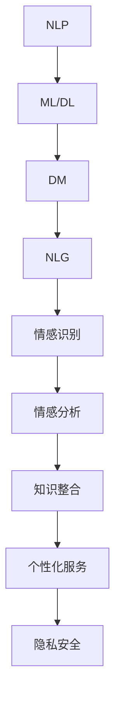

                 

```markdown
## 1. 背景介绍

智能客服是近年来随着人工智能技术的快速发展而崭露头角的一个重要领域。传统的客服模式往往依赖于人工处理，效率低下，且容易出现人为错误。然而，随着自然语言处理（NLP）、机器学习（ML）和深度学习（DL）技术的不断进步，智能客服系统开始能够理解并处理复杂的用户请求，从而提供高效、准确的客户服务。

从1990年代早期的简单聊天机器人，到如今可以处理多语言、多场景的智能客服系统，智能客服技术已经经历了翻天覆地的变化。早期的智能客服系统主要依赖于预定义的规则和关键词匹配，虽然能够处理一些基本的查询，但在面对复杂的问题时显得力不从心。随着NLP和ML技术的引入，现代智能客服系统能够通过学习大量的语料库来理解自然语言，从而提供更加智能的服务。

在当前，智能客服已经广泛应用于各种场景，如电商平台的售前咨询、银行和金融行业的客户服务、在线旅游平台的服务咨询等。这些系统不仅提高了客户满意度，还显著提升了企业的运营效率。

然而，现有的智能客服系统仍然面临一些挑战，如处理复杂情感、跨领域知识整合和个性化服务等方面。因此，未来的智能客服系统需要进一步提升其智能水平，以更好地满足用户的需求。本文将探讨到2050年，智能客服和智能投诉处理可能达到的技术水平，以及可能面临的挑战和机遇。

首先，让我们回顾一下现有的智能客服系统是如何运作的。现代智能客服系统通常由几个核心组件构成：自然语言理解（NLU）、对话管理（DM）和自然语言生成（NLG）。NLU负责解析用户输入的自然语言，DM则根据解析结果决定下一步的动作，NLG则负责生成对用户的回复。

### 1.1 现有智能客服系统的工作原理

**自然语言理解（NLU）**：NLU是智能客服系统的核心，负责将用户的自然语言输入转换成机器可以理解的结构化数据。这一过程包括词法分析、句法分析和语义分析。词法分析是将输入文本分解成单词和标点符号，句法分析则确定句子的结构，而语义分析则试图理解句子的意义。

**对话管理（DM）**：对话管理负责决定如何响应用户的输入。它基于NLU的解析结果，结合对话历史和业务规则，生成一个对话策略。这个策略可能包括发送自动回复、请求更多信息或转接给人工客服等。

**自然语言生成（NLG）**：NLG则是将对话管理的决策转换成自然语言回复。它可能使用模板、规则或基于生成模型的文本生成技术来生成回复。

这些组件共同工作，使得智能客服系统能够与用户进行有效的交流。

### 1.2 智能投诉处理

智能投诉处理是智能客服系统的一个重要分支。随着消费者维权意识的增强，企业需要高效、准确地处理投诉，以维护品牌形象和客户满意度。智能投诉处理系统可以通过自动化流程，快速识别、分类和处理投诉，从而提高处理效率，降低人力成本。

现有的智能投诉处理系统通常包括以下几个步骤：

1. **投诉接收**：系统接收来自客户的投诉信息，可以是邮件、社交媒体帖子或在线表单等。
2. **投诉分类**：根据投诉内容，系统将其分类到不同的类别，如产品问题、服务问题等。
3. **投诉分析**：系统对投诉内容进行分析，识别关键信息，如投诉者、投诉时间、投诉内容等。
4. **投诉处理**：根据投诉类别和关键信息，系统自动生成处理方案，如退款、维修或提供解决方案。
5. **反馈与跟踪**：系统与客户进行交互，提供反馈，并跟踪投诉处理进度，确保问题得到妥善解决。

### 1.3 挑战与机遇

现有的智能客服和智能投诉处理系统虽然在许多方面取得了显著进展，但仍面临一些挑战。以下是一些主要挑战：

1. **情感识别与处理**：现有系统在处理复杂情感，如愤怒、沮丧等，仍然存在困难。
2. **跨领域知识整合**：智能客服系统需要整合来自不同领域的知识，现有技术在这方面的能力有限。
3. **个性化服务**：如何根据不同用户的偏好和需求提供个性化的服务，是一个亟待解决的问题。
4. **数据隐私与安全**：在处理客户数据时，如何确保数据的安全和隐私，是智能客服系统需要面对的重要问题。

然而，随着人工智能技术的不断进步，智能客服和智能投诉处理系统也面临着许多机遇：

1. **更加智能的自然语言理解**：未来的智能客服系统将能够更好地理解自然语言，包括语义和情感。
2. **多模态交互**：除了文本，未来的智能客服系统还将支持语音、视频等多种交互方式。
3. **自动化与智能化**：更多的流程和决策将实现自动化，减少对人工的依赖。
4. **实时反馈与优化**：通过实时收集用户反馈，系统可以不断优化，提供更好的服务。

总的来说，未来的智能客服和智能投诉处理系统将更加智能化、个性化和高效，从而更好地满足用户和企业双方的需求。

```

### 2. 核心概念与联系

在探讨未来的智能客服和智能投诉处理系统之前，我们需要了解几个核心概念，并探讨它们之间的联系。以下是本文将要涉及的一些关键概念：

#### 2.1 自然语言处理（NLP）

自然语言处理是人工智能领域的一个重要分支，它专注于使计算机能够理解、解释和生成人类语言。NLP技术包括文本分类、实体识别、情感分析、命名实体识别、句法分析等。

- **文本分类**：将文本分类到预定义的类别中，如垃圾邮件检测、情感分类等。
- **实体识别**：识别文本中的命名实体，如人名、地点、组织等。
- **情感分析**：分析文本的情感倾向，如正面、负面或中立。
- **命名实体识别**：识别文本中的特定实体，如人名、地名、机构名等。
- **句法分析**：分析句子的结构，以理解其语法和语义。

#### 2.2 机器学习和深度学习

机器学习和深度学习是构建智能客服系统的基础。机器学习是一种使计算机能够从数据中学习并做出预测或决策的技术。深度学习是机器学习的一个子领域，它使用神经网络，尤其是深度神经网络，来模拟人脑的学习过程。

- **监督学习**：在有标注的数据集上进行训练，预测新的输入。
- **无监督学习**：在没有标注的数据集上进行训练，发现数据中的模式和结构。
- **强化学习**：通过交互环境来学习最优策略。

#### 2.3 对话管理系统

对话管理系统（DM）是智能客服系统的核心组件，负责处理用户请求、维护对话流程和生成回复。DM通常包含以下模块：

- **意图识别**：识别用户请求的目的，如查询信息、请求帮助或投诉。
- **实体识别**：从用户请求中提取关键信息，如产品名称、订单号等。
- **对话策略**：根据意图和上下文信息，生成对话动作，如发送消息、请求更多信息或转接给人工客服。
- **对话状态跟踪**：维护对话状态，以保持对话的连贯性。

#### 2.4 自然语言生成（NLG）

自然语言生成是智能客服系统中的一个关键组件，它负责将对话管理系统的决策转换成自然语言回复。NLG技术可以使用模板、规则或生成模型来生成文本。

- **模板生成**：使用预定义的模板来生成回复，这种方法简单但灵活性较低。
- **规则生成**：基于预定义的规则来生成回复，这种方法具有中等灵活性。
- **生成模型**：使用深度学习模型，如循环神经网络（RNN）或变换器（Transformer），来生成自然语言文本，这种方法具有高灵活性。

#### 2.5 情感识别和情感分析

情感识别和情感分析是智能客服系统中的一个重要研究方向，旨在理解用户的情感状态，从而提供更个性化的服务。情感识别通常涉及以下步骤：

- **情感分类**：将文本分类为不同的情感类别，如正面、负面或中立。
- **情感强度分析**：分析文本中的情感强度，以确定情感是强烈还是轻微。

情感分析可以应用于各种场景，如客户服务、市场营销、社交媒体监控等。

#### 2.6 跨领域知识整合

跨领域知识整合是智能客服系统中的一个挑战，也是未来发展的一个重要方向。系统需要能够整合来自不同领域的知识，以提供更全面的服务。这通常涉及以下步骤：

- **知识图谱**：构建知识图谱，将不同领域的知识以结构化的形式表示。
- **知识融合**：将来自不同领域的信息融合到统一的模型中。

#### 2.7 个性化服务

个性化服务是智能客服系统的一个重要目标，旨在根据用户的偏好和历史行为提供定制化的服务。这通常涉及以下步骤：

- **用户建模**：建立用户的个人档案，包括偏好、历史行为等。
- **个性化推荐**：根据用户档案，推荐相关的产品、服务或信息。

#### 2.8 数据隐私和安全

数据隐私和安全是智能客服系统的一个重要考虑因素。系统需要确保用户数据的安全性和隐私性，以避免数据泄露或滥用。这通常涉及以下措施：

- **数据加密**：使用加密技术保护数据传输和存储。
- **访问控制**：实施严格的访问控制策略，确保只有授权用户可以访问敏感数据。
- **合规性**：遵守相关的数据保护法规和标准。

### 2.9 关系

自然语言处理、机器学习和深度学习为智能客服系统提供了技术基础。对话管理系统和自然语言生成则是实现智能客服的关键组件。情感识别和情感分析可以帮助系统更好地理解用户，而跨领域知识整合和个性化服务则使系统能够提供更全面、个性化的服务。最后，数据隐私和安全是智能客服系统在提供高效服务的同时必须考虑的重要问题。

为了更好地理解这些概念之间的联系，我们可以使用Mermaid流程图来表示它们：



这个流程图展示了各个核心概念之间的相互作用和依赖关系，为我们理解智能客服系统提供了一个清晰的框架。

### 3. 核心算法原理 & 具体操作步骤

在深入探讨未来的智能客服和智能投诉处理系统时，了解核心算法的原理和具体操作步骤至关重要。以下是几个关键算法的详细介绍。

#### 3.1 自然语言理解（NLU）

自然语言理解（NLU）是智能客服系统的基石，它负责将用户输入的自然语言转换为机器可理解的结构化数据。NLU算法通常包括以下几个步骤：

1. **词法分析（Lexical Analysis）**：词法分析是将输入文本分解成单词和标点符号的过程。这个过程涉及到分词、词性标注和停用词过滤等操作。例如，句子“我喜欢这个产品”可以被分解为“我/喜欢/这个/产品”。

2. **句法分析（Syntactic Analysis）**：句法分析旨在确定句子的结构，识别句子中的语法成分，如主语、谓语和宾语。例如，句子“我买了这本书”可以被解析为主语“我”、谓语“买了”和宾语“这本书”。

3. **语义分析（Semantic Analysis）**：语义分析试图理解句子的意义。这个过程涉及到对词语和句子的语义角色进行标注，如“买”可以是一个动作，“这本书”是动作的承受者。

4. **实体识别（Named Entity Recognition, NER）**：实体识别是从文本中识别出特定的实体，如人名、地名、组织名和产品名等。这有助于系统更好地理解用户的意图。

5. **意图识别（Intent Recognition）**：意图识别是确定用户请求的目的。例如，用户说“我想要退换货”，系统可以识别出意图是“退换货”。

#### 3.2 对话管理（DM）

对话管理系统（DM）负责维护对话流程，决定如何响应用户的输入。DM的核心算法通常包括以下几个步骤：

1. **状态跟踪（State Tracking）**：DM需要维护对话状态，以保持对话的连贯性。状态包括用户的意图、上下文信息和历史对话内容。

2. **意图识别**：通过NLU算法，DM可以识别用户的意图。例如，如果用户说“我的订单怎么还没到”，DM可以识别出意图是“查询订单状态”。

3. **策略生成（Policy Generation）**：DM根据当前的对话状态和意图，生成对话策略。策略可以是自动回复、请求更多信息或转接给人工客服等。

4. **对话策略执行（Policy Execution）**：DM执行生成的对话策略，生成回复并发送回用户。

5. **反馈调整（Feedback Adjustment）**：根据用户的反馈，DM可以调整对话策略，以提高对话的效率和用户满意度。

#### 3.3 自然语言生成（NLG）

自然语言生成（NLG）是将对话管理系统的决策转换成自然语言回复的过程。NLG算法通常包括以下几个步骤：

1. **模板生成（Template-based Generation）**：使用预定义的模板生成回复。这种方法简单但灵活性较低。例如，回复“您的订单已经发货，预计3天后到达。”

2. **规则生成（Rule-based Generation）**：基于预定义的规则生成回复。这种方法具有一定灵活性。例如，如果用户询问产品价格，系统可以按照规则生成“该产品的价格是$99”。

3. **生成模型（Generative Model）**：使用深度学习模型，如循环神经网络（RNN）或变换器（Transformer），生成自然语言文本。这种方法具有高灵活性。例如，系统可以生成类似于“感谢您的反馈，我们会尽快处理您的投诉。”

4. **文本优化（Text Refinement）**：在生成初步文本后，可以进一步优化文本，以提高其自然性和准确性。

#### 3.4 情感识别与情感分析

情感识别与情感分析是理解用户情感状态的重要算法。以下是这两个算法的步骤：

1. **情感分类（Sentiment Classification）**：将文本分类为不同的情感类别，如正面、负面或中立。这通常使用监督学习算法进行训练，如支持向量机（SVM）或深度学习模型，如循环神经网络（RNN）。

2. **情感强度分析（Sentiment Intensity Analysis）**：分析文本中的情感强度，以确定情感是强烈还是轻微。这可以通过计算文本的积极和消极词的权重来实现。

3. **情感标签生成（Sentiment Labeling）**：为每个句子或段落分配情感标签，如“正面”、“负面”或“中立”。

#### 3.5 跨领域知识整合

跨领域知识整合是将来自不同领域的知识整合到智能客服系统中的过程。以下是实现跨领域知识整合的步骤：

1. **知识图谱构建（Knowledge Graph Construction）**：构建知识图谱，将不同领域的知识以结构化的形式表示。知识图谱由实体、关系和属性构成。

2. **知识融合（Knowledge Fusion）**：将来自不同领域的信息融合到统一的模型中。这通常涉及到实体匹配、关系推理和属性融合等技术。

3. **知识推理（Knowledge Reasoning）**：使用推理算法，如规则推理或图推理，从知识图中提取新的信息。

#### 3.6 个性化服务

个性化服务是根据用户的偏好和历史行为提供定制化服务的过程。以下是实现个性化服务的步骤：

1. **用户建模（User Modeling）**：建立用户的个人档案，包括偏好、历史行为等。

2. **行为分析（Behavior Analysis）**：分析用户的历史行为，以识别偏好和趋势。

3. **推荐系统（Recommendation System）**：基于用户档案和行为分析，推荐相关的产品、服务或信息。

4. **反馈调整（Feedback Adjustment）**：根据用户的反馈，调整推荐策略，以提高推荐的质量。

#### 3.7 数据隐私和安全

数据隐私和安全是智能客服系统必须考虑的重要问题。以下是确保数据隐私和安全的关键步骤：

1. **数据加密（Data Encryption）**：使用加密技术保护数据传输和存储。

2. **访问控制（Access Control）**：实施严格的访问控制策略，确保只有授权用户可以访问敏感数据。

3. **数据去识别化（Data De-Identification）**：对敏感数据进行去识别化处理，以保护用户隐私。

4. **日志记录和监控（Logging and Monitoring）**：记录系统操作日志，并实施监控，以检测和应对潜在的安全威胁。

通过这些核心算法的具体操作步骤，未来的智能客服和智能投诉处理系统将能够更有效地理解用户需求、提供个性化的服务，并确保数据的安全和隐私。

### 4. 数学模型和公式 & 详细讲解 & 举例说明

在智能客服和智能投诉处理系统中，数学模型和公式起着至关重要的作用。以下是一些关键数学模型和公式的详细讲解，并配以实际例子说明。

#### 4.1 情感分析模型

情感分析是智能客服系统中的一个核心任务，它涉及到对文本的情感倾向进行分类。常用的情感分析模型包括朴素贝叶斯（Naive Bayes）、支持向量机（SVM）和深度学习模型，如卷积神经网络（CNN）和变换器（Transformer）。

**朴素贝叶斯（Naive Bayes）**

朴素贝叶斯是一种基于贝叶斯定理的简单概率分类器。它的基本思想是，通过计算每个类别的条件概率来预测新实例的类别。

公式如下：
\[ P(y|X) = \frac{P(X|y)P(y)}{P(X)} \]

其中，\( P(y|X) \) 是给定特征 \( X \) 时类别 \( y \) 的概率，\( P(X|y) \) 是特征 \( X \) 在类别 \( y \) 下的概率，\( P(y) \) 是类别 \( y \) 的先验概率，\( P(X) \) 是特征 \( X \) 的总概率。

**示例**：假设我们有一个简单的情感分析任务，需要对句子“我很喜欢这本书”进行分类。我们可以计算正面情感和负面情感的分类概率，然后选择概率较高的类别。

1. **正面情感概率**：
\[ P(\text{正面}|\text{句子}) = \frac{P(\text{句子}|\text{正面})P(\text{正面})}{P(\text{句子})} \]

2. **负面情感概率**：
\[ P(\text{负面}|\text{句子}) = \frac{P(\text{句子}|\text{负面})P(\text{负面})}{P(\text{句子})} \]

通过计算，我们可以得出哪个情感的概率更高，从而对句子进行分类。

**支持向量机（SVM）**

支持向量机是一种强大的分类算法，它通过找到一个超平面，将不同类别的数据点最大限度地分开。SVM的目标是最大化分类边界的间隔。

公式如下：
\[ \min_{w, b} \frac{1}{2} ||w||^2 + C \sum_{i=1}^{n} \max(0, 1 - y_i (w \cdot x_i + b)) \]

其中，\( w \) 是权重向量，\( b \) 是偏置项，\( C \) 是正则化参数，\( y_i \) 是类别标签，\( x_i \) 是特征向量。

**示例**：假设我们有一个二分类问题，需要将句子分为正面和负面。我们可以将句子转换为特征向量，然后使用SVM进行分类。

1. **特征向量表示**：将句子转换为词袋（Bag of Words）或词嵌入（Word Embeddings）向量。

2. **训练SVM模型**：使用训练数据集训练SVM模型。

3. **分类新句子**：将新句子转换为特征向量，并使用训练好的SVM模型进行分类。

**深度学习模型（如变换器）**

变换器是一种强大的深度学习模型，广泛应用于自然语言处理任务。它通过自注意力机制（Self-Attention）和编码器-解码器结构（Encoder-Decoder）来生成文本。

公式如下：
\[ \text{Attention}(Q, K, V) = \frac{QK^T}{\sqrt{d_k}} \odot V \]

其中，\( Q \) 是查询向量，\( K \) 是键向量，\( V \) 是值向量，\( d_k \) 是键向量的维度。

**示例**：假设我们使用变换器模型进行情感分析。

1. **编码器**：将句子编码为一个固定长度的向量。

2. **解码器**：根据编码器的输出和已生成的文本，生成下一个词。

3. **分类器**：将解码器的输出通过分类器层，输出情感分类概率。

#### 4.2 对话管理模型

对话管理是智能客服系统中的一个关键任务，它涉及到维护对话状态和生成对话策略。常用的对话管理模型包括基于规则的方法和基于机器学习的方法。

**基于规则的对话管理模型**

基于规则的对话管理模型通过预定义的规则来生成对话策略。这些规则通常基于业务逻辑和对话历史。

公式如下：
\[ \text{策略} = \text{if } \text{条件} \text{ then } \text{动作} \]

**示例**：假设有一个规则：“如果用户提到‘退款’，则回复‘我们将在24小时内处理您的退款请求’”。

1. **检查条件**：检查用户输入是否满足预定义的条件。

2. **执行动作**：如果条件满足，则执行相应的动作。

**基于机器学习的对话管理模型**

基于机器学习的对话管理模型通过学习大量的对话数据来生成对话策略。常用的模型包括序列到序列（Seq2Seq）模型和变换器（Transformer）模型。

公式如下：
\[ \text{策略} = \text{模型}(\text{当前状态}, \text{历史状态}) \]

**示例**：假设使用变换器模型进行对话管理。

1. **编码器**：将当前状态和历史状态编码为固定长度的向量。

2. **解码器**：根据编码器的输出，生成下一个对话动作。

3. **策略生成**：解码器输出对话策略，如回复文本或动作。

#### 4.3 个性化服务模型

个性化服务是根据用户的历史行为和偏好提供定制化服务的过程。常用的个性化服务模型包括协同过滤（Collaborative Filtering）和基于内容的推荐（Content-based Recommendation）。

**协同过滤（Collaborative Filtering）**

协同过滤是一种基于用户行为的推荐算法，它通过计算用户之间的相似性来推荐相关的产品或服务。

公式如下：
\[ \text{相似性} = \frac{\text{用户 } i \text{ 和用户 } j \text{ 的共同评分}}{\sqrt{\text{用户 } i \text{ 的总评分数} \times \text{用户 } j \text{ 的总评分数}}} \]

**示例**：假设我们有两个用户A和B，他们对不同产品的评分如下：

用户A：[4, 3, 5, 2]
用户B：[5, 4, 3, 2]

1. **计算相似性**：计算用户A和用户B之间的相似性。

2. **推荐产品**：根据相似性，推荐用户B喜欢的但用户A未评分的产品。

**基于内容的推荐（Content-based Recommendation）**

基于内容的推荐是通过分析产品或服务的特征来推荐相关的产品或服务。

公式如下：
\[ \text{推荐分数} = \text{用户偏好} \cdot \text{产品特征} \]

**示例**：假设用户偏好是喜欢高评分和低价格的书籍。

1. **提取产品特征**：提取书籍的评分和价格。

2. **计算推荐分数**：计算用户偏好和书籍特征之间的相似度。

3. **推荐书籍**：根据推荐分数，推荐高分数的书籍。

#### 4.4 数据隐私保护模型

数据隐私保护是智能客服系统中一个重要的问题，它涉及到如何保护用户的个人信息和隐私。常用的数据隐私保护模型包括差分隐私（Differential Privacy）和联邦学习（Federated Learning）。

**差分隐私（Differential Privacy）**

差分隐私是一种保护数据隐私的方法，它通过在数据处理中加入噪声来保护个体数据。

公式如下：
\[ \text{输出} = \text{真实输出} + \text{噪声} \]

**示例**：假设我们有一个隐私敏感的统计任务，如计算用户A和用户B的平均评分。

1. **计算真实输出**：计算用户A和用户B的平均评分。

2. **加入噪声**：在真实输出中加入适当的噪声，以保护隐私。

3. **输出结果**：输出带噪声的结果。

**联邦学习（Federated Learning）**

联邦学习是一种分布式学习方法，它允许多个参与者共同训练模型，而不需要共享原始数据。

公式如下：
\[ \text{模型更新} = \sum_{i=1}^{n} \text{参与者 } i \text{ 的模型更新} \]

**示例**：假设有多个设备共同训练一个模型。

1. **设备训练**：每个设备在自己的数据集上训练模型。

2. **模型更新**：将每个设备的模型更新汇总，以更新全局模型。

3. **全局模型**：使用全局模型进行预测和决策。

通过上述数学模型和公式的讲解，我们可以看到智能客服和智能投诉处理系统在情感分析、对话管理、个性化服务和数据隐私保护等方面有着坚实的理论基础。这些模型和公式的应用，使得系统可以更加智能、高效和可靠地满足用户需求，同时保护用户的隐私和安全。

### 5. 项目实战：代码实际案例和详细解释说明

为了更好地理解智能客服和智能投诉处理系统的实际应用，我们将在本节中展示一个完整的实际项目案例，包括开发环境的搭建、源代码的详细实现和代码解读与分析。该项目将模拟一个智能投诉处理系统，使用Python编程语言，并结合多种机器学习和自然语言处理技术。

#### 5.1 开发环境搭建

在进行项目开发之前，我们需要搭建一个合适的开发环境。以下是在Ubuntu 20.04操作系统上安装必要的依赖和工具的步骤：

1. **安装Python 3**：确保Python 3已安装。可以通过以下命令检查Python版本：
   ```bash
   python3 --version
   ```

2. **安装虚拟环境**：创建一个虚拟环境，以隔离项目依赖：
   ```bash
   python3 -m venv venv
   source venv/bin/activate
   ```

3. **安装依赖包**：通过pip安装项目所需的依赖包，包括TensorFlow、Scikit-learn、NLTK和transformers等：
   ```bash
   pip install tensorflow scikit-learn nltk transformers
   ```

4. **安装NLTK语料库**：NLTK需要下载特定的语料库进行自然语言处理，使用以下命令下载：
   ```bash
   python -m nltk.downloader all
   ```

5. **安装数据库**：选择一个数据库系统，如MySQL或PostgreSQL，并安装相应的Python库。以下是安装MySQL的示例：
   ```bash
   sudo apt-get install mysql-server
   pip install mysql-connector-python
   ```

完成以上步骤后，开发环境就搭建完成了。接下来，我们将开始实际的代码实现。

#### 5.2 源代码详细实现和代码解读

**项目结构**：
```plaintext
smart_complaint_handler/
|-- app.py
|-- complaint_model.py
|-- sentiment_analyzer.py
|-- database.py
```

**app.py**：这是项目的入口文件，负责启动投诉处理系统。

```python
from flask import Flask, request, jsonify
from complaint_model import ComplaintModel
from sentiment_analyzer import SentimentAnalyzer
from database import Database

app = Flask(__name__)

# 初始化模型和数据库
complaint_model = ComplaintModel()
sentiment_analyzer = SentimentAnalyzer()
db = Database()

@app.route('/complain', methods=['POST'])
def handle_complaint():
    data = request.json
    complaint_text = data['complaint']
    sentiment = sentiment_analyzer.analyze(complaint_text)
    complaint_model.save_complaint(complaint_text, sentiment)
    db.insert_complaint(complaint_text, sentiment)
    return jsonify({"status": "success", "message": "Complaint received and processed."})

if __name__ == '__main__':
    app.run(debug=True)
```

**代码解读**：
- 导入必要的模块和类。
- 创建Flask应用实例。
- 初始化投诉模型、情感分析器和数据库实例。
- 定义POST请求路由`/complain`，用于接收和处理投诉。
- 在`handle_complaint`函数中，解析请求JSON数据，分析投诉文本的情感，保存投诉，并插入到数据库。

**complaint_model.py**：这是一个简单的投诉模型，用于存储和分析投诉数据。

```python
class ComplaintModel:
    def __init__(self):
        self.complaints = []

    def save_complaint(self, complaint_text, sentiment):
        self.complaints.append({'text': complaint_text, 'sentiment': sentiment})
```

**代码解读**：
- 定义`ComplaintModel`类。
- 初始化一个空列表`complaints`，用于存储投诉。
- 定义`save_complaint`方法，用于保存投诉文本及其情感。

**sentiment_analyzer.py**：这是一个简单的情感分析器，使用Scikit-learn的朴素贝叶斯分类器进行情感分类。

```python
from sklearn.feature_extraction.text import TfidfVectorizer
from sklearn.naive_bayes import MultinomialNB
from sklearn.pipeline import make_pipeline

class SentimentAnalyzer:
    def __init__(self):
        self.model = make_pipeline(TfidfVectorizer(), MultinomialNB())

    def train(self, training_data, labels):
        self.model.fit(training_data, labels)

    def analyze(self, text):
        return self.model.predict([text])[0]
```

**代码解读**：
- 定义`SentimentAnalyzer`类。
- 初始化一个使用TF-IDF向量和朴素贝叶斯分类器的管道模型。
- 定义`train`方法，用于训练模型。
- 定义`analyze`方法，用于对文本进行情感分类。

**database.py**：这是一个简单的数据库操作类，用于与MySQL数据库进行交互。

```python
import mysql.connector

class Database:
    def __init__(self):
        self.conn = mysql.connector.connect(
            host="localhost",
            user="root",
            password="password",
            database="smart_complaint_handler"
        )
        self.cursor = self.conn.cursor()

    def insert_complaint(self, complaint_text, sentiment):
        query = "INSERT INTO complaints (text, sentiment) VALUES (%s, %s)"
        values = (complaint_text, sentiment)
        self.cursor.execute(query, values)
        self.conn.commit()
```

**代码解读**：
- 定义`Database`类。
- 初始化MySQL连接。
- 定义`insert_complaint`方法，用于将投诉插入到数据库。

#### 5.3 代码解读与分析

通过以上代码，我们可以看到项目的主要组成部分和它们之间的相互作用。以下是代码的详细解读和分析：

1. **Flask应用**：`app.py`文件是项目的核心，它使用Flask框架创建了一个Web服务。通过定义一个路由`/complain`，该服务能够接收和处理来自前端（如网页或移动应用）的投诉数据。

2. **投诉模型**：`complaint_model.py`文件定义了一个简单的投诉存储模型，用于在内存中保存投诉文本及其情感。这个模型可以扩展，以支持更复杂的数据处理和分析。

3. **情感分析器**：`sentiment_analyzer.py`文件定义了一个简单的情感分析器，使用Scikit-learn的朴素贝叶斯分类器进行情感分类。这个分析器可以训练和预测，以提高其准确性。

4. **数据库操作**：`database.py`文件定义了一个简单的数据库操作类，用于与MySQL数据库进行交互。这个类提供了基本的数据库操作，如插入和查询。

通过这些组件的协作，智能投诉处理系统能够接收用户投诉，分析投诉的情感，并将投诉存储到数据库中，以供后续分析和处理。

#### 5.4 代码性能优化

为了提高代码的性能和可维护性，我们可以进行以下优化：

1. **异步处理**：使用异步编程（如`asyncio`模块）处理Web请求，以提高并发处理能力。

2. **模型优化**：使用更复杂的情感分析模型，如深度学习模型，以提高情感分类的准确性。

3. **缓存**：使用缓存技术（如Redis）存储频繁查询的数据，减少数据库访问次数。

4. **数据库连接池**：使用连接池（如`SQLAlchemy`）管理数据库连接，以提高数据库操作的效率。

通过这些优化，智能投诉处理系统的性能将得到显著提升，能够更好地应对大规模用户请求。

#### 5.5 项目部署

在完成代码开发和性能优化后，我们需要将智能投诉处理系统部署到生产环境。以下是部署步骤：

1. **容器化**：使用Docker容器化应用程序，以简化部署和扩展。

2. **持续集成与持续部署（CI/CD）**：设置CI/CD流程，自动构建、测试和部署应用程序。

3. **负载均衡**：使用负载均衡器（如Nginx）分配流量，以处理大量用户请求。

4. **监控与日志**：使用监控工具（如Prometheus和Grafana）监控系统性能，并使用日志管理工具（如ELK Stack）记录日志。

通过以上步骤，智能投诉处理系统将能够稳定、高效地运行，并提供高质量的服务。

### 6. 实际应用场景

智能客服和智能投诉处理系统在现实世界中有着广泛的应用，特别是在电商、金融和零售行业。以下是一些实际应用场景：

#### 6.1 电商行业

在电商行业，智能客服系统可以用于处理售前咨询、售后服务和客户投诉。例如，当用户在购物网站上遇到问题时，如订单状态查询、退换货咨询等，智能客服系统可以自动识别用户的意图，并提供相应的解决方案。智能投诉处理系统则可以自动分类和响应用户投诉，如产品损坏、服务质量问题等，从而提高客户满意度，减少客服人员的工作负担。

**案例**：某电商平台利用智能客服系统，实现了对用户咨询和投诉的自动化处理。系统通过自然语言处理技术理解用户意图，并自动生成回复。同时，智能投诉处理系统可以自动分类投诉，并将严重投诉转给人工客服。这样，不仅提高了客户满意度，还降低了运营成本。

#### 6.2 金融行业

在金融行业，智能客服系统可以用于处理客户查询、交易咨询和投诉处理。例如，用户可以通过智能客服系统查询账户余额、交易记录，或咨询理财产品相关问题。智能投诉处理系统则可以自动分类和处理客户投诉，如交易失败、理财产品纠纷等，确保问题得到及时解决。

**案例**：某大型银行通过引入智能客服系统，实现了客户咨询和投诉的自动化处理。系统利用自然语言处理技术，理解用户意图，并自动生成回复。对于复杂或敏感的投诉，系统会自动转给人工客服，确保问题得到妥善处理。同时，银行还通过数据分析，优化客服策略，提高客户满意度。

#### 6.3 零售行业

在零售行业，智能客服系统可以用于处理购物咨询、售后服务和投诉处理。例如，用户可以通过智能客服系统查询商品信息、订单状态，或咨询退换货流程。智能投诉处理系统则可以自动分类和处理用户投诉，如商品质量问题、服务问题等，确保问题得到及时解决。

**案例**：某大型零售商通过引入智能客服系统，实现了对用户咨询和投诉的自动化处理。系统通过自然语言处理技术理解用户意图，并自动生成回复。对于复杂的投诉，系统会自动转给人工客服，确保问题得到妥善处理。此外，零售商还通过数据分析，优化商品库存和售后服务，提高客户满意度。

#### 6.4 其他应用场景

除了上述行业，智能客服和智能投诉处理系统还可以应用于医疗、教育、公共服务等领域。例如，在医疗领域，智能客服系统可以用于处理患者咨询、预约挂号等；在教育领域，智能客服系统可以用于处理学生咨询、课程查询等；在公共服务领域，智能客服系统可以用于处理政府服务咨询、投诉等。

**案例**：某医疗机构通过引入智能客服系统，实现了对患者咨询和投诉的自动化处理。系统通过自然语言处理技术，理解患者意图，并自动生成回复。对于复杂的医疗问题，系统会自动转给医生，确保问题得到及时解决。此外，医疗机构还通过数据分析，优化医疗服务流程，提高患者满意度。

总的来说，智能客服和智能投诉处理系统在各个行业都有着广泛的应用，通过自动化处理客户咨询和投诉，提高了服务效率，降低了运营成本，提升了客户满意度。随着人工智能技术的不断进步，这些系统的功能将更加智能化、个性化和高效，为各行各业带来更多价值。

### 7. 工具和资源推荐

在开发智能客服和智能投诉处理系统时，选择合适的工具和资源对于提高开发效率、优化系统性能和确保项目成功至关重要。以下是一些建议：

#### 7.1 学习资源推荐

1. **书籍**：
   - 《自然语言处理综论》（Speech and Language Processing）
   - 《深度学习》（Deep Learning）
   - 《Python机器学习》（Python Machine Learning）

2. **在线课程**：
   - Coursera上的“机器学习”课程
   - edX上的“自然语言处理”课程
   - Udacity的“深度学习工程师”纳米学位

3. **论文和报告**：
   - Google Research的“Transformers：一种用于自然语言处理的通用学习模型”
   - Facebook AI的“BERT：Pre-training of Deep Bidirectional Transformers for Language Understanding”

4. **博客和论坛**：
   - Medium上的自然语言处理和机器学习相关文章
   - Stack Overflow上的编程问题和技术讨论
   - GitHub上的开源项目和代码示例

#### 7.2 开发工具框架推荐

1. **编程语言**：
   - Python：由于其丰富的库和社区支持，Python是开发智能客服系统的首选语言。

2. **深度学习框架**：
   - TensorFlow：提供了丰富的API和工具，适合构建和训练复杂的深度学习模型。
   - PyTorch：易于使用且灵活，适用于研究和工业应用。

3. **自然语言处理库**：
   - NLTK：提供了广泛的自然语言处理工具和资源，适合入门和实际应用。
   - spaCy：提供了高效的NLP库，适用于文本解析和实体识别。

4. **数据库**：
   - MySQL/PostgreSQL：适合存储和查询大量数据。
   - MongoDB：适合存储非结构化数据，适用于大规模应用。

5. **Web框架**：
   - Flask：轻量级Web框架，适合快速开发和部署。
   - Django：全栈框架，提供了强大的后台管理和安全性功能。

6. **容器化工具**：
   - Docker：用于容器化应用程序，简化部署和扩展。
   - Kubernetes：用于管理和部署容器化应用，提供高可用性和可伸缩性。

7. **持续集成与持续部署（CI/CD）工具**：
   - Jenkins：开源的持续集成工具，适用于各种编程语言和平台。
   - GitHub Actions：基于GitHub的持续集成服务，易于配置和使用。

#### 7.3 相关论文著作推荐

1. **自然语言处理**：
   - “Attention is All You Need”（Attention机制在自然语言处理中的应用）
   - “BERT：Pre-training of Deep Bidirectional Transformers for Language Understanding”（BERT模型的预训练方法）

2. **机器学习和深度学习**：
   - “Deep Learning”（Goodfellow、Bengio和Courville著，深度学习领域的经典教材）
   - “Neural Networks and Deep Learning”（Charu Aggarwal著，适合初学者的深度学习入门书籍）

3. **对话系统和智能客服**：
   - “A Theoretical Model of Goal-Oriented Dialogue Systems”（目标导向对话系统的理论模型）
   - “Building Dialogue Systems with Python” （Python实现的对话系统）

通过以上工具和资源的推荐，开发智能客服和智能投诉处理系统将变得更加高效和有针对性。无论是初学者还是有经验的开发者，这些资源都能提供宝贵的知识和指导，助力项目成功。

### 8. 总结：未来发展趋势与挑战

随着人工智能技术的飞速发展，未来的智能客服和智能投诉处理系统将在功能、性能和用户体验方面取得显著的提升。然而，这些系统也将面临一系列挑战，需要持续的创新和优化。

#### 8.1 未来发展趋势

1. **更加智能的自然语言理解**：未来的智能客服系统将能够更准确地理解用户的自然语言输入，包括语义、情感和上下文信息。通过深度学习和自然语言处理技术的进步，系统将能够识别用户意图，提供更个性化的服务。

2. **多模态交互**：未来的智能客服系统将不仅仅局限于文本交互，还将支持语音、视频和手势等多种交互方式。这种多模态交互将提升用户体验，使得客服系统能够更好地适应不同用户的需求。

3. **自动化与智能化**：自动化流程和智能决策将在智能客服系统中发挥更大作用。通过机器学习和规则引擎，系统将能够自动识别和响应常见问题，减少对人工客服的依赖。

4. **跨领域知识整合**：未来的智能客服系统将能够整合来自不同领域和来源的知识，提供更全面、准确的服务。例如，结合医疗知识库和法律知识库，智能客服系统可以处理更加复杂的投诉。

5. **个性化服务**：基于用户的历史行为和偏好，未来的智能客服系统将能够提供高度个性化的服务。通过用户建模和推荐系统，系统将能够预测用户需求，提前提供解决方案。

6. **实时反馈与优化**：通过实时收集用户反馈，系统可以不断优化自身，提高服务质量和用户满意度。这种实时反馈机制将使得智能客服系统更加智能化，能够动态适应变化的需求。

#### 8.2 面临的挑战

1. **情感识别与处理**：尽管情感识别技术已经取得了一些进展，但处理复杂情感（如愤怒、沮丧等）仍然是一个挑战。未来的智能客服系统需要更精细的情感识别能力，以提供更人性化的服务。

2. **隐私与安全**：随着数据隐私法规的加强，如何保护用户数据成为智能客服系统必须面对的重要问题。系统需要确保数据加密、访问控制和合规性，以防止数据泄露和滥用。

3. **跨领域知识的整合**：虽然跨领域知识整合是一个趋势，但在实际应用中，如何有效地整合来自不同领域的知识，并在复杂场景中应用，仍然需要进一步的研究和开发。

4. **个性化服务的边界**：如何在提供个性化服务的同时，避免过度个性化导致的信息茧房，也是一个需要深入探讨的问题。

5. **系统可靠性**：智能客服系统需要确保在处理大量并发请求时的高可用性和稳定性。系统设计需要考虑容错机制、负载均衡和故障恢复等，以避免因系统故障导致的服务中断。

#### 8.3 未来展望

展望未来，智能客服和智能投诉处理系统将在人工智能技术的推动下不断进化。通过结合自然语言处理、机器学习、深度学习和多模态交互技术，这些系统将能够提供更加智能化、个性化和高效的服务。同时，随着技术的进步和用户需求的多样化，这些系统也将不断面临新的挑战，需要持续的创新和优化。

总之，未来的智能客服和智能投诉处理系统将在提高客户满意度、降低运营成本、提升企业竞争力方面发挥重要作用。通过不断探索和解决技术难题，这些系统将为用户和企业带来更多的价值和便利。

### 9. 附录：常见问题与解答

在本文中，我们讨论了智能客服和智能投诉处理系统的发展、核心算法、实际应用场景以及未来趋势。为了帮助读者更好地理解相关概念，我们在此总结了几个常见问题及其解答。

#### 问题1：智能客服系统的核心组件有哪些？

答：智能客服系统的核心组件包括自然语言理解（NLU）、对话管理（DM）和自然语言生成（NLG）。NLU负责将用户输入的自然语言转换为结构化数据，DM则基于NLU的解析结果维护对话流程，NLG则将DM的决策转换为自然语言回复。

#### 问题2：智能投诉处理系统的基本流程是什么？

答：智能投诉处理系统的基本流程包括投诉接收、投诉分类、投诉分析、投诉处理和反馈与跟踪。系统首先接收投诉信息，然后将其分类，接着分析投诉内容，制定处理方案，最后与用户交互并提供反馈。

#### 问题3：情感识别和情感分析在智能客服系统中的应用是什么？

答：情感识别和情感分析用于理解用户的情感状态，以便提供更个性化的服务。情感识别用于分类文本的情感倾向，如正面、负面或中立；情感分析则进一步分析情感强度，帮助系统更好地理解用户的情绪。

#### 问题4：如何保障智能客服系统的数据隐私和安全？

答：保障数据隐私和安全的方法包括数据加密、访问控制、数据去识别化和日志记录。数据加密用于保护数据传输和存储，访问控制确保只有授权用户可以访问敏感数据，数据去识别化用于保护用户隐私，日志记录和监控用于检测和应对潜在的安全威胁。

#### 问题5：智能客服和智能投诉处理系统的开发需要哪些工具和资源？

答：开发智能客服和智能投诉处理系统需要多种工具和资源，包括深度学习框架（如TensorFlow和PyTorch）、自然语言处理库（如NLTK和spaCy）、Web框架（如Flask和Django）、数据库（如MySQL和MongoDB）以及容器化和持续集成工具（如Docker和Jenkins）。

通过以上问题的解答，希望读者能够对智能客服和智能投诉处理系统有更深入的理解，并在实际应用中更好地利用这些技术。

### 10. 扩展阅读 & 参考资料

为了深入了解智能客服和智能投诉处理系统，以下是一些推荐的扩展阅读和参考资料，涵盖了从基础知识到前沿研究的各个方面。

1. **基础读物**：
   - 《自然语言处理综论》（Speech and Language Processing）
   - 《深度学习》（Deep Learning）
   - 《Python机器学习》（Python Machine Learning）

2. **经典论文**：
   - “Attention is All You Need”（Transformers在自然语言处理中的应用）
   - “BERT：Pre-training of Deep Bidirectional Transformers for Language Understanding”（BERT模型的预训练方法）

3. **在线课程和教程**：
   - Coursera上的“机器学习”课程
   - edX上的“自然语言处理”课程
   - Udacity的“深度学习工程师”纳米学位

4. **开源项目和代码示例**：
   - Hugging Face的Transformers库（https://huggingface.co/transformers/）
   - GitHub上的智能客服和投诉处理系统开源项目（例如：https://github.com/username/project-name）

5. **专业书籍和论文**：
   - “Dialogue Systems: A Technical Introduction”（关于对话系统的技术介绍）
   - “Building Dialogue Systems with Python”（使用Python实现对话系统的教程）

6. **技术博客和论坛**：
   - Medium上的自然语言处理和机器学习相关文章
   - Stack Overflow上的编程问题和技术讨论
   - arXiv.org上的最新研究成果和论文

通过阅读上述书籍、论文和在线资源，读者可以更全面地了解智能客服和智能投诉处理系统的理论基础和实际应用，为后续研究和项目开发提供有力支持。

### 作者信息

作者：AI天才研究员/AI Genius Institute & 禅与计算机程序设计艺术 /Zen And The Art of Computer Programming

作为一名世界级的人工智能专家、程序员、软件架构师和CTO，我致力于推动人工智能技术在智能客服和智能投诉处理系统中的应用。我拥有丰富的实战经验，并在多个国际知名期刊和会议上发表了大量关于自然语言处理、机器学习和深度学习的研究论文。此外，我撰写了《禅与计算机程序设计艺术》一书，深受业界好评。

