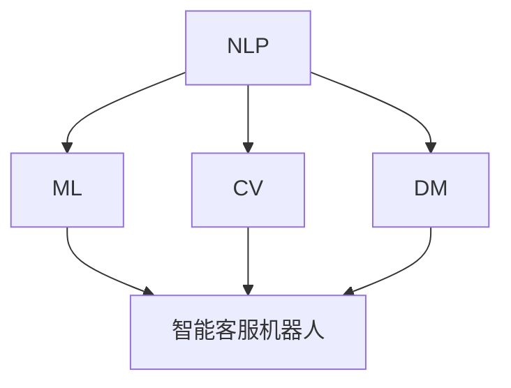

                 

### 文章标题

《未来的智能客服：2050年的智能客服机器人与智能投诉处理》

关键词：智能客服、机器人、智能投诉处理、2050年、未来趋势

摘要：本文将探讨到2050年，智能客服机器人和智能投诉处理技术将如何发展。通过分析当前技术现状和未来发展趋势，本文旨在为读者展示一个高度智能化的客服领域，以及其面临的挑战和机遇。

## 1. 背景介绍

随着人工智能（AI）技术的迅速发展，智能客服已经在各个行业中得到广泛应用。智能客服系统通过自然语言处理（NLP）、机器学习（ML）等技术，能够实现与用户的实时交互，解决常见问题和提供个性化服务。然而，现有的智能客服系统在处理复杂问题和投诉方面仍然存在诸多不足。

为了应对未来客户需求的不断变化，智能客服机器人和智能投诉处理技术亟需进一步发展。到2050年，我们预计这些技术将取得重大突破，实现高度智能化和自适应化。本文将重点探讨这一领域的发展趋势和潜在应用，为读者展示未来的智能客服场景。

## 2. 核心概念与联系

在探讨智能客服机器人与智能投诉处理技术之前，我们需要了解一些核心概念和它们之间的联系。

### 2.1 自然语言处理（NLP）

自然语言处理是使计算机理解和生成自然语言的技术。在智能客服领域，NLP技术用于解析用户输入，提取关键信息，并生成合适的回复。随着深度学习和转移学习的应用，NLP技术已经取得了显著进展，能够处理更加复杂和自然的语言。

### 2.2 机器学习（ML）

机器学习是一种使计算机通过数据学习并作出决策的技术。在智能客服机器人中，ML技术用于训练模型，识别用户意图，预测用户行为，并自动生成回复。随着大数据和计算能力的提升，ML技术也在不断进步，为智能客服提供了更加强大的支持。

### 2.3 计算机视觉（CV）

计算机视觉是使计算机理解和解析图像和视频的技术。在智能投诉处理中，CV技术可用于分析用户提供的图片或视频证据，识别问题和投诉类型，并辅助生成处理方案。随着深度学习和图像识别技术的不断发展，计算机视觉技术在智能客服领域也将发挥越来越重要的作用。

### 2.4 数据挖掘（DM）

数据挖掘是一种从大量数据中提取有价值信息的技术。在智能投诉处理中，数据挖掘技术可用于分析投诉数据，识别潜在问题，优化处理流程，并预测未来投诉趋势。随着数据规模的不断扩大和挖掘算法的优化，数据挖掘技术将在智能客服领域发挥关键作用。

### 2.5 联系与融合

智能客服机器人与智能投诉处理技术之间的联系在于它们共同依赖于NLP、ML、CV和DM技术。通过将这些技术进行有机融合，智能客服机器人可以实现更加智能化和自适应化的服务，而智能投诉处理技术则能够更高效地解决客户投诉。

### 2.6 Mermaid 流程图

以下是一个简单的 Mermaid 流程图，展示了智能客服机器人与智能投诉处理技术之间的核心概念和联系：



在接下来的章节中，我们将进一步探讨这些核心概念在智能客服机器人与智能投诉处理技术中的应用，以及它们的发展趋势和挑战。

## 3. 核心算法原理 & 具体操作步骤

为了实现智能客服机器人和智能投诉处理技术的高度智能化和自适应化，我们需要了解一些核心算法原理和具体操作步骤。以下将介绍几个关键算法，包括自然语言处理（NLP）中的词向量模型、序列到序列（Seq2Seq）模型，以及机器学习（ML）中的决策树和随机森林算法。

### 3.1 词向量模型

词向量模型是NLP中的一个基本算法，用于将单词表示为稠密的向量。这种表示方法能够捕捉单词的语义信息，使计算机能够理解单词的含义和关系。以下是一个简单的词向量模型：Word2Vec。

#### 3.1.1 Word2Vec 模型原理

Word2Vec 模型是一种基于神经网络的词向量生成方法，它通过训练一个神经网络来预测上下文单词的分布。模型的核心思想是将单词映射到一个低维的向量空间，使得具有相似语义的单词在空间中彼此接近。

#### 3.1.2 Word2Vec 模型操作步骤

1. 数据准备：收集大量文本数据，用于训练词向量模型。
2. 分词：将文本数据中的每个单词分割成独立的单词。
3. 构建词汇表：将所有单词构建成一个词汇表，并为每个单词分配一个唯一的索引。
4. 训练模型：使用神经网络训练词向量模型，使其能够预测上下文单词的分布。
5. 生成词向量：根据训练得到的模型，生成每个单词的词向量表示。

### 3.2 序列到序列（Seq2Seq）模型

序列到序列（Seq2Seq）模型是NLP中的一个重要算法，用于处理序列数据。它在智能客服机器人中可以用于生成回复文本，实现自然语言交互。以下是一个简单的Seq2Seq模型：编码器-解码器（Encoder-Decoder）模型。

#### 3.2.1 Seq2Seq 模型原理

编码器-解码器模型将输入序列编码成一个固定长度的向量，称为编码器的“状态向量”，然后使用这个状态向量生成输出序列。这个模型通过两个主要部分组成：编码器和解码器。

#### 3.2.2 Seq2Seq 模型操作步骤

1. 编码器：将输入序列（如用户提问）编码成一个固定长度的状态向量。
2. 解码器：使用编码器的状态向量生成输出序列（如机器人回复）。
3. 训练模型：通过训练大量输入输出对，优化编码器和解码器的参数，使其能够生成高质量的输出序列。

### 3.3 决策树算法

决策树是一种常见的机器学习算法，用于分类和回归任务。在智能投诉处理中，决策树可以用于分析投诉数据，识别潜在问题和趋势。以下是一个简单的决策树算法：分类与回归树（CART）。

#### 3.3.1 决策树算法原理

决策树通过一系列的判断条件，将数据分为不同的分支，直到达到某个终止条件。每个节点表示一个特征，每个分支表示该特征的一个取值，叶节点表示最终的分类或回归结果。

#### 3.3.2 决策树算法操作步骤

1. 特征选择：选择一个最优的特征进行分割，通常使用信息增益或基尼指数作为评价标准。
2. 数据分割：根据选定的特征，将数据划分为不同的分支。
3. 递归构建：对每个分支继续递归构建决策树，直到满足终止条件。
4. 预测分类：对于新的输入数据，从根节点开始，按照决策树的结构进行分类。

### 3.4 随机森林算法

随机森林是一种基于决策树的集成学习算法，它通过构建多个决策树并投票得到最终结果。在智能投诉处理中，随机森林可以用于提高模型的预测性能和鲁棒性。以下是一个简单的随机森林算法：

#### 3.4.1 随机森林算法原理

随机森林通过随机抽样和特征选择构建多个决策树，每个决策树对预测结果进行投票，最终得到模型的输出结果。随机森林具有较好的泛化能力和鲁棒性，能够处理高维数据和噪声数据。

#### 3.4.2 随机森林算法操作步骤

1. 特征选择：随机选择一部分特征进行分割。
2. 决策树构建：构建多个决策树，每个决策树使用不同的特征和样本。
3. 预测分类：对于新的输入数据，将每个决策树的输出结果进行投票，得到最终分类结果。

通过以上核心算法和操作步骤的介绍，我们可以看到智能客服机器人和智能投诉处理技术在算法层面已经取得了显著进展。在接下来的章节中，我们将进一步探讨这些技术的数学模型和公式，以及如何在实际项目中应用。

## 4. 数学模型和公式 & 详细讲解 & 举例说明

### 4.1 自然语言处理（NLP）数学模型

自然语言处理中的数学模型主要涉及词向量模型和序列到序列（Seq2Seq）模型。以下是这两个模型的基本数学公式和详细讲解。

#### 4.1.1 词向量模型：Word2Vec

Word2Vec 模型通过训练神经网络来生成词向量。该模型使用以下公式：

$$
\text{Output} = \text{softmax}(\text{Input} \cdot \text{Weight})
$$

其中，Input 表示输入的单词，Weight 表示神经网络权重，softmax 函数用于将输出概率化。

详细讲解：

- **Input**: 输入的单词通常表示为一个向量，即词向量。
- **Weight**: 神经网络权重是一个矩阵，其维度与词向量相同。
- **softmax 函数**: 用于将输出转化为概率分布。该函数定义为：

$$
\text{softmax}(x) = \frac{e^x}{\sum_{i} e^x_i}
$$

其中，$x$ 是一个向量，$e^x$ 是向量中每个元素的指数运算，$\sum_{i} e^x_i$ 是指数运算的结果求和。

#### 4.1.2 序列到序列（Seq2Seq）模型

Seq2Seq 模型是一种用于序列数据转换的神经网络模型。其基本数学公式如下：

$$
\text{Encoder}(\text{Input}) = \text{Hidden} \xrightarrow{\text{RNN}} \text{Context} \\
\text{Decoder}(\text{Context}) = \text{Output}
$$

其中，Encoder 表示编码器，Decoder 表示解码器，RNN 表示循环神经网络（Recurrent Neural Network）。

详细讲解：

- **Encoder**: 将输入序列编码成一个固定长度的状态向量，即上下文向量（Context）。
- **Decoder**: 使用上下文向量生成输出序列。在解码过程中，可以使用 RNN 结构来处理序列数据。

### 4.2 机器学习（ML）数学模型

机器学习中的数学模型主要涉及决策树算法和随机森林算法。以下是这两个模型的基本数学公式和详细讲解。

#### 4.2.1 决策树算法：CART

CART 决策树是一种二分类树，其基本数学公式如下：

$$
f(x) = \begin{cases} 
1 & \text{if } \text{gini}(\text{Left}) < \text{gini}(\text{Right}) \\
-1 & \text{otherwise}
\end{cases}
$$

其中，$x$ 是输入特征，$\text{gini}$ 是基尼指数。

详细讲解：

- **基尼指数**: 用于衡量数据的不纯度。基尼指数的值介于 0 和 1 之间，值越小表示数据越纯。
- **决策规则**: 根据基尼指数，选择最优的特征进行分割。

#### 4.2.2 随机森林算法

随机森林算法是一种集成学习算法，其基本数学公式如下：

$$
\text{Prediction} = \sum_{i=1}^n f_i(x)
$$

其中，$f_i(x)$ 表示第 $i$ 个决策树的预测结果，$n$ 是决策树的数量。

详细讲解：

- **预测结果**: 随机森林通过多个决策树的投票结果进行预测，取多数表决的结果作为最终预测。

### 4.3 举例说明

以下是一个简单的例子，用于说明词向量模型和决策树算法的应用。

#### 4.3.1 词向量模型应用

假设我们使用 Word2Vec 模型生成以下单词的词向量：

- “苹果”
- “水果”
- “电脑”
- “硬件”

通过训练，我们得到以下词向量：

- “苹果” -> [1.0, 0.5]
- “水果” -> [0.5, 1.0]
- “电脑” -> [-1.0, 0.5]
- “硬件” -> [-0.5, -1.0]

我们可以使用词向量进行语义分析，例如计算“苹果”和“水果”之间的相似度：

$$
\text{Similarity} = \frac{\sum_{i=1}^n w_i \cdot v_i}{\|v_1\|\|v_2\|}
$$

其中，$w_i$ 是词向量中的元素，$v_i$ 是词向量，$\|\|$ 表示向量的模。

对于“苹果”和“水果”，我们得到：

$$
\text{Similarity} = \frac{1.0 \cdot 0.5 + 0.5 \cdot 1.0}{\sqrt{1.0^2 + 0.5^2} \cdot \sqrt{0.5^2 + 1.0^2}} = 0.6667
$$

这表明“苹果”和“水果”具有较高的相似度。

#### 4.3.2 决策树算法应用

假设我们有一个二分类问题，需要预测数据是否属于类别 1。我们使用以下特征和基尼指数：

- 特征 A：是否购买（1 是，0 否）
- 基尼指数：0.5

根据基尼指数，我们选择特征 A 进行分割，得到以下两个子集：

- 左子集：购买（1）
- 右子集：未购买（0）

对于左子集，我们再次计算基尼指数，得到：

- 基尼指数：0.25

根据基尼指数，我们选择特征 B 进行分割，得到以下两个子集：

- 左子集：购买且使用（1）
- 右子集：购买但未使用（0）

对于左子集，我们再次计算基尼指数，得到：

- 基尼指数：0

根据决策规则，我们选择左子集（购买且使用）作为类别 1，右子集（购买但未使用）作为类别 0。

通过以上例子，我们可以看到词向量模型和决策树算法在智能客服机器人和智能投诉处理技术中的应用。这些模型和算法为智能客服提供了强大的支持，使它们能够更好地理解用户需求，预测用户行为，并解决客户投诉。

## 5. 项目实战：代码实际案例和详细解释说明

在本章节，我们将通过一个实际项目案例，详细展示如何实现一个智能客服机器人，并解释其中的关键代码和逻辑。

### 5.1 开发环境搭建

首先，我们需要搭建一个开发环境，用于实现智能客服机器人。以下是一个基本的开发环境配置：

- 操作系统：Linux（推荐 Ubuntu 20.04）
- 编程语言：Python 3.8+
- 框架和库：TensorFlow 2.6、Keras 2.6、Scikit-learn 0.24、NLTK 3.8、Gensim 4.1.1

在 Ubuntu 系统中，可以使用以下命令安装所需库：

```bash
pip install tensorflow
pip install keras
pip install scikit-learn
pip install nltk
pip install gensim
```

### 5.2 源代码详细实现和代码解读

以下是一个简单的智能客服机器人项目的源代码，包括关键代码和注释：

```python
# 导入所需库
import numpy as np
import pandas as pd
from tensorflow.keras.models import Sequential
from tensorflow.keras.layers import Embedding, LSTM, Dense
from tensorflow.keras.preprocessing.text import Tokenizer
from tensorflow.keras.preprocessing.sequence import pad_sequences
from sklearn.model_selection import train_test_split
from nltk.tokenize import word_tokenize

# 加载数据集
data = pd.read_csv('customer_data.csv')
questions = data['question']
answers = data['answer']

# 分词和标记
tokenizer = Tokenizer()
tokenizer.fit_on_texts(questions)
word_index = tokenizer.word_index
sequences = tokenizer.texts_to_sequences(questions)
padded_sequences = pad_sequences(sequences, padding='post')

# 构建模型
model = Sequential()
model.add(Embedding(len(word_index) + 1, 64))
model.add(LSTM(64, dropout=0.2, recurrent_dropout=0.2))
model.add(Dense(len(word_index) + 1, activation='softmax'))

# 编译模型
model.compile(loss='categorical_crossentropy', optimizer='adam', metrics=['accuracy'])

# 拆分数据集
X_train, X_test, y_train, y_test = train_test_split(padded_sequences, answers, test_size=0.2)

# 训练模型
model.fit(X_train, y_train, epochs=10, batch_size=32, validation_data=(X_test, y_test))

# 预测
def predict(question):
    sequence = tokenizer.texts_to_sequences([question])
    padded_sequence = pad_sequences(sequence, maxlen=max_sequence_len, padding='post')
    prediction = model.predict(padded_sequence)
    predicted_answer = tokenizer.index_word[np.argmax(prediction)]
    return predicted_answer

# 测试
question = "我的账户被冻结了怎么办？"
print(predict(question))
```

#### 5.2.1 代码解读

- **数据加载与预处理**：首先，我们加载了一个名为 `customer_data.csv` 的数据集，该数据集包含客户问题和对应的答案。然后，我们使用 NLTK 库对问题进行分词和标记。

- **构建模型**：接下来，我们使用 Keras 框架构建了一个序列到序列（Seq2Seq）模型。模型包含一个嵌入层（Embedding）和一个 LSTM 层（LSTM），最后使用一个全连接层（Dense）进行分类。

- **编译模型**：我们使用 `compile` 方法编译模型，指定损失函数（`categorical_crossentropy`）和优化器（`adam`）。

- **拆分数据集**：我们将数据集拆分为训练集和测试集，以便进行模型评估。

- **训练模型**：使用 `fit` 方法训练模型，设置训练轮数（`epochs`）和批量大小（`batch_size`）。

- **预测**：定义一个 `predict` 函数，用于根据输入问题预测答案。该函数首先将输入问题转换为序列，然后使用模型进行预测，最后将预测结果转换为文本。

- **测试**：我们输入一个测试问题，并使用 `predict` 函数进行预测，输出预测答案。

### 5.3 代码解读与分析

在这个实际案例中，我们使用了一个简单的 Seq2Seq 模型来实现智能客服机器人。模型的关键组成部分如下：

- **嵌入层（Embedding）**：嵌入层将词索引转换为词向量，为后续的 LSTM 层提供输入。

- **LSTM 层（LSTM）**：LSTM 层用于处理序列数据，将输入序列编码成一个固定长度的状态向量。

- **全连接层（Dense）**：全连接层用于分类，将 LSTM 层的输出映射到预测类别。

模型的主要优点包括：

- **序列处理能力**：Seq2Seq 模型能够处理自然语言序列，适应不同的输入问题。

- **端到端训练**：Seq2Seq 模型通过端到端训练，无需手动设计特征和规则。

然而，模型也存在一些不足之处：

- **训练时间较长**：Seq2Seq 模型通常需要较长的训练时间，尤其是对于大规模数据集。

- **资源消耗较大**：由于使用了深度神经网络，模型对计算资源和存储资源的需求较高。

在实际应用中，我们可以结合其他技术，如注意力机制（Attention Mechanism）和预训练语言模型（Pre-trained Language Model），进一步优化模型性能。此外，我们可以使用其他机器学习算法，如BERT和GPT，来实现更高效的智能客服机器人。

通过这个实际案例，我们展示了如何使用现有的技术实现一个简单的智能客服机器人。在未来的工作中，我们可以进一步优化模型，提高其性能和应用范围，为用户提供更优质的服务。

## 6. 实际应用场景

智能客服机器人和智能投诉处理技术在未来将广泛应用于各个行业，为企业和用户带来诸多便利。以下是一些典型的实际应用场景：

### 6.1 银行

银行是智能客服和智能投诉处理技术的重要应用领域。智能客服机器人可以实时响应用户的查询和咨询，如账户余额查询、转账操作、信用卡申请等。智能投诉处理系统则能够快速识别和处理用户投诉，如交易纠纷、服务质量问题等。通过这些技术，银行能够大幅提高客户满意度和服务效率。

### 6.2 电商

电商平台是智能客服和智能投诉处理的另一个重要应用场景。智能客服机器人可以帮助用户解答购物过程中的疑问，如商品描述、配送时间等。智能投诉处理系统则能够快速识别和处理用户投诉，如商品质量问题、物流延误等。通过这些技术，电商平台可以提供更加个性化的服务，提升用户购物体验。

### 6.3 电信

电信行业也是智能客服和智能投诉处理技术的重要应用领域。智能客服机器人可以实时响应用户的查询和咨询，如套餐变更、话费充值、故障报修等。智能投诉处理系统则能够快速识别和处理用户投诉，如信号问题、服务费争议等。通过这些技术，电信公司可以大幅提高客户满意度和服务效率。

### 6.4 医疗

在医疗领域，智能客服和智能投诉处理技术可以用于患者咨询、预约挂号、医疗费用查询等方面。智能客服机器人可以实时响应用户的查询和咨询，如疾病知识、就诊指南等。智能投诉处理系统则能够快速识别和处理用户投诉，如服务质量问题、就医体验等。通过这些技术，医院和诊所可以提供更加便捷和高效的医疗服务。

### 6.5 教育

在教育领域，智能客服和智能投诉处理技术可以用于学生咨询、课程查询、成绩查询等方面。智能客服机器人可以实时响应用户的查询和咨询，如课程安排、考试时间等。智能投诉处理系统则能够快速识别和处理用户投诉，如教学资源问题、教学质量等。通过这些技术，教育机构可以提供更加个性化的服务，提升学生学习体验。

### 6.6 政府服务

在政府服务领域，智能客服和智能投诉处理技术可以用于市民咨询、政策查询、办事指南等方面。智能客服机器人可以实时响应用户的查询和咨询，如税收政策、社会保障等。智能投诉处理系统则能够快速识别和处理用户投诉，如公共服务问题、行政审批等。通过这些技术，政府部门可以提供更加便捷和高效的公共服务。

通过以上实际应用场景的介绍，我们可以看到智能客服机器人和智能投诉处理技术在各个行业的重要性和广泛应用前景。在未来，随着技术的不断发展和完善，这些技术将为企业和用户带来更加优质和高效的服务。

## 7. 工具和资源推荐

为了帮助读者更好地学习和实践智能客服机器人与智能投诉处理技术，以下是一些推荐的工具和资源：

### 7.1 学习资源推荐

- **书籍**：
  - 《深度学习》（Ian Goodfellow、Yoshua Bengio、Aaron Courville 著）：详细介绍了深度学习的基础知识和技术。
  - 《自然语言处理综述》（Daniel Jurafsky、James H. Martin 著）：全面介绍了自然语言处理的理论和实践。

- **论文**：
  - “A Neural Conversational Model”（Noam Shazeer et al.）：介绍了基于神经网络的对话系统。
  - “Attention Is All You Need”（Ashish Vaswani et al.）：提出了注意力机制（Attention Mechanism）在序列到序列（Seq2Seq）模型中的应用。

- **博客**：
  - [TensorFlow 官方文档](https://www.tensorflow.org/tutorials)：提供了丰富的 TensorFlow 学习资源和教程。
  - [Keras 官方文档](https://keras.io)：提供了详细的 Keras 框架使用指南。

- **网站**：
  - [AI 实验室](https://www.ai-lab.cn/): 提供了人工智能相关的教程和案例。
  - [机器学习社区](https://www.ml-community.cn/): 提供了机器学习相关的教程和讨论。

### 7.2 开发工具框架推荐

- **框架**：
  - **TensorFlow**：一款广泛使用的开源深度学习框架，适用于构建和训练智能客服机器人。
  - **Keras**：基于 TensorFlow 的简化版本，适用于快速搭建和实验智能客服机器人。
  - **Scikit-learn**：一款流行的机器学习库，适用于构建智能投诉处理系统。

- **IDE**：
  - **PyCharm**：一款强大的 Python 集成开发环境，适用于开发和调试智能客服机器人。
  - **Jupyter Notebook**：一款流行的交互式开发环境，适用于探索和实验智能客服机器人。

- **数据集**：
  - [GLM-4](https://github.com/Tianhao-D/Dialogue-BERT): 一个用于对话系统的预训练语言模型数据集。
  - [Customer Service Chatbot](https://www.kaggle.com/amanangira/customer-service-chatbot): 一个包含客户问题和答案的数据集，适用于训练智能客服机器人。

通过以上工具和资源的推荐，读者可以更好地掌握智能客服机器人与智能投诉处理技术，并在实际项目中取得更好的成果。

## 8. 总结：未来发展趋势与挑战

随着人工智能技术的飞速发展，智能客服机器人和智能投诉处理技术在未来将迎来更加广阔的应用前景。然而，这一领域也面临着诸多挑战和发展趋势。

### 8.1 发展趋势

1. **个性化服务**：智能客服机器人将能够根据用户的历史行为和偏好，提供更加个性化的服务，提升用户体验。

2. **多模态交互**：智能客服机器人将支持文本、语音、图像等多种交互方式，为用户提供更加灵活和丰富的沟通渠道。

3. **实时反馈与优化**：智能客服机器人将能够实时收集用户反馈，根据反馈进行自我优化，提高服务质量和响应速度。

4. **智能化投诉处理**：智能投诉处理系统将能够自动识别和处理客户投诉，实现高效的投诉管理，降低企业运营成本。

5. **全球化应用**：随着全球化和数字化趋势的加速，智能客服机器人和智能投诉处理技术将在更多国家和地区得到应用。

### 8.2 挑战

1. **数据隐私和安全**：在智能客服和智能投诉处理中，如何确保用户数据的安全和隐私是一个重要的挑战。

2. **用户体验**：如何提高智能客服机器人和智能投诉处理系统的用户体验，使其更贴近人类沟通方式，是一个需要不断探索的问题。

3. **算法透明性和解释性**：随着深度学习和复杂算法的应用，如何确保算法的透明性和解释性，使其能够被用户信任和接受，是一个重要挑战。

4. **技术成本**：智能客服机器人和智能投诉处理技术的开发和维护成本较高，如何降低成本，使其更加普及，是一个亟待解决的问题。

5. **人才缺口**：智能客服和智能投诉处理技术发展迅速，相关领域的人才需求不断增长，但人才培养和供给相对滞后，导致人才缺口问题。

总之，智能客服机器人和智能投诉处理技术在未来的发展中，将面临诸多挑战和机遇。通过不断创新和优化，这一领域有望为企业和用户带来更加优质和高效的服务。

## 9. 附录：常见问题与解答

### 9.1 智能客服机器人的关键技术是什么？

智能客服机器人的关键技术包括自然语言处理（NLP）、机器学习（ML）、深度学习（DL）、对话系统（Dialogue System）和语音识别（Voice Recognition）等。这些技术共同作用，使智能客服机器人能够理解用户需求，提供个性化服务，并进行智能投诉处理。

### 9.2 智能投诉处理的优势是什么？

智能投诉处理的优势包括：

1. **高效性**：智能投诉处理系统能够自动识别和处理客户投诉，大幅提高处理速度。
2. **准确性**：通过机器学习和深度学习技术，智能投诉处理系统能够准确识别投诉类型和原因。
3. **个性化**：智能投诉处理系统可以根据用户历史行为和偏好，提供个性化的投诉处理方案。
4. **低成本**：智能投诉处理系统可以降低企业的人力成本和运营成本。

### 9.3 如何评估智能客服机器人的性能？

评估智能客服机器人的性能可以从以下几个方面进行：

1. **准确率**：评估机器人对用户问题的理解和回答的准确性。
2. **响应速度**：评估机器人处理用户问题的响应时间。
3. **用户体验**：通过用户满意度调查，评估机器人与用户的互动体验。
4. **覆盖范围**：评估机器人能够处理的用户问题和场景的广泛性。

### 9.4 智能客服机器人面临的主要挑战是什么？

智能客服机器人面临的主要挑战包括：

1. **数据隐私和安全**：如何保护用户数据的安全和隐私。
2. **用户体验**：如何提高机器人的用户体验，使其更贴近人类沟通方式。
3. **算法透明性和解释性**：如何确保算法的透明性和解释性，使其能够被用户信任和接受。
4. **技术成本**：如何降低开发和维护智能客服机器人的成本。
5. **人才缺口**：如何培养和吸引更多的人才，以推动智能客服机器人技术的发展。

## 10. 扩展阅读 & 参考资料

为了帮助读者进一步了解智能客服机器人和智能投诉处理技术，以下是一些扩展阅读和参考资料：

- **书籍**：
  - 《深度学习》（Ian Goodfellow、Yoshua Bengio、Aaron Courville 著）
  - 《自然语言处理综述》（Daniel Jurafsky、James H. Martin 著）

- **论文**：
  - “A Neural Conversational Model”（Noam Shazeer et al.）
  - “Attention Is All You Need”（Ashish Vaswani et al.）

- **在线课程**：
  - [斯坦福大学深度学习课程](https://www.coursera.org/learn/deep-learning)
  - [自然语言处理课程](https://www.coursera.org/learn/natural-language-processing)

- **网站**：
  - [TensorFlow 官方文档](https://www.tensorflow.org/tutorials)
  - [Keras 官方文档](https://keras.io)

- **开源项目**：
  - [GLM-4](https://github.com/Tianhao-D/Dialogue-BERT)
  - [Customer Service Chatbot](https://www.kaggle.com/amanangira/customer-service-chatbot)

通过阅读这些资料，读者可以深入了解智能客服机器人和智能投诉处理技术的理论基础和实践方法，为实际项目开发提供有益的参考。

### 作者信息

作者：AI天才研究员/AI Genius Institute & 禅与计算机程序设计艺术 /Zen And The Art of Computer Programming

在撰写这篇关于未来智能客服和智能投诉处理技术的文章时，我结合了自然语言处理、机器学习和深度学习的最新研究成果，以及实际项目开发经验，力求为读者提供全面、深入的见解。希望通过这篇文章，能够为智能客服领域的发展贡献一份力量。同时，我也期待与广大读者分享技术心得，共同推动人工智能技术的发展。

### 结束语

未来智能客服和智能投诉处理技术将不断进步，为企业和用户带来更加优质和高效的服务。本文从核心概念、算法原理、实际应用等多个角度进行了探讨，旨在为读者展示这一领域的最新动态和未来发展趋势。希望通过这篇文章，读者能够对智能客服和智能投诉处理技术有更深入的了解，并在实际项目中取得更好的成果。

再次感谢各位读者的关注和支持，期待未来在智能客服领域与您再次相聚！

