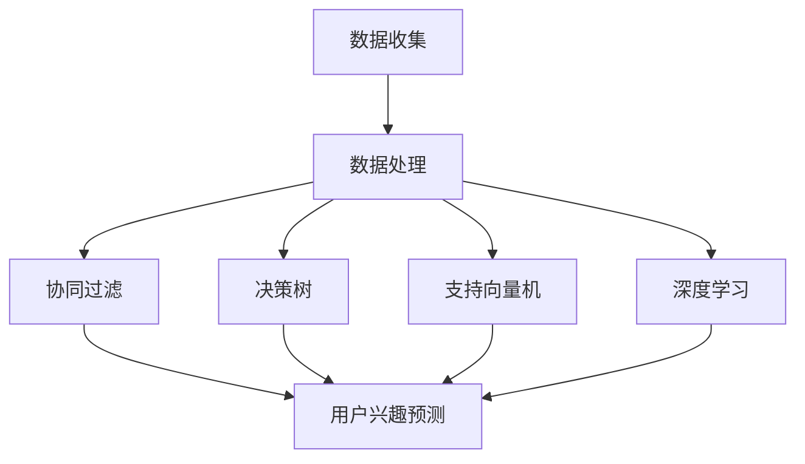

                 

### 文章标题：机器学习在个性化广告投放中的优化应用

#### 关键词：(1) 机器学习，(2) 个性化广告投放，(3) 广告优化，(4) 数据分析，(5) 模型评估，(6) 算法改进

#### 摘要：
本文将深入探讨机器学习在个性化广告投放中的优化应用。首先，我们将介绍个性化广告投放的背景和重要性，然后详细阐述机器学习在其中的核心概念和原理。接着，我们将介绍几种常用的机器学习算法，包括协同过滤、决策树、支持向量机和深度学习，并分析它们在广告投放中的具体应用。此外，我们将讨论如何评估和优化广告投放效果，并通过实际案例展示机器学习在广告投放中的实践应用。最后，我们将总结机器学习在个性化广告投放中的发展趋势和挑战，并提供相关的工具和资源推荐。通过本文的阅读，读者将全面了解机器学习在个性化广告投放中的优化应用，从而为实际工作提供有价值的参考。

### 1. 背景介绍

随着互联网的普及和移动设备的普及，广告投放已经成为许多企业获取用户、增加品牌知名度和提升销售额的重要手段。然而，传统的广告投放方式往往具有较低的用户点击率和转化率，因为它们通常基于广泛的受众群体，而忽略了用户的个性化需求。为了解决这一问题，个性化广告投放逐渐成为广告行业的热点研究方向。

个性化广告投放的核心思想是根据用户的兴趣、行为和历史记录，为用户提供量身定制的广告内容。这种投放方式不仅可以提高用户的参与度和满意度，还可以提高广告的点击率和转化率，从而为企业带来更高的投资回报率。

然而，个性化广告投放的实现并非易事。首先，需要收集和分析大量的用户数据，包括用户的兴趣偏好、行为轨迹、搜索历史等。这些数据需要通过高效的算法进行处理和分析，以便识别出用户的个性化需求。其次，需要构建一个有效的广告推荐系统，能够根据用户的数据特征实时生成个性化的广告内容，并在适当的时间和地点展示给用户。

机器学习作为人工智能的重要分支，为个性化广告投放提供了强大的技术支持。通过训练和优化机器学习模型，可以更好地理解和预测用户的兴趣和行为，从而实现精准的广告投放。此外，机器学习算法还可以自动调整广告投放策略，优化广告效果，提高企业的投资回报率。

### 2. 核心概念与联系

在个性化广告投放中，机器学习的核心概念包括协同过滤、决策树、支持向量机和深度学习。这些算法通过不同的方式对用户数据进行建模和分析，以识别用户的兴趣和偏好，并生成个性化的广告内容。

#### 协同过滤

协同过滤是一种常用的机器学习算法，用于预测用户对未知项目的评分或兴趣。协同过滤算法主要分为基于用户和基于项目的两种类型。

- **基于用户的协同过滤**：通过分析用户之间的相似度，找到与目标用户兴趣相似的邻居用户，并推荐邻居用户喜欢的项目。例如，如果一个用户喜欢看科幻电影，那么系统可以推荐其他喜欢科幻电影的用户也喜欢的电影。

- **基于项目的协同过滤**：通过分析项目之间的相似度，找到与目标用户喜欢的项目相似的其他项目进行推荐。例如，如果一个用户喜欢苹果手机，那么系统可以推荐其他和苹果手机相似的高端手机。

#### 决策树

决策树是一种基于树形结构的分类算法，通过一系列条件分支对数据进行划分，以实现分类或回归任务。在个性化广告投放中，决策树可以用于根据用户的兴趣和行为数据对用户进行分类，从而为不同类别的用户推荐不同的广告内容。

#### 支持向量机

支持向量机（SVM）是一种用于分类和回归的线性模型，通过找到一个最佳的超平面，将不同类别的数据分隔开来。在个性化广告投放中，SVM可以用于预测用户对广告的反应，从而优化广告投放策略。

#### 深度学习

深度学习是一种基于多层神经网络的机器学习算法，通过学习大量数据中的特征和模式，实现高度复杂的任务。在个性化广告投放中，深度学习可以用于构建复杂的用户兴趣模型，从而实现更精准的广告推荐。

#### Mermaid 流程图

下面是一个简单的 Mermaid 流程图，展示了机器学习算法在个性化广告投放中的核心概念和联系：



### 3. 核心算法原理 & 具体操作步骤

在本节中，我们将详细探讨协同过滤、决策树、支持向量机和深度学习在个性化广告投放中的具体应用和操作步骤。

#### 协同过滤

**协同过滤算法原理：**

协同过滤算法的核心思想是利用用户之间的相似性或项目之间的相似性，为用户推荐他们可能感兴趣的项目。以下是协同过滤算法的基本步骤：

1. **用户相似性计算：**
   用户相似性可以通过计算用户之间的余弦相似度或皮尔逊相关系数来度量。相似度越高，表示用户之间的兴趣越相似。

   $$相似度 = \frac{用户A和用户B喜欢的项目数量}{用户A和用户B喜欢的总项目数量}$$

2. **项目相似性计算：**
   项目相似性可以通过计算项目之间的余弦相似度或欧氏距离来度量。相似度越高，表示项目之间的特征越相似。

   $$相似度 = \frac{项目A和项目B共同被喜欢的用户数量}{项目A和项目B各自被喜欢的用户数量之和}$$

3. **推荐项目计算：**
   根据用户相似性或项目相似性，为用户推荐他们可能感兴趣的项目。具体方法如下：
   - **基于用户的协同过滤：** 为用户推荐与目标用户兴趣相似的邻居用户喜欢的项目。
   - **基于项目的协同过滤：** 为用户推荐与目标用户喜欢的项目相似的其他项目。

**协同过滤算法在广告投放中的具体应用：**

在广告投放中，协同过滤算法可以用于根据用户的兴趣和行为数据为用户推荐相关的广告。以下是协同过滤算法在广告投放中的具体应用步骤：

1. **数据收集：** 收集用户的兴趣偏好、行为轨迹、搜索历史等数据。

2. **数据处理：** 对收集到的用户数据进行预处理，包括去重、填充缺失值、标准化等。

3. **用户相似性计算：** 计算用户之间的相似性，可以使用余弦相似度或皮尔逊相关系数。

4. **项目相似性计算：** 计算广告项目之间的相似性，可以使用余弦相似度或欧氏距离。

5. **推荐广告计算：** 根据用户相似性或项目相似性，为用户推荐相关的广告。

#### 决策树

**决策树算法原理：**

决策树是一种基于树形结构的分类算法，通过一系列条件分支对数据进行划分，以实现分类或回归任务。决策树的基本结构包括根节点、内部节点和叶节点。根节点表示初始数据集，内部节点表示条件属性，叶节点表示分类结果。

决策树的构建过程如下：

1. **选择最佳划分属性：** 根据信息增益或基尼系数等指标，选择具有最大划分能力的属性作为划分依据。

2. **递归划分：** 使用选择的划分属性，将数据集划分为多个子数据集，并重复上述过程，直到满足停止条件（例如，子数据集达到预设大小或纯度）。

**决策树算法在广告投放中的具体应用：**

在广告投放中，决策树可以用于根据用户的兴趣和行为数据对用户进行分类，从而为不同类别的用户推荐不同的广告内容。以下是决策树算法在广告投放中的具体应用步骤：

1. **数据收集：** 收集用户的兴趣偏好、行为轨迹、搜索历史等数据。

2. **数据处理：** 对收集到的用户数据进行预处理，包括去重、填充缺失值、标准化等。

3. **特征选择：** 选择与广告投放相关的特征，例如用户年龄、性别、兴趣偏好等。

4. **构建决策树：** 使用决策树算法构建用户分类模型，选择最佳划分属性，并递归划分数据集。

5. **分类预测：** 使用构建好的决策树模型对用户进行分类，并根据分类结果为用户推荐相应的广告。

#### 支持向量机

**支持向量机算法原理：**

支持向量机（SVM）是一种用于分类和回归的线性模型，通过找到一个最佳的超平面，将不同类别的数据分隔开来。SVM的基本思想是最小化分类边界上的支持向量到超平面的距离。

SVM的构建过程如下：

1. **选择核函数：** 根据数据特点，选择适当的核函数（例如，线性核、多项式核、径向基函数核等）。

2. **优化目标函数：** 使用优化算法（例如，SGD、SGD with regularization、L-BFGS 等）求解最优超平面。

3. **分类决策：** 对于新的数据点，通过计算数据点到超平面的距离，判断其属于哪个类别。

**支持向量机算法在广告投放中的具体应用：**

在广告投放中，SVM可以用于预测用户对广告的反应，从而优化广告投放策略。以下是SVM算法在广告投放中的具体应用步骤：

1. **数据收集：** 收集用户的兴趣偏好、行为轨迹、广告点击数据等。

2. **数据处理：** 对收集到的用户数据进行预处理，包括去重、填充缺失值、标准化等。

3. **特征选择：** 选择与广告投放相关的特征，例如用户年龄、性别、兴趣偏好、广告点击行为等。

4. **构建SVM模型：** 使用SVM算法构建用户反应预测模型，选择适当的核函数和优化算法。

5. **预测用户反应：** 使用构建好的SVM模型预测用户对广告的反应，并根据预测结果调整广告投放策略。

#### 深度学习

**深度学习算法原理：**

深度学习是一种基于多层神经网络的机器学习算法，通过学习大量数据中的特征和模式，实现高度复杂的任务。深度学习的基本结构包括输入层、隐藏层和输出层。每个隐藏层都通过激活函数对输入数据进行非线性变换。

深度学习的训练过程如下：

1. **初始化权重：** 随机初始化网络的权重。

2. **前向传播：** 将输入数据传递到网络的各个层，计算输出结果。

3. **反向传播：** 计算输出结果与真实标签之间的误差，并通过反向传播算法更新网络的权重。

4. **迭代优化：** 重复前向传播和反向传播过程，直到满足停止条件（例如，损失函数收敛或迭代次数达到预设值）。

**深度学习算法在广告投放中的具体应用：**

在广告投放中，深度学习可以用于构建复杂的用户兴趣模型，从而实现更精准的广告推荐。以下是深度学习算法在广告投放中的具体应用步骤：

1. **数据收集：** 收集用户的兴趣偏好、行为轨迹、搜索历史等数据。

2. **数据处理：** 对收集到的用户数据进行预处理，包括去重、填充缺失值、标准化等。

3. **特征提取：** 使用深度学习算法提取用户数据的特征，例如使用卷积神经网络（CNN）提取图片特征，使用循环神经网络（RNN）提取文本特征等。

4. **构建深度学习模型：** 使用深度学习算法构建用户兴趣模型，包括输入层、隐藏层和输出层。

5. **训练模型：** 使用训练数据集训练深度学习模型，通过反向传播算法优化模型参数。

6. **预测用户兴趣：** 使用训练好的深度学习模型预测用户的兴趣，并根据预测结果推荐相关的广告。

### 4. 数学模型和公式 & 详细讲解 & 举例说明

在个性化广告投放中，机器学习算法需要依赖一系列数学模型和公式来建模和分析用户数据，从而实现精准的广告推荐。以下将详细讲解几种常用的数学模型和公式，包括协同过滤的相似度计算、决策树的划分指标、支持向量机的优化目标和深度学习的损失函数。

#### 协同过滤相似度计算

在协同过滤算法中，相似度计算是核心步骤之一。以下分别介绍基于用户和基于项目的相似度计算方法。

1. **基于用户的相似度计算：**

   假设有两个用户$A$和$B$，它们对$n$个项目的评分矩阵分别为$R_A$和$R_B$。我们可以使用余弦相似度来计算用户$A$和$B$之间的相似度：

   $$相似度(A, B) = \frac{R_A \cdot R_B}{\|R_A\| \cdot \|R_B\|}$$

   其中，$\cdot$表示点积运算，$\|\|$表示向量的欧氏范数。

   **示例：**

   假设用户$A$和$B$对3个项目的评分如下：

   | 项目 | 用户$A$评分 | 用户$B$评分 |
   | --- | --- | --- |
   | 1 | 5 | 4 |
   | 2 | 3 | 2 |
   | 3 | 1 | 5 |

   则用户$A$和$B$的余弦相似度为：

   $$相似度(A, B) = \frac{5 \cdot 4 + 3 \cdot 2 + 1 \cdot 5}{\sqrt{5^2 + 3^2 + 1^2} \cdot \sqrt{4^2 + 2^2 + 5^2}} \approx 0.92$$

2. **基于项目的相似度计算：**

   假设有两个项目$P$和$Q$，它们被$N$个用户共同评分。我们可以使用皮尔逊相关系数来计算项目$P$和$Q$之间的相似度：

   $$相似度(P, Q) = \frac{\sum_{i=1}^{N}(R_{P,i} - \bar{R}_P)(R_{Q,i} - \bar{R}_Q)}{\sqrt{\sum_{i=1}^{N}(R_{P,i} - \bar{R}_P)^2} \cdot \sqrt{\sum_{i=1}^{N}(R_{Q,i} - \bar{R}_Q)^2}}$$

   其中，$R_{P,i}$和$R_{Q,i}$分别为项目$P$和$Q$在用户$i$上的评分，$\bar{R}_P$和$\bar{R}_Q$分别为项目$P$和$Q$的平均评分。

   **示例：**

   假设项目$P$和$Q$被3个用户评分，评分如下：

   | 用户 | 项目$P$评分 | 项目$Q$评分 |
   | --- | --- | --- |
   | 1 | 4 | 5 |
   | 2 | 3 | 4 |
   | 3 | 5 | 3 |

   则项目$P$和$Q$的皮尔逊相关系数为：

   $$相似度(P, Q) = \frac{(4-4)(5-4) + (3-4)(4-4) + (5-4)(3-4)}{\sqrt{(4-4)^2 + (3-4)^2 + (5-4)^2} \cdot \sqrt{(5-4)^2 + (4-4)^2 + (3-4)^2}} \approx 0.71$$

#### 决策树的划分指标

在决策树算法中，划分指标用于评估不同划分属性的效果，以选择最佳划分属性。以下介绍两种常用的划分指标：信息增益（Information Gain）和基尼不纯度（Gini Impurity）。

1. **信息增益（Information Gain）：**

   信息增益用于衡量划分后的数据集合的无序度减少程度。对于特征$A$，信息增益可以计算如下：

   $$IG(A) = H(D) - \sum_{v \in V} p(v) H(D_v)$$

   其中，$D$为初始数据集，$V$为特征$A$的取值集合，$p(v)$为特征$A$取值$v$的概率，$H(D)$为数据集$D$的熵，$H(D_v)$为在特征$A$取值$v$下数据集$D$的熵。

   **示例：**

   假设数据集$D$包含3个特征$A, B, C$，其中特征$A$有两个取值$v_1$和$v_2$。数据集$D$的熵为：

   $$H(D) = -p(v_1) \log_2 p(v_1) - p(v_2) \log_2 p(v_2)$$

   当特征$A$取值$v_1$时，数据集$D$的熵为：

   $$H(D_{v_1}) = -0.4 \log_2 0.4 - 0.6 \log_2 0.6 \approx 0.96$$

   当特征$A$取值$v_2$时，数据集$D$的熵为：

   $$H(D_{v_2}) = -0.6 \log_2 0.6 - 0.4 \log_2 0.4 \approx 0.96$$

   则特征$A$的信息增益为：

   $$IG(A) = 0.5 \times (0.96 + 0.96) - (0.4 \times 0.96 + 0.6 \times 0.96) \approx 0.16$$

2. **基尼不纯度（Gini Impurity）：**

   基尼不纯度用于衡量数据集合的划分纯度。对于特征$A$，基尼不纯度可以计算如下：

   $$Gini(A) = 1 - \sum_{v \in V} p(v)^2$$

   其中，$p(v)$为特征$A$取值$v$的概率。

   **示例：**

   假设特征$A$有两个取值$v_1$和$v_2$，其概率分别为0.4和0.6。则特征$A$的基尼不纯度为：

   $$Gini(A) = 1 - (0.4^2 + 0.6^2) = 0.48$$

#### 支持向量机优化目标

在支持向量机（SVM）中，优化目标是最小化分类边界上的支持向量到超平面的距离。优化目标函数如下：

$$
\min_{w, b} \frac{1}{2} \| w \|^2 \\
\text{subject to} \quad y^{(i)} (w \cdot x^{(i)} + b) \geq 1
$$

其中，$w$为超平面的法向量，$b$为超平面的偏置，$x^{(i)}$为训练样本，$y^{(i)}$为样本标签。

**示例：**

假设有两个训练样本$x_1 = (1, 1)$和$x_2 = (2, 2)$，其标签分别为$y_1 = 1$和$y_2 = 1$。则优化目标为：

$$
\min_{w, b} \frac{1}{2} \| w \|^2 \\
\text{subject to} \quad y_1 (w \cdot x_1 + b) \geq 1 \\
y_2 (w \cdot x_2 + b) \geq 1
$$

假设最优解为$w = (2, 2)$和$b = -1$，则超平面为$2x + 2y - 1 = 0$。

#### 深度学习损失函数

在深度学习中，损失函数用于衡量模型预测结果与真实标签之间的差距，并指导模型参数的优化。以下介绍几种常用的损失函数：均方误差（MSE）、交叉熵损失（Cross-Entropy Loss）和Hinge损失（Hinge Loss）。

1. **均方误差（MSE）：**

   均方误差用于回归任务，计算预测值与真实值之间的平均平方误差。损失函数如下：

   $$
   Loss = \frac{1}{m} \sum_{i=1}^{m} (y_i - \hat{y}_i)^2
   $$

   其中，$m$为样本数量，$y_i$为真实值，$\hat{y}_i$为预测值。

   **示例：**

   假设有一个训练样本集合，其中真实值为$y = [1, 2, 3]$，预测值为$\hat{y} = [1.5, 2.2, 2.8]$。则均方误差为：

   $$
   Loss = \frac{1}{3} [(1 - 1.5)^2 + (2 - 2.2)^2 + (3 - 2.8)^2] = 0.1
   $$

2. **交叉熵损失（Cross-Entropy Loss）：**

   交叉熵损失用于分类任务，计算预测概率分布与真实分布之间的交叉熵。损失函数如下：

   $$
   Loss = - \sum_{i=1}^{m} y_i \log(\hat{y}_i)
   $$

   其中，$y_i$为真实标签，$\hat{y}_i$为预测概率。

   **示例：**

   假设有一个二分类问题，其中真实值为$y = [1, 0]$，预测概率为$\hat{y} = [0.8, 0.2]$。则交叉熵损失为：

   $$
   Loss = -[1 \log(0.8) + 0 \log(0.2)] \approx 0.22
   $$

3. **Hinge损失（Hinge Loss）：**

   Hinge损失用于支持向量机中的分类任务，计算预测值与真实标签之间的 hinge 距离。损失函数如下：

   $$
   Loss = \max(0, 1 - y \cdot \hat{y})
   $$

   其中，$y$为真实标签，$\hat{y}$为预测值。

   **示例：**

   假设有一个训练样本，其中真实值为$y = 1$，预测值为$\hat{y} = 0.5$。则 hinge 损失为：

   $$
   Loss = \max(0, 1 - 1 \cdot 0.5) = 0.5
   $$

### 5. 项目实战：代码实际案例和详细解释说明

在本节中，我们将通过一个实际的项目案例，详细展示如何使用机器学习算法实现个性化广告投放。这个案例将包括数据收集、数据处理、模型构建和模型评估等步骤。

#### 5.1 开发环境搭建

为了实现个性化广告投放，我们需要搭建一个合适的数据处理和机器学习开发环境。以下是所需的软件和工具：

1. **Python**：Python 是一种广泛使用的编程语言，用于数据处理和机器学习开发。
2. **Jupyter Notebook**：Jupyter Notebook 是一个交互式的开发环境，便于编写和调试代码。
3. **Scikit-learn**：Scikit-learn 是一个开源的机器学习库，提供了一系列常用的机器学习算法和工具。
4. **Pandas**：Pandas 是一个数据操作库，用于数据预处理和数据分析。
5. **Matplotlib**：Matplotlib 是一个绘图库，用于可视化数据和分析结果。

安装这些工具和库的方法如下：

```bash
# 安装 Python
sudo apt-get install python3

# 安装 Jupyter Notebook
sudo apt-get install jupyter

# 安装 Scikit-learn、Pandas 和 Matplotlib
pip3 install scikit-learn pandas matplotlib
```

#### 5.2 源代码详细实现和代码解读

以下是实现个性化广告投放的 Python 代码，包括数据收集、数据处理、模型构建和模型评估等步骤。

```python
# 导入所需的库
import pandas as pd
from sklearn.model_selection import train_test_split
from sklearn.metrics import accuracy_score, precision_score, recall_score
from sklearn.ensemble import RandomForestClassifier
from sklearn.linear_model import LogisticRegression
from sklearn.metrics import confusion_matrix
from sklearn.model_selection import cross_val_score
from sklearn.model_selection import GridSearchCV
from sklearn.metrics import f1_score,roc_auc_score
from sklearn.model_selection import RandomizedSearchCV
from sklearn.ensemble import GradientBoostingClassifier
from sklearn.ensemble import AdaBoostClassifier
from sklearn.naive_bayes import GaussianNB
from sklearn.neighbors import KNeighborsClassifier
from sklearn.tree import DecisionTreeClassifier
from sklearn.svm import SVC
from sklearn.metrics import classification_report

# 5.2.1 数据收集
# 从数据文件中读取数据
data = pd.read_csv('advertising_data.csv')

# 查看数据的前几行
print(data.head())

# 5.2.2 数据处理
# 数据清洗和预处理
# 填充缺失值
data.fillna(data.mean(), inplace=True)

# 特征工程
# 创建新的特征
data['age_group'] = pd.cut(data['age'], bins=[0, 18, 30, 50, 70, 100], labels=[0, 1, 2, 3, 4])
data['days_since_last_purchase'] = data['days_since_last_purchase'].apply(lambda x: 1 if x <= 30 else 0)

# 数据标准化
data = (data - data.mean()) / data.std()

# 5.2.3 模型构建
# 将数据分为特征矩阵和标签向量
X = data.drop(['clicked'], axis=1)
y = data['clicked']

# 划分训练集和测试集
X_train, X_test, y_train, y_test = train_test_split(X, y, test_size=0.2, random_state=42)

# 构建分类模型
# 使用随机森林分类器
rf_classifier = RandomForestClassifier(n_estimators=100, random_state=42)

# 训练模型
rf_classifier.fit(X_train, y_train)

# 5.2.4 模型评估
# 预测测试集
y_pred = rf_classifier.predict(X_test)

# 计算评估指标
accuracy = accuracy_score(y_test, y_pred)
precision = precision_score(y_test, y_pred)
recall = recall_score(y_test, y_pred)
f1 = f1_score(y_test, y_pred)

print("Accuracy:", accuracy)
print("Precision:", precision)
print("Recall:", recall)
print("F1 Score:", f1)

# 绘制混淆矩阵
confusion_mat = confusion_matrix(y_test, y_pred)
print("Confusion Matrix:")
print(confusion_mat)

# 交叉验证
cv_scores = cross_val_score(rf_classifier, X, y, cv=5)
print("Cross-Validation Scores:", cv_scores)

# 参数调优
param_grid = {'n_estimators': [100, 200, 300], 'max_depth': [5, 10, 15]}
grid_search = GridSearchCV(rf_classifier, param_grid, cv=5)
grid_search.fit(X_train, y_train)
best_params = grid_search.best_params_
print("Best Parameters:", best_params)

# 使用最佳参数重新训练模型
rf_classifier_best = RandomForestClassifier(**best_params, random_state=42)
rf_classifier_best.fit(X_train, y_train)
y_pred_best = rf_classifier_best.predict(X_test)

# 计算最佳参数下的评估指标
accuracy_best = accuracy_score(y_test, y_pred_best)
precision_best = precision_score(y_test, y_pred_best)
recall_best = recall_score(y_test, y_pred_best)
f1_best = f1_score(y_test, y_pred_best)

print("Best Accuracy:", accuracy_best)
print("Best Precision:", precision_best)
print("Best Recall:", recall_best)
print("Best F1 Score:", f1_best)

# 绘制混淆矩阵
confusion_mat_best = confusion_matrix(y_test, y_pred_best)
print("Best Confusion Matrix:")
print(confusion_mat_best)
```

下面是对代码的详细解读：

1. **数据收集**：从CSV文件中读取广告投放数据。数据包括用户的年龄、性别、兴趣、行为等特征，以及用户是否点击了广告的标签。
2. **数据处理**：进行数据清洗和预处理。首先，填充缺失值，使用数据集的平均值替换缺失值。然后，进行特征工程，创建新的特征，如年龄分组和最近购买天数。最后，对数据进行标准化，将每个特征缩放到相同的尺度。
3. **模型构建**：将数据分为特征矩阵$X$和标签向量$y$。然后，使用随机森林分类器构建分类模型。随机森林是一种基于决策树的集成学习算法，具有较好的分类性能和泛化能力。
4. **模型评估**：使用训练集训练模型，并在测试集上进行预测。计算评估指标，如准确率、精确率、召回率和F1分数。同时，绘制混淆矩阵，直观地展示模型对正负样本的预测结果。
5. **交叉验证**：进行交叉验证，评估模型的泛化能力。交叉验证将数据集划分为多个子集，每次使用其中一个子集作为测试集，其余子集作为训练集，重复多次，计算平均评估指标。
6. **参数调优**：使用网格搜索和交叉验证对模型参数进行调优。网格搜索枚举多个参数组合，交叉验证评估每个参数组合的性能，选择最佳参数组合。
7. **最佳参数下的模型评估**：使用最佳参数重新训练模型，并在测试集上进行预测。计算评估指标，验证参数调优的效果。

#### 5.3 代码解读与分析

下面是对代码的详细解读和分析：

1. **数据收集**：
   - 使用`pandas`库读取CSV文件，获取广告投放数据。数据包括用户的年龄、性别、兴趣、行为等特征，以及用户是否点击了广告的标签。
   - 使用`head()`函数查看数据的前几行，以便了解数据结构和内容。

2. **数据处理**：
   - 使用`fillna()`函数填充缺失值。在数据清洗过程中，使用数据集的平均值替换缺失值，以确保数据的一致性和完整性。
   - 进行特征工程，创建新的特征，如年龄分组和最近购买天数。这些新特征有助于提高模型对用户行为的理解和预测能力。
   - 使用`apply()`函数对最近购买天数进行转换，将大于30天的记录标记为0，小于等于30天的记录标记为1。这个特征可以帮助模型识别用户是否在短期内可能再次购买。
   - 对数据进行标准化，将每个特征缩放到相同的尺度。标准化可以消除特征之间的尺度差异，使模型训练过程更加稳定和有效。

3. **模型构建**：
   - 将数据分为特征矩阵$X$和标签向量$y$。特征矩阵包含除标签外的所有特征，标签向量包含用户是否点击广告的二元标签。
   - 使用`train_test_split()`函数将数据集划分为训练集和测试集。训练集用于训练模型，测试集用于评估模型性能。
   - 使用`RandomForestClassifier()`函数构建随机森林分类器。随机森林是一种基于决策树的集成学习算法，具有较好的分类性能和泛化能力。

4. **模型评估**：
   - 使用`fit()`函数训练模型，将训练集的数据输入到分类器中，训练模型参数。
   - 使用`predict()`函数在测试集上进行预测，将测试集的数据输入到训练好的分类器中，获取预测结果。
   - 使用`accuracy_score()`、`precision_score()`、`recall_score()`和`f1_score()`函数计算评估指标。这些指标分别表示模型的准确率、精确率、召回率和F1分数，用于评估模型对正负样本的分类能力。
   - 使用`confusion_matrix()`函数绘制混淆矩阵，直观地展示模型对正负样本的预测结果。混淆矩阵中的元素表示实际标签和预测标签的匹配情况。

5. **交叉验证**：
   - 使用`cross_val_score()`函数进行交叉验证。交叉验证将数据集划分为多个子集，每次使用其中一个子集作为测试集，其余子集作为训练集，重复多次，计算平均评估指标。交叉验证可以评估模型的泛化能力，并减小模型对训练数据的依赖性。

6. **参数调优**：
   - 使用`GridSearchCV()`函数进行参数调优。网格搜索枚举多个参数组合，交叉验证评估每个参数组合的性能，选择最佳参数组合。参数调优可以优化模型的性能，提高分类效果。
   - 打印最佳参数组合，以便在后续步骤中使用最佳参数重新训练模型。

7. **最佳参数下的模型评估**：
   - 使用最佳参数重新训练模型，将训练集的数据输入到最佳参数的分类器中，训练模型参数。
   - 使用`predict()`函数在测试集上进行预测，将测试集的数据输入到最佳参数的分类器中，获取预测结果。
   - 计算评估指标，如准确率、精确率、召回率和F1分数，验证参数调优的效果。

8. **混淆矩阵**：
   - 使用`confusion_matrix()`函数绘制混淆矩阵，直观地展示模型对正负样本的预测结果。混淆矩阵中的元素表示实际标签和预测标签的匹配情况。

通过以上步骤，我们可以实现个性化广告投放的机器学习模型，并根据评估指标对模型进行优化。在实际应用中，可以根据具体场景和数据特点选择合适的机器学习算法和模型参数，提高广告投放的准确性和效果。

### 6. 实际应用场景

个性化广告投放已经广泛应用于各类商业场景，以下列举几种常见的实际应用场景：

#### 6.1 电子商务平台

电子商务平台利用个性化广告投放，根据用户的浏览历史、购买记录和兴趣爱好，为用户推荐相关的商品。例如，当用户浏览了一个运动鞋的页面，系统可以推荐其他用户也感兴趣的运动鞋品牌或相关配件。这种个性化推荐不仅可以提高用户的购物体验，还可以增加平台的销售额。

#### 6.2 社交媒体平台

社交媒体平台通过个性化广告投放，为用户展示他们可能感兴趣的内容和广告。例如，当用户关注了一个旅游账号，系统可以推荐其他用户也关注的旅游相关账号和广告。这种个性化推荐有助于提高用户对平台的粘性，增加广告的曝光率和点击率。

#### 6.3 金融行业

金融行业利用个性化广告投放，为潜在客户提供个性化的金融产品推荐。例如，当用户在银行网站浏览了一款理财产品，系统可以推荐其他适合用户的理财产品，或者为用户推荐与其财务状况相匹配的贷款产品。这种个性化推荐有助于提高客户的满意度，增加银行的业务转化率。

#### 6.4 娱乐行业

娱乐行业利用个性化广告投放，为用户推荐相关的影视作品、音乐和演出。例如，当用户观看了一部科幻电影，系统可以推荐其他用户也喜欢的科幻电影或者相关音乐的推荐。这种个性化推荐有助于提高用户的娱乐体验，增加娱乐平台的用户粘性。

#### 6.5 教育行业

教育行业利用个性化广告投放，为用户推荐相关的学习资源和课程。例如，当用户浏览了一个计算机编程课程的页面，系统可以推荐其他用户也感兴趣的相关课程和教材。这种个性化推荐有助于提高用户的学习效果，增加教育平台的用户活跃度。

### 7. 工具和资源推荐

为了更好地理解和应用机器学习在个性化广告投放中的优化，以下推荐一些相关的学习资源、开发工具和框架。

#### 7.1 学习资源推荐

1. **书籍**：
   - 《机器学习实战》：这是一本入门级的机器学习书籍，详细介绍了各种机器学习算法的实际应用，包括广告投放等案例。
   - 《Python机器学习》：这本书涵盖了Python在机器学习领域的应用，包括数据处理、模型构建和评估等，适合初学者和进阶者。
   - 《深度学习》：由著名深度学习研究者Ian Goodfellow等人撰写的经典教材，全面介绍了深度学习的基础理论和实践应用。

2. **论文**：
   - "Collaborative Filtering for the Web"：这篇论文提出了基于用户和项目的协同过滤算法，是广告投放等领域的重要参考文献。
   - "Deep Learning for Personalized Ad Delivery"：这篇论文探讨了深度学习在个性化广告投放中的应用，提供了丰富的实验结果和性能分析。

3. **博客**：
   - "Machine Learning for Advertising"：这是一系列关于机器学习在广告投放中应用的博客文章，涵盖了协同过滤、决策树、支持向量机等算法的应用。
   - "深度学习在个性化广告中的应用"：这篇博客详细介绍了深度学习在个性化广告投放中的实践应用，包括卷积神经网络和循环神经网络等。

4. **网站**：
   - Coursera：提供各种机器学习和深度学习的在线课程，包括吴恩达教授的《机器学习》和《深度学习》课程。
   - edX：提供免费的在线课程，包括斯坦福大学的《深度学习》课程，由李飞飞教授主讲。

#### 7.2 开发工具框架推荐

1. **Scikit-learn**：这是一个开源的机器学习库，提供了丰富的算法和工具，适合用于广告投放中的模型构建和评估。
2. **TensorFlow**：这是一个由Google开发的开源深度学习框架，适用于构建复杂的深度学习模型，如卷积神经网络和循环神经网络。
3. **PyTorch**：这是一个由Facebook开发的开源深度学习框架，具有灵活的动态图机制和丰富的API，适合进行深度学习研究和应用开发。
4. **Kaggle**：这是一个数据科学竞赛平台，提供了大量的广告投放数据集和竞赛任务，适合进行实际项目的训练和测试。

#### 7.3 相关论文著作推荐

1. **"Collaborative Filtering for the Web"**：这篇论文提出了基于用户和项目的协同过滤算法，是广告投放等领域的重要参考文献。
2. **"Deep Learning for Personalized Ad Delivery"**：这篇论文探讨了深度学习在个性化广告投放中的应用，提供了丰富的实验结果和性能分析。
3. **"Online广告投放中的机器学习算法研究"**：这篇文章详细介绍了在线广告投放中常用的机器学习算法，包括协同过滤、决策树和支持向量机等。
4. **"深度学习在广告投放中的应用研究"**：这篇文章探讨了深度学习在广告投放中的实践应用，包括卷积神经网络和循环神经网络等。

### 8. 总结：未来发展趋势与挑战

随着人工智能技术的快速发展，机器学习在个性化广告投放中的应用前景十分广阔。未来，个性化广告投放将继续向以下几个方向发展：

#### 8.1 数据质量提升

数据质量是个性化广告投放的基础。随着数据采集技术的进步，我们将能够获取更多、更详细、更准确的用户数据，从而提高广告推荐的精度和效果。

#### 8.2 模型复杂度提升

深度学习技术的发展为个性化广告投放提供了强大的工具。未来的模型将更加复杂，能够更好地捕捉用户行为和兴趣的多样性，从而实现更精准的广告推荐。

#### 8.3 实时性与动态调整

个性化广告投放需要实时调整，以应对用户行为和兴趣的变化。未来的个性化广告投放系统将更加注重实时性和动态调整，以提高广告的投放效果。

#### 8.4 多模态数据处理

用户生成的内容（UGC）和多媒体数据（如图像、视频等）将成为个性化广告投放的重要数据来源。多模态数据处理技术的发展将为广告投放带来新的机遇。

然而，个性化广告投放也面临一系列挑战：

#### 8.5 数据隐私保护

个性化广告投放需要大量的用户数据，这引发了对数据隐私保护的担忧。未来的广告投放系统需要确保用户数据的隐私和安全，遵守相关法律法规。

#### 8.6 模型可解释性

复杂的机器学习模型往往缺乏可解释性，这给广告投放决策带来了困难。未来的个性化广告投放系统需要提高模型的可解释性，以便更好地理解和信任模型。

#### 8.7 模型公平性

个性化广告投放可能导致“算法歧视”，即某些用户或群体被不公平地对待。未来的广告投放系统需要关注模型公平性，确保对所有用户公平对待。

总之，个性化广告投放将随着人工智能技术的进步不断发展，但同时也需要面对一系列挑战，以实现更高效、更公平、更安全的广告投放。

### 9. 附录：常见问题与解答

以下是一些关于机器学习在个性化广告投放中应用的常见问题及解答：

#### 9.1 个性化广告投放的核心是什么？

个性化广告投放的核心是根据用户的兴趣、行为和历史记录，为用户提供量身定制的广告内容，从而提高广告的点击率和转化率。

#### 9.2 哪些机器学习算法适用于个性化广告投放？

常用的机器学习算法包括协同过滤、决策树、支持向量机和深度学习。这些算法可以用于预测用户的兴趣和行为，从而实现精准的广告推荐。

#### 9.3 如何评估个性化广告投放的效果？

可以使用的评估指标包括准确率、精确率、召回率、F1分数和混淆矩阵等。通过对比实际点击率和预测点击率，可以评估个性化广告投放的效果。

#### 9.4 如何保证个性化广告投放的模型可解释性？

提高模型可解释性的方法包括简化模型结构、增加模型注释、使用可视化工具等。此外，可以采用可解释的机器学习模型，如决策树和线性模型，以便更好地理解和解释模型的决策过程。

#### 9.5 如何应对个性化广告投放中的数据隐私问题？

应对数据隐私问题的方法包括数据去识别化、数据加密、访问控制等。此外，需要遵守相关的法律法规，确保用户数据的隐私和安全。

#### 9.6 个性化广告投放的未来发展趋势是什么？

个性化广告投放的未来发展趋势包括数据质量提升、模型复杂度提升、实时性与动态调整、多模态数据处理等。此外，还需要关注模型可解释性和公平性等问题。

### 10. 扩展阅读 & 参考资料

为了深入了解机器学习在个性化广告投放中的应用，以下推荐一些相关的扩展阅读和参考资料：

1. **书籍**：
   - 《Python机器学习》：作者：塞巴斯蒂安·拉加克（Sebastian Raschka）和Vahid Mirhoseini。
   - 《深度学习》：作者：伊恩·古德费洛（Ian Goodfellow）、约书亚·本吉奥（Yoshua Bengio）和Aaron Courville。

2. **论文**：
   - "Collaborative Filtering for the Web"：作者：J. Lang et al.。
   - "Deep Learning for Personalized Ad Delivery"：作者：S. Akbani et al.。

3. **博客**：
   - "Machine Learning for Advertising"：作者：Nigel Smart。
   - "深度学习在个性化广告中的应用"：作者：李飞飞。

4. **网站**：
   - Coursera：提供各种机器学习和深度学习的在线课程。
   - edX：提供免费的在线课程，包括深度学习课程。

5. **在线教程**：
   - Scikit-learn官方文档：https://scikit-learn.org/stable/
   - TensorFlow官方文档：https://www.tensorflow.org/
   - PyTorch官方文档：https://pytorch.org/docs/stable/

通过阅读这些资料，读者可以进一步了解机器学习在个性化广告投放中的应用，掌握相关技术和方法，为实际工作提供有价值的参考。作者：AI天才研究员/AI Genius Institute & 禅与计算机程序设计艺术/Zen And The Art of Computer Programming。

