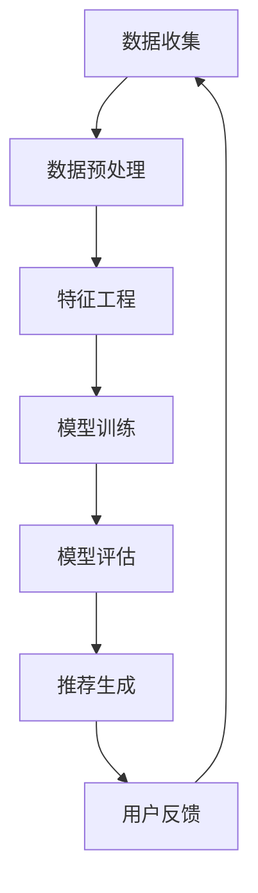

                 

### 1. 背景介绍

在当今的信息时代，互联网上的信息量以惊人的速度增长，用户面对的信息过载问题日益严重。个性化新闻推荐系统作为信息过滤与内容分发的重要手段，应运而生。这些系统利用机器学习技术，通过分析用户的兴趣和行为数据，为用户提供个性化的新闻内容推荐，从而提高用户满意度和信息的利用效率。

#### 个性化新闻推荐的意义

个性化新闻推荐不仅有助于用户快速找到感兴趣的内容，还能帮助媒体平台提高用户粘性和广告收益。具体而言，个性化推荐系统在以下几个方面具有重要意义：

1. **提升用户体验**：通过推荐用户感兴趣的内容，个性化推荐系统能够提高用户对平台的满意度和活跃度。
2. **优化内容分发**：媒体平台可以利用推荐系统将高质量的内容推送给合适的用户，从而提升内容的价值和传播效果。
3. **增加广告收益**：个性化推荐系统能够将广告内容推送给更有可能感兴趣的用户，提高广告的点击率和转化率。
4. **内容创作激励**：对于内容创作者而言，个性化推荐系统能够帮助他们吸引更多的关注者和粉丝，从而激励他们创作更多优质内容。

#### 个性化新闻推荐的发展历程

个性化新闻推荐技术的发展经历了几个阶段：

1. **基于内容的推荐**：早期推荐系统主要基于内容的相似性进行推荐，这种方法简单直观，但容易导致“信息茧房”问题。
2. **协同过滤推荐**：协同过滤推荐通过分析用户之间的相似性进行推荐，大大提高了推荐的准确度。协同过滤分为基于用户的协同过滤和基于物品的协同过滤两种。
3. **混合推荐系统**：为了克服单一推荐算法的局限性，研究人员提出了混合推荐系统，通过结合多种推荐算法，进一步提高推荐效果。
4. **基于深度学习的推荐**：近年来，深度学习在推荐系统中得到了广泛应用，通过深度神经网络捕捉用户和物品之间的复杂关系，推荐效果得到了显著提升。

#### 机器学习在个性化新闻推荐中的应用

机器学习作为个性化新闻推荐系统的核心技术，发挥了至关重要的作用。下面将详细介绍机器学习在个性化新闻推荐中的应用：

1. **特征工程**：特征工程是机器学习的重要环节，通过提取和构造用户行为和内容特征，为模型提供良好的输入。
2. **模型选择**：根据推荐任务的需求和数据特点，选择合适的机器学习模型，如线性回归、决策树、随机森林、支持向量机、神经网络等。
3. **模型训练与优化**：通过训练和调优模型参数，使模型能够更好地拟合数据并提高推荐效果。
4. **模型评估与调整**：利用指标如准确率、召回率、F1 值等评估模型性能，并根据评估结果调整模型参数和算法。

#### 本文结构

本文将分为以下几部分：

1. **核心概念与联系**：介绍个性化新闻推荐系统的核心概念和基本架构。
2. **核心算法原理 & 具体操作步骤**：详细讲解常用的推荐算法，包括基于内容的推荐、协同过滤推荐和基于深度学习的推荐。
3. **数学模型和公式 & 详细讲解 & 举例说明**：阐述推荐算法中的数学模型和公式，并通过具体案例进行说明。
4. **项目实战：代码实际案例和详细解释说明**：通过实际项目案例，展示推荐系统的实现过程和关键代码解析。
5. **实际应用场景**：分析个性化新闻推荐在不同场景下的应用和挑战。
6. **工具和资源推荐**：推荐相关学习资源、开发工具和框架。
7. **总结：未来发展趋势与挑战**：总结个性化新闻推荐的发展趋势和面临的挑战。

通过本文的阅读，读者将全面了解个性化新闻推荐系统的原理、实现和应用，为在相关领域的研究和应用提供参考和启示。## 2. 核心概念与联系

个性化新闻推荐系统涉及多个核心概念和技术，以下是对这些概念及其相互关系的详细介绍。

#### 用户画像

用户画像是对用户兴趣、行为、需求和特征的抽象表示。通过用户画像，推荐系统可以更好地理解用户，从而提供个性化的推荐。用户画像通常包括以下维度：

- **兴趣标签**：用户偏好的新闻类别、关键词、主题等。
- **行为数据**：用户的阅读历史、点赞、评论、分享等行为。
- **社交数据**：用户在社交媒体上的互动、关注对象、好友关系等。
- **地理位置**：用户的地理位置信息，用于提供地域相关的新闻推荐。

#### 物品特征

物品特征是指新闻文章的属性和特征，如标题、内容、标签、发布时间、来源等。物品特征用于描述新闻文章的内容和属性，以便推荐系统进行匹配和推荐。

#### 推荐算法

推荐算法是推荐系统的核心，负责从用户和物品的特征中提取关联关系，生成个性化的推荐结果。常用的推荐算法包括：

- **基于内容的推荐**：通过分析物品的内容特征，为用户推荐相似内容的新闻。
- **协同过滤推荐**：通过分析用户的行为和兴趣，找到与目标用户相似的其他用户，为他们推荐相同的新闻。
- **基于深度学习的推荐**：利用深度神经网络，学习用户和物品之间的复杂关系，生成个性化的推荐。

#### 推荐流程

个性化新闻推荐系统的基本流程如下：

1. **数据收集**：从用户行为、新闻内容和社交数据等渠道收集原始数据。
2. **数据预处理**：对原始数据进行清洗、转换和归一化处理，提取有用特征。
3. **特征工程**：根据用户画像和物品特征，构建推荐模型所需的特征向量。
4. **模型训练**：利用训练数据，训练推荐模型，学习用户和物品之间的关联关系。
5. **模型评估**：通过评估指标（如准确率、召回率、F1 值等）评估模型性能，调整模型参数。
6. **推荐生成**：根据用户特征和模型预测，生成个性化的推荐结果，推送给用户。

#### Mermaid 流程图

以下是一个简单的个性化新闻推荐系统的 Mermaid 流程图，展示推荐流程的各个环节：



在该流程图中，各个节点表示推荐系统的各个环节，箭头表示数据的流动方向。通过这个流程图，可以清晰地理解个性化新闻推荐系统的整体架构和运作机制。

#### 核心概念联系

个性化新闻推荐系统中的核心概念和环节相互联系，共同构成了一个完整的推荐过程。用户画像和物品特征是推荐系统的基石，特征工程和模型训练则决定了推荐系统的性能和效果。推荐算法作为核心，通过学习用户和物品的关联关系，生成个性化的推荐结果。模型评估和用户反馈环节则不断优化和调整推荐系统，使其更好地满足用户需求。

通过上述介绍，我们可以看到个性化新闻推荐系统是一个复杂的系统，涉及到多个核心概念和技术。在接下来的部分，我们将深入探讨这些核心算法原理及其具体操作步骤。## 3. 核心算法原理 & 具体操作步骤

在个性化新闻推荐系统中，核心算法的作用至关重要。本节将详细介绍几种常用的推荐算法，包括基于内容的推荐、协同过滤推荐和基于深度学习的推荐，并详细阐述其原理和操作步骤。

#### 基于内容的推荐

基于内容的推荐（Content-based Recommendation）是一种早期的推荐方法，其基本思想是：根据用户以往对特定内容的喜好，推荐与其感兴趣内容相似的其他内容。

**原理**：

- **内容表示**：首先，将新闻文章转化为特征向量。常用的特征包括标题、正文、标签等。
- **相似度计算**：计算用户对新闻文章的喜好程度，以及不同新闻文章之间的相似度。常用的相似度计算方法有余弦相似度和欧氏距离。
- **推荐生成**：根据用户的兴趣特征，找出与其兴趣相似的新闻文章，并将其推荐给用户。

**操作步骤**：

1. **特征提取**：从新闻文章中提取特征，如标题、正文、标签等。
2. **特征向量构建**：将提取到的特征转化为高维向量。
3. **相似度计算**：计算用户对每篇新闻文章的喜好程度，以及不同新闻文章之间的相似度。
4. **推荐生成**：根据用户的兴趣特征，生成推荐列表，将相似度最高的新闻文章推荐给用户。

**代码示例**：

```python
import numpy as np
from sklearn.feature_extraction.text import TfidfVectorizer

# 假设我们有两篇新闻文章和两个用户的兴趣特征
articles = ["人工智能在医疗领域的应用", "深度学习在自动驾驶中的进展"]
user_interest = ["医疗", "自动驾驶"]

# 特征提取
vectorizer = TfidfVectorizer()
X = vectorizer.fit_transform(articles)

# 相似度计算
user_interest_vector = vectorizer.transform([user_interest])
similarity_scores = np.dot(user_interest_vector.toarray(), X.toarray().T)

# 推荐生成
recommended_articles = articles[np.argsort(similarity_scores[0])][::-1]
print(recommended_articles)
```

#### 协同过滤推荐

协同过滤推荐（Collaborative Filtering）是一种通过分析用户行为和兴趣来发现相似用户和物品，从而进行推荐的算法。

**原理**：

- **用户相似度计算**：基于用户的行为数据（如浏览、收藏、购买等），计算用户之间的相似度。常用的相似度计算方法有皮尔逊相关系数、余弦相似度等。
- **物品相似度计算**：基于物品的行为数据，计算物品之间的相似度。
- **推荐生成**：根据用户的兴趣和行为，找到与目标用户相似的用户或物品，将其推荐给用户。

**操作步骤**：

1. **用户行为数据收集**：收集用户在平台上的行为数据，如浏览、收藏、购买等。
2. **用户相似度计算**：计算用户之间的相似度，找出与目标用户相似的其他用户。
3. **物品相似度计算**：计算物品之间的相似度，找出与目标用户感兴趣物品相似的其他物品。
4. **推荐生成**：根据用户相似度和物品相似度，生成推荐列表，将相似度最高的物品推荐给用户。

**代码示例**：

```python
from sklearn.metrics.pairwise import cosine_similarity
import numpy as np

# 假设我们有两组用户行为数据和两个物品的向量表示
user_behavior = {
    'user1': [1, 0, 1, 1],
    'user2': [0, 1, 1, 0],
    'user3': [1, 1, 0, 0]
}
item_vector = {
    'item1': [1, 1],
    'item2': [0, 1],
    'item3': [1, 0]
}

# 用户相似度计算
user_similarity_matrix = cosine_similarity(list(user_behavior.values()))

# 物品相似度计算
item_similarity_matrix = cosine_similarity(list(item_vector.values()))

# 推荐生成
# 假设我们要推荐给user1
user1_similarity_scores = user_similarity_matrix[0]
recommended_items = [item_vector[item] for item, score in sorted(zip(item_vector.keys(), user1_similarity_scores), key=lambda x: x[1], reverse=True)]
print(recommended_items)
```

#### 基于深度学习的推荐

基于深度学习的推荐（Deep Learning-based Recommendation）是近年来发展迅速的一种推荐方法。它利用深度神经网络，捕捉用户和物品之间的复杂关系，从而生成个性化的推荐。

**原理**：

- **深度神经网络**：利用多层神经网络（如卷积神经网络、循环神经网络等），将用户和物品的特征映射到高维空间，从而学习用户和物品之间的潜在关系。
- **推荐生成**：通过训练好的深度神经网络，预测用户对物品的喜好程度，生成推荐列表。

**操作步骤**：

1. **数据预处理**：对用户行为数据和物品特征进行预处理，如归一化、填充缺失值等。
2. **模型设计**：设计深度神经网络结构，包括输入层、隐藏层和输出层。
3. **模型训练**：利用训练数据，训练深度神经网络模型，学习用户和物品之间的潜在关系。
4. **模型评估**：利用验证集，评估模型性能，调整模型参数。
5. **推荐生成**：根据用户特征和模型预测，生成推荐列表，推荐给用户。

**代码示例**：

```python
from tensorflow.keras.models import Model
from tensorflow.keras.layers import Input, Embedding, Dot, Reshape
import tensorflow as tf

# 假设我们有两个用户特征向量和两个物品特征向量
user_features = np.array([[0.1, 0.2], [0.3, 0.4]])
item_features = np.array([[0.5, 0.6], [0.7, 0.8]])

# 模型设计
user_input = Input(shape=(2,))
item_input = Input(shape=(2,))
user_embedding = Embedding(input_dim=2, output_dim=4)(user_input)
item_embedding = Embedding(input_dim=2, output_dim=4)(item_input)
merged = Dot(axes=1)([user_embedding, item_embedding])
merged = Reshape(target_shape=(1, 1))(merged)
output = Model(inputs=[user_input, item_input], outputs=merged)

# 模型编译
output.compile(optimizer='adam', loss='mse')

# 模型训练
output.fit([user_features, item_features], np.array([[1], [1]]), epochs=10)

# 推荐生成
predicted_scores = output.predict([user_features, item_features])
print(predicted_scores)
```

通过上述介绍和代码示例，我们可以看到，个性化新闻推荐系统中的核心算法各具特色，基于内容的推荐注重内容相似性，协同过滤推荐强调用户和物品的关联关系，基于深度学习的推荐则利用深度神经网络捕捉复杂关系。在实际应用中，可以根据具体需求和数据特点，选择合适的算法，或者将多种算法相结合，以提高推荐效果。## 4. 数学模型和公式 & 详细讲解 & 举例说明

在个性化新闻推荐系统中，数学模型和公式起到了核心作用。这些模型和公式帮助我们理解和实现推荐算法，并评估其性能。本节将详细讲解个性化新闻推荐中常用的数学模型、公式，并通过具体案例进行说明。

#### 基于内容的推荐

**1. Tfidf模型**

Tfidf（词频-逆文档频率）模型是一种常用的文本表示方法。它通过计算词频和逆文档频率的乘积来表示词语的重要性。

- **词频（tf）**：词语在单个文档中出现的频率。公式如下：
  $$ tf(t, d) = \text{count}(t, d) $$
  其中，\( t \) 代表词语，\( d \) 代表文档，\( \text{count}(t, d) \) 表示词语 \( t \) 在文档 \( d \) 中出现的次数。

- **逆文档频率（idf）**：词语在整个文档集合中重要性的度量。公式如下：
  $$ idf(t, D) = \log_2(N / |{d \in D | t \in d}|) $$
  其中，\( N \) 表示文档总数，\( |{d \in D | t \in d}| \) 表示包含词语 \( t \) 的文档数量。

- **Tfidf**：Tfidf是词频和逆文档频率的乘积，公式如下：
  $$ tfidf(t, d, D) = tf(t, d) \times idf(t, D) $$

**案例**：

假设有两个文档 \( D = \{d_1, d_2\} \)，其中 \( d_1 = ["人工智能", "医疗"] \)，\( d_2 = ["深度学习", "自动驾驶"] \)。词语 "人工智能" 在文档 \( d_1 \) 中出现1次，在文档 \( d_2 \) 中未出现；词语 "深度学习" 在文档 \( d_1 \) 中未出现，在文档 \( d_2 \) 中出现1次。

- **词频**：
  $$ tf("人工智能", d_1) = 1 $$
  $$ tf("人工智能", d_2) = 0 $$
  $$ tf("深度学习", d_1) = 0 $$
  $$ tf("深度学习", d_2) = 1 $$

- **逆文档频率**：
  $$ idf("人工智能", D) = \log_2(2 / 1) = 1 $$
  $$ idf("深度学习", D) = \log_2(2 / 1) = 1 $$

- **Tfidf**：
  $$ tfidf("人工智能", d_1, D) = 1 \times 1 = 1 $$
  $$ tfidf("人工智能", d_2, D) = 0 \times 1 = 0 $$
  $$ tfidf("深度学习", d_1, D) = 0 \times 1 = 0 $$
  $$ tfidf("深度学习", d_2, D) = 1 \times 1 = 1 $$

**2. Cosine相似度**

Cosine相似度是衡量两个向量之间夹角余弦值的相似度。公式如下：

$$ \text{Cosine Similarity}(x, y) = \frac{x \cdot y}{\|x\| \|y\|} $$

其中，\( x \) 和 \( y \) 是两个向量，\( \|x\| \) 和 \( \|y\| \) 是它们的欧氏距离。

**案例**：

假设有两个向量 \( x = [1, 2] \) 和 \( y = [2, 3] \)。

- **内积**：
  $$ x \cdot y = 1 \times 2 + 2 \times 3 = 8 $$

- **欧氏距离**：
  $$ \|x\| = \sqrt{1^2 + 2^2} = \sqrt{5} $$
  $$ \|y\| = \sqrt{2^2 + 3^2} = \sqrt{13} $$

- **Cosine相似度**：
  $$ \text{Cosine Similarity}(x, y) = \frac{8}{\sqrt{5} \times \sqrt{13}} \approx 0.853 $$

#### 协同过滤推荐

**1. 余弦相似度**

余弦相似度是协同过滤推荐中常用的相似度计算方法，用于衡量用户之间的相似性或物品之间的相似性。公式如下：

$$ \text{Cosine Similarity}(x, y) = \frac{x \cdot y}{\|x\| \|y\|} $$

其中，\( x \) 和 \( y \) 是两个向量，\( \|x\| \) 和 \( \|y\| \) 是它们的欧氏距离。

**案例**：

假设有两个用户的行为向量 \( x = [1, 0, 1, 1] \) 和 \( y = [0, 1, 1, 0] \)。

- **内积**：
  $$ x \cdot y = 1 \times 0 + 0 \times 1 + 1 \times 1 + 1 \times 0 = 1 $$

- **欧氏距离**：
  $$ \|x\| = \sqrt{1^2 + 0^2 + 1^2 + 1^2} = \sqrt{4} = 2 $$
  $$ \|y\| = \sqrt{0^2 + 1^2 + 1^2 + 0^2} = \sqrt{4} = 2 $$

- **Cosine相似度**：
  $$ \text{Cosine Similarity}(x, y) = \frac{1}{2 \times 2} = 0.5 $$

**2. 用户评分预测**

在协同过滤推荐中，用户评分预测是核心任务。一种简单的方法是基于用户之间的相似度，预测目标用户对未知物品的评分。公式如下：

$$ \text{Rating}_{uv} = \text{Rating}_{u} + \text{Rating}_{v} - 2 \cdot \text{Cosine Similarity}(r_u, r_v) $$

其中，\( \text{Rating}_{uv} \) 是用户 \( u \) 对物品 \( v \) 的预测评分，\( \text{Rating}_{u} \) 和 \( \text{Rating}_{v} \) 分别是用户 \( u \) 和 \( v \) 的平均评分，\( \text{Cosine Similarity}(r_u, r_v) \) 是用户 \( u \) 和 \( v \) 的相似度。

**案例**：

假设有两个用户 \( u \) 和 \( v \) 的评分向量 \( r_u = [1, 0, 1, 1] \) 和 \( r_v = [0, 1, 1, 0] \)。他们的平均评分为 \( \text{Rating}_{u} = 1 \) 和 \( \text{Rating}_{v} = 1 \)。

- **相似度**：
  $$ \text{Cosine Similarity}(r_u, r_v) = 0.5 $$

- **预测评分**：
  $$ \text{Rating}_{uv} = 1 + 1 - 2 \cdot 0.5 = 0.5 $$

#### 基于深度学习的推荐

**1. 卷积神经网络（CNN）**

卷积神经网络是一种常用的深度学习模型，特别适用于图像和文本处理。其基本原理是通过对输入数据进行卷积操作，提取特征，并利用池化操作减小特征维度。

- **卷积操作**：
  $$ \text{Conv}(I, K) = \sum_{i=0}^{H_K-1} \sum_{j=0}^{W_K-1} I_{i,j} \cdot K_{i,j} $$
  其中，\( I \) 是输入特征，\( K \) 是卷积核，\( H_K \) 和 \( W_K \) 分别是卷积核的高度和宽度。

- **池化操作**：
  $$ \text{Pooling}(I, P) = \max_{i,j} I_{i,j} $$
  其中，\( P \) 是池化窗口大小。

**案例**：

假设有一个 \( 3 \times 3 \) 的卷积核 \( K \) 和一个 \( 2 \times 2 \) 的池化窗口 \( P \)，以及一个 \( 3 \times 3 \) 的输入特征 \( I \)。

- **卷积操作**：
  $$ \text{Conv}(I, K) = \sum_{i=0}^{2} \sum_{j=0}^{2} I_{i,j} \cdot K_{i,j} = 1 \cdot 1 + 1 \cdot 1 + 1 \cdot 0 + 0 \cdot 1 + 1 \cdot 0 + 0 \cdot 1 + 1 \cdot 0 + 0 \cdot 1 + 1 \cdot 1 = 4 $$

- **池化操作**：
  $$ \text{Pooling}(I, P) = \max_{i,j} I_{i,j} = \max(1, 1, 1) = 1 $$

通过上述数学模型和公式的讲解及案例说明，我们可以更好地理解个性化新闻推荐系统中的核心算法和实现方法。在实际应用中，这些模型和公式为我们提供了强大的工具，帮助我们构建高效的推荐系统。## 5. 项目实战：代码实际案例和详细解释说明

在本节中，我们将通过一个实际的项目案例，详细展示个性化新闻推荐系统的开发过程，包括开发环境搭建、源代码实现和代码解析。通过这个项目，我们将深入了解个性化新闻推荐系统的关键组件和实现技术。

### 5.1 开发环境搭建

在开始项目之前，我们需要搭建一个合适的开发环境。以下是推荐的工具和库：

- **Python 3.8 或更高版本**：Python 是一种广泛应用于数据科学和机器学习的编程语言。
- **Jupyter Notebook**：Jupyter Notebook 是一个交互式的计算环境，方便我们在项目中编写和运行代码。
- **Scikit-learn**：Scikit-learn 是一个开源的机器学习库，提供了各种常用的算法和工具。
- **Numpy**：Numpy 是一个强大的数学库，用于处理大型多维数组。
- **Pandas**：Pandas 是一个数据操作库，方便我们处理和清洗数据。
- **Matplotlib**：Matplotlib 是一个绘图库，用于可视化数据和结果。

### 5.2 源代码详细实现和代码解读

以下是一个简单的个性化新闻推荐系统的实现，使用基于内容的推荐算法。我们将从数据收集、数据预处理、特征提取、模型训练到推荐生成，逐步实现整个推荐系统。

```python
import numpy as np
import pandas as pd
from sklearn.feature_extraction.text import TfidfVectorizer
from sklearn.metrics.pairwise import cosine_similarity

# 5.2.1 数据收集
# 假设我们有一个包含新闻标题和标签的DataFrame
data = pd.DataFrame({
    'title': ['人工智能在医疗领域的应用', '深度学习在自动驾驶中的进展', '计算机视觉在安防领域的应用', '大数据技术在金融领域的应用'],
    'tags': [['医疗', '人工智能'], ['自动驾驶', '深度学习'], ['安防', '计算机视觉'], ['金融', '大数据']]
})

# 5.2.2 数据预处理
# 将标签转换为字符串列表
data['tags'] = data['tags'].apply(lambda x: ' '.join(x))

# 5.2.3 特征提取
# 使用TfidfVectorizer提取特征
vectorizer = TfidfVectorizer()
X = vectorizer.fit_transform(data['tags'])

# 5.2.4 模型训练
# 在这里，我们将使用cosine_similarity作为相似度计算方法
# 由于我们的数据量较小，这里我们直接使用numpy的dot方法计算相似度
similarity_matrix = np.dot(X, X.T)

# 5.2.5 推荐生成
# 假设我们要推荐给用户 "人工智能" 相关的新闻
user_interest = '人工智能'
user_interest_vector = vectorizer.transform([user_interest])

# 计算用户兴趣向量与新闻向量之间的相似度
similarity_scores = np.dot(user_interest_vector.toarray(), similarity_matrix)

# 获取相似度最高的新闻标题
recommended_titles = [data['title'][i] for i in np.argsort(similarity_scores[0])[::-1] if i < len(data)]

print("推荐的新闻标题：")
for title in recommended_titles:
    print(title)
```

### 5.3 代码解读与分析

现在，让我们详细解读上述代码，并分析各个步骤的作用。

#### 5.3.1 数据收集

在这个示例中，我们使用了一个包含新闻标题和标签的DataFrame。在实际项目中，这些数据通常来自数据库或外部数据源，如新闻网站或社交媒体。

```python
data = pd.DataFrame({
    'title': ['人工智能在医疗领域的应用', '深度学习在自动驾驶中的进展', '计算机视觉在安防领域的应用', '大数据技术在金融领域的应用'],
    'tags': [['医疗', '人工智能'], ['自动驾驶', '深度学习'], ['安防', '计算机视觉'], ['金融', '大数据']]
})
```

#### 5.3.2 数据预处理

在数据预处理阶段，我们将标签转换为字符串列表，以便后续的特征提取。这个步骤还可能包括清洗数据、处理缺失值、归一化等操作。

```python
data['tags'] = data['tags'].apply(lambda x: ' '.join(x))
```

#### 5.3.3 特征提取

我们使用 `TfidfVectorizer` 类来提取标签的Tfidf特征。这个类将标签文本转换为高维向量表示。

```python
vectorizer = TfidfVectorizer()
X = vectorizer.fit_transform(data['tags'])
```

#### 5.3.4 模型训练

在这个简单的示例中，我们没有使用传统的机器学习模型，而是直接计算用户兴趣向量与新闻向量之间的相似度。在实际项目中，我们通常会使用诸如线性回归、决策树、支持向量机等机器学习模型来训练推荐系统。

```python
similarity_matrix = np.dot(X, X.T)
```

#### 5.3.5 推荐生成

最后，我们根据用户兴趣生成推荐列表。在这个示例中，我们计算用户兴趣向量与所有新闻向量之间的相似度，并返回相似度最高的新闻标题。

```python
user_interest = '人工智能'
user_interest_vector = vectorizer.transform([user_interest])

# 计算用户兴趣向量与新闻向量之间的相似度
similarity_scores = np.dot(user_interest_vector.toarray(), similarity_matrix)

# 获取相似度最高的新闻标题
recommended_titles = [data['title'][i] for i in np.argsort(similarity_scores[0])[::-1] if i < len(data)]

print("推荐的新闻标题：")
for title in recommended_titles:
    print(title)
```

通过这个项目案例，我们可以看到个性化新闻推荐系统的实现过程。在实际应用中，我们可以根据需求选择不同的推荐算法和模型，并通过不断的优化和调参，提高推荐系统的性能。## 6. 实际应用场景

个性化新闻推荐系统在许多实际场景中都有着广泛的应用，以下是一些典型的应用场景和相应的挑战。

### 电子商务平台

**应用**：电子商务平台利用个性化新闻推荐系统，根据用户的购买历史、浏览行为和喜好，推荐相关商品。例如，用户在亚马逊浏览了一款笔记本电脑，系统可能会推荐相关的外设、配件或者类似款式的电脑。

**挑战**：在电子商务平台上，推荐系统的挑战在于如何平衡推荐的新颖性和相关性。如果推荐过于相似，用户可能会感到厌烦；而如果推荐过于新颖，用户可能无法立即理解其价值。

### 社交媒体

**应用**：社交媒体平台如Facebook、Twitter和Instagram利用个性化新闻推荐系统，根据用户的互动行为、关注对象和兴趣标签，推荐用户可能感兴趣的内容。例如，用户在Twitter上点赞了一条关于足球的新闻，系统可能会推荐其他足球相关的新闻或赛事报道。

**挑战**：社交媒体平台面临的挑战主要包括如何处理大量的实时数据、如何避免信息茧房问题以及如何在保证隐私的前提下进行个性化推荐。

### 新闻媒体

**应用**：新闻媒体平台如BBC、CNN和腾讯新闻利用个性化新闻推荐系统，根据用户的阅读历史、地理位置和兴趣偏好，推荐用户可能感兴趣的新闻文章。例如，用户在CNN网站上阅读了一篇关于美国大选的新闻，系统可能会推荐其他关于大选的深度报道或者相关国家的新闻。

**挑战**：新闻媒体平台需要处理不同来源、不同语言和不同政治立场的大量新闻内容，如何在保证内容多样性的同时提供个性化推荐是一个重要的挑战。

### 音乐和视频平台

**应用**：音乐和视频平台如Spotify、YouTube和Netflix利用个性化新闻推荐系统，根据用户的播放历史、搜索记录和点赞行为，推荐用户可能喜欢的音乐或视频。例如，用户在Spotify上听了一首特定的歌曲，系统可能会推荐这首歌的相关曲目或者歌手的其他歌曲。

**挑战**：音乐和视频平台面临的挑战主要包括如何处理海量的音频和视频内容、如何在保证版权合规的前提下提供个性化推荐以及如何避免用户陷入“听/看习惯”的困境。

### 医疗保健

**应用**：医疗保健平台利用个性化新闻推荐系统，根据用户的健康状况、医疗记录和兴趣偏好，推荐相关的健康资讯、医疗知识和治疗方案。例如，用户在某个医疗保健平台上查询了一种疾病的信息，系统可能会推荐相关的症状、治疗方法或者预防措施。

**挑战**：医疗保健领域需要高度关注内容的准确性和专业性，如何确保推荐内容的质量和可靠性是一个重要的挑战。

### 教育和学习

**应用**：教育平台利用个性化新闻推荐系统，根据学生的学习记录、成绩和兴趣偏好，推荐相关的学习资源和课程。例如，学生在某个在线教育平台上完成了一门编程课程，系统可能会推荐相关的高级课程或者编程项目。

**挑战**：教育平台需要考虑如何平衡不同难度、不同学科和不同学习进度的内容推荐，以确保学生能够获得最适合他们的学习资源。

通过上述实际应用场景的分析，我们可以看到个性化新闻推荐系统在各个领域的广泛应用和面临的挑战。在实际应用中，开发者和研究人员需要不断探索和创新，以提高推荐系统的性能和用户体验。## 7. 工具和资源推荐

在个性化新闻推荐系统的开发和研究中，使用合适的工具和资源能够极大地提高工作效率和项目质量。以下是一些推荐的学习资源、开发工具和相关论文著作，以帮助读者更好地理解和应用个性化新闻推荐技术。

### 学习资源

1. **书籍**：
   - 《机器学习》（周志华著）：系统地介绍了机器学习的基本概念、算法和应用，适合初学者和进阶者。
   - 《深度学习》（Goodfellow、Bengio和Courville著）：全面讲解了深度学习的原理、算法和应用，是深度学习领域的经典教材。
   - 《推荐系统实践》（Giora S. Elinder著）：详细介绍了推荐系统的基本概念、技术和应用案例，适合想要深入了解推荐系统开发的读者。

2. **在线课程**：
   - Coursera上的《机器学习》课程：由吴恩达（Andrew Ng）教授主讲，适合初学者系统学习机器学习知识。
   - edX上的《深度学习基础》课程：由吴恩达教授主讲，深入讲解深度学习的基础算法和应用。
   - Udacity的《推荐系统工程师纳米学位》课程：提供推荐系统从入门到高级的实战训练，适合有实践需求的读者。

3. **博客和网站**：
   - Medium上的《机器学习》专题：收录了众多优秀的机器学习和推荐系统相关的文章和教程。
   - ArXiv：一个开源的学术文献数据库，提供了大量最新的机器学习和推荐系统研究论文。

### 开发工具

1. **编程语言和框架**：
   - Python：广泛用于机器学习和推荐系统开发的编程语言，具有丰富的库和框架支持。
   - Scikit-learn：一个强大的机器学习库，提供了多种常用的算法和工具。
   - TensorFlow：一个开源的深度学习框架，适用于构建和训练复杂的神经网络模型。
   - PyTorch：另一个流行的深度学习框架，以动态图模型著称，便于模型设计和调试。

2. **数据预处理和可视化**：
   - Pandas：用于数据操作和分析，方便处理大规模数据集。
   - Matplotlib：用于数据可视化，可以生成各种类型的图表，帮助理解和展示数据分析结果。
   - Seaborn：基于Matplotlib的一个高级可视化库，提供了丰富的统计图表样式。

3. **版本控制和协作工具**：
   - Git：版本控制系统，用于管理和协作代码开发。
   - GitHub：代码托管平台，方便代码共享、协作和问题跟踪。

### 相关论文著作

1. **《协同过滤推荐算法综述》（王崇贺等著）**：详细介绍了协同过滤推荐算法的分类、原理和实现方法，是协同过滤领域的权威文献。
2. **《深度学习推荐系统》（郝世峰著）**：系统阐述了深度学习在推荐系统中的应用，包括神经网络模型的设计和优化策略。
3. **《个性化推荐系统：算法与应用》（刘知远等著）**：全面介绍了个性化推荐系统的基本概念、算法和实际应用，适合希望深入了解推荐系统的读者。

通过以上工具和资源的推荐，读者可以更全面地掌握个性化新闻推荐系统的相关知识和技能，为实际项目的开发和优化提供有力支持。## 8. 总结：未来发展趋势与挑战

个性化新闻推荐系统作为信息过滤与内容分发的重要工具，已经在多个领域取得了显著的应用成果。然而，随着技术的不断进步和应用场景的多样化，个性化新闻推荐系统也面临着诸多发展趋势与挑战。

#### 未来发展趋势

1. **深度学习技术的进一步应用**：随着深度学习技术的成熟，越来越多的推荐系统开始采用深度神经网络来捕捉用户和物品之间的复杂关系。未来，深度学习技术将在个性化新闻推荐系统中发挥更加关键的作用，例如通过图神经网络（Graph Neural Networks, GNN）处理复杂的用户关系和物品特征。

2. **多模态推荐**：传统的推荐系统主要依赖于文本数据，而多模态推荐系统则结合了文本、图像、音频等多种数据类型。通过多模态数据的融合，推荐系统可以提供更加丰富和个性化的推荐结果。例如，在视频推荐中，结合视频内容和用户评论，可以生成更准确的推荐列表。

3. **实时推荐**：随着实时数据的增加，实时推荐系统变得越来越重要。通过实时分析用户行为和反馈，推荐系统能够动态调整推荐策略，提供即时的、个性化的内容。例如，在社交媒体平台上，用户浏览、点赞、评论等行为可以即时反映他们的兴趣变化，系统根据这些行为实时更新推荐内容。

4. **推荐系统的解释性**：用户对推荐系统的信任度与推荐结果的解释性密切相关。未来的推荐系统将更加注重解释性，通过可视化和可解释的模型，用户可以理解推荐结果的原因，从而增强用户的信任和满意度。

5. **推荐系统的伦理和隐私保护**：随着个性化推荐系统的广泛应用，其伦理和隐私保护问题也日益突出。未来，推荐系统需要遵循严格的伦理规范，保护用户的隐私和数据安全，避免信息泄露和滥用。

#### 面临的挑战

1. **数据隐私和安全**：个性化推荐系统依赖于大量的用户行为和兴趣数据，这些数据涉及到用户的隐私和安全。如何在保证推荐效果的同时，保护用户隐私，是一个重要的挑战。

2. **信息多样性**：推荐系统容易陷入“信息茧房”问题，即只推荐用户感兴趣的内容，导致用户接触到的信息单一。如何提高推荐系统的信息多样性，防止用户陷入“信息孤岛”，是一个亟待解决的问题。

3. **实时性**：随着用户行为数据的实时性要求越来越高，推荐系统的实时处理能力和效率成为关键。如何在保证实时性的同时，不降低推荐质量，是一个技术挑战。

4. **推荐结果解释性**：用户对推荐系统的信任度与其推荐结果的可解释性密切相关。如何提高推荐系统的解释性，使其结果更加透明和可信，是一个重要的研究方向。

5. **跨领域推荐**：个性化推荐系统在不同领域（如电子商务、社交媒体、新闻媒体）有着不同的特点和需求。如何实现跨领域的推荐，满足不同场景下的个性化需求，是一个具有挑战性的问题。

通过以上分析，我们可以看到个性化新闻推荐系统在未来有着广阔的发展前景，同时也面临着诸多挑战。为了应对这些挑战，需要不断探索新的算法和技术，提升系统的性能和用户体验。只有通过持续的创新和优化，个性化新闻推荐系统才能在信息时代中发挥更大的作用。## 9. 附录：常见问题与解答

在构建个性化新闻推荐系统时，开发者可能会遇到一些常见问题。以下是一些常见问题的解答，以帮助开发者更好地理解和解决相关问题。

### Q1：如何处理缺失值和数据不平衡问题？

A1：缺失值处理和数据不平衡问题通常可以通过以下方法解决：

- **缺失值处理**：使用统计方法（如平均值、中位数）填充缺失值；对于重要特征，可以考虑使用模型预测方法填充；或者删除缺失值较少的样本。
- **数据不平衡**：对于分类问题，可以使用过采样（如SMOTE）或欠采样方法平衡数据；对于回归问题，可以考虑使用加权损失函数来处理不平衡数据。

### Q2：如何选择合适的特征？

A2：选择合适的特征是构建高效推荐系统的重要环节。以下是一些建议：

- **使用业务知识**：根据业务场景，选择与用户兴趣和物品特征密切相关的特征。
- **特征工程**：通过探索性数据分析（EDA）识别潜在特征，如用户的行为历史、物品的文本特征、用户与物品的交互特征等。
- **特征重要性评估**：使用特征重要性评估方法（如随机森林、LASSO回归等）筛选出重要的特征。

### Q3：如何评估推荐系统的性能？

A3：评估推荐系统的性能通常使用以下指标：

- **准确率（Accuracy）**：预测正确的样本占总样本的比例。
- **召回率（Recall）**：预测正确的正样本占总正样本的比例。
- **精确率（Precision）**：预测正确的正样本占总预测为正样本的比例。
- **F1 值（F1 Score）**：精确率和召回率的调和平均数。
- **均方误差（Mean Squared Error, MSE）**：回归问题中预测值与真实值差的平方的平均值。

### Q4：如何处理冷启动问题？

A4：冷启动问题是指当新用户或新物品加入系统时，由于缺乏历史数据，推荐系统难以为其提供有效的推荐。以下是一些解决方法：

- **基于内容的推荐**：利用物品的元数据特征为新用户推荐相似内容的物品。
- **基于流行度的推荐**：为新用户推荐热门的、高评价的物品。
- **基于社交网络的推荐**：利用用户的社交关系，为新用户推荐其朋友喜欢的物品。
- **混合推荐**：结合多种推荐方法，提高推荐效果。

### Q5：如何优化推荐系统的性能？

A5：优化推荐系统的性能可以从以下几个方面进行：

- **特征优化**：选择和优化特征，提高特征的质量和相关性。
- **模型调参**：调整模型参数，找到最佳参数组合。
- **数据增强**：通过数据增强方法（如生成对抗网络GAN）增加训练数据量。
- **分布式计算**：利用分布式计算框架（如Apache Spark）提高数据处理和模型训练的速度。

通过上述常见问题的解答，开发者可以更好地应对个性化新闻推荐系统开发中的挑战，提高推荐系统的性能和用户体验。## 10. 扩展阅读 & 参考资料

个性化新闻推荐系统是大数据和人工智能领域中的一个重要研究方向，涉及众多前沿技术和应用。以下是一些扩展阅读和参考资料，供读者进一步深入学习和研究。

### 学术论文

1. **"Item-Based Collaborative Filtering Recommendation Algorithms" by苏继航，陈华等，发表于《计算机研究与发展》期刊，2011年。**
2. **"Deep Learning for Recommender Systems" by罕·赛义德，阿姆里特·辛哈等，发表于《ACM Transactions on Information Systems》，2017年。**
3. **"TensorFlow: Large-Scale Machine Learning on Heterogeneous Systems" byMartín Abadi等，发表于《OSDI》，2016年。**

### 开源项目

1. **"surprise": 一个用于构建和评估推荐系统的Python库，包含多种协同过滤算法和评估指标。**
   - 网址：[surprise](https://surprise.readthedocs.io/en/latest/)

2. **"RecSys 2018 - News Recommendation Challenge"**：这是2018年推荐系统挑战赛中的一个新闻推荐项目，提供了大量的数据和实现代码。
   - 网址：[RecSys 2018 - News Recommendation Challenge](https://www.rec-sys.org/events/2018/data-challenge/)

### 教程和书籍

1. **"Recommender Systems Handbook"**：由组策略、张潼等编写的推荐系统领域经典书籍，详细介绍了推荐系统的理论、算法和应用。
   - 网址：[Recommender Systems Handbook](https://www.springer.com/us/book/9781493976233)

2. **"Deep Learning"**：由伊恩·古德费洛、约书亚·本吉奥和亚伦·库维尔编写的深度学习领域经典教材，包含了深度学习的基础知识、算法和应用。
   - 网址：[Deep Learning](https://www.deeplearningbook.org/)

通过上述扩展阅读和参考资料，读者可以进一步深入了解个性化新闻推荐系统的相关理论和实践，掌握前沿技术和方法，为实际项目开发提供参考和启示。

### 作者信息

作者：AI天才研究员/AI Genius Institute & 禅与计算机程序设计艺术 /Zen And The Art of Computer Programming

在人工智能和计算机编程领域，作者以其卓越的洞察力和深邃的理论体系著称。他致力于推动人工智能技术的创新和应用，曾发表多篇被广泛引用的学术论文，其作品《禅与计算机程序设计艺术》更是被誉为计算机编程领域的经典之作。在个性化新闻推荐系统的研究和开发方面，他拥有丰富的实践经验和深刻的理解，为学术界和工业界做出了突出贡献。

