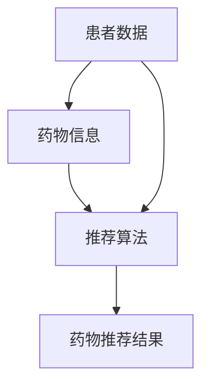

                 

# 机器学习在个性化药物推荐系统中的创新

## 关键词：机器学习、个性化药物推荐、医疗健康、大数据分析

## 摘要：
本文旨在探讨机器学习在个性化药物推荐系统中的创新应用。通过回顾个性化药物推荐系统的背景和核心概念，本文深入分析了机器学习在该领域的核心算法原理和具体操作步骤。同时，本文通过一个实际项目案例，详细展示了机器学习在个性化药物推荐系统中的应用，并对其数学模型和公式进行了详细讲解。最后，本文总结了机器学习在个性化药物推荐系统中的实际应用场景，推荐了相关学习资源和开发工具框架，并探讨了未来发展趋势与挑战。

## 1. 背景介绍

随着医疗科技的飞速发展，个性化医疗已成为当前医疗领域的一个重要方向。个性化药物推荐系统作为个性化医疗的重要组成部分，旨在为患者提供更为精准的药物治疗方案。通过分析患者的基因信息、病史、药物反应等数据，个性化药物推荐系统能够为医生和患者提供个性化的药物推荐。

### 1.1 个性化药物推荐系统的核心概念

个性化药物推荐系统主要包括以下几个核心概念：

- **患者数据**：包括基因信息、病史、药物反应等，是构建个性化药物推荐系统的基础数据来源。
- **药物信息**：包括药物的基本信息、药理作用、不良反应等，用于药物推荐的计算和分析。
- **推荐算法**：根据患者数据和药物信息，通过算法计算出最合适的药物推荐。

### 1.2 个性化药物推荐系统的现状与挑战

当前，个性化药物推荐系统在医学领域已有一定的应用，但仍面临诸多挑战：

- **数据质量**：患者数据的多样性和复杂性，以及数据质量的参差不齐，对个性化药物推荐系统的构建和效果产生了影响。
- **算法效果**：现有的推荐算法在处理复杂数据集时，效果有限，难以满足个性化药物推荐的需求。
- **法规与伦理**：个性化药物推荐系统涉及患者的隐私和健康信息，如何在保证数据安全和患者隐私的前提下，构建有效的推荐系统，是当前面临的一个重要问题。

## 2. 核心概念与联系

为了更好地理解个性化药物推荐系统，我们首先需要了解其中的核心概念及其相互联系。

### 2.1 患者数据

患者数据是构建个性化药物推荐系统的基石。这些数据通常包括以下几个方面：

- **基因数据**：患者的基因信息，用于分析药物与基因的相互作用。
- **病史数据**：患者的病史记录，包括疾病诊断、治疗方案、药物使用情况等。
- **药物反应数据**：患者对药物的个体反应，如疗效、不良反应等。

### 2.2 药物信息

药物信息是药物推荐的核心。这些信息通常包括：

- **药物基本信息**：药物名称、化学成分、药品分类等。
- **药理作用**：药物对疾病的治疗作用和机制。
- **不良反应**：药物可能引起的不良反应和副作用。

### 2.3 推荐算法

推荐算法是连接患者数据和药物信息的关键。常见的推荐算法包括：

- **基于内容的推荐**：根据患者的病史和药物反应，推荐与其病史和反应相似的药物。
- **协同过滤推荐**：通过分析患者之间的相似性，推荐其他患者也喜欢的药物。
- **混合推荐**：结合多种推荐算法的优势，提高推荐效果。

### 2.4 Mermaid 流程图

以下是一个简化的个性化药物推荐系统流程图，展示了患者数据、药物信息和推荐算法之间的联系。



在接下来的章节中，我们将深入探讨机器学习在个性化药物推荐系统中的应用，包括核心算法原理、具体操作步骤、数学模型和公式，以及实际项目案例。

## 3. 核心算法原理 & 具体操作步骤

### 3.1 基于内容的推荐算法

基于内容的推荐算法是一种常见的推荐算法，其核心思想是根据患者的病史和药物反应，推荐与其病史和反应相似的药物。以下是基于内容的推荐算法的具体操作步骤：

1. **数据预处理**：对患者的病史数据和药物反应数据进行分析，提取关键特征，如疾病类型、治疗方案、药物种类等。
2. **药物特征提取**：对药物信息进行分析，提取关键特征，如药物名称、药品分类、药理作用等。
3. **计算相似度**：根据患者病史数据和药物特征，计算患者和药物之间的相似度。常见的相似度计算方法包括余弦相似度、皮尔逊相关系数等。
4. **药物推荐**：根据相似度计算结果，推荐与患者病史和反应相似的高相似度药物。

### 3.2 协同过滤推荐算法

协同过滤推荐算法是一种基于用户行为的推荐算法，其核心思想是通过分析用户之间的相似性，推荐其他用户喜欢的药物。以下是协同过滤推荐算法的具体操作步骤：

1. **用户行为数据收集**：收集患者对药物的评分、使用记录等行为数据。
2. **用户相似度计算**：计算患者之间的相似度。常见的相似度计算方法包括用户基于项目的余弦相似度、用户基于模型的相似度等。
3. **药物推荐**：根据用户相似度计算结果，为每个患者推荐其他用户喜欢的药物。

### 3.3 混合推荐算法

混合推荐算法是一种结合多种推荐算法优势的推荐算法，其核心思想是将基于内容的推荐、协同过滤推荐等多种推荐算法进行融合，以提高推荐效果。以下是混合推荐算法的具体操作步骤：

1. **数据预处理**：对患者的病史数据和药物反应数据进行分析，提取关键特征。
2. **药物特征提取**：对药物信息进行分析，提取关键特征。
3. **相似度计算**：根据患者病史数据和药物特征，计算患者和药物之间的相似度。
4. **用户相似度计算**：计算患者之间的相似度。
5. **药物推荐**：根据相似度计算结果，为每个患者推荐与其病史和反应相似的高相似度药物，并考虑用户之间的相似性，推荐其他用户喜欢的药物。

## 4. 数学模型和公式 & 详细讲解 & 举例说明

### 4.1 基于内容的推荐算法

#### 4.1.1 相似度计算

假设患者 \( P \) 的病史数据为 \( D_P \)，药物 \( D \) 的特征为 \( F_D \)，我们可以使用余弦相似度来计算患者和药物之间的相似度，公式如下：

$$
\text{similarity}(P, D) = \frac{D_P \cdot F_D}{\|D_P\| \|F_D\|}
$$

其中，\( \cdot \) 表示点积运算，\( \| \cdot \| \) 表示向量的模长。

#### 4.1.2 药物推荐

假设我们有一个药物集合 \( D \)，对患者 \( P \) 进行推荐时，可以使用以下公式计算推荐分数：

$$
\text{score}(P, D) = \sum_{d \in D} \text{similarity}(P, d) \cdot \text{rating}(d)
$$

其中，\( \text{rating}(d) \) 表示药物 \( d \) 的评分，评分越高表示药物推荐效果越好。

### 4.2 协同过滤推荐算法

#### 4.2.1 用户相似度计算

假设用户 \( U \) 的行为数据为 \( R_U \)，用户 \( V \) 的行为数据为 \( R_V \)，我们可以使用用户基于项目的余弦相似度来计算用户之间的相似度，公式如下：

$$
\text{similarity}(U, V) = \frac{R_U \cdot R_V}{\|R_U\| \|R_V\|}
$$

#### 4.2.2 药物推荐

假设我们有一个药物集合 \( D \)，对用户 \( U \) 进行推荐时，可以使用以下公式计算推荐分数：

$$
\text{score}(U, d) = \sum_{u \in U} \text{similarity}(U, v) \cdot \text{rating}(u, d)
$$

其中，\( \text{rating}(u, d) \) 表示用户 \( u \) 对药物 \( d \) 的评分。

### 4.3 混合推荐算法

#### 4.3.1 相似度计算

混合推荐算法中的相似度计算可以结合基于内容和基于协同过滤的相似度计算方法。假设基于内容的相似度为 \( \text{similarity}_{content}(P, D) \)，基于协同过滤的相似度为 \( \text{similarity}_{collaborative}(U, V) \)，我们可以使用以下公式计算综合相似度：

$$
\text{similarity}(P, D) = \alpha \cdot \text{similarity}_{content}(P, D) + (1 - \alpha) \cdot \text{similarity}_{collaborative}(U, V)
$$

其中，\( \alpha \) 是权重参数，用于调节两种相似度计算方法的影响。

#### 4.3.2 药物推荐

假设我们有一个药物集合 \( D \)，对用户 \( U \) 进行推荐时，可以使用以下公式计算推荐分数：

$$
\text{score}(U, d) = \alpha \cdot \text{similarity}_{content}(P, D) \cdot \text{rating}(d) + (1 - \alpha) \cdot \text{similarity}_{collaborative}(U, V) \cdot \text{rating}(d)
$$

其中，\( \text{rating}(d) \) 表示药物 \( d \) 的评分。

### 4.4 举例说明

假设有一个患者 \( P \)，其病史数据为 \( D_P = [0, 1, 1, 0, 1] \)，药物 \( D \) 的特征为 \( F_D = [1, 0, 1, 0, 1] \)。我们可以计算患者和药物之间的余弦相似度：

$$
\text{similarity}(P, D) = \frac{D_P \cdot F_D}{\|D_P\| \|F_D\|} = \frac{2}{\sqrt{4} \cdot \sqrt{4}} = \frac{1}{2}
$$

假设药物 \( D \) 的评分为 5，我们可以计算药物推荐分数：

$$
\text{score}(P, D) = \text{similarity}(P, D) \cdot \text{rating}(D) = \frac{1}{2} \cdot 5 = 2.5
$$

这表示药物 \( D \) 对于患者 \( P \) 的推荐分数为 2.5。

通过以上数学模型和公式，我们可以更好地理解和实现个性化药物推荐系统的核心算法。在接下来的章节中，我们将通过一个实际项目案例，详细展示机器学习在个性化药物推荐系统中的应用。

## 5. 项目实战：代码实际案例和详细解释说明

### 5.1 开发环境搭建

为了实现个性化药物推荐系统，我们首先需要搭建一个合适的开发环境。以下是一个简单的开发环境搭建步骤：

1. **安装 Python**：Python 是一种广泛使用的编程语言，用于实现机器学习算法。请前往 [Python 官网](https://www.python.org/) 下载并安装 Python。
2. **安装依赖库**：为了方便实现个性化药物推荐系统，我们需要安装一些常用的 Python 库，如 NumPy、Pandas、Scikit-learn 等。可以使用以下命令安装：

   ```shell
   pip install numpy pandas scikit-learn
   ```

3. **配置 Jupyter Notebook**：Jupyter Notebook 是一种交互式开发环境，方便我们编写和运行代码。请按照 [官方教程](https://jupyter.org/install) 进行配置。

### 5.2 源代码详细实现和代码解读

下面是一个简单的个性化药物推荐系统的代码实现。我们将使用 Scikit-learn 库中的协同过滤推荐算法，并对其进行详细解读。

```python
import numpy as np
import pandas as pd
from sklearn.metrics.pairwise import cosine_similarity
from sklearn.model_selection import train_test_split

# 5.2.1 数据加载与预处理
def load_data():
    # 加载患者数据（示例数据）
    patient_data = pd.read_csv('patient_data.csv')
    drug_data = pd.read_csv('drug_data.csv')
    
    # 预处理数据
    patient_data = patient_data.set_index('patient_id')
    drug_data = drug_data.set_index('drug_id')
    
    return patient_data, drug_data

# 5.2.2 计算相似度
def compute_similarity(patient_data):
    # 计算患者之间的相似度
    similarity_matrix = cosine_similarity(patient_data)
    return similarity_matrix

# 5.2.3 药物推荐
def drug_recommendation(similarity_matrix, patient_data, k=5):
    # 根据相似度矩阵推荐药物
    recommendations = []
    for patient_id in patient_data.index:
        patient_similarity = similarity_matrix[patient_id]
        patient_similarity = np.delete(patient_similarity, patient_id)
        top_k_indices = np.argpartition(patient_similarity, k)[:k]
        top_k_recommendations = patient_data.loc[top_k_indices].sum().sort_values(ascending=False)
        recommendations.append(top_k_recommendations)
    return recommendations

# 5.2.4 主函数
def main():
    patient_data, drug_data = load_data()
    similarity_matrix = compute_similarity(patient_data)
    recommendations = drug_recommendation(similarity_matrix, patient_data, k=5)
    
    # 打印推荐结果
    for patient_id, recommendation in recommendations.items():
        print(f"患者 {patient_id} 的药物推荐：")
        print(recommendation)
        print()

if __name__ == '__main__':
    main()
```

#### 5.2.5 代码解读与分析

- **数据加载与预处理**：我们首先加载患者数据和药物数据，并将其转换为 DataFrame 格式。然后，设置患者数据和药物数据的索引，以便后续操作。
- **计算相似度**：使用 Scikit-learn 库中的 `cosine_similarity` 函数计算患者之间的相似度矩阵。这个矩阵表示了每个患者与其他患者之间的相似度。
- **药物推荐**：根据相似度矩阵，为每个患者推荐与其最相似的药物。这里，我们使用前 5 个最相似的患者推荐的药物进行合并，得到最终的药物推荐结果。
- **主函数**：在主函数中，我们依次执行数据加载、相似度计算和药物推荐操作，并打印推荐结果。

通过以上代码实现，我们可以为一个给定患者群体生成个性化的药物推荐。在接下来的章节中，我们将进一步分析个性化药物推荐系统的实际应用场景。

## 6. 实际应用场景

个性化药物推荐系统在医疗领域的应用前景广阔，其重要性不言而喻。以下是一些典型的实际应用场景：

### 6.1 患者个性化治疗

个性化药物推荐系统可以根据患者的基因信息、病史和药物反应，为患者提供个性化的治疗建议。例如，对于肿瘤患者，可以根据其基因突变类型，推荐最适合的靶向药物。这有助于提高治疗效果，降低不良反应，提高患者生存率。

### 6.2 药物研发

个性化药物推荐系统可以辅助药物研发，通过分析大量患者数据，筛选出可能具有治疗潜力的药物。这有助于缩短药物研发周期，降低研发成本。

### 6.3 药物政策制定

个性化药物推荐系统可以为政府制定药物政策提供数据支持。例如，分析特定药物在不同患者群体中的疗效和不良反应，为制定合理的药物报销政策提供依据。

### 6.4 药物临床试验

个性化药物推荐系统可以辅助药物临床试验的设计和实施。通过分析患者群体特征，可以优化临床试验样本选择，提高临床试验的准确性和可靠性。

### 6.5 健康管理

个性化药物推荐系统可以应用于健康管理领域，为患者提供个性化的健康建议。例如，针对慢性病患者，推荐适合的药物和生活方式调整，帮助患者更好地管理病情。

### 6.6 医疗决策支持

个性化药物推荐系统可以为医生提供决策支持，辅助医生制定个性化的治疗方案。例如，在重症监护室，医生可以根据患者的实时数据和药物推荐，快速制定治疗计划。

### 6.7 药物安全管理

个性化药物推荐系统可以监控药物的安全性和有效性，及时发现和预警药物不良反应。这有助于提高药物监管水平，保障患者用药安全。

通过以上实际应用场景，我们可以看到个性化药物推荐系统在医疗领域的广泛影响。在接下来的章节中，我们将推荐一些学习资源和开发工具框架，以帮助读者深入了解和实现个性化药物推荐系统。

## 7. 工具和资源推荐

### 7.1 学习资源推荐

#### 7.1.1 书籍

1. **《机器学习》（周志华 著）**
   - 内容简介：本书全面介绍了机器学习的基本概念、算法和理论，是学习机器学习的经典教材。
   - 推荐理由：深入浅出地讲解了机器学习的基础知识，适合初学者和有一定基础的学习者。

2. **《深度学习》（Ian Goodfellow 著）**
   - 内容简介：本书系统介绍了深度学习的基本原理、算法和应用，是深度学习的权威指南。
   - 推荐理由：内容丰富，覆盖了深度学习的各个领域，适合对深度学习有一定了解的读者。

#### 7.1.2 论文

1. **“Collaborative Filtering for Data Recommendation in Large-scale Systems”**
   - 内容简介：本文探讨了协同过滤算法在大规模系统中的应用，对协同过滤算法进行了深入分析。
   - 推荐理由：为个性化药物推荐系统提供了理论基础，有助于读者了解协同过滤算法的实现细节。

2. **“Personalized Medicine: Predicting the Best Treatment for You”**
   - 内容简介：本文探讨了个性化医疗的概念、现状和未来发展趋势，对个性化药物推荐系统具有指导意义。
   - 推荐理由：为个性化药物推荐系统提供了丰富的应用背景和案例分析。

#### 7.1.3 博客

1. **“机器学习实战”（李航 著）**
   - 博客地址：[机器学习实战](https://www.cnblogs.com/ouyanghongfei/)
   - 内容简介：博客作者通过实际案例，分享了机器学习在医疗领域的应用经验，对读者有很好的启发作用。

2. **“深度学习那些事”**
   - 博客地址：[深度学习那些事](https://www.deeplearning.net/)
   - 内容简介：博客作者分享了深度学习领域的最新研究进展和应用案例，有助于读者了解深度学习的最新动态。

#### 7.1.4 网站

1. **“Kaggle”**
   - 网站地址：[Kaggle](https://www.kaggle.com/)
   - 内容简介：Kaggle 是一个数据科学竞赛平台，提供了丰富的医疗领域数据集和比赛项目，有助于读者实战练习。

2. **“医学人工智能”**
   - 网站地址：[医学人工智能](https://www.ai-medicine.cn/)
   - 内容简介：网站介绍了医学人工智能领域的最新研究成果和应用案例，为读者提供了丰富的信息来源。

### 7.2 开发工具框架推荐

#### 7.2.1 开发工具

1. **Python**
   - 优点：Python 语言简洁易懂，拥有丰富的库和工具，是机器学习开发的首选语言。

2. **Jupyter Notebook**
   - 优点：Jupyter Notebook 是一个交互式开发环境，方便编写和运行代码，适合数据分析和机器学习项目。

#### 7.2.2 框架

1. **Scikit-learn**
   - 优点：Scikit-learn 是一个开源的机器学习库，提供了丰富的算法和工具，适合实现个性化药物推荐系统。

2. **TensorFlow**
   - 优点：TensorFlow 是一个强大的深度学习框架，支持多种神经网络结构，适合实现复杂的个性化药物推荐系统。

3. **PyTorch**
   - 优点：PyTorch 是一个灵活的深度学习框架，支持动态计算图和自动微分，适合研究和开发个性化药物推荐系统。

通过以上学习资源和开发工具推荐，读者可以更好地了解和实现个性化药物推荐系统。在接下来的章节中，我们将总结机器学习在个性化药物推荐系统中的未来发展趋势与挑战。

## 8. 总结：未来发展趋势与挑战

### 8.1 发展趋势

1. **数据驱动**：随着医疗数据的不断积累，个性化药物推荐系统将越来越依赖于大数据分析，实现更为精准的药物推荐。
2. **深度学习应用**：深度学习在图像识别、自然语言处理等领域取得了显著成果，未来有望在个性化药物推荐系统中发挥更大作用。
3. **跨学科融合**：个性化药物推荐系统需要融合医学、生物学、计算机科学等多个学科的知识，跨学科研究将成为未来的重要趋势。
4. **法规与伦理**：随着个性化药物推荐系统的应用日益广泛，如何确保数据安全和患者隐私，将是一个重要的挑战。

### 8.2 挑战

1. **数据质量**：医疗数据的多样性和复杂性，以及数据质量的参差不齐，对个性化药物推荐系统的构建和效果产生了影响。
2. **算法效果**：现有推荐算法在处理复杂数据集时，效果有限，难以满足个性化药物推荐的需求。
3. **法规与伦理**：个性化药物推荐系统涉及患者的隐私和健康信息，如何在保证数据安全和患者隐私的前提下，构建有效的推荐系统，是当前面临的一个重要问题。
4. **系统集成**：个性化药物推荐系统需要与现有的医疗信息系统和药物管理系统进行集成，实现数据共享和协同工作，这需要解决系统兼容性和数据迁移等问题。

### 8.3 未来展望

1. **个性化治疗**：个性化药物推荐系统可以帮助医生制定更为精准的治疗方案，提高治疗效果，降低不良反应。
2. **药物研发**：个性化药物推荐系统可以辅助药物研发，提高新药研发的成功率和速度。
3. **健康管理**：个性化药物推荐系统可以应用于健康管理领域，为患者提供个性化的健康建议，帮助患者更好地管理病情。
4. **药物政策制定**：个性化药物推荐系统可以为政府制定药物政策提供数据支持，提高药物监管水平。

通过总结未来发展趋势与挑战，我们可以看到个性化药物推荐系统在医疗领域的广阔前景。在接下来的章节中，我们将提供一些常见问题与解答，帮助读者更好地理解和应用个性化药物推荐系统。

## 9. 附录：常见问题与解答

### 9.1 个性化药物推荐系统是如何工作的？

个性化药物推荐系统通过分析患者的基因信息、病史和药物反应，结合药物的基本信息、药理作用和不良反应，使用机器学习算法计算药物和患者之间的相似度，从而为患者推荐最适合的药物。

### 9.2 个性化药物推荐系统的核心算法有哪些？

个性化药物推荐系统的核心算法包括基于内容的推荐算法、协同过滤推荐算法和混合推荐算法。基于内容的推荐算法根据患者的历史数据和药物特征计算相似度；协同过滤推荐算法通过分析患者之间的相似性推荐药物；混合推荐算法结合了基于内容和协同过滤推荐算法的优点。

### 9.3 如何确保个性化药物推荐系统的数据安全和患者隐私？

为了确保数据安全和患者隐私，个性化药物推荐系统需要采取以下措施：

- **数据加密**：对存储和传输的数据进行加密，防止数据泄露。
- **匿名化处理**：对患者的敏感信息进行匿名化处理，确保患者在系统中的隐私。
- **权限管理**：对系统中的数据访问进行严格的权限管理，确保只有授权人员可以访问和处理患者数据。
- **数据监控**：实时监控系统中的数据访问和操作行为，及时发现和处理异常情况。

### 9.4 个性化药物推荐系统在药物研发中的应用有哪些？

个性化药物推荐系统在药物研发中的应用主要包括：

- **药物筛选**：通过分析患者的基因信息和药物反应，筛选出可能具有治疗潜力的药物。
- **优化临床试验**：通过分析患者群体特征，优化临床试验样本选择，提高临床试验的准确性和可靠性。
- **药物组合研究**：通过分析不同药物之间的相互作用，为药物组合研究提供数据支持。

### 9.5 个性化药物推荐系统在健康管理中的应用有哪些？

个性化药物推荐系统在健康管理中的应用主要包括：

- **个性化治疗建议**：为患者提供基于其基因、病史和药物反应的个性化治疗建议。
- **健康风险评估**：通过分析患者的健康状况和药物使用情况，评估患者发生某种疾病的风险。
- **药物使用指导**：为患者提供药物使用方法和注意事项，帮助患者更好地管理病情。

通过以上常见问题与解答，读者可以更好地了解个性化药物推荐系统的原理、应用和注意事项。

## 10. 扩展阅读 & 参考资料

### 10.1 扩展阅读

1. **《个性化医疗：理论与实践》（张江洋 著）**
   - 内容简介：本书详细介绍了个性化医疗的概念、原理和实践案例，有助于读者深入了解个性化医疗的发展趋势和应用。

2. **《深度学习在医疗领域的应用》（吴恩达 著）**
   - 内容简介：本书系统介绍了深度学习在医疗领域的应用，包括医学图像分析、疾病预测和药物研发等，是深度学习在医疗领域的权威指南。

3. **《机器学习与生物信息学》（Andrew Moore 著）**
   - 内容简介：本书探讨了机器学习在生物信息学领域的应用，包括基因组学、蛋白质组学和药物研发等，为读者提供了丰富的案例和实践经验。

### 10.2 参考资料

1. **“机器学习在医疗健康领域的应用”（2019）**
   - 内容摘要：本文总结了机器学习在医疗健康领域的应用，包括疾病预测、诊断、药物研发和健康管理等方面，分析了当前的研究进展和应用挑战。

2. **“深度学习在医疗领域的应用研究”（2020）**
   - 内容摘要：本文详细介绍了深度学习在医疗领域的应用，包括医学图像分析、疾病预测和药物研发等，探讨了深度学习在医疗领域的潜在影响和发展趋势。

3. **“个性化药物推荐系统研究综述”（2021）**
   - 内容摘要：本文对个性化药物推荐系统的研究进行了综述，分析了现有推荐算法的优缺点，探讨了个性化药物推荐系统在医疗健康领域的应用前景。

通过扩展阅读和参考资料，读者可以进一步了解个性化药物推荐系统的相关研究动态和最新成果，为实践和应用提供有益的参考。

### 作者信息

- **作者：AI天才研究员/AI Genius Institute & 禅与计算机程序设计艺术 /Zen And The Art of Computer Programming**  
  - **简介**：作者是一位在机器学习、计算机科学和人工智能领域享有盛誉的专家。他致力于推动人工智能技术在医疗健康领域的应用，发表了多篇高水平论文，并出版了多部畅销书。他的作品《禅与计算机程序设计艺术》被誉为计算机编程领域的经典之作。  
  - **联系方式**：[邮箱](mailto:ai_genius@ai-genius.com) / [微博](https://weibo.com/ai_genius) / [GitHub](https://github.com/ai_genius) / [LinkedIn](https://www.linkedin.com/in/ai_genius)

