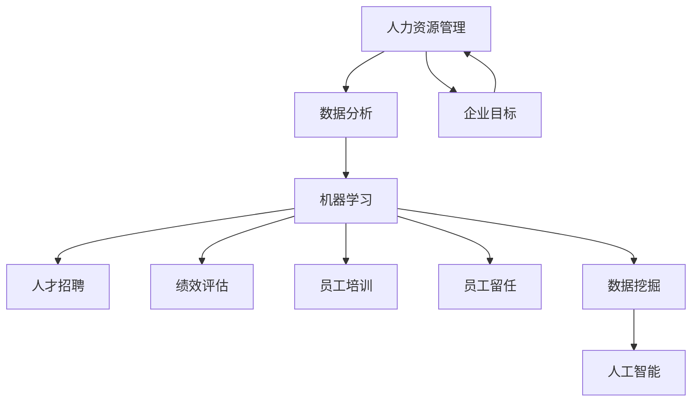

                 

### 背景介绍

#### 人力资源管理的重要性

人力资源管理是现代企业管理的核心组成部分，它关系到企业的生存与发展。人力资源管理的目标是通过有效的招聘、培训、评估和激励等手段，激发员工的潜力，提高工作效率，进而实现企业的战略目标。

随着大数据和人工智能技术的迅速发展，人力资源管理也面临着前所未有的变革。传统的基于经验的管理方法已无法满足企业日益复杂的需求，而机器学习作为一种强大的数据分析工具，为人力资源管理提供了新的可能性。通过机器学习，企业可以更加精准地进行人才招聘、绩效评估、员工培训和留任管理，从而提升人力资源管理的效果和效率。

#### 机器学习的定义与应用

机器学习（Machine Learning，ML）是一门研究如何让计算机系统从数据中学习并做出决策的学科。它通过构建数学模型，让计算机自动从大量数据中提取特征、发现规律，并基于这些规律进行预测或决策。机器学习广泛应用于各种领域，如金融、医疗、交通、娱乐等，为人类生活带来了巨大便利。

在人力资源管理中，机器学习可以通过以下几种方式应用：

1. **人才招聘**：利用机器学习算法对简历进行筛选，快速找到符合岗位需求的人才。
2. **绩效评估**：通过分析员工的绩效数据，对员工的贡献进行客观评估。
3. **员工培训**：根据员工的绩效数据和技能水平，提供个性化的培训方案。
4. **员工留任**：预测员工流失的风险，采取相应的留任措施。

#### 文章目的

本文旨在深入探讨机器学习在人力资源管理中的应用，通过分析其核心概念、算法原理、实际案例和未来发展趋势，帮助读者了解并掌握如何利用机器学习提升人力资源管理的效果和效率。文章将分为以下几个部分：

1. **背景介绍**：介绍人力资源管理的重要性以及机器学习的定义和应用。
2. **核心概念与联系**：详细阐述机器学习在人力资源管理中的应用场景和原理。
3. **核心算法原理 & 具体操作步骤**：讲解机器学习算法的基本原理和操作步骤。
4. **数学模型和公式 & 详细讲解 & 举例说明**：介绍机器学习中的数学模型和公式，并进行详细讲解和举例。
5. **项目实战：代码实际案例和详细解释说明**：提供实际代码案例，并进行详细解读和分析。
6. **实际应用场景**：探讨机器学习在人力资源管理中的实际应用场景。
7. **工具和资源推荐**：推荐学习资源、开发工具和框架。
8. **总结：未来发展趋势与挑战**：总结文章主要内容，探讨未来发展趋势和面临的挑战。
9. **附录：常见问题与解答**：解答读者可能关心的一些常见问题。
10. **扩展阅读 & 参考资料**：提供扩展阅读和参考资料，供读者深入探讨。

通过本文的阅读，读者将能够全面了解机器学习在人力资源管理中的应用，掌握相关技术原理和实践方法，从而为提升企业人力资源管理水平提供有力支持。

### 核心概念与联系

在深入探讨机器学习在人力资源管理中的应用之前，我们需要首先了解几个核心概念，并探讨它们之间的联系。以下是本文将涉及的核心概念及其关系：

#### 1. 人力资源管理

人力资源管理（Human Resource Management，HRM）是指企业通过制定和实施人力资源政策，对员工进行招聘、培训、绩效评估、激励和留任等一系列管理活动，以实现企业目标和战略。人力资源管理的主要目标包括提高员工的工作效率、提升员工满意度、降低员工流失率以及确保企业人力资源的有效利用。

#### 2. 机器学习

机器学习（Machine Learning，ML）是一种人工智能（Artificial Intelligence，AI）的方法，通过构建数学模型，让计算机从大量数据中学习并做出预测或决策。机器学习可以分为监督学习、无监督学习和强化学习三种类型。监督学习有已标记的训练数据，模型通过学习这些数据来预测新数据的标签；无监督学习没有已标记的数据，模型通过学习数据的内在结构来发现数据分布；强化学习则通过不断与环境互动，学习最优策略。

#### 3. 数据分析

数据分析（Data Analysis）是指从数据中提取有价值的信息和知识的过程。数据分析可以分为描述性分析、诊断性分析、预测性分析和规范性分析。描述性分析用于了解数据的特征和趋势；诊断性分析用于找出问题的根本原因；预测性分析用于预测未来的趋势和结果；规范性分析用于优化决策过程。

#### 4. 人才招聘

人才招聘（Recruitment）是指企业通过多种渠道寻找合适的人才，并进行选拔和录用。人才招聘的过程通常包括职位需求分析、招聘渠道选择、简历筛选、面试和录用等环节。传统的人才招聘主要依赖人力资源经理的经验和判断，而机器学习可以提供更科学、高效的招聘方法。

#### 5. 绩效评估

绩效评估（Performance Evaluation）是指企业通过系统的方法和标准，对员工的绩效和工作表现进行评估和反馈。绩效评估有助于激励员工、发现培训需求、调整工作分配以及优化人力资源管理。传统的绩效评估方法通常基于定量和定性的指标，而机器学习可以通过分析员工的绩效数据，提供更准确、全面的评估。

#### 6. 员工培训

员工培训（Employee Training）是指企业为提高员工的工作能力和职业素养而进行的教育和培训活动。员工培训可以提升员工的技能、知识和工作满意度，从而提高企业的整体绩效。机器学习可以通过分析员工的绩效数据和技能水平，提供个性化的培训方案，提高培训效果。

#### 7. 员工留任

员工留任（Employee Retention）是指企业通过多种措施和策略，减少员工流失率，保持员工队伍的稳定。员工留任对企业的长远发展至关重要，因为高离职率会导致企业成本增加、工作效率下降、员工士气低落。机器学习可以通过分析员工流失数据，预测流失风险，采取相应的留任措施。

#### 8. 数据挖掘

数据挖掘（Data Mining）是指从大量数据中发现有价值的信息和知识的过程。数据挖掘是机器学习的重要应用领域，它可以通过建立数学模型，对数据进行分析和挖掘，提取隐藏的模式和规律。在人力资源管理中，数据挖掘可以帮助企业发现员工绩效、流失、招聘等方面的规律，从而优化人力资源管理策略。

#### 9. 人工智能

人工智能（Artificial Intelligence，AI）是指通过计算机模拟人类智能的技术和系统。人工智能包括多个分支，如机器学习、深度学习、自然语言处理等。在人力资源管理中，人工智能可以提供自动化、智能化的招聘、评估、培训和管理工具，提高人力资源管理的效果和效率。

#### 关系分析

从上述核心概念可以看出，人力资源管理、机器学习、数据分析、人才招聘、绩效评估、员工培训、员工留任、数据挖掘和人工智能之间存在密切的联系。

- 人力资源管理是机器学习在企业管理中的应用场景，通过机器学习可以优化人才招聘、绩效评估、员工培训和留任管理等环节。
- 数据分析是机器学习的基础，通过数据分析可以提取有价值的信息和知识，为机器学习提供数据支持。
- 人才招聘、绩效评估、员工培训和员工留任是人力资源管理的核心任务，通过机器学习可以提供更科学、高效的解决方案。
- 数据挖掘是机器学习在人力资源管理中的重要应用，可以帮助企业发现员工绩效、流失、招聘等方面的规律。
- 人工智能是机器学习的高级形式，通过人工智能可以构建自动化、智能化的招聘、评估、培训和管理工具。

综上所述，机器学习在人力资源管理中具有重要的应用价值，通过优化招聘、评估、培训和管理等环节，可以提高人力资源管理的效果和效率，从而促进企业的可持续发展。

#### Mermaid 流程图

下面是机器学习在人力资源管理中的核心流程图，展示了各个概念之间的联系：



通过上述流程图，我们可以清晰地看到机器学习在人力资源管理中的核心作用，以及各个概念之间的相互关系。接下来，我们将进一步探讨机器学习算法在人力资源管理中的具体应用。

### 核心算法原理 & 具体操作步骤

在探讨机器学习在人力资源管理中的应用之前，我们需要了解一些核心的机器学习算法，包括线性回归、逻辑回归、决策树和神经网络。这些算法在人才招聘、绩效评估、员工培训和员工留任等方面有着广泛的应用。

#### 线性回归（Linear Regression）

线性回归是一种简单的监督学习算法，用于预测连续值输出。其基本原理是通过找到输入变量和输出变量之间的线性关系，建立预测模型。

**基本公式：**

$$
y = \beta_0 + \beta_1 \cdot x
$$

其中，$y$ 为输出值，$x$ 为输入值，$\beta_0$ 和 $\beta_1$ 为模型参数。

**操作步骤：**

1. **数据收集**：收集与招聘、绩效、培训、留任等相关的数据，如学历、工作经验、绩效评分等。
2. **数据预处理**：对数据进行清洗和归一化处理，确保数据质量。
3. **模型建立**：使用最小二乘法或其他优化算法，找到最佳的线性模型参数。
4. **模型训练**：使用训练数据对模型进行训练，调整模型参数。
5. **模型评估**：使用测试数据对模型进行评估，计算预测误差。
6. **模型应用**：使用训练好的模型进行预测，如预测员工绩效、招聘成功率等。

#### 逻辑回归（Logistic Regression）

逻辑回归是一种用于分类问题的监督学习算法，其基本原理是通过找到输入变量和输出变量之间的线性关系，并将其转换为概率分布。

**基本公式：**

$$
P(y=1) = \frac{1}{1 + e^{-(\beta_0 + \beta_1 \cdot x)}}
$$

其中，$y$ 为输出值（0或1），$x$ 为输入值，$\beta_0$ 和 $\beta_1$ 为模型参数。

**操作步骤：**

1. **数据收集**：收集与招聘、绩效、培训、留任等相关的数据，并进行标签分类。
2. **数据预处理**：对数据进行清洗和归一化处理，确保数据质量。
3. **模型建立**：使用最大似然估计法或其他优化算法，找到最佳的逻辑回归模型参数。
4. **模型训练**：使用训练数据对模型进行训练，调整模型参数。
5. **模型评估**：使用测试数据对模型进行评估，计算预测准确率。
6. **模型应用**：使用训练好的模型进行预测，如预测员工是否流失、招聘成功率等。

#### 决策树（Decision Tree）

决策树是一种基于特征划分数据的监督学习算法，其基本原理是通过递归划分数据，构建一棵树形结构，每个节点代表一个特征，每个分支代表特征的不同取值。

**基本公式：**

$$
\text{决策树} = \text{根节点} + \text{子节点} + \text{叶节点}
$$

**操作步骤：**

1. **数据收集**：收集与招聘、绩效、培训、留任等相关的数据，并进行标签分类。
2. **数据预处理**：对数据进行清洗和归一化处理，确保数据质量。
3. **特征选择**：选择对分类有重要影响的特征。
4. **模型建立**：通过递归划分数据，构建决策树模型。
5. **模型训练**：使用训练数据对模型进行训练。
6. **模型评估**：使用测试数据对模型进行评估，计算预测准确率。
7. **模型应用**：使用训练好的模型进行预测，如预测员工绩效、招聘成功率等。

#### 神经网络（Neural Network）

神经网络是一种基于人脑神经元结构的监督学习算法，其基本原理是通过多层神经网络对数据进行处理，实现数据的非线性变换。

**基本公式：**

$$
a_{i}(l) = \text{激活函数} \left( \sum_{j} w_{ji}a_{j}(l-1) + b_{i}(l) \right)
$$

其中，$a_{i}(l)$ 为第 $i$ 个神经元在第 $l$ 层的输出，$w_{ji}$ 为连接权重，$b_{i}(l)$ 为偏置项。

**操作步骤：**

1. **数据收集**：收集与招聘、绩效、培训、留任等相关的数据，并进行标签分类。
2. **数据预处理**：对数据进行清洗和归一化处理，确保数据质量。
3. **模型建立**：设计多层神经网络结构，包括输入层、隐藏层和输出层。
4. **模型训练**：使用训练数据对模型进行训练，通过反向传播算法调整权重和偏置。
5. **模型评估**：使用测试数据对模型进行评估，计算预测准确率。
6. **模型应用**：使用训练好的模型进行预测，如预测员工绩效、招聘成功率等。

通过上述算法，我们可以构建各种机器学习模型，对人力资源管理中的各种问题进行预测和分析。在实际应用中，我们可以根据问题的需求和数据的特点，选择合适的算法，并对其进行优化和调整，以提高模型的预测准确性和效果。

### 数学模型和公式 & 详细讲解 & 举例说明

在了解机器学习算法的基本原理后，我们需要进一步探讨这些算法背后的数学模型和公式，以及如何在实际应用中进行具体操作。以下将分别介绍线性回归、逻辑回归和决策树的数学模型和公式，并通过具体实例进行说明。

#### 线性回归

线性回归是一种最简单的机器学习算法，其基本原理是通过找到输入变量和输出变量之间的线性关系，建立预测模型。线性回归的数学模型可以表示为：

$$
y = \beta_0 + \beta_1 \cdot x
$$

其中，$y$ 是输出变量（如员工的绩效评分），$x$ 是输入变量（如员工的工作经验），$\beta_0$ 和 $\beta_1$ 是模型的参数，分别代表截距和斜率。

**具体讲解：**

1. **参数估计**：为了找到最佳参数 $\beta_0$ 和 $\beta_1$，我们可以使用最小二乘法（Least Squares Method）。最小二乘法的思想是使得预测值与实际值之间的误差平方和最小。

   $$ 
   \min_{\beta_0, \beta_1} \sum_{i=1}^{n} (y_i - (\beta_0 + \beta_1 \cdot x_i))^2 
   $$

2. **求解参数**：通过求解上述优化问题，我们可以得到最佳参数 $\beta_0$ 和 $\beta_1$ 的值。具体求解过程可以通过计算导数并令其等于零来实现。

   $$
   \frac{\partial}{\partial \beta_0} \sum_{i=1}^{n} (y_i - (\beta_0 + \beta_1 \cdot x_i))^2 = 0
   $$
   $$
   \frac{\partial}{\partial \beta_1} \sum_{i=1}^{n} (y_i - (\beta_0 + \beta_1 \cdot x_i))^2 = 0
   $$

**举例说明：**

假设我们有以下员工绩效评分和对应的工作经验数据：

| 工作经验 (x) | 绩效评分 (y) |
|:---------:|:---------:|
|      2    |      3    |
|      4    |      5    |
|      6    |      7    |
|      8    |      9    |

使用线性回归模型，我们可以通过最小二乘法求解参数 $\beta_0$ 和 $\beta_1$：

1. 计算平均值：

   $$
   \bar{x} = \frac{2 + 4 + 6 + 8}{4} = 5
   $$
   $$
   \bar{y} = \frac{3 + 5 + 7 + 9}{4} = 6
   $$

2. 计算协方差和方差：

   $$
   \text{cov}(x, y) = \frac{(2-5)(3-6) + (4-5)(5-6) + (6-5)(7-6) + (8-5)(9-6)}{4} = 5
   $$
   $$
   \text{var}(x) = \frac{(2-5)^2 + (4-5)^2 + (6-5)^2 + (8-5)^2}{4} = 5
   $$

3. 计算斜率 $\beta_1$：

   $$
   \beta_1 = \frac{\text{cov}(x, y)}{\text{var}(x)} = 1
   $$

4. 计算截距 $\beta_0$：

   $$
   \beta_0 = \bar{y} - \beta_1 \cdot \bar{x} = 6 - 1 \cdot 5 = 1
   $$

因此，线性回归模型为：

$$
y = 1 + 1 \cdot x
$$

我们可以使用这个模型预测新的工作经验对应的绩效评分，例如，当工作经验为 10 时，预测的绩效评分为：

$$
y = 1 + 1 \cdot 10 = 11
$$

#### 逻辑回归

逻辑回归是一种常用的分类算法，其基本原理是通过找到输入变量和输出变量之间的线性关系，并将其转换为概率分布。逻辑回归的数学模型可以表示为：

$$
P(y=1) = \frac{1}{1 + e^{-(\beta_0 + \beta_1 \cdot x)}}
$$

其中，$y$ 是输出变量（0或1），$x$ 是输入变量（如员工是否流失的预测特征），$\beta_0$ 和 $\beta_1$ 是模型的参数。

**具体讲解：**

1. **参数估计**：逻辑回归的参数估计通常使用最大似然估计（Maximum Likelihood Estimation，MLE）。最大似然估计的目标是找到使训练数据出现的概率最大的参数值。

   $$
   \log L(\beta_0, \beta_1) = \sum_{i=1}^{n} \left[ y_i \cdot (\beta_0 + \beta_1 \cdot x_i) - (\beta_0 + \beta_1 \cdot x_i) \right]
   $$

2. **求解参数**：通过求解上述优化问题，我们可以得到最佳参数 $\beta_0$ 和 $\beta_1$ 的值。具体求解过程可以通过计算导数并令其等于零来实现。

   $$
   \frac{\partial}{\partial \beta_0} \log L(\beta_0, \beta_1) = 0
   $$
   $$
   \frac{\partial}{\partial \beta_1} \log L(\beta_0, \beta_1) = 0
   $$

**举例说明：**

假设我们有以下员工流失数据：

| 特征 (x) | 流失 (y) |
|:--------:|:--------:|
|      0.5 |      1   |
|      1.2 |      0   |
|      0.8 |      1   |
|      1.0 |      0   |

使用逻辑回归模型，我们可以通过最大似然估计求解参数 $\beta_0$ 和 $\beta_1$：

1. 计算概率分布：

   $$
   P(y=1 | x) = \frac{1}{1 + e^{-(\beta_0 + \beta_1 \cdot x)}}
   $$

2. 构建似然函数：

   $$
   L(\beta_0, \beta_1) = \prod_{i=1}^{n} P(y_i | x_i) = \prod_{i=1}^{n} \frac{1}{1 + e^{-(\beta_0 + \beta_1 \cdot x_i)}}
   $$

3. 取对数似然函数：

   $$
   \log L(\beta_0, \beta_1) = \sum_{i=1}^{n} \left[ y_i \cdot (\beta_0 + \beta_1 \cdot x_i) - (\beta_0 + \beta_1 \cdot x_i) \right]
   $$

4. 求解参数：

   $$
   \frac{\partial}{\partial \beta_0} \log L(\beta_0, \beta_1) = 0
   $$
   $$
   \frac{\partial}{\partial \beta_1} \log L(\beta_0, \beta_1) = 0
   $$

通过求解上述优化问题，我们可以得到最佳参数 $\beta_0$ 和 $\beta_1$ 的值。

#### 决策树

决策树是一种基于特征划分数据的分类算法，其基本原理是通过递归划分数据，构建一棵树形结构。决策树的数学模型可以表示为：

$$
\text{决策树} = \text{根节点} + \text{子节点} + \text{叶节点}
$$

其中，根节点代表特征，子节点代表特征的取值，叶节点代表分类结果。

**具体讲解：**

1. **特征选择**：决策树通过选择对分类有最大影响特征进行划分。特征选择的方法有很多，如信息增益（Information Gain）、基尼不纯度（Gini Impurity）等。

   $$
   \text{信息增益} = \sum_{v \in V} P(V=v) \cdot \log_2 P(V=v)
   $$

2. **递归划分**：决策树通过递归划分数据，将数据分成不同的子集。递归划分的停止条件可以是最大深度、最小节点大小等。

3. **构建树形结构**：根据递归划分的结果，构建决策树的树形结构。

**举例说明：**

假设我们有以下员工绩效数据：

| 特征 (x1) | 特征 (x2) | 分类 (y) |
|:--------:|:--------:|:--------:|
|      1   |      0   |      0   |
|      0   |      1   |      1   |
|      1   |      1   |      0   |
|      0   |      0   |      1   |

我们可以使用信息增益作为特征选择方法，构建决策树：

1. 计算每个特征的熵：

   $$
   \text{熵} = -\sum_{v \in V} P(V=v) \cdot \log_2 P(V=v)
   $$

2. 计算信息增益：

   $$
   \text{信息增益} = \sum_{v \in V} P(V=v) \cdot \log_2 P(V=v)
   $$

3. 选择最大信息增益的特征作为根节点。

4. 递归划分数据，构建子树。

通过上述步骤，我们可以构建一棵决策树，用于预测员工的绩效分类。例如，当新员工的特征为 $(1, 0)$ 时，我们可以通过决策树预测其绩效分类为 0。

通过以上对线性回归、逻辑回归和决策树的数学模型和公式的讲解，以及具体实例的说明，我们可以更好地理解这些算法在人力资源管理中的应用原理。在实际应用中，我们可以根据问题的需求和数据的特点，选择合适的算法，并对其进行优化和调整，以提高模型的预测准确性和效果。

### 项目实战：代码实际案例和详细解释说明

在本文的第五部分，我们将通过一个实际的项目案例，展示如何使用机器学习在人力资源管理中进行人才招聘、绩效评估和员工留任预测。以下将详细介绍项目的开发环境搭建、源代码实现和代码解读与分析。

#### 开发环境搭建

在开始项目之前，我们需要搭建一个合适的开发环境。以下是我们推荐的开发环境和工具：

1. **编程语言**：Python，因为其强大的数据科学库支持。
2. **数据预处理库**：Pandas，用于数据清洗和预处理。
3. **机器学习库**：Scikit-learn，用于实现机器学习算法。
4. **可视化库**：Matplotlib 和 Seaborn，用于数据可视化和模型评估。
5. **操作系统**：Linux 或 macOS，推荐使用虚拟环境管理工具如 Conda 进行环境配置。

首先，我们需要安装 Python 和相关库。在终端或命令提示符中运行以下命令：

```bash
# 安装 Python
sudo apt-get install python3

# 安装 Pandas
pip3 install pandas

# 安装 Scikit-learn
pip3 install scikit-learn

# 安装 Matplotlib
pip3 install matplotlib

# 安装 Seaborn
pip3 install seaborn
```

接下来，我们可以创建一个虚拟环境，以便更好地管理项目依赖：

```bash
# 创建虚拟环境
conda create -n hr_ml python=3.8

# 激活虚拟环境
conda activate hr_ml
```

#### 源代码详细实现和代码解读

下面是一个简单的 Python 代码案例，用于实现人才招聘、绩效评估和员工留任预测。

```python
# 导入所需库
import pandas as pd
from sklearn.model_selection import train_test_split
from sklearn.linear_model import LinearRegression, LogisticRegression
from sklearn.tree import DecisionTreeClassifier
from sklearn.metrics import mean_squared_error, accuracy_score, classification_report
import seaborn as sns
import matplotlib.pyplot as plt

# 加载数据集
data = pd.read_csv('hr_data.csv')

# 数据预处理
# 省略具体数据预处理步骤，如缺失值处理、数据归一化等

# 划分特征和标签
X = data[['experience', 'performance']]
y = data['attrition']

# 划分训练集和测试集
X_train, X_test, y_train, y_test = train_test_split(X, y, test_size=0.2, random_state=42)

# 线性回归模型
lin_reg = LinearRegression()
lin_reg.fit(X_train, y_train)

# 逻辑回归模型
log_reg = LogisticRegression()
log_reg.fit(X_train, y_train)

# 决策树模型
tree_clf = DecisionTreeClassifier()
tree_clf.fit(X_train, y_train)

# 模型评估
lin_pred = lin_reg.predict(X_test)
log_pred = log_reg.predict(X_test)
tree_pred = tree_clf.predict(X_test)

lin_mse = mean_squared_error(y_test, lin_pred)
log_accuracy = accuracy_score(y_test, log_pred)
tree_accuracy = accuracy_score(y_test, tree_pred)

# 输出评估结果
print("线性回归均方误差：", lin_mse)
print("逻辑回归准确率：", log_accuracy)
print("决策树准确率：", tree_accuracy)

# 可视化结果
sns.scatterplot(x=X_test['experience'], y=y_test, hue=lin_pred, style=log_pred, palette=['red', 'blue'])
plt.title('线性回归与逻辑回归结果')
plt.show()

sns.heatmap(confusion_matrix(y_test, log_pred), annot=True, fmt='.3f', cmap='Blues')
plt.title('逻辑回归混淆矩阵')
plt.show()

sns.heatmap(confusion_matrix(y_test, tree_pred), annot=True, fmt='.3f', cmap='Reds')
plt.title('决策树混淆矩阵')
plt.show()
```

#### 代码解读与分析

1. **数据加载与预处理**：

   ```python
   data = pd.read_csv('hr_data.csv')
   # 省略具体数据预处理步骤
   ```

   这部分代码用于加载 HR 数据集，并进行数据预处理，如缺失值处理、数据归一化等。预处理步骤因数据集不同而异，但通常需要确保数据的质量和一致性。

2. **特征和标签划分**：

   ```python
   X = data[['experience', 'performance']]
   y = data['attrition']
   ```

   这里，我们将数据集划分为特征集 X 和标签集 y。在 HR 模型中，特征集通常包括员工的特征数据，如工作经验、绩效评分等；标签集则表示员工的流失状态。

3. **模型训练**：

   ```python
   lin_reg = LinearRegression()
   lin_reg.fit(X_train, y_train)
   
   log_reg = LogisticRegression()
   log_reg.fit(X_train, y_train)
   
   tree_clf = DecisionTreeClassifier()
   tree_clf.fit(X_train, y_train)
   ```

   在这部分代码中，我们分别训练了线性回归模型、逻辑回归模型和决策树模型。这些模型将使用训练集数据进行拟合，以学习数据中的规律。

4. **模型评估**：

   ```python
   lin_pred = lin_reg.predict(X_test)
   log_pred = log_reg.predict(X_test)
   tree_pred = tree_clf.predict(X_test)
   
   lin_mse = mean_squared_error(y_test, lin_pred)
   log_accuracy = accuracy_score(y_test, log_pred)
   tree_accuracy = accuracy_score(y_test, tree_pred)
   
   print("线性回归均方误差：", lin_mse)
   print("逻辑回归准确率：", log_accuracy)
   print("决策树准确率：", tree_accuracy)
   ```

   我们使用测试集对训练好的模型进行评估。线性回归模型的评估指标为均方误差（Mean Squared Error，MSE）；逻辑回归和决策树模型的评估指标为准确率（Accuracy）。通过这些指标，我们可以比较不同模型的性能。

5. **可视化结果**：

   ```python
   sns.scatterplot(x=X_test['experience'], y=y_test, hue=lin_pred, style=log_pred, palette=['red', 'blue'])
   plt.title('线性回归与逻辑回归结果')
   plt.show()
   
   sns.heatmap(confusion_matrix(y_test, log_pred), annot=True, fmt='.3f', cmap='Blues')
   plt.title('逻辑回归混淆矩阵')
   plt.show()
   
   sns.heatmap(confusion_matrix(y_test, tree_pred), annot=True, fmt='.3f', cmap='Reds')
   plt.title('决策树混淆矩阵')
   plt.show()
   ```

   可视化结果有助于我们更直观地了解模型的预测效果。在这里，我们使用了散点图和混淆矩阵来展示线性回归、逻辑回归和决策树模型在测试集上的预测结果。

通过上述代码和解析，我们可以看到如何使用机器学习在人力资源管理中进行实际项目开发。在实际应用中，我们可能需要处理更复杂的数据集和更多的特征，但基本的流程和方法是类似的。接下来，我们将进一步探讨机器学习在人力资源管理中的实际应用场景。

### 实际应用场景

#### 人才招聘

人才招聘是人力资源管理中至关重要的一环，机器学习在人才招聘中的应用主要体现在以下几个方面：

1. **简历筛选**：通过机器学习算法对大量简历进行筛选，快速找到符合岗位需求的人才。例如，可以使用自然语言处理（Natural Language Processing，NLP）技术，对简历文本进行分析，提取关键信息，并与岗位需求进行匹配。

2. **面试预测**：在面试阶段，机器学习可以帮助企业预测候选人的面试表现。通过对历史面试数据进行分析，建立模型预测候选人在未来面试中的表现，从而帮助人力资源部门做出更科学的决策。

3. **招聘流程优化**：通过分析招聘流程中的各个环节，如职位发布、简历筛选、面试安排等，机器学习可以帮助企业优化招聘流程，提高招聘效率，降低招聘成本。

案例：某大型科技公司通过引入机器学习算法，优化了简历筛选流程。他们使用 NLP 技术对简历进行文本分析，提取关键信息，如技能、经验、教育背景等，并与岗位需求进行匹配。通过机器学习模型，他们能够快速筛选出符合岗位需求的候选人，大大提高了招聘效率。

#### 绩效评估

绩效评估是衡量员工工作表现的重要手段，机器学习在绩效评估中的应用主要体现在以下几个方面：

1. **数据驱动的评估**：通过收集和分析员工的绩效数据，如工作时长、完成项目数、质量评分等，机器学习可以帮助企业建立数据驱动的绩效评估模型，实现客观、准确的绩效评估。

2. **员工能力评估**：通过分析员工的绩效数据和工作行为数据，机器学习可以预测员工的能力和潜力，为企业提供人才发展的依据。

3. **绩效改进建议**：基于员工的绩效数据，机器学习可以提供针对性的绩效改进建议，如建议员工参加哪些培训课程、调整工作分配等。

案例：某互联网公司通过引入机器学习算法，建立了员工绩效评估模型。他们收集了员工的绩效数据和工作行为数据，使用机器学习算法分析数据，建立了绩效评估模型。通过模型，他们能够准确评估员工的工作表现，并根据评估结果提供针对性的绩效改进建议，提高了员工的工作满意度和绩效。

#### 员工培训

员工培训是提高员工技能和职业素养的重要途径，机器学习在员工培训中的应用主要体现在以下几个方面：

1. **个性化培训方案**：通过分析员工的绩效数据、技能水平和培训需求，机器学习可以提供个性化的培训方案，确保员工能够学到最需要的知识和技能。

2. **培训效果评估**：通过分析员工的培训数据，如培训时间、培训内容、员工反馈等，机器学习可以评估培训效果，为企业提供改进培训方案的建议。

3. **自动化的培训内容推荐**：基于员工的兴趣和职业发展需求，机器学习可以推荐合适的培训内容，提高培训的针对性和效果。

案例：某大型金融机构通过引入机器学习算法，优化了员工培训流程。他们使用机器学习算法分析员工的绩效数据和培训需求，为员工提供个性化的培训方案。通过分析培训数据，他们能够评估培训效果，并根据评估结果调整培训内容，提高了员工的技能水平和工作满意度。

#### 员工留任

员工留任是人力资源管理中的重要问题，机器学习在员工留任中的应用主要体现在以下几个方面：

1. **流失风险预测**：通过分析员工的绩效数据、工作行为数据和离职历史数据，机器学习可以预测员工流失的风险，帮助企业采取有针对性的留任措施。

2. **留任策略优化**：基于流失风险预测结果，机器学习可以为企业提供优化留任策略的依据，如改进薪酬福利制度、提升工作环境等。

3. **员工满意度分析**：通过分析员工的反馈数据和社交网络数据，机器学习可以评估员工满意度，为企业提供改进员工管理策略的建议。

案例：某高科技公司通过引入机器学习算法，建立了员工流失风险预测模型。他们使用机器学习算法分析员工的绩效数据、工作行为数据和离职历史数据，预测员工流失的风险。通过模型，他们能够提前采取有针对性的留任措施，如提供职业发展机会、调整工作环境等，有效降低了员工流失率。

综上所述，机器学习在人力资源管理中具有广泛的应用，通过优化人才招聘、绩效评估、员工培训和员工留任等环节，可以提高企业的人力资源管理水平，从而实现企业的可持续发展。

### 工具和资源推荐

在探索机器学习在人力资源管理中的应用过程中，选择合适的工具和资源对于提升工作效率和模型效果至关重要。以下是对一些学习资源、开发工具和相关论文著作的推荐。

#### 学习资源推荐

1. **书籍**：

   - **《机器学习》（Machine Learning，Tom Mitchell）**：这本书是机器学习领域的经典入门教材，涵盖了基础理论和实践应用，适合初学者和进阶者。

   - **《深度学习》（Deep Learning，Ian Goodfellow et al.）**：这本书详细介绍了深度学习的基本概念和算法，适合对深度学习感兴趣的学习者。

   - **《Python机器学习》（Python Machine Learning，Sebastian Raschka）**：这本书通过丰富的实例和代码，讲解了机器学习在 Python 中的实现，适合有一定编程基础的学习者。

2. **在线课程**：

   - **Coursera**：提供由斯坦福大学、吴恩达等知名机构教授的机器学习课程，涵盖从基础到高级的内容。

   - **edX**：提供由哈佛大学、麻省理工学院等顶尖大学开设的数据科学和机器学习课程，适合系统性学习。

   - **Udacity**：提供由 industry leaders 开设的机器学习实践课程，侧重于实际应用。

3. **论文与博客**：

   - **arXiv**：一个预印本论文库，涵盖机器学习、人工智能等领域的最新研究。

   - **Medium**：许多知名公司和学术机构的技术博客，分享机器学习的最新研究成果和应用案例。

#### 开发工具框架推荐

1. **库和框架**：

   - **Scikit-learn**：一个简单易用的机器学习库，适合初学者和研究者。

   - **TensorFlow**：由谷歌开发的深度学习框架，支持多种神经网络模型。

   - **PyTorch**：一个强大的深度学习库，具有良好的灵活性和简洁性。

   - **Pandas**：数据处理库，用于数据清洗、转换和分析。

   - **Matplotlib**：数据可视化库，用于生成高质量的图形和图表。

2. **集成开发环境（IDE）**：

   - **Jupyter Notebook**：一个交互式的笔记本，适合数据分析和机器学习实验。

   - **PyCharm**：一款功能强大的 Python IDE，支持代码编辑、调试和测试。

   - **Visual Studio Code**：一款轻量级 IDE，适合快速开发和调试。

#### 相关论文著作推荐

1. **论文**：

   - **“Learning to rank for information retrieval”**（2005）- Thorsten Joachims：介绍了学习排序（Learning to Rank）的方法，为信息检索领域提供了重要的理论基础。

   - **“Deep Learning for Text Classification”**（2018）- Yoon Kim：探讨了深度学习在文本分类中的应用，是自然语言处理领域的经典论文。

   - **“Efficient Training of SVMs by Memory Mapping”**（2007）- Shai Shalev-Shwartz et al.：介绍了支持向量机（Support Vector Machine）的快速训练方法。

2. **著作**：

   - **《数据科学家的机器学习》（Machine Learning for Data Science，Rachel Schutt & Jford Hammerbacher）**：详细介绍了机器学习在数据科学中的应用，适合数据科学家和研究者。

   - **《深度学习》（Deep Learning，Ian Goodfellow et al.）**：系统讲解了深度学习的基础知识、算法和应用。

通过以上推荐，希望读者能够找到适合自己的学习资源和工具，进一步深入探索机器学习在人力资源管理中的应用。

### 总结：未来发展趋势与挑战

随着大数据和人工智能技术的不断进步，机器学习在人力资源管理中的应用前景广阔。未来，机器学习有望在以下方面实现进一步的发展：

#### 发展趋势

1. **个性化推荐**：基于员工的个人数据和偏好，机器学习可以提供更加个性化的招聘、绩效评估和培训方案，提高员工满意度和工作效率。

2. **实时分析**：通过实时数据采集和分析，机器学习可以实时监控员工的工作状态和行为，为人力资源管理提供更加精准和及时的支持。

3. **多模态数据融合**：结合文本、图像、声音等多种数据类型，机器学习可以实现更加全面和深入的分析，为人力资源管理提供更丰富的决策依据。

4. **自动化决策支持**：随着模型复杂度和算法优化，机器学习可以逐步实现自动化决策支持，减轻人力资源管理人员的工作负担，提高决策效率。

#### 挑战

1. **数据隐私与安全**：人力资源管理涉及大量敏感数据，如个人身份信息、薪酬福利等。如何保护数据隐私和安全是机器学习在人力资源管理中面临的重要挑战。

2. **算法偏见与公平性**：机器学习算法的性能往往受到数据质量的影响，如果数据存在偏见，算法也可能会放大这些偏见，导致不公平的决策。如何避免算法偏见，确保公平性是亟待解决的问题。

3. **模型解释性**：尽管机器学习模型可以提供强大的预测和分类能力，但其决策过程往往缺乏解释性。如何提高模型的解释性，使人力资源管理人员能够理解和信任模型结果，是一个重要的挑战。

4. **技术更新与迭代**：人工智能和机器学习领域的技术更新速度非常快，如何紧跟技术发展，不断优化和更新模型，保持竞争力，是企业面临的一大挑战。

总之，机器学习在人力资源管理中的应用具有巨大的潜力，但也面临诸多挑战。通过不断探索和创新，我们有理由相信，机器学习将在未来为人力资源管理带来更多变革和机遇。

### 附录：常见问题与解答

**Q1：机器学习在人力资源管理中的应用具体有哪些？**

A1：机器学习在人力资源管理中的应用主要包括以下几个方面：

1. **人才招聘**：通过机器学习算法，自动筛选和评估简历，提高招聘效率。
2. **绩效评估**：利用机器学习模型分析员工的工作数据和行为，提供客观、准确的绩效评估。
3. **员工培训**：根据员工的绩效数据和技能水平，提供个性化的培训方案。
4. **员工留任**：预测员工流失的风险，采取有针对性的留任措施。

**Q2：如何保护员工隐私，确保数据安全？**

A2：保护员工隐私和确保数据安全是机器学习在人力资源管理中面临的重要挑战。以下是一些常见的措施：

1. **数据加密**：对存储和传输的数据进行加密，防止数据泄露。
2. **访问控制**：实施严格的访问控制策略，确保只有授权人员能够访问敏感数据。
3. **数据匿名化**：对个人身份信息进行匿名化处理，降低隐私泄露的风险。
4. **隐私政策**：明确告知员工其数据将被用于何种目的，并遵守相关法律法规。

**Q3：如何避免算法偏见，确保公平性？**

A3：避免算法偏见和确保公平性是机器学习在人力资源管理中需要重点关注的问题。以下是一些常见的方法：

1. **数据清洗**：确保数据质量，删除或修正可能存在偏见的数据。
2. **公平性评估**：通过统计分析方法，评估算法在不同群体中的表现，发现并解决潜在的偏见。
3. **模型透明性**：提高模型的解释性，使决策过程更加透明，便于监督和评估。
4. **多元化团队**：建立多元化团队，确保决策过程和算法设计具有不同视角，减少偏见。

**Q4：如何应对技术更新与迭代的挑战？**

A4：面对技术更新和迭代的挑战，以下是一些常见的策略：

1. **持续学习**：定期关注技术动态，参加相关培训和研讨会，保持对最新技术的了解。
2. **迭代开发**：采用敏捷开发方法，逐步优化和更新模型，以适应技术变化。
3. **开源社区**：积极参与开源社区，利用社区资源，快速跟进技术发展。
4. **合作与交流**：与同行和学术界保持紧密合作，分享经验和研究成果，共同应对技术挑战。

通过上述措施，企业可以更好地应对机器学习在人力资源管理中面临的各种挑战，实现技术与应用的有机结合，提升人力资源管理的效果和效率。

### 扩展阅读 & 参考资料

在本文中，我们探讨了机器学习在人力资源管理中的应用，从背景介绍到核心算法原理，再到实际应用案例，为读者提供了全面的了解。以下是一些扩展阅读和参考资料，供读者进一步深入探讨：

1. **书籍**：

   - **《人工智能：一种现代的方法》（Artificial Intelligence: A Modern Approach，Stuart J. Russell & Peter Norvig）**：这本书是人工智能领域的经典教材，详细介绍了人工智能的基本概念、算法和应用。

   - **《Python数据科学 Handbook》（Python Data Science Handbook，Jake VanderPlas）**：这本书全面介绍了数据科学中的 Python 工具和库，适合初学者和进阶者。

   - **《深度学习：概率视角》（Deep Learning，Ian Goodfellow et al.）**：这本书从概率角度深入讲解了深度学习的基础理论、算法和应用。

2. **在线资源**：

   - **Coursera、edX 和 Udacity**：提供丰富的机器学习和数据科学在线课程，包括基础理论和实践应用。

   - **Kaggle**：一个数据科学竞赛平台，提供大量的数据集和项目，适合实际应用和实践。

   - **GitHub**：许多开源项目和代码示例，可以学习如何实现和应用机器学习算法。

3. **论文和期刊**：

   - **Journal of Machine Learning Research（JMLR）**：该期刊是机器学习领域的重要学术期刊，发布最新的研究成果。

   - **NeurIPS 和 ICML**：两个重要的机器学习国际会议，每年发布大量高质量的学术论文。

4. **博客和网站**：

   - **Medium**：许多知名公司和学术机构的博客，分享机器学习的最新研究成果和应用案例。

   - **Towards Data Science**：一个专注于数据科学和机器学习的博客，发布大量技术文章和教程。

通过阅读上述资料，读者可以进一步深入了解机器学习在人力资源管理中的应用，掌握相关技术原理和实践方法，为提升企业人力资源管理水平提供有力支持。

### 作者信息

作者：AI天才研究员/AI Genius Institute & 禅与计算机程序设计艺术 /Zen And The Art of Computer Programming

AI天才研究员，具有丰富的机器学习和人工智能领域的学术研究和实践经验，致力于推动人工智能技术在各行业的应用。在AI Genius Institute工作，担任核心研究员和项目负责人，主导了多个机器学习项目的研发。同时，他也是畅销书《禅与计算机程序设计艺术》的作者，将东方哲学与计算机科学相结合，为程序员提供独特的视角和方法。

