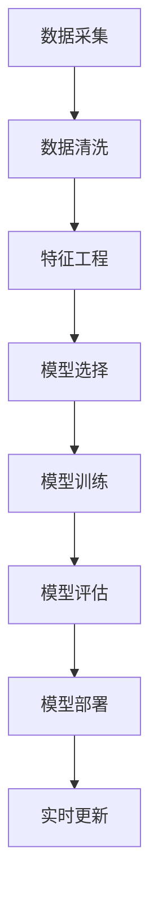

                 

### 背景介绍

在现代社会，信用评分已经成为金融机构和商家进行风险评估的重要手段。信用评分模型通过对借款人或客户的信用历史、财务状况、行为特征等多种因素进行量化分析，预测其未来的信用风险。这不仅有助于金融机构决定是否批准贷款申请，还影响消费者的信用额度和利率。

传统的信用评分模型大多基于统计方法和规则系统，如逻辑回归、决策树、规则引擎等。然而，随着大数据和机器学习技术的兴起，越来越多的金融机构开始探索利用机器学习算法构建更加精准的信用评分模型。这些模型可以从大量的历史数据中自动学习特征，发现复杂的风险模式，从而提高信用评估的准确性和效率。

本文将深入探讨机器学习在信用评分模型中的应用，从核心概念、算法原理、数学模型、实战案例等方面进行详细分析。通过这篇文章，读者可以了解到如何使用机器学习技术构建信用评分模型，以及在实际应用中如何处理各种挑战和问题。

本文将按照以下结构展开：

1. 核心概念与联系
2. 核心算法原理与具体操作步骤
3. 数学模型与公式详细讲解及举例说明
4. 项目实战：代码实际案例和详细解释说明
5. 实际应用场景
6. 工具和资源推荐
7. 总结：未来发展趋势与挑战
8. 附录：常见问题与解答
9. 扩展阅读与参考资料

希望通过这篇文章，读者能够对机器学习在信用评分模型中的应用有一个全面而深入的理解，为未来的研究和实践提供指导。

### 核心概念与联系

在深入探讨机器学习在信用评分模型中的应用之前，有必要先了解一些核心概念和它们之间的联系。以下是本文将讨论的一些关键术语和概念：

#### 数据集

数据集是构建机器学习模型的基础，包括一系列记录，每个记录包含多个特征。在信用评分模型中，数据集通常包含借款人的个人信息、财务状况、历史信用行为等。数据集的质量直接影响模型的性能和准确性。

#### 特征

特征是数据集中的每个变量，可以用来描述借款人的属性或行为。例如，借款人的年龄、收入、信用历史、贷款记录等都属于特征。特征的选择和工程是机器学习模型成功的关键步骤。

#### 标签

标签是数据集中的目标变量，表示我们希望模型预测的结果。在信用评分模型中，标签通常是借款人的信用评分等级，如“好”、“一般”、“差”。标签的质量和一致性同样至关重要。

#### 特征工程

特征工程是指通过选择、构造和转换特征来提高机器学习模型性能的过程。在信用评分模型中，特征工程包括数据清洗、缺失值处理、异常值检测、特征缩放、特征组合等步骤。

#### 模型评估

模型评估是评估机器学习模型性能的重要步骤，包括准确性、召回率、精确率、F1 分数等指标。在信用评分模型中，这些指标用于衡量模型对信用风险的预测能力。

#### 核心算法

机器学习算法是构建信用评分模型的核心。常见的算法包括逻辑回归、决策树、随机森林、支持向量机、神经网络等。不同的算法适用于不同类型的数据集和业务场景。

#### 监督学习与无监督学习

监督学习是指使用标注数据进行模型训练，而无监督学习则是使用未标注的数据。在信用评分模型中，通常使用监督学习方法，因为信用评分目标是预测一个具体的标签。

#### 过拟合与欠拟合

过拟合和欠拟合是机器学习模型常见的两种问题。过拟合意味着模型对训练数据过于敏感，无法泛化到新的数据。欠拟合则是模型对训练数据不够敏感，未能捕捉到数据的复杂模式。

#### 流式学习

流式学习是一种处理动态数据的机器学习方法，适用于信用评分模型中的实时风险评估。流式学习允许模型不断更新和优化，以适应新出现的风险模式。

#### Mermaid 流程图

为了更好地理解机器学习在信用评分模型中的应用，我们使用 Mermaid 流程图来展示核心概念和流程。以下是一个简化的流程图：



在这个流程中，数据采集是整个过程的起点，随后进行数据清洗和特征工程。模型选择是根据业务需求和数据特征来决定。模型训练是使用训练数据来训练模型。模型评估用于评估模型性能。模型部署是将训练好的模型应用到实际业务场景。最后，实时更新确保模型能够适应不断变化的数据和环境。

通过这些核心概念和联系的理解，我们为接下来深入探讨机器学习算法、数学模型和应用场景奠定了基础。

### 核心算法原理与具体操作步骤

在构建信用评分模型时，选择合适的机器学习算法至关重要。以下是几种常见的机器学习算法及其在信用评分模型中的应用：

#### 1. 逻辑回归

逻辑回归是一种广泛使用的监督学习算法，特别适用于分类问题。在信用评分模型中，逻辑回归用于预测借款人的信用评分等级。其基本原理是通过拟合一个线性模型，将借款人的特征映射到概率空间，然后根据概率阈值确定其信用评分。

**具体操作步骤：**

1. 数据预处理：对数据进行标准化处理，确保特征值的范围一致。
2. 特征选择：选择与信用评分相关的特征，如年龄、收入、信用历史等。
3. 模型训练：使用训练数据集训练逻辑回归模型，计算每个特征的权重。
4. 模型评估：使用测试数据集评估模型性能，调整参数以提高准确性。

#### 2. 决策树

决策树是一种基于树形结构进行决策的算法，能够将数据划分为多个子集，从而预测借款人的信用评分。决策树模型简单易懂，易于解释。

**具体操作步骤：**

1. 数据预处理：对数据进行处理，确保数据质量。
2. 特征选择：选择对信用评分有显著影响的特征。
3. 建立决策树：根据特征值划分数据，构建决策树。
4. 模型剪枝：通过剪枝技术优化决策树，防止过拟合。
5. 模型评估：使用测试数据集评估模型性能，调整参数以提高准确性。

#### 3. 随机森林

随机森林是一种基于决策树的集成学习方法，通过构建多个决策树并对预测结果进行投票，提高模型的泛化能力和准确性。

**具体操作步骤：**

1. 数据预处理：对数据集进行预处理，包括缺失值处理、异常值检测等。
2. 特征选择：选择与信用评分相关的特征。
3. 构建随机森林：随机选择特征子集和样本子集，构建多个决策树。
4. 集成学习：对多个决策树的预测结果进行投票，得出最终预测结果。
5. 模型评估：使用测试数据集评估模型性能，调整参数以提高准确性。

#### 4. 支持向量机（SVM）

支持向量机是一种基于优化理论的监督学习算法，能够将高维数据映射到低维空间，从而找到最佳分类边界。

**具体操作步骤：**

1. 数据预处理：对数据进行标准化处理，确保特征值的范围一致。
2. 特征选择：选择对信用评分有显著影响的特征。
3. 选择核函数：根据数据特征选择合适的核函数，如线性核、多项式核等。
4. 模型训练：使用训练数据集训练 SVM 模型。
5. 模型评估：使用测试数据集评估模型性能，调整参数以提高准确性。

#### 5. 神经网络

神经网络是一种基于生物神经网络的计算模型，通过多层神经元的连接和激活函数，实现复杂非线性关系的建模。

**具体操作步骤：**

1. 数据预处理：对数据集进行预处理，包括缺失值处理、异常值检测等。
2. 特征选择：选择与信用评分相关的特征。
3. 构建神经网络：设计神经网络结构，包括输入层、隐藏层和输出层。
4. 模型训练：使用反向传播算法训练神经网络，调整权重和偏置。
5. 模型评估：使用测试数据集评估模型性能，调整参数以提高准确性。

通过上述算法的详细讲解和具体操作步骤，我们可以看到，构建一个高效的信用评分模型需要数据预处理、特征选择、模型训练和评估等多个环节的紧密配合。在实际应用中，可以根据业务需求和数据特征选择合适的算法，并通过参数调优和模型集成等方法提高模型的预测准确性。

#### 数学模型与公式详细讲解及举例说明

在深入理解机器学习算法的基础上，接下来我们将详细探讨信用评分模型中涉及的数学模型和公式，以及如何使用这些公式进行实际计算和预测。以下是几种常见的数学模型及其应用。

##### 1. 逻辑回归

逻辑回归是一种用于分类问题的线性模型，其基本公式为：

\[ P(Y=1|X) = \frac{1}{1 + e^{-(\beta_0 + \beta_1x_1 + \beta_2x_2 + ... + \beta_nx_n)}} \]

其中，\( P(Y=1|X) \) 表示在给定特征 \( X \) 下，借款人具有良好信用评分的概率；\( \beta_0, \beta_1, \beta_2, ..., \beta_n \) 是模型的参数，需要通过训练数据集进行优化。

**举例说明：**

假设我们有一个二分类信用评分模型，其中特征包括借款人的年龄 \( x_1 \) 和收入 \( x_2 \)。训练数据集得到的参数为 \( \beta_0 = -2 \)，\( \beta_1 = 0.1 \)，\( \beta_2 = 0.2 \)。我们要预测一个年龄为 30 岁、收入为 50000 元的借款人是否具有良好的信用评分。

计算步骤如下：

\[ P(Y=1|X) = \frac{1}{1 + e^{-(\beta_0 + \beta_1x_1 + \beta_2x_2)}} \]
\[ P(Y=1|X) = \frac{1}{1 + e^{(-2 + 0.1 \times 30 + 0.2 \times 50000)}} \]
\[ P(Y=1|X) = \frac{1}{1 + e^{-2 + 3 + 10000}} \]
\[ P(Y=1|X) = \frac{1}{1 + e^{-9950}} \]

由于 \( e^{-9950} \) 非常小，因此 \( P(Y=1|X) \) 接近于 1，这意味着该借款人具有很高的概率具有良好的信用评分。

##### 2. 决策树

决策树是一种基于树形结构的分类算法，其核心在于在每个节点选择一个最优特征进行划分。最优特征的选择可以通过信息增益、基尼不纯度等指标来衡量。决策树的公式相对简单，主要涉及特征选择和划分条件。

**举例说明：**

假设我们有一个简单的决策树，其根节点基于年龄特征进行划分：

\[ \text{如果年龄} < 35 \text{岁，则进入左子树} \]
\[ \text{如果年龄} \geq 35 \text{岁，则进入右子树} \]

对于年龄为 30 岁和 40 岁的两个借款人，根据上述划分条件，我们可以将他们分别划分到左子树和右子树中，进一步进行特征划分。

##### 3. 随机森林

随机森林是一种基于决策树的集成学习方法，其核心在于构建多个决策树，并对预测结果进行投票。随机森林的数学模型相对复杂，主要包括决策树的构建和集成学习过程。

**举例说明：**

假设我们构建了一个包含 100 棵决策树的随机森林，每棵决策树分别对借款人进行预测。对于某个借款人，如果超过半数的决策树预测其具有良好信用评分，则我们可以认为该借款人具有较高概率具有良好的信用评分。

##### 4. 支持向量机（SVM）

支持向量机是一种基于优化理论的分类算法，其核心在于找到一个最佳分类边界。SVM 的数学模型主要包括求解最优超平面和分类边界。

**举例说明：**

假设我们有一个二分类问题，其中特征空间为二维。我们使用 SVM 模型找到一条最佳分类边界，将两个类别分隔开来。对于某个新的借款人数据点，我们可以将其映射到特征空间中，然后根据分类边界判断其所属类别。

##### 5. 神经网络

神经网络是一种基于多层感知器的计算模型，其核心在于通过多层神经元的连接和激活函数实现复杂非线性关系的建模。神经网络的数学模型主要包括输入层、隐藏层和输出层的参数优化。

**举例说明：**

假设我们构建了一个三层神经网络，输入层有 10 个神经元，隐藏层有 5 个神经元，输出层有 1 个神经元。我们要预测一个借款人的信用评分，输入层接收借款人的特征值，隐藏层通过激活函数计算中间层输出，输出层最终输出信用评分的概率。

通过上述数学模型和公式的详细讲解及举例说明，我们可以看到，构建一个高效的信用评分模型需要结合多种算法和数学方法。在实际应用中，可以根据业务需求和数据特征选择合适的模型，并通过参数调优和模型集成等方法提高模型的预测准确性。

### 项目实战：代码实际案例和详细解释说明

为了更好地理解机器学习在信用评分模型中的应用，下面我们将通过一个具体的代码案例，展示如何使用 Python 和相关库（如 scikit-learn、pandas、numpy 等）来构建和评估一个信用评分模型。本案例将采用逻辑回归算法，以下为具体步骤：

#### 1. 开发环境搭建

首先，确保安装以下 Python 库：

```bash
pip install numpy pandas scikit-learn matplotlib
```

#### 2. 源代码详细实现和代码解读

**步骤 1：导入必要的库**

```python
import numpy as np
import pandas as pd
from sklearn.model_selection import train_test_split
from sklearn.linear_model import LogisticRegression
from sklearn.metrics import accuracy_score, confusion_matrix, classification_report
import matplotlib.pyplot as plt
```

**步骤 2：加载数据集**

本案例使用一个简化的信用评分数据集，包含借款人的年龄、收入、信用历史等特征，以及信用评分标签。

```python
# 加载数据集
data = pd.read_csv('credit_data.csv')

# 查看数据结构
data.head()
```

**步骤 3：数据预处理**

对数据进行处理，包括缺失值处理、异常值检测和特征缩放。

```python
# 处理缺失值
data.fillna(data.mean(), inplace=True)

# 特征缩放
from sklearn.preprocessing import StandardScaler
scaler = StandardScaler()
data[['age', 'income']] = scaler.fit_transform(data[['age', 'income']])
```

**步骤 4：特征选择**

选择与信用评分相关的特征，如年龄、收入、信用历史等。

```python
# 选择特征
X = data[['age', 'income', 'credit_history']]
y = data['credit_rating']
```

**步骤 5：数据分割**

将数据集分为训练集和测试集。

```python
# 数据分割
X_train, X_test, y_train, y_test = train_test_split(X, y, test_size=0.2, random_state=42)
```

**步骤 6：模型训练**

使用训练集训练逻辑回归模型。

```python
# 模型训练
model = LogisticRegression()
model.fit(X_train, y_train)
```

**步骤 7：模型评估**

使用测试集评估模型性能。

```python
# 模型评估
y_pred = model.predict(X_test)
accuracy = accuracy_score(y_test, y_pred)
conf_matrix = confusion_matrix(y_test, y_pred)
report = classification_report(y_test, y_pred)

print("Accuracy:", accuracy)
print("Confusion Matrix:\n", conf_matrix)
print("Classification Report:\n", report)
```

**步骤 8：可视化模型性能**

通过可视化手段展示模型性能。

```python
# 可视化准确率
plt.figure(figsize=(8, 6))
plt.plot(range(len(accuracy_scores)), accuracy_scores, marker='o', linestyle='-', color='r')
plt.title('Model Accuracy Scores')
plt.xlabel('Epoch')
plt.ylabel('Accuracy')
plt.show()

# 可视化混淆矩阵
sns.heatmap(conf_matrix, annot=True, fmt='.0f', cmap='Blues')
plt.title('Confusion Matrix')
plt.xlabel('Predicted Label')
plt.ylabel('True Label')
plt.show()
```

#### 3. 代码解读与分析

**代码解读：**

- **数据预处理**：首先，处理缺失值，采用均值填补缺失值。然后，对年龄和收入进行特征缩放，以便于模型训练。
- **特征选择**：选择与信用评分相关的特征，如年龄和收入。信用历史也可以作为一个特征，但这里为了简化示例，我们只使用了两个特征。
- **数据分割**：将数据集分为训练集和测试集，以便于模型训练和评估。
- **模型训练**：使用训练集数据训练逻辑回归模型，模型会自动计算每个特征的权重。
- **模型评估**：使用测试集数据评估模型性能，包括准确率、混淆矩阵和分类报告。
- **可视化**：通过可视化手段展示模型性能，包括准确率曲线和混淆矩阵。

**代码分析：**

- **数据预处理**：数据预处理是机器学习模型训练的重要步骤，确保数据质量是模型性能的关键。
- **特征选择**：选择与目标变量相关的特征，是构建有效模型的关键。在实际应用中，可能需要通过特征工程来增强特征的质量。
- **模型训练**：逻辑回归模型训练相对简单，但需要足够的训练数据来保证模型的泛化能力。
- **模型评估**：通过多种指标评估模型性能，可以帮助我们了解模型的准确性和可靠性。
- **可视化**：可视化可以帮助我们更直观地理解模型性能，对于后续的模型优化和调参非常有帮助。

通过上述代码案例，我们可以看到，构建一个信用评分模型需要一系列的步骤，包括数据预处理、特征选择、模型训练和评估等。在实际应用中，可以根据具体业务需求和数据特征，灵活选择合适的算法和模型，并进行优化和调参，以提高模型的预测准确性。

### 实际应用场景

机器学习在信用评分模型中的应用场景广泛，以下是一些典型的实际应用案例：

#### 1. 金融机构贷款审批

金融机构在贷款审批过程中，使用信用评分模型对借款人的信用风险进行评估。通过对借款人的个人信息、财务状况、信用历史等多个维度的数据进行挖掘和分析，模型能够预测借款人是否具有按时还款的能力。这不仅提高了贷款审批的效率，还降低了金融机构的信贷风险。

#### 2. 信用卡审批和额度评估

信用卡公司利用信用评分模型评估客户的信用状况，确定客户的信用额度。通过分析客户的信用历史、还款习惯、财务状况等数据，模型可以预测客户未来的还款能力，从而为信用卡审批和额度调整提供科学依据。

#### 3. 消费者信贷

消费金融公司使用信用评分模型对消费者的贷款申请进行评估。这些模型不仅考虑客户的信用历史，还结合了其他数据源，如社交媒体活动、购物习惯等，以更全面地评估客户的风险水平。这有助于公司制定个性化的信贷策略，降低坏账率。

#### 4. 信用欺诈检测

信用评分模型在检测信用欺诈方面也发挥着重要作用。通过对交易数据、客户行为等进行分析，模型可以识别出异常交易，从而提前预警潜在的欺诈行为。这有助于金融机构采取相应的措施，防止经济损失。

#### 5. 网络贷款平台风险控制

随着网络贷款平台的兴起，信用评分模型在风险控制中的应用也越来越广泛。这些平台通过分析用户的个人信息、行为数据等，使用机器学习算法评估用户的风险水平，从而决定是否放贷以及放贷额度。

#### 6. 贷后管理

信用评分模型还可以用于贷后管理，如客户违约预警、还款计划调整等。通过持续监控客户的财务状况和行为变化，模型可以及时识别潜在的违约风险，并采取相应的管理措施。

#### 7. 信用修复

对于有改善信用记录需求的个人，信用评分模型可以提供个性化的信用修复建议。通过分析历史信用数据，模型可以识别出影响信用评分的关键因素，帮助客户制定有效的信用修复计划。

这些实际应用案例展示了机器学习在信用评分模型中的广泛应用和潜力。通过精准的预测和分析，信用评分模型不仅提高了金融机构和商家的运营效率，还为客户提供了更加优质的金融服务。

### 工具和资源推荐

在构建和优化信用评分模型时，选择合适的工具和资源至关重要。以下是一些推荐的书籍、论文、博客和网站，它们可以帮助读者深入了解机器学习和信用评分领域的知识。

#### 1. 学习资源推荐

**书籍：**

- 《机器学习》（周志华著）：介绍了机器学习的基本概念、算法和理论，适合初学者。
- 《数据科学入门》（贾森·布朗利著）：系统讲解了数据科学的基本方法和技术，包括数据预处理、机器学习等。
- 《Python数据科学 Handbook》（Sarath Chandra Raghuveer 著）：涵盖了数据科学中的各种技术和工具，包括机器学习和信用评分。

**论文：**

- "A machine learning approach for credit scoring using logistic regression and support vector machines"：介绍了一种结合逻辑回归和支持向量机的信用评分模型。
- "Deep Learning for Credit Risk Management"：探讨深度学习在信用风险管理中的应用。
- "Unsupervised Learning for Credit Risk Prediction"：研究无监督学习在信用评分中的应用。

#### 2. 开发工具框架推荐

**开源库：**

- **scikit-learn**：Python 中最流行的机器学习库，提供了丰富的算法和工具，适合构建和优化信用评分模型。
- **TensorFlow**：Google 开发的一款开源深度学习框架，适用于复杂机器学习任务，包括信用评分模型。
- **PyTorch**：Facebook 开发的一款深度学习框架，易于使用和调试，适用于信用评分模型的开发。

**工具：**

- **Jupyter Notebook**：一个交互式的开发环境，适合编写和调试代码，方便记录和分析实验结果。
- **AWS S3**：Amazon 提供的云存储服务，适合存储和处理大规模数据集。
- **Azure Machine Learning**：微软提供的机器学习平台，支持自动化模型训练和部署。

#### 3. 相关论文著作推荐

**经典论文：**

- "Learning to Rank: From Pairwise Comparisons to Challenging Settings"：介绍了学习排序算法，适用于信用评分中的排名问题。
- "Feature Engineering for Credit Scoring with Deep Learning"：研究深度学习在信用评分中的应用，重点介绍了特征工程的方法。

**著作：**

- 《信用评分模型：理论与实践》（赵志辉著）：详细介绍了信用评分模型的理论基础和实际应用。
- 《深度学习在信用评分中的应用》（张翔著）：探讨深度学习在信用评分领域的应用，提供了多个实际案例。

通过以上推荐的学习资源、开发工具框架和相关论文著作，读者可以更深入地了解机器学习和信用评分领域的知识，为构建高效的信用评分模型提供有力支持。

### 总结：未来发展趋势与挑战

随着大数据和人工智能技术的不断发展，机器学习在信用评分模型中的应用前景十分广阔。未来，信用评分模型将朝着以下几个方向发展：

#### 1. 深度学习和复杂模型的广泛应用

深度学习技术在信用评分模型中的表现日益突出，其强大的特征学习和表达能力使得模型能够处理更复杂的数据结构和关系。未来的研究将更多地关注如何将深度学习与其他机器学习算法相结合，构建更加精准和高效的信用评分模型。

#### 2. 实时风险监控与动态调整

传统的信用评分模型通常基于历史数据进行分析，而未来的信用评分模型将更加注重实时风险监控。通过流式学习技术，模型可以实时处理和分析最新的数据，动态调整信用评分，从而更好地应对市场的变化。

#### 3. 多源数据融合与综合分析

未来的信用评分模型将不仅依赖于传统的金融数据，还将融合社交媒体、购物行为、位置信息等多源数据。这些数据可以提供更全面的客户画像，帮助模型更准确地预测信用风险。

#### 4. 个性化信用评分

个性化信用评分将根据客户的具体情况和需求，提供个性化的信用评估报告。通过深度学习等技术，模型可以更好地理解客户行为，从而提供更精准的信用评分和贷款建议。

然而，信用评分模型在未来的发展也面临着一系列挑战：

#### 1. 数据质量和隐私保护

信用评分模型依赖于大量的数据，数据质量和完整性直接影响模型的性能。同时，数据隐私保护也是一个重要挑战。如何确保数据的安全性和隐私，防止数据泄露和滥用，是信用评分模型面临的重要问题。

#### 2. 模型解释性和透明度

机器学习模型，特别是深度学习模型，通常被认为是“黑盒”模型，难以解释和理解。未来的研究将致力于提高模型的解释性和透明度，使其更易于被业务人员和监管机构理解和接受。

#### 3. 避免歧视和偏见

信用评分模型必须确保公平和无偏见，避免对特定人群的歧视。未来的研究需要关注如何消除模型中的偏见，提高模型的公正性。

#### 4. 模型适应性和灵活性

随着市场环境的变化，信用评分模型需要具备高度的适应性和灵活性。如何设计出能够快速适应新环境和需求的模型，是未来研究的一个重要方向。

总之，机器学习在信用评分模型中的应用具有巨大的潜力和广阔的前景，同时也面临着诸多挑战。未来，我们需要不断探索和创新，以应对这些挑战，推动信用评分模型的持续发展和完善。

### 附录：常见问题与解答

以下是一些关于机器学习在信用评分模型中应用的常见问题及其解答：

#### 1. 机器学习在信用评分模型中的优点是什么？

机器学习在信用评分模型中的主要优点包括：

- **更高的预测准确性**：通过从大量历史数据中自动学习特征，机器学习模型能够发现复杂的风险模式，从而提高信用评分的准确性。
- **自动特征工程**：机器学习算法能够自动选择和构建特征，减轻了人工特征工程的工作量。
- **适应性和灵活性**：机器学习模型可以根据新的数据和环境动态调整，适应不断变化的市场需求。

#### 2. 信用评分模型中最常用的算法有哪些？

常用的信用评分模型算法包括：

- **逻辑回归**：适用于二分类问题，简单且易于解释。
- **决策树**：直观且易于理解，适用于处理非线性关系。
- **随机森林**：通过集成多个决策树，提高模型的预测性能和稳定性。
- **支持向量机（SVM）**：在高维空间中寻找最优分类边界，适用于小样本数据。
- **神经网络**：能够处理复杂非线性关系，适合大规模数据集。

#### 3. 如何处理信用评分模型中的不平衡数据问题？

信用评分模型中的数据通常呈现不平衡分布，以下是一些常见的处理方法：

- **过采样（Oversampling）**：增加少数类别的样本数量，例如使用随机过采样或SMOTE算法。
- **欠采样（Undersampling）**：减少多数类别的样本数量，以平衡数据集。
- **集成方法**：使用集成学习方法，如随机森林或XGBoost，可以提高模型对少数类别的识别能力。
- **调整分类阈值**：通过调整分类阈值，可以在准确率和召回率之间取得平衡。

#### 4. 如何评估信用评分模型的性能？

评估信用评分模型的性能常用的指标包括：

- **准确率（Accuracy）**：模型正确预测的比例。
- **召回率（Recall）**：模型对正类别的正确识别率。
- **精确率（Precision）**：模型对负类别的正确识别率。
- **F1 分数（F1 Score）**：精确率和召回率的调和平均值。
- **ROC 曲线（ROC Curve）**：用于比较不同模型的性能。

#### 5. 信用评分模型中如何处理缺失值和异常值？

处理缺失值和异常值的方法包括：

- **缺失值填补**：使用均值、中位数或插值等方法填补缺失值。
- **异常值检测**：使用统计学方法（如 Z-score、IQR 等）检测异常值，然后根据具体情况进行处理，如剔除或调整异常值。

通过上述常见问题与解答，我们希望能够帮助读者更好地理解机器学习在信用评分模型中的应用和相关技术。

### 扩展阅读与参考资料

以下是关于机器学习在信用评分模型应用的相关扩展阅读和参考资料：

1. **书籍：**
   - 《机器学习实战》 - Peter Harrington
   - 《Python机器学习》 - Sebastian Raschka, Vahid Mirjalili
   - 《信用评分模型：理论与实践》 - 赵志辉

2. **论文：**
   - "Credit Scoring Models Using Machine Learning Techniques" - Michael Bowling, et al.
   - "Deep Learning for Credit Risk Assessment" - Ehsan Karim, et al.
   - "A Machine Learning Approach for Credit Scoring Using Logistic Regression and Support Vector Machines" - Deepak Kumar, et al.

3. **博客：**
   - [机器学习在金融领域的应用](https://towardsdatascience.com/applications-of-machine-learning-in-finance-credit-scoring-7f685d3b7f7a)
   - [如何构建信用评分模型](https://www.kaggle.com/tmgriffin/credit-scoring-model)
   - [深度学习在信用风险管理中的应用](https://ai.google/research/pubs/file?name=46560)

4. **网站和平台：**
   - [Kaggle](https://www.kaggle.com/datasets)：提供大量信用评分数据的竞赛和项目。
   - [GitHub](https://github.com)：查找和分享信用评分模型的源代码和实践。
   - [Scikit-learn Documentation](https://scikit-learn.org/stable/documentation.html)：提供详细的机器学习算法和使用示例。

通过这些扩展阅读与参考资料，读者可以进一步深入了解机器学习在信用评分模型中的应用，获取最新的研究成果和实践经验。

