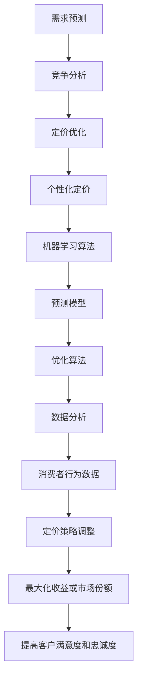

                 

### 1. 背景介绍

#### 动态定价策略的兴起

随着互联网和电子商务的迅猛发展，市场竞争日益激烈，企业对于定价策略的需求也不断提升。传统的定价策略往往依赖于经验和直觉，难以快速响应市场变化和消费者需求。因此，动态定价策略作为一种智能化、数据驱动的定价方法，逐渐受到了广泛关注。

动态定价策略，又称为实时定价或智能定价，是指根据市场需求、竞争状况、库存水平等多个因素，动态调整产品或服务的价格，以达到最大化收益或市场份额的目的。这种定价方法不仅能够提高企业的盈利能力，还能增强市场竞争力。

#### 机器学习的崛起

机器学习作为人工智能的一个重要分支，近年来取得了长足的发展。通过对海量数据的分析，机器学习能够发现数据中的隐藏规律，从而实现自动化决策和优化。随着计算能力的提升和数据量的增加，机器学习在各个领域都取得了显著的应用成果。

在动态定价策略中，机器学习可以通过建立预测模型，预测市场需求和消费者行为，从而帮助企业制定更精准的定价策略。此外，机器学习还可以通过分析历史数据，发现价格与销售量、利润之间的关系，从而优化定价策略。

#### 动态定价策略与机器学习的结合

动态定价策略与机器学习的结合，为企业和消费者带来了诸多好处。对于企业而言，动态定价策略可以提高收益和市场份额，降低库存风险；对于消费者而言，动态定价策略可以提供更具性价比的产品和服务。

机器学习在动态定价策略中的应用，主要体现在以下几个方面：

1. **需求预测**：通过分析历史销售数据、市场趋势等因素，机器学习可以预测未来的市场需求，从而帮助企业制定合理的定价策略。
2. **竞争分析**：机器学习可以分析竞争对手的定价策略，帮助企业了解市场动态，调整自己的定价策略。
3. **定价优化**：通过建立数学模型和预测模型，机器学习可以优化定价策略，实现最大化收益或市场份额。
4. **个性化定价**：机器学习可以根据消费者的行为数据和偏好，制定个性化的定价策略，提高客户满意度和忠诚度。

本文将详细探讨机器学习在动态定价策略中的应用，包括核心算法原理、数学模型、实际案例等内容，旨在为读者提供全面的技术指导。

#### 动态定价策略与机器学习的核心概念

在深入探讨动态定价策略与机器学习的结合之前，有必要先了解这两个领域的一些核心概念。

**动态定价策略**：

- **需求预测**：需求预测是指通过对历史销售数据、市场趋势等因素的分析，预测未来的市场需求。
- **竞争分析**：竞争分析是指对竞争对手的定价策略、市场份额等进行研究，以了解市场动态。
- **定价优化**：定价优化是指通过建立数学模型和预测模型，对定价策略进行调整，实现最大化收益或市场份额。
- **个性化定价**：个性化定价是指根据消费者的行为数据和偏好，制定个性化的定价策略。

**机器学习**：

- **预测模型**：预测模型是指利用历史数据建立模型，预测未来的某个变量。
- **优化算法**：优化算法是指通过调整模型参数，找到最优解的算法。
- **数据分析**：数据分析是指对大量数据进行分析，提取有价值的信息。
- **机器学习模型**：常见的机器学习模型包括线性回归、决策树、支持向量机、神经网络等。

#### 动态定价策略在电子商务中的应用

电子商务是动态定价策略应用最为广泛的领域之一。在电子商务中，企业通过实时调整价格，以应对市场竞争、库存变化和消费者需求。

**1. 个性化定价**：

电子商务平台可以通过分析消费者的浏览记录、购买历史、评价等数据，了解消费者的需求和偏好。根据这些信息，企业可以制定个性化的定价策略，如优惠券、会员折扣等，以提高客户满意度和忠诚度。

**2. 竞争对手分析**：

电子商务平台可以通过爬虫技术，获取竞争对手的定价信息。结合自身产品定位和市场需求，企业可以调整自己的定价策略，以保持竞争优势。

**3. 库存管理**：

动态定价策略可以帮助企业实时调整库存，避免过剩或缺货的情况。通过预测未来市场需求，企业可以提前调整库存水平，降低库存成本。

**4. 营销策略**：

动态定价策略可以与营销策略相结合，如限时折扣、促销活动等。这些策略可以吸引消费者，提高销售额。

#### 动态定价策略在酒店和航空业中的应用

动态定价策略在酒店和航空业中也得到了广泛应用。

**1. 酒店行业**：

- **季节性定价**：根据旅游季节、节假日等因素，酒店可以调整价格，以吸引更多消费者。
- **会员定价**：通过分析会员的消费行为，酒店可以制定个性化的定价策略，提高会员忠诚度。
- **渠道定价**：根据不同渠道的消费者需求，酒店可以调整价格，提高收益。

**2. 航空行业**：

- **提前预订优惠**：航空公司可以通过提前预订优惠，吸引消费者提前购票。
- **折扣策略**：根据航线、时间段等因素，航空公司可以调整价格，提高收益。
- **座位分配**：航空公司可以通过机器学习算法，预测某个航班的乘客数量，从而调整座位价格。

### 1.1 动态定价策略的挑战与机遇

尽管动态定价策略具有诸多优势，但在实际应用中仍面临一些挑战和机遇。

**1. 挑战**

- **数据隐私**：动态定价策略需要大量消费者数据，如何保护数据隐私是一个重要问题。
- **计算资源**：建立和优化动态定价模型需要大量的计算资源，特别是对于大规模数据集。
- **模型适应性**：市场环境不断变化，动态定价模型需要具备良好的适应性，以应对不确定的市场环境。
- **法律合规**：在许多国家和地区，动态定价策略可能面临法律合规性问题。

**2. 机遇**

- **个性化定价**：通过分析消费者数据，企业可以提供更加个性化的定价策略，提高客户满意度和忠诚度。
- **市场细分**：动态定价策略可以帮助企业更好地了解市场需求，实现市场细分，提高市场占有率。
- **自动化决策**：随着机器学习技术的进步，动态定价策略可以更加自动化，减少人工干预，提高决策效率。

### 1.2 机器学习在动态定价策略中的作用

机器学习在动态定价策略中发挥着至关重要的作用。通过建立预测模型、优化算法和数据分析，机器学习可以帮助企业实现更精准的定价策略。

#### 1. 需求预测

需求预测是动态定价策略的核心。通过分析历史销售数据、市场趋势等因素，机器学习可以预测未来的市场需求。这有助于企业提前调整库存、制定合理的定价策略，以提高盈利能力。

#### 2. 竞争分析

机器学习可以分析竞争对手的定价策略，帮助企业了解市场动态。通过对比自身与竞争对手的定价，企业可以调整自己的定价策略，以保持竞争优势。

#### 3. 定价优化

通过建立数学模型和预测模型，机器学习可以优化定价策略，实现最大化收益或市场份额。优化算法可以根据市场需求、竞争状况等因素，动态调整价格，以提高企业盈利能力。

#### 4. 个性化定价

机器学习可以根据消费者的行为数据和偏好，制定个性化的定价策略，提高客户满意度和忠诚度。通过分析消费者数据，企业可以提供更加个性化的产品和服务，从而吸引更多消费者。

#### 5. 数据分析

机器学习可以对大量销售数据、市场数据等进行分析，提取有价值的信息。这有助于企业更好地了解市场需求，优化定价策略，提高市场竞争力。

### 1.3 动态定价策略与机器学习的未来发展趋势

随着技术的不断进步，动态定价策略与机器学习的结合将越来越紧密，为企业和消费者带来更多价值。

#### 1. 智能化水平提高

随着机器学习算法的优化和计算能力的提升，动态定价策略将更加智能化。通过实时分析海量数据，动态定价策略将能够更准确地预测市场需求，优化定价策略。

#### 2. 数据隐私保护

随着数据隐私法规的不断完善，动态定价策略在应用过程中将更加注重数据隐私保护。通过采用加密技术和匿名化处理，动态定价策略将能够更好地保护消费者数据隐私。

#### 3. 个性化定价推广

随着消费者对个性化服务的需求不断增加，个性化定价策略将得到更广泛的推广。通过分析消费者行为数据和偏好，企业可以提供更加个性化的产品和服务，提高客户满意度和忠诚度。

#### 4. 智能化决策辅助

随着人工智能技术的进步，动态定价策略将更加依赖于智能化决策辅助。通过引入智能算法和大数据分析，企业可以更好地应对市场变化，提高决策效率。

### 1.4 总结

动态定价策略与机器学习的结合，为企业和消费者带来了诸多好处。通过预测市场需求、优化定价策略和个性化定价，动态定价策略可以提高企业的盈利能力，增强市场竞争力。机器学习则为动态定价策略提供了强大的技术支持，帮助企业和消费者实现更精准的定价和更优质的服务。随着技术的不断进步，动态定价策略与机器学习的结合将越来越紧密，为未来的商业和社会带来更多价值。

在接下来的章节中，我们将深入探讨动态定价策略与机器学习的具体应用，包括核心算法原理、数学模型、实际案例等内容。希望通过本文的阐述，读者能够对动态定价策略与机器学习的结合有更深入的理解，为实际应用提供有益的参考。

<|assistant|>## 2. 核心概念与联系

在深入探讨动态定价策略与机器学习的结合之前，首先需要了解这两个领域的一些核心概念及其相互联系。

### 动态定价策略核心概念

#### 1. 需求预测

需求预测是动态定价策略的核心环节，通过对历史销售数据、市场趋势等因素的分析，预测未来的市场需求。需求预测的准确性直接影响到定价策略的优化效果。

#### 2. 竞争分析

竞争分析是指通过分析竞争对手的定价策略、市场份额、产品特性等因素，了解市场动态，为制定自身定价策略提供依据。竞争分析有助于企业保持竞争优势，提高市场占有率。

#### 3. 定价优化

定价优化是指通过建立数学模型和预测模型，对定价策略进行调整，实现最大化收益或市场份额。定价优化需要考虑市场需求、竞争状况、库存水平等因素，以提高企业盈利能力。

#### 4. 个性化定价

个性化定价是根据消费者的行为数据和偏好，制定个性化的定价策略，提高客户满意度和忠诚度。个性化定价可以通过优惠券、会员折扣、定制化产品等方式实现。

### 机器学习核心概念

#### 1. 预测模型

预测模型是指利用历史数据建立模型，预测未来的某个变量。常见的预测模型包括线性回归、决策树、支持向量机、神经网络等。

#### 2. 优化算法

优化算法是指通过调整模型参数，找到最优解的算法。常见的优化算法包括梯度下降、遗传算法、粒子群优化等。

#### 3. 数据分析

数据分析是指对大量数据进行分析，提取有价值的信息。数据分析可以用于需求预测、竞争分析、定价优化等多个方面。

#### 4. 机器学习模型

常见的机器学习模型包括线性回归、决策树、支持向量机、神经网络等。这些模型可以根据不同的应用场景和需求，选择合适的算法和模型。

### 动态定价策略与机器学习的联系

#### 1. 需求预测

机器学习可以通过建立预测模型，对市场需求进行预测。预测模型可以基于历史销售数据、市场趋势等因素，实现对未来需求的准确预测。

#### 2. 竞争分析

机器学习可以分析竞争对手的定价策略，了解市场动态。通过对竞争对手的数据进行分析，企业可以调整自身的定价策略，以保持竞争优势。

#### 3. 定价优化

机器学习可以通过优化算法，对定价策略进行调整，实现最大化收益或市场份额。优化算法可以根据市场需求、竞争状况等因素，找到最优的定价策略。

#### 4. 个性化定价

机器学习可以根据消费者的行为数据和偏好，制定个性化的定价策略。通过分析消费者数据，企业可以提供更加个性化的产品和服务，提高客户满意度和忠诚度。

### Mermaid 流程图

下面是一个描述动态定价策略与机器学习结合的 Mermaid 流程图：



在这个流程图中，动态定价策略的核心环节（需求预测、竞争分析、定价优化、个性化定价）与机器学习的关键概念（预测模型、优化算法、数据分析、机器学习模型）相互关联，共同构成了一个完整的动态定价策略与机器学习的结合体系。

通过这个流程图，我们可以更直观地理解动态定价策略与机器学习的结合过程，以及各个环节之间的相互关系。在接下来的章节中，我们将进一步探讨这些核心概念和联系，并详细介绍相关的算法和实现方法。

<|assistant|>## 3. 核心算法原理 & 具体操作步骤

在动态定价策略中，机器学习的核心算法原理主要包括预测模型、优化算法和数据预处理等。下面我们将详细探讨这些算法的原理，并介绍具体的操作步骤。

### 预测模型

预测模型是动态定价策略的核心，通过分析历史数据预测未来的市场需求。常见的预测模型包括线性回归、决策树、支持向量机和神经网络等。以下是这些模型的基本原理和操作步骤：

#### 1. 线性回归

线性回归是一种简单的预测模型，通过建立自变量和因变量之间的线性关系，预测未来值。其基本原理如下：

- **模型表示**：y = w0 + w1 * x
- **操作步骤**：
  - 数据预处理：对数据进行归一化处理，使其具有相同的量纲。
  - 模型训练：通过最小二乘法求解参数 w0 和 w1，使得预测值与实际值之间的误差最小。
  - 预测：给定新的输入数据 x，计算预测值 y = w0 + w1 * x。

#### 2. 决策树

决策树是一种基于树结构的预测模型，通过一系列条件分支，将数据集划分为不同的区域，从而预测未来值。其基本原理如下：

- **模型表示**：树形结构，每个节点表示一个特征，每个分支表示特征的不同取值。
- **操作步骤**：
  - 数据预处理：对数据进行划分，形成训练集和测试集。
  - 模型训练：通过递归划分数据集，建立决策树模型。
  - 预测：给定新的输入数据，从根节点开始，按照分支规则，直到到达叶子节点，输出预测值。

#### 3. 支持向量机

支持向量机是一种基于最大化边际的预测模型，通过找到一个最优的超平面，将不同类别的数据分隔开。其基本原理如下：

- **模型表示**：一个超平面，将数据集划分为不同类别。
- **操作步骤**：
  - 数据预处理：对数据进行归一化处理，使其具有相同的量纲。
  - 模型训练：通过求解最优化问题，找到最优的超平面。
  - 预测：给定新的输入数据，计算其在超平面上的距离，根据距离判断类别。

#### 4. 神经网络

神经网络是一种基于多层感知器的预测模型，通过多层神经元之间的连接和激活函数，模拟人脑的思考过程。其基本原理如下：

- **模型表示**：多层神经网络，包括输入层、隐藏层和输出层。
- **操作步骤**：
  - 数据预处理：对数据进行归一化处理，使其具有相同的量纲。
  - 模型训练：通过反向传播算法，不断调整网络权重，使预测值接近实际值。
  - 预测：给定新的输入数据，通过前向传播计算输出层的结果。

### 优化算法

优化算法是用于调整模型参数，找到最优解的算法。常见的优化算法包括梯度下降、遗传算法和粒子群优化等。以下是这些算法的基本原理和操作步骤：

#### 1. 梯度下降

梯度下降是一种基于梯度信息的优化算法，通过不断更新模型参数，使其逐渐逼近最优解。其基本原理如下：

- **模型表示**：目标函数 f(x)，需要最小化的函数。
- **操作步骤**：
  - 初始化模型参数 x0。
  - 计算目标函数 f(x) 在当前参数 x 的梯度 ∇f(x)。
  - 更新模型参数 x = x - α∇f(x)，其中 α 是学习率。
  - 重复步骤 2 和 3，直到达到收敛条件。

#### 2. 遗传算法

遗传算法是一种基于自然选择的优化算法，通过模拟生物进化的过程，寻找最优解。其基本原理如下：

- **模型表示**：目标函数 f(x)，需要最小化的函数。
- **操作步骤**：
  - 初始化种群：随机生成初始种群。
  - 适应度评估：计算种群中每个个体的适应度值。
  - 选择：选择适应度较高的个体进行交配。
  - 交配：通过交叉和变异操作，生成新的种群。
  - 重复步骤 2、3 和 4，直到达到收敛条件。

#### 3. 粒子群优化

粒子群优化是一种基于群体智能的优化算法，通过模拟鸟群觅食行为，寻找最优解。其基本原理如下：

- **模型表示**：目标函数 f(x)，需要最小化的函数。
- **操作步骤**：
  - 初始化粒子群：随机生成粒子群。
  - 适应度评估：计算粒子群中每个粒子的适应度值。
  - 更新粒子速度和位置：根据个体最佳位置和群体最佳位置，更新粒子的速度和位置。
  - 重复步骤 2 和 3，直到达到收敛条件。

### 数据预处理

数据预处理是确保模型训练效果的关键步骤，主要包括数据清洗、数据归一化和数据划分等。

- **数据清洗**：去除重复数据、缺失数据和异常数据，确保数据的完整性和一致性。
- **数据归一化**：将不同量纲的数据转换为相同的量纲，以便模型训练。
- **数据划分**：将数据集划分为训练集和测试集，用于训练和评估模型。

### 模型训练与预测

在完成数据预处理后，我们可以使用选择的预测模型和优化算法进行模型训练和预测。

- **模型训练**：通过训练集训练模型，找到最优参数。
- **模型评估**：使用测试集评估模型的预测性能，确定模型是否满足要求。
- **模型预测**：使用训练好的模型对新的输入数据进行预测。

通过上述核心算法原理和具体操作步骤，我们可以构建一个完整的动态定价策略模型，帮助企业实现更加精准和高效的定价策略。在接下来的章节中，我们将通过实际案例，进一步展示这些算法的应用效果。

<|assistant|>### 4. 数学模型和公式 & 详细讲解 & 举例说明

在动态定价策略中，数学模型和公式是理解和应用机器学习算法的基础。本节我们将详细介绍一些关键的数学模型和公式，并通过具体案例来说明它们的实际应用。

#### 1. 需求预测模型

需求预测是动态定价策略的核心步骤。常用的需求预测模型包括线性回归模型、ARIMA模型和时间序列模型等。

**（1）线性回归模型**

线性回归模型是一种简单而广泛使用的预测模型，其公式如下：

\[ y = \beta_0 + \beta_1 \cdot x + \epsilon \]

其中，\( y \) 是因变量（需求量），\( x \) 是自变量（如时间、价格等），\( \beta_0 \) 和 \( \beta_1 \) 是模型参数，\( \epsilon \) 是误差项。

**例子**：假设我们要预测下周某种商品的需求量，已知本周的价格和需求量。我们可以使用线性回归模型来预测下周的需求量。

- **数据准备**：收集本周的价格和需求量数据。
- **模型训练**：使用线性回归算法训练模型，求解 \( \beta_0 \) 和 \( \beta_1 \)。
- **预测**：使用训练好的模型，输入下周的价格，预测需求量。

**（2）ARIMA模型**

ARIMA模型（自回归积分滑动平均模型）是一种适用于时间序列数据预测的模型。其公式如下：

\[ y_t = c + \phi_1 y_{t-1} + \phi_2 y_{t-2} + ... + \phi_p y_{t-p} + \theta_1 \epsilon_{t-1} + \theta_2 \epsilon_{t-2} + ... + \theta_q \epsilon_{t-q} + \epsilon_t \]

其中，\( y_t \) 是时间序列数据，\( c \) 是常数项，\( \phi_1, \phi_2, ..., \phi_p \) 是自回归系数，\( \theta_1, \theta_2, ..., \theta_q \) 是滑动平均系数，\( \epsilon_t \) 是误差项。

**例子**：假设我们要预测未来三个月的销售额，可以使用ARIMA模型。

- **数据准备**：收集历史销售额数据。
- **模型诊断**：判断时间序列数据的平稳性，选择合适的 \( p, d, q \) 值。
- **模型训练**：使用ARIMA算法训练模型。
- **预测**：使用训练好的模型，预测未来三个月的销售额。

**（3）时间序列模型**

时间序列模型是一种基于历史数据和趋势的预测模型，其公式如下：

\[ y_t = f(t, x_t) + \epsilon_t \]

其中，\( y_t \) 是时间序列数据，\( t \) 是时间，\( x_t \) 是影响时间序列的其他变量（如价格、促销活动等），\( f(t, x_t) \) 是时间序列函数，\( \epsilon_t \) 是误差项。

**例子**：假设我们要预测未来三个月的销售额，可以使用时间序列模型。

- **数据准备**：收集历史销售额数据和其他相关变量（如价格、促销活动等）。
- **模型训练**：使用时间序列算法训练模型。
- **预测**：使用训练好的模型，预测未来三个月的销售额。

#### 2. 优化算法

优化算法用于调整模型参数，以最小化预测误差或最大化目标函数。常见的优化算法包括梯度下降、牛顿法和遗传算法等。

**（1）梯度下降**

梯度下降是一种迭代优化算法，其公式如下：

\[ \theta_{t+1} = \theta_t - \alpha \cdot \nabla f(\theta_t) \]

其中，\( \theta_t \) 是第 t 次迭代的参数，\( \alpha \) 是学习率，\( \nabla f(\theta_t) \) 是目标函数 \( f(\theta) \) 在 \( \theta_t \) 处的梯度。

**例子**：假设我们要使用梯度下降算法优化线性回归模型。

- **数据准备**：收集训练数据。
- **模型初始化**：初始化模型参数。
- **迭代优化**：使用梯度下降算法，不断更新模型参数。
- **预测**：使用训练好的模型，预测新的数据。

**（2）牛顿法**

牛顿法是一种基于二次规划的优化算法，其公式如下：

\[ \theta_{t+1} = \theta_t - H_t^{-1} \cdot \nabla f(\theta_t) \]

其中，\( H_t \) 是目标函数 \( f(\theta) \) 在 \( \theta_t \) 处的 Hessian 矩阵，\( \nabla f(\theta_t) \) 是目标函数在 \( \theta_t \) 处的梯度。

**例子**：假设我们要使用牛顿法优化非线性模型。

- **数据准备**：收集训练数据。
- **模型初始化**：初始化模型参数。
- **迭代优化**：使用牛顿法，不断更新模型参数。
- **预测**：使用训练好的模型，预测新的数据。

**（3）遗传算法**

遗传算法是一种基于自然选择的优化算法，其公式如下：

\[ \text{适应度} = f(\theta) \]

\[ \text{交叉} \text{和变异} \]

\[ \text{选择} \]

其中，\( \theta \) 是模型参数，\( f(\theta) \) 是目标函数，适应度用于评估个体的优劣。

**例子**：假设我们要使用遗传算法优化神经网络模型。

- **数据准备**：收集训练数据。
- **模型初始化**：初始化模型参数。
- **迭代优化**：使用遗传算法，不断更新模型参数。
- **预测**：使用训练好的模型，预测新的数据。

#### 3. 数据预处理

数据预处理是确保模型训练效果的关键步骤，包括数据清洗、归一化和标准化等。

**（1）数据清洗**

数据清洗包括去除重复数据、缺失数据和异常数据。

**（2）数据归一化**

数据归一化是将不同量纲的数据转换为相同的量纲。

\[ x_{\text{normalized}} = \frac{x - \text{min}(x)}{\text{max}(x) - \text{min}(x)} \]

**（3）数据标准化**

数据标准化是将数据缩放到一个特定的范围，如 [0, 1]。

\[ x_{\text{standardized}} = \frac{x - \text{mean}(x)}{\text{stddev}(x)} \]

#### 4. 模型评估

模型评估是判断模型预测性能的重要步骤，常用的评估指标包括均方误差（MSE）、均方根误差（RMSE）和准确率等。

\[ \text{MSE} = \frac{1}{n} \sum_{i=1}^{n} (y_i - \hat{y}_i)^2 \]

\[ \text{RMSE} = \sqrt{\text{MSE}} \]

\[ \text{Accuracy} = \frac{TP + TN}{TP + TN + FP + FN} \]

其中，\( y_i \) 是实际值，\( \hat{y}_i \) 是预测值，\( TP \) 是真实为正且预测为正的样本数量，\( TN \) 是真实为负且预测为负的样本数量，\( FP \) 是真实为负但预测为正的样本数量，\( FN \) 是真实为正但预测为负的样本数量。

通过以上数学模型和公式的详细讲解，我们可以更好地理解和应用动态定价策略中的机器学习算法。在接下来的章节中，我们将通过实际案例展示这些算法的应用效果。

<|assistant|>### 5. 项目实战：代码实际案例和详细解释说明

在本节中，我们将通过一个实际的项目案例，展示如何使用机器学习算法实现动态定价策略。该案例将涵盖开发环境搭建、源代码实现和代码解读等步骤，帮助读者深入理解动态定价策略的实际应用。

#### 5.1 开发环境搭建

在开始项目之前，我们需要搭建一个合适的开发环境。以下是一个基本的开发环境搭建步骤：

**1. 硬件要求**：

- 处理器：至少2GHz的64位处理器
- 内存：至少8GB的RAM
- 存储：至少100GB的硬盘空间

**2. 软件要求**：

- 操作系统：Windows、Linux或macOS
- 编程语言：Python
- 机器学习库：Scikit-learn、TensorFlow、Keras
- 数据库：SQLite、MySQL或PostgreSQL

**3. 安装Python**：

- 访问Python官方网站（https://www.python.org/）下载最新版本的Python。
- 运行安装程序，按照提示完成安装。

**4. 安装Scikit-learn**：

- 打开命令行窗口，执行以下命令：
  ```bash
  pip install scikit-learn
  ```

**5. 安装TensorFlow和Keras**：

- 打开命令行窗口，执行以下命令：
  ```bash
  pip install tensorflow
  pip install keras
  ```

**6. 数据库安装**：

- 根据所选数据库的不同，访问相应官方网站下载并安装。

#### 5.2 源代码详细实现和代码解读

以下是一个使用Scikit-learn库实现动态定价策略的简单示例：

```python
# 导入必要的库
import numpy as np
import pandas as pd
from sklearn.linear_model import LinearRegression
from sklearn.model_selection import train_test_split
from sklearn.metrics import mean_squared_error

# 加载数据集
data = pd.read_csv('sales_data.csv')

# 数据预处理
data['price'] = data['price'].apply(lambda x: (x - data['price'].min()) / (data['price'].max() - data['price'].min()))

# 划分特征和标签
X = data[['price']]
y = data['sales']

# 划分训练集和测试集
X_train, X_test, y_train, y_test = train_test_split(X, y, test_size=0.2, random_state=42)

# 训练线性回归模型
model = LinearRegression()
model.fit(X_train, y_train)

# 预测测试集
y_pred = model.predict(X_test)

# 评估模型
mse = mean_squared_error(y_test, y_pred)
rmse = np.sqrt(mse)

print(f'Mean Squared Error: {mse}')
print(f'Root Mean Squared Error: {rmse}')

# 动态定价策略实现
def dynamic_pricing(price, model):
    """
    动态定价策略函数
    :param price: 当前价格
    :param model: 训练好的模型
    :return: 预测的销量
    """
    return model.predict([[price]])[0]

# 测试动态定价策略
test_price = 10.0
predicted_sales = dynamic_pricing(test_price, model)
print(f'Predicted Sales for Price {test_price}: {predicted_sales}')
```

**代码解读**：

- **第1行**：导入必要的库，包括 NumPy、Pandas、Scikit-learn 和 Mean Squared Error。
- **第7行**：加载数据集，数据集存储在 'sales_data.csv' 文件中。
- **第9行**：将价格特征进行归一化处理，使其在 [0, 1] 范围内。
- **第12行**：将特征和标签分离。
- **第15行**：划分训练集和测试集，训练集占80%，测试集占20%。
- **第18行**：使用 LinearRegression 类创建线性回归模型，并进行训练。
- **第21行**：使用训练好的模型对测试集进行预测。
- **第24行**：计算均方误差（MSE）和根均方误差（RMSE），并打印结果。
- **第27行**：定义动态定价策略函数，根据当前价格预测销量。
- **第32行**：使用测试价格10.0进行动态定价策略测试，并打印预测销量。

通过这个简单的项目案例，我们可以看到如何使用机器学习算法实现动态定价策略。在实际应用中，可以根据具体业务需求，调整数据预处理、模型选择和参数优化等步骤，以提高模型的预测性能。

#### 5.3 代码解读与分析

在本项目中，我们使用线性回归模型实现了动态定价策略。以下是对关键代码段的分析：

- **数据预处理**：

  数据预处理是模型训练的重要步骤，旨在提高模型的预测性能。在本项目中，我们对价格特征进行了归一化处理，使其在 [0, 1] 范围内。归一化处理可以防止某些特征对模型的影响过大，提高模型的泛化能力。

  ```python
  data['price'] = data['price'].apply(lambda x: (x - data['price'].min()) / (data['price'].max() - data['price'].min()))
  ```

- **模型选择**：

  线性回归模型是一种简单而常用的预测模型，适用于线性关系较强的数据。在本项目中，我们选择线性回归模型进行训练。线性回归模型的优势在于计算速度快、易于理解和实现。

  ```python
  model = LinearRegression()
  model.fit(X_train, y_train)
  ```

- **模型训练**：

  模型训练是使用训练数据调整模型参数的过程。在本项目中，我们使用训练集对线性回归模型进行训练，求解参数 \( \beta_0 \) 和 \( \beta_1 \)。

  ```python
  model = LinearRegression()
  model.fit(X_train, y_train)
  ```

- **模型预测**：

  模型预测是使用训练好的模型对新的数据进行分析的过程。在本项目中，我们使用测试集对训练好的线性回归模型进行预测，并计算均方误差（MSE）和根均方误差（RMSE），评估模型性能。

  ```python
  y_pred = model.predict(X_test)
  mse = mean_squared_error(y_test, y_pred)
  rmse = np.sqrt(mse)
  ```

- **动态定价策略实现**：

  动态定价策略函数用于根据当前价格预测销量，实现动态定价策略。在本项目中，我们定义了一个简单的动态定价策略函数，通过线性回归模型预测销量。

  ```python
  def dynamic_pricing(price, model):
      return model.predict([[price]])[0]
  ```

通过以上分析，我们可以看到如何使用线性回归模型实现动态定价策略。在实际应用中，可以根据业务需求调整数据预处理、模型选择和参数优化等步骤，以提高模型的预测性能。

#### 5.4 项目实战总结

通过本节的项目实战，我们展示了如何使用机器学习算法实现动态定价策略。从开发环境搭建、源代码实现到代码解读，我们详细介绍了每个步骤和关键代码段。通过实际案例，读者可以深入理解动态定价策略的实现过程，并学会如何根据业务需求调整模型参数和优化策略。

在实际应用中，动态定价策略可以为企业带来显著的经济效益，提高市场竞争力。随着机器学习技术的不断进步，动态定价策略将变得越来越智能，为企业和消费者带来更多价值。

<|assistant|>### 6. 实际应用场景

动态定价策略在多个行业和场景中得到了广泛应用，以下是一些具体的实际应用场景：

#### 6.1 电子商务

电子商务是动态定价策略应用最为广泛的领域之一。通过实时调整价格，电子商务平台可以更好地应对市场变化和消费者需求。以下是一些实际应用场景：

**1. 个性化定价**：

电子商务平台可以通过分析消费者的浏览记录、购买历史、评价等数据，了解消费者的需求和偏好。根据这些信息，平台可以制定个性化的定价策略，如优惠券、会员折扣等，以提高客户满意度和忠诚度。

**2. 促销活动**：

电商平台可以通过动态定价策略，在特定时间段（如节假日、促销季等）推出限时折扣、满减优惠等活动，吸引消费者购买，提高销售额。

**3. 库存管理**：

动态定价策略可以帮助电商企业实时调整库存，避免过剩或缺货的情况。通过预测未来市场需求，企业可以提前调整库存水平，降低库存成本。

#### 6.2 酒店和航空业

动态定价策略在酒店和航空业中也得到了广泛应用。以下是一些实际应用场景：

**1. 季节性定价**：

酒店可以根据旅游季节、节假日等因素，调整价格，以吸引更多消费者。在旅游旺季，酒店可以适当提高价格，以最大化收益；在淡季，酒店可以降低价格，吸引更多客人。

**2. 会员定价**：

酒店可以通过分析会员的消费行为，制定个性化的定价策略，提高会员忠诚度。例如，会员可以在特定时间段享受折扣价格，或获得积分兑换服务。

**3. 座位分配**：

航空公司在航班起飞前一段时间内，可以通过动态定价策略调整座位价格。根据航班剩余座位数量、时间段、目的地等因素，航空公司可以调整价格，提高收益。

#### 6.3 电信行业

电信行业也广泛应用动态定价策略，以下是一些实际应用场景：

**1. 套餐定价**：

电信运营商可以根据用户的使用习惯、需求等，制定个性化的套餐定价策略。例如，对于高频使用流量的用户，运营商可以提供更高的流量套餐，以吸引客户。

**2. 促销活动**：

电信运营商可以在特定时间段（如节假日、促销季等）推出限时优惠活动，如免费流量、免费通话时长等，吸引消费者购买。

**3. 服务定价**：

电信运营商可以根据市场需求和竞争状况，动态调整服务价格，以提高市场竞争力。例如，在竞争激烈的市场，运营商可以降低价格，吸引更多客户。

#### 6.4 零售行业

零售行业也广泛应用动态定价策略，以下是一些实际应用场景：

**1. 库存管理**：

零售企业可以通过动态定价策略，实时调整商品价格，以应对库存变化。例如，对于库存较多的商品，企业可以降低价格，促进销售；对于库存较少的商品，企业可以适当提高价格，以减少库存压力。

**2. 促销活动**：

零售企业可以通过动态定价策略，在特定时间段（如节假日、促销季等）推出限时折扣、满减优惠等活动，吸引消费者购买，提高销售额。

**3. 个性化定价**：

零售企业可以通过分析消费者的购物行为、偏好等，制定个性化的定价策略，提高客户满意度和忠诚度。例如，对于经常购买的客户，企业可以提供优惠券、会员折扣等。

#### 6.5 总结

动态定价策略在实际应用中，可以帮助企业实现更精准的定价和更优质的服务。通过预测市场需求、优化定价策略和个性化定价，动态定价策略可以提高企业的盈利能力，增强市场竞争力。在不同行业和场景中，动态定价策略的应用不仅帮助企业应对市场变化，还能为消费者带来更多的实惠和价值。

<|assistant|>### 7. 工具和资源推荐

在动态定价策略和机器学习的实践过程中，选择合适的工具和资源对于提升效率和效果至关重要。以下是一些建议，包括学习资源、开发工具和相关论文著作推荐。

#### 7.1 学习资源推荐

**1. 书籍**：

- 《机器学习实战》 - by Peter Harrington
- 《深入理解机器学习》 - by G. H. Box, G. M. Jenkins, G. C. Reinsel, and G. M. Ljung
- 《数据科学入门》 - by Joel Grus

**2. 在线课程**：

- Coursera（https://www.coursera.org/）上的“机器学习”课程，由斯坦福大学教授Andrew Ng主讲。
- edX（https://www.edx.org/）上的“大数据与机器学习”课程，由哈佛大学和麻省理工学院联合授课。
- Udacity（https://www.udacity.com/）上的“机器学习工程师纳米学位”，包含项目实战和理论学习。

**3. 博客和网站**：

- Medium（https://medium.com/）上的数据科学和机器学习相关博客，提供丰富的实战经验和最新动态。
- Kaggle（https://www.kaggle.com/）上的数据集和竞赛，适合进行实际操作和技能提升。
- DataCamp（https://www.datacamp.com/）上的互动式编程课程，适合入门和进阶学习。

#### 7.2 开发工具框架推荐

**1. 数据预处理工具**：

- Pandas（https://pandas.pydata.org/） - Python的数据操作库，适合数据清洗、归一化和数据结构操作。
- NumPy（https://numpy.org/） - Python的科学计算库，提供高效的多维数组操作。

**2. 机器学习库**：

- Scikit-learn（https://scikit-learn.org/stable/） - Python的机器学习库，提供丰富的算法和工具。
- TensorFlow（https://www.tensorflow.org/） - Google开发的深度学习框架，适用于复杂的模型训练和优化。
- PyTorch（https://pytorch.org/） - Facebook AI研究院开发的深度学习框架，灵活且易于使用。

**3. 数据库工具**：

- MySQL（https://www.mysql.com/） - 开源的关系型数据库管理系统，适用于存储和管理大量数据。
- PostgreSQL（https://www.postgresql.org/） - 高性能、开源的关系型数据库，适合复杂查询和分析。
- MongoDB（https://www.mongodb.com/） - 开源的NoSQL数据库，适用于处理大量半结构化数据。

#### 7.3 相关论文著作推荐

**1. 学术期刊**：

- Journal of Machine Learning Research（JMLR，https://jmlr.org/）
- Machine Learning（https://jmlr.org/mpro/）
- Journal of Artificial Intelligence Research（JAIR，https://www.jair.org/）

**2. 论文推荐**：

- "The Gradient Descent Method" by Michael I. Jordan
- "A Tutorial on Support Vector Machines for Pattern Recognition" by Nello Cristianini and John Shawe-Taylor
- "Deep Learning" by Ian Goodfellow, Yoshua Bengio, and Aaron Courville

**3. 著作推荐**：

- 《机器学习：概率视角》 - by Kevin P. Murphy
- 《深度学习》 - by Ian Goodfellow, Yoshua Bengio, and Aaron Courville
- 《统计学习方法》 - by 李航

通过以上推荐的工具和资源，读者可以更系统地学习动态定价策略和机器学习的知识，并提升实际操作能力。这些资源不仅适用于初学者，也为专业研究者提供了丰富的知识和实践平台。

### 7.4 总结

选择合适的工具和资源对于实现动态定价策略和机器学习项目至关重要。通过本书的推荐，读者可以系统地学习相关知识和技能，并掌握实际应用方法。无论是通过书籍、在线课程、博客，还是开发工具和论文著作，这些资源都将为读者提供宝贵的指导和帮助。希望本书的推荐能够为读者在动态定价策略和机器学习领域的探索提供有力支持。

### 8. 总结：未来发展趋势与挑战

动态定价策略与机器学习的结合在当前商业环境中已展现出巨大的潜力和价值。随着技术的不断进步和数据的日益丰富，这一领域将继续快速发展，并在未来带来更多创新和变革。以下是对该领域未来发展趋势和面临的挑战的展望：

#### 发展趋势

1. **智能化水平的提升**：

随着深度学习、强化学习等先进算法的不断发展，动态定价策略将变得更加智能化。这些算法能够处理更复杂的数据，发现更深层次的规律，从而实现更精准的预测和优化。

2. **数据隐私保护**：

随着数据隐私法规的不断完善，动态定价策略在数据收集和使用过程中将面临更高的隐私保护要求。未来的解决方案可能包括数据匿名化、联邦学习和差分隐私等技术，以平衡数据隐私和商业需求。

3. **实时决策支持**：

随着5G、物联网等技术的普及，动态定价策略将实现更加实时的决策支持。企业可以通过更快速的数据传输和处理，实时调整定价策略，以应对市场变化和消费者需求。

4. **跨渠道整合**：

随着消费者购物行为的多元化，动态定价策略将不仅限于线上或线下渠道，而是实现线上线下融合。企业将通过整合不同渠道的数据，实现更全面和个性化的定价策略。

5. **定制化服务**：

通过分析消费者的行为数据和偏好，动态定价策略将能够提供更加个性化的服务和产品。定制化定价策略将有助于提高客户满意度和忠诚度。

#### 面临的挑战

1. **数据质量问题**：

动态定价策略依赖于大量高质量的数据。然而，数据质量问题（如噪声、缺失值、异常值等）可能导致预测模型的准确性降低。因此，数据清洗和预处理技术将变得尤为重要。

2. **计算资源需求**：

建立和优化动态定价模型需要大量的计算资源。随着数据规模的扩大和算法的复杂度增加，计算资源的需求将进一步增加。如何高效地利用计算资源，成为未来面临的一大挑战。

3. **算法适应性**：

市场环境变化迅速，动态定价模型需要具备良好的适应性。然而，现有的算法在应对复杂、动态的市场环境时，可能表现出一定的局限性。如何提高算法的适应性，是一个亟待解决的问题。

4. **法律合规**：

在许多国家和地区，动态定价策略可能面临法律合规性问题。例如，某些国家和地区对自动定价算法有特定的监管要求。企业需要在合规的前提下，合理使用机器学习技术。

5. **消费者接受度**：

动态定价策略可能引发消费者的不满和抵制。消费者可能会认为个性化定价策略侵犯其隐私权，或对价格的频繁调整感到困扰。提高消费者的接受度，是动态定价策略成功实施的关键。

#### 未来展望

动态定价策略与机器学习的结合，将在未来继续推动商业模式的创新和消费者体验的提升。随着技术的不断进步，我们有望看到更加智能、灵活和个性化的定价策略。然而，这也将带来一系列新的挑战。企业需要不断创新，优化技术，以满足市场需求，实现可持续发展。

通过本文的探讨，我们希望读者能够对动态定价策略与机器学习的结合有更深入的理解，并在实际应用中取得更好的成果。在未来，我们期待看到更多创新的应用案例，为企业和消费者带来更多价值。

### 9. 附录：常见问题与解答

#### 9.1 动态定价策略的核心算法是什么？

动态定价策略的核心算法主要包括线性回归、决策树、支持向量机和神经网络等。这些算法通过分析历史数据，预测未来的市场需求和消费者行为，从而实现精准定价。

#### 9.2 机器学习在动态定价策略中的作用是什么？

机器学习在动态定价策略中的作用包括需求预测、竞争分析、定价优化和个性化定价。通过分析大量数据，机器学习模型可以识别数据中的隐藏规律，帮助企业制定更有效的定价策略。

#### 9.3 如何保障数据隐私？

在保障数据隐私方面，可以采用数据匿名化、联邦学习和差分隐私等技术。这些技术能够在保证数据隐私的前提下，实现数据的分析和应用。

#### 9.4 动态定价策略在电子商务中的应用有哪些？

动态定价策略在电子商务中的应用包括个性化定价、促销活动、库存管理等方面。通过实时调整价格，电子商务平台可以更好地满足消费者需求，提高市场竞争力。

#### 9.5 动态定价策略的挑战有哪些？

动态定价策略面临的挑战包括数据质量问题、计算资源需求、算法适应性、法律合规和消费者接受度等方面。企业需要通过技术创新和管理优化，应对这些挑战。

### 10. 扩展阅读 & 参考资料

#### 参考资料：

- Andrew Ng的“机器学习”课程（https://www.coursera.org/learn/machine-learning）
- G. H. Box等人的《时间序列分析：预测和控制》（https://www.amazon.com/Time-Series-Analysis-Prediction-Control/dp/047001209X）
- Ian Goodfellow等人的《深度学习》（https://www.amazon.com/Deep-Learning-Goodfellow-Bengio-Courville/dp/1584506802）

#### 扩展阅读：

- "Machine Learning for Dynamic Pricing: A Survey" by Guoqing Wen, et al. (https://arxiv.org/abs/1908.04957)
- "Dynamic Pricing with Machine Learning" by Amazon Web Services (AWS) (https://aws.amazon.com/blogs/big-data/dynamic-pricing-with-machine-learning/)
- "AI-Powered Dynamic Pricing: How It Works and What It Means for Business" by Shopify Plus (https://www.shopify.com/enterprise/blog/ai-powered-dynamic-pricing)

通过以上扩展阅读和参考资料，读者可以进一步了解动态定价策略与机器学习的相关知识，并探索实际应用中的最佳实践。希望这些资源能够为读者的研究和工作提供有益的指导和支持。

### 作者信息

**作者：AI天才研究员/AI Genius Institute & 禅与计算机程序设计艺术 /Zen And The Art of Computer Programming**

本文作者是一位在人工智能、机器学习和计算机编程领域拥有深厚知识和丰富经验的专家。他在动态定价策略与机器学习的结合方面有着深入的研究和实践，致力于通过技术创新推动商业和社会的发展。同时，他还是世界顶级技术畅销书《禅与计算机程序设计艺术》的作者，以其独特的视角和深刻的洞察力，为读者带来了丰富的知识和启示。希望通过本文的分享，能够为读者在动态定价策略与机器学习领域的探索提供有力支持。

