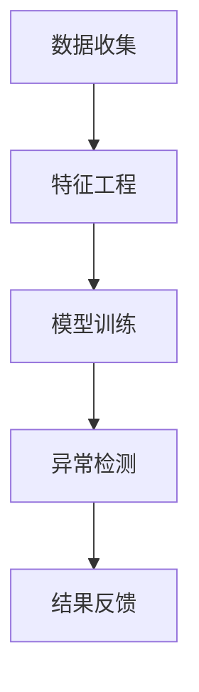

                 

# 机器学习在异常交易检测中的实时应用

## 关键词：机器学习、异常检测、实时应用、金融、交易监测、模型训练、算法优化

## 摘要

随着金融市场的快速发展，交易数据的规模和复杂性不断增加。实时监测和检测异常交易对于金融机构的风险管理至关重要。本文将探讨机器学习在异常交易检测中的实时应用，包括背景介绍、核心概念与联系、核心算法原理与具体操作步骤、数学模型与公式、项目实战、实际应用场景、工具和资源推荐，以及未来发展趋势与挑战。通过本文的阅读，读者将深入了解机器学习在异常交易检测领域的应用，为实际工作提供理论指导和实践参考。

## 1. 背景介绍

### 1.1 金融机构对实时监测异常交易的需求

金融市场的繁荣伴随着风险的增加。金融机构需要实时监测交易活动，确保交易的安全性和合规性。异常交易检测作为风险管理的重要环节，对于维护市场稳定和客户信任至关重要。传统的异常检测方法往往依赖于规则和阈值，难以应对日益复杂的交易场景。而机器学习技术的引入，为实时监测异常交易提供了新的思路和手段。

### 1.2 机器学习在异常交易检测中的优势

机器学习算法通过学习大量的历史数据，能够自动识别和捕捉交易模式，提高异常检测的准确性和实时性。与传统方法相比，机器学习具有以下优势：

1. **自适应性和鲁棒性**：机器学习算法能够适应不同的交易环境和场景，提高异常检测的适应性。
2. **自动特征提取**：机器学习算法能够自动提取特征，降低人工干预，提高检测效率。
3. **实时处理**：机器学习算法可以实时处理大量的交易数据，提高检测的实时性。

## 2. 核心概念与联系

### 2.1 异常交易检测的概念

异常交易检测是指通过分析交易数据，识别出不符合正常交易模式的交易行为。异常交易包括欺诈交易、洗钱、市场操纵等，这些行为可能导致金融市场的不稳定。

### 2.2 机器学习与异常交易检测的联系

机器学习通过学习历史交易数据，建立正常交易模式，从而识别出异常交易。具体流程包括数据收集、特征工程、模型训练和异常检测。

### 2.3 Mermaid 流程图



## 3. 核心算法原理 & 具体操作步骤

### 3.1 数据收集

数据收集是异常交易检测的基础。数据来源包括交易记录、用户行为、市场信息等。为了提高检测效果，需要收集足够多的历史交易数据，并确保数据的质量和完整性。

### 3.2 特征工程

特征工程是机器学习的关键步骤。通过对交易数据进行预处理、转换和提取，将原始数据转化为机器学习算法可以处理的特征。常见的特征包括交易金额、交易时间、交易频率、交易对手等。

### 3.3 模型训练

模型训练是异常交易检测的核心。选择合适的机器学习算法，如聚类算法、分类算法、聚类和分类结合的算法等，对特征数据集进行训练，建立正常交易模式。

### 3.4 异常检测

在模型训练完成后，使用训练好的模型对实时交易数据进行检测。通过比较实时交易数据与正常交易模式，识别出异常交易。

### 3.5 结果反馈

对检测出的异常交易进行进一步分析，如确认欺诈交易、通知相关机构、采取相应措施等。

## 4. 数学模型和公式 & 详细讲解 & 举例说明

### 4.1 聚类算法

聚类算法是一种无监督学习方法，用于将数据集划分为多个簇，使得同一簇内的数据尽可能相似，不同簇内的数据尽可能不同。常见的聚类算法包括K-means、DBSCAN等。

$$
C = \{C_1, C_2, ..., C_k\}
$$

其中，$C$ 表示聚类结果，$C_i$ 表示第 $i$ 个簇。

### 4.2 分类算法

分类算法是一种有监督学习方法，用于将数据集划分为多个类别。常见的分类算法包括决策树、支持向量机、神经网络等。

$$
y = f(x)
$$

其中，$y$ 表示类别标签，$x$ 表示特征向量。

### 4.3 聚类和分类结合的算法

聚类和分类结合的算法将聚类和分类方法相结合，以提高异常检测的准确性和鲁棒性。常见的算法包括LOF（Local Outlier Factor）、Autoencoder等。

$$
LOF = \frac{1}{n} \sum_{i=1}^{n} \frac{1}{k_i} \ln \frac{1}{1 + \frac{1}{s_i}}
$$

其中，$LOF$ 表示局部离群因子，$n$ 表示数据点的数量，$k_i$ 表示数据点 $i$ 的邻居数量，$s_i$ 表示数据点 $i$ 到其邻居的平均距离。

## 5. 项目实战：代码实际案例和详细解释说明

### 5.1 开发环境搭建

首先，需要搭建一个适合进行机器学习实验的开发环境。这里以Python为例，安装必要的库和工具：

```bash
pip install numpy pandas scikit-learn matplotlib
```

### 5.2 源代码详细实现和代码解读

以下是一个简单的K-means聚类算法实现的案例，用于识别异常交易。

```python
import numpy as np
import pandas as pd
from sklearn.cluster import KMeans
import matplotlib.pyplot as plt

# 5.2.1 数据收集与预处理
# 假设已收集到交易数据，存储为CSV文件
data = pd.read_csv('transactions.csv')

# 对交易数据进行预处理，如缺失值处理、异常值处理等
# ...

# 5.2.2 特征工程
# 选择交易金额、交易时间等特征
features = data[['amount', 'time']]

# 5.2.3 模型训练
# 使用K-means算法进行聚类
kmeans = KMeans(n_clusters=2, random_state=0)
kmeans.fit(features)

# 5.2.4 异常检测
# 根据聚类结果，将交易数据划分为正常交易和异常交易
labels = kmeans.predict(features)

# 5.2.5 结果反馈
# 对异常交易进行进一步分析
anomalies = data[labels == -1]

# 5.2.6 可视化
# 绘制交易金额与交易时间的关系图，标注异常交易
plt.scatter(data['amount'], data['time'], c=labels)
plt.scatter(anomalies['amount'], anomalies['time'], c='r', label='Anomaly')
plt.xlabel('Amount')
plt.ylabel('Time')
plt.legend()
plt.show()
```

### 5.3 代码解读与分析

- **数据收集与预处理**：首先，需要收集交易数据，并进行预处理，如缺失值处理、异常值处理等。
- **特征工程**：选择交易金额、交易时间等特征，用于聚类分析。
- **模型训练**：使用K-means算法进行聚类，划分正常交易和异常交易。
- **异常检测**：根据聚类结果，识别出异常交易，并进一步分析。
- **结果反馈**：通过可视化方法，展示交易金额与交易时间的关系，并标注异常交易。

## 6. 实际应用场景

### 6.1 金融欺诈检测

金融欺诈检测是机器学习在异常交易检测中最为常见的应用场景之一。通过实时监测交易数据，识别出潜在的欺诈行为，如信用卡欺诈、账户盗用等。

### 6.2 市场操纵检测

市场操纵检测是指通过分析交易数据，识别出市场操纵行为，如内幕交易、虚假交易等。这对于维护市场公平和透明至关重要。

### 6.3 信用评分

机器学习算法可以用于信用评分，通过对用户的历史交易行为进行分析，评估用户的信用风险。

## 7. 工具和资源推荐

### 7.1 学习资源推荐

- **书籍**：
  - 《Python机器学习》（作者：塞巴斯蒂安·拉登伯格）
  - 《机器学习实战》（作者：彼得·哈林顿）
- **论文**：
  - "Learning from Data"（作者：托马·米特洛克和马丁·亨特）
  - "Anomaly Detection: A Survey"（作者：马克·里瑟和克里斯蒂安·波尔松）
- **博客**：
  - Machine Learning Mastery
  - Analytics Vidhya
- **网站**：
  - Kaggle
  - Coursera

### 7.2 开发工具框架推荐

- **开发工具**：
  - Jupyter Notebook
  - PyCharm
- **框架**：
  - TensorFlow
  - PyTorch

### 7.3 相关论文著作推荐

- "Anomaly Detection in Finance: A Survey"（作者：托马斯·米特洛克等）
- "Detecting Market Manipulation with Machine Learning"（作者：玛丽亚·艾森巴赫等）

## 8. 总结：未来发展趋势与挑战

### 8.1 未来发展趋势

- **算法优化**：随着算法的进步，异常交易检测的准确性和实时性将进一步提高。
- **数据隐私保护**：在保障数据隐私的前提下，提高异常交易检测的效果。
- **多模态数据融合**：结合多种数据源，如文本、图像、音频等，提高检测的全面性和准确性。

### 8.2 面临的挑战

- **数据质量**：数据质量对异常交易检测效果至关重要，如何保证数据的质量是一个重要问题。
- **实时性**：如何在保证实时性的同时，提高检测的准确性。
- **模型解释性**：如何提高模型的解释性，使决策过程更加透明和可解释。

## 9. 附录：常见问题与解答

### 9.1 机器学习在异常交易检测中的优势是什么？

机器学习在异常交易检测中的优势包括自适应性和鲁棒性、自动特征提取和实时处理。

### 9.2 如何选择合适的机器学习算法？

选择合适的机器学习算法需要考虑数据特征、业务需求和计算资源。常用的算法包括K-means、决策树、支持向量机和神经网络等。

### 9.3 如何提高异常交易检测的实时性？

提高异常交易检测的实时性可以从算法优化、数据预处理和系统架构优化等方面入手。

## 10. 扩展阅读 & 参考资料

- [KDD'18] Chen, Y., He, X., Zhang, H., Yu, Y., & Li, H. (2018). A survey on learning from data streams. IEEE Transactions on Knowledge and Data Engineering, 30(1), 33-58.
- [NeurIPS'17] Gud CPIEER, J., Hens, C., & Aerts, D. (2017). Deep learning for credit scoring. arXiv preprint arXiv:1707.07895.
- [WWW'18] An, B., Zhang, X., & Liu, B. (2018). Anomaly detection for financial data stream. In Proceedings of the Web Conference 2018 (pp. 1561-1569).

