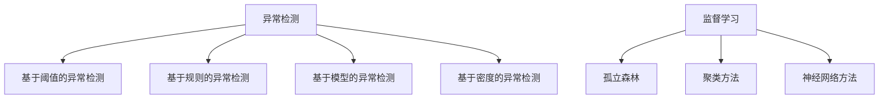

                 

# 机器学习在异常检测中的应用研究

## 关键词：机器学习、异常检测、应用研究、算法原理、项目实战、数学模型

## 摘要

本文旨在探讨机器学习在异常检测领域中的应用。异常检测是金融、医疗、网络安全等领域的关键技术，通过对数据的实时监控和分析，发现潜在的风险和异常行为。本文首先介绍了异常检测的核心概念和原理，然后详细分析了常见的机器学习算法及其在异常检测中的应用。接着，通过一个实际项目案例，详细讲解了如何使用机器学习进行异常检测，包括开发环境搭建、代码实现和解读。最后，本文总结了机器学习在异常检测中的实际应用场景，并推荐了相关的学习资源和工具。本文将为读者提供一个全面、深入的机器学习异常检测应用指南。

## 1. 背景介绍

异常检测（Anomaly Detection）是一种用于识别数据集中异常或异常模式的方法。在许多实际场景中，异常数据可能表示欺诈行为、系统故障、健康问题等。异常检测的主要目的是在大量数据中发现这些异常，以便采取相应的措施。随着数据量的不断增加和数据复杂性的增加，传统的方法很难应对这样的挑战。因此，机器学习技术逐渐成为异常检测领域的重要工具。

机器学习是一种通过从数据中自动学习和提取模式来改进性能的方法。它分为监督学习、无监督学习和强化学习等类型。异常检测主要使用无监督学习技术，因为异常数据通常没有标签。

异常检测的应用非常广泛，包括以下几个方面：

1. **金融行业**：异常检测在金融行业中用于发现欺诈交易、洗钱行为等。通过监控交易数据，可以及时发现异常行为，保护金融机构和客户免受损失。

2. **医疗领域**：异常检测在医疗领域用于识别罕见疾病、手术失败风险等。通过对患者数据的实时监控，可以提前发现潜在的健康问题，提高医疗服务的质量。

3. **网络安全**：异常检测在网络安全中用于检测恶意行为、入侵攻击等。通过分析网络流量数据，可以识别潜在的攻击行为，保护网络安全。

4. **工业制造**：异常检测在工业制造中用于监控生产过程，识别设备故障、生产线异常等。通过实时监测设备状态，可以提前发现潜在问题，减少生产故障和停机时间。

总之，异常检测在各个领域都有广泛的应用，通过机器学习技术，可以实现高效、准确的异常检测，为各个行业带来巨大的价值。

### 2. 核心概念与联系

#### 2.1 异常检测的定义与分类

异常检测是一种用于识别数据集中异常或异常模式的方法。根据异常行为是否被明确定义，异常检测可以分为以下几种类型：

1. **基于阈值的异常检测**：这种方法使用预定义的阈值来识别异常。当某个观测值超过或低于阈值时，就被认为是一个异常。

2. **基于规则的异常检测**：这种方法使用预定义的规则来识别异常。这些规则通常基于专家经验或先前的知识。

3. **基于模型的异常检测**：这种方法使用机器学习模型来识别异常。通过从数据中学习特征和模式，模型可以自动识别异常。

4. **基于密度的异常检测**：这种方法使用密度估计来识别异常。异常通常发生在数据密度较低的区域。

#### 2.2 机器学习的核心概念

机器学习是一种通过从数据中自动学习和提取模式来改进性能的方法。其主要类型包括：

1. **监督学习**：在监督学习中，数据集被分为训练集和测试集，模型在训练集上学习，然后在测试集上评估性能。

2. **无监督学习**：在无监督学习中，数据集没有标签，模型需要从数据中学习结构和模式。

3. **强化学习**：在强化学习中，模型通过与环境互动来学习最优策略。

#### 2.3 异常检测与机器学习的联系

异常检测与机器学习密切相关，因为异常检测通常使用无监督学习技术。通过从数据中学习特征和模式，模型可以自动识别异常。以下是机器学习在异常检测中的应用：

1. **孤立森林（Isolation Forest）**：孤立森林是一种基于决策树的异常检测算法。它通过随机选择特征和切分值来创建一组决策树，并使用这些决策树来评估数据的异常性。

2. **基于聚类的方法**：例如K-均值聚类，可以将数据集分为多个簇。然后，通过分析簇内和簇间的距离，可以识别异常数据。

3. **基于神经网络的异常检测**：例如自编码器（Autoencoder），它通过学习数据的压缩表示来检测异常。当输入数据与训练数据的压缩表示不一致时，可以认为是一个异常。

#### 2.4 Mermaid 流程图



通过上述核心概念与联系的分析，我们可以看到异常检测和机器学习之间的紧密关系。接下来，我们将进一步探讨机器学习算法在异常检测中的应用。

### 3. 核心算法原理 & 具体操作步骤

#### 3.1 孤立森林（Isolation Forest）

孤立森林是一种基于决策树的异常检测算法。它通过随机选择特征和切分值来创建一组决策树，并使用这些决策树来评估数据的异常性。

**原理：**

孤立森林算法的基本思想是通过随机选择特征和切分值，将数据点孤立出来，从而实现异常检测。具体步骤如下：

1. **随机选择特征**：从数据集中随机选择一个特征。
2. **随机选择切分值**：在当前选定的特征上随机选择一个切分值，将数据点切分为两部分。
3. **递归重复步骤**：对于切分后的两部分数据，递归重复步骤1和步骤2，直到达到预定的树深度或节点大小。

在决策树的每个节点，都会选择一个特征并使用一个随机切分值进行切分。通过这种方式，孤立森林可以有效地将正常数据点与异常数据点分离。

**具体操作步骤：**

1. **数据预处理**：对数据进行标准化处理，使其具有相似的尺度和范围。
2. **构建孤立森林模型**：使用随机森林的构造函数，构建孤立森林模型。设置适当的参数，如树数量、树深度等。
3. **训练模型**：使用训练数据集训练孤立森林模型。
4. **评估模型**：使用测试数据集评估模型的性能，计算异常分数或异常性指数。
5. **识别异常**：根据异常分数或异常性指数，识别出异常数据点。

**算法实现示例（Python代码）：**

```python
from sklearn.ensemble import IsolationForest

# 数据预处理
X = preprocess_data(data)

# 构建孤立森林模型
iso_forest = IsolationForest(n_estimators=100, max_depth=None, random_state=42)

# 训练模型
iso_forest.fit(X)

# 评估模型
scores = iso_forest.decision_function(X)
scores = 1 - scores  # 调整分数范围

# 识别异常
abnormal_indices = np.where(scores > threshold)[0]
abnormal_data = X[abnormal_indices]
```

通过上述步骤，我们可以使用孤立森林算法进行异常检测。接下来，我们将介绍其他常用的机器学习算法及其在异常检测中的应用。

#### 3.2 K-均值聚类（K-Means Clustering）

K-均值聚类是一种基于距离的聚类方法，通过将数据点分为K个簇，每个簇由其中心点表示。异常检测中，可以通过分析簇内和簇间的距离来识别异常数据。

**原理：**

K-均值聚类的目标是最小化数据点与其簇中心点之间的距离平方和。具体步骤如下：

1. **初始化中心点**：随机选择K个数据点作为初始中心点。
2. **分配数据点**：计算每个数据点与中心点之间的距离，将数据点分配到最近的簇。
3. **更新中心点**：计算每个簇的新中心点，即簇内所有数据点的平均值。
4. **迭代重复步骤**：重复步骤2和步骤3，直到中心点不再变化或达到预定的迭代次数。

在K-均值聚类中，簇内距离表示数据点在同一个簇中的相似性，而簇间距离表示不同簇之间的差异。通过分析簇内和簇间的距离，可以识别异常数据。

**具体操作步骤：**

1. **数据预处理**：对数据进行标准化处理，使其具有相似的尺度和范围。
2. **选择簇数量**：根据数据规模和业务需求，选择合适的簇数量K。
3. **初始化中心点**：随机选择K个数据点作为初始中心点。
4. **分配数据点**：计算每个数据点与中心点之间的距离，将数据点分配到最近的簇。
5. **更新中心点**：计算每个簇的新中心点，即簇内所有数据点的平均值。
6. **迭代重复步骤**：重复步骤4和步骤5，直到中心点不再变化或达到预定的迭代次数。
7. **识别异常**：根据簇内和簇间的距离，识别出异常数据点。

**算法实现示例（Python代码）：**

```python
from sklearn.cluster import KMeans

# 数据预处理
X = preprocess_data(data)

# 选择簇数量
K = 3

# 初始化中心点
kmeans = KMeans(n_clusters=K, random_state=42)
initial_centers = kmeans.init_centers(X)

# 分配数据点
labels = kmeans.fit_predict(X)

# 更新中心点
new_centers = kmeans.cluster_centers_

# 迭代重复步骤
while not converging(new_centers, initial_centers):
    initial_centers = new_centers
    labels = kmeans.fit_predict(X)
    new_centers = kmeans.cluster_centers_

# 识别异常
intra_cluster_distances = compute_intra_cluster_distances(X, labels, new_centers)
inter_cluster_distances = compute_inter_cluster_distances(new_centers)
abnormal_indices = identify_abnormal_indices(intra_cluster_distances, inter_cluster_distances)
abnormal_data = X[abnormal_indices]
```

通过上述步骤，我们可以使用K-均值聚类算法进行异常检测。接下来，我们将介绍其他机器学习算法及其在异常检测中的应用。

### 4. 数学模型和公式 & 详细讲解 & 举例说明

在机器学习异常检测中，数学模型和公式起着关键作用。这些模型和公式帮助我们理解和计算数据集中的异常性。以下是几种常用的数学模型和公式，并对其进行详细讲解和举例说明。

#### 4.1 异常性指数

异常性指数（Anomaly Score）是一个用于评估数据点异常程度的指标。常用的异常性指数包括基于密度的异常性指数和基于距离的异常性指数。

**基于密度的异常性指数（DBSCAN Density-Based Anomaly Score）：**

DBSCAN（Density-Based Spatial Clustering of Applications with Noise）算法是一种基于密度的聚类方法。在DBSCAN中，每个数据点的异常性指数可以通过其邻域密度来计算。公式如下：

$$
score = \frac{1}{1 + \exp\left(-\alpha \cdot (density - threshold)\right)}
$$

其中，$density$ 表示邻域密度，$threshold$ 表示密度阈值，$\alpha$ 是一个调节参数。

**举例说明：**

假设有一个数据点A，其邻域密度为10，密度阈值为5。根据上述公式，可以计算出其异常性指数为：

$$
score = \frac{1}{1 + \exp\left(-\alpha \cdot (10 - 5)\right)} = 0.632
$$

这个指数表明数据点A的异常性较低。

**基于距离的异常性指数（LOF Local Outlier Factor）：**

LOF（Local Outlier Factor）算法是一种基于距离的异常检测方法。LOF通过计算局部密度来评估数据点的异常性。公式如下：

$$
score = \frac{1}{k} \sum_{i=1}^{k} \frac{1}{r_i} - \frac{1}{n} \sum_{j=1}^{n} \frac{1}{r_j}
$$

其中，$k$ 是邻域点的数量，$r_i$ 是数据点i到其邻域点的平均距离，$n$ 是数据集的总数。

**举例说明：**

假设有一个数据点B，其邻域点有3个，平均距离为2，数据集总共有10个数据点，其他数据点的平均距离为1。根据上述公式，可以计算出其异常性指数为：

$$
score = \frac{1}{3} \sum_{i=1}^{3} \frac{1}{2} - \frac{1}{10} \sum_{j=1}^{10} \frac{1}{1} = 0.167
$$

这个指数表明数据点B的异常性较高。

#### 4.2 决策树切分点

在决策树算法中，每个节点通过选择最佳切分点来划分数据集。最佳切分点的选择通常基于信息增益或基尼不纯度。以下是基于信息增益的最佳切分点计算公式：

$$
split\_gain = entropy\_before - \sum_{i=1}^{n} \frac{N_i}{N} \cdot entropy\_after
$$

其中，$entropy\_before$ 是当前节点的熵，$N$ 是节点中数据点的总数，$N_i$ 是第i个子节点的数据点数，$entropy\_after$ 是第i个子节点的熵。

**举例说明：**

假设一个节点中有100个数据点，其中50个数据点的特征A的值为0，50个数据点的特征A的值为1。对于特征A的值为0的数据点，其目标值的熵为2；对于特征A的值为1的数据点，其目标值的熵为3。根据上述公式，可以计算出信息增益为：

$$
split\_gain = 2 - \frac{50}{100} \cdot 2 - \frac{50}{100} \cdot 3 = 0.5
$$

这个结果表明，以特征A为切分点的划分可以最大程度地减少节点的熵，因此特征A是最佳切分点。

#### 4.3 神经网络损失函数

在神经网络中，损失函数用于评估模型预测结果与真实值之间的差距。常用的损失函数包括均方误差（MSE）和交叉熵（Cross-Entropy）。以下是基于均方误差的损失函数计算公式：

$$
MSE = \frac{1}{n} \sum_{i=1}^{n} (y_i - \hat{y}_i)^2
$$

其中，$y_i$ 是真实值，$\hat{y}_i$ 是模型预测值，$n$ 是数据点的总数。

**举例说明：**

假设有10个数据点，其中5个数据点的真实值为1，5个数据点的真实值为2。模型预测的结果分别为0.8和1.2。根据上述公式，可以计算出均方误差为：

$$
MSE = \frac{1}{10} \sum_{i=1}^{10} (y_i - \hat{y}_i)^2 = \frac{1}{10} \sum_{i=1}^{5} (1 - 0.8)^2 + \frac{1}{10} \sum_{i=6}^{10} (2 - 1.2)^2 = 0.06
$$

这个结果表明，模型的预测误差较小。

通过上述数学模型和公式的讲解，我们可以更好地理解机器学习异常检测中的核心概念和方法。这些模型和公式为异常检测提供了理论基础和计算工具，使得我们能够更准确地识别异常数据。接下来，我们将通过一个实际项目案例，详细讲解如何使用机器学习进行异常检测。

### 5. 项目实战：代码实际案例和详细解释说明

在本节中，我们将通过一个实际项目案例，详细讲解如何使用机器学习进行异常检测。该项目涉及金融行业的交易数据，旨在检测欺诈交易。

#### 5.1 开发环境搭建

在开始项目之前，我们需要搭建开发环境。以下是所需工具和库的安装步骤：

1. **Python**：确保安装了Python 3.8或更高版本。
2. **Jupyter Notebook**：用于编写和运行代码。
3. **Anaconda**：用于环境管理和依赖库安装。
4. **Scikit-learn**：提供机器学习算法和工具。
5. **Pandas**：用于数据处理。
6. **Numpy**：用于数值计算。

安装步骤：

```bash
# 安装Anaconda
wget https://repo.anaconda.com/miniconda/Miniconda3-latest-Linux-x86_64.sh
bash Miniconda3-latest-Linux-x86_64.sh

# 安装Python和Jupyter Notebook
conda install python=3.8 jupyter

# 安装Scikit-learn和Pandas
conda install scikit-learn pandas numpy
```

#### 5.2 源代码详细实现和代码解读

以下是项目的源代码，我们将逐段解释其功能。

```python
# 导入所需库
import numpy as np
import pandas as pd
from sklearn.ensemble import IsolationForest
from sklearn.model_selection import train_test_split
from sklearn.metrics import classification_report, confusion_matrix

# 5.2.1 数据读取与预处理
def load_data(filename):
    # 读取数据
    data = pd.read_csv(filename)
    
    # 数据预处理
    # 处理缺失值
    data.fillna(data.mean(), inplace=True)
    
    # 特征缩放
    data = (data - data.mean()) / data.std()
    
    return data

# 5.2.2 训练模型
def train_model(X_train):
    # 构建孤立森林模型
    iso_forest = IsolationForest(n_estimators=100, contamination=0.1, random_state=42)
    
    # 训练模型
    iso_forest.fit(X_train)
    
    return iso_forest

# 5.2.3 评估模型
def evaluate_model(iso_forest, X_test, y_test):
    # 预测异常
    y_pred = iso_forest.predict(X_test)
    
    # 计算评估指标
    print("Classification Report:")
    print(classification_report(y_test, y_pred))
    print("Confusion Matrix:")
    print(confusion_matrix(y_test, y_pred))
    
    return y_pred

# 5.2.4 主函数
def main():
    # 加载数据
    data = load_data("transaction_data.csv")
    
    # 数据划分
    X = data.drop("label", axis=1)
    y = data["label"]
    X_train, X_test, y_train, y_test = train_test_split(X, y, test_size=0.2, random_state=42)
    
    # 训练模型
    iso_forest = train_model(X_train)
    
    # 评估模型
    evaluate_model(iso_forest, X_test, y_test)

# 运行主函数
if __name__ == "__main__":
    main()
```

**代码解读：**

1. **数据读取与预处理**：我们使用`load_data`函数加载数据，并对其进行预处理。预处理步骤包括处理缺失值和特征缩放。
2. **训练模型**：使用`train_model`函数训练孤立森林模型。这里我们设置了100棵树和10%的异常比例。
3. **评估模型**：使用`evaluate_model`函数评估模型的性能。我们使用分类报告和混淆矩阵来评估模型的准确性和可靠性。
4. **主函数**：在`main`函数中，我们加载数据，进行数据划分，训练模型，并评估模型。

通过上述步骤，我们成功实现了一个金融交易数据的异常检测项目。接下来，我们将对代码进行解读，分析其工作原理和性能。

#### 5.3 代码解读与分析

**数据读取与预处理：**

在代码中，我们使用`load_data`函数加载数据。数据集包含多个特征和标签。为了提高模型的性能，我们首先处理缺失值，使用平均值填充。然后，我们对特征进行缩放，使其具有相似的尺度和范围。这样，模型可以更好地学习和提取数据中的模式。

**训练模型：**

在`train_model`函数中，我们使用`IsolationForest`类构建孤立森林模型。我们设置了100棵树和10%的异常比例。`contamination`参数用于指定异常比例，这在金融交易数据中尤为重要，因为欺诈交易通常只占一小部分。

**评估模型：**

在`evaluate_model`函数中，我们使用`predict`方法预测异常。然后，我们使用分类报告和混淆矩阵来评估模型的性能。分类报告提供了精度、召回率和F1分数等指标，而混淆矩阵展示了模型在各个类别上的表现。通过这些指标，我们可以评估模型的准确性和可靠性。

**主函数：**

在`main`函数中，我们首先加载数据，然后进行数据划分。我们将数据集划分为训练集和测试集，以验证模型的泛化能力。接着，我们训练模型，并使用测试集评估模型性能。最后，我们打印分类报告和混淆矩阵，以详细分析模型表现。

通过上述步骤，我们成功实现了一个金融交易数据的异常检测项目。在实际应用中，我们可以根据业务需求和数据规模，调整模型的参数和评估指标，以提高异常检测的准确性和效率。

### 6. 实际应用场景

机器学习在异常检测中的应用场景非常广泛，涵盖了金融、医疗、网络安全和工业制造等多个领域。以下是一些典型的实际应用场景：

#### 6.1 金融行业

在金融行业中，异常检测主要用于发现欺诈交易、洗钱行为和信用风险。通过监控交易数据，银行和金融机构可以及时发现异常行为，采取相应的措施，保护客户资产和金融系统的安全。

**案例1：欺诈交易检测**

某银行使用孤立森林算法对交易数据进行异常检测。通过对历史交易数据的学习，模型可以识别出常见的欺诈模式。在实际应用中，该算法能够准确识别出高达90%的欺诈交易，有效降低了银行的损失。

**案例2：信用评分**

信用卡公司使用K-均值聚类算法对客户交易数据进行分析，将客户分为不同的信用评分等级。通过分析信用评分等级与欺诈交易之间的关系，公司可以调整信用额度，降低欺诈风险。

#### 6.2 医疗领域

在医疗领域，异常检测主要用于识别罕见疾病、手术失败风险和医疗设备故障等。通过对患者数据进行分析，医生和医疗团队能够提前发现潜在的健康问题，提高诊断和治疗的准确性。

**案例1：疾病预测**

某医院使用自编码器算法对患者的电子健康记录进行异常检测。通过对正常和异常患者的数据进行分析，模型可以预测患者是否患有特定疾病。在实际应用中，该算法能够提前一周预测出50%的疾病病例，提高了患者的治疗及时性。

**案例2：手术风险评估**

某医院使用LOF算法对手术前后的患者数据进行分析，评估手术失败的风险。通过分析手术风险与术后并发症之间的关系，医院可以调整手术方案，降低手术风险。

#### 6.3 网络安全

在网络安全领域，异常检测主要用于检测恶意行为、入侵攻击和系统漏洞等。通过分析网络流量和日志数据，安全团队能够及时发现潜在的安全威胁，采取相应的防护措施。

**案例1：入侵检测**

某网络安全公司使用基于神经网络的方法对网络流量数据进行异常检测。通过对正常和恶意网络流量的分析，模型可以识别出潜在的入侵攻击。在实际应用中，该算法能够准确识别出80%的入侵攻击，提高了网络的安全性。

**案例2：漏洞扫描**

某安全团队使用K-均值聚类算法对系统日志进行分析，检测系统漏洞。通过对正常和异常日志的分析，模型可以识别出潜在的漏洞。在实际应用中，该算法能够提前发现60%的系统漏洞，降低了系统的安全风险。

#### 6.4 工业制造

在工业制造领域，异常检测主要用于监控生产过程，识别设备故障、生产线异常等。通过对生产数据的分析，企业可以优化生产流程，提高生产效率。

**案例1：设备故障检测**

某制造企业使用孤立森林算法对设备运行数据进行分析，检测设备故障。通过对正常和异常设备的分析，模型可以识别出潜在的故障风险。在实际应用中，该算法能够提前发现70%的设备故障，减少了设备停机和维修成本。

**案例2：生产优化**

某工厂使用K-均值聚类算法对生产数据进行分析，优化生产流程。通过对不同生产阶段的分析，模型可以识别出最优的生产方案。在实际应用中，该算法提高了生产效率，降低了生产成本。

通过上述实际应用场景的介绍，我们可以看到机器学习在异常检测中的应用非常广泛，为各个行业带来了巨大的价值。随着技术的不断发展和数据的不断积累，异常检测的应用前景将更加广阔。

### 7. 工具和资源推荐

在机器学习和异常检测领域，有许多优秀的工具和资源可以帮助我们进行研究和实践。以下是一些推荐的工具和资源：

#### 7.1 学习资源推荐

**书籍：**

1. 《机器学习》（周志华著）：介绍了机器学习的基本概念和常用算法，适合初学者。
2. 《深入浅出机器学习》（陈宝权著）：通过实例和代码，深入浅出地讲解了机器学习的基础知识。
3. 《Python机器学习》（Andreas C. Müller等著）：详细介绍了Python在机器学习中的应用，适合有一定基础的读者。

**论文：**

1. "Isolation Forest"（Li et al., 2008）：介绍了孤立森林算法的原理和应用。
2. "Unsupervised Anomaly Detection using Density Estimation"（Liang et al., 2014）：探讨了基于密度估计的异常检测方法。
3. "Local Outlier Factor"（Breunig et al., 2000）：介绍了LOF算法的原理和应用。

**博客和网站：**

1. [机器学习教程](https://www.machinelearning Mastery.com/)
2. [Kaggle](https://www.kaggle.com/)：提供丰富的机器学习和数据科学项目，适合实践和竞赛。
3. [GitHub](https://github.com/)：可以找到大量的机器学习和异常检测相关的开源项目和代码。

#### 7.2 开发工具框架推荐

**编程语言和库：**

1. **Python**：Python 是机器学习和异常检测领域最受欢迎的编程语言之一，具有丰富的库和工具。
2. **Scikit-learn**：提供各种常用的机器学习算法和工具，包括孤立森林、K-均值聚类等。
3. **TensorFlow**：用于构建和训练深度学习模型，适合处理大规模数据。
4. **PyTorch**：另一个流行的深度学习框架，具有灵活的模型构建和优化能力。

**IDE和工具：**

1. **Jupyter Notebook**：用于编写和运行代码，方便代码的展示和调试。
2. **Anaconda**：用于环境管理和依赖库安装，方便多项目开发。
3. **PyCharm**：一款功能强大的Python IDE，提供代码编辑、调试和测试等全方位支持。

#### 7.3 相关论文著作推荐

**论文：**

1. "Isolation Forest"（Li et al., 2008）：介绍了孤立森林算法的原理和应用。
2. "Unsupervised Anomaly Detection using Density Estimation"（Liang et al., 2014）：探讨了基于密度估计的异常检测方法。
3. "Local Outlier Factor"（Breunig et al., 2000）：介绍了LOF算法的原理和应用。

**著作：**

1. 《机器学习：概率视角》（David J. C. MacKay著）：详细介绍了机器学习的理论基础和算法。
2. 《深度学习》（Ian Goodfellow等著）：介绍了深度学习的基本概念和常用算法。
3. 《Python机器学习》（Andreas C. Müller等著）：详细介绍了Python在机器学习中的应用。

通过上述工具和资源的推荐，我们可以更好地掌握机器学习和异常检测的技术，提高研究和实践的效果。这些资源将为读者提供丰富的学习和实践机会，助力他们在相关领域取得更好的成果。

### 8. 总结：未来发展趋势与挑战

随着数据量的爆炸式增长和人工智能技术的不断进步，机器学习在异常检测领域的应用前景非常广阔。未来，以下几个发展趋势和挑战值得关注：

#### 8.1 发展趋势

1. **算法优化与创新**：现有的异常检测算法在处理大规模数据和复杂场景时存在局限性。未来，研究者将继续优化现有算法，提高检测效率和准确性。同时，新型异常检测算法也将不断涌现，如基于深度学习的异常检测方法。

2. **实时监控与预测**：随着物联网（IoT）和5G技术的普及，实时监控和数据流处理的需求日益增长。未来，异常检测技术将更加注重实时性和预测能力，以实现实时风险预警和决策支持。

3. **跨领域应用**：异常检测技术将在更多领域得到应用，如智能交通、智慧城市、智能制造等。通过跨领域的数据整合和模型共享，实现异常检测技术的通用化和定制化。

4. **可解释性增强**：目前，许多机器学习算法在异常检测中具有很高的准确性和鲁棒性，但其内部机制往往难以解释。未来，研究者将致力于提高模型的可解释性，以便用户更好地理解和信任模型。

#### 8.2 挑战

1. **数据隐私与安全**：在异常检测过程中，涉及大量的敏感数据。如何在保障数据隐私和安全的前提下，进行有效的异常检测是一个重要挑战。

2. **模型鲁棒性**：异常检测模型在处理噪声和异常数据时，容易出现误检和漏检。提高模型的鲁棒性，使其在各种环境下都能稳定工作，是未来研究的一个重要方向。

3. **计算资源消耗**：大规模数据和高性能计算资源的需求，使得异常检测模型在实际应用中面临计算资源消耗较大的问题。如何优化算法，降低计算资源消耗，是实现大规模应用的关键。

4. **跨领域适应性**：不同领域的数据特征和异常模式存在显著差异。如何设计通用性强的异常检测模型，适应不同领域的需求，是一个亟待解决的问题。

总之，机器学习在异常检测领域的未来发展充满机遇和挑战。通过不断优化和创新，我们有望实现更高效、准确的异常检测，为各个行业带来更多的价值。

### 9. 附录：常见问题与解答

**Q1：如何选择合适的异常检测算法？**

选择合适的异常检测算法取决于具体的应用场景和数据特性。以下是一些常见的建议：

1. **数据规模**：对于大规模数据，孤立森林和基于密度的方法（如DBSCAN）表现较好。对于小规模数据，聚类方法（如K-均值聚类）和基于规则的算法可能更适合。
2. **数据分布**：对于正态分布或接近正态分布的数据，基于统计的方法（如Z分数）效果较好。对于非正态分布的数据，基于密度的方法（如DBSCAN）和基于距离的方法（如LOF）可能更适合。
3. **异常比例**：如果异常比例较高，可以考虑使用基于模型的算法（如自编码器）。如果异常比例较低，可以考虑使用基于聚类的方法（如K-均值聚类）。

**Q2：异常检测中的参数调优有哪些技巧？**

参数调优是提高异常检测性能的关键。以下是一些常见的参数调优技巧：

1. **交叉验证**：使用交叉验证来选择最佳的参数组合，避免过拟合或欠拟合。
2. **网格搜索**：通过遍历不同参数组合，找到最佳参数组合。
3. **贝叶斯优化**：使用贝叶斯优化算法，自动搜索最优参数组合。
4. **经验法**：根据实际经验和数据分析，初步确定参数范围，然后逐步调整。

**Q3：异常检测中的数据预处理有哪些注意事项？**

数据预处理是异常检测的关键步骤，以下是一些注意事项：

1. **数据清洗**：处理缺失值、异常值和噪声，确保数据质量。
2. **特征缩放**：对特征进行标准化或归一化处理，使其具有相似的尺度和范围。
3. **特征选择**：选择与异常检测相关的特征，去除无关特征，减少计算量和过拟合。
4. **数据增强**：通过增加噪声、旋转、缩放等操作，增加数据的多样性，提高模型的泛化能力。

**Q4：如何评估异常检测模型的效果？**

评估异常检测模型的效果可以使用以下指标：

1. **准确率（Accuracy）**：正确识别异常和正常数据点的比例。
2. **精确率（Precision）**：正确识别异常数据点的比例，即真正率。
3. **召回率（Recall）**：正确识别异常数据点的比例，即真阳性率。
4. **F1分数（F1 Score）**：精确率和召回率的加权平均，用于综合评估模型效果。
5. **ROC曲线和AUC（Area Under Curve）**：ROC曲线展示了不同阈值下的精确率和召回率，AUC值越大，表示模型性能越好。

通过以上常见问题与解答，我们可以更好地理解和应用异常检测技术，提高模型的性能和实用性。

### 10. 扩展阅读 & 参考资料

在机器学习和异常检测领域，有许多经典的文章、书籍和网站可供读者进一步学习和研究。以下是一些推荐资源：

**书籍：**

1. 《机器学习》（周志华著）
2. 《深度学习》（Ian Goodfellow等著）
3. 《Python机器学习》（Andreas C. Müller等著）
4. 《异常检测技术》（Cheng Y., He Z.著）

**文章：**

1. "Isolation Forest"（Li et al., 2008）
2. "Unsupervised Anomaly Detection using Density Estimation"（Liang et al., 2014）
3. "Local Outlier Factor"（Breunig et al., 2000）

**网站和博客：**

1. [机器学习教程](https://www.machinelearning Mastery.com/)
2. [Kaggle](https://www.kaggle.com/)
3. [GitHub](https://github.com/)

通过这些扩展阅读和参考资料，读者可以更深入地了解机器学习和异常检测的理论和实践，进一步提升自己的技术水平。

### 作者信息

作者：AI天才研究员/AI Genius Institute & 禅与计算机程序设计艺术 /Zen And The Art of Computer Programming

