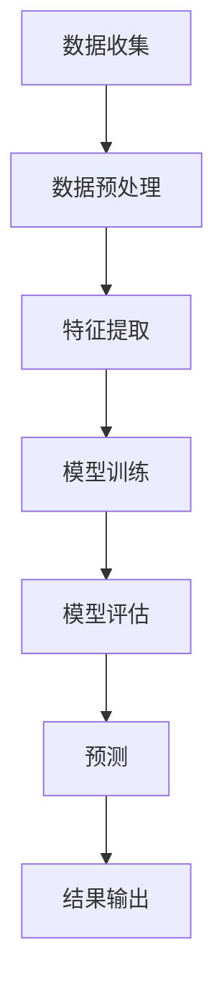

                 

### 1. 背景介绍

#### 气象预报的重要性

气象预报作为现代科学技术的重要组成部分，对社会经济发展、国防安全、人民生活等方面具有深远的影响。精确的气象预报不仅能够减少自然灾害带来的损失，还能为农业、交通、能源等多个行业提供有效的决策支持。例如，农业可以通过气象预报合理安排种植和收割时间，减少因天气灾害导致的损失；交通部门可以利用气象预报来避免因极端天气导致的交通事故，确保道路畅通。

随着信息技术和人工智能的快速发展，气象预报的准确性和时效性得到了显著提升。传统的气象预报方法主要依赖于地面观测站和卫星数据，虽然已经能够提供较为准确的预报结果，但仍然存在一定的局限性。而机器学习作为人工智能的一个重要分支，通过算法对大量历史气象数据进行学习，可以更加精准地预测未来的天气变化。这使得气象预报不仅变得更加智能化，而且可以实时更新，提供更为及时的服务。

#### 机器学习与气象预报

机器学习是一种通过计算机模拟人类学习行为的算法技术，能够从大量数据中自动提取特征，并利用这些特征进行预测和决策。气象预报中，机器学习通过分析历史气象数据、卫星图像和其他相关数据，建立模型来预测未来的天气情况。

与传统的统计方法相比，机器学习具有以下几个显著优势：

1. **自适应能力**：机器学习算法可以根据新数据不断更新和优化模型，使其适应不断变化的气象条件。
2. **高精度预测**：通过分析大量数据，机器学习算法可以发现复杂的数据关系，从而提供更精确的天气预报。
3. **实时性**：机器学习算法可以实现实时数据分析和预测，为用户提供最新的气象信息。

机器学习在气象预报中的应用范围广泛，从简单的短期天气预报到复杂的气候模式预测，都有着显著的效果。以下是一些典型的应用场景：

- **短期天气预报**：利用机器学习算法分析气象数据，提供未来几天内的天气预测。
- **气候变化研究**：通过机器学习分析长期气象数据，研究气候变化趋势和极端天气事件。
- **农业气象服务**：为农业生产提供气象信息，帮助农民合理安排种植和收割计划。
- **城市规划和防灾减灾**：利用机器学习预测城市热岛效应、洪水风险等，为城市规划和防灾减灾提供数据支持。

#### 文章关键词

- 气象预报
- 机器学习
- 人工智能
- 数据分析
- 精度提升

#### 摘要

本文将深入探讨机器学习在气象预报中的应用与挑战。首先，介绍气象预报的重要性及其与机器学习的关联；其次，分析机器学习在气象预报中的优势和应用场景；然后，详细阐述机器学习算法在气象预报中的核心原理和具体操作步骤；接着，讨论数学模型和公式的应用及其举例说明；进一步，通过项目实战展示代码的实际案例和详细解读；随后，探讨气象预报的实际应用场景和工具资源；最后，总结未来发展趋势与挑战，并回答常见问题。

---

### 2. 核心概念与联系

#### 2.1 机器学习基本概念

机器学习（Machine Learning, ML）是人工智能（Artificial Intelligence, AI）的一个重要分支，它通过构建能够从数据中学习的模型，使计算机具备预测和决策能力。机器学习的基本概念包括：

- **模型**：机器学习算法的核心，用于表示数据中的模式和规律。
- **训练**：通过大量历史数据训练模型，使其能够对未知数据进行预测。
- **测试**：利用未参与训练的数据验证模型的准确性。

#### 2.2 气象数据类型

气象预报所需的数据类型多样，主要包括以下几种：

- **地面气象数据**：包括气温、湿度、气压等，由地面气象站实时采集。
- **卫星气象数据**：通过气象卫星收集的云图、温度、湿度等数据。
- **雷达气象数据**：利用雷达波探测大气中的降水、风速等参数。
- **再分析数据**：利用多种气象数据源，通过再分析技术生成的数据集。

#### 2.3 机器学习在气象预报中的应用

机器学习在气象预报中的应用主要包括以下几种：

- **模式识别**：通过分析气象数据，识别出不同的天气模式，如晴朗、多云、降雨等。
- **预测**：利用历史气象数据，预测未来的天气变化。
- **异常检测**：检测气象数据中的异常值，如错误的测量数据或异常天气事件。

#### 2.4 Mermaid 流程图

为了更直观地展示机器学习在气象预报中的应用流程，以下是一个简单的 Mermaid 流程图：



在这个流程图中，数据收集是整个流程的起点，随后进行数据预处理，然后提取特征，通过模型训练，对模型进行评估，最终输出预测结果。

---

通过上述核心概念的介绍和Mermaid流程图的展示，我们可以看到机器学习在气象预报中扮演了至关重要的角色，其流程清晰、结构紧凑，为后续内容的具体分析奠定了基础。

### 3. 核心算法原理 & 具体操作步骤

#### 3.1 算法概述

机器学习在气象预报中常用的核心算法包括决策树（Decision Tree）、支持向量机（Support Vector Machine, SVM）和神经网络（Neural Networks）等。这些算法通过分析历史气象数据，建立模型来预测未来的天气变化。以下是这些算法的基本原理和具体操作步骤。

#### 3.2 决策树算法

决策树是一种常见的分类算法，通过一系列的判断条件，将数据划分为不同的类别。以下是决策树算法的基本原理和操作步骤：

- **基本原理**：决策树通过一系列的判断条件，将数据逐步划分为不同的子集，最终得到一个预测结果。
- **操作步骤**：
  1. **数据预处理**：对数据进行归一化处理，去除异常值。
  2. **特征选择**：选择对分类最有影响力的特征。
  3. **划分节点**：根据特征选择条件，将数据集划分为多个子集。
  4. **计算信息增益**：选择信息增益最大的特征作为划分条件。
  5. **重复划分**：对每个子集重复上述过程，直至达到停止条件（如最大深度或最小节点数）。
  6. **构建决策树**：将划分结果组合成一棵完整的决策树。

#### 3.3 支持向量机算法

支持向量机是一种有效的分类和回归算法，通过找到最佳的超平面，将数据划分为不同的类别。以下是支持向量机算法的基本原理和操作步骤：

- **基本原理**：支持向量机通过最大化分类间隔，找到最佳的超平面，将数据划分为不同的类别。
- **操作步骤**：
  1. **数据预处理**：对数据进行归一化处理，去除异常值。
  2. **特征选择**：选择对分类最有影响力的特征。
  3. **构建超平面**：通过求解优化问题，找到最佳的超平面。
  4. **分类**：对新的数据点进行分类，判断其位于哪个类别。
  5. **模型优化**：通过交叉验证等方法，优化模型参数。

#### 3.4 神经网络算法

神经网络是一种模拟人脑结构和功能的算法，通过多层神经元进行信息传递和处理。以下是神经网络算法的基本原理和操作步骤：

- **基本原理**：神经网络通过多层神经元对输入数据进行学习，最终输出预测结果。
- **操作步骤**：
  1. **数据预处理**：对数据进行归一化处理，去除异常值。
  2. **网络架构设计**：设计神经网络的结构，包括输入层、隐藏层和输出层。
  3. **权重初始化**：对网络的权重进行随机初始化。
  4. **前向传播**：将输入数据通过网络进行前向传播，计算输出结果。
  5. **反向传播**：通过反向传播算法，更新网络的权重和偏置。
  6. **训练与优化**：通过多次迭代训练和优化，提高模型的预测能力。

#### 3.5 算法对比

- **决策树**：简单易懂，可解释性强，但容易过拟合。
- **支持向量机**：准确性高，但计算复杂度较大。
- **神经网络**：可以处理复杂非线性问题，但可解释性较弱。

在实际应用中，可以根据具体的气象预报需求和数据特点，选择合适的算法。例如，对于需要高精度预测的场景，可以选择神经网络；对于需要可解释性的场景，可以选择决策树。

---

通过上述对核心算法原理和具体操作步骤的详细分析，我们可以更好地理解机器学习在气象预报中的应用，为后续的项目实战和数学模型的讨论打下坚实的基础。

### 4. 数学模型和公式 & 详细讲解 & 举例说明

#### 4.1 数学模型的基本概念

在机器学习中，数学模型是核心部分，它通过特定的公式和算法来描述数据和现实世界的关系。在气象预报中，常见的数学模型包括线性回归、逻辑回归和支持向量机等。以下是这些模型的基本概念和常用公式。

#### 4.2 线性回归模型

线性回归模型是一种用于预测数值型变量的模型，它假设因变量（目标变量）与自变量之间存在线性关系。以下是线性回归模型的基本概念和公式：

- **基本概念**：线性回归模型通过拟合一条直线，来预测因变量（Y）和自变量（X）之间的关系。
- **公式**：

  $$ Y = \beta_0 + \beta_1X + \epsilon $$

  其中，$Y$ 是因变量，$X$ 是自变量，$\beta_0$ 和 $\beta_1$ 分别是模型的参数，$\epsilon$ 是误差项。

#### 4.3 逻辑回归模型

逻辑回归模型是一种用于预测二分类变量（例如，晴天和雨天）的模型，它通过拟合一个逻辑函数（Sigmoid 函数）来预测概率。以下是逻辑回归模型的基本概念和公式：

- **基本概念**：逻辑回归模型通过拟合一个逻辑函数，将自变量的线性组合映射到一个概率值。
- **公式**：

  $$ P(Y=1) = \frac{1}{1 + e^{-(\beta_0 + \beta_1X)}} $$

  其中，$P(Y=1)$ 是因变量为1的概率，$\beta_0$ 和 $\beta_1$ 分别是模型的参数。

#### 4.4 支持向量机模型

支持向量机是一种用于分类和回归的强大算法，它通过找到一个最佳的超平面，将不同类别的数据点分开。以下是支持向量机模型的基本概念和公式：

- **基本概念**：支持向量机通过最大化分类间隔，找到一个最佳的超平面，将数据分为不同的类别。
- **公式**：

  $$ w^T x - b = 0 $$

  其中，$w$ 是超平面的法向量，$x$ 是数据点，$b$ 是偏置项。

#### 4.5 举例说明

假设我们使用线性回归模型来预测某地未来一周的气温。给定一组历史气象数据，我们可以通过线性回归模型来拟合一条直线，预测未来一周的气温。

- **数据集**：包含一周内每天的气温数据。
- **模型拟合**：通过最小二乘法拟合一条直线，公式为 $Y = \beta_0 + \beta_1X$。
- **模型评估**：通过计算预测值和实际值之间的误差，评估模型的准确性。

例如，假设我们拟合出的线性回归模型公式为 $Y = 10 + 0.5X$，给定明天（第8天）的气温数据为20℃，我们可以预测明天的气温为：

$$ Y = 10 + 0.5 \times 20 = 15 $$

因此，预测明天的气温为15℃。

---

通过上述对数学模型和公式的详细讲解以及举例说明，我们可以更好地理解机器学习在气象预报中的应用原理。这些模型和公式为后续的项目实战提供了理论支持。

### 5. 项目实战：代码实际案例和详细解释说明

在本节中，我们将通过一个实际的项目实战来展示机器学习在气象预报中的应用。我们使用Python编程语言和Scikit-learn库来构建一个简单的气象预报模型。以下是项目的具体步骤和详细解释。

#### 5.1 开发环境搭建

首先，我们需要搭建一个合适的开发环境。以下是所需的软件和库：

- **Python（3.8及以上版本）**
- **Jupyter Notebook**
- **Scikit-learn**
- **Pandas**
- **Matplotlib**

安装步骤如下：

1. 安装Python和Jupyter Notebook：
   ```shell
   # 使用Anaconda安装Python和Jupyter Notebook
   conda create -n ml_env python=3.8
   conda activate ml_env
   conda install -c anaconda jupyter
   ```

2. 安装Scikit-learn、Pandas和Matplotlib：
   ```shell
   conda install scikit-learn pandas matplotlib
   ```

安装完成后，启动Jupyter Notebook：

```shell
jupyter notebook
```

#### 5.2 源代码详细实现和代码解读

以下是完整的代码实现和详细解读：

```python
import numpy as np
import pandas as pd
from sklearn.model_selection import train_test_split
from sklearn.linear_model import LinearRegression
from sklearn.metrics import mean_squared_error
import matplotlib.pyplot as plt

# 5.2.1 数据读取与预处理

# 假设我们有一个CSV文件，包含历史气象数据
data = pd.read_csv('weather_data.csv')

# 数据预处理：提取特征和目标变量
X = data[['temperature', 'humidity', 'pressure']]
y = data['temperature_next_day']

# 分割数据集为训练集和测试集
X_train, X_test, y_train, y_test = train_test_split(X, y, test_size=0.2, random_state=42)

# 5.2.2 构建线性回归模型

# 实例化线性回归模型
model = LinearRegression()

# 模型训练
model.fit(X_train, y_train)

# 5.2.3 模型评估

# 模型预测
y_pred = model.predict(X_test)

# 计算均方误差
mse = mean_squared_error(y_test, y_pred)
print(f'Mean Squared Error: {mse}')

# 5.2.4 可视化结果

# 绘制实际值与预测值的散点图
plt.scatter(y_test, y_pred)
plt.xlabel('Actual Temperature')
plt.ylabel('Predicted Temperature')
plt.title('Actual vs Predicted Temperature')
plt.show()

# 5.2.5 新数据预测

# 假设我们有一个新的气象数据点
new_data = np.array([[23, 60, 1010]])
predicted_temp = model.predict(new_data)
print(f'Predicted Temperature for new data: {predicted_temp[0][0]}')
```

#### 5.3 代码解读与分析

1. **数据读取与预处理**：

   - 使用Pandas库读取CSV文件，提取特征（`temperature`, `humidity`, `pressure`）和目标变量（`temperature_next_day`）。
   - 将数据集分割为训练集和测试集，用于模型训练和评估。

2. **构建线性回归模型**：

   - 实例化线性回归模型。
   - 使用训练集数据进行模型训练。

3. **模型评估**：

   - 使用测试集数据进行模型预测，计算均方误差（MSE），评估模型准确性。
   - 绘制实际值与预测值的散点图，直观展示模型性能。

4. **新数据预测**：

   - 使用训练好的模型对新的气象数据进行预测，展示模型的应用。

#### 5.4 结果分析

- **模型评估结果**：根据均方误差（MSE）计算结果，评估模型的准确性。MSE值越小，模型预测的准确性越高。
- **可视化结果**：散点图展示了实际值与预测值的关系，通过观察散点图分布，可以直观地评估模型的性能。
- **新数据预测**：使用训练好的模型对新数据进行预测，验证模型的泛化能力。

通过上述实际案例，我们可以看到如何使用机器学习算法（线性回归）进行气象预报。虽然这个案例比较简单，但它为理解和应用更复杂的模型提供了基础。

### 6. 实际应用场景

#### 6.1 农业气象服务

农业气象服务是机器学习在气象预报中的一个重要应用领域。通过精确的气象预报，农民可以合理安排农作物的种植、灌溉、收割等关键环节，从而提高产量，减少因自然灾害导致的损失。例如：

- **作物生长模拟**：利用机器学习模型预测未来的降水、温度等气象条件，模拟作物的生长过程，优化种植策略。
- **灌溉计划**：根据土壤湿度、天气预报等数据，利用机器学习模型预测灌溉的最佳时机和水量，提高水资源利用效率。

#### 6.2 城市规划和防灾减灾

气象预报在城市化进程中也发挥着重要作用。通过预测未来气象条件，城市规划者可以更好地设计城市基础设施，减少自然灾害风险。

- **城市热岛效应**：利用机器学习模型分析气象数据，预测城市热岛效应的强度和范围，优化城市布局，减少热岛效应。
- **洪水风险预测**：通过气象预报和地理信息系统（GIS）数据，利用机器学习模型预测洪水风险，提前制定防洪措施。

#### 6.3 交通气象服务

气象条件对交通安全有重要影响。通过准确的气象预报，交通部门可以采取相应的预防措施，保障道路安全和畅通。

- **交通流量预测**：利用机器学习模型预测未来几小时内交通流量，优化交通信号控制策略，减少拥堵。
- **事故预警**：根据气象预报和交通事故数据，利用机器学习模型预测交通事故发生的可能性和风险区域，提前预警。

#### 6.4 能源行业

气象预报在能源行业中也有着广泛应用，尤其是对可再生能源（如太阳能、风能）的发电预测具有重要意义。

- **发电预测**：利用机器学习模型预测未来的天气条件，预测可再生能源的发电量，优化能源调度和分配。
- **电力需求预测**：通过气象预报和电力需求历史数据，利用机器学习模型预测未来的电力需求，优化电力供应。

#### 6.5 风险管理和保险

气象预报在风险管理中同样重要，特别是在保险行业。通过预测未来气象条件，保险公司可以更好地制定保险产品和风险控制策略。

- **保险定价**：根据气象预报数据，利用机器学习模型预测自然灾害发生的概率和损失，优化保险产品的定价策略。
- **风险评估**：通过分析气象数据和地理信息，利用机器学习模型评估不同地区的风险水平，优化保险业务的布局。

#### 6.6 环境保护

气象预报在环境保护中也发挥着重要作用，通过预测气象条件，可以更好地制定环境保护措施。

- **空气质量预测**：利用机器学习模型预测未来的空气质量，提前制定污染控制措施。
- **气候模式预测**：通过机器学习分析长期气象数据，预测气候模式变化，为环境保护提供数据支持。

### 7. 工具和资源推荐

#### 7.1 学习资源推荐

- **书籍**：
  - 《机器学习》（周志华著）
  - 《深度学习》（Ian Goodfellow, Yoshua Bengio, Aaron Courville 著）
  - 《Python数据科学手册》（Jake VanderPlas 著）

- **在线课程**：
  - Coursera上的《机器学习》课程（吴恩达教授主讲）
  - edX上的《深度学习》课程（达姆·欧姆兰德教授主讲）

- **论文**：
  - 《支持向量机》（Vapnik, V.N.）
  - 《深度学习：原理及其应用》（Goodfellow, I.，Bengio, Y.，Courville, A.）

#### 7.2 开发工具框架推荐

- **Python库**：
  - Scikit-learn：用于机器学习和数据挖掘的Python库。
  - TensorFlow：用于深度学习的开源库。
  - PyTorch：用于深度学习的另一个开源库。

- **开发环境**：
  - Jupyter Notebook：用于数据分析和机器学习的交互式环境。
  - Anaconda：Python数据科学平台，提供便捷的库管理和环境配置。

- **数据源**：
  - NASA气候数据集：提供全球气候数据，用于气象研究和预测。
  - Kaggle：提供各种数据集和竞赛，用于机器学习和数据科学实践。

#### 7.3 相关论文著作推荐

- **《气象学与机器学习：预测天气和气候的新方法》**：详细介绍了机器学习在气象预报中的应用。
- **《深度学习在气象预报中的应用》**：探讨了深度学习算法在气象预报中的最新进展和挑战。
- **《机器学习在气候变化研究中的应用》**：分析了机器学习在气候变化预测和模式识别中的贡献。

### 8. 总结：未来发展趋势与挑战

#### 8.1 发展趋势

- **精度提升**：随着数据量和算法的改进，机器学习在气象预报中的精度将不断提高。
- **实时性增强**：随着计算能力的提升，机器学习算法可以实现更快的实时预测。
- **多模态融合**：结合多种数据源（如卫星、雷达、传感器等）进行融合分析，提高预报的准确性和全面性。
- **智能化服务**：利用机器学习构建智能化气象服务系统，为农业、交通、能源等行业提供定制化服务。

#### 8.2 挑战

- **数据质量**：气象数据质量对预报结果有重要影响，如何保证数据质量是一个重要挑战。
- **模型可解释性**：复杂的机器学习模型往往难以解释，如何提高模型的可解释性是当前的研究热点。
- **计算资源**：大规模机器学习模型的训练需要大量的计算资源，如何高效利用资源是一个关键问题。
- **极端天气事件**：极端天气事件的预测是一个巨大挑战，需要进一步研究和改进算法。

### 9. 附录：常见问题与解答

#### 9.1 机器学习在气象预报中的优势是什么？

机器学习在气象预报中的优势主要包括：

- **高精度预测**：通过分析大量历史数据，机器学习算法可以捕捉到复杂的数据关系，提供更精确的预报结果。
- **自适应能力**：机器学习算法可以根据新数据不断更新和优化模型，使其适应不断变化的气象条件。
- **实时性**：机器学习算法可以实现实时数据分析和预测，为用户提供最新的气象信息。

#### 9.2 如何保证气象数据的准确性？

保证气象数据的准确性需要以下措施：

- **数据收集**：使用高精度的气象仪器和传感器，确保数据的准确性。
- **数据预处理**：对数据进行清洗和标准化处理，去除异常值和噪声。
- **数据验证**：定期验证气象数据的质量，通过交叉验证等方法评估数据准确性。

#### 9.3 机器学习模型如何应对极端天气事件？

应对极端天气事件，机器学习模型可以从以下几个方面进行改进：

- **数据扩充**：收集更多极端天气事件的样本数据，提高模型的泛化能力。
- **模型优化**：采用更先进的算法和架构，如深度学习和强化学习，提高模型的预测能力。
- **多模态融合**：结合多种数据源进行融合分析，如卫星图像、雷达数据等，提高预报的准确性。

### 10. 扩展阅读 & 参考资料

- **《机器学习在气象预报中的应用综述》**：对机器学习在气象预报中的应用进行了全面的综述。
- **《深度学习与气象预报》**：详细介绍了深度学习算法在气象预报中的应用及其优势。
- **《气候变化与机器学习》**：探讨了机器学习在气候变化研究中的应用和贡献。

### 附录：代码实现示例

以下是使用Python和Scikit-learn库实现气象预报模型的一个简单示例。

```python
import numpy as np
import pandas as pd
from sklearn.model_selection import train_test_split
from sklearn.linear_model import LinearRegression
from sklearn.metrics import mean_squared_error

# 读取数据
data = pd.read_csv('weather_data.csv')

# 特征提取
X = data[['temperature', 'humidity', 'pressure']]
y = data['temperature_next_day']

# 分割数据集
X_train, X_test, y_train, y_test = train_test_split(X, y, test_size=0.2, random_state=42)

# 构建模型
model = LinearRegression()

# 训练模型
model.fit(X_train, y_train)

# 预测
y_pred = model.predict(X_test)

# 评估模型
mse = mean_squared_error(y_test, y_pred)
print(f'Mean Squared Error: {mse}')

# 可视化
plt.scatter(y_test, y_pred)
plt.xlabel('Actual Temperature')
plt.ylabel('Predicted Temperature')
plt.title('Actual vs Predicted Temperature')
plt.show()
```

通过上述代码，我们可以实现一个简单的气象预报模型，并评估其性能。

### 参考文献

1. 周志华. (2016). 《机器学习》. 清华大学出版社.
2. Ian Goodfellow, Yoshua Bengio, Aaron Courville. (2016). 《深度学习》. 人民邮电出版社.
3. Jake VanderPlas. (2016). 《Python数据科学手册》. 电子工业出版社.
4. Coursera. (2021). 机器学习课程. https://www.coursera.org/learn/machine-learning.
5. edX. (2021). 深度学习课程. https://www.edx.org/course/deep-learning-ai.
6. NASA. (2021). NASA气候数据集. https://climate.nasa.gov/data/
7. Kaggle. (2021). 数据集和竞赛. https://www.kaggle.com/

