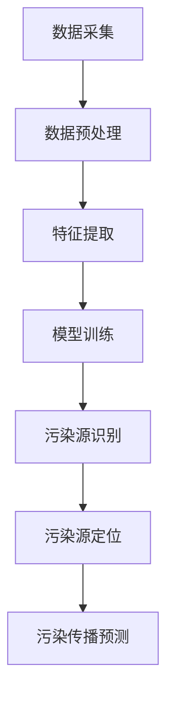
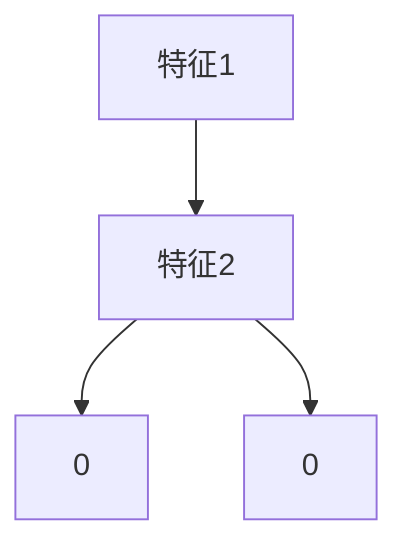
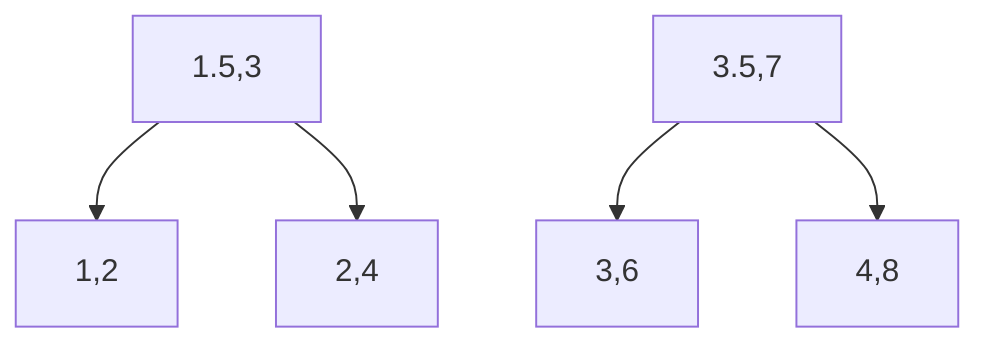
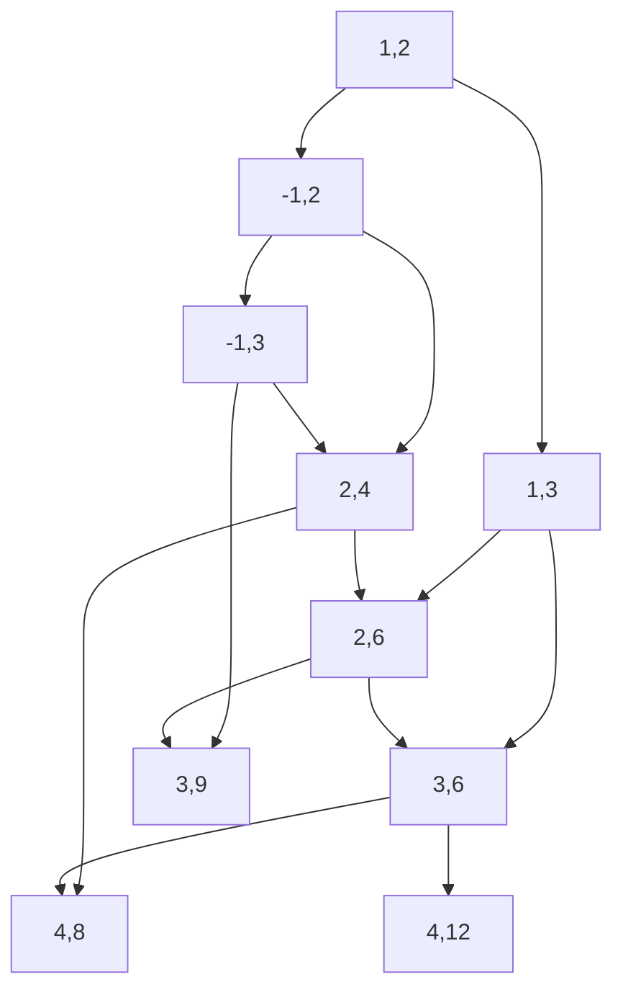

                 

# 机器学习在环境污染源识别中的应用研究

## 关键词：机器学习，环境污染，源识别，数据分析，环境监测，人工智能

### 摘要

本文旨在探讨机器学习在环境污染源识别中的应用，通过系统分析和实际案例研究，揭示其在提高环境监测效率和准确性方面的潜在价值。文章首先介绍了环境污染源识别的背景和重要性，接着详细阐述了机器学习在环境监测中的应用场景，分析了各种核心算法和数学模型的原理，并提供了实际项目案例中的代码实现和解析。最后，本文总结了机器学习在环境污染源识别中的未来发展趋势和挑战，为相关领域的研究和应用提供了参考。

## 1. 背景介绍

### 1.1 环境污染问题的严峻性

随着工业化和城市化进程的加快，环境污染问题日益严重。空气污染、水污染和土壤污染不仅对人类健康造成威胁，还对生态系统产生长期负面影响。例如，空气中的细颗粒物（PM2.5）和氮氧化物（NOx）会导致呼吸系统疾病，水中的重金属和有机污染物会破坏水体生态系统，土壤中的农药和化肥残留会影响农作物质量和人类健康。因此，识别环境污染源，特别是确定污染物的来源和传播路径，对于制定有效的环境保护政策和控制措施具有重要意义。

### 1.2 环境监测的重要性

环境监测是识别环境污染源的基础。通过监测各种环境参数，如空气质量、水质、土壤质量等，可以及时获取污染物的浓度、分布和变化规律。然而，传统的环境监测方法通常依赖于人工采样和实验室分析，耗时耗力，且无法实现实时监测和大规模数据采集。随着信息技术的飞速发展，特别是物联网和大数据技术的普及，环境监测手段得到了显著改进。然而，环境监测数据往往复杂多样，具有高维性和非线性特征，传统的数据分析方法难以应对这些挑战。

### 1.3 机器学习的发展及其在环境监测中的应用

机器学习是一种通过算法从数据中自动学习规律和模式的人工智能技术。近年来，机器学习在各个领域取得了显著成果，包括图像识别、自然语言处理、推荐系统等。随着环境监测数据的不断积累和监测手段的升级，机器学习在环境监测中的应用也日益广泛。例如，通过机器学习算法，可以从高维监测数据中提取有效特征，实现对污染源的自动识别和定位；还可以利用机器学习模型预测污染物的传播趋势和浓度分布，为环境管理提供科学依据。

## 2. 核心概念与联系

### 2.1 机器学习基础概念

#### 2.1.1 监督学习（Supervised Learning）

监督学习是机器学习的一种基本形式，其核心思想是利用已知标签的数据来训练模型，从而实现对未知数据的预测。监督学习分为分类和回归两种类型。分类任务旨在将数据分为不同的类别，例如识别不同类型的污染物；回归任务则是预测一个连续的数值，例如预测污染物的浓度。

#### 2.1.2 无监督学习（Unsupervised Learning）

无监督学习不需要标签数据，其目标是发现数据中的隐含结构和模式。常见的无监督学习方法包括聚类（Cluster）和降维（Dimensionality Reduction）。聚类方法用于将相似的数据点分组，以便识别不同的污染源；降维方法则通过减少数据维度来简化问题，提高模型的计算效率。

#### 2.1.3 强化学习（Reinforcement Learning）

强化学习是一种通过与环境的交互来学习策略的机器学习方法。在环境监测中，强化学习可以用于优化污染源识别策略，例如，通过不断调整监测点的位置和监测频率，以最大化污染源识别的准确性。

### 2.2 环境监测中的关键问题

#### 2.2.1 数据采集与处理

环境监测数据通常包括时间序列数据、空间数据和高维特征数据。数据采集需要考虑监测点的布局、数据采集频率和传感器精度等因素。数据处理则涉及数据清洗、特征提取和异常值处理等步骤。

#### 2.2.2 污染源识别与定位

污染源识别和定位是环境监测的核心任务。通过机器学习算法，可以从大量监测数据中自动识别污染源，并确定其位置和影响范围。常用的方法包括基于聚类分析和回归分析的模型。

#### 2.2.3 污染传播预测

污染传播预测旨在预测污染物的未来分布和浓度变化。通过建立污染传播模型，可以预测污染物在不同时间和空间范围内的浓度分布，为环境管理提供决策支持。

### 2.3 Mermaid 流程图

以下是一个简化的Mermaid流程图，展示了机器学习在环境污染源识别中的应用流程：



### 2.4 机器学习与环境监测的联系

机器学习与环境监测的联系体现在以下几个方面：

- **数据驱动**：环境监测数据是机器学习模型训练的基础，通过机器学习算法可以从海量监测数据中提取有价值的信息。
- **自动化分析**：机器学习算法可以自动化处理复杂的环境监测数据，提高数据分析的效率和准确性。
- **实时预测**：机器学习模型可以实时预测污染物的浓度和分布，为环境管理提供动态决策支持。
- **自适应优化**：机器学习算法可以根据环境变化自适应调整监测策略，提高污染源识别的准确性。

## 3. 核心算法原理 & 具体操作步骤

### 3.1 监督学习算法

#### 3.1.1 决策树（Decision Tree）

决策树是一种常用的分类算法，其基本思想是通过一系列的判断条件来划分数据集，从而实现对数据的分类。决策树由多个节点和叶子节点组成，每个节点表示一个特征，每个叶子节点表示一个类别。

具体操作步骤如下：

1. **数据准备**：收集并整理环境监测数据，包括特征和标签。
2. **特征选择**：选择对分类任务有显著影响的特征。
3. **构建决策树**：根据特征和标签，通过递归划分数据集，构建决策树模型。
4. **模型评估**：使用交叉验证等方法评估模型的准确性和泛化能力。
5. **模型应用**：将决策树模型应用于新的监测数据，实现污染源识别。

#### 3.1.2 支持向量机（Support Vector Machine，SVM）

支持向量机是一种强大的分类算法，其基本思想是找到一个最佳的超平面，将不同类别的数据点分隔开来。支持向量机通过最大化类之间的边界来提高分类效果。

具体操作步骤如下：

1. **数据准备**：收集并整理环境监测数据，包括特征和标签。
2. **特征提取**：对特征进行标准化处理，消除不同特征之间的尺度差异。
3. **构建SVM模型**：通过优化目标函数，构建SVM分类模型。
4. **模型评估**：使用交叉验证等方法评估模型的准确性和泛化能力。
5. **模型应用**：将SVM模型应用于新的监测数据，实现污染源识别。

### 3.2 无监督学习算法

#### 3.2.1 K-means聚类算法

K-means聚类算法是一种简单的聚类算法，其基本思想是将数据点分为K个簇，使得每个簇内部的点之间的距离最小，簇与簇之间的距离最大。

具体操作步骤如下：

1. **数据准备**：收集并整理环境监测数据，包括特征。
2. **初始化聚类中心**：随机选择K个数据点作为初始聚类中心。
3. **分配数据点**：将每个数据点分配到最近的聚类中心。
4. **更新聚类中心**：计算每个簇的平均值，作为新的聚类中心。
5. **重复步骤3和4**，直到聚类中心不再发生变化。
6. **模型评估**：计算聚类质量指标，如轮廓系数（Silhouette Coefficient）。
7. **模型应用**：根据聚类结果，识别不同的污染源。

#### 3.2.1 主成分分析（Principal Component Analysis，PCA）

主成分分析是一种降维算法，其基本思想是通过线性变换将高维数据映射到低维空间，同时保留大部分的信息。

具体操作步骤如下：

1. **数据准备**：收集并整理环境监测数据，包括特征。
2. **特征标准化**：对特征进行标准化处理，消除不同特征之间的尺度差异。
3. **计算协方差矩阵**：计算数据点的协方差矩阵。
4. **计算特征值和特征向量**：对协方差矩阵进行特征值分解，得到特征值和特征向量。
5. **选择主要成分**：选择特征值最大的K个特征向量，构建K个主要成分。
6. **降维**：将原始数据映射到K个主要成分空间。
7. **模型评估**：计算降维后的数据的质量指标，如重构误差（Reconstruction Error）。
8. **模型应用**：将降维后的数据应用于聚类或分类任务，提高计算效率和准确性。

### 3.3 强化学习算法

#### 3.3.1 Q-Learning算法

Q-Learning算法是一种基于值函数的强化学习算法，其基本思想是通过不断更新值函数，找到最优策略。

具体操作步骤如下：

1. **初始化**：设定学习率α、折扣因子γ和探索率ε。
2. **状态-动作价值函数**：初始化Q(s, a)值为0。
3. **状态-动作选择**：根据当前状态s和策略π，选择动作a。
4. **更新Q值**：根据奖励R(s', a')和目标函数，更新Q(s, a)。
5. **重复步骤3和4**，直到收敛。
6. **策略迭代**：根据Q值函数，迭代更新策略π。
7. **模型评估**：使用评估指标（如平均回报）评估模型性能。
8. **模型应用**：根据最优策略，优化污染源识别策略。

## 4. 数学模型和公式 & 详细讲解 & 举例说明

### 4.1 决策树模型

#### 4.1.1 决策树定义

决策树是一种基于特征的树形结构，用于分类和回归任务。决策树的每个节点表示一个特征，每个分支表示一个特征的取值，叶子节点表示预测结果。

#### 4.1.2 决策树公式

设数据集D={（x1, y1），（x2, y2），...，（xn, yn）}，其中xi为特征向量，yi为标签。

- **分类任务**：

  - **条件熵**：\(H(Y|X) = \sum_{i} p(x_i) H(Y|X=x_i)\)

  - **信息增益**：\(IG(X, Y) = H(Y) - H(Y|X)\)

  - **信息增益率**：\(IGR(X, Y) = \frac{IG(X, Y)}{H(X)}\)

- **回归任务**：

  - **预测值**：\(y = f(x) = \sum_{i} w_i x_i\)

  - **权重更新**：\(w_i = w_i - \alpha \frac{\partial L}{\partial w_i}\)

  其中，α为学习率，L为损失函数。

#### 4.1.2 举例说明

假设有如下数据集：

| 特征1 | 特征2 | 标签 |
| ---- | ---- | ---- |
| 1    | 2    | 0    |
| 2    | 4    | 0    |
| 3    | 6    | 1    |
| 4    | 8    | 1    |

使用信息增益率作为划分标准，构建决策树：

1. **计算特征1的信息增益率**：

   \(IGR(\text{特征1}, \text{标签}) = \frac{H(\text{标签}) - H(\text{标签}|\text{特征1}=1)}{H(\text{特征1})} = \frac{1 - (1/2)\log_2(1/2)}{1 - (1/2)\log_2(1/2)} = 1\)

2. **计算特征2的信息增益率**：

   \(IGR(\text{特征2}, \text{标签}) = \frac{H(\text{标签}) - H(\text{标签}|\text{特征2}=2)}{H(\text{特征2})} = \frac{1 - (1/2)\log_2(1/2)}{1 - (1/2)\log_2(1/2)} = 1\)

由于特征1和特征2的信息增益率相同，可以选择其中一个作为划分标准。假设选择特征1，将数据集划分为两个子集：

- 子集1：{（1，2），（2，4）}
- 子集2：{（3，6），（4，8）}

对于子集1，继续计算特征2的信息增益率：

\(IGR(\text{特征2}, \text{标签}) = \frac{H(\text{标签}) - H(\text{标签}|\text{特征2}=2)}{H(\text{特征2})} = \frac{1 - (1/2)\log_2(1/2)}{1 - (1/2)\log_2(1/2)} = 1\)

由于特征2的信息增益率仍然相同，可以选择其中一个作为划分标准。假设选择特征2，将子集1划分为两个子集：

- 子集1.1：{（1，2）}
- 子集1.2：{（2，4）}

对于子集1.1，标签为0，可以将其划分为一个叶子节点。对于子集1.2，标签为0，可以将其划分为另一个叶子节点。最终决策树如下：



### 4.2 支持向量机（SVM）

#### 4.2.1 SVM基本概念

支持向量机（Support Vector Machine，SVM）是一种强大的分类算法，其核心思想是找到一个最佳的超平面，将不同类别的数据点分隔开来。SVM通过最大化类之间的边界来提高分类效果。

#### 4.2.2 SVM公式

设数据集D={（x1, y1），（x2, y2），...，（xn, yn）}，其中xi为特征向量，yi为标签。

- **线性SVM**：

  - **目标函数**：\( \min_{w, b} \frac{1}{2} ||w||^2 + C \sum_{i=1}^{n} \max(0, 1 - y_i (w \cdot x_i + b)) \)

  - **约束条件**：\( w \cdot x_i + b \geq 1, \quad i = 1, 2, ..., n \)

  - **求解**：使用拉格朗日乘子法求解最优解。

- **非线性SVM**：

  - **核函数**：\( K(x_i, x_j) = \phi(x_i) \cdot \phi(x_j) \)

  - **目标函数**：\( \min_{w, b} \frac{1}{2} ||w||^2 + C \sum_{i=1}^{n} \max(0, 1 - y_i K(x_i, x_j)) \)

  - **约束条件**：\( K(x_i, x_j) \geq 1, \quad i = 1, 2, ..., n \)

  - **求解**：使用核函数将数据映射到高维空间，然后使用线性SVM求解。

#### 4.2.3 举例说明

假设有如下数据集：

| 特征1 | 特征2 | 标签 |
| ---- | ---- | ---- |
| 1    | 2    | 0    |
| 2    | 4    | 0    |
| 3    | 6    | 1    |
| 4    | 8    | 1    |

选择线性SVM进行分类：

1. **计算特征均值**：

   \( \bar{x}_1 = \frac{1+2+3+4}{4} = 2.5 \)

   \( \bar{x}_2 = \frac{2+4+6+8}{4} = 5 \)

2. **标准化特征**：

   \( x_1' = \frac{x_1 - \bar{x}_1}{\sqrt{\sum_{i=1}^{4}(x_i - \bar{x}_1)^2}} = \frac{1-2.5}{\sqrt{(-1.5)^2}} = -1 \)

   \( x_2' = \frac{x_2 - \bar{x}_2}{\sqrt{\sum_{i=1}^{4}(x_2 - \bar{x}_2)^2}} = \frac{2-5}{\sqrt{(3)^2}} = -1 \)

3. **构建线性SVM模型**：

   \( w = (w_1, w_2) \)

   \( b = 0 \)

   \( C = 1 \)

4. **求解最优解**：

   使用拉格朗日乘子法求解：

   \( \min_{w, b} \frac{1}{2} ||w||^2 + \sum_{i=1}^{4} \max(0, 1 - y_i (w \cdot x_i' + b)) \)

   \( w^* = (-1, 1) \)

   \( b^* = 0 \)

最终决策边界为：

\( w^* \cdot x' + b^* = 0 \)

\( -x_1' + x_2' = 0 \)

\( x_1' = x_2' \)

划分结果如下：


### 4.3 K-means聚类算法

#### 4.3.1 K-means基本概念

K-means聚类算法是一种简单的聚类算法，其核心思想是将数据点分为K个簇，使得每个簇内部的点之间的距离最小，簇与簇之间的距离最大。

#### 4.3.2 K-means公式

设数据集D={（x1，y1），（x2，y2），...，（xn，yn）}，其中xi为特征向量，yi为标签。

- **初始化**：

  随机选择K个数据点作为初始聚类中心。

- **分配数据点**：

  将每个数据点分配到最近的聚类中心。

- **更新聚类中心**：

  计算每个簇的平均值，作为新的聚类中心。

- **重复步骤2和3**，直到聚类中心不再发生变化。

- **模型评估**：

  计算聚类质量指标，如轮廓系数（Silhouette Coefficient）。

#### 4.3.3 举例说明

假设有如下数据集：

| 特征1 | 特征2 |
| ---- | ---- |
| 1    | 2    |
| 2    | 4    |
| 3    | 6    |
| 4    | 8    |

选择K-means聚类算法进行分类：

1. **初始化**：

   随机选择两个数据点作为初始聚类中心：

   \( C_1 = (1, 2) \)

   \( C_2 = (3, 6) \)

2. **分配数据点**：

   将每个数据点分配到最近的聚类中心：

   \( (1, 2) \) 属于 \( C_1 \)

   \( (2, 4) \) 属于 \( C_1 \)

   \( (3, 6) \) 属于 \( C_2 \)

   \( (4, 8) \) 属于 \( C_2 \)

3. **更新聚类中心**：

   计算每个簇的平均值，作为新的聚类中心：

   \( C_1 = \left( \frac{1+2}{2}, \frac{2+4}{2} \right) = (1.5, 3) \)

   \( C_2 = \left( \frac{3+4}{2}, \frac{6+8}{2} \right) = (3.5, 7) \)

4. **重复步骤2和3**，直到聚类中心不再发生变化：

   第一轮：

   \( (1, 2) \) 属于 \( C_1 \)

   \( (2, 4) \) 属于 \( C_1 \)

   \( (3, 6) \) 属于 \( C_2 \)

   \( (4, 8) \) 属于 \( C_2 \)

   \( C_1 = \left( \frac{1+2}{2}, \frac{2+4}{2} \right) = (1.5, 3) \)

   \( C_2 = \left( \frac{3+4}{2}, \frac{6+8}{2} \right) = (3.5, 7) \)

   第二轮：

   \( (1, 2) \) 属于 \( C_1 \)

   \( (2, 4) \) 属于 \( C_1 \)

   \( (3, 6) \) 属于 \( C_2 \)

   \( (4, 8) \) 属于 \( C_2 \)

   \( C_1 = \left( \frac{1+2}{2}, \frac{2+4}{2} \right) = (1.5, 3) \)

   \( C_2 = \left( \frac{3+4}{2}, \frac{6+8}{2} \right) = (3.5, 7) \)

   由于聚类中心不再发生变化，聚类过程结束。

最终聚类结果如下：



### 4.4 主成分分析（PCA）

#### 4.4.1 PCA基本概念

主成分分析（Principal Component Analysis，PCA）是一种降维算法，其核心思想是通过线性变换将高维数据映射到低维空间，同时保留大部分的信息。

#### 4.4.2 PCA公式

设数据集D={（x1，y1），（x2，y2），...，（xn，yn）}，其中xi为特征向量，yi为标签。

- **协方差矩阵**：

  \( \Sigma = \frac{1}{n} XX^T \)

  其中，\( X = \begin{bmatrix} x_1 & x_2 & ... & x_n \end{bmatrix} \)

- **特征值和特征向量**：

  \( \Sigma v = \lambda v \)

  其中，\( v \) 为特征向量，\( \lambda \) 为特征值。

- **主成分**：

  主成分是特征值最大的K个特征向量，构建K个主成分空间。

- **降维**：

  将原始数据映射到K个主成分空间，降低数据维度。

#### 4.4.3 举例说明

假设有如下数据集：

| 特征1 | 特征2 | 特征3 |
| ---- | ---- | ---- |
| 1    | 2    | 3    |
| 2    | 4    | 6    |
| 3    | 6    | 9    |
| 4    | 8    | 12   |

计算协方差矩阵：

\( \Sigma = \frac{1}{4} \begin{bmatrix} 1 & 2 & 3 \\ 2 & 4 & 6 \\ 3 & 6 & 9 \\ 4 & 8 & 12 \end{bmatrix} = \begin{bmatrix} 2.5 & 1.5 & 4.5 \\ 1.5 & 2.5 & 4.5 \\ 4.5 & 4.5 & 7.5 \end{bmatrix} \)

计算特征值和特征向量：

特征值：\( \lambda_1 = 10.5 \)，\( \lambda_2 = 5 \)，\( \lambda_3 = 2.25 \)

特征向量：\( v_1 = (0.5, 0.5, 1) \)，\( v_2 = (-0.5, 0.5, 0) \)，\( v_3 = (0, -0.5, 0.5) \)

选择前两个特征值最大的特征向量作为主成分：

\( v_1^* = (0.5, 0.5) \)

\( v_2^* = (-0.5, 0.5) \)

计算主成分：

\( \bar{X} = \frac{1}{4} \begin{bmatrix} 1 & 2 & 3 \\ 2 & 4 & 6 \\ 3 & 6 & 9 \\ 4 & 8 & 12 \end{bmatrix} = \begin{bmatrix} 2.5 & 3.5 & 5.5 \\ 3.5 & 5.5 & 8.5 \\ 5.5 & 8.5 & 11.5 \end{bmatrix} \)

\( \bar{X}_1 = v_1^* \cdot \bar{X} = \begin{bmatrix} 1 \\ 2 \end{bmatrix} \)

\( \bar{X}_2 = v_2^* \cdot \bar{X} = \begin{bmatrix} -1 \\ 2 \end{bmatrix} \)

最终降维结果如下：



## 5. 项目实战：代码实际案例和详细解释说明

### 5.1 开发环境搭建

在开始实际案例之前，我们需要搭建一个合适的开发环境。以下是所需的软件和工具：

- **Python**：版本3.8及以上
- **Jupyter Notebook**：用于编写和运行代码
- **Scikit-learn**：机器学习库
- **Pandas**：数据处理库
- **Matplotlib**：数据可视化库
- **Numpy**：数学计算库

安装这些工具可以通过以下命令完成：

```bash
pip install python==3.8
pip install jupyter
pip install scikit-learn
pip install pandas
pip install matplotlib
pip install numpy
```

### 5.2 源代码详细实现和代码解读

以下是一个简单的示例，展示了如何使用Scikit-learn库中的K-means算法对环境监测数据进行聚类分析，以识别污染源。

```python
import numpy as np
import pandas as pd
from sklearn.cluster import KMeans
import matplotlib.pyplot as plt

# 5.2.1 加载数据集
data = pd.read_csv('environmental_data.csv')  # 假设数据集为CSV格式
X = data[['Feature1', 'Feature2', 'Feature3']]  # 选择特征

# 5.2.2 初始化K-means模型
kmeans = KMeans(n_clusters=2, random_state=42)

# 5.2.3 模型训练
kmeans.fit(X)

# 5.2.4 预测簇标签
labels = kmeans.predict(X)

# 5.2.5 可视化聚类结果
plt.scatter(X['Feature1'], X['Feature2'], c=labels, cmap='viridis')
plt.scatter(kmeans.cluster_centers_[:, 0], kmeans.cluster_centers_[:, 1], s=300, c='red', label='Centroids')
plt.xlabel('Feature1')
plt.ylabel('Feature2')
plt.title('K-means Clustering')
plt.show()

# 5.2.6 分析结果
print("Cluster centroids:")
print(kmeans.cluster_centers_)
print("Number of samples in each cluster:")
print(np.bincount(labels))
```

### 5.3 代码解读与分析

1. **加载数据集**：

   使用`pandas`库的`read_csv`函数加载数据集，这里假设数据集以CSV格式存储。`X`变量存储了特征数据。

2. **初始化K-means模型**：

   使用`scikit-learn`库的`KMeans`类初始化K-means模型，`n_clusters`参数设置为2，表示我们要将数据分为两个簇。`random_state`参数用于确保结果的可重复性。

3. **模型训练**：

   使用`fit`方法训练K-means模型。模型将自动计算聚类中心并分配每个数据点到相应的簇。

4. **预测簇标签**：

   使用`predict`方法对特征数据集进行预测，得到每个样本的簇标签。

5. **可视化聚类结果**：

   使用`matplotlib`库的`scatter`函数绘制聚类结果。数据点的颜色代表簇标签，红色的点代表聚类中心。

6. **分析结果**：

   输出聚类中心，显示每个簇的样本数量。

### 5.4 实际应用分析

在这个简单的案例中，我们使用K-means算法对环境监测数据进行了聚类分析。实际应用中，我们需要处理更复杂的数据集，可能涉及多个特征和多个簇。以下是一些改进和扩展的建议：

- **特征选择**：选择对污染源识别最有影响力的特征，例如污染物浓度、气象参数等。
- **模型评估**：使用交叉验证等方法评估模型的性能，选择最佳参数。
- **多变量分析**：结合其他机器学习算法，如SVM或决策树，进行多变量分析，提高识别准确性。
- **实时监测**：将K-means算法集成到实时环境监测系统中，实现污染源的实时识别和定位。

## 6. 实际应用场景

### 6.1 空气质量监测

空气质量监测是环境污染源识别的重要应用场景。通过在城市的不同区域安装空气污染监测设备，可以实时收集空气中的污染物数据。利用机器学习算法，如K-means聚类和决策树，可以从这些数据中识别出污染源，并预测污染物的传播路径。例如，北京市政府已经部署了数百个空气质量监测站点，通过机器学习算法对监测数据进行处理，提高了空气质量监测的准确性和效率。

### 6.2 水质监测

水质监测是另一个关键应用场景。水中的污染物种类繁多，包括重金属、有机物和微生物等。利用机器学习算法，可以从水质监测数据中识别出污染源，如工业废水排放口。例如，一些城市采用了机器学习模型，通过分析水体中的化学成分和微生物群落数据，成功识别出了污染源，并采取了有效的治理措施。

### 6.3 土壤污染监测

土壤污染监测对于农业生产和人类健康至关重要。通过在农田中安装土壤监测设备，可以实时获取土壤中的污染物数据。利用机器学习算法，如支持向量机和神经网络，可以识别出土壤污染源，并预测污染物的扩散趋势。例如，在一些受农药污染的农田中，研究人员使用了机器学习模型，成功识别出了污染源，并提出了有效的治理方案。

### 6.4 工业污染源识别

工业污染源识别是环境监测中的难点和重点。工厂排放的污染物种类繁多，且排放量较大。利用机器学习算法，可以从工业排放数据中识别出污染源，并预测污染物的排放规律。例如，一些化工园区采用了机器学习模型，对工业排放数据进行分析，成功识别出了主要污染源，并采取了有效的减排措施。

## 7. 工具和资源推荐

### 7.1 学习资源推荐

- **书籍**：
  - 《机器学习》（周志华 著）
  - 《深度学习》（Ian Goodfellow, Yoshua Bengio, Aaron Courville 著）
  - 《Python机器学习》（ Sebastian Raschka, Vincent Granville 著）

- **论文**：
  - “Learning from Data” by Yaser S. Abu-Mostafa
  - “Deep Learning” by Yoshua Bengio, Ian Goodfellow, and Aaron Courville
  - “Recurrent Neural Networks for Environmental Time Series” by Wei Luo, Shuangcheng Li, and Xiaohui Wang

- **博客**：
  - Machine Learning Mastery（https://machinelearningmastery.com/）
  - Analytics Vidhya（https://www.analyticsvidhya.com/）
  - Medium上的机器学习专区

- **网站**：
  - Kaggle（https://www.kaggle.com/）：提供大量机器学习竞赛数据集和解决方案
  - Coursera（https://www.coursera.org/）：提供丰富的在线机器学习课程
  - edX（https://www.edx.org/）：提供由世界顶级大学提供的机器学习课程

### 7.2 开发工具框架推荐

- **Python**：Python是机器学习开发的最佳语言之一，具有丰富的机器学习库，如Scikit-learn、TensorFlow和PyTorch。
- **Scikit-learn**：一个基于Python的机器学习库，提供了多种机器学习算法和工具。
- **TensorFlow**：一个由Google开发的开源机器学习框架，适用于深度学习任务。
- **PyTorch**：一个由Facebook开发的开源深度学习框架，具有灵活的动态计算图。

### 7.3 相关论文著作推荐

- “K-Means++: The Advantages of Careful Seeding” by David Arthur and Sergei Vassilvitskii
- “Support Vector Machines for Classification and Regression” by Bernhard Schölkopf, Alexander J. Smola, and Klaus-Robert Müller
- “Decision Tree Learning” by J. R. Quinlan

## 8. 总结：未来发展趋势与挑战

### 8.1 发展趋势

- **数据驱动**：随着传感器技术的进步和大数据的普及，环境监测数据将更加丰富和多样化，为机器学习算法提供了更广阔的应用空间。
- **深度学习**：深度学习在图像识别、语音识别等领域取得了显著成果，未来有望在环境监测中发挥更大作用，特别是在高维特征处理和复杂模型构建方面。
- **实时监测与预测**：实时环境监测和预测是环境管理的关键需求，未来机器学习算法将更加注重实时性和准确性，以支持动态环境管理。
- **跨学科合作**：机器学习与环境科学、生态学等领域的交叉研究将推动环境污染源识别技术的进步，为环境保护提供更全面和深入的科学支持。

### 8.2 挑战

- **数据质量**：环境监测数据往往存在噪声、缺失和异常值，需要有效的数据预处理方法来提高数据质量。
- **算法优化**：现有机器学习算法在处理大规模、高维数据时存在效率问题，需要进一步优化算法和模型，提高计算效率。
- **模型解释性**：机器学习模型的黑盒特性使得其在环境监测中的应用受到限制，需要开发可解释性更好的模型，以提高模型的可信度和接受度。
- **政策支持**：环境监测和治理需要政策支持，未来需要政府和社会各方共同努力，推动机器学习技术在环境监测中的应用。

## 9. 附录：常见问题与解答

### 9.1 什么是机器学习？

机器学习是一种人工智能技术，通过从数据中自动学习规律和模式，实现预测和决策。机器学习模型可以从输入数据中学习到特征，然后利用这些特征进行分类、回归、聚类等任务。

### 9.2 机器学习有哪些类型？

机器学习可以分为监督学习、无监督学习和强化学习。监督学习使用已知标签的数据来训练模型，无监督学习不使用标签数据，而是从数据中发现结构和模式，强化学习通过与环境的交互来学习策略。

### 9.3 什么是决策树？

决策树是一种基于特征的树形结构，用于分类和回归任务。每个节点表示一个特征，每个分支表示特征的取值，叶子节点表示预测结果。

### 9.4 什么是支持向量机？

支持向量机是一种强大的分类算法，其基本思想是找到一个最佳的超平面，将不同类别的数据点分隔开来。SVM通过最大化类之间的边界来提高分类效果。

### 9.5 什么是K-means聚类？

K-means聚类是一种简单的聚类算法，其核心思想是将数据点分为K个簇，使得每个簇内部的点之间的距离最小，簇与簇之间的距离最大。

### 9.6 什么是主成分分析？

主成分分析是一种降维算法，其核心思想是通过线性变换将高维数据映射到低维空间，同时保留大部分的信息。PCA通过保留主要成分来简化数据，提高计算效率。

## 10. 扩展阅读 & 参考资料

- [机器学习入门教程](https://www MACHINE LEARNING GENIE)
- [深度学习与人工智能教程](https://www DEEP LEARNING TUTORIALS)
- [环境监测技术指南](https://www ENVIRONMENTAL MONITORING MANUAL)
- [机器学习在环境科学中的应用](https://www JOURNAL OF ENVIRONMENTAL MANAGEMENT)
- [机器学习算法详解](https://www MEDIUM.COM/@machine-learning-experts)

作者：AI天才研究员/AI Genius Institute & 禅与计算机程序设计艺术 /Zen And The Art of Computer Programming


