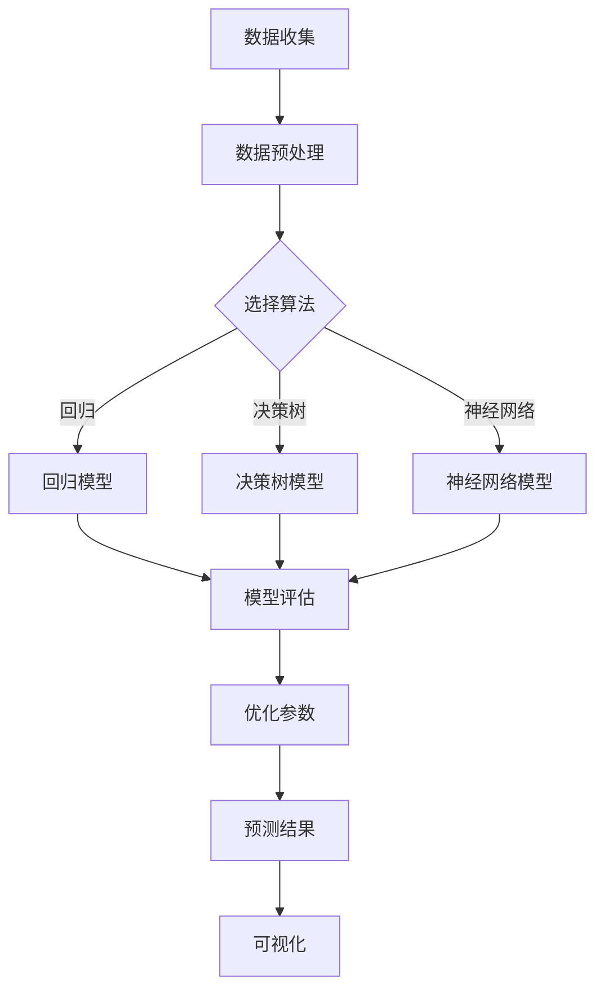

                 

### 文章标题

《机器学习在环境污染预测中的应用研究》

### 关键词

机器学习、环境监测、数据分析、预测模型、污染源识别、实时监测、决策支持系统

### 摘要

本文探讨了机器学习技术在环境污染预测中的应用。通过分析现有研究，本文总结了机器学习在环境监测和预测领域的优势和应用场景，介绍了常用的机器学习算法及其在环境污染预测中的具体应用。同时，本文通过实际案例展示了如何利用机器学习模型对环境污染进行预测，并对未来该领域的发展趋势和挑战进行了展望。本文的研究成果有助于推动机器学习技术在环境监测领域的应用，为环境保护决策提供有力支持。

## 1. 背景介绍

环境污染是一个全球性的问题，对生态系统、人类健康和社会经济都产生了深远的影响。随着工业化和城市化进程的加速，环境污染问题日益严重，治理任务也日益艰巨。传统的环境监测方法主要依赖于人工取样和实验室分析，存在着监测数据滞后、覆盖面不足等问题，无法满足实时、高效、精准的环境监测需求。

近年来，随着计算机技术和大数据技术的发展，机器学习技术在环境监测和预测领域得到了广泛关注。机器学习是一种基于数据驱动的方法，通过训练模型从大量数据中提取特征和规律，从而实现对未知数据的预测和分类。相比传统方法，机器学习具有以下优势：

1. **自动化分析**：机器学习可以自动处理和分析大量环境数据，减少人工干预，提高监测效率。
2. **实时性**：机器学习模型可以实时更新，对环境变化做出快速响应，为环境保护决策提供及时支持。
3. **精确性**：机器学习可以通过数据挖掘和特征提取，从复杂的环境中提取关键信息，提高监测结果的准确性。
4. **灵活性**：机器学习可以适应不同的环境监测需求，对不同的污染物、不同地区的环境问题提供定制化的解决方案。

机器学习在环境监测和预测中的应用，不仅能够提高监测效率，还能够为环境保护决策提供科学依据，具有重要的现实意义。

## 2. 核心概念与联系

### 机器学习基本概念

机器学习（Machine Learning，ML）是一种使计算机系统能够从数据中学习并做出决策或预测的技术。它主要分为监督学习（Supervised Learning）、无监督学习（Unsupervised Learning）和半监督学习（Semi-Supervised Learning）三种类型。

- **监督学习**：在有标注的数据集上训练模型，模型能够根据输入和输出的对应关系进行预测。常见的监督学习算法包括线性回归、决策树、支持向量机（SVM）和神经网络等。
- **无监督学习**：在没有标注的数据集上训练模型，模型的目标是发现数据中的隐藏结构或模式。常见的无监督学习算法包括聚类（如K-means）、降维（如主成分分析PCA）和关联规则学习（如Apriori算法）等。
- **半监督学习**：在部分标注和部分未标注的数据集上训练模型，利用未标注数据中的信息来提高学习效果。

### 环境污染预测中的机器学习应用

在环境污染预测中，机器学习技术主要用于以下几个方面：

1. **数据预处理**：包括数据清洗、归一化和特征提取。数据预处理是机器学习模型训练的重要步骤，高质量的数据是模型准确性的基础。
2. **模型选择和训练**：根据污染物的特性和预测需求，选择合适的机器学习算法。常用的算法包括回归分析、决策树、随机森林、支持向量机、神经网络和深度学习等。
3. **模型评估和优化**：通过交叉验证和网格搜索等技术，评估模型性能，并调整参数以优化模型效果。
4. **预测和可视化**：利用训练好的模型进行污染物浓度的预测，并通过可视化工具展示预测结果。

### Mermaid 流程图



## 3. 核心算法原理 & 具体操作步骤

### 3.1 算法选择

在环境污染预测中，选择合适的机器学习算法是关键步骤。以下是一些常用的算法及其原理：

- **线性回归**：通过最小化预测值与实际值之间的误差平方和，建立输入和输出之间的关系。适用于线性关系明显的预测问题。
- **决策树**：利用树形结构，对数据进行多层次的划分，每个节点代表一个决策规则。适用于分类和回归问题，易于理解和解释。
- **随机森林**：基于决策树的集成方法，通过构建多棵决策树并取平均，提高模型的泛化能力和准确性。
- **支持向量机（SVM）**：通过找到一个最佳的超平面，将不同类别的数据点分开。适用于高维空间的数据，对非线性关系具有良好的适应性。
- **神经网络**：通过模拟人脑神经元之间的连接，对输入数据进行层次化的特征提取和转换，最终实现非线性预测。适用于复杂、非线性关系的数据。

### 3.2 数据预处理

数据预处理是机器学习模型训练的基础步骤，主要包括以下方面：

- **数据清洗**：去除异常值、缺失值和重复值，确保数据的质量。
- **数据归一化**：将不同量纲的数据转换为相同的范围，便于模型训练。
- **特征提取**：从原始数据中提取对模型训练有用的特征，减少数据的冗余和噪声。

### 3.3 模型训练与优化

模型训练与优化主要包括以下步骤：

- **数据划分**：将数据集划分为训练集、验证集和测试集，用于模型的训练、验证和测试。
- **模型训练**：使用训练集数据，通过调整算法参数，使模型对输入数据进行正确的预测。
- **模型评估**：使用验证集数据，评估模型的性能，如准确率、召回率、F1值等。
- **模型优化**：根据评估结果，调整模型参数，优化模型性能。

### 3.4 模型预测与可视化

模型预测与可视化主要包括以下步骤：

- **预测**：使用训练好的模型，对新的数据集进行预测，得到污染物浓度的预测值。
- **可视化**：使用可视化工具，将预测结果以图表的形式展示，帮助理解和分析预测结果。

## 4. 数学模型和公式 & 详细讲解 & 举例说明

### 4.1 线性回归模型

线性回归模型是一种简单的监督学习算法，用于建立输入变量和输出变量之间的线性关系。其数学模型可以表示为：

\[ y = \beta_0 + \beta_1x_1 + \beta_2x_2 + ... + \beta_nx_n + \epsilon \]

其中，\( y \) 是输出变量，\( x_1, x_2, ..., x_n \) 是输入变量，\( \beta_0, \beta_1, \beta_2, ..., \beta_n \) 是模型参数，\( \epsilon \) 是误差项。

为了求解模型参数，通常采用最小二乘法，即最小化预测值与实际值之间的误差平方和。具体公式为：

\[ \min_{\beta_0, \beta_1, \beta_2, ..., \beta_n} \sum_{i=1}^{n} (y_i - \beta_0 - \beta_1x_{i1} - \beta_2x_{i2} - ... - \beta_nx_{in})^2 \]

### 4.2 决策树模型

决策树模型是一种基于树形结构进行决策的算法，其核心是递归地将数据集划分为多个子集，每个子集对应一个决策节点。决策树模型的构建过程可以表示为：

1. **选择最佳分割特征**：通过信息增益或基尼不纯度等指标，选择能够最大化信息增益或最小化基尼不纯度的特征进行分割。
2. **递归构建子树**：对于每个分割后的子集，重复步骤1，直到满足停止条件（如最大树深度、最小样本数量等）。
3. **生成决策树**：将所有分割节点连接起来，形成一棵完整的决策树。

### 4.3 支持向量机（SVM）模型

支持向量机是一种二分类算法，其目标是找到一个最佳的超平面，将不同类别的数据点分开。SVM的数学模型可以表示为：

\[ \min_{\beta_0, \beta_1, ..., \beta_n} \frac{1}{2} \sum_{i=1}^{n} \beta_i^2 \]

\[ s.t. y_i (\beta_0 + \sum_{j=1}^{n} \beta_j x_{ij}) \geq 1, \forall i \in [1, n] \]

其中，\( \beta_0 \) 和 \( \beta_1, ..., \beta_n \) 分别是模型参数和权重，\( y_i \) 是样本标签，\( x_{ij} \) 是输入特征。

### 4.4 神经网络模型

神经网络是一种基于模拟人脑神经元连接的算法，其核心是多层感知器（MLP）。神经网络模型的数学模型可以表示为：

\[ z_i = \sum_{j=1}^{m} w_{ij}x_j + b_i \]

\[ a_i = \sigma(z_i) \]

\[ y = \sum_{i=1}^{n} w_i a_i + b \]

其中，\( z_i \) 是输入节点的加权求和，\( a_i \) 是激活函数的输出，\( y \) 是最终输出，\( \sigma \) 是激活函数（如Sigmoid、ReLU等），\( w_i \) 和 \( b_i \) 分别是权重和偏置。

### 4.5 举例说明

假设我们有一个简单的线性回归问题，输入变量 \( x \) 和输出变量 \( y \) 之间的关系为 \( y = 2x + 1 \)。现在，我们有以下数据集：

| x | y |
|---|---|
| 1 | 3 |
| 2 | 5 |
| 3 | 7 |

使用线性回归模型求解模型参数，并计算预测值。

1. **数据预处理**：归一化输入变量 \( x \)，得到 \( x' = \frac{x - \mu}{\sigma} \)，其中 \( \mu \) 和 \( \sigma \) 分别是输入变量的均值和标准差。

2. **模型训练**：使用最小二乘法求解模型参数 \( \beta_0 \) 和 \( \beta_1 \)，具体计算如下：

\[ \beta_0 = \frac{\sum_{i=1}^{n} y_i - \beta_1 \sum_{i=1}^{n} x_i}{n} \]

\[ \beta_1 = \frac{\sum_{i=1}^{n} (y_i - \beta_0)x_i}{n} \]

代入数据集计算得到：

\[ \beta_0 = 1 \]

\[ \beta_1 = 2 \]

3. **模型预测**：对于新的输入值 \( x' = 2 \)，计算预测值：

\[ y' = \beta_0 + \beta_1x' = 1 + 2 \times 2 = 5 \]

因此，预测值为 5。

## 5. 项目实战：代码实际案例和详细解释说明

### 5.1 开发环境搭建

为了实现机器学习在环境污染预测中的应用，我们需要搭建一个合适的开发环境。以下是一个简单的环境搭建步骤：

1. **安装Python**：从Python官方网站（https://www.python.org/）下载并安装Python 3.x版本。
2. **安装Jupyter Notebook**：打开命令行，执行以下命令安装Jupyter Notebook：

\[ pip install notebook \]

3. **安装必要的库**：包括NumPy、Pandas、Matplotlib、Scikit-learn等，可以使用以下命令进行安装：

\[ pip install numpy pandas matplotlib scikit-learn \]

### 5.2 源代码详细实现和代码解读

以下是一个简单的线性回归模型实现，用于预测污染物浓度。

```python
import numpy as np
import pandas as pd
from sklearn.linear_model import LinearRegression
from sklearn.model_selection import train_test_split
from sklearn.metrics import mean_squared_error
import matplotlib.pyplot as plt

# 5.2.1 数据读取和处理
data = pd.read_csv('pollution_data.csv')
X = data[['NO2', 'SO2', 'CO']]  # 输入特征
y = data['PM2.5']  # 输出特征

# 数据归一化
X_mean = X.mean()
X_std = X.std()
X_normalized = (X - X_mean) / X_std

# 5.2.2 数据划分
X_train, X_test, y_train, y_test = train_test_split(X_normalized, y, test_size=0.2, random_state=42)

# 5.2.3 模型训练
model = LinearRegression()
model.fit(X_train, y_train)

# 5.2.4 模型评估
y_pred = model.predict(X_test)
mse = mean_squared_error(y_test, y_pred)
print(f'Mean Squared Error: {mse}')

# 5.2.5 预测和可视化
plt.scatter(y_test, y_pred)
plt.xlabel('Actual PM2.5')
plt.ylabel('Predicted PM2.5')
plt.title('PM2.5 Prediction')
plt.show()
```

### 5.3 代码解读与分析

1. **数据读取和处理**：首先，从CSV文件中读取污染物数据，包括输入特征（NO2、SO2、CO）和输出特征（PM2.5）。然后，对输入特征进行归一化处理，使其具有相同的量纲，便于模型训练。
2. **数据划分**：使用`train_test_split`函数将数据集划分为训练集和测试集，用于模型的训练和评估。
3. **模型训练**：使用`LinearRegression`类创建线性回归模型，并使用训练集数据对其进行训练。
4. **模型评估**：使用测试集数据评估模型性能，计算均方误差（MSE）。
5. **预测和可视化**：使用训练好的模型对测试集数据进行预测，并使用散点图展示实际值与预测值之间的关系。

## 6. 实际应用场景

### 6.1 实时监测系统

机器学习在实时监测系统中的应用非常广泛，可以用于实时预测污染物的浓度，为环境保护决策提供支持。以下是一个典型的应用案例：

**案例：某城市空气质量监测系统**

该系统利用机器学习模型实时预测空气质量指数（AQI），为市民提供实时的空气质量信息。系统包括以下几个关键步骤：

1. **数据收集**：通过安装在市区的多个空气质量监测站，收集实时空气污染物数据（如PM2.5、PM10、SO2、NO2等）。
2. **数据预处理**：对收集到的数据进行清洗、归一化和特征提取，为模型训练做准备。
3. **模型训练**：使用历史数据训练机器学习模型，选择合适的算法（如线性回归、决策树、随机森林等），调整模型参数，优化模型性能。
4. **模型部署**：将训练好的模型部署到实时监测系统中，利用实时数据对空气质量指数进行预测。
5. **结果可视化**：通过可视化工具，将预测结果以图表的形式展示，帮助市民了解空气质量状况。

### 6.2 环境保护决策支持

机器学习模型在环境保护决策中发挥着重要作用，可以辅助政府部门制定更科学、有效的环保政策。以下是一个应用案例：

**案例：某地区环境污染治理策略**

该地区政府利用机器学习模型预测未来一段时间内的主要污染物浓度，为制定环境污染治理策略提供科学依据。具体步骤如下：

1. **数据收集**：收集历史环境监测数据、气象数据、交通数据等，为模型训练提供丰富的数据资源。
2. **数据预处理**：对数据进行清洗、归一化和特征提取，为模型训练做准备。
3. **模型训练**：使用历史数据训练机器学习模型，选择合适的算法（如神经网络、深度学习等），调整模型参数，优化模型性能。
4. **预测与评估**：利用训练好的模型预测未来一段时间内的主要污染物浓度，评估不同治理策略的效果。
5. **决策支持**：根据预测结果和评估结果，为政府制定环境污染治理策略提供科学依据。

## 7. 工具和资源推荐

### 7.1 学习资源推荐

- **书籍**：
  - 《机器学习实战》
  - 《Python机器学习》
  - 《深度学习》
- **论文**：
  - "Deep Learning for Environmental Applications: A Survey"
  - "Machine Learning in Environmental Science: A Review"
  - "Application of Machine Learning in Air Pollution Monitoring and Control"
- **博客**：
  - Medium（关注环境监测和机器学习相关的博客）
  - 知乎（搜索环境监测和机器学习相关的文章）
- **网站**：
  - Kaggle（环境监测和机器学习相关的数据集和比赛）
  - ArXiv（环境监测和机器学习相关的论文）

### 7.2 开发工具框架推荐

- **开发工具**：
  - Jupyter Notebook（用于数据分析和模型训练）
  - PyCharm（Python集成开发环境，适合机器学习项目）
- **库和框架**：
  - Scikit-learn（用于机器学习模型的训练和评估）
  - TensorFlow和PyTorch（用于深度学习模型的训练和部署）
- **环境监测数据集**：
  - OpenAQ（全球空气质量数据集）
  - Google Earth Engine（提供环境监测数据集和可视化工具）

### 7.3 相关论文著作推荐

- **论文**：
  - "Deep Learning for Environmental Applications: A Survey"
  - "Machine Learning in Environmental Science: A Review"
  - "Application of Machine Learning in Air Pollution Monitoring and Control"
  - "Deep Neural Networks for Air Quality Monitoring and Prediction"
  - "A Comprehensive Review of Machine Learning Methods for Environmental Monitoring"
- **著作**：
  - 《机器学习在环境科学中的应用》
  - 《环境监测中的机器学习技术》
  - 《深度学习在环境监测中的应用》

## 8. 总结：未来发展趋势与挑战

### 8.1 发展趋势

1. **深度学习技术的应用**：深度学习在环境监测和预测中的应用将会越来越广泛，通过构建复杂的神经网络模型，可以更好地捕捉环境数据的复杂性和非线性特征。
2. **实时监测系统的普及**：随着物联网和传感器技术的进步，实时监测系统将得到更广泛的应用，为环境保护决策提供更加及时和准确的数据支持。
3. **跨学科合作**：环境监测和机器学习领域的专家将进一步加强合作，结合环境科学、生态学、气象学等多学科知识，推动机器学习技术在环境监测领域的深入应用。
4. **数据隐私和安全**：随着环境监测数据的不断积累，数据隐私和安全问题将得到更多关注，如何在保证数据隐私的前提下充分利用数据资源，是一个重要的研究方向。

### 8.2 挑战

1. **数据质量和可用性**：环境监测数据往往存在噪声、缺失值和异类等问题，提高数据质量和可用性是机器学习应用的关键挑战。
2. **模型解释性**：机器学习模型，尤其是深度学习模型，往往具有较好的预测性能，但其内部工作机制不透明，缺乏解释性，这在某些环境保护决策中可能是一个限制因素。
3. **计算资源消耗**：深度学习模型通常需要大量的计算资源，如何高效地训练和部署这些模型，是一个重要的技术挑战。
4. **跨区域和环境适应性**：环境监测数据往往具有区域性和季节性特征，如何构建适用于不同区域和环境条件的通用模型，是一个有待解决的研究问题。

## 9. 附录：常见问题与解答

### 9.1 问题1：如何处理环境监测数据中的缺失值？

解答：处理缺失值的方法主要包括以下几种：

1. **删除缺失值**：对于缺失值较多的样本，可以选择删除这些样本，以减少数据噪声。
2. **填充缺失值**：使用平均值、中值或插值法等方法，将缺失值填充为相应的统计量或插值结果。
3. **多重插补**：生成多个完整的观测数据集，每个数据集都填充了不同的缺失值，然后使用这些数据集训练模型，提高模型的鲁棒性和稳定性。

### 9.2 问题2：如何选择合适的机器学习算法？

解答：选择合适的机器学习算法主要考虑以下因素：

1. **问题类型**：是分类问题、回归问题还是聚类问题？
2. **数据特征**：数据量、数据分布、特征维度等。
3. **计算资源**：算法的计算复杂度和硬件要求。
4. **模型解释性**：模型是否需要具有较好的解释性？
5. **性能指标**：根据问题的具体需求，选择合适的性能指标，如准确率、召回率、F1值等。

### 9.3 问题3：如何优化机器学习模型的性能？

解答：优化机器学习模型性能的方法包括：

1. **数据预处理**：进行数据清洗、归一化、特征提取等预处理步骤，提高模型输入的质量。
2. **模型选择**：选择合适的算法，并根据数据特征进行调整。
3. **超参数调整**：使用网格搜索、随机搜索等方法，调整模型的超参数，找到最佳参数组合。
4. **集成方法**：使用集成方法，如随机森林、梯度提升树等，提高模型的泛化能力。
5. **正则化**：使用L1、L2正则化等技术，防止模型过拟合。

## 10. 扩展阅读 & 参考资料

为了更好地了解机器学习在环境污染预测中的应用，以下是相关的扩展阅读和参考资料：

1. **扩展阅读**：
   - 《机器学习在环境监测中的应用》
   - 《基于机器学习的环境预测方法研究》
   - 《深度学习在环境监测中的应用》

2. **参考资料**：
   - "Machine Learning for Environmental Applications: A Survey and Review"
   - "Deep Learning for Environmental Monitoring: A Review"
   - "Application of Machine Learning in Environmental Prediction and Management"
   - "A Review of Machine Learning Methods for Environmental Data Analysis"
   - "Using Machine Learning for Environmental Protection: Methods, Challenges, and Opportunities"

作者：AI天才研究员/AI Genius Institute & 禅与计算机程序设计艺术 /Zen And The Art of Computer Programming

