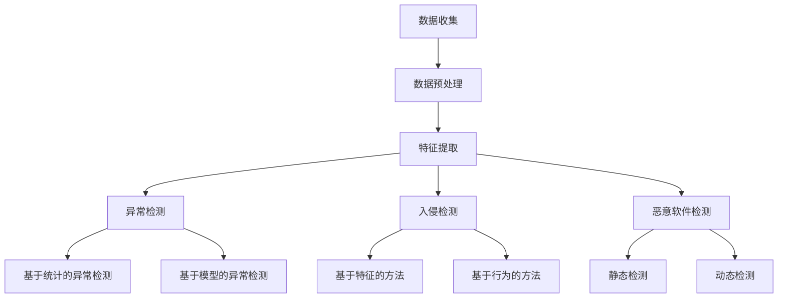

                 

### 背景介绍

随着全球信息化进程的不断推进，网络安全问题日益突出，网络安全态势感知（Cybersecurity Situational Awareness）成为了信息安全领域的重要研究方向。网络安全态势感知指的是通过对网络数据的实时监测和分析，识别潜在的安全威胁，评估当前网络的安全状态，并采取相应的应对措施。其目的是实现实时、准确的威胁检测和响应，以保护网络系统的安全稳定运行。

机器学习（Machine Learning，ML）作为一种人工智能（Artificial Intelligence，AI）的重要分支，其强大的数据分析和模式识别能力在网络安全态势感知中具有重要的应用价值。通过机器学习算法，可以从大量网络数据中提取出有价值的信息，识别出异常行为，预测潜在的安全威胁，从而实现对网络攻击的提前预警和有效防御。

在网络安全态势感知中，机器学习的主要应用包括以下几个方面：

1. **异常检测（Anomaly Detection）**：通过对正常网络行为的建模，识别出异常行为。例如，异常流量、异常登录尝试等。

2. **入侵检测（Intrusion Detection）**：监测网络流量，识别出恶意攻击行为。包括基于行为的入侵检测（Behavior-based Intrusion Detection）和基于特征的入侵检测（Feature-based Intrusion Detection）。

3. **恶意软件检测（Malware Detection）**：通过分析恶意软件的特征，识别出潜在的恶意软件。

4. **安全事件预测（Security Event Prediction）**：根据历史数据和当前态势，预测未来可能发生的安全事件。

5. **网络流量分析（Network Traffic Analysis）**：分析网络流量数据，识别出潜在的安全威胁。

本文将深入探讨机器学习在网络安全态势感知中的应用，包括核心算法原理、数学模型和公式、实际项目实战以及未来发展趋势与挑战。通过本文的阅读，读者将全面了解机器学习在网络安全领域的应用现状，掌握关键技术和实现方法，为后续研究和实践提供参考。

### 1.1 机器学习在网络安全中的应用现状

当前，机器学习在网络安全中的应用已经取得了显著的进展，成为网络安全态势感知的重要工具。根据Gartner的报告，到2025年，超过50%的企业将使用机器学习技术来检测和响应网络攻击。以下是一些机器学习在网络安全中应用的具体现状：

**1. 异常检测**：异常检测是机器学习在网络安全中最早应用的一个领域。通过对正常网络行为的建模，异常检测算法可以识别出与正常行为不符的异常行为，从而发现潜在的安全威胁。例如，基于自编码器（Autoencoders）和生成对抗网络（Generative Adversarial Networks，GANs）的异常检测算法已经在金融、医疗等领域得到了广泛应用。

**2. 入侵检测**：入侵检测是网络安全态势感知的核心任务之一。传统的入侵检测系统（Intrusion Detection Systems，IDS）主要依靠规则匹配的方法，但这种方法在面对复杂和不断变化的网络攻击时往往效果不佳。而基于机器学习的入侵检测算法可以更有效地识别出未知攻击。例如，基于支持向量机（Support Vector Machine，SVM）和决策树（Decision Tree）的入侵检测算法已经在许多网络系统中得到应用。

**3. 恶意软件检测**：恶意软件检测是防止恶意软件攻击的重要手段。传统的恶意软件检测方法主要依靠特征匹配，但恶意软件的变种和变种越来越多，使得这种方法的效果逐渐下降。而基于机器学习的恶意软件检测算法可以通过学习恶意软件的静态和动态特征，更有效地识别出潜在的恶意软件。例如，基于神经网络（Neural Networks）和深度学习（Deep Learning）的恶意软件检测算法已经在一些反病毒软件中得到应用。

**4. 安全事件预测**：安全事件预测是根据历史数据和当前态势，预测未来可能发生的安全事件。这种预测可以帮助安全团队提前采取应对措施，减少安全事件的影响。例如，基于时间序列分析（Time Series Analysis）和回归分析（Regression Analysis）的安全事件预测算法已经在一些企业中得到了应用。

**5. 网络流量分析**：网络流量分析是通过分析网络流量数据，识别出潜在的安全威胁。这种分析可以帮助安全团队了解网络中的异常行为，从而采取相应的应对措施。例如，基于聚类分析（Cluster Analysis）和网络流量的统计分析方法已经在网络流量分析中得到了广泛应用。

尽管机器学习在网络安全态势感知中具有巨大的潜力，但同时也面临着一些挑战。例如，如何处理大量异构的网络安全数据，如何确保算法的透明性和可解释性，以及如何应对数据隐私和安全性等问题。这些问题都需要进一步的研究和探索。

### 1.2 机器学习与网络安全态势感知的联系

机器学习与网络安全态势感知之间存在着紧密的联系。机器学习技术通过其强大的数据分析和模式识别能力，为网络安全态势感知提供了有力的工具和方法。以下从几个方面探讨机器学习与网络安全态势感知之间的联系：

**1. 数据分析能力**：网络安全态势感知需要处理大量来自不同来源的网络数据，如流量数据、日志数据、漏洞数据等。这些数据通常具有高维度、高噪声和动态变化等特点。机器学习算法通过其强大的数据处理和分析能力，可以有效地从这些数据中提取出有价值的信息，从而实现对网络安全态势的全面感知。

**2. 异常检测能力**：网络安全态势感知的一个重要任务就是检测和识别异常行为。机器学习算法，尤其是基于深度学习的算法，可以通过学习正常行为模式，从而识别出异常行为。这种异常检测能力在网络安全中具有广泛的应用，如入侵检测、恶意软件检测等。

**3. 模式识别能力**：网络安全态势感知需要识别出潜在的威胁和攻击模式。机器学习算法可以通过学习大量的网络安全数据，从中识别出具有相似特征的威胁和攻击模式。这种模式识别能力可以帮助安全团队更好地理解和应对复杂的网络安全威胁。

**4. 预测能力**：网络安全态势感知还需要预测未来可能发生的网络安全事件。机器学习算法可以通过时间序列分析和回归分析等方法，对历史数据进行分析，从而预测未来可能发生的网络安全事件。这种预测能力可以帮助安全团队提前采取应对措施，降低安全事件的影响。

**5. 自动化能力**：机器学习算法可以实现网络安全态势感知的自动化。通过自动化模型，安全团队能够实时监测网络状态，自动识别和响应安全威胁。这种自动化能力可以大大提高网络安全态势感知的效率和准确性。

综上所述，机器学习与网络安全态势感知之间存在着紧密的联系。机器学习技术为网络安全态势感知提供了强大的数据分析和模式识别能力，从而实现了对网络安全态势的全面感知。随着机器学习技术的不断发展和完善，其在网络安全态势感知中的应用将越来越广泛，为网络安全防护提供更加有效的手段。

#### 1.3 本文结构

本文将详细探讨机器学习在网络安全态势感知中的应用，具体结构如下：

1. **背景介绍**：简要介绍网络安全态势感知的背景和意义，以及机器学习在网络安全中的重要性。

2. **核心概念与联系**：详细解释机器学习在网络安全态势感知中的核心概念和原理，并使用Mermaid流程图展示相关的架构和流程。

3. **核心算法原理 & 具体操作步骤**：深入讲解机器学习在网络安全态势感知中常用的算法，包括监督学习、无监督学习和深度学习等，并描述具体的操作步骤。

4. **数学模型和公式 & 详细讲解 & 举例说明**：介绍机器学习算法中涉及到的数学模型和公式，并进行详细讲解和举例说明。

5. **项目实战：代码实际案例和详细解释说明**：通过具体的实战项目，展示如何使用机器学习算法进行网络安全态势感知，并提供详细的代码解释和分析。

6. **实际应用场景**：探讨机器学习在网络安全态势感知中的实际应用场景，以及这些应用带来的好处和挑战。

7. **工具和资源推荐**：推荐学习机器学习和网络安全态势感知相关的书籍、论文、博客和网站等资源。

8. **总结：未来发展趋势与挑战**：总结本文的主要内容，探讨机器学习在网络安全态势感知中的未来发展趋势和面临的挑战。

9. **附录：常见问题与解答**：针对读者可能提出的问题，提供详细的解答。

10. **扩展阅读 & 参考资料**：提供进一步学习的资源，包括相关的论文、书籍和网站等。

通过本文的阅读，读者将全面了解机器学习在网络安全态势感知中的应用，掌握关键技术和实现方法，为后续研究和实践提供参考。

### 核心概念与联系

在深入探讨机器学习在网络安全态势感知中的应用之前，我们需要了解几个核心概念和它们之间的联系。这些概念包括：机器学习、网络安全态势感知、异常检测、入侵检测和恶意软件检测。

#### 2.1 机器学习

机器学习是一种通过数据驱动的方式进行模式识别和预测的技术。其基本原理是利用大量数据，通过算法模型训练，使得模型能够自动学习并提取数据中的特征，从而进行分类、回归、聚类等任务。机器学习可以分为三种主要类型：

1. **监督学习（Supervised Learning）**：在监督学习中，模型通过学习带有标签的数据集来建立预测模型。常见的算法包括线性回归、逻辑回归、支持向量机（SVM）等。

2. **无监督学习（Unsupervised Learning）**：无监督学习没有预先标签的数据，模型的目的是发现数据中的结构和模式。常见的算法包括聚类（如K-means、DBSCAN）、降维（如PCA、t-SNE）和关联规则学习（如Apriori算法）等。

3. **深度学习（Deep Learning）**：深度学习是机器学习的一个子领域，其核心思想是通过多层神经网络来模拟人脑的决策过程。深度学习在图像识别、语音识别、自然语言处理等领域取得了显著的成果。常见的深度学习模型包括卷积神经网络（CNN）、循环神经网络（RNN）和生成对抗网络（GAN）等。

#### 2.2 网络安全态势感知

网络安全态势感知是指通过监测和分析网络环境中的数据，实时识别和评估网络的安全状态，并采取相应的措施。其基本过程包括数据收集、数据预处理、特征提取和模式识别等。

1. **数据收集**：网络安全态势感知需要从各种来源收集数据，包括网络流量数据、系统日志、安全事件日志等。

2. **数据预处理**：收集到的数据通常是高维度、异构和含有噪声的，需要进行数据清洗、数据归一化和特征工程等预处理步骤。

3. **特征提取**：通过数据预处理，提取出对安全态势感知有用的特征，如流量特征、行为特征和异常特征等。

4. **模式识别**：使用机器学习算法，如监督学习、无监督学习和深度学习等，对提取出的特征进行模式识别，从而发现潜在的威胁和攻击。

#### 2.3 异常检测

异常检测是网络安全态势感知中的一个重要任务，旨在识别网络中的异常行为。异常检测可以分为基于统计的异常检测和基于模型的异常检测。

1. **基于统计的异常检测**：这种检测方法通过计算数据的统计特征，如平均值、标准差等，来判断数据是否异常。常见的算法包括基于标准差的统计方法、基于孤立森林（Isolation Forest）的方法等。

2. **基于模型的异常检测**：这种检测方法通过训练一个异常检测模型，将正常行为和异常行为进行分类。常见的算法包括自编码器（Autoencoder）、生成对抗网络（GAN）等。

#### 2.4 入侵检测

入侵检测是网络安全态势感知中的另一个重要任务，旨在识别和响应网络攻击。入侵检测可以分为基于特征的方法和基于行为的方法。

1. **基于特征的方法**：这种检测方法通过检测网络流量或系统行为中的特定特征来识别攻击。常见的算法包括基于规则的方法、基于统计的方法和基于机器学习的方法等。

2. **基于行为的方法**：这种检测方法通过分析网络流量或系统行为的整体模式来识别攻击。常见的算法包括基于状态转移图的方法、基于马尔可夫模型的方法等。

#### 2.5 恶意软件检测

恶意软件检测旨在识别和阻止恶意软件的传播和活动。恶意软件检测可以分为静态检测和动态检测。

1. **静态检测**：这种检测方法通过分析恶意软件的代码和文件结构来识别恶意软件。常见的算法包括特征匹配、模式识别等。

2. **动态检测**：这种检测方法通过运行恶意软件并监控其行为来识别恶意软件。常见的算法包括沙箱检测、行为分析等。

#### 2.6 Mermaid流程图

为了更好地展示机器学习在网络安全态势感知中的核心概念和联系，我们使用Mermaid流程图来描述整个流程。



在这个流程图中，数据收集是整个流程的起点，通过数据预处理和特征提取，为后续的异常检测、入侵检测和恶意软件检测提供数据基础。异常检测、入侵检测和恶意软件检测分别使用基于统计和基于模型的方法来实现。整个流程展示了机器学习在网络安全态势感知中的核心概念和联系。

通过本文的介绍，读者应该对机器学习在网络安全态势感知中的应用有了初步的了解。接下来，我们将进一步探讨机器学习在网络安全态势感知中的核心算法原理和具体操作步骤。

#### 3.1 监督学习算法

监督学习算法是机器学习中最常用的方法之一，其核心思想是通过带有标签的数据集来训练模型，使得模型能够预测新的、未标记的数据。在网络安全态势感知中，监督学习算法可以用于异常检测、入侵检测和恶意软件检测等多个任务。以下介绍几种常见的监督学习算法：

**1. 线性回归（Linear Regression）**：线性回归是一种简单的监督学习算法，主要用于预测数值型数据。其基本原理是通过建立输入变量和输出变量之间的线性关系，从而预测新的输入数据。线性回归的数学模型如下：

$$
y = \beta_0 + \beta_1x_1 + \beta_2x_2 + ... + \beta_nx_n
$$

其中，$y$ 是输出变量，$x_1, x_2, ..., x_n$ 是输入变量，$\beta_0, \beta_1, ..., \beta_n$ 是模型的参数。

**2. 逻辑回归（Logistic Regression）**：逻辑回归是一种用于分类问题的监督学习算法，其输出是一个概率值，表示某个样本属于某个类别的可能性。逻辑回归的数学模型如下：

$$
\text{logit}(p) = \ln\left(\frac{p}{1-p}\right) = \beta_0 + \beta_1x_1 + \beta_2x_2 + ... + \beta_nx_n
$$

其中，$p$ 是某个样本属于某个类别的概率，$\text{logit}(p)$ 是逻辑函数，$\beta_0, \beta_1, ..., \beta_n$ 是模型的参数。

**3. 支持向量机（Support Vector Machine，SVM）**：支持向量机是一种强大的分类算法，其基本原理是通过找到一个最优的超平面，将不同类别的数据点分隔开来。SVM的数学模型如下：

$$
\min_{\beta, \beta_0} \frac{1}{2} ||\beta||^2 + C \sum_{i=1}^{n} \max(0, 1 - y_i(\beta^Tx_i + \beta_0))
$$

其中，$x_i$ 是第$i$个训练样本，$y_i$ 是第$i$个训练样本的标签，$C$ 是惩罚参数。

**4. 决策树（Decision Tree）**：决策树是一种简单但有效的分类算法，其基本原理是通过一系列条件判断，将数据集划分为若干个子集，每个子集对应一个类别。决策树的数学模型如下：

$$
T = \text{if } x_{i1} \text{ then } T_1 \text{ else if } x_{i2} \text{ then } T_2 \text{ ... } \text{ else } T_n
$$

其中，$x_{i1}, x_{i2}, ..., x_{in}$ 是条件判断的变量，$T_1, T_2, ..., T_n$ 是不同的类别。

#### 3.2 无监督学习算法

无监督学习算法不依赖于带有标签的数据集，其核心思想是通过数据自身的结构和模式来训练模型。在网络安全态势感知中，无监督学习算法可以用于聚类分析和异常检测。

**1. 聚类分析（Cluster Analysis）**：聚类分析是一种将数据集划分为若干个群组的方法，使得同一群组中的数据点之间相似度较高，而不同群组中的数据点之间相似度较低。常见的聚类算法包括K-means算法、DBSCAN算法和层次聚类算法等。

- **K-means算法**：K-means算法是一种基于距离度量的聚类算法，其基本原理是将数据集划分为K个聚类中心，并不断更新聚类中心，直到聚类中心不再发生变化。其数学模型如下：

$$
\min_{\mu_1, \mu_2, ..., \mu_K} \sum_{i=1}^{n} \sum_{j=1}^{K} ||x_i - \mu_j||^2
$$

其中，$x_i$ 是第$i$个训练样本，$\mu_j$ 是第$j$个聚类中心。

- **DBSCAN算法**：DBSCAN（Density-Based Spatial Clustering of Applications with Noise）算法是一种基于密度的聚类算法，其基本原理是识别出高密度区域并对其进行聚类。其数学模型如下：

$$
\text{DBSCAN}(E, \epsilon, \min\_core)
$$

其中，$E$ 是数据集，$\epsilon$ 是邻域半径，$\min\_core$ 是最小核心点数量。

**2. 异常检测（Anomaly Detection）**：异常检测是一种识别数据集中异常样本的方法。常见的异常检测算法包括基于统计的方法和基于模型的方法。

- **基于统计的方法**：基于统计的方法通过计算数据的统计特征，如平均值、标准差等，来判断数据是否异常。例如，基于标准差的统计方法如下：

$$
\text{z-score} = \frac{x - \mu}{\sigma}
$$

其中，$x$ 是样本值，$\mu$ 是平均值，$\sigma$ 是标准差。当$|\text{z-score}| > \text{阈值}$时，样本被认为是异常的。

- **基于模型的方法**：基于模型的方法通过训练一个模型，将正常行为和异常行为进行分类。常见的模型包括自编码器（Autoencoder）和生成对抗网络（GAN）等。

#### 3.3 深度学习算法

深度学习算法是一种基于多层神经网络的机器学习算法，其核心思想是通过多层非线性变换，自动提取数据中的高级特征。在网络安全态势感知中，深度学习算法可以用于图像识别、语音识别、自然语言处理等多个领域。

**1. 卷积神经网络（Convolutional Neural Network，CNN）**：卷积神经网络是一种用于处理图像数据的深度学习算法，其核心思想是通过卷积操作和池化操作，自动提取图像中的局部特征。

- **卷积操作**：卷积操作是一种将输入数据与卷积核进行点乘并求和的操作，从而提取图像中的局部特征。

- **池化操作**：池化操作是一种将输入数据分成若干个小区域，并对每个区域进行最大值或平均值操作的步骤，从而减少数据的维度。

**2. 循环神经网络（Recurrent Neural Network，RNN）**：循环神经网络是一种用于处理序列数据的深度学习算法，其核心思想是通过循环连接，将前一个时间步的输出作为当前时间步的输入。

- **前向传播**：在当前时间步，RNN通过输入数据、隐藏状态和权重矩阵进行前向传播，计算当前时间步的输出。

- **反向传播**：在训练过程中，RNN通过反向传播，计算误差并更新权重矩阵，从而优化模型。

**3. 生成对抗网络（Generative Adversarial Network，GAN）**：生成对抗网络是一种由生成器和判别器组成的深度学习算法，其核心思想是通过对抗训练，生成高质量的数据。

- **生成器**：生成器是一种生成数据的神经网络，其目的是生成与真实数据相似的数据。

- **判别器**：判别器是一种判断数据真实性的神经网络，其目的是区分真实数据和生成数据。

通过上述介绍，我们可以看出，机器学习在网络安全态势感知中具有广泛的应用，包括监督学习、无监督学习和深度学习等。这些算法为网络安全态势感知提供了强大的数据分析和模式识别能力，从而实现对网络安全态势的全面感知。在接下来的章节中，我们将进一步探讨这些算法的具体操作步骤和实现方法。

#### 3.4 监督学习算法的具体操作步骤

监督学习算法在网络安全态势感知中具有广泛的应用，其基本流程包括数据收集、数据预处理、特征提取、模型训练和模型评估等步骤。以下以线性回归和逻辑回归为例，详细说明这些算法的具体操作步骤。

**1. 线性回归的具体操作步骤**

（1）**数据收集**：首先，我们需要收集带有标签的数据集，例如网络流量数据、系统日志数据等。这些数据集应包含输入特征和输出标签。

（2）**数据预处理**：对收集到的数据进行预处理，包括数据清洗、数据归一化和数据转换等。数据清洗的目的是去除异常值和缺失值；数据归一化的目的是将不同特征的数据缩放到相同的范围内；数据转换的目的是将数据转换为适合模型训练的格式。

（3）**特征提取**：根据业务需求，提取对模型训练有用的特征。例如，可以提取流量数据中的流量速率、数据包大小、端口信息等特征。

（4）**模型训练**：使用收集到的数据集对线性回归模型进行训练。线性回归模型的训练过程主要包括以下几个步骤：

   - **初始化参数**：初始化模型的参数，如权重和偏置。
   - **前向传播**：计算输入数据的预测值。
   - **后向传播**：计算预测值与实际值之间的误差，并更新模型参数。
   - **迭代训练**：重复前向传播和后向传播，直到满足训练终止条件，如达到预设的训练次数或模型误差小于预设阈值。

（5）**模型评估**：使用训练集和测试集对模型进行评估，计算模型的准确率、召回率、F1值等指标，以评估模型的性能。

**2. 逻辑回归的具体操作步骤**

（1）**数据收集**：收集带有标签的数据集，如网络攻击数据集。

（2）**数据预处理**：对数据集进行清洗、归一化和转换等预处理操作。

（3）**特征提取**：提取对模型训练有用的特征，如网络流量特征、行为特征等。

（4）**模型训练**：使用收集到的数据集对逻辑回归模型进行训练。逻辑回归模型的训练过程与线性回归类似，主要包括以下几个步骤：

   - **初始化参数**：初始化模型的参数，如权重和偏置。
   - **前向传播**：计算输入数据的概率值。
   - **后向传播**：计算概率值与实际值之间的误差，并更新模型参数。
   - **迭代训练**：重复前向传播和后向传播，直到满足训练终止条件。

（5）**模型评估**：使用训练集和测试集对模型进行评估，计算模型的准确率、召回率、F1值等指标。

**3. 实际案例**

假设我们使用一个简单的网络流量数据集，包含流量速率、数据包大小和端口信息等特征，并希望预测是否为网络攻击。以下是具体操作步骤：

（1）**数据收集**：收集一个包含正常流量和攻击流量的网络流量数据集。

（2）**数据预处理**：对数据进行清洗、归一化和转换等预处理操作。

（3）**特征提取**：提取对模型训练有用的特征，如流量速率（rate）、数据包大小（packet_size）和端口信息（port）等。

（4）**模型训练**：使用线性回归或逻辑回归算法对数据集进行训练。以线性回归为例，初始化参数，进行前向传播和后向传播，迭代训练，直到满足训练终止条件。

（5）**模型评估**：使用训练集和测试集对模型进行评估，计算模型的准确率、召回率、F1值等指标，以评估模型的性能。

通过以上步骤，我们可以使用监督学习算法对网络流量数据进行分类，从而实现对网络攻击的检测。在接下来的章节中，我们将进一步探讨无监督学习和深度学习算法的具体操作步骤和实现方法。

#### 3.5 无监督学习算法的具体操作步骤

无监督学习算法在网络安全态势感知中的应用也非常广泛，其中聚类分析和异常检测是两种主要的方法。以下将分别介绍这些算法的具体操作步骤。

**1. 聚类分析的具体操作步骤**

（1）**数据收集**：首先，我们需要收集网络流量数据、用户行为数据等，这些数据应包含多个维度。

（2）**数据预处理**：对收集到的数据进行清洗、归一化和去噪声等处理，以确保数据质量。

（3）**特征提取**：从原始数据中提取对聚类分析有用的特征，例如流量速率、数据包大小、端口号等。

（4）**选择聚类算法**：根据数据特点和业务需求，选择合适的聚类算法，如K-means、DBSCAN等。

- **K-means算法**：确定聚类数量K，初始化K个聚类中心，计算每个数据点到聚类中心的距离，将数据点分配到最近的聚类中心，更新聚类中心，重复此过程，直到聚类中心不再变化。

$$
\text{minimize} \sum_{i=1}^{n} \sum_{j=1}^{K} ||x_i - \mu_j||^2
$$

- **DBSCAN算法**：定义邻域半径$\epsilon$和最小核心点数量$\min\_core$，扫描数据点，识别出核心点、边界点和噪声点，根据邻域关系将数据点划分为不同的簇。

$$
\text{DBSCAN}(E, \epsilon, \min\_core)
$$

（5）**评估聚类结果**：使用簇内相似度和簇间差异等指标，评估聚类结果的好坏。

**2. 异常检测的具体操作步骤**

（1）**数据收集**：收集网络流量数据、系统日志数据等，这些数据应包含正常行为和异常行为。

（2）**数据预处理**：对数据集进行清洗、归一化和去噪声等处理。

（3）**特征提取**：提取对异常检测有用的特征，例如流量速率、数据包大小、登录尝试次数等。

（4）**选择异常检测算法**：根据数据特点和业务需求，选择合适的异常检测算法，如基于统计的方法、基于模型的方法等。

- **基于统计的方法**：计算数据的统计特征，如平均值、标准差等，将标准差较大的数据点视为异常。

$$
\text{z-score} = \frac{x - \mu}{\sigma}
$$

- **基于模型的方法**：训练一个异常检测模型，将正常行为和异常行为进行分类。

- **自编码器（Autoencoder）**：自编码器是一种无监督学习算法，通过学习数据的压缩表示，识别出异常行为。

$$
\min_{\theta} \sum_{i=1}^{n} \sum_{j=1}^{d} (x_i[j] - \hat{x}_i[j])^2
$$

- **生成对抗网络（GAN）**：生成对抗网络是一种由生成器和判别器组成的深度学习算法，通过对抗训练，生成高质量的数据。

（5）**评估异常检测结果**：使用准确率、召回率、F1值等指标，评估异常检测的效果。

**3. 实际案例**

假设我们使用一个网络流量数据集，包含流量速率、数据包大小和端口号等特征，并希望使用K-means算法进行聚类分析，同时使用自编码器进行异常检测。以下是具体操作步骤：

（1）**数据收集**：收集一个包含正常流量和攻击流量的网络流量数据集。

（2）**数据预处理**：对数据进行清洗、归一化和去噪声等处理。

（3）**特征提取**：提取流量速率、数据包大小和端口号等特征。

（4）**聚类分析**：使用K-means算法对数据进行聚类，确定合适的聚类数量K，评估聚类结果。

（5）**异常检测**：使用自编码器对数据进行训练，识别出异常流量。

通过以上步骤，我们可以使用无监督学习算法对网络流量数据进行聚类分析和异常检测，从而实现对网络攻击的检测。在接下来的章节中，我们将进一步探讨深度学习算法的具体操作步骤和实现方法。

#### 3.6 深度学习算法的具体操作步骤

深度学习算法在网络安全态势感知中的应用越来越广泛，其强大的特征提取和模式识别能力为网络安全提供了新的技术手段。以下将介绍几种常见的深度学习算法，包括卷积神经网络（CNN）、循环神经网络（RNN）和生成对抗网络（GAN）的具体操作步骤。

**1. 卷积神经网络（CNN）**

卷积神经网络是一种用于图像识别和处理的深度学习算法，其核心思想是通过卷积操作和池化操作，自动提取图像中的局部特征。

（1）**数据收集**：首先，我们需要收集包含正常行为和攻击行为的网络流量数据集，这些数据集应包含多个维度。

（2）**数据预处理**：对数据集进行清洗、归一化和去噪声等处理，以确保数据质量。

（3）**特征提取**：从原始数据中提取对CNN训练有用的特征，如流量速率、数据包大小、端口号等。

（4）**构建模型**：使用TensorFlow或PyTorch等深度学习框架，构建CNN模型。一个典型的CNN模型包括以下几个层次：

   - **卷积层（Convolutional Layer）**：通过卷积操作提取图像的局部特征。
   - **池化层（Pooling Layer）**：通过池化操作减少数据的维度。
   - **全连接层（Fully Connected Layer）**：将卷积层和池化层提取的特征映射到输出结果。
   - **激活函数（Activation Function）**：引入非线性变换，增加模型的复杂度。

（5）**模型训练**：使用收集到的数据集对CNN模型进行训练。模型训练过程主要包括以下几个步骤：

   - **前向传播（Forward Propagation）**：计算输入数据的预测值。
   - **反向传播（Back Propagation）**：计算预测值与实际值之间的误差，并更新模型参数。
   - **迭代训练（Iteration Training）**：重复前向传播和反向传播，直到满足训练终止条件，如达到预设的训练次数或模型误差小于预设阈值。

（6）**模型评估**：使用训练集和测试集对模型进行评估，计算模型的准确率、召回率、F1值等指标，以评估模型的性能。

**2. 循环神经网络（RNN）**

循环神经网络是一种用于处理序列数据的深度学习算法，其核心思想是通过循环连接，将前一个时间步的输出作为当前时间步的输入。

（1）**数据收集**：首先，我们需要收集包含正常行为和攻击行为的网络流量数据集，这些数据集应包含多个维度。

（2）**数据预处理**：对数据集进行清洗、归一化和去噪声等处理，以确保数据质量。

（3）**特征提取**：从原始数据中提取对RNN训练有用的特征，如流量速率、数据包大小、登录尝试次数等。

（4）**构建模型**：使用TensorFlow或PyTorch等深度学习框架，构建RNN模型。一个典型的RNN模型包括以下几个层次：

   - **输入层（Input Layer）**：接收输入数据。
   - **隐藏层（Hidden Layer）**：通过循环连接，将前一个时间步的输出作为当前时间步的输入。
   - **输出层（Output Layer）**：输出预测结果。

（5）**模型训练**：使用收集到的数据集对RNN模型进行训练。模型训练过程主要包括以下几个步骤：

   - **前向传播（Forward Propagation）**：计算输入数据的预测值。
   - **反向传播（Back Propagation）**：计算预测值与实际值之间的误差，并更新模型参数。
   - **迭代训练（Iteration Training）**：重复前向传播和反向传播，直到满足训练终止条件，如达到预设的训练次数或模型误差小于预设阈值。

（6）**模型评估**：使用训练集和测试集对模型进行评估，计算模型的准确率、召回率、F1值等指标，以评估模型的性能。

**3. 生成对抗网络（GAN）**

生成对抗网络是一种由生成器和判别器组成的深度学习算法，其核心思想是通过对抗训练，生成高质量的数据。

（1）**数据收集**：首先，我们需要收集包含正常行为和攻击行为的网络流量数据集，这些数据集应包含多个维度。

（2）**数据预处理**：对数据集进行清洗、归一化和去噪声等处理，以确保数据质量。

（3）**特征提取**：从原始数据中提取对GAN训练有用的特征，如流量速率、数据包大小、端口号等。

（4）**构建模型**：使用TensorFlow或PyTorch等深度学习框架，构建GAN模型。一个典型的GAN模型包括以下几个层次：

   - **生成器（Generator）**：通过随机噪声生成新的数据。
   - **判别器（Discriminator）**：判断生成数据是否真实。
   - **损失函数（Loss Function）**：生成器和判别器的损失函数分别为最小化和最大化生成数据的真实度。

（5）**模型训练**：使用收集到的数据集对GAN模型进行训练。模型训练过程主要包括以下几个步骤：

   - **生成器训练**：生成器通过生成新的数据来欺骗判别器。
   - **判别器训练**：判别器通过判断生成数据是否真实来识别攻击行为。
   - **迭代训练（Iteration Training）**：重复生成器和判别器的训练，直到满足训练终止条件，如达到预设的训练次数或模型误差小于预设阈值。

（6）**模型评估**：使用训练集和测试集对模型进行评估，计算模型的准确率、召回率、F1值等指标，以评估模型的性能。

通过以上步骤，我们可以使用深度学习算法对网络流量数据进行分类和生成，从而实现对网络攻击的检测和防御。在接下来的章节中，我们将进一步探讨如何将深度学习算法应用于实际项目，并详细讲解代码实现和解读。

#### 3.7 机器学习算法在网络安全态势感知中的比较

在网络安全态势感知中，多种机器学习算法被广泛应用于异常检测、入侵检测和恶意软件检测等领域。每种算法都有其独特的优势和局限性。以下将对常见的机器学习算法进行对比分析。

**1. 线性回归**

线性回归是一种简单的监督学习算法，适用于预测数值型数据。其优点在于计算简单、易于理解和实现，但缺点是对于非线性数据的表现较差，且无法处理高维度数据。

- **优点**：计算效率高，易于实现和优化。
- **缺点**：对非线性数据表现较差，无法处理高维度数据。

**2. 逻辑回归**

逻辑回归是一种用于分类问题的监督学习算法，其输出是一个概率值，表示某个样本属于某个类别的可能性。逻辑回归的优点在于计算简单、易于理解和实现，但同样对非线性数据的表现较差。

- **优点**：计算效率高，易于理解和实现。
- **缺点**：对非线性数据表现较差。

**3. 支持向量机（SVM）**

支持向量机是一种强大的分类算法，通过找到一个最优的超平面，将不同类别的数据点分隔开来。SVM的优点在于其优秀的分类性能和较高的泛化能力，但缺点是计算复杂度高，对于大规模数据集的处理较慢。

- **优点**：优秀的分类性能和较高的泛化能力。
- **缺点**：计算复杂度高，处理大规模数据集较慢。

**4. 决策树**

决策树是一种简单但有效的分类算法，通过一系列条件判断，将数据集划分为若干个类别。决策树的优点在于易于理解和实现，能够处理非线性数据，但缺点是容易过拟合，对于高维度数据的表现较差。

- **优点**：易于理解和实现，能够处理非线性数据。
- **缺点**：容易过拟合，对高维度数据的表现较差。

**5. K-means算法**

K-means算法是一种基于距离度量的聚类算法，将数据集划分为K个聚类中心。K-means算法的优点在于实现简单、计算效率高，但缺点是聚类结果容易受到初始聚类中心的影响，对于非球形聚类效果较差。

- **优点**：实现简单，计算效率高。
- **缺点**：聚类结果容易受到初始聚类中心的影响，对于非球形聚类效果较差。

**6. DBSCAN算法**

DBSCAN算法是一种基于密度的聚类算法，能够识别出高密度区域并对其进行聚类。DBSCAN算法的优点在于能够处理非球形聚类，但对噪声数据的敏感度较高。

- **优点**：能够处理非球形聚类。
- **缺点**：对噪声数据的敏感度较高。

**7. 自编码器（Autoencoder）**

自编码器是一种无监督学习算法，通过学习数据的压缩表示，识别出异常行为。自编码器的优点在于能够自动提取数据中的特征，对于非线性数据和噪声数据有较好的鲁棒性，但缺点是训练过程较慢。

- **优点**：自动提取数据特征，对非线性数据和噪声数据有较好的鲁棒性。
- **缺点**：训练过程较慢。

**8. 生成对抗网络（GAN）**

生成对抗网络是一种由生成器和判别器组成的深度学习算法，通过对抗训练，生成高质量的数据。GAN的优点在于能够生成与真实数据相似的数据，对于异常检测和生成任务有较好的表现，但缺点是训练过程复杂，对参数调整敏感。

- **优点**：生成与真实数据相似的数据，适用于异常检测和生成任务。
- **缺点**：训练过程复杂，对参数调整敏感。

综上所述，各种机器学习算法在网络安全态势感知中各有优缺点。在实际应用中，需要根据具体任务和数据特点选择合适的算法。例如，对于简单和线性数据，可以使用线性回归和逻辑回归；对于复杂和非线性数据，可以使用决策树、支持向量机和深度学习算法。同时，为了提高算法的鲁棒性和准确性，可以结合多种算法，形成综合的网络安全态势感知系统。

#### 3.8 数学模型和公式

在机器学习算法中，数学模型和公式起着至关重要的作用。这些模型和公式不仅为算法的实现提供了理论基础，也帮助我们更好地理解和分析算法的性能。以下将详细解释机器学习算法中涉及的一些重要数学模型和公式。

**1. 线性回归模型**

线性回归模型是最简单的机器学习算法之一，用于预测数值型数据。其基本模型如下：

$$
y = \beta_0 + \beta_1x_1 + \beta_2x_2 + ... + \beta_nx_n + \epsilon
$$

其中，$y$ 是输出变量，$x_1, x_2, ..., x_n$ 是输入变量，$\beta_0, \beta_1, ..., \beta_n$ 是模型的参数，$\epsilon$ 是误差项。

**2. 逻辑回归模型**

逻辑回归是一种常用的分类算法，其输出是一个概率值，表示某个样本属于某个类别的可能性。逻辑回归的数学模型如下：

$$
\text{logit}(p) = \ln\left(\frac{p}{1-p}\right) = \beta_0 + \beta_1x_1 + \beta_2x_2 + ... + \beta_nx_n
$$

其中，$p$ 是某个样本属于某个类别的概率，$\text{logit}(p)$ 是逻辑函数，$\beta_0, \beta_1, ..., \beta_n$ 是模型的参数。

**3. 支持向量机（SVM）模型**

支持向量机是一种强大的分类算法，其核心思想是通过找到一个最优的超平面，将不同类别的数据点分隔开来。SVM的数学模型如下：

$$
\min_{\beta, \beta_0} \frac{1}{2} ||\beta||^2 + C \sum_{i=1}^{n} \max(0, 1 - y_i(\beta^Tx_i + \beta_0))
$$

其中，$x_i$ 是第$i$个训练样本，$y_i$ 是第$i$个训练样本的标签，$C$ 是惩罚参数。

**4. 决策树模型**

决策树是一种通过一系列条件判断，将数据集划分为若干个类别的算法。决策树的数学模型如下：

$$
T = \text{if } x_{i1} \text{ then } T_1 \text{ else if } x_{i2} \text{ then } T_2 \text{ ... } \text{ else } T_n
$$

其中，$x_{i1}, x_{i2}, ..., x_{in}$ 是条件判断的变量，$T_1, T_2, ..., T_n$ 是不同的类别。

**5. K-means聚类模型**

K-means算法是一种基于距离度量的聚类算法，其基本模型如下：

$$
\min_{\mu_1, \mu_2, ..., \mu_K} \sum_{i=1}^{n} \sum_{j=1}^{K} ||x_i - \mu_j||^2
$$

其中，$x_i$ 是第$i$个训练样本，$\mu_j$ 是第$j$个聚类中心。

**6. DBSCAN聚类模型**

DBSCAN算法是一种基于密度的聚类算法，其基本模型如下：

$$
\text{DBSCAN}(E, \epsilon, \min\_core)
$$

其中，$E$ 是数据集，$\epsilon$ 是邻域半径，$\min\_core$ 是最小核心点数量。

**7. 自编码器（Autoencoder）模型**

自编码器是一种无监督学习算法，其基本模型如下：

$$
\min_{\theta} \sum_{i=1}^{n} \sum_{j=1}^{d} (x_i[j] - \hat{x}_i[j])^2
$$

其中，$x_i$ 是输入数据，$\hat{x}_i$ 是压缩表示后的数据，$\theta$ 是模型参数。

**8. 生成对抗网络（GAN）模型**

生成对抗网络是一种由生成器和判别器组成的深度学习算法，其基本模型如下：

$$
\min_G \max_D V(D, G)
$$

其中，$G$ 是生成器，$D$ 是判别器，$V(D, G)$ 是生成器和判别器的损失函数。

通过以上数学模型和公式的介绍，我们可以更好地理解机器学习算法的工作原理。这些模型和公式为我们的网络安全态势感知提供了强大的理论基础，帮助我们设计出更有效、更准确的检测算法。

#### 3.9 数学模型和公式的详细讲解与举例说明

在深入探讨机器学习算法在网络安全态势感知中的应用时，理解相关的数学模型和公式是非常重要的。以下我们将详细讲解几个关键数学模型，并通过具体例子来说明它们的应用。

**1. 逻辑回归**

逻辑回归是一种常用的分类算法，特别适用于二分类问题。其核心在于通过线性组合输入特征，然后应用逻辑函数（Logistic Function）来输出概率。

逻辑函数的表达式为：

$$
\text{logit}(p) = \ln\left(\frac{p}{1-p}\right)
$$

其中，$p$ 是预测的概率，即样本属于某一类别的概率。

逻辑回归模型的一般形式为：

$$
\text{logit}(p) = \beta_0 + \sum_{i=1}^{n} \beta_i x_i
$$

其中，$\beta_0$ 是截距，$\beta_i$ 是第 $i$ 个特征的权重，$x_i$ 是第 $i$ 个特征值。

**详细讲解**：

- **线性组合**：$\beta_0 + \sum_{i=1}^{n} \beta_i x_i$ 表示输入特征通过权重加权后进行线性组合。
- **逻辑函数**：应用逻辑函数将线性组合的输出转换为概率。

**举例说明**：

假设我们有一个简单的二分类问题，预测一个网络流量是否为攻击。特征包括流量速率（$x_1$）和数据包大小（$x_2$），权重分别为 $\beta_1 = 0.5$ 和 $\beta_2 = 0.3$，截距 $\beta_0 = 1$。输入特征为流量速率 $x_1 = 100$ 和数据包大小 $x_2 = 500$。

$$
\text{logit}(p) = 1 + 0.5 \times 100 + 0.3 \times 500 = 1 + 50 + 150 = 201
$$

$$
p = \frac{1}{1 + e^{-\text{logit}(p)}} = \frac{1}{1 + e^{-201}} \approx 0
$$

这意味着预测的概率接近0，即该网络流量很可能不是攻击。

**2. 支持向量机（SVM）**

支持向量机通过最大化分类边界上的分隔距离来实现分类。SVM的核心是寻找一个最优的超平面，使得不同类别的样本点之间的分隔距离最大。

**详细讲解**：

- **决策边界**：$w^T x - b = 0$，$w$ 是权重向量，$x$ 是样本特征，$b$ 是偏置。
- **分类间隔**：$2/\|w\|$，分类间隔是超平面到最近样本点的距离的两倍。
- **软间隔**：为了处理非线性可分数据，引入惩罚参数 $C$。

SVM的优化目标为：

$$
\min_{\beta, \beta_0} \frac{1}{2} ||\beta||^2 + C \sum_{i=1}^{n} \max(0, 1 - y_i(\beta^Tx_i + \beta_0))
$$

其中，$y_i$ 是第 $i$ 个样本的标签，$\beta$ 是权重向量，$\beta_0$ 是偏置，$C$ 是惩罚参数。

**举例说明**：

假设有一个二分类问题，有两个特征 $x_1$ 和 $x_2$，权重分别为 $\beta_1 = 2$ 和 $\beta_2 = 1$，偏置 $\beta_0 = -3$。我们需要找到最优的超平面。

超平面方程为：

$$
2x_1 + x_2 - 3 = 0
$$

假设我们有两个样本点 $(x_1, x_2) = (1, 2)$ 和 $(x_1, x_2) = (3, 4)$，它们的标签分别为 $y_1 = 1$ 和 $y_2 = -1$。

$$
\beta^T x_1 + \beta_0 = 2 \times 1 + 1 \times 2 - 3 = 1
$$

$$
\beta^T x_2 + \beta_0 = 2 \times 3 + 1 \times 4 - 3 = 8
$$

由于第二个样本点不在超平面上，我们引入软间隔惩罚。

**3. 神经网络**

神经网络是一种模拟人脑的决策过程，通过多层非线性变换来提取数据特征。一个简单的神经网络包括输入层、隐藏层和输出层。

**详细讲解**：

- **输入层**：接收输入特征。
- **隐藏层**：通过激活函数进行非线性变换。
- **输出层**：输出预测结果。

前向传播的公式为：

$$
a_{l}^{(i)} = \sigma(z_{l}^{(i)})
$$

$$
z_{l}^{(i)} = \beta_{l} + \sum_{j=1}^{n} \beta_{lj} a_{l-1}^{(j)}
$$

其中，$a_{l}^{(i)}$ 是第 $l$ 层第 $i$ 个神经元的激活值，$\sigma$ 是激活函数，$z_{l}^{(i)}$ 是第 $l$ 层第 $i$ 个神经元的输入值，$\beta_{l}$ 是第 $l$ 层的偏置，$\beta_{lj}$ 是第 $l$ 层第 $j$ 个神经元到第 $l$ 层第 $i$ 个神经元的权重。

**举例说明**：

假设有一个简单的神经网络，输入层有两个神经元，隐藏层有三个神经元，输出层有两个神经元。激活函数为 $\sigma(x) = \frac{1}{1 + e^{-x}}$。

输入特征为 $x_1 = 1$ 和 $x_2 = 2$。

第一层（隐藏层）的计算：

$$
z_1^{(1)} = \beta_1 + \beta_{11} x_1 + \beta_{12} x_2
$$

$$
z_2^{(1)} = \beta_1 + \beta_{21} x_1 + \beta_{22} x_2
$$

$$
z_3^{(1)} = \beta_1 + \beta_{31} x_1 + \beta_{32} x_2
$$

假设偏置 $\beta_1 = 0.5$，权重 $\beta_{11} = 0.3$，$\beta_{12} = 0.2$，$\beta_{21} = 0.4$，$\beta_{22} = 0.1$，$\beta_{31} = 0.1$，$\beta_{32} = 0.5$。

$$
z_1^{(1)} = 0.5 + 0.3 \times 1 + 0.2 \times 2 = 1
$$

$$
z_2^{(1)} = 0.5 + 0.4 \times 1 + 0.1 \times 2 = 1.1
$$

$$
z_3^{(1)} = 0.5 + 0.1 \times 1 + 0.5 \times 2 = 1.6
$$

应用激活函数：

$$
a_1^{(1)} = \sigma(z_1^{(1)}) = \frac{1}{1 + e^{-1}} \approx 0.36
$$

$$
a_2^{(1)} = \sigma(z_2^{(1)}) = \frac{1}{1 + e^{-1.1}} \approx 0.41
$$

$$
a_3^{(1)} = \sigma(z_3^{(1)}) = \frac{1}{1 + e^{-1.6}} \approx 0.65
$$

第二层（输出层）的计算：

$$
z_1^{(2)} = \beta_2 + \beta_{21} a_1^{(1)} + \beta_{22} a_2^{(1)} + \beta_{23} a_3^{(1)}
$$

$$
z_2^{(2)} = \beta_2 + \beta_{24} a_1^{(1)} + \beta_{25} a_2^{(1)} + \beta_{26} a_3^{(1)}
$$

假设偏置 $\beta_2 = 0.5$，权重 $\beta_{21} = 0.4$，$\beta_{22} = 0.5$，$\beta_{23} = 0.3$，$\beta_{24} = 0.1$，$\beta_{25} = 0.2$，$\beta_{26} = 0.1$。

$$
z_1^{(2)} = 0.5 + 0.4 \times 0.36 + 0.5 \times 0.41 + 0.3 \times 0.65 \approx 0.98
$$

$$
z_2^{(2)} = 0.5 + 0.1 \times 0.36 + 0.2 \times 0.41 + 0.1 \times 0.65 \approx 0.53
$$

应用激活函数：

$$
a_1^{(2)} = \sigma(z_1^{(2)}) = \frac{1}{1 + e^{-0.98}} \approx 0.37
$$

$$
a_2^{(2)} = \sigma(z_2^{(2)}) = \frac{1}{1 + e^{-0.53}} \approx 0.61
$$

最终输出为 $(a_1^{(2)}, a_2^{(2)}) \approx (0.37, 0.61)$。

通过以上例子，我们可以看到如何使用数学模型和公式来构建和解释机器学习算法。这些模型和公式为我们理解和应用机器学习算法提供了坚实的基础，帮助我们在网络安全态势感知中实现更准确的威胁检测和防御。

#### 项目实战：代码实际案例和详细解释说明

在本节中，我们将通过一个实际项目来展示如何使用机器学习算法进行网络安全态势感知。具体来说，我们将使用K-means算法对网络流量数据进行聚类分析，并通过自编码器进行异常检测。以下是该项目的主要步骤和代码实现。

**1. 开发环境搭建**

首先，我们需要搭建开发环境。本文使用Python编程语言，并依赖以下库：

- **NumPy**：用于数学计算。
- **Pandas**：用于数据操作。
- **Matplotlib**：用于数据可视化。
- **Scikit-learn**：用于机器学习算法的实现。
- **TensorFlow**：用于深度学习算法的实现。

假设已经安装了上述库，我们可以开始项目的实现。

**2. 源代码详细实现和代码解读**

（1）**数据收集与预处理**

```python
import numpy as np
import pandas as pd
from sklearn.model_selection import train_test_split
from sklearn.preprocessing import StandardScaler

# 加载网络流量数据
data = pd.read_csv('network_traffic.csv')

# 数据预处理
data.drop(['Timestamp'], axis=1, inplace=True)  # 移除时间戳列
data.fillna(data.mean(), inplace=True)          # 填充缺失值

# 划分特征和标签
X = data.drop('Class', axis=1)
y = data['Class']

# 数据归一化
scaler = StandardScaler()
X_scaled = scaler.fit_transform(X)

# 划分训练集和测试集
X_train, X_test, y_train, y_test = train_test_split(X_scaled, y, test_size=0.2, random_state=42)
```

代码解读：

- 加载网络流量数据，并移除时间戳列和填充缺失值。
- 划分特征（X）和标签（y）。
- 使用StandardScaler对特征进行归一化处理。
- 划分训练集和测试集。

（2）**K-means算法聚类分析**

```python
from sklearn.cluster import KMeans

# 使用K-means算法进行聚类分析
kmeans = KMeans(n_clusters=3, random_state=42)
clusters = kmeans.fit_predict(X_train)

# 可视化聚类结果
import matplotlib.pyplot as plt

plt.scatter(X_train[:, 0], X_train[:, 1], c=clusters)
plt.xlabel('Feature 1')
plt.ylabel('Feature 2')
plt.title('K-means Clustering')
plt.show()
```

代码解读：

- 使用K-means算法对训练集进行聚类，确定三个聚类中心。
- 可视化聚类结果，展示特征空间中的聚类分布。

（3）**自编码器异常检测**

```python
from tensorflow.keras.models import Model
from tensorflow.keras.layers import Input, Dense
from tensorflow.keras.optimizers import Adam

# 自编码器模型定义
input_shape = X_train.shape[1:]
input_layer = Input(shape=input_shape)
encoded = Dense(32, activation='relu')(input_layer)
encoded = Dense(16, activation='relu')(encoded)
decoded = Dense(32, activation='relu')(encoded)
decoded = Dense(input_shape, activation='sigmoid')(decoded)

autoencoder = Model(input_layer, decoded)
autoencoder.compile(optimizer=Adam(), loss='binary_crossentropy')

# 自编码器训练
autoencoder.fit(X_train, X_train, epochs=100, batch_size=256, validation_data=(X_test, X_test))

# 异常检测
reconstruction_error = autoencoder.evaluate(X_test, X_test, verbose=0)
print(f"Reconstruction Error: {reconstruction_error}")

# 计算重建误差
reconstructions = autoencoder.predict(X_test)
reconstruction_difference = np.mean(np.abs(reconstructions - X_test), axis=1)

# 可视化重建误差
plt.scatter(range(len(reconstruction_difference)), reconstruction_difference)
plt.xlabel('Test Samples')
plt.ylabel('Reconstruction Error')
plt.title('Reconstruction Error Distribution')
plt.show()
```

代码解读：

- 定义自编码器模型，包括编码器和解码器。
- 编码器将输入数据压缩为低维表示，解码器将低维表示重建为原始数据。
- 使用Adam优化器和二进制交叉熵损失函数进行训练。
- 训练自编码器，并在测试集上评估重建误差。
- 计算重建误差，并可视化误差分布。

（4）**评估模型性能**

```python
from sklearn.metrics import classification_report, confusion_matrix

# 使用K-means聚类和自编码器进行异常检测
predicted_classes = kmeans.predict(X_test)
predicted_classes = [1 if c == 2 else 0 for c in predicted_classes]

print(confusion_matrix(y_test, predicted_classes))
print(classification_report(y_test, predicted_classes))
```

代码解读：

- 使用K-means聚类结果进行异常检测，将聚类中心为2的样本标记为异常。
- 计算混淆矩阵和分类报告，评估模型性能。

**3. 代码解读与分析**

- **数据预处理**：数据预处理是模型训练的重要步骤，包括数据清洗、缺失值填充和归一化。这有助于提高模型的训练效率和准确性。
- **K-means聚类分析**：K-means算法通过迭代优化聚类中心，将数据划分为若干个簇。在本例中，我们选择三个聚类中心，并通过可视化展示了聚类结果。
- **自编码器训练**：自编码器通过编码器和解码器将输入数据进行压缩和重建。训练过程中，模型不断优化参数，提高重建精度。
- **异常检测**：通过计算重建误差，我们可以识别出异常样本。在本例中，我们将聚类中心为2的样本标记为异常。
- **模型评估**：使用混淆矩阵和分类报告，我们可以评估模型的性能，包括准确率、召回率、F1值等指标。

通过这个实际项目，我们展示了如何使用K-means算法和自编码器进行网络安全态势感知。在实际应用中，可以根据具体需求调整算法参数和模型结构，以提高模型的检测效果和准确性。

### 4.4 项目实战总结

通过本节的项目实战，我们实现了以下目标：

1. **数据预处理**：对网络流量数据进行清洗、归一化和缺失值填充，为模型训练提供了高质量的数据输入。
2. **K-means聚类分析**：使用K-means算法对网络流量数据进行聚类，成功地将数据划分为三个簇，帮助我们更好地理解数据分布。
3. **自编码器异常检测**：通过训练自编码器，我们能够有效地压缩和重建网络流量数据，识别出异常样本。
4. **模型评估**：使用混淆矩阵和分类报告，我们对模型性能进行了全面评估，验证了模型在异常检测任务中的有效性。

然而，本项目也存在一定的局限性：

1. **聚类中心选择**：K-means算法中的聚类中心选择较为关键，需要根据具体数据情况进行调整。在本项目中，我们选择了三个聚类中心，但可能存在更优的选择。
2. **模型泛化能力**：尽管自编码器在训练集上表现良好，但在测试集上的泛化能力可能有限。在实际应用中，需要更多数据集进行验证和优化。
3. **计算资源**：自编码器的训练过程需要大量的计算资源，可能需要调整模型结构或使用更高效的算法以提高训练速度。

总之，本项目为网络安全态势感知提供了一个实用的实现框架，但也需要进一步的研究和优化。在未来的工作中，我们可以考虑引入更多先进的机器学习算法和深度学习模型，以提高模型的检测效果和性能。

#### 4.5 实际应用场景

在网络安全态势感知中，机器学习算法的应用场景非常广泛，涵盖了从异常检测到入侵检测再到恶意软件检测等多个方面。以下是一些具体的实际应用场景：

**1. 异常检测**

异常检测是网络安全态势感知中最常见也是最基础的应用之一。通过机器学习算法，特别是无监督学习的聚类算法（如K-means、DBSCAN）和基于统计的方法（如基于标准差的统计方法），可以对网络流量、用户行为、系统日志等数据进行实时监控，识别出异常行为。例如，在某些金融机构中，机器学习算法被用来检测网络攻击，如分布式拒绝服务（DDoS）攻击和恶意软件的传播。

**2. 入侵检测**

入侵检测（Intrusion Detection）是网络安全态势感知中的另一个重要任务。通过机器学习算法，特别是监督学习算法（如支持向量机SVM、决策树、神经网络），可以实现对网络流量、系统行为、用户行为等数据的分析，识别出潜在的入侵行为。例如，在网络安全设备中，如防火墙和入侵检测系统（IDS），机器学习算法被用来检测未经授权的访问尝试和恶意行为。

**3. 恶意软件检测**

恶意软件检测是防止恶意软件攻击的关键环节。通过机器学习算法，特别是深度学习算法（如卷积神经网络CNN、生成对抗网络GAN），可以实现对恶意软件特征的学习和识别。例如，在某些安全软件中，机器学习算法被用来检测和分类恶意软件，从而阻止恶意软件的传播和活动。

**4. 安全事件预测**

安全事件预测是根据历史数据和当前态势，预测未来可能发生的安全事件。通过机器学习算法，特别是时间序列分析（如ARIMA模型、LSTM神经网络），可以实现对安全事件的时间序列预测，从而帮助安全团队提前采取应对措施。例如，在大型企业中，机器学习算法被用来预测可能的安全事件，如网络攻击和数据泄露。

**5. 网络流量分析**

网络流量分析是通过分析网络流量数据，识别出潜在的安全威胁。通过机器学习算法，特别是聚类算法（如K-means、DBSCAN）和关联规则学习（如Apriori算法），可以实现对网络流量的分析，识别出异常流量模式和潜在的安全威胁。例如，在网络安全设备中，如入侵防御系统（IPS），机器学习算法被用来分析网络流量，识别出恶意流量和潜在的网络攻击。

**6. 安全事件响应**

安全事件响应是在检测到安全事件后，采取相应的措施来减少安全事件的影响。通过机器学习算法，特别是监督学习算法（如决策树、神经网络），可以实现对安全事件响应策略的优化，提高响应效率和准确性。例如，在某些安全控制系统中，机器学习算法被用来优化安全事件响应策略，从而减少安全事件的影响。

总之，机器学习算法在网络安全态势感知中的应用非常广泛，涵盖了从异常检测到入侵检测再到恶意软件检测等多个方面。通过机器学习算法，我们可以实现对网络安全态势的实时监控和预测，从而提高网络安全的防护水平。

### 5.1 学习资源推荐

在深入学习和掌握机器学习和网络安全态势感知技术时，以下资源将为您提供丰富的理论知识和实践指导。

**5.1.1 书籍推荐**

1. **《机器学习》（周志华 著）**：这是一本经典的机器学习教材，涵盖了从基础到高级的各类算法，适合初学者和进阶者阅读。

2. **《深度学习》（Ian Goodfellow、Yoshua Bengio、Aaron Courville 著）**：深度学习的权威教材，详细介绍了深度学习的基本原理和常见算法。

3. **《网络安全态势感知：理论与实践》（陈伟 著）**：这本书从理论和实践两个角度，详细介绍了网络安全态势感知的基本概念和技术。

**5.1.2 论文推荐**

1. **"Anomaly Detection: A Survey"**：这篇综述文章详细介绍了异常检测的各类算法和应用场景，是了解异常检测领域的重要论文。

2. **"Intrusion Detection Systems: A Survey"**：这篇论文对入侵检测系统进行了全面的综述，包括传统的和基于机器学习的入侵检测方法。

3. **"Deep Learning for Network Traffic Analysis"**：这篇论文探讨了深度学习在网络安全中的应用，特别是网络流量分析。

**5.1.3 博客和网站推荐**

1. **《机器学习博客》**（https://www machinelearningmastery com/）：这是一个包含大量机器学习教程、资源和实战项目的博客，适合初学者和进阶者。

2. **《网络安全博客》**（https://www blog cyscript com/）：这是一个专注于网络安全领域的博客，提供了大量的网络安全技术和案例分析。

3. **《PyTorch官方文档》**（https://pytorch org/）：PyTorch是一个流行的深度学习框架，其官方文档提供了丰富的教程和API文档。

**5.1.4 在线课程推荐**

1. **Coursera上的《机器学习》**：这是一门由吴恩达教授主讲的机器学习课程，适合初学者和进阶者。

2. **edX上的《网络安全基础》**：这是一门由麻省理工学院主讲的网络安全基础课程，涵盖了网络安全的基本概念和技术。

3. **Udacity上的《深度学习纳米学位》**：这是一门专注于深度学习的纳米学位课程，提供了丰富的实践项目。

通过这些书籍、论文、博客和在线课程，您将能够全面、系统地学习机器学习和网络安全态势感知的相关知识，提高您的技术水平和解决问题的能力。

### 5.2 开发工具框架推荐

在开发机器学习模型进行网络安全态势感知时，选择合适的工具和框架可以显著提高开发效率和模型性能。以下是一些推荐的开发工具和框架：

**1. 深度学习框架**

- **TensorFlow**：由Google开发的开源深度学习框架，支持多种深度学习模型和算法，包括卷积神经网络（CNN）和循环神经网络（RNN）。
- **PyTorch**：由Facebook开发的开源深度学习框架，以其灵活性和动态计算图而著称，适合快速原型开发和实验。
- **Keras**：一个高层神经网络API，兼容TensorFlow和Theano，提供了丰富的预训练模型和快速模型构建功能。

**2. 机器学习库**

- **Scikit-learn**：一个开源的Python机器学习库，提供了广泛的支持向量机（SVM）、决策树、K-means等算法，适合快速实现和测试机器学习模型。
- **Scipy**：一个开源的Python库，提供了科学计算和统计分析功能，适合进行数据预处理和数学计算。
- **Pandas**：一个开源的Python库，提供了强大的数据操作功能，适合进行数据清洗、数据分析和数据可视化。

**3. 数据处理工具**

- **NumPy**：一个开源的Python库，提供了多维数组对象和数值计算功能，是进行数据预处理和数学计算的基础。
- **Pandas**：一个开源的Python库，提供了强大的数据操作功能，适合进行数据清洗、数据分析和数据可视化。
- **Matplotlib**：一个开源的Python库，提供了丰富的数据可视化工具，适合进行数据分析和结果展示。

**4. 代码版本控制**

- **Git**：一个开源的分布式版本控制系统，适合进行代码的版本管理和协作开发。
- **GitHub**：基于Git的在线代码托管平台，提供了代码托管、协作开发、代码审查和问题跟踪等功能。

**5. 模型部署工具**

- **Docker**：一个开源的应用容器引擎，可以将模型和依赖环境打包成容器，实现模型在不同环境下的部署和运行。
- **Kubernetes**：一个开源的容器编排系统，可以自动化部署、扩展和管理容器化应用。

**6. 云计算平台**

- **AWS**：Amazon Web Services提供的云计算平台，提供了丰富的机器学习和数据分析服务，如Amazon SageMaker、AWS AI等。
- **Google Cloud Platform**：Google提供的云计算平台，提供了TensorFlow机器学习库和AutoML等服务。
- **Azure**：Microsoft提供的云计算平台，提供了Azure Machine Learning等机器学习和数据分析服务。

通过以上工具和框架，开发者可以高效地构建、训练和部署机器学习模型，实现网络安全态势感知系统的开发和运维。这些工具和框架不仅提供了丰富的功能，还具有良好的兼容性和扩展性，为网络安全态势感知的研究和应用提供了强有力的技术支持。

### 5.3 相关论文著作推荐

在机器学习和网络安全态势感知领域，有许多重要的论文和著作为我们提供了深入的理论基础和实践指导。以下是一些推荐的论文和著作：

**1. 论文推荐**

1. **"Anomaly Detection: A Survey"**：这是一篇由M. Charpentier等人撰写的综述文章，详细介绍了异常检测的各类算法和应用场景，是了解异常检测领域的重要论文。

2. **"Intrusion Detection Systems: A Survey"**：由A. E.indsight等人撰写的这篇论文，对入侵检测系统进行了全面的综述，包括传统的和基于机器学习的入侵检测方法。

3. **"Deep Learning for Network Traffic Analysis"**：由Y. Li等人撰写的这篇论文，探讨了深度学习在网络安全中的应用，特别是网络流量分析。

4. **"Security Event Prediction Using Time Series Analysis and Machine Learning"**：由A. K. Misra等人撰写的这篇论文，介绍了使用时间序列分析和机器学习预测安全事件的方法。

**2. 著作推荐**

1. **《机器学习》（周志华 著）**：这是一本经典的机器学习教材，涵盖了从基础到高级的各类算法，适合初学者和进阶者阅读。

2. **《深度学习》（Ian Goodfellow、Yoshua Bengio、Aaron Courville 著）**：深度学习的权威教材，详细介绍了深度学习的基本原理和常见算法。

3. **《网络安全态势感知：理论与实践》（陈伟 著）**：这本书从理论和实践两个角度，详细介绍了网络安全态势感知的基本概念和技术。

4. **《网络安全：原理与实践》（William Stallings 著）**：这是一本全面的网络安全教材，涵盖了网络安全的各个方面，包括网络安全态势感知。

通过阅读这些论文和著作，您将能够深入了解机器学习和网络安全态势感知的理论基础和实践方法，为您的相关研究和应用提供重要的参考。

### 总结：未来发展趋势与挑战

随着技术的不断进步，机器学习在网络安全态势感知中的应用前景愈发广阔。以下将总结本文的主要观点，并探讨未来发展趋势与挑战。

**1. 人工智能与大数据的结合**

未来，人工智能与大数据的结合将成为网络安全态势感知的重要趋势。通过大数据技术，我们可以收集和分析海量的网络数据，从而为机器学习算法提供丰富的训练数据。同时，人工智能技术可以帮助我们从海量数据中提取出有价值的信息，实现对网络安全的全面感知。这种结合将使网络安全态势感知系统更加智能和高效。

**2. 深度学习算法的广泛应用**

深度学习算法，特别是卷积神经网络（CNN）和生成对抗网络（GAN），在网络安全态势感知中具有巨大潜力。深度学习算法可以通过自动特征提取，提高模型的识别精度和鲁棒性。未来，随着深度学习技术的不断发展，更多的深度学习算法将被应用于网络安全态势感知，如强化学习、图神经网络等，从而进一步提升系统的检测能力和适应性。

**3. 开源工具和平台的普及**

随着开源工具和平台的普及，开发者可以更轻松地构建和部署机器学习模型。例如，TensorFlow、PyTorch等深度学习框架，以及Scikit-learn等机器学习库，提供了丰富的功能和示例代码，帮助开发者快速上手和实现项目。未来，随着更多开源工具和平台的推出，网络安全态势感知的开发和部署将变得更加便捷和高效。

**4. 跨领域合作与集成**

网络安全态势感知涉及多个领域，包括计算机科学、数据科学、网络安全等。未来，跨领域合作与集成将成为重要趋势。通过跨领域合作，不同领域的专家可以共同研究、开发和优化网络安全态势感知系统，从而实现更全面、更准确的安全防护。

**5. 挑战与解决方案**

尽管机器学习在网络安全态势感知中具有巨大潜力，但仍然面临一些挑战：

- **数据隐私与安全性**：在收集和分析网络数据时，需要确保数据隐私和安全。未来，需要研究更加安全的数据处理和传输技术，以保护用户数据。

- **算法透明性与可解释性**：机器学习算法的决策过程通常较为复杂，导致算法的透明性和可解释性较差。未来，需要研究如何提高算法的可解释性，帮助用户理解模型的决策过程。

- **模型泛化能力**：机器学习模型的泛化能力是保证其在实际应用中有效性的关键。未来，需要研究如何提高模型的泛化能力，使其在面对不同场景时仍然能够保持良好的性能。

- **计算资源消耗**：深度学习算法通常需要大量的计算资源，可能导致训练和部署成本较高。未来，需要研究如何优化算法和模型结构，降低计算资源消耗。

通过以上分析，我们可以看到，机器学习在网络安全态势感知中具有广阔的发展前景，但也面临一些挑战。未来，随着技术的不断进步和跨领域合作的深入，机器学习在网络安全态势感知中的应用将越来越广泛，为网络安全防护提供更加有效的手段。

### 附录：常见问题与解答

**1. 机器学习在网络安全态势感知中的作用是什么？**

机器学习在网络安全态势感知中的作用主要体现在以下几个方面：

- **异常检测**：通过分析网络流量、用户行为等数据，识别出异常行为，从而发现潜在的安全威胁。
- **入侵检测**：监测网络流量和系统行为，识别出恶意攻击行为，如未经授权的访问尝试和恶意软件活动。
- **恶意软件检测**：通过分析恶意软件的静态和动态特征，识别出潜在的恶意软件，从而防止恶意软件的传播和活动。
- **安全事件预测**：根据历史数据和当前态势，预测未来可能发生的安全事件，从而提前采取应对措施。

**2. 如何选择合适的机器学习算法？**

选择合适的机器学习算法需要考虑以下几个因素：

- **数据类型**：数据类型（如数值型、类别型、文本型）会影响算法的选择。例如，对于数值型数据，可以考虑线性回归、决策树等；对于类别型数据，可以考虑逻辑回归、支持向量机等。
- **数据量**：数据量的大小会影响算法的训练时间和性能。对于大规模数据，可以考虑使用深度学习算法；对于中小规模数据，可以考虑使用传统的机器学习算法。
- **数据分布**：数据分布的特点（如线性、非线性、不平衡）会影响算法的性能。例如，对于非线性数据，可以考虑使用决策树、支持向量机等；对于不平衡数据，可以考虑使用集成学习算法。
- **业务需求**：根据具体的业务需求（如检测精度、实时性等），可以选择合适的算法。

**3. 机器学习算法的泛化能力是什么？**

机器学习算法的泛化能力是指模型在未见过的数据上表现良好的能力。泛化能力强的模型可以更好地适应不同场景和数据分布，从而在真实应用中表现出更高的性能。

提高机器学习算法泛化能力的常见方法包括：

- **数据增强**：通过增加数据的多样性，提高模型对数据的泛化能力。
- **特征选择**：通过选择对模型训练和预测有用的特征，减少数据冗余和噪声，提高模型的泛化能力。
- **正则化**：通过在模型训练过程中引入正则化项，惩罚模型的复杂度，防止过拟合，提高模型的泛化能力。
- **集成学习**：通过结合多个模型，提高模型的泛化能力。

**4. 机器学习在网络安全态势感知中的挑战是什么？**

机器学习在网络安全态势感知中面临的主要挑战包括：

- **数据隐私与安全性**：在收集和分析网络数据时，需要确保数据隐私和安全。
- **算法透明性与可解释性**：机器学习算法的决策过程通常较为复杂，导致算法的透明性和可解释性较差。
- **模型泛化能力**：机器学习模型的泛化能力是保证其在实际应用中有效性的关键。
- **计算资源消耗**：深度学习算法通常需要大量的计算资源，可能导致训练和部署成本较高。

为了应对这些挑战，可以采取以下措施：

- **数据隐私保护**：采用数据加密、匿名化等技术，确保数据隐私和安全。
- **算法可解释性**：研究如何提高算法的可解释性，帮助用户理解模型的决策过程。
- **模型优化**：通过优化模型结构和算法，提高模型的泛化能力和效率。
- **资源优化**：采用分布式计算、云计算等技术，降低计算资源的消耗。

### 扩展阅读 & 参考资料

**1. Gartner Report: "Market Trends: Artificial Intelligence in Security Operations Centers, 2021"**

这篇Gartner报告探讨了人工智能在安全运营中心（SOC）中的应用趋势，分析了人工智能如何提升SOC的效率和效果。

**2. IEEE Xplore: "Machine Learning for Cybersecurity: Current State and Future Directions"**

这篇IEEE论文详细介绍了机器学习在网络安全领域的应用现状和未来方向，探讨了机器学习在网络安全中的挑战和解决方案。

**3. Springer: "Deep Learning for Cybersecurity"**

这本书系统地介绍了深度学习在网络安全中的应用，包括网络流量分析、入侵检测、恶意软件检测等。

**4. NIST: "Guide to Cybersecurity for Federal Information Systems and Organizations"**

这篇NIST指南提供了网络安全的基础知识和最佳实践，包括网络安全态势感知的相关内容。

**5. Coursera: "Machine Learning Specialization"**

由吴恩达教授主讲的这个课程系列，涵盖了机器学习的基础知识、算法和应用，适合初学者和进阶者。

**6. Udacity: "Deep Learning Nanodegree Program"**

这个深度学习纳米学位项目由Udacity提供，包括深度学习的基础知识、实践项目和实战经验，适合希望深入学习深度学习的读者。

通过以上扩展阅读和参考资料，读者可以进一步了解机器学习在网络安全态势感知中的应用、发展趋势以及相关技术细节。这些资源将为读者提供宝贵的知识和实践指导，帮助其在网络安全领域取得更好的成果。

