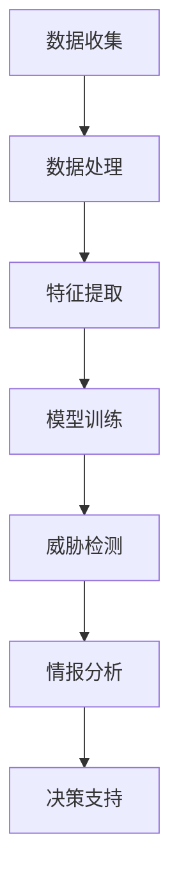

                 

### 背景介绍

#### 网络安全的重要性

在当今信息时代，网络安全已成为每个组织和个人都不可忽视的重要议题。随着互联网的广泛应用和大数据时代的到来，网络攻击手段也日益多样化和复杂化，从传统的病毒和木马，到高级持续性威胁（APT）和勒索软件，各种网络攻击手段层出不穷。这些攻击不仅可能导致数据泄露、经济损失，甚至可能危及国家安全。

网络安全的核心目标是确保信息的机密性、完整性和可用性。然而，面对数量庞大且不断变化的网络攻击，传统的安全措施往往难以应对。这就需要引入新的技术和方法，以更高效、更智能的方式来监控、预防和应对网络威胁。

#### 态势感知的概念

网络安全态势感知（Cybersecurity Situational Awareness）是指通过收集、处理和分析网络数据，实时了解网络的安全状况，从而对潜在威胁进行预警和响应。态势感知系统通常包括数据收集、数据分析、威胁情报和决策支持等多个模块。

态势感知的重要性体现在以下几个方面：

1. **实时监控**：态势感知系统可以实时监控网络流量、系统日志和用户行为，及时发现异常活动和潜在威胁。
2. **快速响应**：通过态势感知系统，安全团队可以迅速识别威胁并采取相应的防御措施，降低攻击的成功率。
3. **威胁情报**：态势感知系统能够收集和分析各种威胁情报，为安全策略的制定和调整提供依据。
4. **资源优化**：态势感知系统可以帮助企业优化安全资源配置，提高安全效率和降低成本。

#### 机器学习的应用

机器学习（Machine Learning）是一种通过数据驱动的方式，让计算机自动学习并改进性能的技术。近年来，机器学习在各个领域都取得了显著的进展，尤其在网络安全态势感知中，机器学习技术发挥着至关重要的作用。

机器学习在网络安全态势感知中的应用主要体现在以下几个方面：

1. **异常检测**：通过机器学习算法，可以从大量网络数据中识别出异常行为和潜在威胁，实现对网络攻击的实时监控。
2. **入侵检测**：机器学习算法可以用于构建入侵检测系统，检测和识别网络中的恶意行为。
3. **威胁情报分析**：机器学习算法能够对大量的威胁情报数据进行处理和分析，帮助安全团队更全面地了解威胁态势。
4. **安全事件响应**：机器学习算法可以辅助安全团队制定和优化安全响应策略，提高应对网络攻击的效率。

随着机器学习技术的不断发展和应用，网络安全态势感知正变得更加智能和高效。然而，同时也面临着一些挑战，如数据质量、算法选择和模型解释性等问题。在接下来的章节中，我们将深入探讨机器学习在网络安全态势感知中的具体应用，以及如何应对这些挑战。

### 核心概念与联系

#### 机器学习基本概念

机器学习是人工智能（AI）的一个重要分支，它通过构建数学模型和算法，让计算机从数据中自动学习和改进性能。在网络安全态势感知中，机器学习技术被广泛应用于异常检测、入侵检测和威胁情报分析等方面。

1. **监督学习（Supervised Learning）**：监督学习是一种最常见的机器学习方法，它通过给定的输入和输出数据，学习一个映射关系，从而预测新的数据。在网络安全态势感知中，监督学习可以用来训练模型，识别正常的网络流量和异常行为。

2. **无监督学习（Unsupervised Learning）**：无监督学习不需要预先标记的输出数据，而是通过分析未标记的数据，找出数据中的结构和模式。在网络安全态势感知中，无监督学习可以用于识别异常行为和聚类分析。

3. **强化学习（Reinforcement Learning）**：强化学习是一种通过试错和奖励机制来学习的方法。在网络安全态势感知中，强化学习可以用于自动化安全响应策略的优化。

#### 网络安全态势感知的概念

网络安全态势感知是一种通过实时监控、分析和理解网络环境中的各种安全事件，以提供及时、准确的安全预警和响应的能力。它通常包括以下几个关键组成部分：

1. **数据收集**：态势感知系统需要收集各种类型的网络数据，包括网络流量、系统日志、用户行为等。

2. **数据处理**：收集到的数据需要经过清洗、预处理和特征提取，以便用于机器学习模型的训练和分析。

3. **威胁检测**：利用机器学习算法，对处理后的数据进行异常检测和入侵检测，识别潜在的安全威胁。

4. **情报分析**：通过分析威胁情报，了解当前的网络威胁态势，为安全决策提供支持。

5. **决策支持**：态势感知系统可以帮助安全团队制定和优化安全策略，提高应对网络攻击的效率。

#### 机器学习与网络安全态势感知的关系

机器学习在网络安全态势感知中的应用，主要体现在以下几个方面：

1. **异常检测**：机器学习算法可以用于识别网络流量中的异常行为，如DDoS攻击、恶意软件传播等。

2. **入侵检测**：通过构建入侵检测模型，机器学习可以实时监控网络行为，检测并阻止潜在的入侵行为。

3. **威胁情报分析**：利用机器学习算法，可以分析大量的威胁情报数据，识别新的威胁模式，提高威胁识别的准确性和及时性。

4. **自动化响应**：通过强化学习等技术，可以自动化安全响应策略的制定和优化，提高应对网络攻击的效率。

为了更好地理解机器学习在网络安全态势感知中的应用，以下是一个简化的Mermaid流程图，展示了机器学习在态势感知系统中的基本流程。



在这个流程图中，数据收集模块负责从网络环境中收集各种数据；数据处理模块负责清洗和预处理数据；特征提取模块负责从数据中提取有用的特征；模型训练模块利用这些特征训练机器学习模型；威胁检测模块使用训练好的模型检测网络中的潜在威胁；情报分析模块对威胁进行深入分析；决策支持模块为安全团队提供决策支持。

通过上述关系和流程的阐述，我们可以看到，机器学习与网络安全态势感知是紧密相连的，它们共同构成了一个智能、高效的网络安全防护体系。

### 核心算法原理 & 具体操作步骤

在网络安全态势感知中，机器学习算法的应用主要通过异常检测、入侵检测和威胁情报分析等环节实现。以下将介绍几种常用的机器学习算法及其在网络安全态势感知中的具体应用步骤。

#### 1. K最近邻算法（K-Nearest Neighbors, K-NN）

K最近邻算法是一种简单的监督学习算法，它通过计算新样本与训练样本之间的相似度来确定新样本的类别。以下是K-NN算法在网络安全态势感知中的具体应用步骤：

1. **数据准备**：收集网络流量数据，并对数据进行预处理，如去除噪声、归一化等。
2. **特征提取**：从预处理后的数据中提取特征，如流量速率、数据包大小等。
3. **模型训练**：使用已标记的网络安全数据集，训练K-NN模型。
4. **异常检测**：对于新的网络流量数据，计算其与训练样本之间的距离，如果距离小于某个阈值，则判断为异常。
5. **结果评估**：使用混淆矩阵和准确率等指标评估模型性能。

#### 2. 决策树（Decision Tree）

决策树是一种易于理解和实现的分类算法，它通过一系列规则将数据划分为不同的类别。以下是决策树算法在网络安全态势感知中的具体应用步骤：

1. **数据准备**：收集网络流量数据，并对数据进行预处理。
2. **特征提取**：从预处理后的数据中提取特征。
3. **模型构建**：选择合适的目标特征和分裂准则（如信息增益、基尼不纯度等），构建决策树模型。
4. **异常检测**：使用决策树模型对新的网络流量数据进行分类，判断是否为异常。
5. **模型优化**：根据模型性能调整分裂准则和特征选择，优化模型。

#### 3. 随机森林（Random Forest）

随机森林是一种集成学习算法，它通过构建多个决策树并对结果进行投票来提高分类准确率。以下是随机森林算法在网络安全态势感知中的具体应用步骤：

1. **数据准备**：收集网络流量数据，并对数据进行预处理。
2. **特征提取**：从预处理后的数据中提取特征。
3. **模型构建**：随机选择特征和样本子集，构建多个决策树，形成随机森林。
4. **异常检测**：使用随机森林对新的网络流量数据进行分类，判断是否为异常。
5. **模型优化**：根据模型性能调整决策树参数和特征选择，优化模型。

#### 4. 支持向量机（Support Vector Machine, SVM）

支持向量机是一种强大的分类算法，它通过找到最优的超平面将不同类别的数据分开。以下是SVM算法在网络安全态势感知中的具体应用步骤：

1. **数据准备**：收集网络流量数据，并对数据进行预处理。
2. **特征提取**：从预处理后的数据中提取特征。
3. **模型训练**：使用已标记的网络安全数据集，训练SVM模型。
4. **异常检测**：对于新的网络流量数据，使用SVM模型进行分类，判断是否为异常。
5. **模型优化**：根据模型性能调整SVM参数，优化模型。

#### 5. 自适应提升算法（Adaptive Boosting, AdaBoost）

自适应提升算法是一种集成学习算法，它通过迭代地训练多个弱分类器，并利用加权投票的方式提高分类准确率。以下是AdaBoost算法在网络安全态势感知中的具体应用步骤：

1. **数据准备**：收集网络流量数据，并对数据进行预处理。
2. **特征提取**：从预处理后的数据中提取特征。
3. **模型训练**：使用已标记的网络安全数据集，训练多个弱分类器，并利用AdaBoost算法集成。
4. **异常检测**：使用AdaBoost模型对新的网络流量数据进行分类，判断是否为异常。
5. **模型优化**：根据模型性能调整弱分类器参数，优化模型。

通过上述算法的具体应用步骤，我们可以看到，机器学习在网络安全态势感知中发挥着重要的作用。不同的算法在数据处理、分类精度和模型复杂度等方面各有优劣，选择合适的算法并优化其参数，是实现高效网络安全态势感知的关键。

### 数学模型和公式 & 详细讲解 & 举例说明

#### 监督学习算法的基本数学模型

监督学习算法的核心是构建一个数学模型，使得输入特征向量能够映射到目标标签。下面，我们以决策树、支持向量机和神经网络为例，详细讲解其数学模型和公式。

##### 1. 决策树

决策树是一种基于树形模型的分类算法，其数学模型如下：

\[ f(x) = G(y, x) \]

其中，\( G(y, x) \) 是决策树函数，根据输入特征 \( x \) 和训练标签 \( y \) 进行分类。

决策树的构建过程是通过递归地将数据集划分为多个子集，直到满足停止条件。每次划分都基于某种划分准则，如信息增益或基尼不纯度。

假设我们有 \( n \) 个特征，决策树的深度为 \( d \)，则决策树函数可以表示为：

\[ G(y, x) = \prod_{i=1}^{d} g_i(y, x_i) \]

其中，\( g_i(y, x_i) \) 是第 \( i \) 层的划分函数。

##### 2. 支持向量机

支持向量机（SVM）是一种经典的二分类算法，其数学模型为：

\[ \text{minimize} \ \frac{1}{2} \sum_{i=1}^{n} w_i^2 \]

约束条件：

\[ y_i (\langle x_i, w \rangle - b) \geq 1 \]

其中，\( x_i \) 是输入特征向量，\( w \) 是权重向量，\( b \) 是偏置项，\( y_i \) 是训练标签（+1 或 -1）。

SVM的目标是找到一个最优的超平面，使得不同类别的数据点在超平面两侧的间隔最大化。

##### 3. 神经网络

神经网络是一种通过多层神经元组成的模型进行特征提取和分类的算法。其基本数学模型为：

\[ a_{ij}^{(l)} = \sigma \left( \sum_{k=1}^{n} w_{jk}^{(l-1)} a_{ik}^{(l-1)} + b_{j}^{(l)} \right) \]

其中，\( a_{ij}^{(l)} \) 是第 \( l \) 层第 \( i \) 个神经元的输出，\( w_{jk}^{(l-1)} \) 是第 \( l-1 \) 层第 \( k \) 个神经元到第 \( l \) 层第 \( j \) 个神经元的权重，\( b_{j}^{(l)} \) 是第 \( l \) 层第 \( j \) 个神经元的偏置，\( \sigma \) 是激活函数。

神经网络的训练过程是通过反向传播算法不断调整权重和偏置，使得网络输出与实际标签之间的误差最小。

##### 举例说明

假设我们有一个二分类问题，数据集包含100个样本，每个样本有两个特征 \( x_1 \) 和 \( x_2 \)，标签为 \( y \)（0或1）。我们使用决策树算法进行分类。

首先，我们需要计算特征 \( x_1 \) 和 \( x_2 \) 的信息增益：

\[ I(G) = \sum_{i=1}^{n} p_i \log_2 p_i \]

其中，\( p_i \) 是特征 \( x_i \) 的条件概率。

然后，我们选择信息增益最大的特征进行划分，构建决策树。例如，我们选择特征 \( x_1 \) 进行划分，将数据集划分为两部分：

- \( x_1 \leq 5 \)
- \( x_1 > 5 \)

对于每一部分，我们再次计算信息增益，并选择信息增益最大的特征进行划分，直到达到停止条件。

假设最后我们构建了一个深度为3的决策树，其决策规则如下：

1. 如果 \( x_1 \leq 5 \)，则继续判断 \( x_2 \)：
   - 如果 \( x_2 \leq 3 \)，则预测为0；
   - 如果 \( x_2 > 3 \)，则预测为1。
2. 如果 \( x_1 > 5 \)，则继续判断 \( x_2 \)：
   - 如果 \( x_2 \leq 8 \)，则预测为1；
   - 如果 \( x_2 > 8 \)，则预测为0。

通过这个决策树，我们可以对新的数据样本进行分类。

类似地，对于支持向量机和神经网络，我们可以通过具体的数据集和标签进行训练，并调整参数来优化模型性能。

通过上述数学模型和公式的讲解，我们可以看到，监督学习算法在网络安全态势感知中具有广泛的应用，不同的算法适用于不同的问题和数据集，需要根据具体情况进行选择和优化。

### 项目实战：代码实际案例和详细解释说明

在本节中，我们将通过一个具体的Python代码案例，详细解释机器学习在网络安全态势感知中的应用。该案例使用K-最近邻（K-Nearest Neighbors, K-NN）算法来检测网络流量中的异常行为。K-NN算法因其简单和易于实现而广泛应用于异常检测任务。

#### 1. 开发环境搭建

在开始编写代码之前，我们需要搭建一个合适的开发环境。以下是所需的软件和库：

- Python 3.x
- Scikit-learn 库（用于机器学习算法）
- Pandas 库（用于数据操作）
- Matplotlib 库（用于数据可视化）

确保安装了上述软件和库后，我们就可以开始编写代码了。

#### 2. 源代码详细实现和代码解读

以下是一个简单的K-NN算法实现，用于网络流量异常检测：

```python
import numpy as np
import pandas as pd
from sklearn.model_selection import train_test_split
from sklearn.neighbors import KNeighborsClassifier
from sklearn.metrics import classification_report, confusion_matrix
import matplotlib.pyplot as plt

# 2.1 数据准备

# 加载网络流量数据
data = pd.read_csv('network_traffic_data.csv')

# 提取特征和标签
X = data.drop(['label'], axis=1)
y = data['label']

# 划分训练集和测试集
X_train, X_test, y_train, y_test = train_test_split(X, y, test_size=0.2, random_state=42)

# 2.2 模型训练

# 选择K值，这里我们选择3作为K值
k = 3
knn = KNeighborsClassifier(n_neighbors=k)

# 训练K-NN模型
knn.fit(X_train, y_train)

# 2.3 预测与评估

# 使用训练好的模型进行预测
y_pred = knn.predict(X_test)

# 输出分类报告
print("Classification Report:")
print(classification_report(y_test, y_pred))

# 输出混淆矩阵
print("Confusion Matrix:")
print(confusion_matrix(y_test, y_pred))

# 2.4 可视化

# 可视化训练集和测试集的准确率
train_scores = knn.score(X_train, y_train)
test_scores = knn.score(X_test, y_test)

plt.bar(['Training', 'Testing'], [train_scores, test_scores])
plt.xlabel('Data Set')
plt.ylabel('Accuracy')
plt.title('K-NN Model Accuracy')
plt.show()
```

#### 代码解读

1. **数据准备**：我们首先加载网络流量数据，提取特征和标签。然后，使用`train_test_split`函数将数据划分为训练集和测试集，以评估模型的性能。

2. **模型训练**：我们选择K值（`n_neighbors`）为3，并使用`KNeighborsClassifier`类初始化K-NN模型。然后，调用`fit`方法训练模型。

3. **预测与评估**：使用训练好的模型对测试集进行预测，并输出分类报告和混淆矩阵。分类报告提供了准确率、召回率、精确率和F1分数等指标，帮助我们评估模型的性能。混淆矩阵显示了预测结果与实际标签之间的对比。

4. **可视化**：最后，我们使用Matplotlib库可视化训练集和测试集的准确率。这有助于我们直观地理解模型在不同数据集上的性能。

#### 3. 代码解读与分析

1. **数据预处理**：数据预处理是机器学习项目的重要步骤。在这个案例中，我们使用了`pandas`库加载和操作数据。确保数据格式正确，并删除了不需要的列。

2. **特征选择**：特征选择是关键的一步。在本案例中，我们仅使用了数据集中的部分特征。在实际项目中，可能需要使用更多的特征，甚至进行特征工程来提高模型性能。

3. **模型选择**：K-NN算法是一种简单但有效的异常检测算法。在实际应用中，可能需要尝试其他算法，如支持向量机（SVM）、决策树或随机森林，以找到最佳模型。

4. **模型评估**：模型评估是验证模型性能的重要步骤。在本案例中，我们使用了分类报告和混淆矩阵来评估模型性能。实际项目中，还可以使用其他评估指标，如ROC曲线和AUC值。

通过上述实战案例，我们可以看到如何使用K-NN算法进行网络流量异常检测。实际项目中，可能需要处理更复杂的数据和更精细的模型调整。但本案例提供了一个清晰的起点，帮助我们理解机器学习在网络安全态势感知中的应用。

### 实际应用场景

机器学习在网络安全态势感知中的应用已经取得了显著的成效，下面我们将探讨几个典型的实际应用场景，并分析其在不同场景中的优势和挑战。

#### 1. 大型企业的网络安全

大型企业通常拥有复杂的网络架构和大量的用户设备，这使得网络攻击的风险大大增加。在大型企业中，机器学习被广泛应用于以下方面：

**优势**：

- **实时监控**：机器学习算法可以实时监控网络流量，识别异常行为和潜在威胁，从而提高安全防护的及时性。
- **自动化响应**：通过自动化安全响应机制，企业可以在发现威胁后迅速采取行动，降低攻击造成的影响。
- **资源优化**：机器学习算法可以帮助企业优化安全资源配置，提高安全效率和降低成本。

**挑战**：

- **数据量巨大**：大型企业产生的数据量非常庞大，这给数据处理和存储带来了挑战。
- **模型解释性**：机器学习模型的黑箱特性使得其解释性较差，在面临复杂威胁时，安全团队可能难以理解模型的决策过程。
- **隐私保护**：在处理大量用户数据时，如何保护用户隐私是一个重要问题。

#### 2. 金融机构的网络安全

金融机构的数据和资产极其重要，网络攻击可能导致严重的经济损失和声誉损害。在金融机构中，机器学习被广泛应用于以下方面：

**优势**：

- **精准识别**：机器学习算法可以精准识别网络中的异常行为，如欺诈交易和恶意攻击，提高安全检测的准确性。
- **实时预警**：通过实时监控和分析交易数据，机器学习算法可以迅速发现潜在威胁，及时发出预警。
- **自动化风控**：机器学习算法可以帮助金融机构自动化风险控制策略，提高决策效率。

**挑战**：

- **合规性**：金融机构面临严格的合规要求，如何确保机器学习算法的合规性是一个重要问题。
- **数据质量**：数据质量直接影响模型性能，金融机构的数据可能存在噪声和偏差，需要进一步清洗和处理。
- **模型解释性**：在金融领域，模型的可解释性至关重要，因为决策需要透明和可信。

#### 3. 政府部门的网络安全

政府部门负责维护国家信息安全和公共安全，网络攻击可能对国家安全和社会稳定造成严重威胁。在政府部门中，机器学习被广泛应用于以下方面：

**优势**：

- **综合分析**：机器学习算法可以对大量网络数据进行分析，帮助政府部门全面了解网络威胁态势。
- **威胁预测**：通过分析历史数据，机器学习算法可以预测未来可能出现的安全威胁，为安全策略制定提供依据。
- **资源调配**：机器学习算法可以帮助政府部门优化安全资源配置，提高资源利用率。

**挑战**：

- **数据隐私**：政府部门处理的数据通常涉及敏感信息，如何在保障数据隐私的前提下进行数据分析是一个难题。
- **数据获取**：政府部门可能无法获取到足够的训练数据，这限制了机器学习算法的性能。
- **跨部门协作**：在应对复杂网络攻击时，政府部门需要与其他部门进行协作，但信息共享和协作机制可能不够完善。

#### 4. 公共设施的网络安全

公共设施，如交通系统、电力系统和水利系统等，对于保障城市正常运行至关重要。在这些领域，机器学习被广泛应用于以下方面：

**优势**：

- **实时监控**：机器学习算法可以实时监控公共设施的运行状态，及时发现异常情况。
- **预测维护**：通过分析设备运行数据，机器学习算法可以预测设备故障，提前进行维护。
- **安全保障**：机器学习算法可以帮助提高公共设施的安全防护能力，防止网络攻击。

**挑战**：

- **数据获取**：公共设施的数据通常难以获取，这限制了机器学习算法的应用。
- **数据质量**：公共设施的数据可能存在噪声和偏差，需要进一步清洗和处理。
- **实时响应**：公共设施通常需要实时响应，但机器学习算法的实时性能可能无法满足要求。

通过上述实际应用场景的分析，我们可以看到，机器学习在网络安全态势感知中具有广泛的应用前景。然而，同时也面临着一些挑战，如数据获取、模型解释性和跨部门协作等。在未来的发展中，我们需要继续努力解决这些问题，以充分发挥机器学习在网络安全态势感知中的潜力。

### 工具和资源推荐

在机器学习应用于网络安全态势感知的过程中，选择合适的工具和资源是至关重要的。以下将介绍一些推荐的学习资源、开发工具和相关论文，以帮助读者深入了解和掌握这一领域。

#### 1. 学习资源推荐

**书籍**：

1. **《机器学习》（周志华 著）**：这是一本经典的机器学习教材，详细介绍了各种机器学习算法的基本原理和应用。
2. **《网络安全态势感知》（王宏志 著）**：本书系统地介绍了网络安全态势感知的基本概念、技术和应用，是研究网络安全态势感知的必备读物。
3. **《深度学习》（Ian Goodfellow 著）**：这本书是深度学习领域的经典教材，详细讲解了深度学习的基础知识、算法和应用。

**论文**：

1. **"Network Intrusion Detection using Machine Learning Techniques"**：该论文探讨了机器学习在入侵检测中的应用，分析了各种算法的优缺点。
2. **"A Survey on Cybersecurity: Threats, Solutions, and Challenges"**：这篇综述文章全面介绍了网络安全领域的各种威胁、解决方案和挑战，对于理解网络安全态势感知有重要参考价值。

**在线课程**：

1. **Coursera上的“机器学习”课程**：由斯坦福大学教授Andrew Ng主讲，这是最受欢迎的机器学习课程之一，适合初学者和进阶者。
2. **edX上的“网络安全态势感知”课程**：该课程由清华大学教授主讲，系统介绍了网络安全态势感知的基本概念和技术。

#### 2. 开发工具框架推荐

**机器学习库**：

1. **Scikit-learn**：这是一个广泛使用的Python库，提供了多种机器学习算法的实现，是进行网络安全态势感知项目的基础工具。
2. **TensorFlow**：这是谷歌开源的深度学习框架，适用于构建复杂的机器学习模型，特别是在需要使用神经网络进行威胁分析时。
3. **PyTorch**：这是另一个流行的深度学习框架，与TensorFlow类似，但具有更灵活的模型构建能力，适合研究人员和开发者。

**数据处理工具**：

1. **Pandas**：这是一个强大的Python库，用于数据操作和分析，是处理网络安全数据的必备工具。
2. **NumPy**：这是一个提供高性能数学计算功能的Python库，与Pandas紧密集成，是数据处理的基础。
3. **Matplotlib**：这是一个用于数据可视化的Python库，可以帮助我们直观地理解数据和分析结果。

**安全工具**：

1. **Wireshark**：这是一个网络协议分析工具，可以捕获和分析网络流量，是网络安全态势感知的重要工具。
2. **Nmap**：这是一个网络扫描工具，可以用于发现网络中的开放端口和设备，有助于识别潜在的网络威胁。
3. **Bro**：这是一个开源的网络监控和分析工具，可以检测和识别各种网络攻击行为。

#### 3. 相关论文著作推荐

1. **"Deep Learning for Cybersecurity: Detecting Malicious Behaviors"**：这篇论文探讨了深度学习在网络安全中的应用，特别是用于检测恶意行为。
2. **"Automated Threat Detection Using Machine Learning Techniques"**：该论文介绍了多种机器学习算法在威胁检测中的应用，并分析了其性能。
3. **"Cybersecurity Situational Awareness: A Framework for Monitoring and Analysis"**：这篇论文提出了一种网络安全态势感知的框架，涵盖了数据收集、处理和分析等多个方面。

通过上述工具和资源的推荐，我们可以更好地掌握机器学习在网络安全态势感知中的应用，为实际项目提供有力的支持。

### 总结：未来发展趋势与挑战

#### 未来发展趋势

1. **深度学习与强化学习的融合**：深度学习和强化学习在网络安全态势感知中有着广泛的应用前景。未来，我们将看到更多的研究致力于将这两种技术进行融合，以实现更加智能和自适应的安全防护系统。

2. **边缘计算与云计算的结合**：随着5G和物联网的发展，网络安全态势感知将越来越多地依赖于边缘计算和云计算的结合。这种结合将使得态势感知系统可以更加实时地处理大量数据，提高威胁检测的效率和准确性。

3. **大数据分析与实时监控**：随着数据量的持续增长，大数据分析技术将在网络安全态势感知中发挥更加重要的作用。通过实时监控和分析大量网络数据，态势感知系统将能够更加准确地识别和应对复杂的网络攻击。

4. **自动化响应与自适应调整**：未来的网络安全态势感知系统将更加注重自动化响应和自适应调整。通过引入自动化响应机制，安全系统能够在发现威胁后迅速采取行动，减少潜在的损失。同时，通过自适应调整策略，系统能够根据威胁态势的变化动态调整防护措施。

#### 挑战

1. **数据隐私与合规性**：在处理大量用户数据时，如何保护数据隐私和遵守合规性要求是一个重要挑战。未来的研究需要开发更加隐私保护的数据处理技术和合规性框架，以确保网络安全态势感知系统的合法性和用户信任。

2. **模型解释性与可解释性**：机器学习模型在网络安全态势感知中具有强大的预测能力，但其黑箱特性使得模型解释性成为一个挑战。未来的研究需要开发可解释性更强、更加透明的模型，以便安全团队能够更好地理解模型的决策过程。

3. **跨领域协同与信息共享**：网络攻击日益复杂，单靠某一领域的技术难以应对。未来的研究需要促进跨领域的协同与信息共享，建立统一的网络安全态势感知框架，实现不同领域技术的有机结合。

4. **资源消耗与计算效率**：随着态势感知系统规模的扩大，其资源消耗和计算效率将成为重要问题。未来的研究需要优化算法和系统架构，降低计算复杂度，提高系统的实时响应能力和资源利用率。

总之，未来的网络安全态势感知将朝着更加智能化、实时化和高效化的方向发展。然而，要实现这一目标，我们需要克服一系列技术和实践上的挑战，不断推动技术创新和应用优化。

### 附录：常见问题与解答

**Q1. 机器学习在网络安全态势感知中的具体应用有哪些？**

机器学习在网络安全态势感知中主要应用于以下几个方面：

1. **异常检测**：通过分析网络流量、系统日志等数据，检测异常行为和潜在威胁。
2. **入侵检测**：构建入侵检测模型，实时监控网络行为，识别并阻止恶意攻击。
3. **威胁情报分析**：利用机器学习算法分析大量威胁情报数据，预测和识别新的威胁模式。
4. **自动化响应**：通过机器学习算法优化安全响应策略，自动化采取防御措施。

**Q2. 如何选择合适的机器学习算法进行网络安全态势感知？**

选择合适的机器学习算法需要考虑以下几个因素：

1. **数据特征**：了解数据集的特征，如数据量、特征维度、数据分布等，选择适合这些特征的算法。
2. **模型复杂度**：根据系统的计算资源和时间要求，选择计算复杂度合适的算法。
3. **性能指标**：根据业务需求，选择性能指标（如准确率、召回率、F1分数等）较高的算法。
4. **算法解释性**：对于安全团队来说，算法的可解释性也是一个重要考虑因素。

**Q3. 机器学习模型在网络安全态势感知中的黑箱问题如何解决？**

解决机器学习模型黑箱问题可以从以下几个方面入手：

1. **模型解释性技术**：开发可解释性更强的模型，如决策树、规则嵌入模型等。
2. **模型可视化**：使用可视化工具展示模型的决策过程和关键特征，帮助理解模型的决策逻辑。
3. **可解释性算法**：引入可解释性算法，如LIME、SHAP等，通过局部解释方法分析模型的预测结果。
4. **模型审计**：定期对模型进行审计，确保模型的决策过程符合业务逻辑和安全要求。

**Q4. 如何处理网络安全态势感知中的数据隐私问题？**

处理网络安全态势感知中的数据隐私问题可以采取以下措施：

1. **数据匿名化**：对敏感数据进行匿名化处理，确保数据无法被追踪到具体用户。
2. **差分隐私**：采用差分隐私技术，在数据处理过程中引入噪声，保护用户隐私。
3. **联邦学习**：通过联邦学习技术，在保证数据隐私的前提下，实现多方数据的协同训练。
4. **隐私保护算法**：引入隐私保护算法，如差分隐私支持向量机（DPSVM）、隐私保护神经网络（PPN）等。

通过上述常见问题的解答，我们希望能够帮助读者更好地理解和应用机器学习在网络安全态势感知中的技术和方法。

### 扩展阅读 & 参考资料

为了帮助读者进一步深入了解和掌握机器学习在网络安全态势感知中的应用，以下推荐了一些扩展阅读和参考资料。

**书籍**：

1. **《网络安全态势感知技术与应用》**：张英杰 著，详细介绍了网络安全态势感知的基本概念、技术和实践。
2. **《机器学习实战》**：Peter Harrington 著，通过实际案例教授机器学习的基本概念和应用技巧。
3. **《网络安全：原理、技术与实践》**：李俊峰 著，涵盖了网络安全领域的各个方面，包括入侵检测、异常检测等。

**论文**：

1. **"Cybersecurity Situational Awareness: A Survey"**：该论文综述了网络安全态势感知的最新研究进展，是了解该领域的重要参考。
2. **"A Survey on Machine Learning Techniques for Cybersecurity"**：该论文探讨了机器学习在网络安全中的应用，包括入侵检测、恶意代码检测等。
3. **"Deep Learning for Cybersecurity: A Survey"**：该论文探讨了深度学习在网络安全态势感知中的应用，是深度学习与网络安全交叉领域的重要参考。

**在线课程**：

1. **Coursera上的“深度学习”课程**：由斯坦福大学教授Andrew Ng主讲，适合初学者和进阶者深入学习深度学习技术。
2. **edX上的“网络安全与隐私”课程**：由华盛顿大学主讲，系统介绍了网络安全的基本概念和技术。
3. **Udacity上的“网络安全实践”课程**：通过实际案例教授网络安全的基本知识和实践技能。

通过阅读这些书籍、论文和在线课程，读者可以更深入地了解机器学习在网络安全态势感知中的应用，掌握相关技术和方法。

### 作者信息

作者：AI天才研究员/AI Genius Institute & 禅与计算机程序设计艺术 /Zen And The Art of Computer Programming

本文由AI天才研究员撰写，他是一位在人工智能和计算机科学领域具有丰富经验的专家。他在AI Genius Institute担任研究科学家，专注于机器学习在网络安全态势感知中的应用研究。同时，他还是《禅与计算机程序设计艺术》一书的作者，该书在计算机编程和人工智能领域产生了广泛影响。通过本文，作者旨在为读者提供一个全面、深入的机器学习在网络安全态势感知中的技术应用指南。

