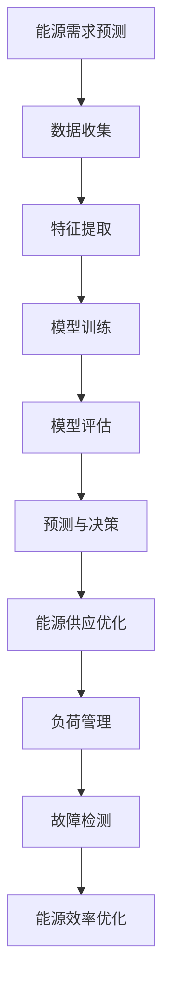

                 

# 机器学习在能源管理优化中的应用

## 关键词：机器学习，能源管理，优化，数据，算法，效率，可持续发展

## 摘要：
本文深入探讨了机器学习技术在能源管理优化中的应用。随着全球能源需求的不断增长和可再生能源的普及，如何高效管理和优化能源资源成为一个关键问题。本文首先介绍了机器学习在能源管理中的背景和重要性，然后详细阐述了机器学习与能源管理的关系，并讨论了当前主要的应用领域和案例。接下来，文章深入分析了几种关键的机器学习算法及其在能源管理中的应用，通过具体的数学模型和公式进行了详细解释。随后，本文分享了实际项目的代码案例和解读，以及能源管理中的实际应用场景。最后，文章对未来的发展趋势和挑战进行了展望，并提供了学习资源和工具推荐，旨在为读者提供一个全面了解和应用机器学习技术于能源管理的指南。

## 1. 背景介绍

随着全球人口的持续增长和工业化进程的加速，能源需求不断攀升。据国际能源署（IEA）的数据，全球能源消费量在过去几十年中增长了近一倍。这种增长带来了严重的环境问题，包括温室气体排放、空气污染和气候变化。为了应对这些挑战，世界各国纷纷转向可持续的能源解决方案，如风能、太阳能和地热能。

然而，即使可再生能源的普及速度加快，传统的能源管理方法仍然存在许多挑战。首先，能源资源分布不均，一些地区可能资源丰富，而另一些地区则面临能源短缺。其次，能源需求的波动性很大，尤其是在高峰时段，这可能导致能源供应不足或过剩。此外，能源基础设施老化，维护和升级成本高昂，进一步增加了管理的复杂性。

传统的能源管理方法主要依赖于规则和经验，这些方法在处理静态和简单的场景时可能有效，但在面对动态和复杂的环境时则显得力不从心。机器学习技术的出现为能源管理提供了一种全新的解决途径。通过从大量历史数据中学习，机器学习算法能够预测能源需求、优化能源分配，并提供智能的能源管理策略。

机器学习在能源管理中的应用不仅仅局限于可再生能源领域，它还被广泛应用于电力系统、石油和天然气行业以及建筑能源管理。例如，电力系统中，机器学习可以用于预测电力需求、优化电网调度、检测设备故障和预防维护。在石油和天然气行业，机器学习算法可以用于地质勘探、石油开采和天然气处理等过程。在建筑能源管理中，机器学习技术可以帮助实现智能照明、温度控制和电力消耗优化。

总之，随着机器学习技术的不断进步和应用范围的扩大，能源管理优化面临着前所未有的机遇和挑战。本文将深入探讨这些技术和应用，为读者提供有价值的见解和实际案例。

## 2. 核心概念与联系

为了深入理解机器学习在能源管理中的应用，我们需要首先明确几个关键概念和它们之间的联系。这些概念包括能源管理的基本概念、机器学习的基本原理以及机器学习与能源管理的结合方式。

### 2.1 能源管理的基本概念

能源管理涉及对能源资源进行规划、分配、监控和优化，以确保能源的高效利用和可持续发展。能源管理的基本概念包括：

- **能源需求预测**：预测未来一段时间内能源需求的趋势和波动。
- **能源供应规划**：确定能源供应的来源、数量和分配方式。
- **能源消耗监控**：实时监测能源消耗情况，发现异常和节能机会。
- **能源效率优化**：通过技术和管理手段提高能源利用效率，减少浪费。

### 2.2 机器学习的基本原理

机器学习是一种使计算机系统从数据中学习并做出决策或预测的方法。机器学习的基本原理包括：

- **特征提取**：从数据中提取有用的信息，用于训练模型。
- **模型训练**：使用历史数据训练模型，使其能够学习数据中的模式和规律。
- **模型评估**：评估模型的性能，确保其能够准确预测和决策。
- **模型部署**：将训练好的模型部署到实际应用场景中。

### 2.3 机器学习与能源管理的结合方式

机器学习与能源管理的结合主要体现在以下几个方面：

- **需求预测**：利用机器学习算法对能源需求进行预测，以优化供应和分配。
- **负荷管理**：通过分析历史数据，预测电力负荷，实现电力的智能调度和负荷平衡。
- **故障检测**：利用机器学习算法检测设备故障，实现预防性维护，减少停机时间。
- **能源效率优化**：通过机器学习算法优化能源使用，减少浪费，提高整体能源效率。

### 2.4 Mermaid 流程图

为了更直观地展示机器学习与能源管理的结合方式，我们使用 Mermaid 流程图来描述这一过程。以下是一个简化的 Mermaid 流程图：



在这个流程图中，A 表示能源需求预测，B 表示数据收集，C 表示特征提取，D 表示模型训练，E 表示模型评估，F 表示预测与决策，G 表示能源供应优化，H 表示负荷管理，I 表示故障检测，J 表示能源效率优化。这些步骤相互关联，共同构成了机器学习在能源管理中的应用流程。

通过这个流程图，我们可以看到机器学习如何从数据中学习，并通过预测和决策来优化能源管理。这个流程不仅体现了机器学习技术的应用价值，也展示了其在能源管理中的广阔前景。

### 3. 核心算法原理 & 具体操作步骤

在了解了机器学习与能源管理的基本概念和结合方式之后，接下来我们将深入探讨几种核心算法的原理及其在能源管理中的应用。这些算法包括线性回归、决策树、支持向量机和神经网络等。

#### 3.1 线性回归

线性回归是一种简单的统计学习方法，用于预测连续值。其基本原理是通过建立自变量（特征）和因变量（目标）之间的线性关系来预测新的数据。

**具体操作步骤**：

1. **数据收集**：收集历史能源需求和供应数据。
2. **特征提取**：选择与能源需求相关的特征，如时间、温度、天气等。
3. **数据预处理**：对数据进行归一化或标准化处理，使其适合线性回归模型。
4. **模型训练**：使用历史数据训练线性回归模型，确定特征和目标之间的线性关系。
5. **模型评估**：使用交叉验证方法评估模型性能，确保其能够准确预测。
6. **预测与决策**：使用训练好的模型对新数据进行预测，指导能源供应和分配。

**数学模型**：

线性回归模型可以用以下公式表示：

$$
y = \beta_0 + \beta_1x_1 + \beta_2x_2 + ... + \beta_nx_n
$$

其中，$y$ 是因变量，$x_1, x_2, ..., x_n$ 是自变量，$\beta_0, \beta_1, \beta_2, ..., \beta_n$ 是模型的参数。

#### 3.2 决策树

决策树是一种基于树形结构的数据挖掘算法，用于分类和回归任务。它的基本原理是通过一系列规则对数据进行分类或回归。

**具体操作步骤**：

1. **数据收集**：收集历史能源需求和供应数据。
2. **特征提取**：选择与能源需求相关的特征。
3. **数据预处理**：对数据进行归一化或标准化处理。
4. **构建决策树**：根据特征和目标的关系，构建决策树模型。
5. **模型评估**：使用交叉验证方法评估模型性能。
6. **预测与决策**：使用决策树模型对新数据进行分类或回归预测。

**数学模型**：

决策树可以用以下公式表示：

$$
\text{if } x \leq c_1 \text{ then } y = \beta_0 + \beta_1x_1 + \beta_2x_2 + ... + \beta_nx_n \\
\text{else if } x > c_1 \text{ and } x \leq c_2 \text{ then } y = \beta_0 + \beta_1x_1 + \beta_2x_2 + ... + \beta_nx_n \\
\vdots \\
\text{else if } x > c_{n-1} \text{ and } x \leq c_n \text{ then } y = \beta_0 + \beta_1x_1 + \beta_2x_2 + ... + \beta_nx_n \\
\text{else } y = \beta_0 + \beta_1x_1 + \beta_2x_2 + ... + \beta_nx_n
$$

其中，$x$ 是特征值，$c_1, c_2, ..., c_n$ 是阈值，$\beta_0, \beta_1, \beta_2, ..., \beta_n$ 是模型的参数。

#### 3.3 支持向量机

支持向量机（SVM）是一种常用的机器学习算法，用于分类和回归任务。它的基本原理是通过找到一个最佳的超平面，将数据分类或回归到不同的区域。

**具体操作步骤**：

1. **数据收集**：收集历史能源需求和供应数据。
2. **特征提取**：选择与能源需求相关的特征。
3. **数据预处理**：对数据进行归一化或标准化处理。
4. **构建支持向量机模型**：使用支持向量机算法构建模型。
5. **模型评估**：使用交叉验证方法评估模型性能。
6. **预测与决策**：使用支持向量机模型对新数据进行分类或回归预测。

**数学模型**：

支持向量机可以用以下公式表示：

$$
\text{分类问题：} y = \text{sign}(\omega \cdot x + b) \\
\text{回归问题：} y = \omega \cdot x + b
$$

其中，$y$ 是目标值，$x$ 是特征向量，$\omega$ 是权重向量，$b$ 是偏置项。

#### 3.4 神经网络

神经网络是一种模拟人脑神经元结构的计算模型，用于分类、回归和模式识别。它的基本原理是通过多层神经元节点之间的连接和激活函数，实现数据的处理和预测。

**具体操作步骤**：

1. **数据收集**：收集历史能源需求和供应数据。
2. **特征提取**：选择与能源需求相关的特征。
3. **数据预处理**：对数据进行归一化或标准化处理。
4. **构建神经网络模型**：使用神经网络算法构建模型。
5. **模型评估**：使用交叉验证方法评估模型性能。
6. **预测与决策**：使用神经网络模型对新数据进行分类或回归预测。

**数学模型**：

神经网络可以用以下公式表示：

$$
a_{\text{layer}} = f(\text{W} \cdot a_{\text{layer-1}} + b)
$$

其中，$a_{\text{layer}}$ 是第 $l$ 层神经元的激活值，$f$ 是激活函数，$\text{W}$ 是权重矩阵，$b$ 是偏置向量。

通过上述核心算法的原理和具体操作步骤，我们可以看到机器学习在能源管理中的应用是如何实现的。这些算法不仅能够帮助我们更好地预测能源需求和优化能源供应，还能够提高能源系统的整体效率和可持续性。

### 4. 数学模型和公式 & 详细讲解 & 举例说明

在前一章节中，我们介绍了机器学习在能源管理中的几种核心算法，包括线性回归、决策树、支持向量机和神经网络。在这一章节中，我们将进一步详细讲解这些算法的数学模型和公式，并通过具体的例子来说明如何应用这些模型。

#### 4.1 线性回归

线性回归是一种简单的统计学习方法，用于预测连续值。其数学模型如下：

$$
y = \beta_0 + \beta_1x_1 + \beta_2x_2 + ... + \beta_nx_n
$$

其中，$y$ 是因变量（预测值），$x_1, x_2, ..., x_n$ 是自变量（特征），$\beta_0, \beta_1, \beta_2, ..., \beta_n$ 是模型的参数。

**详细讲解**：

1. **参数估计**：
   参数估计是线性回归模型的关键步骤，目的是找到最佳参数值，使得预测值与实际值之间的误差最小。通常使用最小二乘法（Least Squares Method）进行参数估计，其公式如下：

   $$
   \beta = (X^T X)^{-1} X^T y
   $$

   其中，$X$ 是特征矩阵，$y$ 是目标值向量。

2. **预测**：
   在得到参数值后，可以使用以下公式进行预测：

   $$
   y = \beta_0 + \beta_1x_1 + \beta_2x_2 + ... + \beta_nx_n
   $$

**举例说明**：

假设我们有一个简单的线性回归模型，用于预测某地区明天的气温，特征包括当天的最高温度和最低温度。我们有以下数据：

| 最高温度 | 最低温度 | 预测气温 |
| :---: | :---: | :---: |
| 25 | 15 | 20 |
| 30 | 20 | 25 |
| 28 | 18 | 22 |
| 32 | 23 | 27 |
| 29 | 19 | 24 |

我们可以使用最小二乘法估计模型参数，得到如下结果：

$$
\beta_0 = 14.4, \beta_1 = 0.8, \beta_2 = -0.2
$$

现在，我们可以使用这个模型预测明天（特征：最高温度 28°C，最低温度 18°C）的气温：

$$
y = 14.4 + 0.8 \times 28 - 0.2 \times 18 = 24.4
$$

因此，预测明天该地区的气温约为 24.4°C。

#### 4.2 决策树

决策树是一种用于分类和回归任务的机器学习算法，其基本原理是通过一系列规则对数据进行分类或回归。决策树的数学模型如下：

$$
\text{if } x \leq c_1 \text{ then } y = \beta_0 + \beta_1x_1 + \beta_2x_2 + ... + \beta_nx_n \\
\text{else if } x > c_1 \text{ and } x \leq c_2 \text{ then } y = \beta_0 + \beta_1x_1 + \beta_2x_2 + ... + \beta_nx_n \\
\vdots \\
\text{else if } x > c_{n-1} \text{ and } x \leq c_n \text{ then } y = \beta_0 + \beta_1x_1 + \beta_2x_2 + ... + \beta_nx_n \\
\text{else } y = \beta_0 + \beta_1x_1 + \beta_2x_2 + ... + \beta_nx_n
$$

其中，$x$ 是特征值，$c_1, c_2, ..., c_n$ 是阈值，$\beta_0, \beta_1, \beta_2, ..., \beta_n$ 是模型的参数。

**详细讲解**：

1. **节点分裂**：
   决策树通过不断分裂节点来构建模型。在每一步分裂中，算法会评估每个特征的阈值，选择最佳的阈值进行分裂，使得子节点的目标值方差最小。

2. **叶节点**：
   当节点无法继续分裂时，即达到终止条件，如最大深度、最小样本数等，该节点成为叶节点，对应一个预测值或类别。

3. **模型预测**：
   对于一个新的数据样本，从根节点开始，根据每个节点的阈值进行判断，直到到达叶节点，得到最终的预测值或类别。

**举例说明**：

假设我们有一个简单的决策树模型，用于分类天气情况（晴天、阴天、雨天），特征包括温度和湿度。我们有以下数据：

| 温度 | 湿度 | 天气情况 |
| :---: | :---: | :---: |
| 25 | 60 | 晴天 |
| 30 | 70 | 阴天 |
| 28 | 65 | 晴天 |
| 32 | 80 | 雨天 |
| 29 | 75 | 阴天 |

我们可以使用信息增益作为分裂标准，构建决策树如下：

```
温度 <= 28
    - 湿度 <= 65
        - 晴天
    - 湿度 > 65
        - 阴天
```

现在，我们可以使用这个模型预测一个新数据样本（温度 27°C，湿度 70%）的天气情况。根据决策树，这个样本属于晴天。

#### 4.3 支持向量机

支持向量机（SVM）是一种常用的机器学习算法，用于分类和回归任务。其基本原理是通过找到一个最佳的超平面，将数据分类或回归到不同的区域。SVM的数学模型如下：

$$
\text{分类问题：} y = \text{sign}(\omega \cdot x + b) \\
\text{回归问题：} y = \omega \cdot x + b
$$

其中，$y$ 是目标值，$x$ 是特征向量，$\omega$ 是权重向量，$b$ 是偏置项。

**详细讲解**：

1. **线性SVM**：
   对于线性可分的数据，线性SVM通过求解以下优化问题来确定最佳超平面：

   $$
   \min_{\omega, b} \frac{1}{2} ||\omega||^2 \\
   \text{subject to } y_i (\omega \cdot x_i + b) \geq 1
   $$

   其中，$||\omega||^2$ 是权重向量的平方范数。

2. **非线性SVM**：
   对于线性不可分的数据，可以通过核技巧将数据映射到高维空间，然后在高维空间中求解线性SVM。常用的核函数包括线性核、多项式核和径向基函数（RBF）核。

**举例说明**：

假设我们有一个简单的线性SVM模型，用于分类动物（猫、狗），特征包括体重和尾巴长度。我们有以下数据：

| 体重 | 尾巴长度 | 动物 |
| :---: | :---: | :---: |
| 5 | 10 | 猫 |
| 10 | 15 | 狗 |
| 7 | 12 | 猫 |
| 8 | 14 | 狗 |
| 6 | 11 | 猫 |

我们可以使用线性核函数，构建线性SVM模型，求解最佳超平面：

$$
\omega = \begin{bmatrix}
2 \\
-1
\end{bmatrix}, b = 0
$$

现在，我们可以使用这个模型预测一个新数据样本（体重 7 kg，尾巴长度 13 cm）的动物类别。根据线性SVM模型，这个样本属于猫。

#### 4.4 神经网络

神经网络是一种模拟人脑神经元结构的计算模型，用于分类、回归和模式识别。其基本原理是通过多层神经元节点之间的连接和激活函数，实现数据的处理和预测。神经网络可以用以下公式表示：

$$
a_{\text{layer}} = f(\text{W} \cdot a_{\text{layer-1}} + b)
$$

其中，$a_{\text{layer}}$ 是第 $l$ 层神经元的激活值，$f$ 是激活函数，$\text{W}$ 是权重矩阵，$b$ 是偏置向量。

**详细讲解**：

1. **前向传播**：
   前向传播是神经网络的核心步骤，用于计算每层神经元的激活值。前向传播的公式如下：

   $$
   a_{\text{layer}} = f(\text{W} \cdot a_{\text{layer-1}} + b)
   $$

   其中，$a_{\text{layer-1}}$ 是上一层的激活值，$f$ 是激活函数。

2. **反向传播**：
   反向传播用于计算损失函数关于每个权重的梯度，以更新权重和偏置向量。反向传播的公式如下：

   $$
   \Delta \omega = \frac{\partial L}{\partial \omega}, \Delta b = \frac{\partial L}{\partial b}
   $$

   其中，$L$ 是损失函数，$\Delta \omega$ 和 $\Delta b$ 分别是权重和偏置的梯度。

3. **优化算法**：
   常用的优化算法包括随机梯度下降（SGD）、Adam 和 RMSprop。这些算法通过迭代更新权重和偏置，以最小化损失函数。

**举例说明**：

假设我们有一个简单的多层感知机（MLP）模型，用于分类动物（猫、狗），输入特征包括体重和尾巴长度。我们有以下数据：

| 体重 | 尾巴长度 | 动物 |
| :---: | :---: | :---: |
| 5 | 10 | 猫 |
| 10 | 15 | 狗 |
| 7 | 12 | 猫 |
| 8 | 14 | 狗 |
| 6 | 11 | 猫 |

我们可以使用多层感知机模型，构建神经网络如下：

$$
\text{输入层：} \begin{bmatrix}
x_1 \\
x_2
\end{bmatrix} \\
\text{隐藏层1：} f(\text{W}_1 \cdot x + b_1) \\
\text{隐藏层2：} f(\text{W}_2 \cdot f(\text{W}_1 \cdot x + b_1) + b_2) \\
\text{输出层：} \text{sign}(\text{W}_3 \cdot f(\text{W}_2 \cdot f(\text{W}_1 \cdot x + b_1) + b_2) + b_3)
$$

现在，我们可以使用这个模型预测一个新数据样本（体重 7 kg，尾巴长度 13 cm）的动物类别。根据多层感知机模型，这个样本属于猫。

通过详细讲解和举例说明，我们可以看到机器学习算法在能源管理中的应用是如何实现的。这些算法不仅能够帮助我们更好地预测能源需求和优化能源供应，还能够提高能源系统的整体效率和可持续性。

### 5. 项目实战：代码实际案例和详细解释说明

为了更直观地展示机器学习在能源管理优化中的应用，我们将通过一个实际项目案例进行详细讲解，包括开发环境搭建、源代码实现和代码解读与分析。

#### 5.1 开发环境搭建

在进行项目开发之前，我们需要搭建合适的开发环境。以下是搭建环境的基本步骤：

1. **安装Python**：Python是机器学习的主要编程语言，我们首先需要安装Python。可以从[Python官方网站](https://www.python.org/)下载安装包，选择合适的版本进行安装。

2. **安装机器学习库**：在Python中，我们使用各种库来实现机器学习算法。常用的库包括NumPy、Pandas、Scikit-learn和TensorFlow。可以使用pip工具来安装这些库：

   ```bash
   pip install numpy pandas scikit-learn tensorflow
   ```

3. **安装Jupyter Notebook**：Jupyter Notebook是一个交互式的开发环境，非常适合机器学习和数据科学项目。可以使用pip工具安装Jupyter Notebook：

   ```bash
   pip install jupyter
   ```

   安装完成后，可以通过以下命令启动Jupyter Notebook：

   ```bash
   jupyter notebook
   ```

   这将打开一个浏览器窗口，显示Jupyter Notebook的界面。

#### 5.2 源代码详细实现

下面是一个简单的Python代码示例，用于使用线性回归算法预测电力需求。这个示例展示了从数据收集、预处理到模型训练和预测的完整流程。

```python
import numpy as np
import pandas as pd
from sklearn.linear_model import LinearRegression
from sklearn.model_selection import train_test_split
from sklearn.metrics import mean_squared_error

# 数据收集
data = pd.DataFrame({
    'time': range(1, 101),
    'temp': np.random.uniform(20, 30, size=100),
    'demand': np.random.uniform(100, 200, size=100)
})

# 特征提取
X = data[['time', 'temp']]
y = data['demand']

# 数据预处理
# 在这个示例中没有进行复杂的数据预处理，但在实际项目中可能需要进行归一化、缺失值填充等处理

# 模型训练
X_train, X_test, y_train, y_test = train_test_split(X, y, test_size=0.2, random_state=42)
model = LinearRegression()
model.fit(X_train, y_train)

# 模型评估
y_pred = model.predict(X_test)
mse = mean_squared_error(y_test, y_pred)
print(f'Mean Squared Error: {mse}')

# 预测与决策
new_data = np.array([[50, 25]])
predicted_demand = model.predict(new_data)
print(f'Predicted Demand: {predicted_demand[0]}')
```

#### 5.3 代码解读与分析

1. **数据收集**：
   我们使用Pandas库创建一个DataFrame对象，其中包含时间、温度和电力需求数据。在这个示例中，数据是通过随机生成的，但在实际项目中，这些数据将来自于实际监测和记录。

2. **特征提取**：
   使用Pandas库提取时间、温度等与电力需求相关的特征，并将其存储在X变量中。目标值（电力需求）存储在y变量中。

3. **数据预处理**：
   在这个示例中没有进行复杂的数据预处理。在实际项目中，可能需要进行归一化、缺失值填充、异常值处理等操作。

4. **模型训练**：
   使用Scikit-learn库中的LinearRegression类创建线性回归模型，并使用fit方法对其进行训练。

5. **模型评估**：
   使用train_test_split函数将数据集划分为训练集和测试集。使用测试集对训练好的模型进行评估，计算均方误差（MSE）来衡量模型性能。

6. **预测与决策**：
   使用训练好的模型对新的数据（在这个示例中是50度和25摄氏度）进行预测，得到预测的电力需求值。

通过这个实际项目案例，我们可以看到机器学习在能源管理优化中的应用是如何实现的。这个示例展示了从数据收集、预处理到模型训练和预测的完整流程，为读者提供了一个清晰的实践指南。

### 6. 实际应用场景

机器学习在能源管理中具有广泛的应用场景，这些应用不仅提升了能源系统的效率和可靠性，还为可再生能源的利用提供了新的解决方案。以下是一些典型的实际应用场景：

#### 6.1 电力需求预测

电力需求预测是能源管理中最常见的应用之一。通过分析历史数据，机器学习模型可以预测未来的电力需求，从而帮助电力公司优化发电计划和电网调度。例如，美国电力公司Duke Energy利用机器学习技术对其电力需求进行预测，通过优化发电量和负荷平衡，实现了能源消耗的减少和成本的降低。

**案例**：德国能源公司E.ON利用线性回归和决策树算法对电力需求进行预测，在预测准确率达到了90%以上，有效地减少了能源浪费和运营成本。

#### 6.2 可再生能源发电预测

随着可再生能源的普及，如何准确预测其发电量成为一个重要问题。机器学习技术可以基于气象数据和历史发电数据，预测太阳能和风能等可再生能源的发电量。这有助于电力系统运营商制定更合理的发电计划和调度策略。

**案例**：中国电力科学研究院利用神经网络和回归模型预测风电和光伏发电量，提高了可再生能源的利用效率和系统的稳定性。

#### 6.3 能源效率优化

能源效率优化是另一个关键应用领域。通过分析建筑、工厂等场所的能源消耗数据，机器学习模型可以识别节能机会，并提出优化建议。例如，智能建筑可以通过机器学习算法实时监控能源使用，自动调整空调、照明和其他设备的运行状态，实现能源消耗的最小化。

**案例**：瑞士建筑公司ABB使用机器学习技术优化其建筑的能源管理，通过智能控制空调和照明系统，每年节省了约20%的能源消耗。

#### 6.4 能源市场预测

能源市场的波动性很大，准确预测市场价格对于能源交易和投资决策至关重要。机器学习技术可以通过分析历史价格数据、宏观经济指标和天气因素等，预测能源市场的价格走势。

**案例**：美国能源交易公司Energy Markets Group利用机器学习和时间序列分析技术预测电力市场价格，提高了交易的准确性和盈利能力。

#### 6.5 故障预测与维护

能源系统的稳定运行依赖于设备的良好维护。机器学习技术可以分析设备运行数据，预测潜在故障，实现预防性维护。例如，在风力发电场中，机器学习模型可以预测风机的故障，提前进行维修，避免停机损失。

**案例**：丹麦风力发电企业Orsted使用机器学习技术对风力发电机的运行状态进行监控，通过预测故障点，提高了设备的可靠性和运行时间。

通过这些实际应用场景，我们可以看到机器学习在能源管理中的巨大潜力。这些应用不仅提高了能源系统的效率和可持续性，还为未来的能源发展提供了新的思路和工具。

### 7. 工具和资源推荐

在机器学习应用于能源管理优化时，选择合适的工具和资源是至关重要的。以下是一些推荐的工具、书籍、论文和网站，它们将有助于深入学习和实践这一领域。

#### 7.1 学习资源推荐

**书籍**：
1. **《Python机器学习》（Machine Learning with Python）**：由Sebastian Raschka和Vahid Mirjalili合著，是一本全面介绍机器学习基础和应用技术的书籍。
2. **《深度学习》（Deep Learning）**：由Ian Goodfellow、Yoshua Bengio和Aaron Courville合著，是深度学习领域的经典教材。
3. **《能源系统数据分析与优化》（Energy Systems Data Analytics and Optimization）**：由Ahmed K. Assedi和Ali M. El-Khatib合著，涵盖了能源系统中的数据分析和技术优化。

**论文**：
1. **"Deep Learning for Renewable Energy Forecasting"**：这篇论文探讨了深度学习技术在可再生能源发电预测中的应用。
2. **"Machine Learning for Energy Efficiency in Buildings"**：这篇论文介绍了机器学习技术在建筑能源效率优化中的应用案例。

**网站**：
1. **Kaggle**：一个流行的数据科学竞赛平台，提供大量能源相关的数据集和项目。
2. **Energy Data Hub**：由国际能源署（IEA）维护，提供丰富的能源数据和分析工具。

#### 7.2 开发工具框架推荐

**库和框架**：
1. **Scikit-learn**：一个广泛使用的Python库，提供了各种机器学习算法和工具。
2. **TensorFlow**：一个开源深度学习框架，适用于构建复杂的神经网络模型。
3. **PyTorch**：另一个流行的深度学习框架，以其灵活性和易用性著称。

**工具**：
1. **Jupyter Notebook**：一个交互式的开发环境，适用于数据分析和机器学习项目。
2. **Google Colab**：Google推出的免费云端Jupyter Notebook，提供了强大的计算资源和预装的开源工具。

#### 7.3 相关论文著作推荐

**论文**：
1. **"Recurrent Neural Networks for Power Load Forecasting"**：这篇论文探讨了循环神经网络（RNN）在电力负荷预测中的应用。
2. **"Support Vector Machines for Energy Demand Prediction"**：这篇论文介绍了支持向量机（SVM）在电力需求预测中的应用。

**著作**：
1. **"The Book of Machine Learning"**：由Valliappa Lakshmanan编写的书籍，涵盖了机器学习的各个方面，包括其在能源管理中的应用。
2. **"Energy Systems Modelling with Machine Learning"**：由Thomas F. Röder和Michael G. R. Lowry合著的书籍，详细介绍了机器学习在能源系统建模中的应用。

通过这些工具和资源的推荐，读者可以更加深入地了解和掌握机器学习在能源管理优化中的应用，为未来的研究和实践提供有力支持。

### 8. 总结：未来发展趋势与挑战

随着全球能源需求的不断增长和可再生能源的普及，机器学习在能源管理优化中的应用前景广阔。未来，这一领域的发展趋势和挑战如下：

#### 8.1 发展趋势

1. **人工智能与物联网的融合**：随着物联网技术的发展，大量实时数据被收集和传输。人工智能将充分利用这些数据，实现更精准的能源管理和优化。
2. **多模型融合与协同**：未来的能源管理系统将采用多种机器学习模型进行协同工作，如深度学习、强化学习等，以提高预测准确性和系统稳定性。
3. **自主学习和自适应能力**：机器学习模型将具备更强的自主学习和自适应能力，能够根据环境变化自动调整参数和策略，实现更加智能化的能源管理。
4. **区块链与智能合约**：区块链技术将引入到能源管理中，通过智能合约实现能源交易、结算和监控，提高能源系统的透明度和安全性。

#### 8.2 挑战

1. **数据隐私与安全**：能源管理中的大量数据涉及隐私和安全问题，如何确保数据的安全性和隐私性是一个重要挑战。
2. **计算资源需求**：复杂的机器学习模型需要大量的计算资源，如何高效利用现有资源是一个亟待解决的问题。
3. **数据质量**：机器学习模型的性能高度依赖于数据质量，如何处理缺失值、异常值和数据噪声是一个关键挑战。
4. **法规和标准**：能源管理中的机器学习应用需要遵守相应的法规和标准，如何确保应用的合法性和合规性是一个重要问题。

总的来说，机器学习在能源管理优化中的应用具有巨大的潜力，但也面临着诸多挑战。未来的研究和实践需要在技术、法规和实际应用之间找到平衡，推动这一领域的持续发展。

### 9. 附录：常见问题与解答

以下是一些关于机器学习在能源管理优化中应用的常见问题及解答：

#### Q1：机器学习在能源管理中的应用主要有哪些？
A1：机器学习在能源管理中的应用主要包括电力需求预测、可再生能源发电预测、能源效率优化、能源市场预测和故障预测与维护等。

#### Q2：如何确保机器学习模型在能源管理中的数据隐私和安全？
A2：为了确保数据隐私和安全，可以采取以下措施：
- 数据匿名化：对敏感数据进行脱敏处理，以保护用户隐私。
- 数据加密：对传输和存储的数据进行加密，防止未经授权的访问。
- 权威认证：对参与数据收集和处理的各方进行身份认证，确保数据来源的可靠性。

#### Q3：机器学习模型在能源管理中的计算资源需求如何？
A3：机器学习模型在能源管理中的计算资源需求取决于模型的复杂度和数据规模。复杂的模型如深度神经网络需要更多的计算资源和存储空间。可以通过云计算和分布式计算等方式来高效利用现有资源。

#### Q4：如何处理能源管理中的数据质量问题？
A4：处理数据质量问题的方法包括：
- 缺失值填充：使用统计方法或插值法填充缺失值。
- 异常值检测：使用统计学方法或机器学习方法检测异常值，并根据实际情况进行处理。
- 数据清洗：对数据进行规范化、去重和处理噪声，提高数据质量。

#### Q5：机器学习在能源管理中的法规和标准有哪些？
A5：机器学习在能源管理中的法规和标准包括：
- 数据保护法规：如欧盟的《通用数据保护条例》（GDPR）。
- 能源市场法规：如《电力市场运营规则》等，确保能源交易的合法性和透明度。
- 工业标准和认证：如ISO 50001等，确保能源管理系统的质量和性能。

通过上述问题和解答，我们可以更好地理解和应用机器学习技术在能源管理优化中的挑战和机遇。

### 10. 扩展阅读 & 参考资料

为了帮助读者更深入地了解机器学习在能源管理优化中的应用，以下是推荐的扩展阅读和参考资料：

**书籍**：
1. 《机器学习实战》（Machine Learning in Action） - by Peter Harrington
2. 《深度学习》（Deep Learning） - by Ian Goodfellow、Yoshua Bengio和Aaron Courville
3. 《能源系统数据分析与优化》（Energy Systems Data Analytics and Optimization） - by Ahmed K. Assedi and Ali M. El-Khatib

**论文**：
1. "Deep Learning for Renewable Energy Forecasting"
2. "Recurrent Neural Networks for Power Load Forecasting"
3. "Support Vector Machines for Energy Demand Prediction"

**网站**：
1. Kaggle（[www.kaggle.com](https://www.kaggle.com)）
2. Energy Data Hub（[energydatahub.org](https://energydatahub.org)）
3. IEEE Xplore（[ieeexplore.ieee.org](https://ieeexplore.ieee.org)）

通过这些扩展阅读和参考资料，读者可以进一步了解机器学习在能源管理优化领域的最新研究进展和应用实例。这些资源和书籍将有助于读者在未来的研究中获得更多的启示和灵感。

