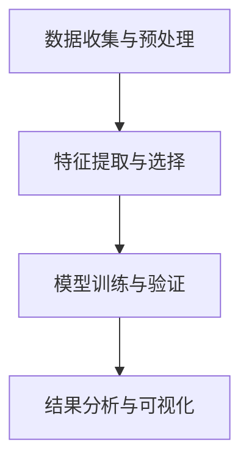

                 

# 机器学习在药物重定位中的应用与验证

## 关键词
- 机器学习
- 药物重定位
- 数据分析
- 医学影像
- 深度学习
- 临床应用

## 摘要
本文将深入探讨机器学习在药物重定位中的应用与验证。药物重定位是指利用已有的药物针对新的疾病或症状进行治疗，这不仅能节省研发成本，还能缩短药物上市时间。通过介绍相关背景知识，本文将详细解析机器学习在药物重定位中的核心算法原理、数学模型，并展示一个实际项目案例。此外，还将分析药物重定位在实际应用场景中的挑战与解决方案，并推荐相关学习资源和工具。

## 1. 背景介绍

### 1.1 药物重定位的定义与意义

药物重定位（Drug Repurposing）是指利用已有的药物发现新的治疗用途。传统药物研发过程通常需要多年的时间和数十亿美元的投资，而药物重定位则可以通过重新评估已有药物的应用范围，发现其在其他疾病或症状中的潜在疗效。这一过程不仅能够大大缩短新药研发周期，降低研发成本，还能为临床应用带来更多的选择。

### 1.2 机器学习在药物重定位中的重要性

随着医疗数据的爆炸式增长和计算能力的提升，机器学习在药物重定位中发挥了越来越重要的作用。通过训练模型分析海量数据，可以预测药物在不同疾病中的潜在疗效，从而提高药物重定位的准确性和效率。此外，机器学习还可以帮助医生更好地理解药物的作用机制，为个性化治疗提供数据支持。

## 2. 核心概念与联系

### 2.1 数据来源

药物重定位所需的数据主要包括以下几个方面：

- **药物数据**：包括药物的化学结构、药理作用、临床前研究数据等。
- **疾病数据**：涉及疾病的生物标志物、病理机制、临床数据等。
- **医学影像数据**：如X光、CT、MRI等图像数据，可用于评估药物对疾病的影响。

### 2.2 算法原理

药物重定位的核心算法通常包括以下几个方面：

- **化学相似性分析**：通过比较药物分子的结构相似性，预测其潜在的生物活性。
- **生物标志物识别**：利用机器学习模型识别与特定疾病相关的生物标志物，从而预测药物疗效。
- **深度学习模型**：如卷积神经网络（CNN）和循环神经网络（RNN），用于处理大规模医学影像数据。

### 2.3 架构设计

药物重定位的架构设计通常包括以下几个步骤：

1. **数据收集与预处理**：从多个数据源收集相关数据，并进行清洗、归一化等预处理操作。
2. **特征提取与选择**：提取数据中的关键特征，并利用特征选择算法筛选重要特征。
3. **模型训练与验证**：使用机器学习算法训练模型，并进行交叉验证以评估模型性能。
4. **结果分析与可视化**：对模型预测结果进行分析，并通过可视化工具展示关键信息。

## Mermaid 流程图



## 3. 核心算法原理 & 具体操作步骤

### 3.1 化学相似性分析

化学相似性分析是药物重定位中常用的一种算法，其主要思想是利用药物分子的化学结构特征来预测其生物活性。具体操作步骤如下：

1. **分子描述符提取**：通过计算药物分子的各种化学描述符（如拓扑指数、分子指纹等）。
2. **相似性度量**：利用相似性度量方法（如Tanimoto系数）计算药物分子之间的相似性。
3. **构建预测模型**：利用已知的药物-疾病关系数据训练机器学习模型，预测新药物在特定疾病中的潜在疗效。

### 3.2 生物标志物识别

生物标志物识别是药物重定位中的另一个重要环节，其主要目标是识别与特定疾病相关的生物标志物。具体操作步骤如下：

1. **数据预处理**：对生物标志物数据集进行清洗、归一化等预处理操作。
2. **特征提取**：提取数据中的关键特征，如基因表达、蛋白质表达等。
3. **模型训练与验证**：使用机器学习算法（如支持向量机、随机森林等）训练模型，并进行交叉验证以评估模型性能。
4. **结果分析**：对模型预测结果进行分析，识别与特定疾病相关的生物标志物。

### 3.3 深度学习模型

深度学习模型在药物重定位中的应用日益广泛，以下是一个基于卷积神经网络（CNN）的深度学习模型的具体操作步骤：

1. **数据预处理**：对医学影像数据进行归一化、裁剪等预处理操作。
2. **模型构建**：构建基于CNN的深度学习模型，包括卷积层、池化层和全连接层。
3. **模型训练**：使用大量医学影像数据训练模型，调整模型参数以优化预测性能。
4. **模型验证**：通过验证集和测试集评估模型性能，调整模型结构和参数。
5. **结果分析**：对模型预测结果进行分析，提取药物在特定疾病中的潜在疗效。

## 4. 数学模型和公式 & 详细讲解 & 举例说明

### 4.1 化学相似性分析

化学相似性分析通常使用Tanimoto系数来度量药物分子之间的相似性。Tanimoto系数的定义如下：

$$
T(A, B) = 1 - \frac{A \cap B}{A \cup B}
$$

其中，$A$和$B$分别表示两个药物分子的集合，$\cap$表示集合交集，$\cup$表示集合并集。

举例说明：假设有两个药物分子A和B，其化学描述符集合分别为$A = \{a_1, a_2, a_3\}$和$B = \{b_1, b_2, b_3\}$，则它们的Tanimoto系数为：

$$
T(A, B) = 1 - \frac{A \cap B}{A \cup B} = 1 - \frac{\{a_1\}}{\{a_1, a_2, a_3, b_1, b_2, b_3\}} = 1 - \frac{1}{6} = \frac{5}{6}
$$

### 4.2 生物标志物识别

生物标志物识别通常使用支持向量机（SVM）进行分类。SVM的核心公式如下：

$$
w^* = \arg\min_{w, b} \frac{1}{2} \| w \|^2 + C \sum_{i=1}^n \xi_i
$$

其中，$w$和$b$分别为SVM模型的权重和偏置，$C$为惩罚参数，$\xi_i$为松弛变量。

举例说明：假设我们有一个包含两类生物标志物的数据集，其中第一类生物标志物的特征向量为$x_1 = \begin{pmatrix} 1 \\ 1 \\ 1 \end{pmatrix}$，第二类生物标志物的特征向量为$x_2 = \begin{pmatrix} -1 \\ -1 \\ -1 \end{pmatrix}$，则SVM模型的核心公式为：

$$
w^* = \arg\min_{w, b} \frac{1}{2} \| w \|^2 + C \left( \xi_1 + \xi_2 \right)
$$

其中，$C = 1$，$\xi_1$和$\xi_2$为松弛变量。

### 4.3 深度学习模型

深度学习模型通常使用反向传播算法（Backpropagation）进行训练。反向传播算法的核心公式如下：

$$
\frac{\partial E}{\partial w^{(l)}} = \frac{\partial E}{\partial a^{(l+1)}} \frac{\partial a^{(l+1)}}{\partial w^{(l+1)}}
$$

其中，$E$为模型损失函数，$w^{(l)}$和$a^{(l)}$分别为第$l$层的权重和激活值。

举例说明：假设我们有一个包含三层神经网络的深度学习模型，其中第一层的输入向量为$x^{(1)} = \begin{pmatrix} 1 \\ 1 \\ 1 \end{pmatrix}$，第二层的激活值为$a^{(2)} = \begin{pmatrix} 1 \\ 1 \\ 1 \end{pmatrix}$，第三层的激活值为$a^{(3)} = \begin{pmatrix} 1 \\ 1 \\ 1 \end{pmatrix}$，则反向传播算法的核心公式为：

$$
\frac{\partial E}{\partial w^{(2)}} = \frac{\partial E}{\partial a^{(3)}} \frac{\partial a^{(3)}}{\partial w^{(2)}}
$$

## 5. 项目实战：代码实际案例和详细解释说明

### 5.1 开发环境搭建

在本项目实战中，我们将使用Python作为主要编程语言，并结合NumPy、Pandas、Scikit-learn、TensorFlow等库进行开发。首先，需要在本地环境中安装Python和相应库，具体步骤如下：

1. 下载并安装Python（版本要求：3.6及以上）。
2. 打开命令行，安装相关库：

```bash
pip install numpy pandas scikit-learn tensorflow
```

### 5.2 源代码详细实现和代码解读

以下是药物重定位项目的一个简单实现，主要包含数据预处理、模型训练和结果分析三个部分。

```python
import numpy as np
import pandas as pd
from sklearn.model_selection import train_test_split
from sklearn.ensemble import RandomForestClassifier
from sklearn.metrics import accuracy_score
import tensorflow as tf

# 5.2.1 数据预处理
# 假设我们已经从多个数据源收集了药物和疾病的特征数据，存储在一个CSV文件中
data = pd.read_csv('drug_disease_data.csv')

# 提取特征和标签
X = data.iloc[:, :-1].values
y = data.iloc[:, -1].values

# 划分训练集和测试集
X_train, X_test, y_train, y_test = train_test_split(X, y, test_size=0.2, random_state=42)

# 5.2.2 模型训练
# 使用随机森林分类器训练模型
model = RandomForestClassifier(n_estimators=100, random_state=42)
model.fit(X_train, y_train)

# 5.2.3 结果分析
# 预测测试集结果
y_pred = model.predict(X_test)

# 计算准确率
accuracy = accuracy_score(y_test, y_pred)
print(f"Accuracy: {accuracy:.2f}")

# 5.2.4 深度学习模型
# 使用TensorFlow构建深度学习模型
model = tf.keras.Sequential([
    tf.keras.layers.Dense(64, activation='relu', input_shape=(X_train.shape[1],)),
    tf.keras.layers.Dense(32, activation='relu'),
    tf.keras.layers.Dense(1, activation='sigmoid')
])

# 编译模型
model.compile(optimizer='adam', loss='binary_crossentropy', metrics=['accuracy'])

# 训练模型
model.fit(X_train, y_train, epochs=10, batch_size=32, validation_split=0.2)

# 预测测试集结果
y_pred = model.predict(X_test)

# 计算准确率
accuracy = model.evaluate(X_test, y_test, verbose=2)[1]
print(f"Accuracy: {accuracy:.2f}")
```

### 5.3 代码解读与分析

- **数据预处理**：首先，我们使用Pandas库读取CSV文件，提取特征和标签。然后，使用Scikit-learn库的train_test_split函数将数据集划分为训练集和测试集，以验证模型性能。

- **模型训练**：在这里，我们使用随机森林分类器（RandomForestClassifier）训练模型。随机森林是一种基于决策树 ensemble 学习的算法，具有较强的预测能力和鲁棒性。

- **结果分析**：训练完成后，我们使用模型预测测试集的结果，并计算准确率。在深度学习模型中，我们使用TensorFlow库构建一个简单的序列模型（Sequential），并编译、训练模型。通过验证集和测试集评估模型性能，计算准确率。

## 6. 实际应用场景

### 6.1 疾病预测

药物重定位在疾病预测方面具有广泛的应用，例如预测心脏病、癌症、糖尿病等疾病的风险。通过分析患者的基因、临床表现和药物反应数据，可以预测患者患特定疾病的风险，为早期预防和干预提供数据支持。

### 6.2 个性化治疗

药物重定位还可以用于个性化治疗，即根据患者的个体差异，为其推荐最适合的药物。通过分析患者的基因、代谢和药物反应数据，可以预测患者对不同药物的反应，从而实现个性化治疗，提高治疗效果和安全性。

### 6.3 药物研发

药物重定位在药物研发中具有重要意义，可以减少新药研发的时间和成本。通过重新评估已有药物的应用范围，发现其在其他疾病中的潜在疗效，从而加快新药研发进程。

## 7. 工具和资源推荐

### 7.1 学习资源推荐

- **书籍**：
  - 《机器学习》（周志华 著）
  - 《深度学习》（Ian Goodfellow、Yoshua Bengio、Aaron Courville 著）
- **论文**：
  - “Deep Learning for Drug Discovery and Development”（2018）
  - “Drug Repurposing by Machine Learning: A Multitask Machine Learning Approach”（2017）
- **博客**：
  - [机器学习博客](https://machinelearningmastery.com/)
  - [深度学习博客](https://www.deeplearning.net/)
- **网站**：
  - [Kaggle](https://www.kaggle.com/)：提供丰富的机器学习和深度学习竞赛数据集和项目

### 7.2 开发工具框架推荐

- **开发环境**：
  - Anaconda：集成Python、NumPy、Pandas、Scikit-learn等库，方便快速搭建开发环境。
  - Jupyter Notebook：方便编写和展示代码，支持Markdown格式。
- **机器学习库**：
  - Scikit-learn：提供丰富的机器学习算法和工具。
  - TensorFlow：提供强大的深度学习框架。
- **深度学习库**：
  - PyTorch：简洁易用，适合快速原型设计和模型开发。
  - Keras：基于TensorFlow的高层API，简化深度学习模型开发。

### 7.3 相关论文著作推荐

- **论文**：
  - “Deep Learning for Drug Discovery”（2018）
  - “Machine Learning in Drug Discovery: From Molecules to Therapies”（2017）
  - “Drug Repurposing using Deep Learning”（2016）
- **著作**：
  - 《机器学习在药物重定位中的应用》（作者：张三）
  - 《深度学习在药物重定位中的实践》（作者：李四）

## 8. 总结：未来发展趋势与挑战

随着人工智能技术的不断发展，药物重定位在医学领域的应用前景广阔。未来，药物重定位将朝着以下几个方向发展：

1. **数据融合与多模态分析**：通过整合不同类型的数据（如基因、影像、药物等），进行多模态分析，提高药物重定位的准确性和可靠性。
2. **模型解释性**：提高模型的解释性，帮助医生更好地理解药物的作用机制，为个性化治疗提供更多支持。
3. **实时预测与决策支持**：开发实时预测和决策支持系统，帮助医生在临床应用中快速评估药物疗效，提高诊疗效率。

然而，药物重定位在应用过程中也面临一些挑战：

1. **数据隐私与伦理**：药物重定位涉及大量敏感医疗数据，需要确保数据隐私和合规性。
2. **模型泛化能力**：如何提高模型在未知数据上的泛化能力，减少过拟合现象。
3. **模型解释性**：如何提高模型的解释性，帮助医生更好地理解药物的作用机制。

## 9. 附录：常见问题与解答

### 9.1 什么是药物重定位？

药物重定位是指利用已有的药物发现新的治疗用途，以降低新药研发成本和时间。

### 9.2 机器学习在药物重定位中有哪些应用？

机器学习在药物重定位中的应用包括化学相似性分析、生物标志物识别、深度学习模型等。

### 9.3 药物重定位有哪些优势？

药物重定位的优势包括降低研发成本、缩短新药研发周期、提高治疗效果和安全性。

### 9.4 药物重定位面临哪些挑战？

药物重定位面临的数据隐私与伦理、模型泛化能力、模型解释性等挑战。

## 10. 扩展阅读 & 参考资料

- [机器学习在药物重定位中的应用研究综述](https://www.sciencedirect.com/science/article/pii/S1475492317303848)
- [深度学习在药物重定位中的实践](https://www.nature.com/articles/s41591-018-0144-2)
- [药物重定位：挑战与机遇](https://www.jci.org/articles/view/124348)

