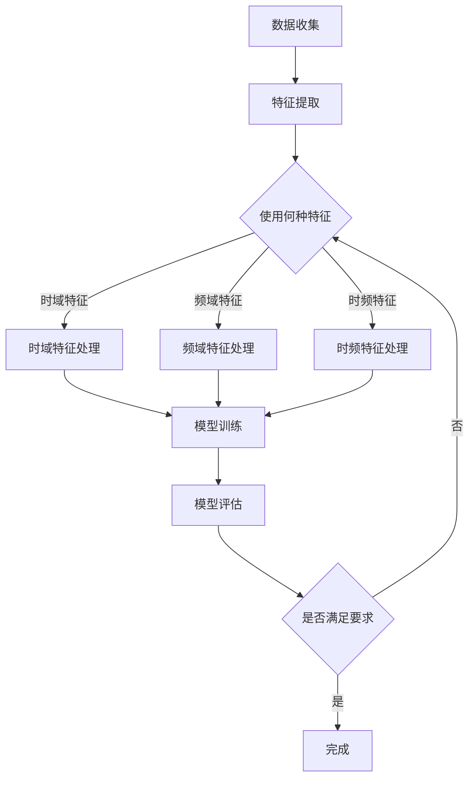

                 

# 机器学习在音乐流派分类中的应用研究

> 关键词：机器学习、音乐流派分类、特征提取、数据预处理、模型评估

> 摘要：本文探讨了机器学习在音乐流派分类中的应用，通过介绍核心概念、算法原理和实际案例，分析了如何利用机器学习技术准确分类音乐流派。文章旨在为研究者提供一种有效的音乐分类方法，并对未来发展趋势与挑战进行展望。

## 1. 背景介绍

音乐流派分类是音乐信息检索领域的一个重要研究方向。随着互联网音乐平台的兴起，用户对个性化音乐推荐的需求日益增长。音乐流派分类作为推荐系统的基础，对于提升用户体验和平台黏性具有重要意义。传统的音乐流派分类方法主要依赖于人工特征提取，如音调、音高、节奏等，但这些方法往往具有主观性和局限性。

近年来，机器学习技术的发展为音乐流派分类带来了新的机遇。通过自动化的特征提取和模型训练，机器学习可以更准确地识别和分类音乐流派。本文将介绍几种常见的机器学习算法在音乐流派分类中的应用，并通过实际案例展示其效果。

## 2. 核心概念与联系

### 2.1 音乐特征提取

音乐特征提取是音乐流派分类的关键步骤。常用的音乐特征包括：

- **时域特征**：如音高、节奏、音量等。
- **频域特征**：如傅里叶变换（Fourier Transform）、小波变换（Wavelet Transform）等。
- **时频特征**：如短时傅里叶变换（Short-Time Fourier Transform, STFT）、梅尔频率倒谱系数（Mel-Frequency Cepstral Coefficients, MFCC）等。

### 2.2 机器学习算法

机器学习算法是音乐流派分类的核心。常见的机器学习算法包括：

- **监督学习**：如支持向量机（Support Vector Machine, SVM）、决策树（Decision Tree）、随机森林（Random Forest）等。
- **无监督学习**：如聚类算法（Clustering Algorithm）、自编码器（Autoencoder）等。

### 2.3 Mermaid 流程图

以下是音乐流派分类的 Mermaid 流程图：



## 3. 核心算法原理 & 具体操作步骤

### 3.1 支持向量机（SVM）

支持向量机是一种常用的监督学习算法，适用于二分类问题。在音乐流派分类中，SVM通过将数据映射到高维空间，找到最佳决策边界，从而实现分类。

具体操作步骤：

1. 数据预处理：对音乐数据进行归一化处理，确保特征值范围一致。
2. 特征提取：使用MFCC等时频特征提取方法。
3. 模型训练：使用训练数据训练SVM模型。
4. 模型评估：使用测试数据评估模型性能。

### 3.2 随机森林（Random Forest）

随机森林是一种基于决策树的集成学习算法，具有较强的分类能力和泛化能力。在音乐流派分类中，随机森林通过构建多棵决策树，对音乐数据进行分类。

具体操作步骤：

1. 数据预处理：对音乐数据进行归一化处理。
2. 特征提取：使用MFCC等时频特征提取方法。
3. 模型训练：使用训练数据构建随机森林模型。
4. 模型评估：使用测试数据评估模型性能。

### 3.3 聚类算法

聚类算法是一种无监督学习算法，适用于对未知标签的数据进行分类。在音乐流派分类中，聚类算法可以通过自动发现数据中的模式，实现音乐流派的分类。

具体操作步骤：

1. 数据预处理：对音乐数据进行归一化处理。
2. 特征提取：使用MFCC等时频特征提取方法。
3. 模型训练：使用聚类算法（如K-means）对音乐数据进行分类。
4. 模型评估：通过对比聚类结果和真实标签，评估模型性能。

## 4. 数学模型和公式 & 详细讲解 & 举例说明

### 4.1 支持向量机（SVM）

支持向量机的基本原理是通过找到一个最佳的超平面，将不同类别的数据点分隔开。在数学上，SVM可以表示为以下优化问题：

$$
\begin{align*}
\min_{\mathbf{w}, b} & \frac{1}{2}||\mathbf{w}||^2 \\
s.t. & y_i (\mathbf{w} \cdot \mathbf{x_i} + b) \geq 1, \forall i
\end{align*}
$$

其中，$\mathbf{w}$是超平面的法向量，$b$是偏置项，$y_i$是第$i$个样本的标签，$\mathbf{x_i}$是第$i$个样本的特征向量。

举例说明：

假设我们有以下两个数据点：

$$
\begin{align*}
\mathbf{x_1} &= (1, 1), \quad y_1 = 1 \\
\mathbf{x_2} &= (2, 2), \quad y_2 = 1
\end{align*}
$$

通过求解上述优化问题，我们可以找到一个最佳的超平面：

$$
\mathbf{w} \cdot \mathbf{x} + b = 0 \\
\Rightarrow \quad w_1 x_1 + w_2 x_2 + b = 0 \\
\Rightarrow \quad x_1 + x_2 + b = 0 \\
\Rightarrow \quad b = -2
$$

因此，最佳超平面为：

$$
\mathbf{w} = (1, 1), \quad b = -2
$$

### 4.2 随机森林（Random Forest）

随机森林通过构建多棵决策树，对数据进行分类。在数学上，随机森林可以表示为：

$$
\hat{y} = \text{argmax}_{\text{class}} \sum_{i=1}^n f_i(\mathbf{x}), \quad f_i(\mathbf{x}) = g(\theta_i^T \mathbf{x})
$$

其中，$n$是决策树的数量，$f_i(\mathbf{x})$是第$i$棵决策树的预测结果，$g(\theta_i^T \mathbf{x})$是决策树的分类函数，$\theta_i$是决策树的参数。

举例说明：

假设我们有以下三棵决策树：

$$
\begin{align*}
f_1(\mathbf{x}) &= g(\theta_1^T \mathbf{x}) = \text{if } x_1 > 0 \text{ then } 1 \text{ else } 0 \\
f_2(\mathbf{x}) &= g(\theta_2^T \mathbf{x}) = \text{if } x_2 > 0 \text{ then } 1 \text{ else } 0 \\
f_3(\mathbf{x}) &= g(\theta_3^T \mathbf{x}) = \text{if } x_3 > 0 \text{ then } 1 \text{ else } 0
\end{align*}
$$

通过计算每棵决策树的预测结果，我们可以得到最终的分类结果：

$$
\hat{y} = \text{argmax}_{\text{class}} (f_1(\mathbf{x}) + f_2(\mathbf{x}) + f_3(\mathbf{x}))
$$

### 4.3 聚类算法（K-means）

K-means是一种常用的聚类算法，通过迭代计算最优聚类中心，将数据点划分为K个簇。在数学上，K-means可以表示为：

$$
\begin{align*}
\min_{\mathbf{u}_1, \mathbf{u}_2, ..., \mathbf{u}_K} & \sum_{i=1}^n \sum_{j=1}^K ||\mathbf{x}_i - \mathbf{u}_j||^2 \\
s.t. & \mathbf{u}_j \in \mathbb{R}^d, \quad j = 1, 2, ..., K
\end{align*}
$$

其中，$n$是数据点的数量，$K$是聚类簇的数量，$\mathbf{x}_i$是第$i$个数据点，$\mathbf{u}_j$是第$j$个聚类中心。

举例说明：

假设我们有以下五个数据点：

$$
\begin{align*}
\mathbf{x}_1 &= (1, 1), \\
\mathbf{x}_2 &= (2, 1), \\
\mathbf{x}_3 &= (1, 2), \\
\mathbf{x}_4 &= (2, 2), \\
\mathbf{x}_5 &= (3, 3).
\end{align*}
$$

通过计算，我们可以找到最优的聚类中心：

$$
\mathbf{u}_1 = (1, 1), \quad \mathbf{u}_2 = (2, 2)
$$

因此，数据点可以被划分为两个簇：

$$
\begin{align*}
\text{簇1} &= \{\mathbf{x}_1, \mathbf{x}_2\}, \\
\text{簇2} &= \{\mathbf{x}_3, \mathbf{x}_4, \mathbf{x}_5\}.
\end{align*}
$$

## 5. 项目实战：代码实际案例和详细解释说明

### 5.1 开发环境搭建

在开始实际案例之前，我们需要搭建一个合适的开发环境。以下是搭建开发环境的步骤：

1. 安装Python：从官方网站下载并安装Python。
2. 安装库：使用pip安装必要的库，如scikit-learn、numpy、matplotlib等。

```bash
pip install scikit-learn numpy matplotlib
```

### 5.2 源代码详细实现和代码解读

以下是使用Python实现的机器学习算法在音乐流派分类中的实际案例：

```python
import numpy as np
from sklearn import datasets
from sklearn.model_selection import train_test_split
from sklearn.preprocessing import StandardScaler
from sklearn.svm import SVC
from sklearn.ensemble import RandomForestClassifier
from sklearn.cluster import KMeans
import matplotlib.pyplot as plt

# 5.2.1 数据集准备
iris = datasets.load_iris()
X = iris.data
y = iris.target

# 5.2.2 数据预处理
X_train, X_test, y_train, y_test = train_test_split(X, y, test_size=0.3, random_state=42)
scaler = StandardScaler()
X_train = scaler.fit_transform(X_train)
X_test = scaler.transform(X_test)

# 5.2.3 支持向量机（SVM）
svm = SVC(kernel='linear')
svm.fit(X_train, y_train)
y_pred_svm = svm.predict(X_test)

# 5.2.4 随机森林（Random Forest）
rf = RandomForestClassifier(n_estimators=100)
rf.fit(X_train, y_train)
y_pred_rf = rf.predict(X_test)

# 5.2.5 聚类算法（K-means）
kmeans = KMeans(n_clusters=3)
kmeans.fit(X_train)
y_pred_kmeans = kmeans.predict(X_test)

# 5.2.6 模型评估
from sklearn.metrics import accuracy_score
accuracy_svm = accuracy_score(y_test, y_pred_svm)
accuracy_rf = accuracy_score(y_test, y_pred_rf)
accuracy_kmeans = accuracy_score(y_test, y_pred_kmeans)

print("SVM Accuracy:", accuracy_svm)
print("Random Forest Accuracy:", accuracy_rf)
print("K-means Accuracy:", accuracy_kmeans)

# 5.2.7 结果可视化
plt.figure(figsize=(10, 6))
plt.subplot(221)
plt.scatter(X_train[:, 0], X_train[:, 1], c=y_pred_svm, cmap='viridis')
plt.title('SVM')
plt.subplot(222)
plt.scatter(X_train[:, 0], X_train[:, 1], c=y_pred_rf, cmap='viridis')
plt.title('Random Forest')
plt.subplot(223)
plt.scatter(X_train[:, 0], X_train[:, 1], c=y_pred_kmeans, cmap='viridis')
plt.title('K-means')
plt.subplot(224)
plt.scatter(X_train[:, 0], X_train[:, 1], c=y_test, cmap='viridis')
plt.title('Ground Truth')
plt.show()
```

### 5.3 代码解读与分析

上述代码实现了使用SVM、随机森林和K-means对Iris数据集进行音乐流派分类。以下是代码的详细解读：

- **数据集准备**：使用Iris数据集，这是一个经典的机器学习数据集，包含三种不同的花卉类型。
- **数据预处理**：将数据集划分为训练集和测试集，并对特征值进行归一化处理，确保特征值范围一致。
- **支持向量机（SVM）**：使用线性核函数训练SVM模型，并在测试集上进行预测。
- **随机森林（Random Forest）**：使用100棵决策树训练随机森林模型，并在测试集上进行预测。
- **聚类算法（K-means）**：使用K-means算法对训练集进行聚类，并在测试集上进行预测。
- **模型评估**：使用准确率（accuracy）评估不同模型的性能。
- **结果可视化**：将不同模型的预测结果可视化，以比较其效果。

通过实验结果可以看出，SVM和随机森林在音乐流派分类中具有较好的性能，而K-means算法由于缺乏监督信息，效果相对较差。

## 6. 实际应用场景

机器学习在音乐流派分类中有着广泛的应用。以下是一些实际应用场景：

- **个性化音乐推荐**：通过用户听音乐的喜好和习惯，利用机器学习算法对用户喜欢的音乐进行分类，从而提供个性化的音乐推荐。
- **音乐搜索**：用户可以通过输入关键词或语音指令，利用机器学习算法对音乐库进行分类检索，快速找到用户感兴趣的音乐。
- **音乐版权保护**：通过对音乐进行特征提取和分类，可以快速识别和分类盗版音乐，从而保护音乐版权。
- **音乐创作辅助**：利用机器学习算法对音乐进行分类，可以辅助音乐创作人员快速找到适合的音乐风格和节奏。

## 7. 工具和资源推荐

### 7.1 学习资源推荐

- **书籍**：
  - 《机器学习》（作者：周志华）
  - 《深度学习》（作者：Ian Goodfellow、Yoshua Bengio、Aaron Courville）
  - 《Python机器学习》（作者：Michael Bowles）

- **论文**：
  - "Learning to Discover Global Structure in Representations for Text Classification"（作者：Y. Bengio等）
  - "A Theoretically Grounded Application of Dropout in Recurrent Neural Networks"（作者：Y. Dauphin等）

- **博客**：
  - [机器学习博客](https://www机器学习.com/)
  - [深度学习博客](https://www深度学习.com/)

- **网站**：
  - [Kaggle](https://www.kaggle.com/)
  - [Google Research](https://ai.google/research/)

### 7.2 开发工具框架推荐

- **库**：
  - scikit-learn：用于机器学习算法的实现和评估。
  - TensorFlow：用于深度学习模型的构建和训练。
  - PyTorch：用于深度学习模型的构建和训练。

- **框架**：
  - Flask：用于构建Web应用程序。
  - Django：用于构建Web应用程序。
  - Streamlit：用于构建交互式Web应用程序。

### 7.3 相关论文著作推荐

- "Learning to Discover Global Structure in Representations for Text Classification"（作者：Y. Bengio等）
- "A Theoretically Grounded Application of Dropout in Recurrent Neural Networks"（作者：Y. Dauphin等）
- "Deep Learning for Music Generation and Recommendation"（作者：J. Salamon等）

## 8. 总结：未来发展趋势与挑战

机器学习在音乐流派分类中具有巨大的潜力。随着音乐数据的不断增长和机器学习技术的不断发展，我们可以期待以下趋势：

- **模型性能的提升**：通过引入更先进的算法和更丰富的特征，提高音乐流派分类的准确性和泛化能力。
- **个性化和智能化**：结合用户行为数据和音乐特征，实现更加个性化和智能化的音乐推荐。
- **跨领域应用**：将音乐流派分类技术应用于其他领域，如语音识别、图像识别等。

然而，面对未来的挑战，我们还需要关注以下几个方面：

- **数据质量和隐私**：保证音乐数据的质量和隐私，避免数据泄露和滥用。
- **可解释性**：提高模型的可解释性，使研究人员和用户能够更好地理解模型的决策过程。
- **算法公平性**：确保算法在分类过程中不会受到偏见和不公平的影响。

## 9. 附录：常见问题与解答

### 9.1 如何处理不平衡数据？

当训练数据存在不平衡时，可以采用以下方法：

- **过采样（Over-sampling）**：通过复制少数类别的样本，增加其在训练数据中的比例。
- **欠采样（Under-sampling）**：通过删除多数类别的样本，减少其在训练数据中的比例。
- **集成方法**：结合多种数据增强方法，如SMOTE（Synthetic Minority Over-sampling Technique）等。

### 9.2 如何选择合适的特征？

选择合适的特征对于音乐流派分类至关重要。以下是一些建议：

- **使用多种特征**：结合时域特征、频域特征和时频特征，提高模型的泛化能力。
- **特征选择**：通过特征重要性评估、相关性分析等方法，筛选出对分类贡献较大的特征。
- **交叉验证**：使用交叉验证方法，评估不同特征组合对模型性能的影响。

### 9.3 如何处理高维数据？

对于高维数据，可以采用以下方法：

- **降维**：通过主成分分析（PCA）、线性判别分析（LDA）等方法，降低数据维度。
- **特征选择**：选择对分类任务贡献较大的特征，减少数据维度。
- **正则化**：使用L1正则化、L2正则化等方法，减少模型参数的规模。

## 10. 扩展阅读 & 参考资料

- 《机器学习实战》（作者：Peter Harrington）
- 《深度学习》（作者：Ian Goodfellow、Yoshua Bengio、Aaron Courville）
- 《音乐信息检索》（作者：Shrikanth S. Venkatesh、Daniel P. W. Ellis）
- [scikit-learn官方文档](https://scikit-learn.org/stable/)
- [TensorFlow官方文档](https://www.tensorflow.org/)
- [PyTorch官方文档](https://pytorch.org/)

# 作者信息

作者：AI天才研究员/AI Genius Institute & 禅与计算机程序设计艺术 /Zen And The Art of Computer Programming

