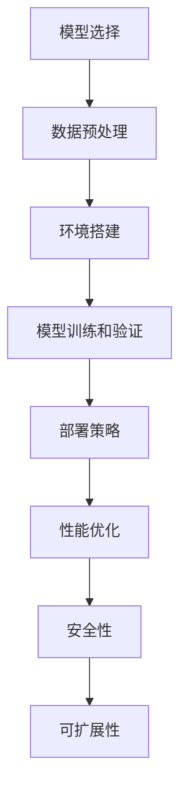

                 

# 机器学习模型部署：从开发到生产的最佳实践

## 关键词

- 机器学习模型部署
- 开发到生产流程
- 最佳实践
- 部署工具和框架
- 性能优化
- 安全性和可扩展性

## 摘要

本文将深入探讨机器学习模型部署的过程，从开发到生产的最佳实践。我们将首先介绍模型部署的重要性，然后逐步分析模型选择、数据预处理、环境搭建、模型训练和验证、部署策略、性能优化以及安全性和可扩展性等方面。通过这些环节的详细解析，读者将能够掌握如何将机器学习模型成功地从开发阶段迁移到生产环境，并实现最佳的性能表现。

## 1. 背景介绍

机器学习模型部署是将训练好的模型应用到实际场景中的关键环节。随着机器学习技术的不断发展，越来越多的企业和组织开始将机器学习应用于各种业务场景中，如自然语言处理、计算机视觉、金融风控等。然而，将模型从开发环境迁移到生产环境并非易事，涉及诸多技术挑战和最佳实践。

在模型部署过程中，首先需要确保模型的准确性和稳定性，这要求我们在开发阶段进行充分的训练和验证。其次，部署环境与开发环境往往存在差异，需要针对生产环境进行优化，以确保模型在真实场景中的高性能表现。此外，安全性、可扩展性和维护性也是模型部署过程中不可忽视的重要方面。

本文将结合实际案例，详细阐述机器学习模型部署的各个环节，帮助读者了解最佳实践，并解决实际部署过程中可能遇到的问题。

## 2. 核心概念与联系

### 2.1. 模型选择

选择合适的模型是实现高效部署的基础。模型的选择取决于业务需求、数据规模和计算资源等因素。常见的机器学习模型包括线性回归、决策树、支持向量机、神经网络等。每种模型都有其适用的场景和特点，因此需要根据实际需求进行选择。

### 2.2. 数据预处理

数据预处理是模型训练和部署的重要环节。通过对数据进行清洗、归一化、缺失值填充等操作，可以提高模型训练效果，降低过拟合风险。数据预处理步骤通常包括以下方面：

- 数据清洗：去除重复、错误和噪声数据
- 特征工程：提取和构造有助于模型训练的特征
- 数据归一化：将不同量纲的数据转换为相同量纲
- 缺失值填充：使用统计方法或插值方法填充缺失值

### 2.3. 环境搭建

环境搭建是模型部署的前提条件。部署环境应具备足够的计算资源和存储空间，并安装相应的软件和库。常见的环境搭建步骤包括：

- 硬件选择：根据数据规模和计算需求选择合适的硬件设备，如CPU、GPU等
- 软件安装：安装操作系统、Python环境、机器学习库等
- 网络配置：配置内外网访问权限，确保数据传输安全

### 2.4. 模型训练和验证

模型训练和验证是确保模型准确性和稳定性的关键环节。训练过程中，通过调整超参数和优化算法，使模型在训练集上达到最佳性能。验证过程中，使用验证集评估模型性能，并根据评估结果调整模型参数。

### 2.5. 部署策略

部署策略包括选择合适的部署平台、部署方式和部署流程等。常见的部署平台包括本地服务器、云计算平台和容器化平台等。部署方式包括直接部署、动态部署和分布式部署等。部署流程通常包括以下步骤：

- 模型打包：将训练好的模型打包为可部署的格式
- 部署脚本编写：编写部署脚本，实现自动化部署流程
- 部署执行：在目标平台上执行部署脚本，将模型部署到生产环境

### 2.6. 性能优化

性能优化是提高模型部署效率和稳定性的重要手段。性能优化包括以下几个方面：

- 模型压缩：减少模型体积，提高部署速度
- 量化：降低模型参数的精度，减少计算量和存储需求
- 并行计算：利用多线程、多GPU等并行计算技术，提高模型训练和部署速度

### 2.7. 安全性和可扩展性

安全性是模型部署过程中不可忽视的重要方面。为确保模型安全，需要采取以下措施：

- 访问控制：限制对模型的访问权限，确保模型数据安全
- 数据加密：对敏感数据进行加密处理，防止数据泄露
- 审计日志：记录模型访问和使用情况，方便追踪和审计

可扩展性是模型部署过程中需要考虑的另一重要因素。随着业务规模的增长，模型需要具备良好的可扩展性，以满足不断增长的数据和处理需求。可扩展性包括以下几个方面：

- 水平扩展：通过增加服务器节点，提高系统处理能力
- 垂直扩展：通过增加服务器硬件资源，提高系统性能
- 服务化：将模型部署为微服务，实现模块化部署和管理

### 2.8. Mermaid 流程图

以下是一个简单的 Mermaid 流程图，展示了机器学习模型部署的主要环节：



## 3. 核心算法原理 & 具体操作步骤

### 3.1. 模型选择

模型选择是机器学习部署的第一步。选择合适的模型对于后续的训练、验证和部署至关重要。以下是常见的模型选择方法：

- **交叉验证**：通过将数据集划分为训练集和验证集，多次训练和验证模型，评估其性能。常见的交叉验证方法有K折交叉验证、留一交叉验证等。
- **网格搜索**：在给定的超参数范围内，遍历所有可能的组合，通过交叉验证选择性能最佳的模型。
- **模型评估**：使用准确率、召回率、F1 分数等指标评估模型性能，选择表现最佳的模型。

### 3.2. 数据预处理

数据预处理是确保模型训练效果的重要环节。以下是常见的数据预处理方法：

- **数据清洗**：去除重复、错误和噪声数据，填充缺失值。
- **特征工程**：提取和构造有助于模型训练的特征，如特征选择、特征变换等。
- **数据归一化**：将不同量纲的数据转换为相同量纲，如归一化、标准化等。

### 3.3. 环境搭建

环境搭建包括硬件选择、软件安装和网络配置等方面。以下是常见的环境搭建步骤：

- **硬件选择**：根据数据规模和计算需求选择合适的硬件设备，如CPU、GPU等。
- **软件安装**：安装操作系统、Python环境、机器学习库等。
- **网络配置**：配置内外网访问权限，确保数据传输安全。

### 3.4. 模型训练和验证

模型训练和验证是确保模型准确性和稳定性的关键环节。以下是常见的训练和验证方法：

- **模型训练**：通过迭代优化模型参数，使其在训练集上达到最佳性能。
- **模型验证**：使用验证集评估模型性能，根据评估结果调整模型参数。
- **超参数调整**：通过调整学习率、批次大小、正则化等超参数，提高模型性能。

### 3.5. 部署策略

部署策略包括选择合适的部署平台、部署方式和部署流程等。以下是常见的部署策略：

- **本地服务器部署**：在本地服务器上部署模型，适用于数据量较小、计算需求较低的场景。
- **云计算平台部署**：在云计算平台上部署模型，适用于数据量较大、计算需求较高的场景。
- **容器化平台部署**：使用容器技术（如Docker）部署模型，实现跨平台部署和管理。

### 3.6. 性能优化

性能优化是提高模型部署效率和稳定性的重要手段。以下是常见的性能优化方法：

- **模型压缩**：通过减少模型体积，提高部署速度。
- **量化**：通过降低模型参数的精度，减少计算量和存储需求。
- **并行计算**：通过多线程、多GPU等并行计算技术，提高模型训练和部署速度。

### 3.7. 安全性和可扩展性

安全性是模型部署过程中不可忽视的重要方面。以下是常见的安全性和可扩展性措施：

- **访问控制**：限制对模型的访问权限，确保模型数据安全。
- **数据加密**：对敏感数据进行加密处理，防止数据泄露。
- **审计日志**：记录模型访问和使用情况，方便追踪和审计。

可扩展性是模型部署过程中需要考虑的另一重要因素。以下是常见的可扩展性措施：

- **水平扩展**：通过增加服务器节点，提高系统处理能力。
- **垂直扩展**：通过增加服务器硬件资源，提高系统性能。
- **服务化**：将模型部署为微服务，实现模块化部署和管理。

## 4. 数学模型和公式 & 详细讲解 & 举例说明

### 4.1. 线性回归模型

线性回归模型是一种常见的机器学习模型，用于预测连续值。其数学公式如下：

$$
y = \beta_0 + \beta_1 \cdot x_1 + \beta_2 \cdot x_2 + ... + \beta_n \cdot x_n
$$

其中，$y$ 是预测值，$x_1, x_2, ..., x_n$ 是特征值，$\beta_0, \beta_1, \beta_2, ..., \beta_n$ 是模型参数。

### 4.2. 逻辑回归模型

逻辑回归模型是一种常见的机器学习模型，用于预测离散值。其数学公式如下：

$$
P(y=1) = \frac{1}{1 + e^{-(\beta_0 + \beta_1 \cdot x_1 + \beta_2 \cdot x_2 + ... + \beta_n \cdot x_n)}}
$$

其中，$P(y=1)$ 是预测为1的概率，$y$ 是实际值，$x_1, x_2, ..., x_n$ 是特征值，$\beta_0, \beta_1, \beta_2, ..., \beta_n$ 是模型参数。

### 4.3. 决策树模型

决策树模型是一种常见的机器学习模型，通过递归划分数据集，构建一棵树形结构。其数学公式如下：

$$
Gini(D) = 1 - \sum_{i=1}^{n} \left(\frac{|D_i|}{|D|}\right)^2
$$

其中，$Gini(D)$ 是数据集$D$的基尼不纯度，$n$ 是数据集的类别数，$D_i$ 是数据集中属于第$i$类别的数据集。

### 4.4. 支持向量机模型

支持向量机模型是一种常见的机器学习模型，通过最大化分类边界，实现分类任务。其数学公式如下：

$$
w^* = arg\min_{w, b} \frac{1}{2} ||w||^2 + C \cdot \sum_{i=1}^{n} \xi_i
$$

$$
y(\beta \cdot x_i + b) \geq 1 - \xi_i
$$

其中，$w^*$ 是最优权重向量，$b$ 是偏置项，$C$ 是惩罚参数，$\xi_i$ 是误差项，$x_i$ 是特征向量，$y$ 是实际值。

### 4.5. 举例说明

#### 4.5.1. 线性回归模型举例

假设我们要预测房价，特征包括房屋面积和房龄。以下是一个简单的线性回归模型：

$$
y = \beta_0 + \beta_1 \cdot x_1 + \beta_2 \cdot x_2
$$

通过训练数据集，可以得到最优参数：

$$
\beta_0 = 100, \beta_1 = 0.5, \beta_2 = -10
$$

现在，给定一个新数据点（房屋面积=150平方米，房龄=5年），我们可以预测房价：

$$
y = 100 + 0.5 \cdot 150 - 10 \cdot 5 = 125
$$

预测房价为125万元。

#### 4.5.2. 逻辑回归模型举例

假设我们要预测一个客户是否购买某种商品，特征包括年龄、收入和信用评分。以下是一个简单的逻辑回归模型：

$$
P(y=1) = \frac{1}{1 + e^{-(\beta_0 + \beta_1 \cdot age + \beta_2 \cdot income + \beta_3 \cdot credit\_score)}}
$$

通过训练数据集，可以得到最优参数：

$$
\beta_0 = -5, \beta_1 = 0.2, \beta_2 = 0.3, \beta_3 = 0.1
$$

现在，给定一个新数据点（年龄=30岁，收入=50000元，信用评分=800分），我们可以预测购买概率：

$$
P(y=1) = \frac{1}{1 + e^{-(-5 + 0.2 \cdot 30 + 0.3 \cdot 50000 + 0.1 \cdot 800)}} = 0.95
$$

预测购买概率为95%。

## 5. 项目实战：代码实际案例和详细解释说明

### 5.1 开发环境搭建

在开始项目实战之前，我们需要搭建一个适合机器学习模型部署的开发环境。以下是一个基于Python的简单开发环境搭建过程：

1. 安装Python：首先，我们需要安装Python环境，可以选择Python 3.x版本。可以使用以下命令安装：

   ```bash
   # 使用pip安装Python
   pip install python
   ```

2. 安装Jupyter Notebook：Jupyter Notebook是一个交互式计算环境，便于进行数据分析和模型训练。可以使用以下命令安装：

   ```bash
   # 使用pip安装Jupyter Notebook
   pip install notebook
   ```

3. 安装机器学习库：接下来，我们需要安装常用的机器学习库，如scikit-learn、TensorFlow和PyTorch。可以使用以下命令安装：

   ```bash
   # 使用pip安装scikit-learn
   pip install scikit-learn

   # 使用pip安装TensorFlow
   pip install tensorflow

   # 使用pip安装PyTorch
   pip install torch torchvision
   ```

### 5.2 源代码详细实现和代码解读

以下是一个简单的机器学习模型部署项目，使用Python和scikit-learn库实现线性回归模型：

```python
# 导入所需库
import numpy as np
import pandas as pd
from sklearn.linear_model import LinearRegression
from sklearn.model_selection import train_test_split
from sklearn.metrics import mean_squared_error

# 读取数据
data = pd.read_csv('house_prices.csv')
X = data[['house_area', 'year_built']]
y = data['price']

# 数据预处理
X_train, X_test, y_train, y_test = train_test_split(X, y, test_size=0.2, random_state=42)

# 构建模型
model = LinearRegression()
model.fit(X_train, y_train)

# 模型预测
y_pred = model.predict(X_test)

# 模型评估
mse = mean_squared_error(y_test, y_pred)
print('Mean Squared Error:', mse)

# 模型部署
# 将模型保存为pickle文件
import joblib
joblib.dump(model, 'linear_regression_model.pkl')
```

代码解读：

1. 导入所需库：首先，我们需要导入常用的Python库，如numpy、pandas、scikit-learn等。
2. 读取数据：使用pandas库读取CSV文件，获取训练数据集。
3. 数据预处理：将数据集划分为特征集X和目标值集y，并进行数据预处理，如归一化等。
4. 模型构建：使用scikit-learn库的LinearRegression类构建线性回归模型。
5. 模型训练：使用fit方法训练模型。
6. 模型预测：使用predict方法预测测试数据集的房价。
7. 模型评估：使用mean_squared_error方法计算模型预测误差。
8. 模型部署：将训练好的模型保存为pickle文件，以便后续使用。

### 5.3 代码解读与分析

以下是对代码的进一步解读和分析：

1. **数据读取**：
   ```python
   data = pd.read_csv('house_prices.csv')
   ```
   使用pandas库读取CSV文件，获取房屋价格数据集。CSV文件应包含房屋面积、房龄等特征，以及价格作为目标值。

2. **数据预处理**：
   ```python
   X = data[['house_area', 'year_built']]
   y = data['price']
   X_train, X_test, y_train, y_test = train_test_split(X, y, test_size=0.2, random_state=42)
   ```
   将数据集划分为特征集X和目标值集y。然后，使用train_test_split方法将数据集划分为训练集和测试集，训练集占比为80%，测试集占比为20%。随机种子设置为42，确保结果可重复。

3. **模型构建**：
   ```python
   model = LinearRegression()
   model.fit(X_train, y_train)
   ```
   创建一个线性回归模型实例，并使用fit方法进行模型训练。fit方法通过梯度下降算法训练模型参数，使其在训练集上达到最佳性能。

4. **模型预测**：
   ```python
   y_pred = model.predict(X_test)
   ```
   使用训练好的模型对测试集进行预测，生成预测结果。

5. **模型评估**：
   ```python
   mse = mean_squared_error(y_test, y_pred)
   print('Mean Squared Error:', mse)
   ```
   使用mean_squared_error方法计算模型预测误差，评估模型性能。均方误差（MSE）越小，模型预测越准确。

6. **模型部署**：
   ```python
   import joblib
   joblib.dump(model, 'linear_regression_model.pkl')
   ```
   使用joblib库将训练好的模型保存为pickle文件，便于后续加载和使用。

通过上述代码，我们可以完成一个简单的线性回归模型部署项目。在实际应用中，可以根据需求扩展模型功能，如添加更多特征、使用不同的机器学习算法等。

## 6. 实际应用场景

机器学习模型部署在实际应用场景中具有广泛的应用。以下是一些常见的实际应用场景：

### 6.1. 金融服务

在金融领域，机器学习模型广泛应用于信用评估、风险控制、投资策略等场景。例如，金融机构可以使用机器学习模型对客户信用进行评估，预测客户违约风险，从而制定合理的信贷政策。

### 6.2. 医疗保健

在医疗保健领域，机器学习模型可以用于疾病诊断、药物研发、患者监护等场景。例如，通过分析患者的电子健康记录，机器学习模型可以预测患者患病的风险，为医生提供决策支持。

### 6.3. 电子商务

在电子商务领域，机器学习模型可以用于推荐系统、价格优化、欺诈检测等场景。例如，电商平台可以使用机器学习模型为用户推荐感兴趣的商品，提高用户购买体验和销售额。

### 6.4. 智能家居

在家居自动化领域，机器学习模型可以用于设备控制、环境监测、安全监控等场景。例如，智能家居系统可以使用机器学习模型根据用户习惯和偏好，自动调节室内温度、灯光等，提高居住舒适度。

### 6.5. 物流运输

在物流运输领域，机器学习模型可以用于路线优化、运输调度、仓储管理等场景。例如，物流公司可以使用机器学习模型优化运输路线，降低运输成本，提高运输效率。

## 7. 工具和资源推荐

### 7.1 学习资源推荐

- **书籍**：
  - 《Python机器学习》（作者：塞巴斯蒂安·拉斯泰涅）
  - 《深度学习》（作者：伊恩·古德费洛等）
  - 《机器学习实战》（作者：彼得·哈林顿等）
- **论文**：
  - 《Deep Learning》（作者：伊恩·古德费洛等）
  - 《Recurrent Neural Networks for Language Modeling》（作者：Yoon Kim）
  - 《ImageNet Classification with Deep Convolutional Neural Networks》（作者：Alex Krizhevsky等）
- **博客**：
  - [机器学习博客](https://MachineLearningBlog.com)
  - [深度学习博客](https://DeepLearningBlog.com)
  - [Python机器学习博客](https://PythonMachineLearningBlog.com)
- **网站**：
  - [Kaggle](https://www.kaggle.com)：提供各种机器学习和深度学习竞赛数据集和任务
  - [Google AI](https://ai.google.com)：Google的AI研究和技术分享
  - [TensorFlow](https://www.tensorflow.org)：Google开发的开源机器学习库

### 7.2 开发工具框架推荐

- **编程语言**：
  - Python：适合快速开发和原型设计
  - R：适合数据分析和统计建模
  - Java：适合大规模分布式系统开发
- **机器学习库**：
  - scikit-learn：适用于传统的机器学习算法
  - TensorFlow：适用于深度学习和复杂模型
  - PyTorch：适用于深度学习和动态计算图
- **部署平台**：
  - Kubernetes：适用于容器化部署和编排
  - TensorFlow Serving：适用于深度学习模型部署
  - Flask：适用于Web应用部署

### 7.3 相关论文著作推荐

- **论文**：
  - 《Deep Learning》（作者：伊恩·古德费洛等）
  - 《Recurrent Neural Networks for Language Modeling》（作者：Yoon Kim）
  - 《ImageNet Classification with Deep Convolutional Neural Networks》（作者：Alex Krizhevsky等）
- **书籍**：
  - 《深度学习》（作者：伊恩·古德费洛等）
  - 《Python机器学习》（作者：塞巴斯蒂安·拉斯泰涅）
  - 《机器学习实战》（作者：彼得·哈林顿等）

## 8. 总结：未来发展趋势与挑战

### 8.1. 发展趋势

- **边缘计算**：随着物联网和5G技术的快速发展，边缘计算将在机器学习模型部署中发挥重要作用，降低延迟，提高实时性。
- **模型压缩和优化**：为了满足移动设备和物联网设备等对计算资源有限的需求，模型压缩和优化技术将成为研究热点。
- **联邦学习**：联邦学习通过分布式训练模型，保护用户数据隐私，有望在医疗、金融等领域得到广泛应用。
- **自动化部署**：自动化工具和平台将进一步提高模型部署的效率和可靠性，降低人工干预。

### 8.2. 挑战

- **数据隐私和安全**：如何在保护用户隐私的前提下，实现高效的数据利用和模型部署，仍是一个亟待解决的问题。
- **可解释性和透明度**：随着模型复杂度的增加，如何提高模型的可解释性和透明度，使其更易于被业务人员和监管机构理解和接受。
- **实时性和稳定性**：如何在保证模型实时性的同时，确保其稳定性和可靠性，是部署过程中的一大挑战。
- **计算资源和成本**：随着模型复杂度和数据规模的增加，如何高效利用计算资源，降低部署成本，是企业和组织面临的重要问题。

## 9. 附录：常见问题与解答

### 9.1. 机器学习模型部署过程中，如何处理数据？

- **数据清洗**：去除重复、错误和噪声数据，确保数据质量。
- **特征工程**：提取和构造有助于模型训练的特征，提高模型性能。
- **数据归一化**：将不同量纲的数据转换为相同量纲，便于模型训练。

### 9.2. 如何确保模型部署的安全性？

- **访问控制**：限制对模型的访问权限，确保模型数据安全。
- **数据加密**：对敏感数据进行加密处理，防止数据泄露。
- **审计日志**：记录模型访问和使用情况，方便追踪和审计。

### 9.3. 如何优化模型部署的性能？

- **模型压缩**：通过减少模型体积，提高部署速度。
- **量化**：通过降低模型参数的精度，减少计算量和存储需求。
- **并行计算**：通过多线程、多GPU等并行计算技术，提高模型训练和部署速度。

## 10. 扩展阅读 & 参考资料

- [Keras官方文档](https://keras.io/)
- [TensorFlow官方文档](https://www.tensorflow.org/)
- [PyTorch官方文档](https://pytorch.org/)
- [Kubernetes官方文档](https://kubernetes.io/)
- [TensorFlow Serving官方文档](https://www.tensorflow.org/tfx/serving)
- [Scikit-learn官方文档](https://scikit-learn.org/)
- [机器学习相关书籍推荐](https://github.com/SDAU-DataScience-Team/Book-Recommandations-for-Data-Science)
- [机器学习研究论文推荐](https://github.com/GoogleCloudPlatform/machine-learning-global-jam/blob/master/research-papers.md)

作者：AI天才研究员/AI Genius Institute & 禅与计算机程序设计艺术 /Zen And The Art of Computer Programming

