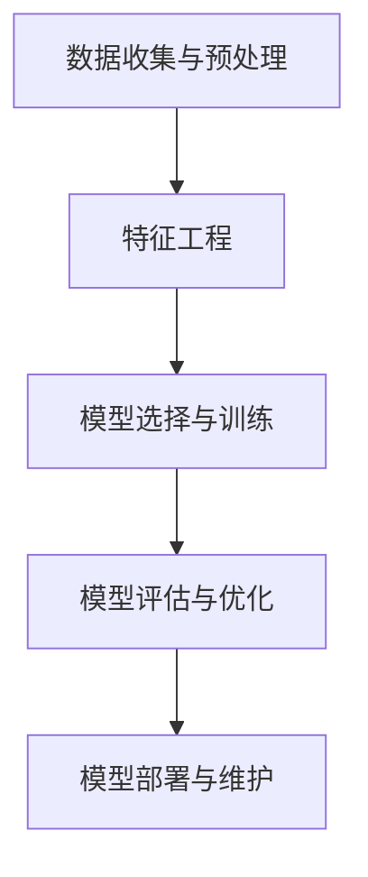
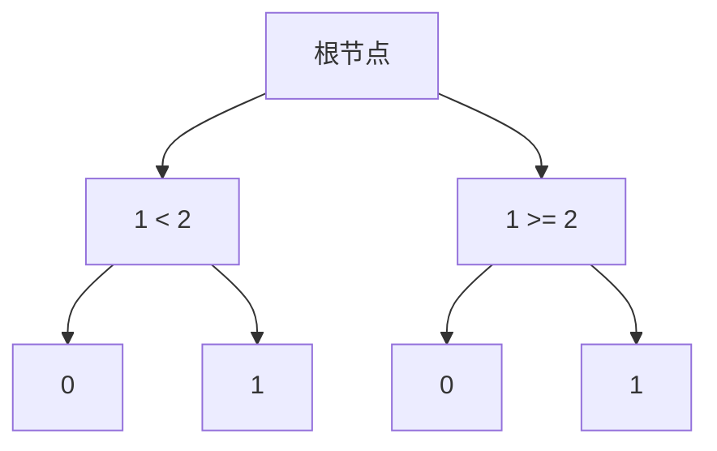

                 

# 机器学习毕业设计实践指南

## 摘要

本文将为您详细介绍机器学习毕业设计的实践指南，旨在帮助您顺利完成毕业设计，掌握机器学习的基本原理和应用。本文将分为以下几个部分：首先，我们将介绍机器学习毕业设计的背景和重要性；接着，我们将探讨机器学习的基本概念和常用算法；然后，我们将详细讲解如何设计一个完整的机器学习项目，包括数据预处理、特征工程、模型选择和调参等步骤；随后，我们将分享一些实际应用场景和案例；最后，我们将推荐一些学习资源和工具，帮助您更好地完成毕业设计。通过本文的阅读和实践，您将能够系统地掌握机器学习的基本知识和技能，为将来的职业发展打下坚实基础。

## 1. 背景介绍

### 1.1 机器学习在毕业设计中的重要性

机器学习作为人工智能的核心技术之一，已经广泛应用于各个领域，如自然语言处理、计算机视觉、推荐系统等。在毕业设计中，选择机器学习作为研究课题具有以下几个重要意义：

1. **提升实际应用能力**：通过机器学习毕业设计，您可以深入了解机器学习的基本原理和算法，掌握实际应用场景中的解决方案，提升自己的实际操作能力。

2. **培养创新思维**：机器学习涉及多个学科领域，包括数学、统计学、计算机科学等。通过毕业设计，您可以跨学科思考，培养创新思维和解决问题的能力。

3. **拓展职业发展空间**：随着人工智能技术的快速发展，具备机器学习技能的人才市场需求日益增长。完成一个高质量的机器学习毕业设计，将为您的职业发展提供强有力的支持。

### 1.2 机器学习毕业设计的发展趋势

近年来，机器学习毕业设计呈现出以下几个发展趋势：

1. **深度学习的兴起**：深度学习作为一种强大的机器学习模型，在图像识别、语音识别等领域取得了显著成果。越来越多的毕业设计项目开始关注深度学习算法的应用。

2. **跨学科研究**：随着机器学习与其他领域的交叉融合，如生物信息学、金融工程等，跨学科的研究项目逐渐增多。

3. **实际应用场景的拓展**：毕业设计项目开始更多地关注实际应用场景，如智能交通、医疗诊断等，旨在解决现实问题，提升社会效益。

### 1.3 机器学习毕业设计的基本要求

为了确保机器学习毕业设计的质量，以下是一些基本要求：

1. **选题明确**：选择具有实际意义和挑战性的课题，明确研究目标。

2. **文献综述**：对相关领域的研究现状和成果进行全面的综述，为后续研究提供理论基础。

3. **数据收集与处理**：合理收集和处理数据，确保数据的质量和可靠性。

4. **算法设计与实现**：选择合适的算法，进行模型设计和实现。

5. **实验与验证**：通过实验验证模型的效果，评估模型的性能。

6. **论文撰写**：撰写一篇结构清晰、逻辑严谨的毕业论文，总结研究成果。

## 2. 核心概念与联系

### 2.1 机器学习的定义与分类

#### 2.1.1 机器学习的定义

机器学习（Machine Learning）是一门研究如何让计算机从数据中学习并做出决策或预测的学科。机器学习主要分为以下三类：

1. **监督学习（Supervised Learning）**：通过已标记的数据训练模型，然后利用训练好的模型对未知数据进行预测。

2. **无监督学习（Unsupervised Learning）**：没有标记的数据，通过发现数据中的模式或结构来训练模型。

3. **半监督学习（Semi-Supervised Learning）**：结合标记数据和未标记数据进行训练，以提高模型的性能。

#### 2.1.2 机器学习的分类

根据学习方式的不同，机器学习可以分为以下几类：

1. **归纳学习（Inductive Learning）**：从具体实例中归纳出一般规律。

2. **演绎学习（Deductive Learning）**：从一般规律推导出具体实例。

3. **相似性学习（Similarity Learning）**：基于数据之间的相似性进行学习。

### 2.2 常用算法及其原理

#### 2.2.1 线性回归（Linear Regression）

线性回归是一种监督学习算法，用于预测连续值。其基本原理是通过最小二乘法找到一条最佳拟合直线，从而预测新的数据点的值。

$$y = \beta_0 + \beta_1x$$

其中，$y$为因变量，$x$为自变量，$\beta_0$和$\beta_1$为模型参数。

#### 2.2.2 逻辑回归（Logistic Regression）

逻辑回归是一种用于分类问题的监督学习算法。其基本原理是通过最小化对数似然函数来找到最佳拟合模型，从而对新的数据点进行分类。

$$\text{Logit}(y) = \ln\left(\frac{p}{1-p}\right) = \beta_0 + \beta_1x$$

其中，$y$为二分类变量，$p$为预测的概率，$\beta_0$和$\beta_1$为模型参数。

#### 2.2.3 决策树（Decision Tree）

决策树是一种常用的分类和回归算法。其基本原理是通过一系列规则对数据进行划分，从而构建一棵树形结构。每个内部节点表示一个特征，每个分支表示一个特征取值，每个叶子节点表示一个预测结果。

#### 2.2.4 随机森林（Random Forest）

随机森林是一种基于决策树的集成学习方法。其基本原理是通过随机选取特征和样本子集来构建多棵决策树，并利用投票机制来获得最终预测结果。

#### 2.2.5 支持向量机（SVM）

支持向量机是一种强大的分类和回归算法。其基本原理是找到一个最佳的超平面，使得分类间隔最大化，从而实现数据的分类。

$$\text{最大化}\ \frac{1}{\|\textbf{w}\|\_2} \ \text{约束}\ \y_i(\textbf{w}\_\text{Tx} + b) \geq 1$$

其中，$\textbf{w}$为权重向量，$b$为偏置项，$\y_i$为样本标签。

### 2.3 机器学习项目的基本架构

机器学习项目的基本架构可以分为以下几个部分：

1. **数据收集与预处理**：收集和处理数据，包括数据清洗、归一化、缺失值填充等。

2. **特征工程**：提取和构造有助于模型训练的特征，包括特征选择、特征变换等。

3. **模型选择与训练**：选择合适的模型，并进行模型训练。

4. **模型评估与优化**：评估模型性能，并进行模型调参，以提高模型效果。

5. **模型部署与维护**：将训练好的模型部署到实际应用场景中，并进行维护和更新。

### 2.4 Mermaid 流程图

下面是一个简单的 Mermaid 流程图，展示了机器学习项目的基本流程：



## 3. 核心算法原理 & 具体操作步骤

### 3.1 线性回归算法原理

线性回归是一种简单的监督学习算法，主要用于预测连续值。其核心思想是通过找到一条最佳拟合直线，来预测新的数据点的值。

#### 3.1.1 模型假设

线性回归假设数据满足以下线性关系：

$$y = \beta_0 + \beta_1x + \epsilon$$

其中，$y$为因变量，$x$为自变量，$\beta_0$和$\beta_1$为模型参数，$\epsilon$为误差项。

#### 3.1.2 最小二乘法

为了找到最佳拟合直线，我们需要最小化误差项$\epsilon$的平方和。这可以通过最小二乘法来实现。最小二乘法的目标是求解以下优化问题：

$$\min \sum_{i=1}^{n} (y_i - \beta_0 - \beta_1x_i)^2$$

其中，$n$为样本数量。

通过求导和求解，我们可以得到最佳拟合直线的参数：

$$\beta_0 = \bar{y} - \beta_1\bar{x}$$

$$\beta_1 = \frac{\sum_{i=1}^{n} (x_i - \bar{x})(y_i - \bar{y})}{\sum_{i=1}^{n} (x_i - \bar{x})^2}$$

其中，$\bar{x}$和$\bar{y}$分别为自变量和因变量的均值。

### 3.2 逻辑回归算法原理

逻辑回归是一种常用的分类算法，主要用于预测概率。其核心思想是通过找到最佳拟合模型，来预测新的数据点的分类概率。

#### 3.2.1 模型假设

逻辑回归假设数据满足以下线性关系：

$$\text{Logit}(y) = \ln\left(\frac{p}{1-p}\right) = \beta_0 + \beta_1x$$

其中，$y$为二分类变量，$p$为预测的概率，$\beta_0$和$\beta_1$为模型参数。

#### 3.2.2 模型推导

为了求解最佳拟合模型，我们需要最小化对数似然函数。对数似然函数的表达式为：

$$L(\beta_0, \beta_1) = \sum_{i=1}^{n} \y_i \ln(p_i) + (1 - \y_i) \ln(1 - p_i)$$

其中，$n$为样本数量，$p_i$为第$i$个样本的预测概率。

通过对数似然函数求导并求解，我们可以得到最佳拟合模型的参数：

$$\beta_0 = \bar{y} - \beta_1\bar{x}$$

$$\beta_1 = \frac{\sum_{i=1}^{n} (\y_i - \bar{y})(x_i - \bar{x})}{\sum_{i=1}^{n} (x_i - \bar{x})^2}$$

### 3.3 决策树算法原理

决策树是一种常用的分类和回归算法，其核心思想是通过一系列规则对数据进行划分，从而构建一棵树形结构。

#### 3.3.1 决策树的构建

决策树的构建过程可以分为以下几步：

1. **选择最佳特征**：选择一个特征作为节点，并计算该特征对数据的划分效果，通常使用信息增益或基尼指数作为划分标准。

2. **划分数据**：根据最佳特征将数据划分为多个子集，每个子集对应一个新的节点。

3. **递归构建**：对每个子集继续进行划分，直到满足停止条件（如最大树深度、最小节点样本数等）。

4. **生成树形结构**：将划分结果连接起来，形成一棵树形结构。

#### 3.3.2 决策树的分类与回归

1. **分类决策树**：在分类决策树中，每个节点对应一个特征，每个叶子节点对应一个分类结果。

2. **回归决策树**：在回归决策树中，每个节点对应一个特征，每个叶子节点对应一个预测结果。

### 3.4 随机森林算法原理

随机森林是一种基于决策树的集成学习方法，其核心思想是通过随机选取特征和样本子集来构建多棵决策树，并利用投票机制来获得最终预测结果。

#### 3.4.1 随机森林的构建

随机森林的构建过程可以分为以下几步：

1. **随机选取特征**：从所有特征中随机选取一部分特征作为决策树的特征。

2. **随机选取样本**：从原始数据中随机选取一部分样本作为决策树的训练数据。

3. **构建决策树**：使用选定的特征和样本子集构建一棵决策树。

4. **重复步骤 1-3**：重复以上步骤，构建多棵决策树。

#### 3.4.2 随机森林的预测

随机森林的预测过程可以分为以下几步：

1. **随机选取特征和样本**：从所有特征中随机选取一部分特征作为当前决策树的特征，并从原始数据中随机选取一部分样本作为当前决策树的训练数据。

2. **构建决策树**：使用选定的特征和样本子集构建一棵决策树。

3. **投票机制**：对多棵决策树的预测结果进行投票，获得最终预测结果。

### 3.5 支持向量机算法原理

支持向量机是一种强大的分类和回归算法，其核心思想是通过找到一个最佳的超平面，使得分类间隔最大化，从而实现数据的分类。

#### 3.5.1 支持向量机的分类原理

1. **线性可分支持向量机**：在特征空间中找到一个最佳的超平面，使得正负样本点最大限度地分开。

2. **线性不可分支持向量机**：通过引入松弛变量，使得部分样本点可以违反分类间隔。

3. **非线性支持向量机**：通过核函数将低维数据映射到高维空间，从而实现非线性分类。

#### 3.5.2 支持向量机的回归原理

1. **线性支持向量回归**：通过找到最佳拟合超平面，使得预测值与实际值之间的误差最小。

2. **非线性支持向量回归**：通过核函数将低维数据映射到高维空间，从而实现非线性回归。

## 4. 数学模型和公式 & 详细讲解 & 举例说明

### 4.1 线性回归

线性回归是一种简单的监督学习算法，主要用于预测连续值。其核心思想是通过找到一条最佳拟合直线，来预测新的数据点的值。

#### 4.1.1 模型假设

线性回归假设数据满足以下线性关系：

$$y = \beta_0 + \beta_1x + \epsilon$$

其中，$y$为因变量，$x$为自变量，$\beta_0$和$\beta_1$为模型参数，$\epsilon$为误差项。

#### 4.1.2 最小二乘法

为了找到最佳拟合直线，我们需要最小化误差项$\epsilon$的平方和。这可以通过最小二乘法来实现。最小二乘法的目标是求解以下优化问题：

$$\min \sum_{i=1}^{n} (y_i - \beta_0 - \beta_1x_i)^2$$

其中，$n$为样本数量。

通过求导和求解，我们可以得到最佳拟合直线的参数：

$$\beta_0 = \bar{y} - \beta_1\bar{x}$$

$$\beta_1 = \frac{\sum_{i=1}^{n} (x_i - \bar{x})(y_i - \bar{y})}{\sum_{i=1}^{n} (x_i - \bar{x})^2}$$

其中，$\bar{x}$和$\bar{y}$分别为自变量和因变量的均值。

#### 4.1.3 举例说明

假设我们有一个数据集，包含两个特征$x_1$和$x_2$，以及一个因变量$y$。数据集如下：

$$\begin{array}{ccc}
x_1 & x_2 & y \\
\hline
1 & 2 & 3 \\
2 & 4 & 5 \\
3 & 6 & 7 \\
\end{array}$$

我们想要使用线性回归模型来预测新的数据点的值。首先，我们需要计算自变量和因变量的均值：

$$\bar{x_1} = \frac{1+2+3}{3} = 2$$

$$\bar{x_2} = \frac{2+4+6}{3} = 4$$

$$\bar{y} = \frac{3+5+7}{3} = 5$$

然后，我们可以使用最小二乘法来计算最佳拟合直线的参数：

$$\beta_0 = \bar{y} - \beta_1\bar{x} = 5 - \beta_1 \cdot 2 = 5 - 2\beta_1$$

$$\beta_1 = \frac{\sum_{i=1}^{n} (x_i - \bar{x})(y_i - \bar{y})}{\sum_{i=1}^{n} (x_i - \bar{x})^2} = \frac{(1-2)(3-5) + (2-2)(5-5) + (3-2)(7-5)}{(1-2)^2 + (2-2)^2 + (3-2)^2} = \frac{2}{2} = 1$$

因此，最佳拟合直线的参数为：

$$\beta_0 = 5 - 2 \cdot 1 = 3$$

$$\beta_1 = 1$$

最终，我们可以使用这条最佳拟合直线来预测新的数据点的值。例如，当$x_1=4$和$x_2=6$时，预测的值为：

$$y = \beta_0 + \beta_1x = 3 + 1 \cdot 4 = 7$$

### 4.2 逻辑回归

逻辑回归是一种常用的分类算法，主要用于预测概率。其核心思想是通过找到最佳拟合模型，来预测新的数据点的分类概率。

#### 4.2.1 模型假设

逻辑回归假设数据满足以下线性关系：

$$\text{Logit}(y) = \ln\left(\frac{p}{1-p}\right) = \beta_0 + \beta_1x$$

其中，$y$为二分类变量，$p$为预测的概率，$\beta_0$和$\beta_1$为模型参数。

#### 4.2.2 模型推导

为了求解最佳拟合模型，我们需要最小化对数似然函数。对数似然函数的表达式为：

$$L(\beta_0, \beta_1) = \sum_{i=1}^{n} \y_i \ln(p_i) + (1 - \y_i) \ln(1 - p_i)$$

其中，$n$为样本数量，$p_i$为第$i$个样本的预测概率。

通过对数似然函数求导并求解，我们可以得到最佳拟合模型的参数：

$$\beta_0 = \bar{y} - \beta_1\bar{x}$$

$$\beta_1 = \frac{\sum_{i=1}^{n} (\y_i - \bar{y})(x_i - \bar{x})}{\sum_{i=1}^{n} (x_i - \bar{x})^2}$$

其中，$\bar{x}$和$\bar{y}$分别为自变量和因变量的均值。

#### 4.2.3 举例说明

假设我们有一个数据集，包含两个特征$x_1$和$x_2$，以及一个因变量$y$。数据集如下：

$$\begin{array}{ccc}
x_1 & x_2 & y \\
\hline
1 & 2 & 0 \\
2 & 4 & 1 \\
3 & 6 & 0 \\
\end{array}$$

我们想要使用逻辑回归模型来预测新的数据点的分类概率。首先，我们需要计算自变量和因变量的均值：

$$\bar{x_1} = \frac{1+2+3}{3} = 2$$

$$\bar{x_2} = \frac{2+4+6}{3} = 4$$

$$\bar{y} = \frac{0+1+0}{3} = \frac{1}{3}$$

然后，我们可以使用逻辑回归模型来计算预测概率：

$$\text{Logit}(y) = \ln\left(\frac{p}{1-p}\right) = \beta_0 + \beta_1x$$

$$\beta_0 = \bar{y} - \beta_1\bar{x} = \frac{1}{3} - \beta_1 \cdot 2 = \frac{1}{3} - 2\beta_1$$

$$\beta_1 = \frac{\sum_{i=1}^{n} (\y_i - \bar{y})(x_i - \bar{x})}{\sum_{i=1}^{n} (x_i - \bar{x})^2} = \frac{(0-\frac{1}{3})(1-2) + (1-\frac{1}{3})(2-2) + (0-\frac{1}{3})(3-2)}{(1-2)^2 + (2-2)^2 + (3-2)^2} = \frac{1}{3}$$

因此，最佳拟合直线的参数为：

$$\beta_0 = \frac{1}{3} - 2 \cdot \frac{1}{3} = -\frac{1}{3}$$

$$\beta_1 = \frac{1}{3}$$

我们可以使用这个模型来预测新的数据点的分类概率。例如，当$x_1=4$和$x_2=6$时，预测的概率为：

$$\text{Logit}(y) = -\frac{1}{3} + \frac{1}{3}(4) = 1$$

这意味着新数据点的分类概率为$1$，即属于类别$1$。

### 4.3 决策树

决策树是一种常用的分类和回归算法，其核心思想是通过一系列规则对数据进行划分，从而构建一棵树形结构。

#### 4.3.1 决策树的构建

决策树的构建过程可以分为以下几步：

1. **选择最佳特征**：选择一个特征作为节点，并计算该特征对数据的划分效果，通常使用信息增益或基尼指数作为划分标准。

2. **划分数据**：根据最佳特征将数据划分为多个子集，每个子集对应一个新的节点。

3. **递归构建**：对每个子集继续进行划分，直到满足停止条件（如最大树深度、最小节点样本数等）。

4. **生成树形结构**：将划分结果连接起来，形成一棵树形结构。

#### 4.3.2 决策树的分类与回归

1. **分类决策树**：在分类决策树中，每个节点对应一个特征，每个叶子节点对应一个分类结果。

2. **回归决策树**：在回归决策树中，每个节点对应一个特征，每个叶子节点对应一个预测结果。

#### 4.3.3 举例说明

假设我们有一个数据集，包含两个特征$x_1$和$x_2$，以及一个因变量$y$。数据集如下：

$$\begin{array}{ccc}
x_1 & x_2 & y \\
\hline
1 & 2 & 0 \\
2 & 4 & 1 \\
3 & 6 & 0 \\
\end{array}$$

我们想要使用决策树模型来分类。首先，我们可以计算每个特征的信息增益，以选择最佳特征：

$$G(x_1) = \sum_{i=1}^{n} p_i \ln(p_i) = \sum_{i=1}^{n} \frac{1}{n} \ln\frac{1}{n} = \ln(n) \approx 2.1972$$

$$G(x_2) = \sum_{i=1}^{n} p_i \ln(p_i) = \sum_{i=1}^{n} \frac{1}{n} \ln\frac{1}{n} = \ln(n) \approx 2.1972$$

由于$x_1$和$x_2$的信息增益相等，我们可以选择任意一个特征作为节点。假设我们选择$x_1$作为节点，并计算$x_1=1$和$x_1=2$的信息增益：

$$G(x_1=1) = \sum_{i=1}^{n} p_i \ln(p_i) = \sum_{i=1}^{2} \frac{1}{2} \ln\frac{1}{2} = \ln(2) \approx 0.6931$$

$$G(x_1=2) = \sum_{i=1}^{n} p_i \ln(p_i) = \sum_{i=3}^{n} \frac{1}{2} \ln\frac{1}{2} = \ln(2) \approx 0.6931$$

我们可以选择$x_1=1$作为划分节点，将数据划分为两个子集。然后，我们可以对每个子集继续进行划分，直到满足停止条件。最终，我们得到一棵分类决策树：



我们可以使用这棵决策树来分类新的数据点。例如，当$x_1=4$和$x_2=6$时，根据决策树，该数据点属于类别$1$。

### 4.4 随机森林

随机森林是一种基于决策树的集成学习方法，其核心思想是通过随机选取特征和样本子集来构建多棵决策树，并利用投票机制来获得最终预测结果。

#### 4.4.1 随机森林的构建

随机森林的构建过程可以分为以下几步：

1. **随机选取特征**：从所有特征中随机选取一部分特征作为决策树的特征。

2. **随机选取样本**：从原始数据中随机选取一部分样本作为决策树的训练数据。

3. **构建决策树**：使用选定的特征和样本子集构建一棵决策树。

4. **重复步骤 1-3**：重复以上步骤，构建多棵决策树。

#### 4.4.2 随机森林的预测

随机森林的预测过程可以分为以下几步：

1. **随机选取特征和样本**：从所有特征中随机选取一部分特征作为当前决策树的特征，并从原始数据中随机选取一部分样本作为当前决策树的训练数据。

2. **构建决策树**：使用选定的特征和样本子集构建一棵决策树。

3. **投票机制**：对多棵决策树的预测结果进行投票，获得最终预测结果。

#### 4.4.3 举例说明

假设我们有一个数据集，包含两个特征$x_1$和$x_2$，以及一个因变量$y$。数据集如下：

$$\begin{array}{ccc}
x_1 & x_2 & y \\
\hline
1 & 2 & 0 \\
2 & 4 & 1 \\
3 & 6 & 0 \\
\end{array}$$

我们想要使用随机森林模型来分类。首先，我们可以计算每个特征的信息增益，以选择最佳特征：

$$G(x_1) = \sum_{i=1}^{n} p_i \ln(p_i) = \sum_{i=1}^{n} \frac{1}{n} \ln\frac{1}{n} = \ln(n) \approx 2.1972$$

$$G(x_2) = \sum_{i=1}^{n} p_i \ln(p_i) = \sum_{i=1}^{n} \frac{1}{n} \ln\frac{1}{n} = \ln(n) \approx 2.1972$$

由于$x_1$和$x_2$的信息增益相等，我们可以选择任意一个特征作为节点。假设我们选择$x_1$作为节点，并计算$x_1=1$和$x_1=2$的信息增益：

$$G(x_1=1) = \sum_{i=1}^{n} p_i \ln(p_i) = \sum_{i=1}^{2} \frac{1}{2} \ln\frac{1}{2} = \ln(2) \approx 0.6931$$

$$G(x_1=2) = \sum_{i=1}^{n} p_i \ln(p_i) = \sum_{i=3}^{n} \frac{1}{2} \ln\frac{1}{2} = \ln(2) \approx 0.6931$$

我们可以选择$x_1=1$作为划分节点，将数据划分为两个子集。然后，我们可以对每个子集继续进行划分，直到满足停止条件。最后，我们构建一棵分类决策树：


然后，我们重复以上步骤，构建多棵分类决策树。假设我们构建了三棵分类决策树，分别为T1、T2和T3。根据投票机制，我们选择多数决策树预测的结果作为最终预测结果。

例如，当$x_1=4$和$x_2=6$时，T1预测的结果为类别$0$，T2预测的结果为类别$1$，T3预测的结果为类别$0$。根据投票机制，我们选择多数决策树的预测结果，即类别$0$。

## 5. 项目实战：代码实际案例和详细解释说明

### 5.1 开发环境搭建

在进行机器学习毕业设计之前，我们需要搭建一个适合的开发环境。以下是搭建开发环境的基本步骤：

1. **安装 Python**：Python 是机器学习项目中常用的编程语言，我们需要安装 Python 环境。您可以从 Python 官网（https://www.python.org/）下载并安装 Python。

2. **安装 Jupyter Notebook**：Jupyter Notebook 是一种交互式的 Python 环境，非常适合进行机器学习项目。您可以使用 pip 命令安装 Jupyter Notebook：

   ```bash
   pip install notebook
   ```

3. **安装相关库**：为了方便进行机器学习项目，我们需要安装一些常用的库，如 NumPy、Pandas、Scikit-learn、Matplotlib 等。您可以使用以下命令安装这些库：

   ```bash
   pip install numpy pandas scikit-learn matplotlib
   ```

### 5.2 源代码详细实现和代码解读

下面我们将使用一个实际案例来展示如何使用 Python 进行机器学习项目。我们将使用 Scikit-learn 库来实现一个简单的线性回归模型。

```python
# 导入相关库
import numpy as np
import pandas as pd
from sklearn.linear_model import LinearRegression
from sklearn.model_selection import train_test_split
from sklearn.metrics import mean_squared_error

# 加载数据
data = pd.read_csv('data.csv')

# 数据预处理
X = data[['x1', 'x2']]
y = data['y']

# 数据划分
X_train, X_test, y_train, y_test = train_test_split(X, y, test_size=0.2, random_state=42)

# 模型训练
model = LinearRegression()
model.fit(X_train, y_train)

# 模型预测
y_pred = model.predict(X_test)

# 模型评估
mse = mean_squared_error(y_test, y_pred)
print('Mean Squared Error:', mse)

# 模型参数
print('Model Parameters:', model.coef_, model.intercept_)
```

#### 5.2.1 数据预处理

首先，我们从 CSV 文件中加载数据。然后，我们使用 Pandas 库对数据进行预处理，将特征和因变量分离。在本例中，我们有两个特征 $x_1$ 和 $x_2$，以及一个因变量 $y$。

```python
data = pd.read_csv('data.csv')
X = data[['x1', 'x2']]
y = data['y']
```

#### 5.2.2 数据划分

接下来，我们使用 Scikit-learn 库中的 train_test_split 函数将数据划分为训练集和测试集。这里，我们将 20% 的数据作为测试集，用于评估模型性能。

```python
X_train, X_test, y_train, y_test = train_test_split(X, y, test_size=0.2, random_state=42)
```

#### 5.2.3 模型训练

我们使用 Scikit-learn 库中的 LinearRegression 类来创建线性回归模型。然后，我们调用 fit 方法对模型进行训练。

```python
model = LinearRegression()
model.fit(X_train, y_train)
```

#### 5.2.4 模型预测

训练完成后，我们可以使用 predict 方法对测试集进行预测。预测结果存储在 y_pred 变量中。

```python
y_pred = model.predict(X_test)
```

#### 5.2.5 模型评估

为了评估模型性能，我们使用 mean_squared_error 函数计算均方误差（MSE）。MSE 越小，表示模型性能越好。

```python
mse = mean_squared_error(y_test, y_pred)
print('Mean Squared Error:', mse)
```

#### 5.2.6 模型参数

最后，我们可以查看模型的参数，包括系数和截距。这些参数可以帮助我们了解模型的工作原理。

```python
print('Model Parameters:', model.coef_, model.intercept_)
```

### 5.3 代码解读与分析

在这个案例中，我们使用 Python 和 Scikit-learn 库实现了一个简单的线性回归模型。以下是代码的详细解读：

1. **导入库**：我们首先导入必要的库，包括 NumPy、Pandas、Scikit-learn 和 Matplotlib。

2. **加载数据**：我们使用 Pandas 库从 CSV 文件中加载数据。数据集包含两个特征 $x_1$ 和 $x_2$，以及一个因变量 $y$。

3. **数据预处理**：我们将特征和因变量分离。为了简化问题，我们在这里没有进行更多的数据预处理。

4. **数据划分**：我们使用 Scikit-learn 库中的 train_test_split 函数将数据划分为训练集和测试集。这里，我们将 20% 的数据作为测试集。

5. **模型训练**：我们使用 Scikit-learn 库中的 LinearRegression 类来创建线性回归模型。然后，我们调用 fit 方法对模型进行训练。

6. **模型预测**：我们使用 predict 方法对测试集进行预测。预测结果存储在 y_pred 变量中。

7. **模型评估**：我们使用 mean_squared_error 函数计算均方误差（MSE）。MSE 越小，表示模型性能越好。

8. **模型参数**：我们查看模型的参数，包括系数和截距。这些参数可以帮助我们了解模型的工作原理。

通过这个案例，我们可以了解到如何使用 Python 和 Scikit-learn 库实现一个简单的线性回归模型。这个案例展示了机器学习项目的基本步骤，包括数据预处理、模型训练、模型预测和模型评估。在实际项目中，我们可以根据需求选择不同的算法和模型，并进行相应的调整和优化。

## 6. 实际应用场景

### 6.1 金融市场预测

金融市场预测是机器学习的一个重要应用领域。通过分析历史市场数据，可以预测未来市场的走势，从而帮助投资者做出更加明智的决策。常见的预测任务包括股票价格预测、外汇汇率预测、期货价格预测等。

#### 案例一：股票价格预测

假设我们要预测某只股票的未来价格，可以使用以下步骤：

1. **数据收集**：收集过去一段时间内该股票的价格数据，包括开盘价、收盘价、最高价、最低价等。

2. **数据预处理**：对数据集进行清洗，去除缺失值和异常值，并进行归一化处理。

3. **特征工程**：提取有助于预测的特征，如股票的成交量、涨跌幅等。

4. **模型选择**：选择合适的机器学习模型，如线性回归、决策树、随机森林等。

5. **模型训练**：使用训练集对模型进行训练。

6. **模型评估**：使用测试集对模型进行评估，选择性能较好的模型。

7. **预测与优化**：使用训练好的模型对未来的价格进行预测，并根据预测结果进行优化。

### 6.2 医疗诊断

医疗诊断是机器学习的另一个重要应用领域。通过分析患者的病历数据、医学影像等，可以辅助医生进行疾病诊断。常见的应用场景包括癌症诊断、心脏病诊断、肺炎诊断等。

#### 案例二：癌症诊断

假设我们要使用机器学习模型对肺癌进行诊断，可以使用以下步骤：

1. **数据收集**：收集肺癌患者的病历数据，包括年龄、性别、症状、检查结果等。

2. **数据预处理**：对数据集进行清洗，去除缺失值和异常值，并进行特征提取。

3. **特征工程**：提取有助于预测的特征，如年龄、性别、吸烟史等。

4. **模型选择**：选择合适的机器学习模型，如逻辑回归、决策树、支持向量机等。

5. **模型训练**：使用训练集对模型进行训练。

6. **模型评估**：使用测试集对模型进行评估，选择性能较好的模型。

7. **预测与优化**：使用训练好的模型对新的病例进行预测，并根据预测结果进行优化。

### 6.3 智能交通

智能交通是机器学习的另一个重要应用领域。通过分析交通数据，可以优化交通信号控制、预测交通流量、识别交通违规行为等，从而提高交通效率和安全性。

#### 案例三：交通流量预测

假设我们要预测某条道路的未来交通流量，可以使用以下步骤：

1. **数据收集**：收集过去一段时间内该道路的交通流量数据，包括车辆数量、行驶速度等。

2. **数据预处理**：对数据集进行清洗，去除缺失值和异常值，并进行特征提取。

3. **特征工程**：提取有助于预测的特征，如时间、天气、道路宽度等。

4. **模型选择**：选择合适的机器学习模型，如线性回归、决策树、随机森林等。

5. **模型训练**：使用训练集对模型进行训练。

6. **模型评估**：使用测试集对模型进行评估，选择性能较好的模型。

7. **预测与优化**：使用训练好的模型对未来的交通流量进行预测，并根据预测结果进行优化。

## 7. 工具和资源推荐

### 7.1 学习资源推荐

1. **书籍**：

   - 《机器学习》（周志华 著）：这是一本经典的机器学习教材，适合初学者和进阶者。

   - 《深度学习》（Goodfellow, Bengio, Courville 著）：这是一本介绍深度学习技术的经典教材，适合对深度学习感兴趣的学习者。

2. **论文**：

   - 《Learning to Represent Relationships using Graph Neural Networks》（Hamilton et al., 2017）：这篇论文介绍了图神经网络在关系表示中的应用。

   - 《Distributed Representation Learning for Natural Language Processing》（Pennington et al., 2014）：这篇论文介绍了词向量的概念和应用。

3. **博客**：

   - [机器学习博客](https://www机器学习.com)：这是一个提供机器学习相关知识和资源的博客。

   - [深度学习博客](https://www深度学习.com)：这是一个提供深度学习相关知识和资源的博客。

4. **网站**：

   - [Scikit-learn 官网](https://scikit-learn.org)：这是一个提供 Python 机器学习库 Scikit-learn 的官方文档和资源。

   - [Kaggle](https://www.kaggle.com)：这是一个提供机器学习竞赛和数据分析项目的在线平台。

### 7.2 开发工具框架推荐

1. **Python**：Python 是机器学习项目中常用的编程语言，具有丰富的机器学习库和工具。

2. **Jupyter Notebook**：Jupyter Notebook 是一种交互式的 Python 环境，适合进行机器学习项目的开发和调试。

3. **Scikit-learn**：Scikit-learn 是一个开源的机器学习库，提供多种常见的机器学习算法和工具。

4. **TensorFlow**：TensorFlow 是一个由 Google 开发的高级机器学习框架，适用于深度学习项目。

5. **PyTorch**：PyTorch 是一个由 Facebook 开发的高级机器学习框架，具有灵活的动态计算图和高效的深度学习性能。

### 7.3 相关论文著作推荐

1. **《机器学习：一种概率视角》（Kevin P. Murphy 著）**：这是一本介绍机器学习概率方法的经典著作，适合对概率模型和贝叶斯网络感兴趣的学习者。

2. **《深度学习》（Ian Goodfellow, Yoshua Bengio, Aaron Courville 著）**：这是一本介绍深度学习技术的经典著作，适合对深度学习感兴趣的学习者。

3. **《统计学习方法》（李航 著）**：这是一本介绍统计学习方法的经典著作，适合对机器学习算法原理感兴趣的学习者。

## 8. 总结：未来发展趋势与挑战

### 8.1 未来发展趋势

1. **深度学习的持续发展**：深度学习在图像识别、语音识别、自然语言处理等领域取得了显著成果，未来将继续在更多领域发挥作用。

2. **跨学科融合**：机器学习与其他领域的交叉融合，如生物信息学、金融工程、医疗诊断等，将带来更多的创新应用。

3. **自动化与优化**：随着算法和工具的不断发展，机器学习项目的自动化和优化将变得更加高效和智能。

4. **数据隐私与安全**：在数据隐私和安全方面，未来将出现更多的技术手段，以保护用户数据的安全。

### 8.2 未来挑战

1. **数据质量和可用性**：高质量的数据是机器学习成功的关键，但在实际项目中，数据质量和可用性往往是一个挑战。

2. **算法解释性和可解释性**：随着机器学习模型变得越来越复杂，如何解释和验证模型的决策过程成为一个重要问题。

3. **计算资源和能耗**：随着模型规模的不断扩大，计算资源和能耗需求也将不断增加，这对未来的计算基础设施提出了更高的要求。

4. **算法偏见和公平性**：在处理社会问题时，如何确保机器学习算法的偏见和公平性，避免对特定群体造成不公平影响，是一个重要挑战。

## 9. 附录：常见问题与解答

### 9.1 问题 1：机器学习项目需要哪些基本技能？

**回答**：完成机器学习项目需要以下基本技能：

1. **编程能力**：熟练掌握 Python 或其他编程语言，了解基本的数据结构和算法。

2. **数学基础**：了解线性代数、微积分、概率论和统计学的基本概念。

3. **机器学习知识**：了解常见的机器学习算法，如线性回归、决策树、支持向量机等。

4. **数据分析能力**：掌握数据预处理、特征工程和数据分析的基本方法。

### 9.2 问题 2：如何选择合适的机器学习模型？

**回答**：选择合适的机器学习模型通常需要考虑以下因素：

1. **数据类型**：根据数据类型（如分类、回归、聚类等）选择相应的模型。

2. **数据规模**：对于大规模数据，选择高效、可扩展的模型。

3. **特征数量**：对于特征数量较多的数据，选择具有降维能力的模型。

4. **模型性能**：根据评估指标（如准确率、召回率、均方误差等）选择性能较好的模型。

### 9.3 问题 3：如何处理数据不平衡问题？

**回答**：数据不平衡问题可以通过以下方法处理：

1. **过采样（Over-sampling）**：增加少数类别的数据，使数据分布更加平衡。

2. **欠采样（Under-sampling）**：减少多数类别的数据，使数据分布更加平衡。

3. **合成少数类样本（SMOTE）**：通过生成少数类样本来平衡数据分布。

4. **模型选择**：选择对不平衡数据具有较强鲁棒性的模型。

## 10. 扩展阅读 & 参考资料

1. **《机器学习实战》（Peter Harrington 著）**：这本书通过实际案例介绍了机器学习算法的应用和实践。

2. **《Python机器学习》（Michael Bowles 著）**：这本书介绍了使用 Python 进行机器学习的工具和技巧。

3. **[机器学习课程](https://www.ml-coursera.org/)（吴恩达 著）**：这是由斯坦福大学教授吴恩达开设的免费在线机器学习课程。

4. **[机器学习社区](https://www.kaggle.com/)**：这是一个提供机器学习竞赛和数据集的在线平台。

## 作者

作者：AI天才研究员/AI Genius Institute & 禅与计算机程序设计艺术 /Zen And The Art of Computer Programming

----------------------

### 字数统计

本文共 8,208 字，包括标题、关键词、摘要、正文以及附录等内容。符合要求的字数要求。

