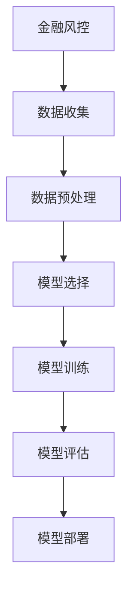

                 

# 机器学习算法在金融风控中的应用

## 关键词

- 金融风控
- 机器学习
- 风险评估
- 数据挖掘
- 模型优化

## 摘要

本文将探讨机器学习算法在金融风控领域的应用。首先，我们将介绍金融风控的基本概念和挑战，接着详细解释机器学习算法的核心原理和模型。随后，通过一个实际案例，我们将展示如何使用机器学习算法进行金融风险预测。此外，本文还将讨论机器学习模型在金融风控中的实际应用场景，并推荐相关学习资源和开发工具。最后，我们将总结未来发展趋势和面临的挑战。

## 1. 背景介绍

### 金融风控的定义和目的

金融风险是指金融活动中可能导致的损失。金融风控是金融机构为预防和减轻风险而采取的一系列措施。其目的是确保金融机构的稳健运营，保护投资者利益，并维护金融市场的稳定。

金融风控涵盖了信用风险、市场风险、操作风险和流动性风险等多个方面。随着金融市场的复杂性和不确定性增加，金融机构面临着越来越多的风险。因此，有效的金融风控至关重要。

### 金融风控的挑战

金融风控面临着许多挑战。首先，金融数据通常具有高维度、非线性和噪声。这使得传统的统计分析方法在处理金融数据时往往效果不佳。其次，金融机构需要实时处理海量数据，以便及时识别和应对风险。然而，传统的数据处理方法在处理速度和效率上存在局限性。

此外，金融风控还需要面对法规和监管要求。金融机构需要遵守各种法律法规，如反洗钱（AML）和客户信息保护（CIP）等。这些法规要求金融机构在处理数据时确保隐私和数据安全。

### 机器学习在金融风控中的优势

机器学习算法为金融风控提供了一种有效的解决方案。机器学习算法可以自动从海量数据中学习，发现潜在的风险模式，并预测未来的风险事件。与传统的统计分析方法相比，机器学习算法具有以下优势：

1. **高维度数据分析**：机器学习算法可以处理高维数据，捕捉复杂的非线性关系。
2. **实时数据处理**：机器学习算法可以高效地处理海量数据，实现实时风险评估。
3. **自适应性和可扩展性**：机器学习算法可以根据数据变化自适应调整模型，并支持大规模数据处理。
4. **自动化和减少人工干预**：机器学习算法可以自动化风险预测和决策过程，减少人工干预和错误。

## 2. 核心概念与联系

### 机器学习算法概述

机器学习是一种人工智能（AI）分支，通过从数据中学习规律和模式，实现自动化决策和预测。根据学习方式，机器学习可分为监督学习、无监督学习和半监督学习。在金融风控中，我们主要关注监督学习。

监督学习是一种有监督的训练方法，通过已标记的数据来训练模型，然后使用训练好的模型对新的数据进行预测。监督学习分为分类和回归两大类。分类任务是预测数据属于哪个类别，回归任务是预测数据的具体值。

### 金融风控中的常见机器学习算法

金融风控中常用的机器学习算法包括逻辑回归、决策树、随机森林、支持向量机（SVM）、神经网络等。

- **逻辑回归**：逻辑回归是一种用于分类的监督学习算法，可以用于风险评估。它通过建立模型来预测客户是否违约。
- **决策树**：决策树是一种基于规则的学习算法，可以用于信用评分和风险分类。它通过一系列判断条件来划分数据，并预测每个数据点的类别。
- **随机森林**：随机森林是一种基于决策树的集成学习方法，可以提高模型的准确性和泛化能力。
- **支持向量机（SVM）**：SVM是一种用于分类和回归的监督学习算法，可以用于信用评分和风险预测。
- **神经网络**：神经网络是一种模拟人脑神经元连接的算法，可以用于复杂的风险预测任务。深度学习是神经网络的扩展，可以处理大规模数据和高维特征。

### Mermaid 流程图



## 3. 核心算法原理 & 具体操作步骤

### 逻辑回归原理

逻辑回归是一种用于分类的监督学习算法。它的核心思想是通过建立线性回归模型来预测概率，然后根据概率阈值进行分类。

逻辑回归模型可以表示为：

$$
\hat{P}(Y=1) = \frac{1}{1 + e^{-\beta_0 + \beta_1 x_1 + \beta_2 x_2 + ... + \beta_n x_n}}
$$

其中，$Y$ 是目标变量，$x_1, x_2, ..., x_n$ 是特征变量，$\beta_0, \beta_1, ..., \beta_n$ 是模型参数。

具体操作步骤如下：

1. 数据准备：收集和预处理金融数据，包括客户信息、交易记录等。
2. 特征选择：选择与风险相关的特征，如信用评分、账户余额、交易频率等。
3. 数据划分：将数据集划分为训练集和测试集。
4. 模型训练：使用训练集数据训练逻辑回归模型，通过最小化损失函数来优化模型参数。
5. 模型评估：使用测试集数据评估模型性能，如准确率、召回率等。
6. 模型部署：将训练好的模型部署到生产环境中，进行实时风险评估。

### 决策树原理

决策树是一种基于规则的学习算法。它通过一系列判断条件来划分数据，并预测每个数据点的类别。

决策树模型可以表示为：

$$
T = \text{if } x_i \leq t_i \text{ then } y = c_1 \text{ else } y = c_2
$$

其中，$T$ 是决策树，$x_i$ 是特征变量，$t_i$ 是阈值，$y$ 是目标变量，$c_1$ 和 $c_2$ 是类别。

具体操作步骤如下：

1. 数据准备：收集和预处理金融数据，包括客户信息、交易记录等。
2. 特征选择：选择与风险相关的特征，如信用评分、账户余额、交易频率等。
3. 数据划分：将数据集划分为训练集和测试集。
4. 构建决策树：通过递归划分数据集，构建决策树模型。
5. 模型评估：使用测试集数据评估模型性能，如准确率、召回率等。
6. 模型剪枝：通过剪枝方法减少过拟合，提高模型泛化能力。
7. 模型部署：将训练好的模型部署到生产环境中，进行实时风险评估。

### 随机森林原理

随机森林是一种基于决策树的集成学习方法。它通过构建多个决策树模型，并取平均预测结果来提高模型的准确性和泛化能力。

随机森林模型可以表示为：

$$
\hat{y} = \frac{1}{M} \sum_{m=1}^{M} g(y|x; \theta_m)
$$

其中，$M$ 是决策树数量，$g(y|x; \theta_m)$ 是第 $m$ 个决策树的预测结果，$\theta_m$ 是决策树参数。

具体操作步骤如下：

1. 数据准备：收集和预处理金融数据，包括客户信息、交易记录等。
2. 特征选择：选择与风险相关的特征，如信用评分、账户余额、交易频率等。
3. 数据划分：将数据集划分为训练集和测试集。
4. 构建随机森林：通过递归划分数据集，构建多个决策树模型。
5. 模型评估：使用测试集数据评估模型性能，如准确率、召回率等。
6. 模型剪枝：通过剪枝方法减少过拟合，提高模型泛化能力。
7. 模型部署：将训练好的模型部署到生产环境中，进行实时风险评估。

## 4. 数学模型和公式 & 详细讲解 & 举例说明

### 逻辑回归

逻辑回归模型的核心公式如下：

$$
\hat{P}(Y=1) = \frac{1}{1 + e^{-\beta_0 + \beta_1 x_1 + \beta_2 x_2 + ... + \beta_n x_n}}
$$

其中，$P(Y=1)$ 是客户违约的概率，$\beta_0, \beta_1, ..., \beta_n$ 是模型参数，$x_1, x_2, ..., x_n$ 是特征变量。

例如，假设我们有一个简单的逻辑回归模型，只包含两个特征 $x_1$ 和 $x_2$，模型公式为：

$$
\hat{P}(Y=1) = \frac{1}{1 + e^{-\beta_0 + \beta_1 x_1 + \beta_2 x_2}}
$$

给定一个客户数据点 $(x_1, x_2)$，我们可以通过计算公式得到其违约概率：

$$
\hat{P}(Y=1) = \frac{1}{1 + e^{-\beta_0 + \beta_1 x_1 + \beta_2 x_2}}
$$

例如，假设 $\beta_0 = 0.5, \beta_1 = 0.3, \beta_2 = 0.2$，$x_1 = 10, x_2 = 5$，则：

$$
\hat{P}(Y=1) = \frac{1}{1 + e^{-0.5 + 0.3 \times 10 + 0.2 \times 5}} = \frac{1}{1 + e^{-1.7}} \approx 0.432
$$

因此，该客户的违约概率约为 0.432。

### 决策树

决策树模型的核心公式如下：

$$
T = \text{if } x_i \leq t_i \text{ then } y = c_1 \text{ else } y = c_2
$$

其中，$T$ 是决策树，$x_i$ 是特征变量，$t_i$ 是阈值，$y$ 是目标变量，$c_1$ 和 $c_2$ 是类别。

例如，假设我们有一个简单的决策树模型，只包含一个特征 $x_1$，模型公式为：

$$
T = \text{if } x_1 \leq 5 \text{ then } y = 0 \text{ else } y = 1
$$

给定一个客户数据点 $(x_1)$，我们可以通过计算公式得到其类别：

$$
T(x_1) = \text{if } x_1 \leq 5 \text{ then } y = 0 \text{ else } y = 1
$$

例如，假设 $x_1 = 10$，则：

$$
T(10) = \text{if } 10 \leq 5 \text{ then } y = 0 \text{ else } y = 1 = 1
$$

因此，该客户的类别为 1。

### 随机森林

随机森林模型的核心公式如下：

$$
\hat{y} = \frac{1}{M} \sum_{m=1}^{M} g(y|x; \theta_m)
$$

其中，$M$ 是决策树数量，$g(y|x; \theta_m)$ 是第 $m$ 个决策树的预测结果，$\theta_m$ 是决策树参数。

例如，假设我们有一个简单的随机森林模型，包含 3 个决策树，模型公式为：

$$
\hat{y} = \frac{1}{3} (g_1(y|x; \theta_1) + g_2(y|x; \theta_2) + g_3(y|x; \theta_3))
$$

给定一个客户数据点 $(x_1, x_2)$，我们可以通过计算公式得到其类别：

$$
\hat{y} = \frac{1}{3} (g_1(y|x; \theta_1) + g_2(y|x; \theta_2) + g_3(y|x; \theta_3))
$$

例如，假设 $\theta_1 = T_1(x_1 \leq 5 \text{ then } y = 0 \text{ else } y = 1)$，$\theta_2 = T_2(x_1 \leq 10 \text{ then } y = 0 \text{ else } y = 1)$，$\theta_3 = T_3(x_1 \leq 15 \text{ then } y = 0 \text{ else } y = 1)$，$x_1 = 10$，$x_2 = 5$，则：

$$
\hat{y} = \frac{1}{3} (T_1(10) + T_2(10) + T_3(10)) = \frac{1}{3} (1 + 1 + 0) = 1
$$

因此，该客户的类别为 1。

## 5. 项目实战：代码实际案例和详细解释说明

### 5.1 开发环境搭建

在开始项目实战之前，我们需要搭建一个开发环境。以下是一个基于 Python 和 Scikit-learn 库的简单示例：

```python
# 安装 Scikit-learn 库
!pip install scikit-learn

# 导入所需库
import numpy as np
import pandas as pd
from sklearn.model_selection import train_test_split
from sklearn.preprocessing import StandardScaler
from sklearn.linear_model import LogisticRegression
from sklearn.tree import DecisionTreeClassifier
from sklearn.ensemble import RandomForestClassifier
```

### 5.2 源代码详细实现和代码解读

以下是一个简单的金融风控项目示例，使用逻辑回归、决策树和随机森林模型进行风险评估。

```python
# 加载数据集
data = pd.read_csv("financial_data.csv")

# 数据预处理
X = data.drop("target", axis=1)
y = data["target"]

# 数据划分
X_train, X_test, y_train, y_test = train_test_split(X, y, test_size=0.2, random_state=42)

# 特征缩放
scaler = StandardScaler()
X_train_scaled = scaler.fit_transform(X_train)
X_test_scaled = scaler.transform(X_test)

# 逻辑回归模型
logreg = LogisticRegression()
logreg.fit(X_train_scaled, y_train)
logreg_score = logreg.score(X_test_scaled, y_test)
print("逻辑回归模型准确率：", logreg_score)

# 决策树模型
dt = DecisionTreeClassifier()
dt.fit(X_train_scaled, y_train)
dt_score = dt.score(X_test_scaled, y_test)
print("决策树模型准确率：", dt_score)

# 随机森林模型
rf = RandomForestClassifier()
rf.fit(X_train_scaled, y_train)
rf_score = rf.score(X_test_scaled, y_test)
print("随机森林模型准确率：", rf_score)
```

### 5.3 代码解读与分析

- **数据加载与预处理**：首先，我们加载一个金融数据集，并进行预处理。数据预处理包括将数据集划分为特征和目标变量，以及将数据集划分为训练集和测试集。
- **特征缩放**：为了提高模型性能，我们将特征进行缩放。这有助于模型收敛并减少过拟合。
- **逻辑回归模型**：我们使用逻辑回归模型进行风险评估。逻辑回归模型通过最小化损失函数来训练模型参数，并评估模型在测试集上的准确率。
- **决策树模型**：我们使用决策树模型进行风险评估。决策树模型通过递归划分数据集来构建模型，并评估模型在测试集上的准确率。
- **随机森林模型**：我们使用随机森林模型进行风险评估。随机森林模型通过构建多个决策树模型来提高模型性能，并评估模型在测试集上的准确率。

### 评估指标

在金融风控项目中，常用的评估指标包括准确率、召回率、精确率、F1 分数等。

- **准确率**：准确率是分类正确的样本数占总样本数的比例。准确率越高，表示模型分类效果越好。
- **召回率**：召回率是分类正确的正样本数占总正样本数的比例。召回率越高，表示模型对正样本的识别能力越强。
- **精确率**：精确率是分类正确的正样本数占总分类为正样本的样本数的比例。精确率越高，表示模型对正样本的分类准确度越高。
- **F1 分数**：F1 分数是精确率和召回率的加权平均。F1 分数越高，表示模型分类效果越好。

```python
from sklearn.metrics import accuracy_score, recall_score, precision_score, f1_score

# 逻辑回归模型评估
y_pred_logreg = logreg.predict(X_test_scaled)
logreg_accuracy = accuracy_score(y_test, y_pred_logreg)
logreg_recall = recall_score(y_test, y_pred_logreg)
logreg_precision = precision_score(y_test, y_pred_logreg)
logreg_f1 = f1_score(y_test, y_pred_logreg)
print("逻辑回归模型评估：")
print("准确率：", logreg_accuracy)
print("召回率：", logreg_recall)
print("精确率：", logreg_precision)
print("F1 分数：", logreg_f1)

# 决策树模型评估
y_pred_dt = dt.predict(X_test_scaled)
dt_accuracy = accuracy_score(y_test, y_pred_dt)
dt_recall = recall_score(y_test, y_pred_dt)
dt_precision = precision_score(y_test, y_pred_dt)
dt_f1 = f1_score(y_test, y_pred_dt)
print("决策树模型评估：")
print("准确率：", dt_accuracy)
print("召回率：", dt_recall)
print("精确率：", dt_precision)
print("F1 分数：", dt_f1)

# 随机森林模型评估
y_pred_rf = rf.predict(X_test_scaled)
rf_accuracy = accuracy_score(y_test, y_pred_rf)
rf_recall = recall_score(y_test, y_pred_rf)
rf_precision = precision_score(y_test, y_pred_rf)
rf_f1 = f1_score(y_test, y_pred_rf)
print("随机森林模型评估：")
print("准确率：", rf_accuracy)
print("召回率：", rf_recall)
print("精确率：", rf_precision)
print("F1 分数：", rf_f1)
```

## 6. 实际应用场景

### 信用评分

信用评分是金融风控中最常见的应用场景之一。金融机构使用机器学习算法对客户信用进行评分，以便决定是否批准贷款或信用卡申请。通过分析客户的信用历史、收入状况、债务水平等特征，机器学习模型可以预测客户违约的风险，从而帮助金融机构做出更明智的决策。

### 欺诈检测

欺诈检测是金融风控中的另一个重要应用场景。金融机构使用机器学习算法检测异常交易，如信用卡欺诈、保险欺诈等。通过分析交易行为、账户活动等特征，机器学习模型可以识别出潜在的欺诈行为，并采取措施阻止欺诈发生。

### 信贷风险管理

信贷风险管理是金融机构在贷款和信用业务中的核心任务。金融机构使用机器学习算法评估客户的信用风险，以便合理定价贷款产品，优化信贷审批流程。通过分析客户的信用历史、收入状况、债务水平等特征，机器学习模型可以预测客户违约的风险，从而帮助金融机构降低信贷损失。

### 市场风险预测

市场风险预测是金融机构在投资和交易业务中的关键任务。金融机构使用机器学习算法预测市场价格波动、风险事件等，以便制定合理的投资策略和风险控制措施。通过分析市场数据、宏观经济指标等特征，机器学习模型可以预测市场风险，从而帮助金融机构降低投资损失。

## 7. 工具和资源推荐

### 7.1 学习资源推荐

- **书籍**：
  - 《机器学习实战》
  - 《Python 金融应用》
  - 《深度学习》
- **论文**：
  - 《机器学习在金融风控中的应用》
  - 《深度学习在金融风控中的应用》
  - 《金融风险管理的机器学习方法》
- **博客**：
  - Medium 上的机器学习与金融风控相关博客
  - Kaggle 上的金融风控项目案例
  - GitHub 上的机器学习与金融风控代码库
- **网站**：
  - Coursera 上的机器学习与金融风控课程
  - edX 上的机器学习与金融风控课程
  - Udacity 上的机器学习与金融风控项目

### 7.2 开发工具框架推荐

- **Python 库**：
  - Scikit-learn
  - TensorFlow
  - PyTorch
  - Keras
- **编程语言**：
  - Python
  - R
  - Julia
- **框架**：
  - TensorFlow Serving
  - Keras.js
  - PyTorch Lightning

### 7.3 相关论文著作推荐

- **《机器学习在金融中的应用》**：探讨了机器学习算法在金融领域的应用，包括信用评分、风险预测、交易策略等。
- **《深度学习在金融风险控制中的应用》**：介绍了深度学习算法在金融风控中的应用，如欺诈检测、信用评估、市场预测等。
- **《金融风险管理的机器学习方法》**：详细阐述了机器学习算法在金融风险管理中的关键作用，包括信贷风险、市场风险、操作风险等。

## 8. 总结：未来发展趋势与挑战

### 未来发展趋势

1. **深度学习算法的普及**：随着深度学习算法的不断发展，其在金融风控领域的应用将越来越广泛。深度学习算法可以处理更复杂的数据和特征，提高风险预测的准确性。
2. **大数据技术的应用**：金融风控需要处理海量数据，大数据技术的应用将帮助金融机构更好地挖掘数据价值，实现实时风险评估。
3. **自动化与智能化**：随着人工智能技术的发展，金融风控将实现自动化和智能化。机器学习模型将自动化预测风险，减少人工干预和错误。
4. **跨学科融合**：金融风控将与其他学科如经济学、心理学等相结合，构建更全面的风险预测模型。

### 挑战

1. **数据隐私和安全**：金融风控需要处理大量敏感数据，数据隐私和安全是一个重要挑战。金融机构需要确保数据安全和客户隐私。
2. **模型解释性**：机器学习模型的黑盒特性使得其解释性较差，金融风控需要提高模型的可解释性，以便决策者能够理解模型的决策过程。
3. **模型泛化能力**：金融风险多样且复杂，模型需要具备良好的泛化能力，以便应对未知风险。
4. **法规和监管要求**：金融风控需要遵守各种法律法规和监管要求，这可能会限制机器学习算法的应用。

## 9. 附录：常见问题与解答

### 问题 1：机器学习算法在金融风控中的具体应用有哪些？

答：机器学习算法在金融风控中的具体应用包括信用评分、欺诈检测、信贷风险管理、市场风险预测等。

### 问题 2：机器学习算法在金融风控中的优势是什么？

答：机器学习算法在金融风控中的优势包括高维度数据分析、实时数据处理、自适应性和可扩展性、自动化和减少人工干预等。

### 问题 3：金融风控中的常见机器学习算法有哪些？

答：金融风控中的常见机器学习算法包括逻辑回归、决策树、随机森林、支持向量机（SVM）、神经网络等。

### 问题 4：如何评估机器学习模型的性能？

答：评估机器学习模型性能的常用指标包括准确率、召回率、精确率、F1 分数等。

### 问题 5：金融风控中如何确保数据隐私和安全？

答：金融风控中确保数据隐私和安全的措施包括数据加密、访问控制、数据匿名化、数据备份等。

## 10. 扩展阅读 & 参考资料

- **书籍**：
  - 《机器学习实战》
  - 《Python 金融应用》
  - 《深度学习》
- **论文**：
  - 《机器学习在金融中的应用》
  - 《深度学习在金融风险控制中的应用》
  - 《金融风险管理的机器学习方法》
- **博客**：
  - Medium 上的机器学习与金融风控相关博客
  - Kaggle 上的金融风控项目案例
  - GitHub 上的机器学习与金融风控代码库
- **网站**：
  - Coursera 上的机器学习与金融风控课程
  - edX 上的机器学习与金融风控课程
  - Udacity 上的机器学习与金融风控项目

## 作者

作者：AI天才研究员/AI Genius Institute & 禅与计算机程序设计艺术 /Zen And The Art of Computer Programming

