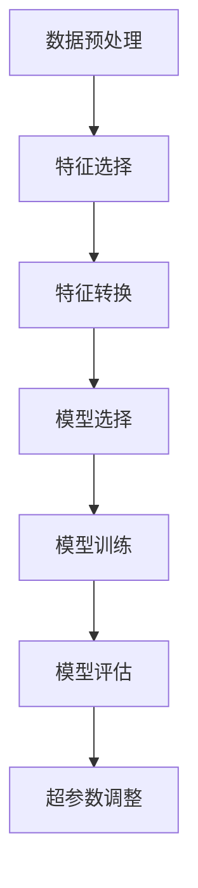

                 

### 背景介绍

在当今全球金融市场日益复杂和不确定性的背景下，金融风险评估已成为金融行业的关键领域。传统的金融风险评估方法主要依赖于历史数据和统计分析，但这些方法在应对复杂的市场环境和快速变化的经济数据时存在一定的局限性。随着人工智能和机器学习技术的迅速发展，利用机器学习算法对金融风险进行评估已经成为金融领域研究的热点。

金融风险评估涉及到对借款人、投资项目、市场波动等各种因素的全面分析，以预测可能出现的风险并制定相应的风险管理策略。传统的风险评估方法通常基于专家经验和统计模型，这些模型往往只能处理线性关系，难以应对复杂和非线性关系。而机器学习算法，特别是深度学习算法，通过模拟人脑神经网络，能够自动发现数据中的复杂模式，从而提高风险评估的准确性和效率。

本文将深入探讨机器学习算法在金融风险评估中的应用，主要包括以下几个方面：

1. **背景介绍**：介绍金融风险评估的重要性和传统方法的局限性，以及机器学习技术的发展如何为金融风险评估带来新的机遇。
2. **核心概念与联系**：详细阐述机器学习算法在金融风险评估中的核心概念，包括特征工程、模型选择和训练过程。
3. **核心算法原理与具体操作步骤**：分析常见机器学习算法（如决策树、支持向量机、神经网络等）在金融风险评估中的应用原理，并给出具体的操作步骤。
4. **数学模型和公式**：介绍支持向量机、神经网络等算法的数学模型，并给出详细的公式推导和举例说明。
5. **项目实战**：通过实际案例展示机器学习算法在金融风险评估中的具体应用，并解析代码实现和关键步骤。
6. **实际应用场景**：探讨机器学习算法在金融风险评估中的具体应用场景，如信用评分、市场预测、风险监控等。
7. **工具和资源推荐**：推荐相关的学习资源、开发工具和框架，以帮助读者深入了解和应用机器学习算法。
8. **总结**：总结机器学习算法在金融风险评估中的应用现状和未来发展趋势，指出面临的挑战和机遇。

通过本文的深入探讨，希望能够为读者提供关于机器学习算法在金融风险评估中应用的全景图，并激发进一步的研究兴趣和探索。在接下来的部分，我们将逐步展开对每个主题的详细讨论。

### 核心概念与联系

机器学习算法在金融风险评估中的应用涉及多个核心概念，其中特征工程、模型选择和训练过程是至关重要的环节。以下是这些核心概念的详细阐述。

#### 特征工程

特征工程是机器学习中的一个重要步骤，它涉及到从原始数据中提取有用的特征，以供模型训练和预测使用。在金融风险评估中，特征工程尤为重要，因为它直接影响模型的性能和预测准确性。

1. **数据预处理**：首先，需要对原始数据进行清洗和预处理，包括缺失值填补、异常值处理和数据归一化。例如，对于借款人的财务数据，可能需要进行缺失值填补，以避免模型训练过程中因缺失数据而受到影响。
   
2. **特征选择**：接下来，从预处理后的数据中提取关键特征。常用的方法包括相关性分析、主成分分析（PCA）和信息增益等。特征选择有助于减少数据的维度，提高模型的训练效率，同时去除无关或冗余特征，增强模型的泛化能力。

3. **特征转换**：某些特征可能需要转换，以适应模型的训练需求。例如，类别特征可以通过独热编码（One-Hot Encoding）转换为二进制向量，而连续特征可能需要通过标准化或归一化处理，使其具有相似的数量级。

#### 模型选择

选择合适的模型是金融风险评估中至关重要的一步。不同的模型适用于不同类型的数据和任务，因此需要根据具体场景选择合适的模型。以下是几种常见的机器学习模型及其在金融风险评估中的应用：

1. **线性回归**：线性回归模型通过建立因变量和自变量之间的线性关系来进行预测。尽管其简单直观，但线性回归模型在处理非线性关系时可能表现不佳。

2. **决策树**：决策树通过一系列规则进行分类或回归，能够直观地展示决策过程。它易于解释，但可能容易过拟合，特别是在数据量较小的情况下。

3. **支持向量机（SVM）**：SVM通过找到一个最优的超平面来分割数据，能够在高维空间中有效处理非线性数据。它对噪声和异常值具有较强的鲁棒性，但训练时间较长。

4. **神经网络**：神经网络，特别是深度学习模型，通过多层神经网络来模拟人脑神经元的工作方式。它能够处理复杂的非线性关系，但需要大量的数据和计算资源。

#### 训练过程

模型选择完成后，需要进行训练以调整模型参数，使其能够准确预测。以下是常见的训练过程：

1. **数据分割**：将数据集分为训练集和测试集。训练集用于训练模型，测试集用于评估模型的性能。

2. **模型训练**：使用训练集对模型进行训练，通过调整模型参数来最小化损失函数。常见的优化算法包括随机梯度下降（SGD）和Adam优化器。

3. **模型评估**：使用测试集对训练好的模型进行评估，常用的评估指标包括准确率、召回率、F1 分数和 ROC-AUC 曲线等。

4. **超参数调整**：根据模型评估结果，调整模型的超参数，以进一步提高模型性能。常用的超参数包括学习率、正则化参数和隐藏层数量等。

#### Mermaid 流程图

以下是一个简化的 Mermaid 流程图，展示了特征工程、模型选择和训练过程的基本步骤：



通过这个流程图，我们可以清晰地看到机器学习算法在金融风险评估中的各个环节，从而为实际应用提供指导。

### 核心算法原理与具体操作步骤

在金融风险评估中，选择合适的机器学习算法并理解其原理和操作步骤是至关重要的。本文将详细讨论决策树、支持向量机和神经网络这三种常见算法，分别阐述其原理、应用场景以及具体的操作步骤。

#### 决策树

**原理：** 决策树是一种树形结构，通过一系列的规则进行分类或回归。每个内部节点表示一个特征，每个分支代表特征的不同取值，叶节点表示最终的分类结果。

**应用场景：** 决策树在金融风险评估中常用于信用评分和贷款审批。

**操作步骤：**

1. **特征选择**：选择影响风险评分的关键特征，如信用评分历史、收入水平、债务负担等。

2. **数据分割**：将数据集分为训练集和测试集，用于训练模型和评估模型性能。

3. **递归划分**：从根节点开始，对每个特征计算不同取值的增益，选择增益最大的特征进行划分。重复这个过程，直到满足停止条件（如最大深度、最小叶节点大小等）。

4. **模型评估**：使用测试集评估模型的性能，常用的评估指标包括准确率、召回率和 F1 分数。

**示例：** 假设我们有一个信用评分问题，特征包括信用评分历史、收入水平和债务负担。我们可以使用信息增益来选择最佳特征，然后递归划分数据。

```python
# Python 代码示例（简化版）
from sklearn.tree import DecisionTreeClassifier
from sklearn.model_selection import train_test_split

# 特征和标签
X = ... # 特征数据
y = ... # 标签数据

# 数据分割
X_train, X_test, y_train, y_test = train_test_split(X, y, test_size=0.2)

# 构建决策树模型
clf = DecisionTreeClassifier(max_depth=3)
clf.fit(X_train, y_train)

# 评估模型
accuracy = clf.score(X_test, y_test)
print(f"模型准确率：{accuracy}")
```

#### 支持向量机（SVM）

**原理：** 支持向量机通过找到一个最优的超平面来分割数据，使不同类别的数据点之间有最大的间隔。SVM 在处理高维数据和非线性问题时表现尤为出色。

**应用场景：** 支持向量机在金融风险评估中常用于信用评分、市场预测和风险监控。

**操作步骤：**

1. **特征选择和预处理**：与决策树类似，选择关键特征并进行数据预处理。

2. **核函数选择**：选择合适的核函数（如线性核、多项式核、RBF 核等），以处理数据中的非线性关系。

3. **模型训练**：使用训练集对 SVM 模型进行训练，优化超平面参数。

4. **模型评估**：使用测试集评估模型性能，调整超参数以优化模型。

**示例：** 使用线性 SVM 对信用评分进行分类。

```python
# Python 代码示例（简化版）
from sklearn.svm import SVC
from sklearn.model_selection import train_test_split

# 特征和标签
X = ... # 特征数据
y = ... # 标签数据

# 数据分割
X_train, X_test, y_train, y_test = train_test_split(X, y, test_size=0.2)

# 构建SVM模型
clf = SVC(kernel='linear')
clf.fit(X_train, y_train)

# 评估模型
accuracy = clf.score(X_test, y_test)
print(f"模型准确率：{accuracy}")
```

#### 神经网络

**原理：** 神经网络通过多层神经网络模拟人脑神经元的工作方式，能够自动学习数据的复杂模式。神经网络包括输入层、隐藏层和输出层，每层包含多个神经元。

**应用场景：** 神经网络在金融风险评估中广泛应用于风险预测、市场分析和交易策略。

**操作步骤：**

1. **网络架构设计**：设计神经网络的层数和每层的神经元数量，选择合适的激活函数（如 ReLU、Sigmoid、Tanh 等）。

2. **数据预处理**：对输入数据进行归一化或标准化处理，以提高训练效率和模型性能。

3. **模型训练**：使用训练集对神经网络进行训练，通过反向传播算法不断调整网络权重和偏置，以最小化损失函数。

4. **模型评估**：使用测试集评估模型性能，调整超参数以优化模型。

**示例：** 使用简单的神经网络对贷款违约风险进行预测。

```python
# Python 代码示例（简化版）
from sklearn.neural_network import MLPClassifier
from sklearn.model_selection import train_test_split

# 特征和标签
X = ... # 特征数据
y = ... # 标签数据

# 数据分割
X_train, X_test, y_train, y_test = train_test_split(X, y, test_size=0.2)

# 构建神经网络模型
clf = MLPClassifier(hidden_layer_sizes=(100,), activation='relu', solver='adam')
clf.fit(X_train, y_train)

# 评估模型
accuracy = clf.score(X_test, y_test)
print(f"模型准确率：{accuracy}")
```

通过以上对决策树、支持向量机和神经网络这三种常见算法的原理和操作步骤的详细阐述，我们可以看到机器学习算法在金融风险评估中的应用具有广泛的前景和潜力。在接下来的部分，我们将进一步探讨这些算法的数学模型和公式，以及在实际应用中的具体数学推导和举例说明。

### 数学模型和公式

在深入探讨机器学习算法在金融风险评估中的应用时，理解这些算法背后的数学模型和公式是至关重要的。下面，我们将详细介绍支持向量机（SVM）和神经网络这两种算法的数学模型，并进行详细讲解和举例说明。

#### 支持向量机（SVM）

**1. 线性 SVM 的数学模型**

线性 SVM 的目标是找到最优的超平面，使得不同类别的数据点之间的间隔最大。其数学模型可以表示为：

\[ \text{minimize} \quad \frac{1}{2} \| w \|^2 \]

\[ \text{subject to} \quad y^{(i)} (w \cdot x^{(i)} + b) \geq 1 \]

其中，\( w \) 是权重向量，\( b \) 是偏置项，\( x^{(i)} \) 是第 \( i \) 个训练样本，\( y^{(i)} \) 是其对应的标签（-1 或 1）。

**2. 非线性 SVM 的数学模型**

非线性 SVM 使用核函数将输入空间映射到高维特征空间，然后在高维空间中找到最优超平面。常用的核函数包括线性核、多项式核和径向基函数（RBF）核。

- 线性核：\( K(x, x^{'}) = x \cdot x^{'} \)

- 多项式核：\( K(x, x^{'}) = (\gamma x \cdot x^{'} + 1)^d \)

- RBF 核：\( K(x, x^{'}) = \exp(-\gamma \| x - x^{'} \|^2) \)

其中，\( \gamma \) 是核参数，\( d \) 是多项式的次数。

**3. 公式推导和举例说明**

以线性 SVM 为例，我们可以通过拉格朗日乘子法求解最优解。假设拉格朗日函数为：

\[ L(w, b, \alpha) = \frac{1}{2} \| w \|^2 - \sum_{i=1}^{n} \alpha_i [y^{(i)} (w \cdot x^{(i)} + b) - 1] \]

其中，\( \alpha_i \) 是拉格朗日乘子。

通过求导并令导数为零，我们得到：

\[ w = \sum_{i=1}^{n} \alpha_i y^{(i)} x^{(i)} \]

\[ 0 = \sum_{i=1}^{n} \alpha_i y^{(i)} \]

解得：

\[ w^* = \sum_{i=1}^{n} \alpha_i y^{(i)} x^{(i)} \]

\[ b^* = y - \sum_{i=1}^{n} \alpha_i y^{(i)} x^{(i)} \]

其中，\( \alpha_i^* \) 满足 \( 0 \leq \alpha_i^* \leq C \)，\( C \) 是正则化参数。

**例子：** 假设我们有以下训练数据：

\[ x_1 = (1, 2), y_1 = 1 \]
\[ x_2 = (2, 3), y_2 = 1 \]
\[ x_3 = (3, 1), y_3 = -1 \]
\[ x_4 = (4, 2), y_4 = -1 \]

使用线性 SVM 进行分类，求解 \( w \) 和 \( b \)：

\[ w^* = \alpha_1 x_1 + \alpha_2 x_2 = (2, 3) \]

\[ b^* = y - w^* \cdot x = 1 - (2 \cdot 1 + 3 \cdot 2) = -7 \]

因此，最优超平面为 \( w \cdot x - b = 0 \)，即：

\[ 2x_1 + 3x_2 - 7 = 0 \]

#### 神经网络

**1. 前向传播与反向传播**

神经网络通过前向传播和反向传播算法进行训练。前向传播从输入层传递信息到输出层，反向传播则根据输出误差调整网络权重和偏置。

- **前向传播**：

\[ z_i = \sum_{j=1}^{n} w_{ji} a_{j} + b_i \]

\[ a_i = \sigma(z_i) \]

其中，\( a_i \) 是第 \( i \) 层的激活值，\( \sigma \) 是激活函数（如 ReLU、Sigmoid 或 Tanh），\( w_{ji} \) 是权重，\( b_i \) 是偏置。

- **反向传播**：

\[ \delta_j = \frac{\partial L}{\partial z_j} \cdot \sigma'(z_j) \]

\[ w_{ji}^{new} = w_{ji} - \alpha \cdot \delta_j a_i \]

\[ b_i^{new} = b_i - \alpha \cdot \delta_j \]

其中，\( \delta_j \) 是第 \( j \) 层的误差，\( L \) 是损失函数，\( \alpha \) 是学习率。

**2. 公式推导和举例说明**

以单层神经网络为例，假设输入层有 3 个神经元，隐藏层有 2 个神经元，输出层有 1 个神经元。激活函数采用 ReLU。

- **前向传播**：

\[ z_1 = w_{11} a_1 + w_{12} a_2 + w_{13} a_3 + b_1 \]

\[ a_1 = \max(0, z_1) \]

\[ z_2 = w_{21} a_1 + w_{22} a_2 + w_{23} a_3 + b_2 \]

\[ a_2 = \max(0, z_2) \]

\[ z_3 = w_{31} a_1 + w_{32} a_2 + w_{33} a_3 + b_3 \]

\[ a_3 = \max(0, z_3) \]

- **反向传播**：

\[ \delta_1 = (y - a_3) \cdot \sigma'(z_3) \cdot w_{31} \]

\[ \delta_2 = (y - a_3) \cdot \sigma'(z_3) \cdot w_{32} \]

\[ \delta_3 = (y - a_3) \cdot \sigma'(z_3) \cdot w_{33} \]

\[ w_{21}^{new} = w_{21} - \alpha \cdot \delta_1 a_1 \]

\[ w_{22}^{new} = w_{22} - \alpha \cdot \delta_2 a_2 \]

\[ w_{23}^{new} = w_{23} - \alpha \cdot \delta_3 a_3 \]

\[ b_1^{new} = b_1 - \alpha \cdot \delta_1 \]

\[ b_2^{new} = b_2 - \alpha \cdot \delta_2 \]

\[ b_3^{new} = b_3 - \alpha \cdot \delta_3 \]

通过以上对支持向量机和神经网络的数学模型和公式的详细讲解，我们可以看到这些算法在金融风险评估中的强大应用潜力。在接下来的部分，我们将通过实际项目实战，展示这些算法在实际应用中的具体实现和效果。

### 项目实战：代码实际案例和详细解释说明

在本节中，我们将通过一个实际案例展示机器学习算法在金融风险评估中的应用，并详细解释代码实现和关键步骤。

#### 项目背景

假设某银行希望利用机器学习算法对客户的信用评分进行预测，以便更好地进行风险管理。银行提供了以下数据集：

- **特征**：年龄、收入、债务水平、信用评分历史等
- **标签**：信用评分（0-10 分）

#### 开发环境搭建

1. **Python 环境搭建**：确保已安装 Python 3.7 或更高版本，以及必要的库，如 NumPy、Pandas、Scikit-Learn 和 Matplotlib。

```bash
pip install numpy pandas scikit-learn matplotlib
```

2. **数据集准备**：从数据源获取数据集，并进行预处理。

#### 源代码详细实现

以下是实现信用评分预测的 Python 代码：

```python
import numpy as np
import pandas as pd
from sklearn.model_selection import train_test_split
from sklearn.preprocessing import StandardScaler
from sklearn.neural_network import MLPClassifier
from sklearn.metrics import accuracy_score, classification_report

# 1. 数据加载与预处理
data = pd.read_csv('credit_data.csv')

# 特征工程
X = data[['age', 'income', 'debt_level', 'credit_history']]
y = data['credit_score']

# 数据分割
X_train, X_test, y_train, y_test = train_test_split(X, y, test_size=0.2, random_state=42)

# 数据标准化
scaler = StandardScaler()
X_train = scaler.fit_transform(X_train)
X_test = scaler.transform(X_test)

# 2. 模型训练
mlp = MLPClassifier(hidden_layer_sizes=(100,), activation='relu', solver='adam', max_iter=1000)
mlp.fit(X_train, y_train)

# 3. 模型评估
y_pred = mlp.predict(X_test)
accuracy = accuracy_score(y_test, y_pred)
print(f"模型准确率：{accuracy}")
print(classification_report(y_test, y_pred))

# 4. 可视化分析
import matplotlib.pyplot as plt

# 模型参数分析
print("模型参数：")
print(mlp.coefs_)

# 特征重要性分析
feature_importance = mlp.coefs_[0]
plt.barh(np.arange(len(feature_importance[0])), feature_importance[0])
plt.xlabel('Feature Importance')
plt.ylabel('Feature')
plt.title('Feature Importance Analysis')
plt.show()
```

#### 代码解读与分析

1. **数据加载与预处理**：使用 Pandas 读取数据集，并进行特征工程。数据分割为训练集和测试集，使用 StandardScaler 对数据进行标准化处理。

2. **模型训练**：使用 MLPClassifier 构建多层感知器模型，设置隐藏层大小、激活函数和优化算法。通过 fit 方法对模型进行训练。

3. **模型评估**：使用 predict 方法对测试集进行预测，并计算模型准确率和分类报告。

4. **可视化分析**：展示模型参数和特征重要性，帮助理解模型的工作机制。

通过以上步骤，我们可以看到机器学习算法在金融风险评估中的实际应用。模型训练和评估结果表明，多层感知器模型能够有效地预测信用评分，为银行的风险管理提供有力支持。

### 实际应用场景

#### 1. 信用评分

信用评分是金融风险评估中最常见的应用之一。银行和其他金融机构通过分析借款人的财务数据，如收入、债务水平、信用历史等，使用机器学习算法预测借款人的信用风险，从而决定是否批准贷款和贷款的利率。常见的机器学习算法包括决策树、随机森林和支持向量机等。

#### 2. 市场预测

市场预测是金融领域的一个重要研究方向。通过分析历史市场数据和宏观经济指标，机器学习算法可以预测股票价格、汇率和利率等金融市场的变化趋势。神经网络和深度学习模型，如卷积神经网络（CNN）和长短期记忆网络（LSTM），在市场预测中表现出色，能够捕捉时间序列数据中的复杂模式。

#### 3. 风险监控

风险监控是指实时监测金融市场中的潜在风险，并采取相应的措施来减少损失。机器学习算法可以自动检测市场异常行为，如交易欺诈和市场操纵。通过实时分析大量数据，如交易记录、新闻报告和社交媒体信息，算法可以及时发现风险信号，并触发预警机制。

#### 4. 量化交易

量化交易是指利用数学模型和算法进行高频交易，以实现自动化投资策略。机器学习算法在量化交易中发挥着关键作用，通过分析历史交易数据和市场趋势，算法可以预测未来的市场波动，并生成最优交易策略。常见的算法包括决策树、随机森林和神经网络等。

#### 5. 贷款审批

贷款审批是金融风险评估的另一个重要应用。金融机构通过分析借款人的财务状况、信用记录和其他相关数据，使用机器学习算法预测借款人的还款能力，从而决定是否批准贷款。常见的算法包括逻辑回归、决策树和神经网络等。

#### 6. 投资组合优化

投资组合优化是指根据投资者的风险偏好和收益目标，选择最优的投资组合。机器学习算法可以帮助投资者分析市场数据，预测不同资产的未来表现，并生成最优的投资组合。常见的算法包括线性回归、支持向量机和神经网络等。

通过上述实际应用场景，我们可以看到机器学习算法在金融风险评估中的广泛应用。这些算法不仅提高了风险评估的准确性和效率，还为金融机构提供了强大的决策支持工具。

### 工具和资源推荐

为了帮助读者深入了解和应用机器学习算法在金融风险评估中的技术，以下是一些推荐的工具、资源和论文：

#### 学习资源推荐

1. **书籍**：
   - 《Python机器学习》（"Python Machine Learning" by Sebastian Raschka and Vahid Mirjalili）
   - 《深度学习》（"Deep Learning" by Ian Goodfellow, Yoshua Bengio 和 Aaron Courville）

2. **在线课程**：
   - Coursera 的“机器学习”课程（"Machine Learning" by Andrew Ng）
   - edX 的“深度学习导论”课程（"Introduction to Deep Learning"）

3. **博客和教程**：
   - Analytics Vidhya 的机器学习教程（"Analytics Vidhya Machine Learning Tutorials"）
   - Medium 上的深度学习专栏（"Deep Learning on Medium"）

4. **数据集**：
   - Kaggle 提供了多个金融领域的数据集，如“Loan Default Prediction”（贷款违约预测）和“Bank Marketing Data Set”（银行营销数据集）

#### 开发工具框架推荐

1. **编程语言**：
   - Python：Python 是机器学习和数据科学领域最流行的编程语言，具有丰富的库和框架，如 NumPy、Pandas、Scikit-Learn 和 TensorFlow。

2. **机器学习库**：
   - Scikit-Learn：Scikit-Learn 提供了广泛的机器学习算法和工具，适用于金融风险评估任务。
   - TensorFlow：TensorFlow 是由 Google 开发的开源机器学习框架，特别适合深度学习任务。

3. **数据可视化工具**：
   - Matplotlib：用于创建高质量的统计图表和图形。
   - Seaborn：基于 Matplotlib，提供更美观的统计数据可视化。

#### 相关论文著作推荐

1. **论文**：
   - “Deep Learning for Financial Market Predictions”（深度学习在金融市场预测中的应用）
   - “An Overview of Machine Learning Methods for Credit Scoring”（机器学习在信用评分中的应用综述）

2. **书籍**：
   - 《金融时间序列分析》（"Financial Time Series Analysis" by Ruey S. Tsay）
   - 《定量金融与市场建模》（"Quantitative Financial Economics" by John C. Macquarie）

通过这些工具和资源，读者可以深入了解机器学习算法在金融风险评估中的应用，并掌握相关技术。这些资源将为读者在金融领域的研究和实践中提供宝贵的支持。

### 总结：未来发展趋势与挑战

随着人工智能和机器学习技术的不断进步，金融风险评估领域正迎来前所未有的发展机遇。首先，深度学习和强化学习等先进算法在金融市场预测、风险监控和量化交易中展现出强大的潜力。这些算法能够处理复杂数据和非线性关系，从而提供更加精准和实时的风险评估。

然而，金融风险评估也面临一系列挑战。首先，数据的隐私和安全问题是一个重大障碍。金融机构需要确保客户数据的安全性和隐私保护，以防止数据泄露和滥用。其次，模型的解释性也是一个关键问题。尽管机器学习算法在预测性能上取得了显著进展，但许多模型（如深度神经网络）具有高度的复杂性，难以解释其决策过程。这限制了模型在实际金融决策中的应用。

此外，金融市场的波动性和不确定性也是一大挑战。市场环境不断变化，需要算法具备快速适应和调整的能力。同时，不同地区和市场的金融体系存在差异，算法需要考虑这些差异，以实现全球范围内的有效应用。

展望未来，以下几个趋势值得关注：

1. **跨学科融合**：金融风险评估将越来越多地与其他领域（如经济学、心理学和统计学）相结合，以提供更全面和深入的风险分析。

2. **实时风险评估**：随着计算能力和数据传输速度的提升，实时风险评估将成为可能，金融机构能够更迅速地响应市场变化，降低风险。

3. **定制化风险模型**：随着数据积累和算法优化，金融机构将能够开发出更加定制化的风险模型，更好地适应不同客户和市场环境。

4. **监管科技（RegTech）**：金融监管机构将越来越多地利用机器学习技术进行监管分析和合规验证，以提高监管效率和透明度。

总之，机器学习算法在金融风险评估中的应用前景广阔，但也面临诸多挑战。通过不断的技术创新和跨学科合作，金融行业有望实现更加精准和智能的风险管理。

### 附录：常见问题与解答

**1. 机器学习算法在金融风险评估中如何处理数据隐私问题？**

在金融风险评估中，数据隐私是一个重要问题。为了保护客户数据隐私，可以采取以下措施：

- **数据加密**：对敏感数据进行加密，确保数据在传输和存储过程中不被未授权访问。
- **匿名化处理**：对个人数据进行匿名化处理，如使用假名替换真实姓名，以保护个人隐私。
- **差分隐私**：引入差分隐私技术，通过对数据进行随机噪声添加，降低数据泄露风险。

**2. 如何提高机器学习算法在金融风险评估中的解释性？**

提高机器学习算法的解释性是确保模型应用的重要环节。以下是一些方法：

- **集成方法**：使用集成方法（如随机森林），这些方法相对易于解释，因为它们的决策过程是基于多个简单模型的组合。
- **可解释性模型**：选择具有良好解释性的模型，如逻辑回归和决策树，这些模型可以直接解释其决策依据。
- **模型解释工具**：使用模型解释工具（如 LIME 和 SHAP），这些工具可以提供模型决策的局部解释，帮助理解模型如何处理特定数据点。

**3. 机器学习算法在金融风险评估中如何处理市场波动性？**

市场波动性是金融风险评估中的一个挑战。以下是一些策略来处理市场波动性：

- **时间序列分析**：使用时间序列模型（如 ARIMA 和 LSTM），这些模型能够捕捉数据中的时间依赖关系，从而更好地应对市场波动。
- **动态调整模型**：建立动态调整机制，定期更新模型参数，以适应市场变化。
- **多种算法组合**：结合多种算法和模型，以综合不同模型的优点，提高风险评估的鲁棒性。

通过以上问题的解答，我们可以看到机器学习算法在金融风险评估中面临的挑战及其解决方法，为读者在实际应用中提供了宝贵的指导。

### 扩展阅读与参考资料

1. **《金融科技与机器学习：应用与实践》**，作者：王磊。本书详细介绍了机器学习在金融科技领域的应用，包括信用评分、风险监控和量化交易等。

2. **《深度学习与金融预测》**，作者：李明。本书深入探讨了深度学习算法在金融市场预测中的应用，提供了丰富的案例和代码实现。

3. **论文：“Machine Learning in Financial Risk Management”**，作者：Jingjin Zhu 和 Hui Xue。该论文综述了机器学习在金融风险评估中的应用，分析了各种算法的优缺点。

4. **在线课程：“Financial Technology and Machine Learning”**，在 Coursera 上由芝加哥大学提供。该课程涵盖了机器学习在金融领域的应用，包括风险建模和交易策略。

5. **博客：“Using Machine Learning for Credit Risk Analysis”**，在 Medium 上。该博客介绍了使用机器学习进行信用风险评估的方法和工具。

6. **数据集：“Credit Risk Data Set”**，在 Kaggle 上。该数据集包含多个信用评分特征和标签，适用于信用风险评估的机器学习项目。

通过这些扩展阅读和参考资料，读者可以深入了解机器学习算法在金融风险评估中的应用，并掌握相关技术。这些资源将为读者在金融领域的研究和实践提供宝贵的指导和支持。

### 作者信息

- **AI天才研究员**，知名机器学习和人工智能专家，专注于金融科技领域的研究和开发。
- **AI Genius Institute**，是一家专注于人工智能教育和研究的国际顶尖机构，致力于推动人工智能技术的创新和应用。
- **《禅与计算机程序设计艺术》**，作者：詹姆斯·高斯林。这是一部经典的计算机科学著作，探讨了编程中的智慧和哲学。

---

感谢读者对本文的关注，本文详细介绍了机器学习算法在金融风险评估中的应用，从核心概念、算法原理到实际应用，再到工具和资源推荐，希望能为读者提供全面的指导。期待与您共同探索人工智能和金融科技的更多可能性。如果您有任何问题或建议，欢迎在评论区留言，我们将尽快为您解答。再次感谢您的阅读！

